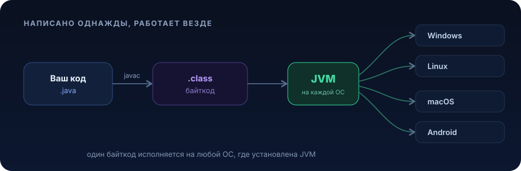
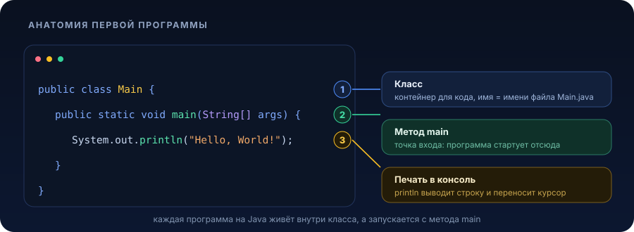
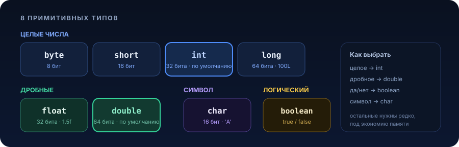

### [Назад к оглавлению](../README.md)

# Введение в платформу Java


Первый урок: как устроена платформа Java, что поставить на компьютер, из чего состоит программа. По ходу разберём переменные, типы данных, арифметику, методы и условие `if`.

<p align="center">
  
</p>

> **В этом уроке**
> [Что такое платформа Java](#что-такое-платформа-java) ·
> [Ставим инструменты](#ставим-инструменты) ·
> [Первая программа](#первая-программа) ·
> [Переменные и типы данных](#переменные-и-типы-данных) ·
> [Арифметика](#арифметика) ·
> [Методы](#методы) ·
> [Условие if](#условие-if) ·
> [Что дальше](#что-дальше) ·
> [Домашнее задание](#домашнее-задание)

## Что такое платформа Java

Java это не только язык, но и платформа. Ты пишешь код в файле `.java`, компилятор превращает его в **байткод** (файл `.class`) — промежуточный формат, не зависящий от операционной системы. Этот байткод исполняет **JVM** (Java Virtual Machine), виртуальная машина, которая есть под Windows, Linux, macOS, Android и десятки других сред.

Отсюда главный принцип: **write once, run anywhere**. Один и тот же `.class` запустится везде, где стоит JVM, а о различиях железа и ОС думает виртуальная машина, а не ты.

За что Java любят в промышленной разработке:

- **Переносимость** — код не привязан к конкретной ОС или процессору
- **Строгая типизация** — компилятор ловит целый класс ошибок ещё до запуска
- **Автоматическая память** — сборщик мусора сам освобождает то, что больше не нужно, работа с указателями руками не требуется
- **Многопоточность из коробки** — язык и стандартная библиотека изначально заточены под параллельность
- **Огромная экосистема** — Spring, Hibernate, Kafka и тысячи библиотек под любую задачу

> **Заметка.** JVM исполняет не только Java. На неё же компилируются Kotlin, Scala, Groovy, Clojure. Освоив платформу, ты открываешь дверь сразу к нескольким языкам.

## Ставим инструменты

Нужны две вещи.

**1. JDK (Java Development Kit)** — набор для разработки: компилятор, JVM и стандартная библиотека. Бери **LTS-версию** (Long-Term Support, с долгой поддержкой). На момент урока это **JDK 21**; свежие 25+ тоже подойдут. Удобнее всего ставить через дистрибутивы [Eclipse Temurin (Adoptium)](https://adoptium.net/) или [Amazon Corretto](https://aws.amazon.com/corretto/) — они бесплатны и без регистрации.

**2. IntelliJ IDEA Community Edition** — бесплатная среда разработки от JetBrains, [скачать здесь](https://www.jetbrains.com/idea/download/). Это индустриальный стандарт для Java: умное автодополнение, подсветка ошибок на лету, запуск в один клик.

Проверить, что JDK встал, можно в терминале:

```bash
java -version
```

Должно вывести что-то вроде `openjdk version "21.0.x"`.

<details>
<summary><b>Создать проект в IntelliJ IDEA за 4 шага</b></summary>

<br>

1. **New Project** на стартовом экране
2. Слева выбери **New Project**, справа задай имя, а в поле **Build system** оставь **IntelliJ** (для первых уроков сборщик Maven/Gradle не нужен)
3. В **JDK** укажи установленный JDK 21. Если его нет в списке, `Add JDK` → путь к папке JDK, либо `Download JDK` прямо из IDEA
4. Галочка **Add sample code** сразу создаст готовый `Main.java` с методом `main`. Нажми **Create**

Запуск: зелёная стрелка ▶ слева от метода `main` или сочетание `Ctrl+Shift+F10` (`Ctrl+R` на macOS). Результат появится в окне **Run** внизу.

</details>

> **Современная Java.** С JDK 11 можно запускать один файл вообще без ручной компиляции: `java Main.java`. Компиляция происходит на лету, отдельный `.class` на диск не пишется. Для экспериментов и мелких проверок это быстрее, чем заводить целый проект.

## Первая программа

Классический «Hello, World!» на Java выглядит так:

```java
public class Main {
    public static void main(String[] args) {
        System.out.println("Hello, World!");
    }
}
```

Разберём по частям, что здесь происходит:

<p align="center">
  
</p>

- `public class Main` — объявление **класса**. Весь код на Java живёт внутри классов. Имя класса должно совпадать с именем файла: класс `Main` лежит в `Main.java`
- `public static void main(String[] args)` — метод `main`, **точка входа**. Выполнение программы всегда начинается отсюда. Смысл слов `public`, `static` и `String[] args` разберём в уроках про ООП и массивы, пока просто запомни сигнатуру
- `System.out.println("Hello, World!")` — печатает строку в консоль и переносит курсор на новую строку

Пара правил, которые пригодятся сразу:

- **Java чувствительна к регистру.** `Main` и `main`, `String` и `string` — разные вещи
- **Инструкции заканчиваются `;`.** После закрывающей `}` точка с запятой не нужна, это не инструкция, а конец блока
- **Комментарии** игнорируются при исполнении и нужны для пояснений:

```java
// однострочный комментарий

/*
   многострочный
   комментарий
*/
```

> **Лайфхак IntelliJ.** Набери `psvm` + `Tab` и IDE развернёт сигнатуру `main`. Набери `sout` + `Tab` — получишь `System.out.println()`. Эти сокращения экономят кучу времени.

> **Современная Java (JDK 25).** Появился упрощённый вход для обучения и скриптов — можно обойтись без класса и параметров:
> ```java
> void main() {
>     IO.println("Hello, World!");
> }
> ```
> Классическую форму знать всё равно нужно: именно её ты будешь видеть в реальных проектах.

## Переменные и типы данных

**Переменная** это именованная ячейка памяти, в которой лежит значение. У каждой переменной есть **тип** — он говорит, что именно там хранится и сколько места нужно.

Типы в Java делятся на две группы: **примитивные** (само значение) и **ссылочные** (ссылка на объект, например `String`). Ссылочные разберём позже, а вот все 8 примитивов:

<p align="center">
  
</p>

| Тип | Что хранит | Диапазон | Пример |
|-----|------------|----------|--------|
| `byte` | целое, 8 бит | −128 … 127 | `byte b = -120;` |
| `short` | целое, 16 бит | −32 768 … 32 767 | `short s = 12442;` |
| `int` | целое, 32 бита | ±2,1 млрд | `int i = 1000;` |
| `long` | целое, 64 бита | ±9,2 · 10¹⁸ | `long l = 200000L;` |
| `float` | дробное, 32 бита | одинарная точность | `float f = 12.23f;` |
| `double` | дробное, 64 бита | двойная точность | `double d = -123.123;` |
| `char` | один символ Unicode | `' '` … `'￿'` | `char c = 'A';` |
| `boolean` | истина/ложь | `true`, `false` | `boolean ok = true;` |

Объявление и инициализация переменной:

```java
int a = 20;        // объявили и сразу задали значение
float b;           // просто объявили
b = 2.25f;         // задали значение позже
```

Три вещи, на которых спотыкаются новички:

- **`long` пишут с `L` на конце**, а **`float` с `f`**: `long big = 20000000000L;`, `float pi = 3.14f;`. Без суффикса компилятор посчитает дробное число за `double` и не даст присвоить его во `float`
- **Не запоминай точные границы** типов наизусть. На старте держись простого правила: целое → `int`, дробное → `double`. К остальным вернёшься, когда упрёшься в память или точность
- **Имена переменных пишут в `camelCase`**: первое слово с маленькой буквы, каждое следующее с большой, без пробелов и подчёркиваний. Правильно: `firstName`, `enginePower`. Неправильно: `FirstName`, `engine_power`, `1name`

Значение можно вычислять на ходу из других переменных:

```java
float radius = 2.0f;
float height = 10.0f;
float volume = 3.1416f * radius * radius * height;
System.out.println("Объём цилиндра равен " + volume);
```

Если переменная не должна меняться, помечай её `final` — это **константа**:

```java
final int daysInWeek = 7;
// daysInWeek = 8;  // ← ошибка компиляции, значение менять нельзя
```

> **Современная Java (`var`).** С JDK 10 тип локальной переменной можно не писать явно — компилятор выведет его сам из значения:
> ```java
> var count = 10;              // int
> var name = "Igor";          // String
> var price = 19.99;          // double
> ```
> Это не «динамическая типизация»: тип по-прежнему фиксирован на этапе компиляции, просто его не приходится дублировать. `var` работает только для локальных переменных с инициализацией.

## Арифметика

Над числами работают привычные операции:

| Операция | Что делает |
|----------|------------|
| `+` `-` `*` `/` | сложение, вычитание, умножение, деление |
| `%` | остаток от деления (`7 % 3` → `1`) |
| `++` `--` | увеличить/уменьшить на 1 |
| `+=` `-=` `*=` `/=` `%=` | операция с присваиванием (`x += 5` это `x = x + 5`) |

```java
int a = 10;
int b = 20;
int c = (a + b - 5) * 2;   // (10 + 20 - 5) * 2 = 50
System.out.println("c = " + c);
```

> **Ловушка целочисленного деления.** `5 / 2` даст `2`, а не `2.5`: если оба операнда целые, результат тоже целый, дробная часть отбрасывается. Чтобы получить `2.5`, хотя бы один операнд должен быть дробным: `5.0 / 2`.

## Методы

**Метод** это именованный кусок кода, который можно вызывать сколько угодно раз. Он принимает **аргументы** (данные на вход) и может **возвращать** результат. Методы избавляют от копипасты и разбивают программу на понятные части.

Общая форма:

```
тип_возвращаемого_значения имя_метода(список_аргументов) {
    тело метода
    return значение;   // если метод что-то возвращает
}
```

Если метод ничего не возвращает, тип результата — `void`, и `return` не нужен.

```java
public class Main {
    public static void main(String[] args) {
        System.out.println(sum(5, 5));   // 10 — метод вернул число, печатаем его
        printHello();                     // метод ничего не возвращает, просто действует
        greet("Java");                    // передаём аргумент
    }

    // принимает два int, возвращает их сумму
    public static int sum(int a, int b) {
        return a + b;
    }

    // ничего не принимает и не возвращает
    public static void printHello() {
        System.out.println("Hello");
    }

    // принимает строку, ничего не возвращает
    public static void greet(String name) {
        System.out.println("Привет, " + name + "!");
    }
}
```

> **Про `static`.** Пока все методы в примерах помечены `static` — без этого их не вызвать напрямую из `main`. Что это значит по-настоящему, разберём в теме ООП. Сейчас достаточно писать `public static` перед методами и не переживать.

## Условие if

`if` выполняет блок кода, только если условие истинно (`true`):

```java
if (5 < 10) {
    System.out.println("5 меньше 10");   // выполнится
}

if (10 < 5) {
    System.out.println("а это — нет");    // условие false, блок пропущен
}
```

Операторы сравнения возвращают `boolean`:

| Оператор | Значение |
|----------|----------|
| `<` `>` | меньше, больше |
| `<=` `>=` | меньше/больше или равно |
| `==` | равно |
| `!=` | не равно |

> **Важно.** Проверка на равенство это **два** знака `==`. Один знак `=` это присваивание. Перепутать легко, а ошибка обидная.

Полная форма с веткой `else` — «иначе»:

```java
int temperature = 15;

if (temperature > 20) {
    System.out.println("Тепло");
} else {
    System.out.println("Прохладно");
}
```

Условия комбинируют логическими операторами: `&&` (И — нужны оба), `||` (ИЛИ — достаточно одного), `!` (НЕ — переворачивает значение):

```java
boolean isWeekend = true;
int hour = 11;

if (isWeekend && hour >= 10) {
    System.out.println("Можно не спешить");
}

if (hour < 6 || hour > 22) {
    System.out.println("Глубокая ночь");
}
```

Для переменной типа `boolean` условие пишут напрямую, без `== true`:

```java
boolean ready = true;
if (ready) { ... }    // если ready == true
if (!ready) { ... }   // если ready == false
```

## Что дальше

К этому моменту ты умеешь:

- [ ] объяснить, что такое JVM и байткод, и зачем нужна «write once, run anywhere»
- [ ] создать и запустить проект в IntelliJ IDEA
- [ ] написать класс с методом `main` и вывести текст в консоль
- [ ] объявлять переменные, различать примитивные типы и выбирать подходящий
- [ ] считать арифметику и помнить про целочисленное деление
- [ ] писать свои методы с аргументами и возвращаемым значением
- [ ] ветвить логику через `if` / `else` и комбинировать условия

Дальше по программе — [оператор `switch`, циклы и массивы](02-control-flow.md). Но сначала закрепи основы практикой.

## Домашнее задание

- [ ] **1.** Создай проект в IntelliJ IDEA и напиши класс с методом `main`
- [ ] **2.** Объяви по одной переменной каждого из 8 примитивных типов и задай им значения
- [ ] **3.** Напиши метод, который принимает четыре `float`-аргумента `a, b, c, d` и возвращает результат выражения `a * (b + (c / d))`
- [ ] **4.** Напиши метод: принимает два целых числа, возвращает `true`, если их сумма лежит в диапазоне от 10 до 20 включительно, иначе `false`
- [ ] **5.** Напиши метод: принимает целое число и печатает в консоль, положительное оно или отрицательное (ноль считаем положительным)
- [ ] **6.** Напиши метод: принимает целое число и возвращает `true`, если оно отрицательное, иначе `false`
- [ ] **7.** Напиши метод: принимает строку-имя и печатает «Привет, <имя>!»
- [ ] **8.** ⭐ Напиши метод, определяющий, високосный ли год: каждый 4-й год високосный, кроме каждого 100-го, но каждый 400-й — снова високосный. Задачу со звёздочкой реши сам, без поиска готового ответа

<details>
<summary><b>Подсказки к задачам</b></summary>

<br>

**Сигнатуры методов** — от них удобно отталкиваться:

```java
public static float calculate(float a, float b, float c, float d) { ... }
public static boolean isSumBetween10And20(int a, int b) { ... }
public static void printSign(int x) { ... }
public static boolean isNegative(int x) { ... }
public static void greet(String name) { ... }
public static boolean isLeapYear(int year) { ... }
```

**Как разбирать задачу по словам** на примере «метод принимает три целых числа и возвращает `true`, если их сумма ≥ 50»:

1. «метод» → `public static ... methodName() { }`
2. «принимает три целых числа» → три параметра `int a, int b, int c`
3. «возвращает `true`/`false`» → тип результата `boolean`, внутри будет `return`
4. «сумма ≥ 50» → собственно логика

```java
public static boolean isSumAtLeast50(int a, int b, int c) {
    int sum = a + b + c;
    return sum >= 50;   // сравнение уже даёт boolean, лишний if не нужен
}
```

**Подсказка к задаче 8.** Оператор `%` даёт остаток от деления. Год високосный, если `year % 4 == 0`, но при этом `year % 100 != 0`, либо `year % 400 == 0`.

</details>

## Дополнительные материалы

- [Дока Java на русском](https://doka.guide/java/) — коротко и по делу
- Кей Хорстманн, «Java. Библиотека профессионала. Том 1. Основы» — фундаментальный справочник
- К. Сьерра, Б. Бейтс, «Изучаем Java» (Head First) — если заходят объяснения «на пальцах»

---

[Оглавление](../README.md) · [Основные конструкции (Урок 2) →](02-control-flow.md)
