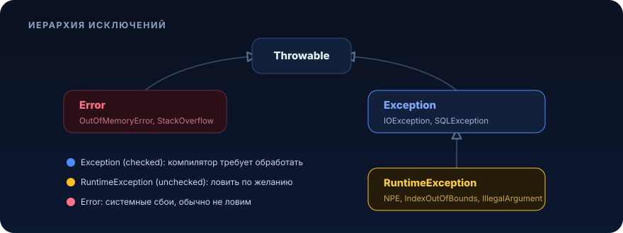
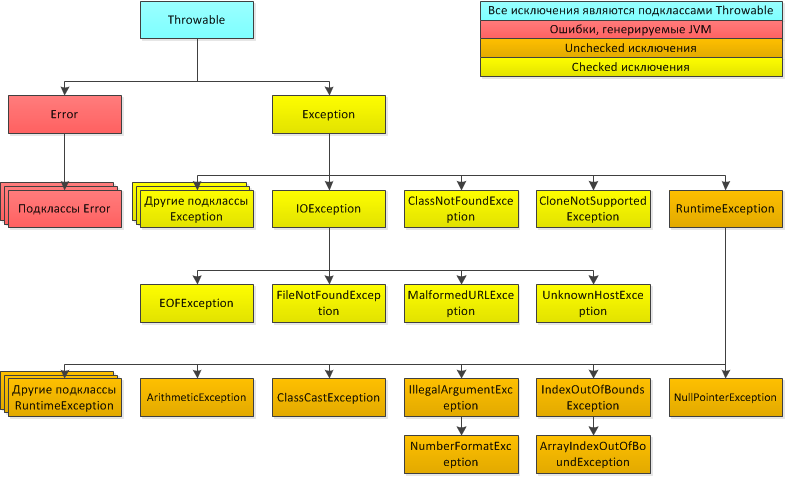

### [Назад к оглавлению](../README.md)

# Концепция обработки исключений


Концепция обработки исключений, её сравнение с
традиционным механизмом обработки ошибок, блок try-catch-finally, типы
исключений, стандартные исключения в Java и их роль, выброс исключения
из метода.

<p align="center">
  
</p>

>
>[Исключения](#исключения)
>>
>> [Блоки операторов try и catch](#блоки-операторов-try-и-catch)
>>
>> [Вывод описания исключения](#вывод-описания-исключения)
>>
>> [Применение нескольких операторов catch](#применение-нескольких-операторов-catch)
>>
>> [Оператор throw](#оператор-throw)
>>
>> [Оператор throws](#оператор-throws)
>>
>> [Оператор finally](#оператор-finally)
>>
>> [Создание собственных подклассов исключений](#создание-собственных-подклассов-исключений)
>>
>> [Многократный перехват исключений](#многократный-перехват-исключений)
>
>[Практическое задание](#практическое-задание)
>
>[Дополнительные материалы](#дополнительные-материалы)
>
>[Используемая литература](#используемая-литература)
>

# Исключения

При работе Java приложений возможно появление различного рода ошибок и
ситуаций, нарушающих нормальный порядок выполнения программы. При их
возникновении Java генерирует объекты одного из подклассов класса
Throwable.

Возникновение объектов типа **Error** или одного из его подклассов,
означает что в процессе выполнения программы возникли серьезные
проблемы, которые не получится перехватить, обработать и каким-то
образом поправить. Они используются для обозначения ошибок, происходящих
в самой исполняющей среде (например, при переполнении стека
(StackOverflowError)).

Исключения (**Exceptions**) также представляют собой объекты,
генерируемые во время появления ошибочных ситуаций и содержащие
информацию о них, но в отличие от Error, исключения могут быть
перехвачены программой, обработаны, что предотвратит завершение работы
приложения. Все исключения можно разделить на две группы:

- *Класс Exception и его подклассы*: исключения, которые обязательно
  должны быть перехвачены программой (Checked).

- *Класс RuntimeException и его подклассы*: исключения, охватывающие
  такие ситуации, как деление на ноль или ошибочная индексация
  массивов (Unchecked).

Иерархия исключений представлена на схеме ниже.



Рисунок 1, Иерархия исключений Java

С Error программист ничего не должен делать, так как он не может
контролировать их появление. А вот Exception, напротив, нужны для того,
чтобы программист мог контролировать их появление. Для этого существует
понятие "Обработка исключений". Обработать исключение можно одним из
двух способов:

- Поместить код, бросающий исключение, в блок try-catch.

- Пробросить исключение методу на уровень выше, то есть методу,
  который вызывает текущий метод. Для этого используется ключевое
  слово throws.

Но есть и третий путь: вообще не обрабатывать исключение. Как видно из
раскраски рисунка 1, существует две группы исключений:

- Checked исключения, если в коде происходит такое исключение, его
  обязательно нужно обработать одним из двух вышеописанных способов.
  Если checked исключение оставить в коде "как есть", то есть без
  try-catch и throws, то возникнет ошибка на этапе компиляции. К
  проверяемым исключениям относятся все наследники Exception кроме
  Runtime Exception.

- Unchecked исключения, их можно обрабатывать если есть вероятность
  возникновения. А можно и не обрабатывать, поскольку предполагается,
  что при правильном поведении программы такие исключения вовсе не
  должны возникать. Действительно, если массив состоит из 8 элементов,
  то код не должен обращаться к десятому. Или любое деление на
  переменную типа int надо было бы обязательно проверять на появление
  ArithmeticException.

> К непроверяемым исключениям относятся все наследники Error и Runtime
> Exception.

В стандартном пакете java.lang определен ряд стандартных исключений.
Ниже приведены некоторые часто встречающиеся подклассы unchecked
исключений, производные от класса RuntimeException.

| Тип исключения                 | Описание                                                    |
|--------------------------------|-------------------------------------------------------------|
| ArithmeticException            | Арифметическая ошибка                                       |
| ArrayIndexOutOfBoundsException | Выход индекса за пределы массива                            |
| ArrayStoreException            | Присваивание элементу массива объекта несовместимого типа   |
| ClassCastException             | Неверное приведение типов                                   |
| IllegalArgumentException       | Употребление недопустимого аргумента при вызове метода      |
| IndexOutOfBoundsException      | Выход индекса некоторого типа за допустимые пределы         |
| NegativeArraySizeException     | Создание массива отрицательного размера                     |
| NullPointerException           | Неверное использование пустой ссылки                        |
| NumberFormatException          | Неверное преобразование символьной строки в числовой формат |

Познакомившись с тем, что из себя представляют исключения в Java,
давайте попробуем с ними немного поработать. Рассмотрим пример кода,
приводящего к ошибке при попытке деления на ноль.

```java
public class MainClass {
    public static void main(String[] args) {
        int a = 0;
        int b = 10 / a;
    }
}
```

При обнаружении попытки деления на ноль исполняющая среда Java
приостанавливает выполнение программы, генерирует исключение и бросает
его. Брошенное исключение должно быть перехвачено обработчиком
исключений, либо прописанным в нашем коде, который в данном примере
отсутствует, либо стандартным обработчиком исключений Java машины
(сейчас именно он и сработает).

При перехвате исключения стандартный обработчик выводит описание
исключения, результат трассировки стека, и прерывает выполнение
программы. Результат выполнения программы:

```
Exception in thread "main" java.lang.ArithmeticException: / by zero
	at MainClass.main(MainClass.java:4)
```

Стоит обратить внимание на то, что в трассировку стека включены имена
класса MainClass, метода main(), файла MainClass.java и номер четвёртой
строки кода. Следует также иметь в виду, что сгенерированное исключение
относится к подклассу ArithmeticException, описывающему тип возникшей
ошибки. В Java представлено несколько встроенных типов исключений,
соответствующих разным видам ошибок.

Трассировка стека позволяет проследить последовательность вызовов
методов, которые привели к ошибке. Далее представлен пример, позволяющий
чуть более подробно рассмотреть этот вопрос:

```java
public class MainClass {
    public static void justMethod() {
        int a = 0;
        int b = 10 / a;
    }

    public static void main(String[] args) {
        justMethod();
    }
}

// Результат:
// Exception in thread "main" java.lang.ArithmeticException: / by zero
//	    at MainClass.justMethod(MainClass.java:4)
//	    at MainClass.main(MainClass.java:8)
```

Как видите, на дне стека находится восьмая строка кода из метода main(),
в которой производится вызов метода justMethod(), вызвавший исключение
при выполнении четвертой строки кода.

## Блоки операторов try и catch

Стандартный обработчик исключений Java удобен для отладки, но, как
правило, обрабатывать исключения приходится вручную, так как это
позволяет исправить возникшую ошибку и предотвратить прерывание
выполнения программы. Для этого достаточно разместить контролируемый код
в блоке оператора try, за которым должен следовать блок оператора саtch,
с указанием типа перехватываемого исключения.

Рассмотрим пример программы, использующей блоки операторов try и catch
для обработки исключения типа ArithmeticException, генерируемого при
попытке деления на ноль:

```java
public static void main(String[] args) {
    int a, b;

    try {
        a = 0;
        b = 10 / a;
        System.out.println("Это сообщение не будет выведено в консоль");
    } catch (ArithmeticException e) {
        System.out.println("Деление на ноль");
    }
    System.out.println("Завершение работы");
}
// Результат:
// Деление на ноль
// Завершение работы
```

Вызов метода println() в блоке оператора try не выполнится, поскольку
при возникновении исключения управление сразу же передаётся из блока try
в блок catch. По завершении блока саtch управление передается в строку
кода, следующую после всего блока операторов try/catch.

Целью большинства правильно построенных операторов catch является
исправление исключительных ситуаций, логирование такого события при
необходимости, и продолжение нормальной работы программы.

**Современный способ:** начиная с Java 10 тип локальной переменной можно
не писать явно, если компилятор способен вывести его из инициализатора,
используется ключевое слово `var`. Компилятор выводит тип на этапе
компиляции, поэтому переменная остаётся строго типизированной, просто
без «шума» в объявлении:

```java
public static void main(String[] args) {
    try {
        var a = 0; // тип int выводится из значения справа
        var b = 10 / a;
        System.out.println("Это сообщение не будет выведено в консоль");
    } catch (ArithmeticException e) {
        System.out.println("Деление на ноль");
    }
    System.out.println("Завершение работы");
}
```

`var` уместен, когда тип и так очевиден из правой части (`var list = new ArrayList<String>()`),
и неуместен, когда тип неочевиден и объявление без него было бы понятнее для читающего код.

## Вывод описания исключения

В классе Throwable определен метод printStackTrace(), который выводит
полную информацию об исключении в консоль, что бывает полезным на этапе
отладки программы. Например:

```java
public static void main(String[] args) {
    System.out.println("Начало");
    try {
        int a = 0;
        int b = 42 / a;
    } catch (ArithmeticException e) {
        e.printStackTrace();
    }
    System.out.println("Конец");
}
//  Результат:
//  Начало
//  java.lang.ArithmeticException: / by zero
//  	at MainClass.main(MainClass.java:7)
//  Конец
```

В приведённом выше примере при делении на ноль была выведена полная
информация об исключении, и программа продолжила свою работу.

## Применение нескольких операторов catch

Иногда в одном фрагменте кода может возникнуть несколько разных
исключений. Чтобы справиться с такой ситуацией, можно указать два или
больше оператора саtch, каждый из которых предназначается для перехвата
отдельного типа исключения. Когда генерируется исключение, каждый
оператор catch проверяется по порядку и выполняется тот из них, который
совпадает по типу с возникшим исключением. По завершении одного из
операторов саtch все остальные пропускаются и выполнение программы
продолжается с оператора, следующего сразу после блока операторов
try/catch. В следующем примере программы перехватываются два разных типа
исключений:

```java
public static void main(String[] args) {
    try {
        int a = 10;
        a -= 10;
        int b = 42 / a;
        int[] c = {1, 2, 3};
        c[42] = 99;
    } catch (ArithmeticException e) {
        System.out.println("Деление на ноль: " + e);
    } catch (ArrayIndexOutOfBoundsException e) {
        System.out.println("Ошибка индексации массива: " + e);
    }
    System.out.println("После блока операторов try/catch");
}
```

Применяя несколько операторов catch, вы должны помнить, что перехват
исключений из подклассов должен следовать до перехвата исключений из
суперклассов. Дело в том, что оператор саtch, в котором перехватывается
исключение из суперкласса, будет перехватывать все исключения этого
суперкласса, а также всех его подклассов. Это означает, что исключения
из подкласса вообще не будут обработаны, если попытаться перехватить их
после исключений из его суперкласса. Кроме того, недостижимый код
считается в Java ошибкой. Рассмотрим в качестве примера следующую
программу.

```java
public static void main(String[] args) {
    try {
        int a = 0;
        int b = 42 / a;
    } catch (Exception e) {
        System.out.println("Exception");
    } catch (ArithmeticException e) { // ошибка компиляции: недостижимый код !
        System.out.println("Этот код недостижим");
    }
}
```

Если попытаться скомпилировать эту программу, то появится сообщение об
ошибке, уведомляющее, что второй оператор catch недостижим, потому что
исключение уже перехвачено. Класс исключения типа ArithmeticException
является производным от класса Exception, и поэтому первый оператор
catch обработает все ошибки, относящиеся к классу Exception, включая и
класс ArithmeticException. Это означает, что второй оператор catch так и
не будет выполнен. Чтобы исправить это положение, придётся изменить
порядок следования операторов саtch.

## Оператор throw

Пока речь шла только об исключениях, генерируемых самой исполняющей
средой Jаvа. Но исключения можно генерировать и непосредственно в
прикладной программе с помощью оператора throw. Его общая форма выглядит
следующим образом:

```
throw генерируемый_экземпляр;
```

Здесь генерируемый экземпляр должен быть объектом класса Throwable или
производного от него подкласса. Поток исполнения программы
останавливается сразу же после оператора throw, и все последующие
операторы не выполняются. В этом случае ближайший объемлющий блок
оператора try проверяется на наличие оператора catch с совпадающим типом
исключения. Если же в коде программы не удастся найти оператор catch,
совпадающий с типом исключения, то стандартный обработчик исключений
прерывает выполнение программы и выводит результат трассировки стека.
Пример:

```java
public static void main(String[] args) {
    try {
        throw new NullPointerException("NPE Test");
    } catch (NullPointerException e) {
        System.out.println("Catch block");
    }
}
```

## Оператор throws

Если метод способен вызвать исключение, которое он сам не обрабатывает,
то он должен задать своё поведение таким образом, чтобы вызывающий его
код мог обезопасить себя от такого исключения. С этой целью в объявление
метода вводится оператор throws, где перечисляются типы исключений,
которые метод может генерировать. В таком случае обычно говорят что
метод "пробрасывает" указанные исключения. Ниже приведена общая форма
объявления метода, которая включает оператор throws.

```
Тип название_метода(список_параметров) throws список_исключений {
…
}
```

Здесь список_исключений обозначает разделяемый запятыми список
исключений, которые метод может сгенерировать. В примере ниже в методе
createReport() может возникнуть исключение IOException, которое сам
метод createReport не обрабатывает, следовательно, вызов этого метода
необходимо взять в блок try/catch.

```java
public static void main(String[] args) {
    try {
        createReport();
    } catch (IOException e) {
        e.printStackTrace();
    }
}

public static void createReport() throws IOException {
    PrintWriter pw = new PrintWriter("report.txt");
    pw.close();
}
```

**Современный способ:** если ресурс (файл, сокет, соединение с БД) нужно
гарантированно закрыть, ручной вызов `close()` не лучшая идея: если между
открытием и `close()` возникнет исключение, ресурс останется открытым. Начиная
с Java 7 для этого есть **try-with-resources**, любой объект, реализующий
`AutoCloseable`, объявленный в скобках после `try`, будет закрыт автоматически,
даже если из блока вылетит исключение:

```java
public static void createReport() throws IOException {
    try (var pw = new PrintWriter("report.txt")) { // pw.close() вызовется автоматически
        pw.println("Отчёт создан");
    } // finally с close() здесь не нужен вообще
}
```

Подробнее про try-with-resources в разделе про `finally` ниже.

## Оператор finally

При возникновении исключения часть кода может оказаться невыполненной.
Так, если исключение произошло в блоке try, то строки кода после
возникновения исключения не будут выполнены, а управление передастся
блоку catch. Это может привести к проблемам.

Например, если файл открывается в начале метода и закрывается в конце,
то может возникнуть проблема с закрытием файла, если в этом методе
возникнет исключение. Для таких непредвиденных обстоятельств и служит
оператор finallу.

Оператор finally образует блок кода, который будет выполнен по
завершении блока операторов try/catch, но перед следующим за ним кодом,
он выполняется независимо от того, было ли сгенерировано исключение или
нет, было ли оно перехвачено блоком catch или нет. Это может быть удобно
для закрытия файловых дескрипторов, либо освобождения других ресурсов,
которые были выделены в начале метода и должны быть освобождены перед
возвратом из него. Блок finally не является обязательным, но каждому
оператору try требуется хотя бы один оператор catch или finally. Ниже
приведена общая форма блока обработки исключений.

```
try {
   // блок кода, в котором отслеживаются исключения
} catch (ТипИсключения1 e1) {
   // обработчик исключения тип_исключения_1
} catch (ТипИсключения2 e2) {
   // обработчик исключения тип_исключения_2
} finally {
   // блок кода, который обязательно выполнится по завершении блока try
}
```

**Важно!** При правильной работе приложения и без попыток системного прерывания **блок finally будет выполнен всегда**.

## Современная Java (7+, актуально и в 21): try-with-resources

Освобождение ресурсов (файлов, соединений, сокетов) через `finally` многословно
и легко забыть закрыть что-то в правильном порядке, особенно если ресурсов
несколько. Java 7 добавила **try-with-resources**: любой объект типа
`AutoCloseable` (у него один метод `close()`), объявленный в скобках после
`try`, закрывается автоматически при выходе из блока, и при нормальном
завершении, и при исключении.

```java
try (var reader = new BufferedReader(new FileReader("report.txt"))) {
    System.out.println(reader.readLine());
} catch (IOException e) {
    e.printStackTrace();
}
// reader.close() вызван автоматически, отдельный finally не нужен
```

Ресурсов может быть несколько, они перечисляются через `;` и закрываются в
обратном порядке объявления:

```java
try (var in = new FileInputStream("in.txt");
     var out = new FileOutputStream("out.txt")) {
    in.transferTo(out);
} // сначала закроется out, потом in
```

**Подавленные исключения (suppressed exceptions).** Если исключение возникло
и в теле `try`, и при автоматическом закрытии ресурса, наружу вылетит
исключение из тела `try`, а исключение из `close()` не потеряется, оно
прикрепится к нему как "подавленное" и доступно через `getSuppressed()`:

```java
try (var pw = new PrintWriter("report.txt")) {
    throw new IllegalStateException("ошибка в теле try");
} catch (IllegalStateException e) {
    for (Throwable suppressed : e.getSuppressed()) {
        System.out.println("Подавлено: " + suppressed);
    }
}
```

Своим классам, управляющим ресурсами, тоже стоит реализовывать `AutoCloseable`,
чтобы их можно было использовать в try-with-resources.

### Создание собственных подклассов исключений

Для создания собственного класса исключений достаточно определить его
как производный от любого класса-исключения (Exception,
RuntimeException, IOException, NullPointerException и др.), его "группа"
(checked или unchecked) будет такой же как и "группа" суперкласса. В
собственных классах исключений даже не обязательно добавлять какие-либо
поля или методы, их присутствия в системе типов уже достаточно, чтобы
пользоваться ими как исключениями.

### Многократный перехват исключений

Начиная с версии Java 7, появилась возможность перехвата и обработки
сразу нескольких исключений в одном и том же операторе catch при
условии, что для этого используется одинаковый код. Для организации
такого перехвата достаточно объединить типы исключений в операторе catch
с помощью логической операции ИЛИ.

```
try {
   …
} catch (ArithmeticException | ArrayIndexOutOfBoundsException e) {
   …
}
```

## Современная Java (14+): понятные сообщения NullPointerException

До Java 14 сообщение `NullPointerException` часто выглядело бесполезно, было
понятно только то, ЧТО что-то оказалось `null`, но не понятно, ЧТО именно, если
в одной строке было несколько обращений подряд:

```java
public static void main(String[] args) {
    String city = order.getCustomer().getAddress().getCity(); // где именно null?
}
```

Начиная с Java 14 (JEP 358, включено по умолчанию с Java 15) JVM формирует
**Helpful NullPointerException** это детализированное сообщение, явно называющее,
какой именно вызов в цепочке вернул `null`:

```
Exception in thread "main" java.lang.NullPointerException:
    Cannot invoke "Address.getCity()" because the return value of
    "Customer.getAddress()" is null
```

Это не требует изменений в коде, просто более информативные сообщения об
ошибке "из коробки", что сильно ускоряет отладку `NullPointerException` в
длинных цепочках вызовов.

# Практическое задание

Задание необходимо сдать через Git. [Инструкция](https://docs.google.com/document/d/1RAT_ukE39iOfbz1xa39QXae2hBUEZ4U6Fko_wFDdrsM/edit)

1. Напишите метод, на вход которого подаётся двумерный строковый массив
   размером 4х4. При подаче массива другого размера необходимо бросить
   исключение MyArraySizeException.
2. Далее метод должен пройтись по всем элементам массива, преобразовать
   в int и просуммировать. Если в каком-то элементе массива
   преобразование не удалось (например, в ячейке лежит символ или текст
   вместо числа), должно быть брошено исключение MyArrayDataException с
   детализацией, в какой именно ячейке лежат неверные данные.
3. В методе main() вызвать полученный метод, обработать возможные
   исключения MyArraySizeException и MyArrayDataException и вывести
   результат расчета.
4. **Дополнительно (по желанию):** перепишите объявление вспомогательных
   локальных переменных с использованием `var` там, где тип очевиден из
   контекста, а если ваше решение сохраняет промежуточный результат в файл,
   используйте для работы с ним `try-with-resources` вместо ручного
   `close()`.

# Дополнительные материалы

1. Кей С. Хорстманн, Гари Корнелл. Java. Библиотека профессионала.
   Том 1. Основы // Пер. с англ. - М.: Вильямс, 2014. - 864 с.
2. Брюс Эккель. Философия Java // 4-е изд.: Пер. с англ. - СПб.:
   Питер, 2016. - 1 168 с.
3. Г. Шилдт. Java 8. Полное руководство // 9-е изд.: Пер. с англ. -
   М.: Вильямс, 2015. - 1 376 с.
4. Г. Шилдт. Java 8: Руководство для начинающих. // 6-е изд.: Пер. с
   англ. - М.: Вильямс, 2015. - 720 с.

# Используемая литература

Для подготовки данного методического пособия были использованы следующие
ресурсы:

1. Г. Шилдт. Java 8. Полное руководство // 9-е изд.: Пер. с англ. -
   М.: Вильямс, 2015. - 1 376 с.

---

[← ООП Java (Урок 1)](01-oop.md) · [Оглавление](../README.md) · [Обобщения (Урок 3) →](03-generics.md)
