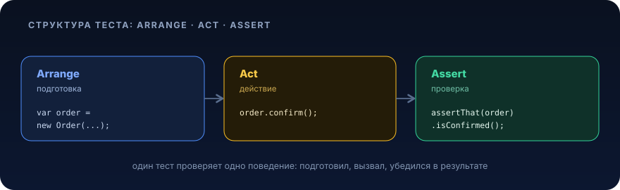

### [Назад к оглавлению](../README.md)

# JUnit 5 (Jupiter)


<p align="center">
  
</p>

Юнит-тесты по-другому называют модульными тестами (англ. unit, «часть», «модуль»).

**Модуль** это целостная часть системы, которая выполняет отдельную задачу и может быть протестирована изолированно от других. Например, модули в
приложении-калькуляторе это сложение, вычитание и другие математические операции.

Модули в коде, отдельные классы и методы в них. Если один модуль сломается, это отразится на всей системе.

В этом уроке используется **JUnit 5** (кодовое имя, Jupiter), актуальная версия платформы тестирования для Java 21. Старый JUnit 4 (`org.junit.Test`,
`@RunWith`, `Assert.assertThat`) считается устаревшим, весь новый код пишут на Jupiter.

### Когда проводят юнит-тесты

Юнит-тесты проводят, когда функциональность ещё не разработана до конца. Это помогает найти ошибки как можно раньше: так легче и дешевле исправить недочёт.

Часто юнит-тесты пишут сами разработчики, чтобы проверять кусочки своего кода как только он написан. Но автоматизатору тоже нужно уметь с ними работать.

## Тестовая пирамида

Тесты принято делить на уровни, которые образуют **пирамиду**, от самого дешёвого и быстрого низа к дорогому и медленному верху:

- **Unit-тесты** (основание пирамиды), проверяют отдельный класс/метод в изоляции. Их много, они быстрые и стабильные.
- **Интеграционные тесты** (середина), проверяют, как несколько компонентов работают вместе (например, сервис + БД). Их меньше, они медленнее.
- **E2E / UI-тесты** (вершина), прогоняют сценарий целиком через интерфейс. Их мало, они самые медленные и хрупкие.

Правило простое: чем ниже уровень, тем больше тестов. Основную массу проверок выносим в дешёвые unit-тесты, а дорогие E2E оставляем для ключевых сценариев.

## Как называть юнит-тесты

Хорошее имя теста описывает **поведение**: что проверяем, при каких условиях и какой результат ожидаем. Распространённая схема, `should_X_when_Y`:

- `should`, что должно произойти.
- `when`, при каких входных данных/условиях.

Примеры:

- `should_returnSum_when_bothNumbersPositive`
- `should_throwException_when_divisorIsZero`
- `should_showError_when_amountIsZero`

**Пиши ожидаемый результат конкретно.** Например, `showError` или `balanceIncreased`, если должен пополниться баланс. Не стоит писать `worksCorrect`
или `everythingIsOk`, непонятно, что именно значит «правильно работает».

Если хочется описать кейс по-русски и человекочитаемо, добавь аннотацию `@DisplayName`, она не заменяет осмысленное имя метода, а дополняет его:

```java
@Test
@DisplayName("Сумма двух положительных чисел")
void should_returnSum_when_bothNumbersPositive() {
    // ...
}
```

## Аннотации жизненного цикла

В JUnit 5 аннотации живут в пакете `org.junit.jupiter.api`. В отличие от JUnit 4, методам **не нужен** модификатор `public`, достаточно
package-private (без модификатора).

**`@Test`**, помечает тестовый метод. Без неё JUnit метод не запустит.

**`@BeforeEach`** (замена JUnit 4 `@Before`), выполняется перед **каждым** тестом. Обычно тут готовят свежие данные, чтобы тесты не влияли друг на друга.

**`@AfterEach`** (замена `@After`), выполняется после каждого теста. Например, удалить всё, что создали, записи в БД, файлы и так далее.

**`@BeforeAll`** (замена `@BeforeClass`), выполняется **один раз** перед всеми тестами класса. Метод должен быть `static`. Подходит для тяжёлой
подготовки (поднять контейнер, открыть соединение).

**`@AfterAll`** (замена `@AfterClass`), выполняется один раз после всех тестов класса. Тоже `static`.

**`@Disabled`** (замена `@Ignore`), временно отключает тест или весь класс. Обязательно указывай причину: `@Disabled("FBS-1234: чиним флаки-тест")`.

```java
import org.junit.jupiter.api.AfterAll;
import org.junit.jupiter.api.AfterEach;
import org.junit.jupiter.api.BeforeAll;
import org.junit.jupiter.api.BeforeEach;
import org.junit.jupiter.api.Disabled;
import org.junit.jupiter.api.Test;

import java.io.File;
import java.io.IOException;
import java.nio.file.Files;

class FileExampleTest {

    private File file;

    @BeforeAll
    static void initAll() {
        // выполняется один раз перед всеми тестами класса
    }

    // создаём тестовый файл перед каждым тестом
    @BeforeEach
    void createOutputFile() throws IOException {
        file = Files.createTempFile("example", ".txt").toFile();
    }

    @Test
    void should_writeContent_when_fileExists() {
        // выполняем тесты, используя файл
    }

    @Disabled("FBS-1234: включим после доработки хранилища")
    @Test
    void should_appendContent_when_fileExists() {
        // временно отключённый тест
    }

    // удаляем тестовый файл после каждого теста
    @AfterEach
    void deleteOutputFile() {
        file.delete();
    }

    @AfterAll
    static void tearDownAll() {
        // выполняется один раз после всех тестов класса
    }
}
```

### Группировка и теги

**`@Nested`** позволяет сгруппировать связанные тесты во вложенный класс, так структура читается как «сценарий → его подслучаи».

**`@Tag`** навешивает метку на тест или класс, чтобы потом запускать/исключать группы (например, `@Tag("slow")`) через конфигурацию Surefire.

```java
import org.junit.jupiter.api.DisplayName;
import org.junit.jupiter.api.Nested;
import org.junit.jupiter.api.Tag;
import org.junit.jupiter.api.Test;

import static org.assertj.core.api.Assertions.assertThat;

class CalculatorTest {

    private final Calculator calculator = new Calculator();

    @Nested
    @DisplayName("Сложение")
    class Sum {

        @Test
        void should_returnSum_when_bothPositive() {
            assertThat(calculator.sum(2, 3)).isEqualTo(5);
        }

        @Test
        @Tag("edge-case")
        void should_returnSameNumber_when_addingZero() {
            assertThat(calculator.sum(7, 0)).isEqualTo(7);
        }
    }
}
```

## Assert: проверка утверждений

Любой тест прежде всего проверяет, как работает система. В JUnit 5 статические методы-проверки собраны в классе
`org.junit.jupiter.api.Assertions`. Их удобно импортировать статически:

```java
import static org.junit.jupiter.api.Assertions.assertEquals;
import static org.junit.jupiter.api.Assertions.assertTrue;
import static org.junit.jupiter.api.Assertions.assertThrows;
import static org.junit.jupiter.api.Assertions.assertAll;
```

### `assertEquals`: сравнить значения

`assertEquals(expected, actual)`, ожидаемое значение сравнивают с фактическим. Работает и для чисел, и для строк, и для объектов (через `equals`).

**Пример.** В интернет-магазине можно добавлять один и тот же продукт в корзину, нажимая `+`. Если кликнули четыре раза, в корзине должно быть четыре
продукта:

```java
@Test
void should_beFour_when_addedFourTimes() {
    int expected = 4;   // ожидаемое значение
    int actual = 4;     // фактическое значение
    assertEquals(expected, actual);
}
```

Для строк, точно так же:

```java
@Test
void should_matchErrorText_when_passwordsDiffer() {
    String expected = "Пароли должны совпадать";
    String actual = "Что-то пошло не так";
    assertEquals(expected, actual); // тест упадёт: строки не равны
}
```

**Сообщение об ошибке** в JUnit 5 передают **последним** аргументом (в JUnit 4 оно было первым это важное отличие). Лучше передавать его лямбдой,
тогда строка вычисляется только при падении:

```java
@Test
void should_matchErrorText_when_passwordsDiffer() {
    String expected = "Пароли должны совпадать";
    String actual = "Что-то пошло не так";
    assertEquals(expected, actual, () -> "Неверный текст ошибки!");
}
```

### `assertEquals` для дробных чисел

У чисел с плавающей точкой есть погрешность, поэтому их сравнивают с допуском `delta`: `assertEquals(expected, actual, delta)`.

**Пример.** Масса брикета масла, примерно одинаковая с допустимой погрешностью в 0.05 грамма:

```java
@Test
void should_beWithinTolerance_when_weighingButter() {
    double expected = 180.00;
    double actual = 180.05;
    assertEquals(expected, actual, 0.05); // разница не превышает delta, тест зелёный
}
```

### `assertTrue` / `assertFalse`

Проверяют, что условие истинно/ложно:

```java
@Test
void should_beActive_when_orderCreated() {
    Order order = new Order();
    assertTrue(order.isActive(), "заказ должен быть активным сразу после создания");
}
```

### `assertThrows`: проверка исключений

Часто нужно убедиться, что метод **бросает** исключение на некорректных данных. Для этого есть `assertThrows`, он возвращает пойманное исключение, и
его можно дополнительно проверить:

```java
@Test
void should_throwException_when_divisorIsZero() {
    Calculator calculator = new Calculator();

    ArithmeticException exception = assertThrows(
            ArithmeticException.class,
            () -> calculator.divide(10, 0)
    );

    assertEquals("/ by zero", exception.getMessage());
}
```

### `assertAll`: сгруппировать проверки

Если в одном тесте несколько независимых проверок, оберни их в `assertAll`, тогда выполнятся **все**, и в отчёте будут видны сразу все упавшие
(а не только первая):

```java
@Test
void should_fillAllFields_when_orderMapped() {
    OrderDto dto = mapper.toDto(order);

    assertAll(
            () -> assertEquals(1L, dto.id()),
            () -> assertEquals("CREATED", dto.status()),
            () -> assertTrue(dto.amount() > 0)
    );
}
```

## AssertJ, рекомендуемый стиль

В JUnit 4 был метод `Assert.assertThat` с Hamcrest-матчерами. В JUnit 5 его **нет**, вместо него для «текучих» (fluent) проверок используют
библиотеку **AssertJ**. Это основной рекомендуемый стиль ассертов: он читается как естественный язык, даёт подробные сообщения об ошибке и имеет
автодополнение под каждый тип.

Точка входа, статический метод `org.assertj.core.api.Assertions.assertThat`, от него по цепочке вызываются проверки:

```java
import static org.assertj.core.api.Assertions.assertThat;
import static org.assertj.core.api.Assertions.assertThatThrownBy;

class AssertJExampleTest {

    @Test
    void should_matchNumber() {
        assertThat(10)
                .isEqualTo(10)
                .isGreaterThan(5)
                .isPositive();
    }

    @Test
    void should_matchString() {
        String actual = "Java";
        assertThat(actual)
                .startsWith("J")
                .endsWith("va")
                .contains("av")
                .hasSize(4);
    }

    @Test
    void should_matchCollection() {
        var numbers = List.of(1, 2, 3);
        assertThat(numbers)
                .hasSize(3)
                .containsExactly(1, 2, 3)          // ровно эти элементы и в этом порядке
                .contains(2)
                .doesNotContain(4);
    }

    @Test
    void should_notBeNull() {
        String actual = "Java";
        assertThat(actual).isNotNull();
    }

    @Test
    void should_throw_when_divisorIsZero() {
        Calculator calculator = new Calculator();
        assertThatThrownBy(() -> calculator.divide(10, 0))
                .isInstanceOf(ArithmeticException.class)
                .hasMessage("/ by zero");
    }
}
```

Полезные проверки AssertJ, которые заменяют старые Hamcrest-матчеры:

| Что проверяем              | Hamcrest (JUnit 4, устарело) | AssertJ (актуально)                      |
|----------------------------|------------------------------|------------------------------------------|
| равенство                  | `is(10)`                     | `isEqualTo(10)`                          |
| строка содержит подстроку  | `containsString("va")`       | `contains("va")`                         |
| строка начинается с        | `startsWith("J")`            | `startsWith("J")`                        |
| строка заканчивается на    | `endsWith("va")`             | `endsWith("va")`                         |
| не null                    | `notNullValue()`             | `isNotNull()`                            |
| несколько условий сразу    | `allOf(...)`                 | цепочка проверок / `satisfies(...)`      |
| хотя бы одно из условий    | `anyOf(...)`                 | `satisfiesAnyOf(...)`                    |
| размер коллекции           |,                            | `hasSize(3)`                             |
| точный состав коллекции    |,                            | `containsExactly(...)`                   |

## Параметризованные тесты

Когда тесты отличаются только тестовыми данными, применяют **параметризацию**, она отделяет данные от кода. В JUnit 4 для этого нужен был громоздкий
`@RunWith(Parameterized.class)` с конструктором и полями класса. В JUnit 5 всё гораздо проще: `@ParameterizedTest` плюс источник данных.

Для параметризованных тестов нужна зависимость `junit-jupiter-params` (входит в агрегатор `junit-jupiter`).

Возьмём калькулятор:

```java
package ru.example;

public class Calculator {

    public int sum(int a, int b) {
        return a + b;
    }

    public int divide(int a, int b) {
        return a / b; // при b == 0 бросит ArithmeticException
    }
}
```

### `@ValueSource`: один параметр

Самый простой случай, один аргумент на запуск:

```java
import org.junit.jupiter.params.ParameterizedTest;
import org.junit.jupiter.params.provider.ValueSource;

import static org.assertj.core.api.Assertions.assertThat;

class NumberTest {

    @ParameterizedTest
    @ValueSource(ints = {2, 4, 100, -8})
    void should_beEven_when_numberIsEven(int number) {
        assertThat(number % 2).isZero();
    }
}
```

### `@CsvSource`: несколько параметров

Каждая строка CSV это отдельный запуск теста; значения через запятую раскладываются по параметрам метода. Идеально для «вход → ожидаемый результат»:

```java
import org.junit.jupiter.params.ParameterizedTest;
import org.junit.jupiter.params.provider.CsvSource;

import static org.assertj.core.api.Assertions.assertThat;

class CalculatorCsvTest {

    private final Calculator calculator = new Calculator();

    @ParameterizedTest(name = "{0} + {1} = {2}")
    @CsvSource({
            "1, 9, 10",
            "1, 0, 1",
            "-5, 5, 0",
            "-3, -7, -10"
    })
    void should_returnSum_when_numbersGiven(int first, int second, int expected) {
        assertThat(calculator.sum(first, second)).isEqualTo(expected);
    }
}
```

Сравни с JUnit 4: не нужны ни `@RunWith`, ни поля класса, ни конструктор, ни двумерный `Object[][]`, весь тест умещается в один метод.

### `@MethodSource`: данные из метода

Когда данных нужно больше или их надо вычислять, источником становится статический метод, возвращающий `Stream<Arguments>`:

```java
import org.junit.jupiter.params.ParameterizedTest;
import org.junit.jupiter.params.provider.Arguments;
import org.junit.jupiter.params.provider.MethodSource;

import java.util.stream.Stream;

import static org.assertj.core.api.Assertions.assertThat;
import static org.junit.jupiter.params.provider.Arguments.arguments;

class CalculatorMethodSourceTest {

    private final Calculator calculator = new Calculator();

    @ParameterizedTest
    @MethodSource("sumData")
    void should_returnSum_when_numbersGiven(int first, int second, int expected) {
        assertThat(calculator.sum(first, second)).isEqualTo(expected);
    }

    static Stream<Arguments> sumData() {
        return Stream.of(
                arguments(1, 9, 10),
                arguments(1, 0, 1),
                arguments(-5, 5, 0)
        );
    }
}
```

Тестовые данные подбирай по техникам тест-дизайна: классы эквивалентности и граничные значения.

## Подключение зависимостей (Maven)

Для JUnit 5 достаточно одного агрегирующего артефакта `junit-jupiter`, он подтягивает `junit-jupiter-api`, `junit-jupiter-engine` и
`junit-jupiter-params`. Плюс `assertj-core` для fluent-ассертов.

```xml
<dependencies>
    <dependency>
        <groupId>org.junit.jupiter</groupId>
        <artifactId>junit-jupiter</artifactId>
        <version>5.11.4</version>
        <scope>test</scope>
    </dependency>

    <dependency>
        <groupId>org.assertj</groupId>
        <artifactId>assertj-core</artifactId>
        <version>3.27.3</version>
        <scope>test</scope>
    </dependency>
</dependencies>
```

Чтобы Maven запускал Jupiter-тесты, нужен свежий `maven-surefire-plugin` (современные версии подхватывают JUnit 5 из коробки):

```xml
<build>
    <plugins>
        <plugin>
            <groupId>org.apache.maven.plugins</groupId>
            <artifactId>maven-surefire-plugin</artifactId>
            <version>3.5.2</version>
        </plugin>
    </plugins>
</build>
```

Запуск тестов, стандартной командой:

```bash
mvn test
```

## Лучшие практики

- **Одно поведение, один тест.** Не проверяй пять несвязанных вещей в одном методе; для нескольких проверок одного результата используй `assertAll` или
  цепочку AssertJ.
- **Имена по схеме `should_X_when_Y`**, плюс `@DisplayName` для человекочитаемого описания бизнес-кейса.
- **Независимость тестов.** Свежие данные готовь в `@BeforeEach`, чистку, в `@AfterEach`. Тесты не должны зависеть от порядка запуска.
- **AssertJ как основной стиль ассертов**, он читаемее и даёт лучшие сообщения об ошибке, чем «голые» `assertEquals`.
- **Параметризация вместо копипасты**: если тесты отличаются только данными это `@ParameterizedTest`.
- **`@Disabled` только с причиной** (тикетом), а не «чтобы сборка была зелёной».
- **Больше unit-тестов, меньше E2E**, держи форму пирамиды.

## Домашнее задание

Дан простой класс-валидатор пароля:

```java
package ru.example;

public class PasswordValidator {

    /**
     * Пароль валиден, если он не null, длиной от 8 до 20 символов
     * и содержит хотя бы одну цифру.
     */
    public boolean isValid(String password) {
        if (password == null) {
            throw new IllegalArgumentException("password must not be null");
        }
        if (password.length() < 8 || password.length() > 20) {
            return false;
        }
        return password.chars().anyMatch(Character::isDigit);
    }
}
```

Напиши для него тесты на **JUnit 5 + AssertJ**. В набор должны войти:

1. Обычные `@Test` на позитивные и негативные случаи (валидный пароль, слишком короткий, слишком длинный, без цифры), с осмысленными именами
   `should_X_when_Y` и `@DisplayName`.
2. **Параметризованный тест** (`@ParameterizedTest` + `@CsvSource` или `@MethodSource`), который на наборе «пароль → ожидаемый результат» проверяет
   метод `isValid` разом на нескольких значениях.
3. Проверку исключения через `assertThrows` (или `assertThatThrownBy` из AssertJ), что на `null` метод бросает `IllegalArgumentException` с нужным
   сообщением.
4. Все проверки, через `assertThat(...)` из AssertJ, где это уместно.

Как продвинутый вариант, сгруппируй позитивные и негативные кейсы во вложенные классы через `@Nested`.

---

[← Git](01-git.md) · [Оглавление](../README.md) · [JUnit + Mockito →](04-mockito.md)
