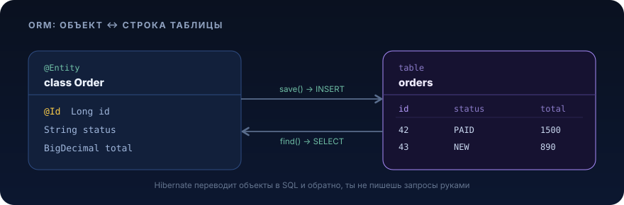

# Hibernate (ORM)


<p align="center">
  
</p>

## Зачем это нужно / какую проблему решает

Представь, что ты пишешь сервис заказов. Есть таблица `orders`, таблица `order_item`, таблица `customer`. Тебе нужно достать заказ вместе с позициями и покупателем, показать их в API, а потом обновить статус. На голом JDBC один такой сценарий выглядит так:

```java
// Голый JDBC: достать заказ с позициями
String sql = """
    SELECT o.id, o.status, o.created_at,
           i.id AS item_id, i.sku, i.qty, i.price
    FROM orders o
    LEFT JOIN order_item i ON i.order_id = o.id
    WHERE o.id = ?
    """;
try (var ps = connection.prepareStatement(sql)) {
    ps.setLong(1, orderId);
    try (var rs = ps.executeQuery()) {
        Order order = null;
        while (rs.next()) {
            if (order == null) {
                order = new Order();
                order.setId(rs.getLong("id"));
                order.setStatus(OrderStatus.valueOf(rs.getString("status")));
                order.setCreatedAt(rs.getTimestamp("created_at").toLocalDateTime());
                order.setItems(new ArrayList<>());
            }
            long itemId = rs.getLong("item_id");
            if (!rs.wasNull()) {
                var item = new OrderItem();
                item.setId(itemId);
                item.setSku(rs.getString("sku"));
                item.setQty(rs.getInt("qty"));
                item.setPrice(rs.getBigDecimal("price"));
                order.getItems().add(item);
            }
        }
        return order;
    }
}
```

И это только чтение одного заказа. А ещё нужны: вставка с возвратом сгенерированного `id`, `UPDATE` только изменившихся полей, обработка `NULL`, конвертация типов (`Timestamp → LocalDateTime`, `String → enum`), схлопывание строк join'а в один объект с коллекцией. На каждый запрос, руками. Меняется схема, переписываешь маппинг в десятке мест. Это называется **object-relational impedance mismatch**: мир объектов (графы ссылок, наследование, коллекции) и мир таблиц (строки, внешние ключи, join'ы) устроены по-разному, и мост между ними ты строишь вручную снова и снова.

**ORM (Object-Relational Mapping)** автоматизирует этот мост. Ты описываешь, какому классу соответствует какая таблица, а библиотека сама генерирует `SELECT/INSERT/UPDATE/DELETE`, конвертирует типы, собирает графы объектов и отслеживает изменения. Тот же сценарий на Hibernate:

```java
Order order = orderRepository.findById(orderId).orElseThrow();
order.setStatus(OrderStatus.SHIPPED);   // UPDATE сгенерируется сам при коммите
```

Две строки вместо пятидесяти. Hibernate, самая распространённая реализация ORM для Java, и именно на ней по умолчанию работает Spring Data JPA.

Важная оговорка, которую курс проговаривает жёстко: **ORM не отменяет знание SQL, он его прячет**. Пока всё работает, ты не видишь запросов. Когда прод тормозит из-за N+1 или неожиданного декартова произведения, тебе придётся читать сгенерированный SQL и понимать план выполнения. Поэтому SQL учат **до** Hibernate, а не вместо. Hibernate это ускоритель для того, кто уже понимает, что происходит в базе.

## Ключевые понятия

### JPA vs Hibernate

Это постоянная путаница у джунов, разложим раз и навсегда.

- **JPA (Jakarta Persistence API)** это **спецификация**, набор интерфейсов и аннотаций (`@Entity`, `@Id`, `EntityManager`, `@OneToMany`...). Сама по себе JPA ничего не делает это контракт. В Spring Boot 3 пакет называется `jakarta.persistence.*` (раньше был `javax.persistence.*`, если видишь `javax`, это устаревший код под Java EE / Spring Boot 2, в нашем стеке так писать нельзя).
- **Hibernate**, конкретная **реализация** этой спецификации (провайдер). Есть и другие (EclipseLink), но де-факто стандарт, Hibernate 6.x.
- **Spring Data JPA**, надстройка Spring, которая избавляет от рутины: генерирует реализации репозиториев по интерфейсам, даёт `JpaRepository` с готовыми `save/findById/findAll`, деривацию запросов по имени метода.

Иерархия по слоям: `твой код → Spring Data JPA → JPA (спека) → Hibernate (реализация) → JDBC → PostgreSQL`. Пишешь ты в основном против JPA-аннотаций и Spring Data, но понимать поведение нужно на уровне Hibernate, потому что именно он решает, какой SQL и когда выполнить.

### @Entity, @Id, @GeneratedValue

`@Entity` помечает класс как сущность, объект, который Hibernate умеет хранить в таблице. Каждой сущности нужен первичный ключ, поле с `@Id`.

`@GeneratedValue` говорит, кто генерирует значение ключа. Ключевая для PostgreSQL стратегия, `IDENTITY` (колонка `BIGSERIAL` / `GENERATED ... AS IDENTITY`, база сама выдаёт id при вставке) либо `SEQUENCE` (Hibernate берёт значения из последовательности заранее и может батчить вставки).

```java
@Id
@GeneratedValue(strategy = GenerationType.IDENTITY)
private Long id;
```

Нюанс производительности: при `IDENTITY` Hibernate **не может** батчить `INSERT`, ему нужно узнать сгенерированный id сразу после каждой вставки. При `SEQUENCE` с `allocationSize` он резервирует диапазон id и вставляет пачкой. Для высоконагруженных вставок на PostgreSQL предпочтительнее `SEQUENCE`.

### Связи: @OneToMany, @ManyToOne, @ManyToMany, mappedBy, каскады

Связи между таблицами (внешние ключи) отображаются на ссылки между объектами.

- **`@ManyToOne`**, «многие к одному». Много `OrderItem` ссылаются на один `Order`. Это **владеющая** сторона, здесь физически лежит внешний ключ (`order_item.order_id`).
- **`@OneToMany`**, обратная сторона той же связи: у одного `Order` много `OrderItem`. Помечается `mappedBy = "order"` это значит «я не владею связью, внешний ключ управляется полем `order` на другой стороне». Без `mappedBy` Hibernate решит, что это две разные связи, и создаст лишнюю join-таблицу.
- **`@ManyToMany`**, «многие ко многим», через промежуточную таблицу. На практике часто лучше явно завести сущность-связку с `@ManyToOne` на обе стороны (чтобы хранить доп. поля вроде количества/даты).

**Владеющая сторона важна:** Hibernate пишет в БД только по владеющей стороне. Если ты добавишь элемент в коллекцию `@OneToMany(mappedBy=...)`, но не проставишь обратную ссылку `@ManyToOne`, внешний ключ в базе не запишется. Поэтому заводят хелпер:

```java
public void addItem(OrderItem item) {
    items.add(item);
    item.setOrder(this);   // синхронизируем обе стороны
}
```

**Каскады (`cascade`)**, какие операции пробрасывать с родителя на детей. `CascadeType.PERSIST`, сохранил заказ, сохранились и позиции. `CascadeType.ALL` включает всё, включая `REMOVE`. **`orphanRemoval = true`**, если убрал позицию из коллекции, она удалится из БД (сирота без родителя). Не ставь `CascadeType.REMOVE`/`ALL` на `@ManyToOne`, иначе удаление одной позиции может каскадно снести родительский заказ.

### Жизненный цикл сущности: transient / persistent / detached / removed

Объект-сущность в каждый момент находится в одном из состояний относительно **persistence context** (контекста персистентности, он же сессия Hibernate, живёт обычно в рамках одной транзакции):

- **transient (новый)**, `new Order()`, Hibernate про него не знает, в БД записи нет.
- **persistent (управляемый)**, объект привязан к контексту (после `save`/`persist` или после загрузки из БД). Hibernate следит за ним: любое изменение полей будет синхронизировано с БД при flush/commit. Это ключевое состояние.
- **detached (отсоединённый)**, контекст закрылся (транзакция завершилась), объект остался в памяти, но за его изменениями Hibernate больше не следит. Чтобы снова управлять, `merge`.
- **removed (удалённый)**, помечен на удаление (`remove`), `DELETE` уйдёт в БД при flush.

Понимать это критично: одна и та же строка кода `order.setStatus(...)` в persistent-состоянии порождает `UPDATE`, а в detached, не делает ничего в базе. «Почему мои изменения не сохранились?», почти всегда объект был detached (например, изменён вне транзакции).

### Первый уровень кэша (L1)

Persistence context это ещё и **кэш первого уровня**. В пределах одной транзакции повторный `findById` с тем же id **не пойдёт в базу**, вернётся тот же самый объект из кэша. Гарантия: внутри одной сессии одному id соответствует ровно один экземпляр объекта (identity). L1-кэш включён всегда, его нельзя выключить, и он не разделяется между транзакциями/потоками.

### Lazy vs Eager и проблема N+1

Когда грузишь заказ, подтягивать ли сразу все его позиции? Это стратегия загрузки связи (`fetch`):

- **LAZY (ленивая)**, связь грузится только при первом обращении к ней. Пока не вызвал `order.getItems()`, отдельного запроса нет. По умолчанию `@OneToMany` и `@ManyToMany`, LAZY.
- **EAGER (жадная)**, связь грузится сразу вместе с сущностью. По умолчанию `@ManyToOne` и `@OneToOne`, EAGER.

**Проблема N+1**, классические грабли ORM. Грузишь список из N заказов одним запросом, потом в цикле у каждого читаешь `getItems()`, и Hibernate делает по отдельному запросу на каждый заказ. Итого **1 + N** запросов вместо одного-двух. На 500 заказах это 501 обращение к БД.

```java
List<Order> orders = orderRepository.findAll();     // 1 запрос
for (Order o : orders) {
    o.getItems().size();                            // +N запросов (по одному на заказ!)
}
```

Решение, загрузить связь заранее одним запросом: `JOIN FETCH` в JPQL или `@EntityGraph`. Именно ради контроля над N+1 и нужно уметь читать сгенерированный SQL (`spring.jpa.show-sql` / hibernate statistics).

### Dirty checking (грязная проверка)

Hibernate при загрузке запоминает снимок полей сущности. При flush он сравнивает текущее состояние со снимком и **сам** генерирует `UPDATE` для изменившихся сущностей. Тебе **не нужно** вызывать `save()` для уже управляемого объекта, достаточно поменять поле в рамках транзакции:

```java
@Transactional
public void ship(Long orderId) {
    Order order = orderRepository.findById(orderId).orElseThrow();
    order.setStatus(OrderStatus.SHIPPED);   // всё; UPDATE уйдёт на коммите автоматически
}
```

Обратная сторона: не вызывай `save()` в цикле бездумно и помни, что dirty checking стоит CPU на больших сессиях, для read-only операций ставь `@Transactional(readOnly = true)`, чтобы Hibernate не делал снимков и не пытался flush'ить.

### Зачем сначала знать SQL

Повторим, потому что это философия курса. Hibernate генерирует SQL за тебя, но:
- N+1, декартовы взрывы при нескольких `JOIN FETCH` коллекций, лишние `UPDATE`, всё это видно только в сгенерированном SQL;
- индексы, планы выполнения, транзакционные аномалии (см. раздел роадмапа про изоляцию транзакций), вне зоны ответственности ORM;
- сложную аналитику всё равно пишут нативным SQL.

ORM, инструмент поверх SQL, а не замена ему. Джун, который «знает Hibernate, но не знает SQL», беспомощен ровно в тех местах, где Hibernate ломается.

## Примеры на Java

Реалистичный кусочек сервиса заказов: две связанные сущности, репозиторий, сервис, контроллер, конфиг. Всё на Java 21 / Spring Boot 3, импорты, `jakarta.*`.

### Сущности

```java
package com.example.shop.order;

import jakarta.persistence.CascadeType;
import jakarta.persistence.Column;
import jakarta.persistence.Entity;
import jakarta.persistence.EnumType;
import jakarta.persistence.Enumerated;
import jakarta.persistence.GeneratedValue;
import jakarta.persistence.GenerationType;
import jakarta.persistence.Id;
import jakarta.persistence.OneToMany;
import jakarta.persistence.Table;
import java.time.Instant;
import java.util.ArrayList;
import java.util.List;

@Entity
@Table(name = "orders")   // "order", зарезервированное слово в SQL, поэтому orders
public class Order {

    @Id
    @GeneratedValue(strategy = GenerationType.IDENTITY)
    private Long id;

    @Enumerated(EnumType.STRING)   // храним enum строкой, а не порядковым числом
    @Column(nullable = false)
    private OrderStatus status = OrderStatus.CREATED;

    @Column(nullable = false, updatable = false)
    private Instant createdAt = Instant.now();

    // Владеет связью OrderItem (там лежит order_id). LAZY, не тянем позиции без надобности.
    // cascade = ALL + orphanRemoval: позиции живут и умирают вместе с заказом.
    @OneToMany(mappedBy = "order", cascade = CascadeType.ALL, orphanRemoval = true)
    private List<OrderItem> items = new ArrayList<>();

    protected Order() {
        // JPA требует конструктор без аргументов
    }

    public Order(OrderStatus status) {
        this.status = status;
    }

    // Хелпер синхронизирует обе стороны связи, иначе order_id не запишется
    public void addItem(OrderItem item) {
        items.add(item);
        item.setOrder(this);
    }

    public void ship() {
        if (status != OrderStatus.CREATED) {
            throw new IllegalStateException("Отгрузить можно только новый заказ");
        }
        this.status = OrderStatus.SHIPPED;   // dirty checking сам сделает UPDATE
    }

    public Long getId() {
        return id;
    }

    public OrderStatus getStatus() {
        return status;
    }

    public Instant getCreatedAt() {
        return createdAt;
    }

    public List<OrderItem> getItems() {
        return List.copyOf(items);   // наружу, неизменяемая копия
    }
}
```

```java
package com.example.shop.order;

import jakarta.persistence.Column;
import jakarta.persistence.Entity;
import jakarta.persistence.FetchType;
import jakarta.persistence.GeneratedValue;
import jakarta.persistence.GenerationType;
import jakarta.persistence.Id;
import jakarta.persistence.JoinColumn;
import jakarta.persistence.ManyToOne;
import jakarta.persistence.Table;
import java.math.BigDecimal;

@Entity
@Table(name = "order_item")
public class OrderItem {

    @Id
    @GeneratedValue(strategy = GenerationType.IDENTITY)
    private Long id;

    // Владеющая сторона: внешний ключ order_id физически здесь.
    // LAZY, хотя @ManyToOne по умолчанию EAGER, явно избегаем ненужной подгрузки заказа.
    @ManyToOne(fetch = FetchType.LAZY, optional = false)
    @JoinColumn(name = "order_id", nullable = false)
    private Order order;

    @Column(nullable = false)
    private String sku;

    @Column(nullable = false)
    private int qty;

    @Column(nullable = false)
    private BigDecimal price;

    protected OrderItem() {
    }

    public OrderItem(String sku, int qty, BigDecimal price) {
        this.sku = sku;
        this.qty = qty;
        this.price = price;
    }

    void setOrder(Order order) {   // package-private: дёргается только из Order.addItem
        this.order = order;
    }

    public Long getId() {
        return id;
    }

    public String getSku() {
        return sku;
    }

    public int getQty() {
        return qty;
    }

    public BigDecimal getPrice() {
        return price;
    }
}
```

```java
package com.example.shop.order;

public enum OrderStatus {
    CREATED, SHIPPED, DELIVERED, CANCELED
}
```

### Репозиторий (Spring Data JPA) с решением N+1

```java
package com.example.shop.order;

import java.util.List;
import java.util.Optional;
import org.springframework.data.jpa.repository.EntityGraph;
import org.springframework.data.jpa.repository.JpaRepository;
import org.springframework.data.jpa.repository.Query;

public interface OrderRepository extends JpaRepository<Order, Long> {

    // JOIN FETCH, грузим заказ вместе с позициями ОДНИМ запросом (лечим N+1)
    @Query("select distinct o from Order o join fetch o.items where o.id = :id")
    Optional<Order> findByIdWithItems(Long id);

    // Альтернатива через граф загрузки, декларативно указываем, что подтянуть
    @EntityGraph(attributePaths = "items")
    List<Order> findByStatus(OrderStatus status);
}
```

### Сервис

```java
package com.example.shop.order;

import java.util.List;
import org.springframework.stereotype.Service;
import org.springframework.transaction.annotation.Transactional;

@Service
public class OrderService {

    private final OrderRepository orderRepository;

    // Конструкторная инъекция: поля final, легко тестировать, без магии рефлексии
    public OrderService(OrderRepository orderRepository) {
        this.orderRepository = orderRepository;
    }

    @Transactional
    public Long create(List<OrderItem> items) {
        var order = new Order(OrderStatus.CREATED);
        items.forEach(order::addItem);
        // cascade = PERSIST сохранит и позиции; вернётся заказ с проставленным id
        return orderRepository.save(order).getId();
    }

    @Transactional
    public void ship(Long orderId) {
        var order = orderRepository.findById(orderId)
                .orElseThrow(() -> new OrderNotFoundException(orderId));
        order.ship();   // save() не нужен, dirty checking сам сгенерирует UPDATE
    }

    @Transactional(readOnly = true)   // read-only: Hibernate не делает snapshot'ов, быстрее
    public Order get(Long orderId) {
        return orderRepository.findByIdWithItems(orderId)
                .orElseThrow(() -> new OrderNotFoundException(orderId));
    }
}
```

### Контроллер (тонкий)

```java
package com.example.shop.order;

import org.springframework.http.HttpStatus;
import org.springframework.web.bind.annotation.GetMapping;
import org.springframework.web.bind.annotation.PathVariable;
import org.springframework.web.bind.annotation.PostMapping;
import org.springframework.web.bind.annotation.RequestBody;
import org.springframework.web.bind.annotation.RequestMapping;
import org.springframework.web.bind.annotation.ResponseStatus;
import org.springframework.web.bind.annotation.RestController;

@RestController
@RequestMapping("/api/orders")
public class OrderController {

    private final OrderService orderService;
    private final OrderMapper orderMapper;   // сущность -> DTO, наружу Entity не отдаём

    public OrderController(OrderService orderService, OrderMapper orderMapper) {
        this.orderService = orderService;
        this.orderMapper = orderMapper;
    }

    @PostMapping
    @ResponseStatus(HttpStatus.CREATED)
    public Long create(@RequestBody CreateOrderRequest request) {
        return orderService.create(orderMapper.toItems(request));
    }

    @PostMapping("/{id}/ship")
    public void ship(@PathVariable Long id) {
        orderService.ship(id);
    }

    @GetMapping("/{id}")
    public OrderResponse get(@PathVariable Long id) {
        return orderMapper.toResponse(orderService.get(id));
    }
}
```

### Конфиг (application.yml)

```yaml
spring:
  datasource:
    # Секреты, из переменных окружения / секрет-менеджера, НЕ хардкодим в yml
    url: jdbc:postgresql://localhost:5432/shop
    username: ${DB_USER}
    password: ${DB_PASSWORD}
  jpa:
    hibernate:
      # validate: сверять схему с сущностями, но НЕ менять её. Схему ведёт миграция (Flyway/Liquibase).
      ddl-auto: validate
    properties:
      hibernate:
        # диалект PostgreSQL Hibernate 6 определяет сам, прописывать вручную обычно не нужно
        format_sql: true
        jdbc:
          batch_size: 50          # батчинг INSERT/UPDATE (работает с SEQUENCE, не с IDENTITY)
        order_inserts: true
        order_updates: true
    open-in-view: false           # ВЫКЛючить! иначе сессия висит до конца HTTP-запроса
    show-sql: false               # в разработке можно true; в проде логируем через datasource-proxy
```

### Пример: как выглядит N+1 в SQL

```sql
-- Плохо: findAll() + обращение к items в цикле => 1 + N запросов
SELECT id, status, created_at FROM orders;                 -- 1 раз
SELECT id, sku, qty, price FROM order_item WHERE order_id = 1;  -- на каждый заказ
SELECT id, sku, qty, price FROM order_item WHERE order_id = 2;
-- ... ещё N-2 таких запроса

-- Хорошо: findByStatus с @EntityGraph => один запрос
SELECT o.id, o.status, o.created_at, i.id, i.sku, i.qty, i.price
FROM orders o
LEFT JOIN order_item i ON i.order_id = o.id
WHERE o.status = 'CREATED';
```

## Частые ошибки / подводные камни

1. **Полевая инъекция вместо конструкторной.** `@Autowired private OrderRepository repo;` мешает делать поля `final`, прячет зависимости, ломает тестируемость (нельзя создать объект без Spring-контекста) и допускает циклические зависимости. Всегда, конструкторная инъекция (в примерах выше). Один конструктор, `@Autowired` даже не нужен.

2. **N+1 запросов.** Самая частая проблема производительности с ORM. LAZY-связь дёргается в цикле → шквал запросов. Лечится `JOIN FETCH` / `@EntityGraph` / batch-fetching (`@BatchSize`). Обязательно включай логирование SQL в разработке и смотри, сколько запросов реально уходит.

3. **`@Transactional` на private-методе или при self-invocation.** Spring оборачивает бин прокси; аннотация на `private`/`protected`/package-private методе **не работает вообще**, а вызов `this.otherTransactionalMethod()` внутри того же класса идёт мимо прокси, транзакция не откроется. Транзакционный метод должен быть `public` и вызываться через бин (другой бин или self-инъекция). См. правило в архитектуре проекта.

4. **EAGER везде.** Соблазн поставить `fetch = EAGER`, «чтобы всегда было под рукой», приводит к тому, что простой `findById` тянет пол-базы через каскад join'ов, а несколько EAGER-коллекций дают декартово произведение. Правило: **по умолчанию всё LAZY**, а нужные связи подтягивай точечно через fetch join под конкретный сценарий.

5. **`open-in-view: true` (дефолт Spring Boot).** Держит persistence context открытым до конца рендеринга ответа, маскирует `LazyInitializationException`, но провоцирует N+1 в слое сериализации и держит соединение с БД дольше нужного. Выключай (`open-in-view: false`) и осознанно решай, что грузить в сервисном слое.

6. **`ddl-auto: update`/`create` в проде и секреты в конфиге.** `ddl-auto` (кроме `validate`/`none`) даёт Hibernate менять схему автоматически, в проде это путь к потерянным данным и неконтролируемым миграциям; схему ведёт Flyway/Liquibase, а Hibernate только `validate`. Пароли/токены, в переменных окружения или секрет-менеджере, никогда не в `application.yml` в репозитории.

7. **Отдача JPA-сущностей наружу из контроллера.** Сериализация LAZY-связей рвётся или, наоборот, тянет лишнее; поля утекают в API; изменение сущности ломает контракт. Наружу, DTO (record), маппинг через MapStruct или руками.

## Практическая задача

**Контекст.** Ты дорабатываешь тот самый сервис заказов. В админке появился экран «Активные заказы»: список всех заказов в статусе `CREATED` с их позициями и суммой каждого заказа. Разработчик до тебя сделал наивную реализацию, и на демо с 300 заказами страница открывалась 4 секунды, а в логах БД было видно несколько сотен запросов.

**Дано.**
- Сущности `Order` (1), `OrderItem` (N), связь `@OneToMany(mappedBy = "order")`, LAZY.
- Метод сервиса:
  ```java
  @Transactional(readOnly = true)
  public List<OrderView> activeOrders() {
      return orderRepository.findByStatus(OrderStatus.CREATED).stream()
              .map(o -> new OrderView(
                      o.getId(),
                      o.getItems().stream()                       // <-- ленивое обращение
                          .map(i -> i.getPrice().multiply(BigDecimal.valueOf(i.getQty())))
                          .reduce(BigDecimal.ZERO, BigDecimal::add),
                      o.getItems().size()))
              .toList();
  }
  ```
- `findByStatus`, обычный derived-метод без fetch.
- Включён `open-in-view: false`.

**Задача (ТЗ).**
1. Объясни (2–3 предложения), почему запросов сотни и что именно порождает N+1.
2. Перепиши загрузку так, чтобы заказы **с позициями** грузились **одним** SQL-запросом. Сделай это двумя независимыми способами: (а) через `@Query` с `join fetch`; (б) через `@EntityGraph`.
3. Убедись, что при `open-in-view: false` доступ к `getItems()` не падает с `LazyInitializationException`, объясни, почему в твоём решении не падает.
4. Дополнительно: если позиций у заказа может быть много, а по `@OneToMany` через `join fetch` возможны дубли строк, что нужно добавить в JPQL и почему это влияет на пагинацию.

**Критерии приёмки.**
- В логах на выборке активных заказов, **1** SQL-запрос вместо `1 + N` (проверяется через `spring.jpa.show-sql: true` или Hibernate statistics).
- Оба варианта (`join fetch` и `@EntityGraph`) дают одинаковый результат и один запрос.
- Нет `LazyInitializationException` и при этом `open-in-view` остаётся `false`.
- Метод остаётся `@Transactional(readOnly = true)`.
- Сущности наружу не отдаются, только `OrderView` (record).

**Подсказки (без готового решения).**
- Посчитай запросы до правки: включи `show-sql` и открой экран, сколько строк `select ... from order_item`?
- `join fetch` инициализирует коллекцию сразу, поэтому обращение к `getItems()` уже не порождает нового запроса и работает вне открытой вью.
- Для `@OneToMany` fetch join `distinct` в JPQL (или `hibernate.query.passDistinctThrough`) убирает дубли родителя; помни, что пагинация коллекций через fetch join небезопасна, Hibernate предупредит про «firstResult/maxResults ... applied in memory».
- Подумай, нужен ли тебе вообще граф объектов ради суммы, иногда агрегат считается прямо в БД проекционным запросом (`select new OrderView(o.id, sum(...), count(...)) ... group by o.id`). Сравни оба подхода.

## Что почитать

- **Spring Boot 3, Data Access / JPA** (официальная дока): https://docs.spring.io/spring-boot/reference/data/sql.html
- **Spring Data JPA Reference** (репозитории, деривация запросов, `@EntityGraph`): https://docs.spring.io/spring-data/jpa/reference/jpa.html
- **Hibernate 6 User Guide** (маппинг, жизненный цикл, fetching, батчинг): https://docs.jboss.org/hibernate/orm/6.6/userguide/html_single/Hibernate_User_Guide.html
- **Baeldung, решение проблемы N+1 в Hibernate/JPA**: https://www.baeldung.com/spring-data-jpa-n-plus-1
- **Spring Guide, Accessing Data with JPA**: https://spring.io/guides/gs/accessing-data-jpa

> Смежные темы роадмапа: транзакции и уровни изоляции (раздел «Базы данных»), а идемпотентность, ретраи и rate limiting при работе с внешними системами, в разделе «Надёжность и архитектура».

---

[Оглавление](../README.md) · [Hibernate Criteria API →](02-hibernate-criteria.md)
