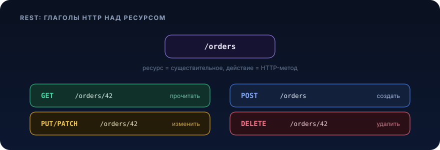

# REST API


<p align="center">
  
</p>

## Зачем это нужно / какую проблему решает

Представь: у тебя есть сервис заказов. Мобильное приложение хочет показать список заказов пользователя, веб-админка, отменить заказ, склад, отметить его собранным, а биллинг, раз в сутки выгрузить всё за вчера. Четыре разных клиента, написанных разными командами на разных языках, и все они должны говорить с твоим сервисом. Ты не можешь раздать им JDBC-доступ к своей базе (тогда любое изменение схемы сломает полмира), не можешь заставить всех подключить твою Java-библиотеку (Go-команда пошлёт тебя), и не можешь по каждому чиху созваниваться и договариваться о формате.

Нужен **контракт поверх сети**, который:

- понятен без документации на 200 страниц, по одному взгляду на `GET /orders/42` ясно, что это;
- работает поверх того, что уже везде есть, HTTP, JSON, любой HTTP-клиент;
- предсказуем, одинаковые запросы ведут себя одинаково, ошибки сообщаются машиночитаемо;
- эволюционирует, можно добавить поле, не сломав старых клиентов.

REST (Representational State Transfer) это набор архитектурных принципов, который даёт такой контракт. Не протокол и не библиотека, а **стиль дизайна HTTP-API**: ты моделируешь предметную область как набор *ресурсов* с URL-адресами и работаешь с ними стандартными HTTP-методами. Именно поэтому REST стал лингва-франка межсервисного и клиент-серверного взаимодействия: он ничего нового не изобретает, а грамотно использует семантику HTTP, которую и так понимают все прокси, кэши, балансировщики и браузеры.

Боль, которую REST убирает: «у нас на каждый эндпоинт свои правила, свои коды ошибок, `POST /getOrderById` рядом с `GET /order/delete`, и никто не помнит, что вернётся». REST задаёт скелет, внутри которого API становится угадываемым.

## Ключевые понятия

### Ресурс и его представление

Центральная идея: сервер оперирует **ресурсами** это любая сущность, на которую можно сослаться (заказ, товар, пользователь, коллекция заказов). У ресурса есть *идентификатор* (URL) и *представление*, то, как ресурс сериализуется для передачи (обычно JSON).

Важно: URL адресует **существительное**, а не действие. Действие выражается HTTP-методом.

```
Плохо (глаголы в URL):   POST /createOrder, GET /getOrder?id=42, POST /order/42/cancelIt
Хорошо (ресурсы):        POST /orders,      GET /orders/42,       POST /orders/42/cancellation
```

Ресурсы бывают:
- **коллекции**, `/orders` (много заказов);
- **элементы**, `/orders/42` (один конкретный);
- **вложенные**, `/orders/42/items` (позиции внутри заказа 42);
- иногда «действие как ресурс», когда операция не укладывается в CRUD, `/orders/42/cancellation` (создание отмены как под-ресурса).

### HTTP-методы и их семантика

| Метод    | Смысл                        | Тело запроса | Идемпотентен | Безопасен (read-only) |
|----------|------------------------------|--------------|--------------|-----------------------|
| `GET`    | получить ресурс/коллекцию    | нет          | да           | да                    |
| `POST`   | создать / выполнить действие  | да           | **нет**      | нет                   |
| `PUT`    | заменить ресурс целиком        | да           | да           | нет                   |
| `PATCH`  | частично изменить ресурс       | да           | обычно нет   | нет                   |
| `DELETE` | удалить ресурс                 | нет/да       | да           | нет                   |

**Безопасный (safe)** метод не меняет состояние на сервере, `GET` можно вызывать сколько угодно, ничего не сломается (кэши и краулеры на это рассчитывают, не прячь мутации за GET).

**Идемпотентный** метод даёт один и тот же итоговый эффект при повторе: один `DELETE /orders/42` или пять подряд, заказ в итоге удалён (последующие вернут `404`, но состояние то же). `PUT` заменяет ресурс целиком, повтор перезапишет теми же данными. А вот `POST /orders` идемпотентным **не является**: два вызова создадут два заказа. Идемпотентность, фундамент безопасных ретраев в ненадёжной сети (см. раздел роадмапа «Надёжность и архитектура»: ретраи, at-least-once доставка, дедупликация). Как сделать идемпотентными и мутации через `POST`, ниже в отдельном подразделе.

`PATCH` формально не гарантирует идемпотентность (например, `PATCH`, увеличивающий счётчик на 1); но если ты патчишь конкретные поля конкретными значениями, на практике повтор безопасен.

### Статус-коды

Код ответа это машиночитаемый итог операции. Клиент должен принимать решения по коду, а не парсить текст.

- **2xx, успех:** `200 OK` (успешный GET/PUT/PATCH с телом), `201 Created` (ресурс создан, верни `Location` с URL нового ресурса), `202 Accepted` (принято в асинхронную обработку), `204 No Content` (успех без тела, типично для DELETE).
- **3xx, перенаправление:** `304 Not Modified` (для условных запросов с кэшем).
- **4xx, ошибка клиента (виноват запрос):** `400 Bad Request` (невалидное тело), `401 Unauthorized` (не аутентифицирован), `403 Forbidden` (аутентифицирован, но нет прав), `404 Not Found`, `409 Conflict` (конфликт состояния, например, отмена уже отменённого), `422 Unprocessable Entity` (синтаксис ок, но семантика невалидна), `429 Too Many Requests` (rate limit).
- **5xx, ошибка сервера (виноват сервер):** `500 Internal Server Error`, `503 Service Unavailable`.

Ключевой водораздел 4xx vs 5xx: 4xx, «не повторяй запрос как есть, он сам по себе плохой»; 5xx, «попробуй ещё раз позже, у меня проблема». От этого зависит, будет ли клиент ретраить.

### Stateless

REST требует, чтобы сервер **не хранил клиентскую сессию** между запросами: каждый запрос самодостаточен и несёт всё нужное для обработки (токен аутентификации, параметры). Сервер не помнит «этот клиент три запроса назад залогинился как Вася» в своей памяти.

Зачем: любой запрос может уйти на любой инстанс за балансировщиком (горизонтальное масштабирование), инстанс можно перезапустить без потери сессий, не нужна липкая сессия (sticky session). Состояние живёт либо у клиента (JWT-токен в заголовке `Authorization`), либо во внешнем хранилище (Redis, БД), но не в heap конкретного пода. Это ровно та причина, по которой в Spring Security 6 мы для REST-API выставляем `SessionCreationPolicy.STATELESS`.

### Дизайн URL

Практические правила, которые делают API угадываемым:

- существительные во множественном числе: `/orders`, `/sellers`, `/orders/42/items`;
- иерархия через вложенность, но не глубже 2 уровней: `/orders/42/items/7`, ок, `/a/1/b/2/c/3/d/4`, уже боль;
- фильтрация, сортировка, пагинация, через query-параметры, не через URL-путь: `GET /orders?status=PACKING&sort=createdAt,desc&page=0&size=20`;
- kebab-case для многословных сегментов: `/delivery-points`, не `/deliveryPoints` и не `/delivery_points`;
- никаких расширений и глаголов: не `/orders/42.json`, не `/getOrders`.

### Версионирование

API меняется, а старые клиенты остаются. Ломающее изменение (убрали поле, поменяли тип, изменили семантику) требует новой версии. Стратегии:

- **в пути:** `/api/v1/orders`, самый распространённый и прозрачный вариант, легко роутить;
- **в заголовке / через media type:** `Accept: application/vnd.company.v2+json`, чище с точки зрения «URL адресует ресурс, а не версию», но сложнее в эксплуатации;
- **в query:** `/orders?version=2`, не рекомендуется, ломает кэширование.

На практике в микросервисах чаще всего берут версию в пути (`/v1`). Правило: **не ломай v1, пока по ней есть трафик**. Аддитивные изменения (добавил необязательное поле в ответ) версию не требуют, клиенты должны игнорировать неизвестные поля (в Jackson это `FAIL_ON_UNKNOWN_PROPERTIES=false`).

### DTO и валидация

Наружу нельзя отдавать JPA-сущности напрямую и нельзя принимать их же на вход. Причины: ленивая инициализация Hibernate внутри сериализации даёт `LazyInitializationException` и N+1; ты протекаешь внутреннюю схему БД в контракт; и клиент может прислать поля, которые ты не ждал (`id`, `version`, `createdAt`), а маппер их применит. Поэтому на границе, **DTO** (request/response), отдельно от доменной модели.

DTO в Java 21 это `record`: иммутабельный, лаконичный, с готовыми `equals/hashCode`. Валидация, через Jakarta Bean Validation (`jakarta.validation.*`) и `@Valid` на параметре контроллера: Spring прогонит аннотации (`@NotNull`, `@Size`, `@Positive`, `@Email`) до входа в бизнес-логику и на нарушении бросит `MethodArgumentNotValidException`, которую мы превратим в аккуратный `400`.

### Обработка ошибок: ProblemDetail (RFC 7807/9457)

Каждый эндпоинт ошибается по-разному, и если формат ошибки везде свой, клиент утонет. Стандарт **RFC 7807/9457** задаёт единое машиночитаемое тело ошибки, `application/problem+json`:

```json
{
  "type": "https://api.company.com/errors/order-already-cancelled",
  "title": "Order already cancelled",
  "status": 409,
  "detail": "Order 42 is already in status CANCELLED",
  "instance": "/api/v1/orders/42/cancellation"
}
```

В Spring Boot 3 для этого есть встроенный класс `ProblemDetail` и базовый `ResponseEntityExceptionHandler`, который уже умеет отдавать стандартные ошибки в этом формате. Централизуем всё в `@RestControllerAdvice`, чтобы контроллеры не были засыпаны `try/catch`.

### Пагинация

Никогда не возвращай неограниченную коллекцию, `GET /orders` без лимита однажды выберет миллион строк и положит и сервис, и клиент. Два подхода:

- **offset-пагинация** (`?page=0&size=20`), просто, но на больших смещениях `OFFSET 1000000` в PostgreSQL медленный, и при вставках между запросами страницы «съезжают». Годится для админок и небольших наборов.
- **keyset / cursor-пагинация** (`?after=<last_id>&size=20`, `WHERE id > :lastId ORDER BY id LIMIT 20`), стабильна и быстра на любых объёмах, но нельзя прыгнуть на произвольную страницу. Выбор для бесконечных лент и больших выгрузок.

Spring Data отдаёт `Page<T>`/`Slice<T>` из `Pageable`, offset-пагинация «из коробки». В ответ полезно класть метаданные:总 total, номер страницы, размер.

### Идемпотентность мутаций (Idempotency-Key)

`POST /payments` создаёт платёж. Клиент отправил запрос, но ответ потерялся в сети (таймаут). Клиент ретраит, и создаёт **второй** платёж. Классика.

Решение, паттерн **Idempotency-Key**: клиент генерирует уникальный ключ (UUID) на *логическую операцию* и шлёт его в заголовке `Idempotency-Key`. Сервер при первом запросе выполняет операцию и сохраняет `(ключ → результат)`; при повторе с тем же ключом, не выполняет заново, а возвращает сохранённый результат. Так небезопасный `POST` становится безопасным для ретраев. Это ровно то, что стандартизировали Stripe и другие платёжные API. Детали (окно хранения ключей, дедупликация в БД, конкурентные повторы), тема раздела «Надёжность и архитектура».

### HATEOAS (кратко)

HATEOAS (Hypermedia as the Engine of Application State), верхний «уровень зрелости» REST: ответ несёт не только данные, но и **ссылки на возможные следующие действия**. Клиент не хардкодит URL, а ходит по ссылкам, как браузер по гиперссылкам.

```json
{
  "id": 42, "status": "PACKING",
  "_links": {
    "self":   { "href": "/api/v1/orders/42" },
    "cancel": { "href": "/api/v1/orders/42/cancellation" },
    "items":  { "href": "/api/v1/orders/42/items" }
  }
}
```

В Spring это Spring HATEOAS (`EntityModel`, `Link`). На практике в приватных микросервисах HATEOAS применяют редко, накладные расходы выше пользы, клиенты и так знают маршруты. Знать про него надо, тащить в каждый API, нет.

### REST vs gRPC vs GraphQL (обзорно)

- **REST/JSON**, универсален, человекочитаем, работает везде, отлично кэшируется по HTTP, легко дебажить (`curl`). Минусы: многословный JSON, over-/under-fetching (получаешь либо лишнее, либо мало и делаешь много запросов), нет строгой схемы из коробки (OpenAPI, опционально). Дефолт для публичных и большинства межсервисных API.
- **gRPC**, бинарный protobuf поверх HTTP/2, строгая схема `.proto`, кодогенерация клиента/сервера, стриминг в обе стороны, низкая латентность. Минусы: не читается глазами, хуже с браузером (нужен gRPC-Web), сложнее дебажить. Выбор для высоконагруженного внутреннего трафика между сервисами.
- **GraphQL**, один эндпоинт, клиент сам описывает, какие поля ему нужны (решает over/under-fetching), сильная типовая схема. Минусы: сложное кэширование, риск тяжёлых запросов (нужны глубина/сложность-лимиты), N+1 на резолверах (лечится dataloader). Хорош для агрегирующих BFF-слоёв под богатый фронтенд.

Практический выбор: **REST по умолчанию**; gRPC, когда важна производительность внутренней связи; GraphQL, когда фронтенду нужна гибкая выборка из многих источников.

## Примеры на Java

Сквозной пример: сервис заказов. Сущность → репозиторий → DTO с валидацией → контроллер → глобальный обработчик ошибок → конфиг. Java 21, Spring Boot 3.x, Jakarta.

### JPA-сущность (внутренняя модель, наружу не отдаётся)

```java
package com.example.orders.domain;

import jakarta.persistence.Column;
import jakarta.persistence.Entity;
import jakarta.persistence.EnumType;
import jakarta.persistence.Enumerated;
import jakarta.persistence.GeneratedValue;
import jakarta.persistence.GenerationType;
import jakarta.persistence.Id;
import jakarta.persistence.Table;
import jakarta.persistence.Version;
import java.time.Instant;

@Entity
@Table(name = "orders")
public class Order {

    @Id
    @GeneratedValue(strategy = GenerationType.IDENTITY)
    private Long id;

    @Column(nullable = false)
    private String customerName;

    @Enumerated(EnumType.STRING)     // храним строкой, а не ordinal, стабильно при добавлении статусов
    @Column(nullable = false)
    private OrderStatus status;

    @Column(nullable = false)
    private long amount;             // сумма в минимальных единицах (тийины/копейки), не double

    @Column(nullable = false, updatable = false)
    private Instant createdAt;

    @Version                          // оптимистичная блокировка против гонок на update
    private long version;

    protected Order() {               // требуется JPA, не для прикладного кода
    }

    private Order(String customerName, long amount) {
        this.customerName = customerName;
        this.amount = amount;
        this.status = OrderStatus.CREATED;
        this.createdAt = Instant.now();
    }

    // фабрика вместо публичного конструктора/сеттеров, инвариант «новый заказ = CREATED»
    public static Order create(String customerName, long amount) {
        return new Order(customerName, amount);
    }

    // изменение состояния, через доменный метод, а не сеттер: сюда влезает бизнес-правило
    public void cancel() {
        if (status == OrderStatus.CANCELLED) {
            throw new OrderAlreadyCancelledException(id);
        }
        if (status == OrderStatus.COMPLETED) {
            throw new IllegalOrderStateException("Cannot cancel a completed order " + id);
        }
        this.status = OrderStatus.CANCELLED;
    }

    public Long getId() {
        return id;
    }

    public String getCustomerName() {
        return customerName;
    }

    public OrderStatus getStatus() {
        return status;
    }

    public long getAmount() {
        return amount;
    }

    public Instant getCreatedAt() {
        return createdAt;
    }
}
```

```java
package com.example.orders.domain;

public enum OrderStatus {
    CREATED, PACKING, DELIVERING, COMPLETED, CANCELLED
}
```

### Репозиторий (Spring Data)

```java
package com.example.orders.domain;

import java.util.Optional;
import org.springframework.data.domain.Page;
import org.springframework.data.domain.Pageable;
import org.springframework.data.jpa.repository.JpaRepository;

public interface OrderRepository extends JpaRepository<Order, Long> {

    // пагинация «из коробки»: Spring Data сам добавит LIMIT/OFFSET и посчитает total
    Page<Order> findByStatus(OrderStatus status, Pageable pageable);

    Optional<Order> findByIdAndCustomerName(Long id, String customerName);
}
```

### DTO, запрос и ответ (records + валидация)

```java
package com.example.orders.web;

import jakarta.validation.constraints.NotBlank;
import jakarta.validation.constraints.Positive;
import jakarta.validation.constraints.Size;

// Тело POST /orders. Никаких id/status/createdAt, их задаёт сервер, не клиент.
public record CreateOrderRequest(

        @NotBlank(message = "customerName must not be blank")
        @Size(max = 255)
        String customerName,

        @Positive(message = "amount must be positive")
        long amount
) {
}
```

```java
package com.example.orders.web;

import com.example.orders.domain.Order;
import java.time.Instant;

// Ответ. Отдельный тип: контракт наружу не привязан к схеме БД.
public record OrderResponse(
        Long id,
        String customerName,
        String status,
        long amount,
        Instant createdAt
) {
    public static OrderResponse from(Order order) {
        return new OrderResponse(
                order.getId(),
                order.getCustomerName(),
                order.getStatus().name(),
                order.getAmount(),
                order.getCreatedAt()
        );
    }
}
```

Обёртка для страницы, чтобы не отдавать «сырой» `Page` Spring Data (его JSON нестабилен между версиями):

```java
package com.example.orders.web;

import java.util.List;
import org.springframework.data.domain.Page;

public record PageResponse<T>(List<T> content, int page, int size, long totalElements, int totalPages) {

    public static <E, D> PageResponse<D> of(Page<E> page, java.util.function.Function<E, D> mapper) {
        return new PageResponse<>(
                page.getContent().stream().map(mapper).toList(),
                page.getNumber(),
                page.getSize(),
                page.getTotalElements(),
                page.getTotalPages()
        );
    }
}
```

### Сервис (бизнес-логика, транзакции)

```java
package com.example.orders.domain;

import com.example.orders.web.CreateOrderRequest;
import org.springframework.data.domain.Page;
import org.springframework.data.domain.Pageable;
import org.springframework.stereotype.Service;
import org.springframework.transaction.annotation.Transactional;

@Service
public class OrderService {

    private final OrderRepository repository;

    // конструкторная инъекция: поле final, бин неизменяем, легко тестировать
    public OrderService(OrderRepository repository) {
        this.repository = repository;
    }

    @Transactional
    public Order create(CreateOrderRequest request) {
        return repository.save(Order.create(request.customerName(), request.amount()));
    }

    @Transactional(readOnly = true)
    public Order getById(Long id) {
        return repository.findById(id)
                .orElseThrow(() -> new OrderNotFoundException(id));
    }

    @Transactional(readOnly = true)
    public Page<Order> list(OrderStatus status, Pageable pageable) {
        return status == null
                ? repository.findAll(pageable)
                : repository.findByStatus(status, pageable);
    }

    @Transactional
    public Order cancel(Long id) {
        Order order = repository.findById(id)
                .orElseThrow(() -> new OrderNotFoundException(id));
        order.cancel();                 // бизнес-правило внутри домена; @Version защитит от гонки
        return order;                    // dirty checking сохранит изменения на коммите
    }
}
```

### Контроллер (тонкий: принял → делегировал → вернул)

```java
package com.example.orders.web;

import com.example.orders.domain.OrderService;
import com.example.orders.domain.OrderStatus;
import jakarta.validation.Valid;
import java.net.URI;
import org.springframework.data.domain.Pageable;
import org.springframework.data.web.PageableDefault;
import org.springframework.http.HttpStatus;
import org.springframework.http.ResponseEntity;
import org.springframework.web.bind.annotation.GetMapping;
import org.springframework.web.bind.annotation.PathVariable;
import org.springframework.web.bind.annotation.PostMapping;
import org.springframework.web.bind.annotation.RequestBody;
import org.springframework.web.bind.annotation.RequestMapping;
import org.springframework.web.bind.annotation.RequestParam;
import org.springframework.web.bind.annotation.ResponseStatus;
import org.springframework.web.bind.annotation.RestController;

@RestController
@RequestMapping("/api/v1/orders")   // версия в пути
public class OrderController {

    private final OrderService service;

    public OrderController(OrderService service) {
        this.service = service;
    }

    // POST /api/v1/orders -> 201 Created + Location на новый ресурс
    @PostMapping
    public ResponseEntity<OrderResponse> create(@Valid @RequestBody CreateOrderRequest request) {
        var order = service.create(request);
        var body = OrderResponse.from(order);
        return ResponseEntity
                .created(URI.create("/api/v1/orders/" + order.getId()))  // ставит и статус 201, и заголовок Location
                .body(body);
    }

    // GET /api/v1/orders/42 -> 200 или 404 (через advice)
    @GetMapping("/{id}")
    public OrderResponse get(@PathVariable Long id) {
        return OrderResponse.from(service.getById(id));
    }

    // GET /api/v1/orders?status=PACKING&page=0&size=20&sort=createdAt,desc
    @GetMapping
    public PageResponse<OrderResponse> list(
            @RequestParam(required = false) OrderStatus status,
            @PageableDefault(size = 20) Pageable pageable) {
        return PageResponse.of(service.list(status, pageable), OrderResponse::from);
    }

    // POST /api/v1/orders/42/cancellation -> действие как под-ресурс
    @PostMapping("/{id}/cancellation")
    @ResponseStatus(HttpStatus.OK)
    public OrderResponse cancel(@PathVariable Long id) {
        return OrderResponse.from(service.cancel(id));
    }
}
```

### Доменные исключения

```java
package com.example.orders.domain;

public class OrderNotFoundException extends RuntimeException {
    public OrderNotFoundException(Long id) {
        super("Order %d not found".formatted(id));
    }
}
```

```java
package com.example.orders.domain;

public class OrderAlreadyCancelledException extends RuntimeException {
    public OrderAlreadyCancelledException(Long id) {
        super("Order %d is already cancelled".formatted(id));
    }
}
```

```java
package com.example.orders.domain;

public class IllegalOrderStateException extends RuntimeException {
    public IllegalOrderStateException(String message) {
        super(message);
    }
}
```

### Глобальная обработка ошибок: @RestControllerAdvice + ProblemDetail (RFC 7807)

```java
package com.example.orders.web;

import com.example.orders.domain.IllegalOrderStateException;
import com.example.orders.domain.OrderAlreadyCancelledException;
import com.example.orders.domain.OrderNotFoundException;
import java.net.URI;
import java.util.List;
import org.springframework.http.HttpHeaders;
import org.springframework.http.HttpStatus;
import org.springframework.http.HttpStatusCode;
import org.springframework.http.ProblemDetail;
import org.springframework.http.ResponseEntity;
import org.springframework.web.bind.MethodArgumentNotValidException;
import org.springframework.web.bind.annotation.ExceptionHandler;
import org.springframework.web.bind.annotation.RestControllerAdvice;
import org.springframework.web.context.request.WebRequest;
import org.springframework.web.servlet.mvc.method.annotation.ResponseEntityExceptionHandler;

// Расширяем ResponseEntityExceptionHandler, он уже отдаёт стандартные Spring-ошибки как ProblemDetail
@RestControllerAdvice
public class GlobalExceptionHandler extends ResponseEntityExceptionHandler {

    @ExceptionHandler(OrderNotFoundException.class)
    public ProblemDetail handleNotFound(OrderNotFoundException ex) {
        var problem = ProblemDetail.forStatusAndDetail(HttpStatus.NOT_FOUND, ex.getMessage());
        problem.setTitle("Order not found");
        problem.setType(URI.create("https://api.example.com/errors/order-not-found"));
        return problem;
    }

    @ExceptionHandler({OrderAlreadyCancelledException.class, IllegalOrderStateException.class})
    public ProblemDetail handleConflict(RuntimeException ex) {
        var problem = ProblemDetail.forStatusAndDetail(HttpStatus.CONFLICT, ex.getMessage());
        problem.setTitle("Order state conflict");
        problem.setType(URI.create("https://api.example.com/errors/order-state-conflict"));
        return problem;
    }

    // Ошибки @Valid: переопределяем метод базового класса, кладём разбор по полям в extension "errors"
    @Override
    protected ResponseEntity<Object> handleMethodArgumentNotValid(
            MethodArgumentNotValidException ex,
            HttpHeaders headers,
            HttpStatusCode status,
            WebRequest request) {

        List<String> errors = ex.getBindingResult().getFieldErrors().stream()
                .map(fe -> fe.getField() + ": " + fe.getDefaultMessage())
                .toList();

        var problem = ProblemDetail.forStatusAndDetail(HttpStatus.BAD_REQUEST, "Validation failed");
        problem.setTitle("Invalid request");
        problem.setType(URI.create("https://api.example.com/errors/validation"));
        problem.setProperty("errors", errors);    // произвольное расширение поверх RFC 7807
        return ResponseEntity.badRequest().body(problem);
    }
}
```

### Безопасность: stateless-конфиг (Spring Security 6, без WebSecurityConfigurerAdapter)

```java
package com.example.orders.config;

import org.springframework.context.annotation.Bean;
import org.springframework.context.annotation.Configuration;
import org.springframework.security.config.Customizer;
import org.springframework.security.config.annotation.web.builders.HttpSecurity;
import org.springframework.security.config.http.SessionCreationPolicy;
import org.springframework.security.web.SecurityFilterChain;

@Configuration
public class SecurityConfig {

    // Компонентный стиль Spring Security 6: бин SecurityFilterChain вместо устаревшего adapter
    @Bean
    public SecurityFilterChain filterChain(HttpSecurity http) throws Exception {
        http
                // для stateless REST CSRF выключаем (нет cookie-сессии, защищаемся токеном)
                .csrf(csrf -> csrf.disable())
                // ключевое для REST: сервер не держит HTTP-сессию
                .sessionManagement(sm -> sm.sessionCreationPolicy(SessionCreationPolicy.STATELESS))
                .authorizeHttpRequests(auth -> auth
                        .requestMatchers("/actuator/health/**").permitAll()
                        .anyRequest().authenticated())
                // ресурс-сервер: аутентификация по JWT из заголовка Authorization: Bearer ...
                .oauth2ResourceServer(oauth -> oauth.jwt(Customizer.withDefaults()));
        return http.build();
    }
}
```

### application.yml, важные для REST-контракта настройки

```yaml
spring:
  jackson:
    default-property-inclusion: non_null   # не сериализуем null-поля, компактнее и стабильнее контракт
    deserialization:
      fail-on-unknown-properties: false    # клиент прислал лишнее поле, не падаем (эволюция API)
  mvc:
    problemdetails:
      enabled: true                        # включить ProblemDetail (RFC 7807) для стандартных ошибок
  security:
    oauth2:
      resourceserver:
        jwt:
          issuer-uri: https://auth.example.com/realms/orders

server:
  error:
    include-message: never                 # не протекаем внутренние сообщения в дефолтный error-ответ
```

### Схема таблицы (Liquibase/SQL)

```sql
CREATE TABLE orders (
    id            BIGSERIAL PRIMARY KEY,
    customer_name VARCHAR(255) NOT NULL,
    status        VARCHAR(32)  NOT NULL,
    amount        BIGINT       NOT NULL CHECK (amount > 0),
    created_at    TIMESTAMPTZ  NOT NULL DEFAULT now(),
    version       BIGINT       NOT NULL DEFAULT 0
);

-- индекс под частый фильтр GET /orders?status=...
CREATE INDEX orders_status_idx ON orders (status);
```

## Частые ошибки / подводные камни

1. **Полевая инъекция вместо конструкторной.** `@Autowired private OrderRepository repo;` мешает сделать поле `final`, прячет зависимости (класс с 12 полями выглядит невинно), ломает тестирование без Spring-контекста и позволяет создать наполовину собранный бин. Всегда, инъекция через конструктор, поле `final`. С одним конструктором `@Autowired` даже не нужен.

2. **Отдача JPA-сущностей прямо из контроллера.** Сериализация сущности вне транзакции ловит `LazyInitializationException`; ленивые связи тянут N+1 прямо в Jackson; ты протекаешь схему БД в публичный контракт, и любой рефакторинг таблицы ломает клиентов. Плюс на входе Jackson может пробросить `id`/`version`/`status` из тела в сущность. Всегда, отдельные request/response DTO.

3. **N+1 запросов на списках.** `GET /orders` вернул 50 заказов, а на сериализацию `order.getItems()` Hibernate сделал 50 отдельных `SELECT`. Лечится `@EntityGraph`/`join fetch` в репозитории (грузим связи одним запросом) или проекцией сразу в DTO. Всегда смотри реальный SQL (`spring.jpa.show-sql` в dev, а лучше p6spy/datasource-proxy).

4. **`@Transactional` на private-методе или при self-invocation.** Spring оборачивает бин AOP-прокси; вызов `this.doWork()` внутри того же класса идёт мимо прокси, транзакция **не откроется**, и `@Transactional` на `private`/`protected`-методе просто игнорируется. Транзакционный метод должен быть `public` и вызываться через инъектированный бин (или вынеси его в отдельный сервис).

5. **`FetchType.EAGER` везде.** «Чтобы не ловить LazyInit» ставят EAGER на все `@ManyToOne`/`@OneToMany`, и каждый запрос за заказом молча притаскивает половину базы, а на коллекциях EAGER рушит пагинацию (Hibernate тянет всё в память и лимитирует уже там). Дефолт, `LAZY`; нужные связи грузи явно через entity graph под конкретный сценарий.

6. **Мутации под `GET` и неверные коды.** `GET /orders/42/delete`, который что-то удаляет, кэши, прелоадеры браузера и краулеры такое дёргают сами и стирают данные. GET обязан быть безопасным. Смежная грабля, возвращать `200 OK` с телом `{"error": ...}` на ошибку: клиент по коду видит успех и не ретраит/не обрабатывает сбой. Код ответа должен отражать реальный итог (4xx/5xx).

7. **Секреты в конфиге и в git.** Пароль БД или `client-secret` прямо в `application.yml` в репозитории, утечка при первом же форке/скриншоте. Секреты, через переменные окружения (`${DB_PASSWORD}`), Vault или k8s Secrets; в репо, только плейсхолдеры.

8. **Stateful там, где нужен stateless.** Хранение пользовательского прогресса в `HttpSession` или в статической мапе в heap ломается ровно тогда, когда сервис масштабируют на 2+ пода: запрос уходит на другой инстанс, где состояния нет. Для REST, `SessionCreationPolicy.STATELESS`, состояние в токене или во внешнем хранилище (Redis/БД).

## Практическая задача

**Контекст.** Ты пилишь сервис управления складскими поставками (supply). Фронт-склад и мобильное приложение курьера будут ходить в твой HTTP-API. Нужен предсказуемый REST-контракт с валидацией, стандартными ошибками, пагинацией и безопасным ретраем создания.

**Дано.**
- Пустой Spring Boot 3.x проект (Java 21, PostgreSQL, Spring Web, Spring Data JPA, Validation, Security).
- Доменная сущность `Supply` со статусами `DRAFT → SUBMITTED → ACCEPTED → REJECTED` и полями: `id`, `warehouseCode` (строка, обяз.), `itemsCount` (int > 0), `status`, `createdAt`, `version`.

**ТЗ. Реализуй ресурс `/api/v1/supplies` с эндпоинтами:**
1. `POST /api/v1/supplies`, создать поставку в статусе `DRAFT`. Тело: `warehouseCode`, `itemsCount`. Валидация обязательна. Ответ, `201 Created` с `Location`.
2. `GET /api/v1/supplies/{id}`, получить одну; несуществующая, `404` в формате ProblemDetail.
3. `GET /api/v1/supplies?status=SUBMITTED&page=0&size=20`, список с фильтром по статусу и offset-пагинацией; в ответе, `content`, `page`, `size`, `totalElements`.
4. `POST /api/v1/supplies/{id}/submission`, перевести `DRAFT → SUBMITTED`. Повторный вызов на уже `SUBMITTED`/`ACCEPTED`/`REJECTED`, `409 Conflict` (ProblemDetail), состояние не меняется.
5. Создание должно быть **идемпотентным по ретраю**: клиент шлёт заголовок `Idempotency-Key: <uuid>`; повтор с тем же ключом в течение окна не создаёт вторую поставку, а возвращает результат первого запроса (тот же `id`, статус `200`/`201`).

**Критерии приёмки.**
- Контроллер тонкий: без бизнес-логики и без прямого доступа к репозиторию (только через сервис).
- Наружу не уходит JPA-сущность, только DTO (`record`).
- Валидация через `@Valid`; на `400` тело, ProblemDetail c разбором по полям.
- Все ошибки идут через один `@RestControllerAdvice`, в теле, `application/problem+json`.
- `POST` дважды с одним `Idempotency-Key` → в БД одна строка `Supply`; с разными ключами → две.
- Смена статуса защищена от гонки (два параллельных `submission` не приведут к рассогласованию), подумай про `@Version`.
- Security-конфиг, stateless (`SessionCreationPolicy.STATELESS`), никакого `WebSecurityConfigurerAdapter`.

**Подсказки (без готового решения).**
- Идемпотентность: заведи таблицу `idempotency_key (key PK, supply_id, created_at)`. В одной транзакции с созданием поставки вставляй ключ; при конфликте уникальности (`ON CONFLICT DO NOTHING` / `DataIntegrityViolationException`), прочитай уже сохранённый результат по ключу и верни его. Продумай окно жизни ключей (TTL-очистка). Про паттерн и гонки, раздел роадмапа «Надёжность и архитектура».
- Смена статуса, доменным методом `supply.submit()` с проверкой текущего статуса внутри, а не `if` в контроллере/сервисе.
- Для `409` заведи доменное исключение и отдельный `@ExceptionHandler`, возвращающий `ProblemDetail.forStatusAndDetail(HttpStatus.CONFLICT, ...)`.
- Не отдавай `Page<Supply>` напрямую, оберни в свой `PageResponse<SupplyResponse>`.
- Проверь глазами: `curl -i` на каждый эндпоинт, код, `Location`, `Content-Type: application/problem+json` на ошибках.

**Со звёздочкой.** Добавь оптимистичный `PATCH /api/v1/supplies/{id}` для правки `itemsCount` только в статусе `DRAFT`; в остальных статусах, `409`. Подумай, почему это `PATCH`, а не `PUT`, и идемпотентен ли он здесь.

## Что почитать

- **Spring Boot 3, Web / REST (официальная дока):** https://docs.spring.io/spring-boot/reference/web/servlet.html, контроллеры, обработка ошибок, конфигурация MVC.
- **Spring, Building a RESTful Web Service (guide):** https://spring.io/guides/gs/rest-service, канонический стартовый гайд по `@RestController`.
- **Error Responses / ProblemDetail (Spring Framework docs):** https://docs.spring.io/spring-framework/reference/web/webmvc/mvc-ann-rest-exceptions.html, RFC 7807/9457 в Spring, `ResponseEntityExceptionHandler`.
- **Spring Data JPA, Paging and Sorting:** https://docs.spring.io/spring-data/jpa/reference/repositories/query-methods-details.html, `Pageable`, `Page`/`Slice`, сортировка.
- **RFC 9457, Problem Details for HTTP APIs:** https://www.rfc-editor.org/rfc/rfc9457, первоисточник формата ошибок (обновляет RFC 7807).

---

[Оглавление](../README.md) · [Паттерны: порождающие →](01-patterns-creational.md)
