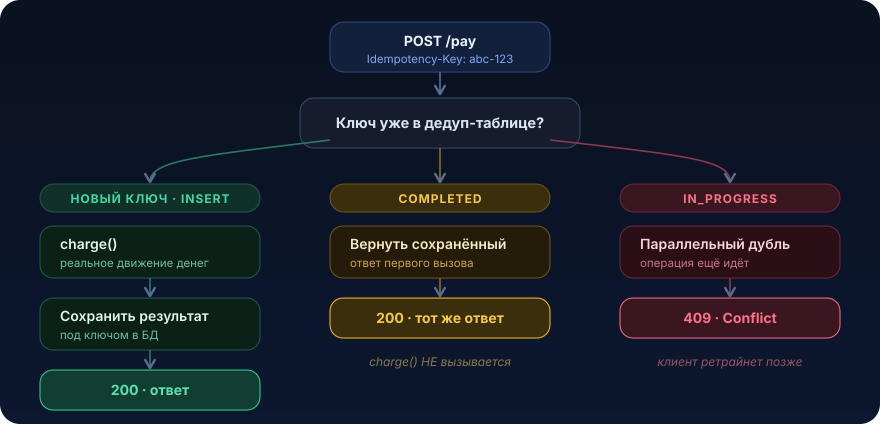

# Идемпотентность


Идемпотентность нужна не перфекционистам. Она стоит между тобой и клиентом, у которого с карты дважды списали 14 990 ₽ за один заказ. В распределённых системах повтор запроса это норма: сеть теряет ответы, клиенты ретраят, пользователи жмут кнопку по второму разу. Если обработчик не готов к повтору, рано или поздно он сделает работу дважды. Урок про то, как превратить «дважды» в «ровно один раз, а остальное тишина»

## Разминка

Прежде чем читать дальше, ответь себе на три вопроса. Ответы под спойлером, но сначала честно подумай.

1. `PUT /orders/42 {status: PAID}` вызвали три раза подряд. Сколько раз изменится состояние заказа?
2. `POST /orders` вызвали три раза. Сколько заказов создастся?
3. Ты ретраишь `POST /pay` при таймауте, idempotency key нет. Что произойдёт с деньгами клиента?

<details>
<summary>Показать ответы</summary>

1. **Один раз по факту.** `PUT` ставит поле в конкретное значение, а не прибавляет. После первого вызова заказ уже `PAID`, следующие два ничего не меняют. Операция идемпотентна от природы
2. **Три заказа.** Каждый `POST` создаёт новую сущность, натурального ключа, который различал бы «тот же самый» запрос, нет. Классический неидемпотентный кейс, ровно его и чинят idempotency key
3. **Спишутся деньги три раза.** Внешний шлюз видит три независимых списания на одну сумму. Ретрай без идемпотентности это генератор двойных списаний

</details>

## Проблема

Пятница, вечер, распродажа. Пользователь оформляет заказ и жмёт «Оплатить». Мобильный интернет в метро моргает: запрос ушёл на сервер, сервер списал деньги, начал слать ответ, и тут соединение оборвалось. Клиент ответа не получил. Что он делает? Повторяет запрос. Или пользователь, не увидев спиннера, сам тыкает «Оплатить» ещё раз.

На сервере всё выглядит нормально:

```java
@RestController
@RequiredArgsConstructor
public class PaymentController {

    private final PaymentGatewayClient gateway;   // ходит во внешний платёжный шлюз
    private final PaymentRepository payments;

    @PostMapping("/api/orders/{orderId}/pay")
    public PaymentResponse pay(@PathVariable long orderId,
                               @RequestBody PayRequest req) {
        // 1. Списываем деньги во внешнем шлюзе
        var charge = gateway.charge(req.card(), req.amount());   // ← реальное движение денег

        // 2. Сохраняем платёж у себя
        var payment = payments.save(new Payment(orderId, req.amount(), charge.id()));

        return new PaymentResponse(payment.getId(), "PAID");
    }
}
```

Код выглядит правильным. Ревьюер кивнёт, тесты зелёные. Но при повторе запроса он выполнит `gateway.charge(...)` второй раз. Внешний шлюз не знает, что это «тот же самый» платёж, для него это два независимых списания на одну сумму. Итог:

- две записи `Payment` в базе для одного заказа
- два реальных списания с карты клиента
- сорванный SLA, гневный тикет в поддержку, чарджбэк, штраф от эквайера
- в худшем случае публичный скандал: «магазин X списывает деньги дважды»

Почему это дорого? Потому что деньги это операция с побочным эффектом во внешнем мире, который нельзя «откатить транзакцией». `ROLLBACK` в PostgreSQL не вернёт деньги на карту. Компенсировать двойное списание можно только возвратом, вручную или отдельным процессом, с задержкой в дни и с испорченным доверием.

Частая ошибка мышления: «повтор запроса это баг клиента, пусть не ретраит». Нет. Повтор это данность распределённых систем. Клиент обязан ретраить, иначе при потере ответа он решит, что оплата не прошла, и это тоже плохо. Задача сервера сделать повтор безопасным

## Что это и когда применять

Операция идемпотентна, если выполнить её один раз или сто раз подряд с теми же входными данными даёт один и тот же результат, а побочный эффект случается ровно один раз.

Математическая интуиция: `f(f(x)) = f(x)`. Умножение на ноль идемпотентно, сколько ни умножай, всё ноль. Инкремент `x = x + 1` не идемпотентен.

Некоторые операции идемпотентны от природы:

| Операция | Идемпотентна? | Почему |
|---|---|---|
| `GET /orders/42` | Да | Чтение без побочных эффектов |
| `PUT /orders/42 {status: PAID}` | Да | Установка в конкретное значение, не инкремент |
| `DELETE /orders/42` | Да\* | Второй раз просто «уже удалено» |
| `POST /orders` (создать) | **Нет** | Каждый вызов создаёт новую сущность |
| `balance -= 100` | **Нет** | Инкремент и декремент накапливаются |
| `charge(card, amount)` | **Нет** | Каждый вызов это новое списание |

Именно неидемпотентные `POST` и операции с деньгами приходится делать идемпотентными искусственно, через idempotency key. Про него ниже

### Когда НЕ нужно

Частая ошибка обвешать идемпотентностью вообще всё, потому что «так надёжнее». Это плата за инфраструктуру (таблица ключей, индексы, TTL, усложнение кода) без выгоды. Не нужно:

- **для чистых чтений** (`GET`, запросы без побочных эффектов), они уже идемпотентны
- **для операций, идемпотентных по смыслу**, `PUT` с установкой поля в конкретное значение, `UPSERT` по натуральному ключу
- **когда повтор физически невозможен**, например шаг внутри синхронной транзакции, который никто извне не ретраит
- **когда есть естественный уникальный ключ** и его достаточно. Если у платежа уже есть `orderId` и правило «один заказ равно один платёж», уникальный индекс по `order_id` дешевле и надёжнее отдельного слоя idempotency key

Правило простое. Сначала спроси: «есть ли у этой операции естественный уникальный идентификатор результата?». Если да, используй его. Если нет и клиент может слать легитимно одинаковые запросы, вводи idempotency key

## Как это работает

Механика через idempotency key плюс дедуп-хранилище:

1. Клиент генерирует уникальный ключ на одну логическую операцию (обычно UUID) и кладёт в заголовок `Idempotency-Key`. Ключ создаётся до первой отправки и не меняется между ретраями. Все ретраи одной оплаты несут один и тот же ключ
2. Сервер атомарно проверяет: видел ли он этот ключ раньше?
   - **не видел** → регистрирует ключ в статусе «в обработке», выполняет операцию, сохраняет результат, отдаёт ответ
   - **видел, операция завершена** → не выполняет её повторно, отдаёт сохранённый ответ первого вызова
   - **видел, операция ещё в обработке** (параллельный дубль) → возвращает `409 Conflict`

Поток запроса:

<p align="center">
  
</p>

Жизненный цикл записи ключа:

<p align="center">
  
</p>

### Где ломаются реализации

- **Атомарность проверки и вставки.** «Проверить `SELECT`, потом `INSERT`» это классическая гонка: два параллельных дубля оба проходят `SELECT` (ключа нет) и оба идут списывать. Проверка и захват ключа должны быть одной атомарной операцией: `INSERT ... ON CONFLICT DO NOTHING` плюс уникальный индекс, либо `INSERT` с ловлей `DuplicateKeyException`
- **Порядок: сначала ключ, потом эффект.** Если сначала списать деньги, а потом писать ключ, при падении между шагами получишь списание без ключа, и ретрай спишет снова
- **Где хранить результат.** Чтобы на повтор вернуть тот же ответ, а не абстрактное «уже сделано», сохраняй тело и статус ответа под ключом. Клиенту важен `paymentId`, а не голый `409`
- **TTL ключа.** Ключ живёт не вечно, но окно должно перекрывать все реалистичные ретраи: клиентские бэкоффы, отложенные повторы, «пользователь вернулся через час»
- **Идемпотентность в Kafka-консьюмерах.** Тот же принцип: at-least-once доставка значит, что сообщение придёт повторно. Дедуп по бизнес-ключу сообщения в той же транзакции, что и изменение данных

## Пример на Java

Соберём боевую реализацию для платёжного эндпоинта. Идея: захват ключа и запись платежа в одной транзакции, ключ ловим уникальным индексом, а списание во внешнем шлюзе делаем идемпотентным, пробрасывая тот же ключ в шлюз. Так делают все нормальные платёжные провайдеры (Stripe, ЮKassa)

> ▶️ Схему ниже можно прогнать в [db-fiddle для PostgreSQL](https://www.db-fiddle.com/): создай таблицы, вставь один ключ дважды и посмотри, как `ON CONFLICT` гасит дубль

### Схема базы (PostgreSQL)

```sql
-- Дедуп-таблица идемпотентности
CREATE TABLE idempotency_record (
    idempotency_key VARCHAR(64)  PRIMARY KEY,          -- ключ от клиента
    request_hash    VARCHAR(64)  NOT NULL,             -- хэш тела запроса
    status          VARCHAR(16)  NOT NULL,             -- IN_PROGRESS | COMPLETED
    response_body   JSONB,                             -- сохранённый ответ первого вызова
    response_status INT,                               -- HTTP-статус первого вызова
    created_at      TIMESTAMPTZ  NOT NULL DEFAULT now()
);

-- Для фоновой очистки протухших ключей нужен индекс по времени
CREATE INDEX idempotency_record_created_at_idx ON idempotency_record (created_at);

-- Платёж. Натуральный уникальный ключ это второй рубеж обороны:
-- один заказ не может иметь два успешных платежа
CREATE TABLE payment (
    id          BIGSERIAL PRIMARY KEY,
    order_id    BIGINT       NOT NULL,
    amount      BIGINT       NOT NULL,          -- в минимальных единицах (тийины, копейки)
    charge_id   VARCHAR(64)  NOT NULL,          -- id списания во внешнем шлюзе
    created_at  TIMESTAMPTZ  NOT NULL DEFAULT now()
);

CREATE UNIQUE INDEX payment_order_id_udx ON payment (order_id);
```

### Сервис идемпотентности

```java
import org.springframework.dao.DataIntegrityViolationException;
import org.springframework.stereotype.Service;
import org.springframework.transaction.annotation.Transactional;

import java.util.Optional;

@Service
public class IdempotencyService {

    private final IdempotencyRecordRepository records;

    public IdempotencyService(IdempotencyRecordRepository records) {
        this.records = records;
    }

    /**
     * Пытается захватить ключ. Возвращает:
     *  - Optional.empty()   ключ новый, мы его захватили, вызывающий выполняет операцию
     *  - Optional.of(rec)   ключ уже существует (повтор), нужно вернуть сохранённый результат
     *                       или сигнализировать о параллельной обработке
     * Атомарность обеспечивает PRIMARY KEY: параллельная вставка того же ключа кинет
     * DataIntegrityViolationException, гонку выигрывает ровно один поток.
     */
    @Transactional
    public Optional<IdempotencyRecord> acquire(String key, String requestHash) {
        try {
            var rec = new IdempotencyRecord(key, requestHash, Status.IN_PROGRESS);
            records.saveAndFlush(rec);   // flush нужен, чтобы конфликт всплыл здесь и сейчас
            return Optional.empty();     // мы первые, ключ наш
        } catch (DataIntegrityViolationException dup) {
            // Кто-то уже вставил этот ключ, читаем существующую запись
            var existing = records.findById(key).orElseThrow();
            return Optional.of(existing);
        }
    }

    /** Фиксируем результат успешной операции под ключом. */
    @Transactional
    public void complete(String key, int httpStatus, String responseBody) {
        var rec = records.findById(key).orElseThrow();
        rec.markCompleted(httpStatus, responseBody);
        records.save(rec);
    }

    /** Освобождаем ключ при ошибке, чтобы клиент мог честно ретрайнуть с нуля. */
    @Transactional
    public void release(String key) {
        records.deleteById(key);
    }
}
```

### Контроллер с идемпотентным платежом

```java
import org.springframework.http.ResponseEntity;
import org.springframework.web.bind.annotation.*;

@RestController
@RequestMapping("/api/orders")
public class PaymentController {

    private final IdempotencyService idempotency;
    private final PaymentService paymentService;
    private final ObjectMapper objectMapper;

    public PaymentController(IdempotencyService idempotency,
                             PaymentService paymentService,
                             ObjectMapper objectMapper) {
        this.idempotency = idempotency;
        this.paymentService = paymentService;
        this.objectMapper = objectMapper;
    }

    @PostMapping("/{orderId}/pay")
    public ResponseEntity<PaymentResponse> pay(
            @PathVariable long orderId,
            @RequestHeader("Idempotency-Key") String key,   // ключ обязателен
            @RequestBody PayRequest req) throws Exception {

        // guard: ключ должен быть вменяемым
        if (key == null || key.isBlank() || key.length() > 64) {
            return ResponseEntity.badRequest().build();
        }

        var requestHash = sha256(objectMapper.writeValueAsString(req));

        // 1. Пытаемся захватить ключ
        var existing = idempotency.acquire(key, requestHash);

        if (existing.isPresent()) {
            var rec = existing.get();

            // Ключ тот же, а тело другое: клиент переиспользовал ключ не по делу
            if (!rec.getRequestHash().equals(requestHash)) {
                return ResponseEntity.status(422).build();   // key reuse mismatch
            }

            // Повтор завершённой операции: отдаём сохранённый ответ, без повторного списания
            if (rec.getStatus() == Status.COMPLETED) {
                var body = objectMapper.readValue(rec.getResponseBody(), PaymentResponse.class);
                return ResponseEntity.status(rec.getResponseStatus()).body(body);
            }

            // Параллельный дубль ещё в обработке: пусть клиент ретрайнет чуть позже
            return ResponseEntity.status(409).build();   // Conflict: in progress
        }

        // 2. Ключ наш, выполняем операцию. Тот же key пробрасываем в шлюз
        try {
            var response = paymentService.charge(orderId, req, key);
            idempotency.complete(key, 200, objectMapper.writeValueAsString(response));
            return ResponseEntity.ok(response);
        } catch (RuntimeException e) {
            idempotency.release(key);   // освобождаем ключ, чтобы повтор был честным
            throw e;
        }
    }

    private static String sha256(String s) { /* стандартный SHA-256 в hex */ }
}
```

Ключевые места:

- `Idempotency-Key` обязателен, сервер не угадывает «одинаковость» сам, различать легитимно-одинаковые запросы умеет только клиент
- `requestHash` защищает от переиспользования ключа с другим телом, частый баг мобильных клиентов
- тот же `key` уходит в платёжный шлюз, это двойная защита: даже если наш дедуп пропустит, шлюз вернёт то же самое списание, а не новое

### Идемпотентность на уровне базы: `ON CONFLICT`

Если у операции есть натуральный уникальный ключ (один заказ равно один платёж), можно обойтись без idempotency key вообще, пусть решает уникальный индекс:

```sql
-- Вставка платежа: второй раз по тому же order_id ничего не создаст
INSERT INTO payment (order_id, amount, charge_id)
VALUES (:orderId, :amount, :chargeId)
ON CONFLICT (order_id) DO NOTHING
RETURNING id;
```

Если `RETURNING` вернул строку, мы создали платёж и надо списать. Если пусто, платёж уже был и списание пропускаем. Дёшево и надёжно, но работает только когда «одинаковость» выражается натуральным ключом

### Идемпотентный Kafka-консьюмер

Kafka доставляет at-least-once, одно и то же сообщение придёт повторно (ребаланс, повторная обработка после сбоя). Дедуп по бизнес-ключу сообщения в той же транзакции, что и запись результата:

```java
@KafkaListener(topics = "payment_requests")
@Transactional
public void onPaymentRequest(PaymentRequestMessage msg) {
    // messageId стабильный бизнес-ключ от продюсера, не offset
    boolean firstTime = idempotency.acquire(msg.messageId(), hash(msg)).isEmpty();
    if (!firstTime) {
        return;   // уже обрабатывали, тихо подтверждаем, работу второй раз не делаем
    }
    paymentService.charge(msg.orderId(), msg.toPayRequest(), msg.messageId());
    idempotency.complete(msg.messageId(), 0, null);
}
```

### Ретраи со стороны клиента (Resilience4j) с тем же ключом

Когда наш сервис сам клиент чужого API, ретраи обязаны нести фиксированный idempotency key и backoff с джиттером:

```java
var retryConfig = RetryConfig.custom()
    .maxAttempts(4)
    .intervalFunction(IntervalFunction.ofExponentialRandomBackoff(
            Duration.ofMillis(200),   // начальная пауза
            2.0,                       // множитель: 200ms → 400 → 800 ...
            0.5))                      // джиттер ±50%, размазывает толпу ретраев
    // ретраим только безопасные к повтору ошибки: сеть, 5xx, таймаут, но не 4xx
    .retryOnException(ex -> ex instanceof IOException || ex instanceof TimeoutException)
    .build();

var retry = Retry.of("payment-gateway", retryConfig);

// key создаётся один раз до ретраев и не меняется между попытками
String idemKey = UUID.randomUUID().toString();
Supplier<ChargeResult> call = Retry.decorateSupplier(retry,
        () -> gateway.charge(card, amount, idemKey));

var result = call.get();
```

Идемпотентность и ретраи работают в паре. Ретраи без идемпотентности опасны, каждая попытка это новый эффект. Идемпотентность делает ретраи безопасными. Одно без другого неполноценно

## Найди баг

Ниже реальный по духу код, который прошёл ревью и уехал в прод. Он «идемпотентный», но под нагрузкой всё равно даёт двойные списания. Найди причину, потом открой спойлер.

```java
@PostMapping("/{orderId}/pay")
@Transactional
public PaymentResponse pay(@PathVariable long orderId,
                           @RequestHeader("Idempotency-Key") String key,
                           @RequestBody PayRequest req) {

    var existing = records.findById(key);     // 1. проверяем ключ
    if (existing.isPresent()) {
        return existing.get().toResponse();
    }

    var charge = gateway.charge(req.card(), req.amount());   // 2. списываем
    records.save(new IdempotencyRecord(key, charge));        // 3. пишем ключ
    return new PaymentResponse(charge.id(), "PAID");
}
```

<details>
<summary>Где баг</summary>

Два бага, оба про гонку:

1. **`findById` потом `save` не атомарны.** Два параллельных запроса с одним ключом оба выполнят `findById` (пусто), оба пройдут в `charge()`. Двойное списание. Лечится через атомарный захват: `INSERT ... ON CONFLICT DO NOTHING` или ловля `DataIntegrityViolationException` на уникальном ключе, а не «сначала проверил, потом вставил»
2. **Эффект раньше фиксации ключа.** Даже без гонки: если процесс упадёт между шагом 2 и 3, деньги списаны, ключа нет, ретрай спишет снова. Порядок должен быть обратный: захватить ключ (статус `IN_PROGRESS`), потом эффект, потом пометить `COMPLETED`

Оба лечит одна и та же перестройка: захват ключа становится первым атомарным шагом, а не последним.

</details>

## Подводные камни

1. **Ретраить неидемпотентную операцию.** Обернули `@Retryable` голый `POST /pay` без idempotency key, теперь каждый сетевой сбой множит списания. Ретраить можно только идемпотентные вызовы. Сначала идемпотентность, потом ретраи, не наоборот
2. **Retry storm без джиттера.** Тысяча клиентов получила таймаут в одну секунду и все ретраят через ровно 1с, потом ровно 2с, синхронными волнами добивая уже лежащий сервис. Нужен экспоненциальный backoff с рандомным джиттером и ограниченный `maxAttempts`
3. **Гонка «SELECT потом INSERT».** Два параллельных дубля оба делают `SELECT` (ключа нет) и оба идут списывать. Проверка и захват должны быть атомарными: `INSERT ON CONFLICT` или уникальный индекс с ловлей `DuplicateKeyException`
4. **Слишком короткое окно дедупа (TTL).** Ключ протух через 5 минут, а клиент ретрайнул через 20 (долгий backoff, вернулся к зависшей вкладке). Ключа уже нет, списание проходит второй раз. TTL должен перекрывать максимальный реалистичный горизонт повторов, обычно от нескольких часов до суток для платежей
5. **Эффект раньше захвата ключа.** Сначала `charge()`, потом запись ключа. Падение между шагами даёт списание без ключа, ретрай спишет снова. Порядок железный: захватить ключ, сделать эффект, зафиксировать результат
6. **Ключ не переживает ретраи на клиенте.** Мобильный клиент генерирует новый UUID на каждую попытку. Для сервера это разные операции, дедуп бессилен. Ключ создаётся один раз на логическую операцию и переиспользуется всеми ретраями. Это контракт с фронтом, его надо явно зафиксировать
7. **Дедуп-таблица без очистки и без индекса.** Ключи копятся вечно, таблица пухнет, `INSERT` по PK замедляется. Нужен фоновый джоб, удаляющий записи старше TTL, и индекс по `created_at`
8. **`request_hash` игнорируется.** Клиент переиспользовал ключ с другим телом, а сервер молча вернул старый ответ. Пользователь думает, что оплатил новый заказ, а получил ответ по старому. Сравнивай хэш тела и возвращай `422` при несовпадении

## Практическая задача

> 🎯 Уровень: middle. Ожидаемое время: 2–3 часа с тестами

**Система.** Сервис `wallet-service`, внутренние кошельки маркетплейса. Продавцы получают выплаты, покупатели пополняют баланс. Есть эндпоинт пополнения:

```java
@PostMapping("/api/wallets/{walletId}/topup")
public TopUpResponse topUp(@PathVariable long walletId, @RequestBody TopUpRequest req) {
    var wallet = wallets.findById(walletId).orElseThrow();
    wallet.setBalance(wallet.getBalance() + req.amount());   // ← инкремент, НЕ идемпотентно
    wallets.save(wallet);
    ledger.append(new LedgerEntry(walletId, req.amount(), "TOPUP"));
    return new TopUpResponse(wallet.getBalance());
}
```

**Что ломается.** Пополнения бывают легитимно одинаковыми: пользователь дважды пополняет на 1000 ₽, это два разных пополнения, натурального уникального ключа нет. Мобильное приложение ретраит запрос при таймауте. Сейчас каждый ретрай добавляет ещё +1000 ₽ к балансу и лишнюю запись в ledger. В проде уже поймали кошелёк с балансом, задублированным трижды из-за флапающей сети. Откатить нельзя, деньги «настоящие» внутри системы, на них уже покупают.

**ТЗ.** Сделать `topUp` идемпотентным по клиентскому ключу.

Реализовать:

1. Принимать заголовок `Idempotency-Key`, обязательный, при отсутствии `400`
2. Гарантировать, что повтор с тем же ключом не изменяет баланс повторно и не создаёт вторую запись в ledger, а возвращает тот же ответ, что и первый вызов
3. Хранить дедуп-записи в PostgreSQL, захват ключа сделать атомарным
4. При несовпадении тела запроса с ранее сохранённым под тем же ключом вернуть `422`
5. Предусмотреть очистку протухших ключей (TTL), хотя бы наброском (джоб плюс индекс)

**Критерии приёмки** (проверь тестами, отметь галочками):

- [ ] повтор с тем же ключом и телом → баланс вырос ровно один раз, в ledger ровно одна запись, ответ идентичен первому
- [ ] два параллельных запроса с одним ключом → только один выполняет пополнение, второй получает `409` или тот же сохранённый ответ, двойного начисления нет
- [ ] другой ключ, то же тело → это новое пополнение, баланс растёт
- [ ] тот же ключ, другое тело → `422`, баланс не меняется

<details>
<summary>Подсказки (без готового решения)</summary>

- атомерность захвата на уникальном индексе или `PRIMARY KEY` дедуп-таблицы: `INSERT`, ловящий `DataIntegrityViolationException`, либо `INSERT ... ON CONFLICT DO NOTHING`. Не делай `SELECT` затем `INSERT`
- порядок операций: захватить ключ, изменить баланс и ledger, сохранить ответ под ключом, всё в одной транзакции
- для сравнения тела храни `SHA-256` от сериализованного запроса
- что вернуть, если параллельный дубль застал ключ в статусе `IN_PROGRESS`? `409` (клиент ретрайнет) проще блокирующего ожидания
- для очистки фоновый `@Scheduled`-джоб, удаляющий записи старше TTL, и индекс по `created_at`. TTL с запасом на клиентские ретраи, часы, не минуты
- не пытайся решить задачу уникальным индексом по `walletId`, здесь нет натурального уникального ключа, пополнений на кошелёк много и они легитимны

</details>

<details>
<summary>Эскиз решения (открывай, когда попробовал сам)</summary>

Ключевая идея: тот же `IdempotencyService.acquire()` из примера выше, поверх операции пополнения. Скелет:

```java
@PostMapping("/api/wallets/{walletId}/topup")
public ResponseEntity<TopUpResponse> topUp(
        @PathVariable long walletId,
        @RequestHeader(value = "Idempotency-Key", required = false) String key,
        @RequestBody TopUpRequest req) throws Exception {

    if (key == null || key.isBlank()) {
        return ResponseEntity.badRequest().build();
    }
    var hash = sha256(objectMapper.writeValueAsString(req));

    var existing = idempotency.acquire(key, hash);   // атомарный захват через PK
    if (existing.isPresent()) {
        var rec = existing.get();
        if (!rec.getRequestHash().equals(hash)) {
            return ResponseEntity.status(422).build();
        }
        if (rec.getStatus() == Status.COMPLETED) {
            return ResponseEntity.ok(
                objectMapper.readValue(rec.getResponseBody(), TopUpResponse.class));
        }
        return ResponseEntity.status(409).build();
    }

    // ключ наш: пополнение и ledger в одной транзакции с фиксацией ключа
    var response = walletService.topUp(walletId, req.amount());   // @Transactional внутри
    idempotency.complete(key, 200, objectMapper.writeValueAsString(response));
    return ResponseEntity.ok(response);
}
```

Тонкости, которые ловят критерии приёмки:

- `acquire` и сам `topUp` должны быть согласованы по транзакции: либо оба в одной (тогда откат чистит и ключ, и баланс), либо ключ фиксируется `COMPLETED` строго после успешного коммита пополнения. Если фиксировать ключ до коммита, а коммит упадёт, повтор вернёт «успех» без реального пополнения
- параллельный тест: запусти два потока с одним ключом через `CountDownLatch`, проверь, что ровно один прошёл в `walletService.topUp`, второй получил `409` или сохранённый ответ
- TTL-джоб: `DELETE FROM idempotency_record WHERE created_at < now() - interval '24 hours'` по расписанию, с индексом по `created_at`

</details>

## Что почитать

- [Stripe: Designing robust and predictable APIs with idempotency](https://stripe.com/blog/idempotency), канонический разбор idempotency key, дедуп-хранилища, TTL и request-fingerprint на живом платёжном API
- [Amazon Builders' Library: Timeouts, retries, and backoff with jitter](https://aws.amazon.com/builders-library/timeouts-retries-and-backoff-with-jitter/), почему без джиттера ретраи убивают систему
- [Resilience4j: Retry](https://resilience4j.readme.io/docs/retry), конфигурация ретраев, `IntervalFunction`, экспоненциальный backoff
- [microservices.io: Idempotent Consumer](https://microservices.io/patterns/communication-style/idempotent-consumer.html), идемпотентность в контексте сообщений и at-least-once

---

← [Обзор раздела](README.md) · Следующий приём: [Ретраи →](02-retries.md)
