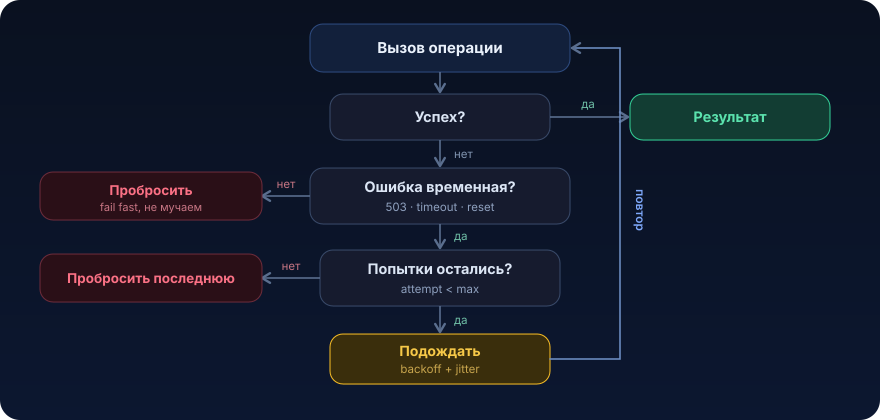

# Ретраи


Сеть это не функция, которая либо возвращает значение, либо кидает исключение. Это функция, которая иногда возвращает значение, иногда кидает исключение, а иногда просто зависает на 30 секунд и потом всё равно кидает исключение. Ретраи это первый и самый дешёвый инструмент, который превращает дёргающийся распределённый мир во что-то, на что можно положиться. И одновременно инструмент, которым чаще всего простреливают ногу. Разберёмся, как делать правильно

## Разминка

Три вопроса перед чтением. Ответы под спойлером.

1. Вызов упал с `400 Bad Request`. Стоит ретраить?
2. Ты ретраишь `POST /charge` без idempotency key, первый запрос дошёл и списал деньги, но ответ потерялся. Что даст повтор?
3. Тысяча клиентов упала в одну секунду и все повторяют ровно через 200 мс. Что почувствует сервис, который только встал?

<details>
<summary>Показать ответы</summary>

1. **Нет.** `400` это не временная ошибка, запрос невалиден, повтор вернёт ровно тот же `400`. Ретраить `4xx` (кроме `429`) бессмысленно, только потратишь время пользователя и чужой сервис
2. **Второе списание.** Сервер уже выполнил операцию, повтор без идемпотентности создаст новый эффект. Ретрай неидемпотентной операции это генератор дублей
3. **Синхронную волну (thundering herd).** Все повторы приходят в один момент и накрывают сервис ровно тогда, когда он поднялся. Лечится экспоненциальным backoff с jitter

</details>

## Проблема

Платёжный сценарий. Продавец подтверждает отгрузку заказа, мы синхронно ходим во внешний биллинг за списанием комиссии. Клиент простой, на `RestClient`:

```java
@Service
public class BillingClient {

    private final RestClient restClient;

    public ChargeResult charge(ChargeRequest request) {
        // Один вызов. Один шанс. Если сеть моргнула, исключение улетает наверх.
        return restClient.post()
                .uri("/api/v1/charges")
                .body(request)
                .retrieve()
                .body(ChargeResult.class);
    }
}
```

Код выглядит нормально. Ревью проходит, тесты зелёные, на стейдже работает.

А в проде в дашборде появляется ровная линия ошибок: **0.3% вызовов `charge()` падают** с `503 Service Unavailable` и `Connection reset`. Не 30%, не 3%, всего 0.3%. Копаем логи биллинга: в эти моменты у них шёл rolling-деплой, инстанс на секунду ушёл из балансировщика, соединение оборвалось. Через 200 мс тот же запрос прошёл бы на соседнем поде без единого вопроса.

Почему это дорого:

- **0.3% это не «ерунда».** При 2 млн операций в сутки это 6000 заказов, где продавец увидел красный экран «попробуйте позже». Часть позвонит в поддержку, часть просто уйдёт
- **ошибка временная, а мы обошлись с ней как с фатальной.** Бизнес-причины для отказа не было, просто соседний под перезапускался
- **каскад наверх.** Исключение из `charge()` откатывает нашу транзакцию, роняет обработку Kafka-сообщения, сообщение уходит в retry-топик или DLT, и мы чиним уже не «моргнувшую сеть», а «застрявшую очередь»

Инстинктивное решение «ну давайте повторим» правильное. Но если повторить наивно (`for (int i = 0; i < 3; i++)` без задержки, без разбора кто виноват, без учёта идемпотентности), можно сделать хуже, чем было. Об этом и урок

## Что это и когда применять

Ретрай это повторный вызов операции, которая упала с **временной** (transient) ошибкой, в расчёте на то, что следующая попытка пройдёт.

Ключевое слово временная. Ретрай лечит ровно один класс проблем: сбой, который сам рассосётся за секунды без нашего участия. Примеры:

- сетевой обрыв (`Connection reset`, `SocketTimeoutException` на connect)
- `503 Service Unavailable`, `502 Bad Gateway`, инстанс перезапускается или деплоится
- `429 Too Many Requests`, нас притормозили, но пустят позже
- дедлок в PostgreSQL (`40P01`), сериализационный конфликт (`40001`), база просит повторить транзакцию
- лидер-партиция Kafka переехала (`NotLeaderForPartition`)

### Когда ретрай НЕ нужен и вреден

- **ошибка не временная.** `400`, `404`, `422`, `403` повтор даст ровно тот же результат. Ты просто три раза получишь один отказ, потратив время пользователя и нагрузив чужой сервис
- **операция не идемпотентна, а гарантий на сервере нет.** «Списать деньги» без idempotency key плюс ретрай это двойное списание, когда первый запрос на самом деле дошёл, а ответ потерялся. Решение не «не ретраить», а «сделать операцию идемпотентной» (см. [урок 01](01-idempotency.md))
- **ошибка это перегрузка, которую ретраи усилят.** Сервис лёг, потому что не справляется, а ты каждый упавший запрос повторяешь ×3, и утроил нагрузку на умирающий сервис. Это retry storm, ретраи из лекарства превращаются в добивание. Тут ретрай работает в паре с circuit breaker и backoff
- **долгие операции в синхронном пользовательском пути.** Три ретрая с backoff по 2 секунды это +6 секунд к ответу, пользователь уйдёт раньше. Иногда честнее быстро вернуть ошибку, а надёжность обеспечить асинхронно (outbox плюс поллер)

Правило: ретрай для transient-ошибок идемпотентных операций. Всё остальное сначала привести к этому виду, потом ретраить

## Как это работает

<p align="center">
  
</p>

Четыре решения определяют, хороший у тебя ретрай или опасный.

**1. Что ретраить, а что нет (retry predicate).** Явно перечисляем, какие ошибки временные. Всё, что не в списке, пробрасываем сразу. Для HTTP это обычно `5xx` (кроме `501`), `429`, connect/read timeout, `IOException`. Никогда не ретраим `4xx` (кроме `429`) и бизнес-ошибки.

**2. Сколько раз (maxAttempts).** Обычно 3 попытки суммарно (1 основная плюс 2 повтора). Больше редко имеет смысл: если не помогло за 3 раза за пару секунд, проблема не «моргнула сеть», это настоящая деградация, её надо отдавать наверх, а не молотить.

**3. Как ждать между попытками (backoff).**

- *fixed*, фиксированная пауза (200 мс). Просто, но при массовом сбое все клиенты синхронно ломятся снова
- *exponential*, 200, 400, 800, 1600 мс. Даёт сервису время подняться. Стандарт для сетевых вызовов
- *exponential + jitter*, обязательно для exponential. Без jitter все упавшие в одну секунду клиенты повторят строго через 200 мс, одной волной. Это thundering herd. Формула AWS «full jitter»: `sleep = random(0, min(cap, base * 2^attempt))`. Подробно в [уроке 03](03-backoff-jitter.md)

**4. Идемпотентность (кто гарантирует «ровно один эффект»).** Ретрай безопасен, только если повтор не создаёт второй побочный эффект. Способы: idempotency key на операцию, дедуп-таблица с уникальным индексом (`INSERT ... ON CONFLICT DO NOTHING`), естественная идемпотентность (`GET`, `PUT` по ключу, `DELETE`). Это целиком [урок 01](01-idempotency.md).

Отдельно про **бюджет ретраев.** Ретраи не бесплатны, они превращаются в нагрузку. Полезно ограничивать долю ретраев от общего трафика (retry budget: «не более 10% запросов повторные»), чтобы при массовом сбое клиент не удвоил нагрузку на всех.

## Пример на Java

Сначала руками, чтобы механика была видна насквозь. Потом как это делается боевым инструментом (Resilience4j) и Spring `@Retryable`. И главное как сделать серверную часть идемпотентной, потому что без неё ретрай платежа это бомба.

### Вариант 1. Руками, чтобы понять механику

```java
public final class Retry {

    private Retry() {
    }

    // Универсальный ретрай с экспоненциальным backoff и full jitter.
    public static <T> T execute(
            int maxAttempts,
            long baseDelayMs,
            long capDelayMs,
            Predicate<Exception> retryable,
            Supplier<T> action) {

        Exception last = null;
        for (int attempt = 1; attempt <= maxAttempts; attempt++) {
            try {
                return action.get();               // сама операция
            } catch (Exception e) {
                last = e;
                // Не временная ошибка ИЛИ попытки кончились: выходим сразу, без сна.
                if (!retryable.test(e) || attempt == maxAttempts) {
                    break;
                }
                sleep(backoffWithJitter(attempt, baseDelayMs, capDelayMs));
            }
        }
        throw new RetryExhaustedException("Все " + maxAttempts + " попыток исчерпаны", last);
    }

    // full jitter: random(0, min(cap, base * 2^(attempt-1)))
    private static long backoffWithJitter(int attempt, long baseMs, long capMs) {
        long exp = baseMs * (1L << (attempt - 1));          // 200, 400, 800...
        long bounded = Math.min(capMs, exp);
        return ThreadLocalRandom.current().nextLong(bounded + 1);
    }

    private static void sleep(long ms) {
        try {
            Thread.sleep(ms);
        } catch (InterruptedException ie) {
            Thread.currentThread().interrupt();             // не глотаем interrupt
            throw new RetryExhaustedException("Прерван во время backoff", ie);
        }
    }
}
```

Применение в клиенте, с честным predicate «что временное»:

```java
public ChargeResult charge(ChargeRequest request) {
    return Retry.execute(
            3,                 // 1 основная + 2 повтора
            200,               // base 200 мс
            2_000,             // cap 2 сек
            BillingClient::isTransient,
            () -> restClient.post()
                    .uri("/api/v1/charges")
                    .header("Idempotency-Key", request.idempotencyKey()) // один ключ на все попытки!
                    .body(request)
                    .retrieve()
                    .body(ChargeResult.class));
}

// Ретраим ТОЛЬКО временное. 4xx (кроме 429) сразу наверх.
private static boolean isTransient(Exception e) {
    if (e instanceof HttpServerErrorException se) {       // 5xx
        return se.getStatusCode().value() != 501;
    }
    if (e instanceof HttpClientErrorException.TooManyRequests) { // 429
        return true;
    }
    return e instanceof ResourceAccessException;          // timeout / connection reset
}
```

`idempotencyKey` генерируется **один раз на бизнес-операцию** (например, `UUID` при создании `ChargeRequest`) и не меняется между попытками. Если сгенерировать новый ключ на каждую попытку, идемпотентность сломается, и первый потерявшийся запрос всё-таки спишет деньги вторично.

### Вариант 2. Resilience4j, так в проде

Руками писать backoff в каждом клиенте плохо. Resilience4j даёт декларативную конфигурацию, метрики и связку retry плюс circuit breaker плюс timeout из коробки.

```java
RetryConfig config = RetryConfig.custom()
        .maxAttempts(3)
        .intervalFunction(IntervalFunction.ofExponentialRandomBackoff(
                Duration.ofMillis(200),   // initial
                2.0,                      // multiplier
                0.5))                     // jitter factor (±50%)
        .retryOnException(BillingClient::isTransient)   // тот же честный predicate
        .build();

Retry retry = Retry.of("billing", config);

// оборачиваем вызов
Supplier<ChargeResult> decorated = Retry.decorateSupplier(retry, () -> rawCharge(request));
ChargeResult result = decorated.get();
```

С аннотацией (Spring Boot плюс `resilience4j-spring-boot3`):

```java
@Retry(name = "billing")               // конфиг ниже в application.yml
@CircuitBreaker(name = "billing")      // ретрай + предохранитель вместе
public ChargeResult charge(ChargeRequest request) {
    return rawCharge(request);
}
```

```yaml
resilience4j:
  retry:
    instances:
      billing:
        max-attempts: 3
        wait-duration: 200ms
        enable-exponential-backoff: true
        exponential-backoff-multiplier: 2
        enable-randomized-wait: true          # jitter
        retry-exceptions:
          - org.springframework.web.client.ResourceAccessException
        ignore-exceptions:
          - org.springframework.web.client.HttpClientErrorException  # все 4xx мимо
  circuitbreaker:
    instances:
      billing:
        sliding-window-size: 50
        failure-rate-threshold: 50            # >50% ошибок → open, перестаём долбить
        wait-duration-in-open-state: 10s
```

Ретрай всегда ходит в паре с circuit breaker: ретрай спасает от единичных сбоев, breaker спасает от retry storm, когда сервис лёг по-настоящему. Порядок важен, breaker снаружи, retry внутри (breaker считает финальный исход после ретраев). Про breaker целиком [урок 06](06-circuit-breaker.md).

### Вариант 3. Идемпотентность на сервере, фундамент, без которого ретрай опасен

Клиент шлёт `Idempotency-Key`. Сервер обязан гарантировать: с одним ключом ровно один эффект. Делается уникальным индексом в PostgreSQL, а не «сначала SELECT потом INSERT» (между ними гонка).

```sql
-- дедуп-таблица обработанных операций
CREATE TABLE processed_charge (
    idempotency_key UUID PRIMARY KEY,          -- уникальность гарантирует БД
    charge_id       BIGINT      NOT NULL,
    response_body   JSONB       NOT NULL,       -- сохранённый ответ для повторов
    created_at      TIMESTAMP   NOT NULL DEFAULT now()
);
```

```java
@Transactional
public ChargeResult charge(UUID idempotencyKey, ChargeRequest req) {
    // Пытаемся застолбить ключ. Если он уже есть, вставки не будет.
    int inserted = jdbc.update("""
            INSERT INTO processed_charge (idempotency_key, charge_id, response_body, created_at)
            VALUES (?, ?, ?::jsonb, now())
            ON CONFLICT (idempotency_key) DO NOTHING
            """, idempotencyKey, newChargeId, serialize(placeholder));

    if (inserted == 0) {
        // Ключ уже обработан (это ретрай прошлого запроса). НЕ списываем повторно,
        // возвращаем сохранённый результат.
        return loadStoredResult(idempotencyKey);
    }

    // Первый раз видим ключ: выполняем реальное списание внутри той же транзакции.
    ChargeResult result = doRealCharge(req);
    jdbc.update("UPDATE processed_charge SET response_body = ?::jsonb WHERE idempotency_key = ?",
            serialize(result), idempotencyKey);
    return result;
}
```

Теперь клиентский ретрай безопасен: даже если первый запрос дошёл и списал деньги, а ответ потерялся в сети, повтор с тем же ключом упрётся в `ON CONFLICT` и вернёт прежний результат. Двойного списания физически не будет, за это отвечает `PRIMARY KEY`, а не аккуратность программиста.

### Когда синхронный ретрай не годится, outbox

Если операцию **нельзя** терять, но и держать пользователя в ожидании ретраев нельзя, не ретраим в пользовательском пути вовсе. Пишем намерение в outbox-таблицу в той же транзакции, что и бизнес-данные, и отдаём ответ. Фоновый поллер вычитывает outbox и ретраит доставку во внешний сервис сколько угодно долго, уже вне критического пути. Это [урок 10](10-transactional-outbox.md), а как поллер масштабируется на несколько инстансов, [урок 14](14-claim-lease.md).

## Подводные камни

1. **Ретрай неидемпотентной операции даёт дубликаты.** Списали деньги, ответ потеряли, повторили, списали ещё раз. Ретрай `POST` без idempotency key на сервере почти всегда баг. Сначала идемпотентность, потом ретрай
2. **Один ключ на попытку вместо одного на операцию.** Idempotency key должен генерироваться при создании операции и переживать все попытки. Сгенерировал новый UUID в цикле ретрая, идемпотентность превратилась в тыкву, каждый повтор для сервера «новая операция»
3. **Retry storm без jitter (thundering herd).** Тысяча клиентов упала в одну секунду и повторила ровно через 200 мс, сервис накрыло синхронной волной в тот момент, когда он только поднялся. Экспоненциальный backoff обязан быть с jitter, `enable-randomized-wait: true` не опционально
4. **Вложенные ретраи (умножение попыток).** Ретрай на клиенте (3) × ретрай в HTTP-библиотеке (3) × ретрай в вызывающем сервисе (3) = 27 реальных вызовов на один логический. Ретрай должен быть на одном уровне стека. Проверь, что нижележащий клиент (Feign, gateway, service mesh) не ретраит уже за тебя
5. **Ретрай без circuit breaker.** Когда сервис лёг по-настоящему, ретраи не помогают, а добивают. Единичные сбои лечит retry, массовые должен перехватить breaker и начать fail fast, дав сервису подняться
6. **Ретрай поверх дорогого таймаута.** Read timeout 30 секунд, ретраев 3, в худшем случае пользователь ждёт 90+ секунд, а нить всё это время занята. Таймаут одной попытки должен быть агрессивным, а суммарный бюджет (timeout × attempts + backoff) вписываться в SLA. Иначе ретрай съедает пул потоков. Про это [урок 05](05-timeouts.md)
7. **Ретрай по read timeout неидемпотентного запроса.** Connect timeout безопасен, соединение не установилось, сервер точно ничего не сделал. Read timeout коварен: запрос мог дойти и выполниться, просто ответ не успел. Ретраить read timeout `POST` без идемпотентности это тот же дубликат, что в п.1
8. **Дедуп-таблица без TTL и очистки.** `processed_charge` растёт вечно, индекс пухнет, вставки замедляются. Нужен TTL или периодическая чистка старых ключей. Но окно дедупа не должно быть короче максимального времени жизни ретрая, иначе поздний повтор проскочит мимо

## Практическая задача

> 🎯 Уровень: middle. Ожидаемое время: 2–3 часа с тестами

**Система.** Сервис оформления заказов. При подтверждении заказа мы синхронно ходим во внешний сервис лояльности `LoyaltyClient.accrue(...)`, начислить продавцу бонусные баллы за выполненный заказ. Начисление это `POST /api/v1/accruals`, побочный эффект (меняет баланс).

**Дано, код, который сейчас ломается:**

```java
@Service
public class AccrualService {

    private final RestClient loyaltyRestClient;
    private final AccrualRepository accrualRepository;

    @Transactional
    public void accrueForOrder(Long orderId, long sellerId, int points) {
        // Одна попытка. Нет разбора ошибок. Нет защиты от дублей.
        AccrualResponse resp = loyaltyRestClient.post()
                .uri("/api/v1/accruals")
                .body(new AccrualRequest(sellerId, points))
                .retrieve()
                .body(AccrualResponse.class);

        accrualRepository.save(new Accrual(orderId, resp.accrualId(), points));
    }
}
```

Симптомы в проде:

- в момент деплоя сервиса лояльности ~0.5% вызовов падают с `503` / `Connection reset`. Заказ подтверждается, но баллы не начисляются, продавцы жалуются
- была попытка «просто обернуть в `for` с тремя повторами». После этого появились двойные начисления: у части заказов баллы начислились дважды. Откатили

**ТЗ.** Реализовать надёжное начисление через ретрай плюс идемпотентность.

1. Добавить ретрай на вызов `accrue`, который повторяет только transient-ошибки (`5xx`, `429`, connect/read timeout) и не повторяет `4xx`
2. Backoff экспоненциальный с jitter, суммарно не более 3 попыток
3. Сделать операцию идемпотентной, чтобы повтор (в том числе после потерянного ответа на успешный запрос) не создавал второе начисление. Использовать idempotency key, живущий всю операцию, плюс защиту на уровне БД
4. Ретрай не должен бесконечно держать пользовательскую нить, задать разумный таймаут одной попытки и убедиться, что суммарный бюджет вписывается в SLA (скажем, < 5 сек)

**Критерии приёмки** (проверь тестами, отметь галочками):

- [ ] вызов, где первые 2 попытки отвечают `503`, а 3-я `200`, в итоге успешен и создаёт ровно одно начисление (замокать WireMock-ом)
- [ ] вызов, где сервис отвечает `400`, падает сразу, без повторов (число обращений к моку == 1)
- [ ] повторный вызов `accrueForOrder` с тем же `orderId` не создаёт второе начисление и не делает второй реальный `POST`, возвращает прежний результат
- [ ] между попытками есть задержка и она не одинаковая от прогона к прогону (jitter работает)

<details>
<summary>Подсказки (без готового решения)</summary>

- в качестве idempotency key возьми что-то стабильное между попытками и привязанное к операции, например детерминированный ключ из `orderId` (одно начисление на заказ). Тогда «повтор» и «переобработка сообщения» схлопываются в один эффект
- защиту от дубля строй на уникальном индексе (`orderId` или `idempotency_key`) плюс `INSERT ... ON CONFLICT DO NOTHING`, а не «SELECT потом INSERT»
- продумай границу транзакции: не тянешь ли ты медленный HTTP внутри открытой БД-транзакции, это отдельный запах. Что произойдёт, если внешний вызов упадёт после того, как ты застолбил ключ?
- для ретрая возьми Resilience4j `@Retry` плюс честный `retryOnException` / `ignore-exceptions`, либо напиши руками по схеме из урока. Не ретрай `HttpClientErrorException`
- проверь, что твой `RestClient` не ретраит уже сам по себе, иначе получишь вложенные ретраи

</details>

<details>
<summary>Эскиз решения (открывай, когда попробовал сам)</summary>

Готовое решение это связка из трёх компонентов, убери любой и что-то сломается:

1. **transient-only retry с jitter.** `@Retry` с `retryOnException` только на `5xx`/`429`/`ResourceAccessException`, `ignore-exceptions` на `HttpClientErrorException`. Без jitter вернётся retry storm
2. **idempotency key на операцию.** Детерминированный из `orderId`, один на все попытки. Без этого вернутся дубли при потерянном ответе
3. **уникальный индекс на стороне БД.** `INSERT ... ON CONFLICT DO NOTHING` по `orderId`, реальный `POST` в лояльность только если вставка прошла. Это физическая гарантия «одно начисление на заказ»

Порядок: сначала атомарно застолбить ключ, потом внешний вызов вне открытой транзакции, потом зафиксировать результат. Если внешний вызов упал, ключ надо освободить (или пометить неуспешным), чтобы честный ретрай мог пройти заново.

</details>

## Что почитать

- [Resilience4j: Retry](https://resilience4j.readme.io/docs/retry) и [CircuitBreaker](https://resilience4j.readme.io/docs/circuitbreaker), конфигурация и связка retry плюс breaker
- [Amazon Builders' Library: Timeouts, retries, and backoff with jitter](https://aws.amazon.com/builders-library/timeouts-retries-and-backoff-with-jitter/), эталон про то, почему нужен jitter и как считать бюджет
- [AWS Architecture Blog: Exponential Backoff And Jitter](https://aws.amazon.com/blogs/architecture/exponential-backoff-and-jitter/), с графиками, наглядно про thundering herd
- [microservices.io: Transactional Outbox](https://microservices.io/patterns/data/transactional-outbox.html) и [Idempotent Consumer](https://microservices.io/patterns/communication-style/idempotent-consumer.html), когда синхронный ретрай не годится

---

← [Идемпотентность (01)](01-idempotency.md) · [Обзор раздела](README.md) · [Backoff и jitter (03) →](03-backoff-jitter.md)
