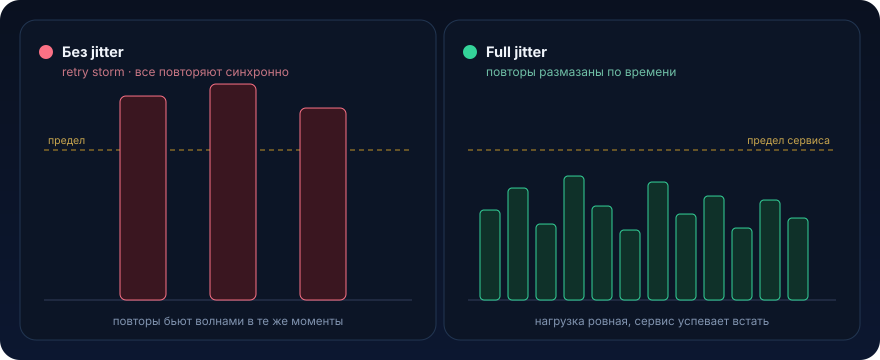

# Backoff и jitter


Ретрай это самая соблазнительная строчка кода в распределённой системе. «Не получилось, попробуй ещё раз», что может пойти не так? Оказывается, ретрай без backoff и jitter это не механизм устойчивости, а генератор перегрузки. Разберём, как наивные повторы превращают короткий сбой в многочасовой аутаж, и как backoff с jitter это чинят

## Разминка

Три вопроса перед чтением. Ответы под спойлером.

1. Экспоненциальный backoff без jitter: тысяча клиентов упала в одну секунду, ждёт 200, потом 400, потом 800 мс. Волны исчезли?
2. `1L << attempt` при `attempt = 40`. Какая получится задержка?
3. `maxAttempts = 5`, `cap = 30s`, а вызывающий отвалится по своему таймауту через 3 секунды. В чём проблема?

<details>
<summary>Показать ответы</summary>

1. **Нет.** Все ждут одинаково (200, 400, 800), поэтому повторы всё равно приходят синхронными волнами, просто реже. Экспонента снижает суммарное давление, но пики убирает только jitter
2. **Мусорная, скорее всего отрицательная или нулевая.** Сдвиг `long` на 40 переполняется. Нужен `Math.min(attempt, 30)` или другой потолок, иначе backoff вместо паузы даст мгновенный повтор
3. **Ретраи ждут дольше, чем есть смысл.** Клиент уже получил таймаут и ушёл, а мы всё ещё спим и держим поток с соединением. Нужен общий дедлайн ≤ бюджета вызывающего, а не просто счётчик попыток

</details>

## Проблема

Пятница, 19:00. Твой `payment-service` ходит во внешний `provider-gateway` (эквайринг) по HTTP. Обычно p99 = 80 мс. В 19:00 у провайдера подтормозила база, latency подскочила до 3 секунд, часть запросов стала отдавать `503`. Ничего страшного, это штатная деградация, провайдер бы восстановился за 30–40 секунд сам.

Но у тебя 4000 инстансов клиентских воркеров, и в каждом вот такой «правильный» и «отказоустойчивый» код:

```java
// Выглядит как надёжность. На деле оружие против самого себя.
public PaymentResult charge(PaymentRequest req) {
    int attempts = 0;
    while (true) {
        try {
            return gatewayClient.charge(req); // HTTP POST во внешний шлюз
        } catch (TransientException e) {
            attempts++;
            if (attempts >= 5) {
                throw e;
            }
            sleep(200); // фиксированная пауза 200 мс и снова бьём
        }
    }
}
```

Что происходит дальше по секундам:

```
t=0.0s   Шлюз затупил. 4000 запросов получают 503/timeout одновременно.
t=0.2s   Все 4000 клиентов проснулись РОВНО через 200 мс и ударили снова.
t=0.4s   Ещё волна из 4000. Шлюз, который начал вставать, снова уложен.
t=0.6s   Волна. t=0.8s Волна. t=1.0s Волна...
         Каждые 200 мс синхронный залп в 4000 запросов.
```

Три вещи, которые тут ломаются:

1. **Синхронизация фаз (thundering herd).** Все клиенты упали в один момент и ждут одинаковые 200 мс. Ретраи выстраиваются в резонансные волны. Вместо равномерной нагрузки шлюз получает пульсирующие пики в разы выше обычного RPS
2. **Retry storm, усиление нагрузки.** Обычный трафик × (1 + число ретраев). При 5 попытках ты генерируешь до 5× нормального RPS ровно в тот момент, когда сервис слабее всего. Сервис, который бы восстановился сам, теперь не может подняться, его добивают ретраями
3. **Исчерпание ресурсов у себя.** Пока воркер сидит в `while(true)` и спит, он держит поток, HTTP-соединение из пула и, если не повезло, открытую транзакцию базы. Пул потоков забивается, `payment-service` перестаёт принимать новые запросы, сбой у провайдера превратился в твой собственный аутаж

Итог: 40-секундная деградация партнёра стала 40-минутным инцидентом с алертами, потерянными платежами и постмортемом. И всё из-за строчки `sleep(200)`

## Что это и когда применять

**Backoff (отступление)** это увеличивать паузу между повторами, а не бить с фиксированным интервалом. Обычно экспоненциально: `base × 2^attempt`. Идея: если сервис не ответил, дай ему больше времени встать и снижай собственное давление с каждой попыткой.

**Jitter (дрожание)** это добавить случайность в задержку, чтобы **расфазировать** клиентов. Даже если тысяча клиентов упала в одну миллисекунду, их следующие попытки размажутся по времени, а не соберутся в волну.

Проще говоря: backoff уменьшает суммарное давление, jitter убирает синхронные пики. По отдельности они работают хуже. Экспонента без jitter всё равно даёт волны (все ждут одинаковые 200 → 400 → 800 мс), а jitter без backoff не снижает нагрузку. Вместе это стандарт индустрии.

### Когда применять

- ретраи любых сетевых вызовов: HTTP к внешним сервисам, запросы в базу, публикация в Kafka
- опрос (polling) статусов, long-polling, переподключение консьюмеров и вебсокетов
- повтор захвата распределённого лока, оптимистичные блокировки (`OptimisticLockException`)

### Когда НЕ нужно

- **не ретрай бизнес-ошибки.** `400`, `403`, `422`, «карта отклонена», ошибка валидации, повтор не поможет, ты просто зря нагружаешь систему. Ретраить можно только transient: таймауты, `502/503/504`, `429`, обрывы соединения, дедлоки базы
- **не ретрай неидемпотентные операции без ключа идемпотентности.** «Списать деньги» с ретраем и без idempotency key это двойное списание. Сначала идемпотентность (см. [урок 01](01-idempotency.md)), потом ретрай
- **не строй ретраи там, где уже есть очередь.** Если операция ушла в Kafka или outbox, повтором занимается инфраструктура (offset не закоммичен, значит перечитается). Клиентский `while(true)` тут лишний
- **не ретрай бесконечно на пользовательском пути.** У синхронного HTTP-запроса есть дедлайн, пользователь ждёт. 2–3 попытки в пределах бюджета таймаута это потолок. Долгие ретраи это фон и асинхронщина
- **backoff не заменяет circuit breaker.** Если сервис лежит стабильно, backoff всё равно дёргает его на каждом запросе. Нужен предохранитель, который перестанет пытаться совсем ([урок 06](06-circuit-breaker.md))

## Как это работает

### Виды jitter

Каноническая классификация из статьи AWS «Exponential Backoff And Jitter». Обозначим `base` базовая задержка, `cap` потолок, `attempt` номер попытки (с 0).

**1. No jitter (чистая экспонента), плохо:**

```
delay = min(cap, base * 2^attempt)
```

Все клиенты ждут одинаково, волны сохраняются. Не используй.

**2. Full jitter, рекомендуемый дефолт:**

```
delay = random(0, min(cap, base * 2^attempt))
```

Задержка равномерно размазана от 0 до текущего потолка окна. Максимально расфазирует клиентов.

**3. Equal jitter, компромисс (половина фиксированная, половина случайная):**

```
temp  = min(cap, base * 2^attempt)
delay = temp/2 + random(0, temp/2)
```

Гарантирует минимальную паузу (клиент не ударит слишком рано), но чуть хуже размазывает, чем full.

**4. Decorrelated jitter, хорош для агрессивного опроса:**

```
delay = min(cap, random(base, prev_delay * 3))
```

Задержка «блуждает», отталкиваясь от предыдущей. Даёт хорошее размазывание и не проседает в ноль.

По экспериментам AWS full jitter и decorrelated jitter дают наименьшее число вызовов и наименьший разброс завершения. Дефолт для 90% случаев это full jitter.

### Как экспонента и full jitter гасят волну

<p align="center">
  
</p>

С каждой попыткой окно `[0, base*2^attempt]` шире, плотность запросов на единицу времени падает, сервис получает передышку и успевает встать.

### Ключевые параметры, которые надо задать осознанно

| Параметр | Что значит | Типичные значения |
|---|---|---|
| `base` | стартовая задержка | 50–200 мс |
| `multiplier` | во сколько раз растёт | 2.0 |
| `cap` (max delay) | потолок одной паузы | 2–30 с |
| `maxAttempts` | сколько всего попыток | 3–5 (sync), больше для фона |
| `jitter` | вид дрожания | full jitter |
| `retryableExceptions` | что вообще ретраим | только transient |
| overall deadline | суммарный бюджет времени | ≤ таймаута вызывающего |

### Backoff в связке с circuit breaker

Backoff и jitter решают проблему одновременных повторов. Но если сервис лежит **надолго**, каждый новый входящий запрос всё равно попытается (и прождёт весь backoff, съедая потоки). Поэтому в проде backoff идёт в паре с circuit breaker: при стабильном потоке ошибок предохранитель открывается и начинает мгновенно отбивать запросы, не грузя лежащий сервис. Автомат состояний CLOSED → OPEN → HALF_OPEN целиком разбирается в [уроке 06](06-circuit-breaker.md).

Правильная многослойная защита клиента читается снаружи внутрь: **Timeout** (не жди вечно) → **Retry с backoff и jitter** (переживи короткий сбой) → **Circuit Breaker** (при долгом сбое перестань долбить) → **Bulkhead и rate limiter** (изолируй пул ресурсов).

## Пример на Java

### Вариант 1. Backoff и full jitter руками

Полезно понять механику, прежде чем брать библиотеку.

```java
import java.time.Duration;
import java.util.concurrent.ThreadLocalRandom;
import java.util.function.Supplier;

public final class RetryExecutor {

    private final int maxAttempts;
    private final long baseMillis;
    private final long capMillis;

    public RetryExecutor(int maxAttempts, Duration base, Duration cap) {
        this.maxAttempts = maxAttempts;
        this.baseMillis = base.toMillis();
        this.capMillis = cap.toMillis();
    }

    public <T> T execute(Supplier<T> action) {
        int attempt = 0;
        while (true) {
            try {
                return action.get();
            } catch (RuntimeException e) {
                attempt++;
                // Ретраим только transient. Бизнес-ошибку пробрасываем сразу.
                if (attempt >= maxAttempts || !isRetryable(e)) {
                    throw e;
                }
                sleep(nextDelayWithFullJitter(attempt));
            }
        }
    }

    // delay = random(0, min(cap, base * 2^attempt)), full jitter
    private long nextDelayWithFullJitter(int attempt) {
        long exp = baseMillis * (1L << Math.min(attempt, 30)); // защита от переполнения сдвига
        long window = Math.min(capMillis, exp);
        return ThreadLocalRandom.current().nextLong(window + 1);
    }

    private boolean isRetryable(RuntimeException e) {
        return e instanceof TransientException; // 5xx, 429, timeout, обрыв соединения
    }

    private void sleep(long millis) {
        try {
            Thread.sleep(millis);
        } catch (InterruptedException ie) {
            Thread.currentThread().interrupt();
            throw new IllegalStateException("Прерван во время backoff", ie);
        }
    }
}
```

Ключевое: `1L << attempt` без `Math.min(..., 30)` при `attempt = 40` переполнит `long` и даст отрицательную или нулевую задержку, классический баг. И `nextLong(window + 1)`, потому что верхняя граница у `nextLong` эксклюзивна.

### Вариант 2. Боевой, Resilience4j (retry плюс circuit breaker)

В проде backoff руками не пишут. Resilience4j даёт декларативную композицию.

```java
import io.github.resilience4j.circuitbreaker.CircuitBreaker;
import io.github.resilience4j.circuitbreaker.CircuitBreakerConfig;
import io.github.resilience4j.retry.Retry;
import io.github.resilience4j.retry.RetryConfig;
import io.github.resilience4j.core.IntervalFunction;
import java.time.Duration;

public class GatewayResilience {

    // Экспонента с full jitter из коробки:
    // ofExponentialRandomBackoff(initial, multiplier, randomizationFactor)
    private final Retry retry = Retry.of("gateway", RetryConfig.custom()
            .maxAttempts(4)
            .intervalFunction(IntervalFunction.ofExponentialRandomBackoff(
                    Duration.ofMillis(100),  // base
                    2.0,                     // multiplier
                    0.5))                    // randomizationFactor => ±50% jitter
            // Ретраим только transient-ошибки, бизнес-исключения никогда:
            .retryOnException(e -> e instanceof TransientException)
            .failAfterMaxAttempts(true)
            .build());

    private final CircuitBreaker breaker = CircuitBreaker.of("gateway",
            CircuitBreakerConfig.custom()
                    .slidingWindowSize(50)
                    .failureRateThreshold(50)               // >50% ошибок → OPEN
                    .waitDurationInOpenState(Duration.ofSeconds(10))
                    .permittedNumberOfCallsInHalfOpenState(5)
                    .build());

    public PaymentResult charge(PaymentRequest req, GatewayClient client) {
        // Порядок обёртки важен: сначала CB (внешний), потом Retry (внутренний).
        // CB видит финальный исход после всех ретраев и считает статистику по нему.
        var decorated = Retry.decorateSupplier(retry,
                CircuitBreaker.decorateSupplier(breaker, () -> client.charge(req)));
        return decorated.get(); // при OPEN бросит CallNotPermittedException мгновенно
    }
}
```

`ofExponentialRandomBackoff` это и есть backoff плюс jitter из коробки. `randomizationFactor = 0.5` означает, что фактическая пауза равна базовой ±50%, то есть попытки клиентов расходятся во времени.

### Вариант 3. Spring Boot, декларативно через `@Retryable`

```java
import org.springframework.retry.annotation.Backoff;
import org.springframework.retry.annotation.Retryable;
import org.springframework.stereotype.Service;

@Service
public class GatewayService {

    @Retryable(
        retryFor = TransientException.class,   // только transient
        noRetryFor = BusinessException.class,  // бизнес: никогда
        maxAttempts = 4,
        backoff = @Backoff(
            delay = 100,        // base 100 мс
            multiplier = 2.0,   // экспонента
            maxDelay = 2000,    // потолок 2 с
            random = true))     // <-- ВКЛЮЧАЕТ JITTER. Без него волны!
    public PaymentResult charge(PaymentRequest req) {
        return gatewayClient.charge(req);
    }

    @Recover
    public PaymentResult fallback(TransientException e, PaymentRequest req) {
        // Все попытки исчерпаны: не роняем поток, отдаём деградированный ответ
        // или откладываем в outbox для фоновой обработки.
        return PaymentResult.deferred(req.id());
    }
}
```

`random = true` это та самая строчка, которую забывают. Без неё Spring делает чистую экспоненту, и твои инстансы снова синхронизируются в волны.

### Вариант 4. Ретрай только с идемпотентностью (иначе двойной платёж)

Ретрай `charge` безопасен, только если провайдер дедуплицирует по ключу. На своей стороне (например, приём вебхука о платеже, который тоже могут доставить повторно) дедуп делаем через уникальный индекс в PostgreSQL:

```sql
-- Дедуп-таблица: ключ идемпотентности живёт достаточно долго (не «5 минут»)
CREATE TABLE processed_payment (
    idempotency_key TEXT PRIMARY KEY,   -- ключ от клиента/провайдера
    payment_id      BIGINT NOT NULL,
    created_at      TIMESTAMPTZ NOT NULL DEFAULT now()
);
```

```java
@Transactional
public PaymentResult chargeOnce(PaymentRequest req) {
    // Пытаемся застолбить ключ. ON CONFLICT DO NOTHING => вставка «проглатывается»,
    // если ключ уже был. Возвращаем 0 обновлённых строк => это повтор.
    int inserted = jdbc.update(
        "INSERT INTO processed_payment(idempotency_key, payment_id) " +
        "VALUES (?, ?) ON CONFLICT (idempotency_key) DO NOTHING",
        req.idempotencyKey(), req.paymentId());

    if (inserted == 0) {
        // Повторный ретрай того же запроса: второй платёж НЕ создаём.
        return loadExistingResult(req.idempotencyKey());
    }
    return gatewayClient.charge(req); // безопасно ретраить: ключ уже уникален
}
```

Связка «уникальный индекс плюс `ON CONFLICT DO NOTHING`» делает операцию идемпотентной на уровне базы, и теперь ретрай с backoff уже не опасен.

## Подводные камни

1. **Jitter забыли включить.** `@Backoff(delay=100, multiplier=2)` без `random=true`, или ручная экспонента без рандома. Экспонента снижает суммарное давление, но клиенты по-прежнему бьют синхронно, волны остаются. Jitter обязателен, дефолт full jitter
2. **Ретрай неидемпотентной операции.** Таймаут не значит, что операция не выполнилась, ответ мог потеряться на обратном пути. Ретрай `charge` без idempotency key это двойное списание. Всегда сначала идемпотентность, потом ретрай
3. **Ретрай бизнес-ошибок.** Повтор `400/403/422`, «карта отклонена», ошибок валидации бесполезен и вреден, ты усиливаешь нагрузку без шанса на успех. Ретраить строго transient
4. **Вложенные ретраи (retry amplification).** Клиент ретраит 3× → HTTP-клиент внутри ретраит 3× → сервис-адресат тоже ретраит свой апстрим 3×. Итого 27× нагрузки от одного запроса. Ретрай должен жить на одном уровне стека, обычно на самом внешнем. Отключай ретраи в нижних слоях, если они есть на верхнем
5. **Backoff без общего дедлайна.** `maxAttempts=5` при `cap=30s` может ждать минуты, а вызывающий отвалится по таймауту через 3 секунды. Задавай overall deadline ≤ бюджета таймаута вызывающего, исчерпал бюджет, прекращай, даже если попытки остались
6. **Backoff без circuit breaker при долгом сбое.** Если провайдер лежит 10 минут, каждый входящий запрос честно прождёт весь backoff, занимая поток и соединение, свой пул исчерпается. Нужен предохранитель: при стабильном потоке ошибок перестать пытаться совсем (OPEN) и быстро отбивать
7. **Слишком нервный circuit breaker.** Маленькое `slidingWindow` плюс низкий порог, CB открывается от пары случайных ошибок и режет здоровый трафик. Слишком большое окно плюс высокий порог, открывается слишком поздно, сервис уже завален. Настраивай по реальному профилю ошибок, следи за метриками переходов состояний
8. **Дедуп-ключ с коротким TTL.** Если ключ идемпотентности чистится через 5 минут, а ретрай (или повторная доставка Kafka) пришёл через 10, дедуп не сработает, получишь дубль. Окно жизни ключа должно перекрывать максимально возможную задержку повтора, включая фоновые и outbox-ретраи

## Практическая задача

> 🎯 Уровень: middle. Ожидаемое время: 2–3 часа с тестами

**Контекст.** Сервис `notification-service` рассылает пуши через внешний провайдер `push-gateway` (HTTP). Каждую минуту приходит батч уведомлений, и на пике это ~2000 параллельных отправок с 300 инстансов. Провайдер иногда отдаёт `503` и `429 Too Many Requests` при своих деплоях (деградация на 20–60 секунд, потом сам встаёт).

**Дано, код, который сейчас ломается:**

```java
@Service
public class PushSender {

    private final PushGatewayClient client;

    public void send(PushMessage msg) {
        for (int i = 0; i < 6; i++) {
            try {
                client.send(msg); // POST /push, может кинуть GatewayException
                return;
            } catch (GatewayException e) {
                sleep(500); // фиксированные 500 мс на любой сбой
                // ретраим ВСЁ подряд, включая 400/401
            }
        }
        throw new IllegalStateException("push failed after 6 attempts");
    }

    private void sleep(long ms) {
        try { Thread.sleep(ms); } catch (InterruptedException e) { /* глотаем */ }
    }
}
```

Что происходит на инциденте: при `503` у провайдера все 300 инстансов начинают синхронно ретраить каждые 500 мс. `push-gateway` получает пульсирующие залпы по 2000 запросов и не может подняться. Плюс код ретраит `400 Bad Request` (битый payload), 6 бесполезных повторов на каждое такое сообщение. Плюс `429` ретраится так же агрессивно, игнорируя, что провайдер прямым текстом просит притормозить.

**ТЗ.** Переписать `PushSender` так, чтобы он переживал короткую деградацию провайдера, не добивая его.

1. Экспоненциальный backoff с full jitter. База 100–200 мс, множитель 2.0, потолок паузы ≤ 5 с. Задержка каждой попытки случайна в пределах текущего окна, два инстанса, упавшие одновременно, ретраят в разные моменты
2. Классификация ошибок. Ретраить только transient: `503`, `429`, `502/504`, таймауты. `4xx`-бизнес-ошибки (`400`, `401`, `403`) не ретраить, падать сразу
3. Уважение к `429`. Если провайдер прислал заголовок `Retry-After`, использовать его как минимальную паузу, но всё равно добавить jitter поверх, чтобы клиенты не синхронизировались на одном значении
4. Общий дедлайн. Суммарное время всех попыток ≤ 10 секунд, исчерпан бюджет, прекращаем, даже если попытки остались
5. Можно и желательно взять Resilience4j или Spring `@Retryable` вместо ручного цикла

**Критерии приёмки** (проверь тестами, отметь галочками):

- [ ] при серии `503` задержки между попытками растут (≈100 → 200 → 400) и различаются от запуска к запуску (доказательство jitter)
- [ ] `400 Bad Request` приводит к ровно одной попытке, без повторов
- [ ] при `429` с `Retry-After: 2` следующая попытка происходит не раньше 2 секунд, но не ровно через 2.000 с у всех (jitter поверх)
- [ ] суммарное время при полном исчерпании попыток не превышает дедлайн (≤ 10 с), а не «6 × что-то»
- [ ] залп из N параллельных вызовов при постоянном `503` даёт размазанную гистограмму моментов ретраев, а не столбы на 500/1000/1500 мс

<details>
<summary>Подсказки (без готового решения)</summary>

- full jitter: `delay = random(0, min(cap, base * 2^attempt))`. Проверь, что при большом `attempt` сдвиг `1L << attempt` не переполняется (`Math.min(attempt, 30)`)
- в Resilience4j смотри `IntervalFunction.ofExponentialRandomBackoff(...)`, для `Retry-After` может понадобиться кастомная `IntervalFunction`, читающая заголовок из исключения
- общий дедлайн удобно проверять по «часам»: запомнил `startNanos`, перед каждым `sleep` считаешь оставшийся бюджет и не спишь дольше него
- для теста jitter не гоняй реальные таймеры, вынеси вычисление задержки в чистую функцию `nextDelay(attempt)` и тестируй её напрямую
- не забудь: `catch (InterruptedException)` → `Thread.currentThread().interrupt()`, а не «глотать»

</details>

<details>
<summary>Эскиз решения (открывай, когда попробовал сам)</summary>

Три слоя, которые закрывают критерии:

1. **классификация.** `retryFor`/`retryOnException` только на transient (`503`, `429`, `502/504`, таймаут), `4xx` мимо. Это убирает 6 бесполезных повторов на битом payload и падение сразу на `400`
2. **backoff с full jitter.** `ofExponentialRandomBackoff(100ms, 2.0, 0.5)` или ручной `nextDelayWithFullJitter`. Именно рандом даёт размазанную гистограмму вместо столбов
3. **дедлайн.** Оборачивай не в счётчик попыток, а в «часы»: `deadline = startNanos + 10s`, перед каждым сном режь паузу до остатка бюджета, дошёл до нуля, бросай финальную ошибку

Для `Retry-After`: минимальная пауза `max(backoff, retryAfter)` плюс небольшой случайный сдвиг сверху, чтобы 300 инстансов не проснулись ровно в одну секунду.

</details>

## Что почитать

- [AWS Builders' Library: Timeouts, retries, and backoff with jitter](https://aws.amazon.com/builders-library/timeouts-retries-and-backoff-with-jitter/) (Marc Brooker), почему нужен именно jitter и общий бюджет времени
- [AWS Architecture Blog: Exponential Backoff And Jitter](https://aws.amazon.com/blogs/architecture/exponential-backoff-and-jitter/), первоисточник классификации full/equal/decorrelated jitter с графиками
- [Resilience4j: getting started](https://resilience4j.readme.io/docs/getting-started), Retry, CircuitBreaker, RateLimiter, Bulkhead, TimeLimiter и их композиция
- [microservices.io: Idempotent Consumer](https://microservices.io/patterns/communication-style/idempotent-consumer.html), как сделать повтор безопасным

---

← [Ретраи (02)](02-retries.md) · [Обзор раздела](README.md) · [Rate limiting (04) →](04-rate-limiting.md)
