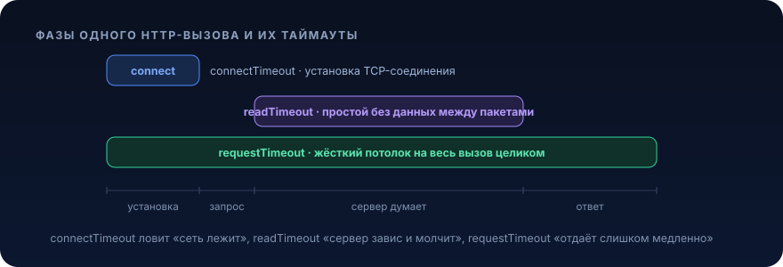

# Таймауты


> «У нас всё работало. Просто один сервис перестал отвечать, и через четыре минуты лёг весь кластер»

Таймаут это самая дешёвая страховка в распределённой системе и одновременно самая часто забываемая. Разберём, почему отсутствие таймаута превращает единичную деградацию в каскадный отказ, где именно в Java-стеке прячутся бесконечные ожидания, и как расставить границы времени так, чтобы система деградировала предсказуемо, а не падала целиком

## Проблема

Пятница, вечер. Твой сервис `order-service` синхронно ходит в `pricing-service` за актуальной ценой перед оформлением заказа. Код выглядит нормально:

```java
@Service
public class PricingClient {

    private final RestTemplate restTemplate = new RestTemplate(); // ← дефолтный, без таймаутов

    public Price fetchPrice(long skuId) {
        return restTemplate.getForObject(
            "http://pricing-service/api/v1/price/{skuId}",
            Price.class,
            skuId
        );
    }
}
```

Ревью прошло, тесты зелёные, на нагрузочном всё летало. А теперь смотрим, что происходит в проде.

`pricing-service` не упал, он завис. GC-пауза, залоченный коннекшн к своей базе, деградировавший диск, не важно. Он принимает TCP-соединение, но ответ не шлёт. Для клиента это худший из сценариев: не отказ (на отказ мы бы среагировали), а бесконечное ожидание.

Что происходит дальше по шагам:

```
t=0s     pricing-service начинает висеть
t=0s     запрос #1 клиента уходит в pricing → поток Tomcat #1 заблокирован в read()
t=1s     +40 запросов/сек, каждый занимает поток из пула Tomcat (200 потоков)
t=5s     ~200 потоков заняты, все ждут ответа, которого не будет
t=5s     пул потоков Tomcat исчерпан
t=5s+    новые HTTP-запросы к order-service встают в accept-очередь
t=8s     healthcheck /actuator/health тоже не может получить поток → k8s считает под мёртвым
t=8s     liveness-проба фейлится → под убивают и рестартят
t=…      трафик переезжает на соседние поды → они забиваются так же → каскад
```

Ключевой момент: проблема была в чужом сервисе, а лёг твой. И не потому что ты делал что-то тяжёлое, а потому что не поставил границу, сколько времени готов ждать. Дефолтный `RestTemplate` (как и `new Socket()`, как и `HttpClient` без настроек в старых версиях) по умолчанию ждёт бесконечно. Один заблокированный поток это ещё не беда. Беда когда их 200, и они держат весь пул, а за пулом стоит очередь, а за очередью healthcheck.

Стоимость: полный отказ сервиса из-за деградации зависимости, которая, может, и сама бы через 30 секунд очухалась. Вместо «часть заказов посчиталась по кэшу» ты получил «весь чекаут лежит плюс каскад на соседей плюс ночной вызов дежурного»

## Что это и когда применять

Таймаут это заранее заданный лимит времени, после которого операция принудительно прекращается с ошибкой, вместо того чтобы ждать результата неопределённо долго.

Проще говоря, ты говоришь «я готов ждать этот вызов максимум N миллисекунд, не уложился, считаем, что не получилось, и идём дальше». Таймаут превращает неопределённое зависание в определённый, обрабатываемый отказ. А обрабатываемый отказ это то, с чем система умеет жить: вернуть кэш, вернуть 503, уйти в fallback, отпустить поток обратно в пул.

Таймаут решает ровно одну, но фундаментальную проблему: защищает твой ограниченный ресурс (потоки, коннекшены, память) от бесконечного удержания медленной или зависшей зависимостью.

### Где таймаут обязателен

- **любой сетевой вызов**, HTTP-клиенты, gRPC, вызовы базы, Kafka-продюсер, Redis, внешние API
- **любое ожидание блокирующего ресурса**, получение коннекшена из пула (`HikariCP.connectionTimeout`), захват лока, `Future.get()`, `queue.poll()`
- **любой цикл ретраев**, общий бюджет времени на всю операцию, а не только на одну попытку

### Когда таймаут НЕ нужен или вреден в наивной форме

- **чисто локальные CPU-вычисления** без внешних зависимостей, таймаут тут либо бессмыслен, либо требует отдельного потока и `Future.cancel()`, что часто дороже проблемы
- **заведомо долгие фоновые задачи** (батч на 2 часа, экспорт отчёта), здесь не «таймаут на весь процесс», а таймауты на отдельные шаги внутри плюс явный механизм отмены. Ставить таймаут 5 минут на операцию, которая честно работает 2 часа, это не надёжность, это баг
- **стриминг, long-polling, SSE, WebSocket**, там долгое удержание соединения это норма, нужен не общий таймаут ответа, а idle-таймаут между чанками («молчит дольше 30с, рвём»)

Частая ошибка новичка это воспринимать таймаут как «поставлю 30 секунд везде и забуду». 30 секунд это чаще всего слишком много: за 30 секунд под потоками уже успеет забиться пул. Таймаут должен исходить не из «сколько сервис может отвечать в худшем случае», а из «сколько я реально готов ждать, учитывая, сколько запросов набежит за это время». Обычно это единицы секунд, а часто сотни миллисекунд

## Как это работает

### Виды таймаутов у одного HTTP-вызова

Наивно кажется, что «таймаут» это одно число. На самом деле у сетевого вызова несколько фаз, и у каждой свой таймаут:

<p align="center">
  
</p>

- **connectTimeout**, сколько ждём, пока установится TCP-соединение. Ловит «сервер недоступен, сеть лежит, фаервол чёрной дырой глотает пакеты». Обычно маленький: 200 мс – 1 с
- **readTimeout (socket timeout)**, максимальное время простоя между порциями данных. Ловит «соединение есть, но сервер завис и молчит». Внимание: это таймаут на паузу, а не на весь ответ, если сервер отдаёт по байту каждые 100 мс, readTimeout=1с не сработает никогда
- **requestTimeout / call timeout (total)**, жёсткий потолок на всю операцию целиком. Именно он реально спасает от медленной отдачи. В идеале должен быть у каждого вызова
- **connectionRequestTimeout**, сколько ждём коннекшн из пула клиента, если пул исчерпан. Часто забывают и получают зависание ещё до того, как вообще пошли в сеть

### Как выбрать значение

Правило: таймаут выбирается от клиента вниз, а не от сервера вверх. Смотри на p99/p99.9 латентности зависимости в нормальном режиме и добавляй запас. Если pricing-service в норме отвечает за 50 мс (p99), таймаут 500 мс разумно (10× запас на редкие всплески), а 30 с это «я согласен, чтобы 200 потоков висели полминуты».

### Бюджет времени (deadline propagation)

Продвинутая, но важная идея: таймаут это не свойство одного вызова, а бюджет, который тратится по цепочке. Если у тебя есть 1 секунда на весь HTTP-запрос, и внутри три последовательных вызова, нельзя каждому дать по 1 секунде, суммарно получится 3 с.

```
входящий запрос: бюджет 1000мс
  ├─ вызов A: потратил 300мс      → осталось 700мс
  ├─ вызов B: даём timeout=700мс, потратил 200мс → осталось 500мс
  └─ вызов C: даём timeout=500мс (не 1000!)
```

Каждый следующий вызов получает таймаут «сколько осталось от общего бюджета», а не свою фиксированную константу. Это то, что делают gRPC deadlines и трейсинг-контексты. Даже если ты не пробрасываешь deadline автоматически, держи в голове, что сумма таймаутов по цепочке не должна превышать таймаут входящего запроса.

### Таймаут плюс отмена

Таймаут на клиенте прекращает ждать ответ. Но хорошо бы ещё и отменить работу, закрыть сокет, чтобы сервер понял, что клиент ушёл, и не тратил ресурсы. HTTP-клиенты при таймауте рвут соединение. При работе с `Future` / `CompletableFuture` вызывай `cancel(true)`. При таймауте в базе `statement.setQueryTimeout()` шлёт `CANCEL` в PostgreSQL, а не просто бросает твой поток.

### Связка с другими паттернами

Таймаут почти никогда не работает в одиночку. Его боевые соседи:

- **circuit breaker**, если зависимость стабильно не укладывается в таймаут, нет смысла долбить её и жечь таймауты, размыкаем цепь и сразу отдаём fallback ([урок 06](06-circuit-breaker.md))
- **retry**, таймаут делает ретрай осмысленным (мы знаем, что попытка провалилась, а не «ещё думает»), но ретраить нужно с общим бюджетом времени, иначе 3 ретрая × 5с = 15с зависания ([урок 02](02-retries.md))
- **bulkhead**, изолирует пул под каждую зависимость, чтобы даже забитый таймаутами вызов не съел общие потоки ([урок 07](07-bulkhead.md))

## Пример на Java

### 1. Настраиваем таймауты руками (RestClient / RestTemplate)

Начнём с самого главного и самого дешёвого шага, правильно сконфигурированный клиент. 80% проблем решаются вот этим:

```java
import org.apache.hc.client5.http.config.ConnectionConfig;
import org.apache.hc.client5.http.config.RequestConfig;
import org.apache.hc.client5.http.impl.classic.CloseableHttpClient;
import org.apache.hc.client5.http.impl.classic.HttpClients;
import org.apache.hc.client5.http.impl.io.PoolingHttpClientConnectionManager;
import org.springframework.http.client.HttpComponentsClientHttpRequestFactory;
import org.springframework.web.client.RestClient;

import java.time.Duration;

@Configuration
public class PricingClientConfig {

    @Bean
    public RestClient pricingRestClient() {
        var connConfig = ConnectionConfig.custom()
            // ждём установку TCP-соединения максимум 500мс
            .setConnectTimeout(Duration.ofMillis(500))
            // максимальный простой между пакетами данных
            .setSocketTimeout(Duration.ofMillis(800))
            .build();

        var connectionManager = new PoolingHttpClientConnectionManager();
        connectionManager.setDefaultConnectionConfig(connConfig);
        connectionManager.setMaxTotal(50);          // общий лимит коннекшенов
        connectionManager.setDefaultMaxPerRoute(50);

        var requestConfig = RequestConfig.custom()
            // сколько ждём коннекшн ИЗ ПУЛА, если он исчерпан, частый забытый таймаут
            .setConnectionRequestTimeout(Duration.ofMillis(200))
            // жёсткий потолок на весь ответ целиком
            .setResponseTimeout(Duration.ofMillis(1000))
            .build();

        CloseableHttpClient httpClient = HttpClients.custom()
            .setConnectionManager(connectionManager)
            .setDefaultRequestConfig(requestConfig)
            .build();

        var factory = new HttpComponentsClientHttpRequestFactory(httpClient);

        return RestClient.builder()
            .baseUrl("http://pricing-service")
            .requestFactory(factory)
            .build();
    }
}
```

Здесь важно, что мы закрыли все четыре таймаута: connect, socket, connection-request и response. Пропусти любой, и остаётся щель, через которую поток можно заблокировать навсегда.

### 2. Таймаут через Resilience4j (плюс fallback)

Ручные таймауты клиента защищают от медленной сети. Но иногда нужен таймаут на любую операцию (не только HTTP) и внешний контроль с fallback. Resilience4j `TimeLimiter` выполняет задачу в отдельном пуле и жёстко отменяет её по истечении времени:

```java
import io.github.resilience4j.timelimiter.TimeLimiter;
import io.github.resilience4j.timelimiter.TimeLimiterConfig;

import java.time.Duration;
import java.util.concurrent.*;

@Service
public class PricingService {

    private final RestClient pricingRestClient;
    private final ScheduledExecutorService scheduler =
        Executors.newScheduledThreadPool(4);
    private final ExecutorService worker =
        Executors.newFixedThreadPool(20); // bulkhead: изолированный пул под pricing

    private final TimeLimiter timeLimiter = TimeLimiter.of(
        TimeLimiterConfig.custom()
            .timeoutDuration(Duration.ofMillis(1000))
            .cancelRunningFuture(true) // при таймауте отменяем задачу, освобождаем поток
            .build()
    );

    public PricingService(RestClient pricingRestClient) {
        this.pricingRestClient = pricingRestClient;
    }

    public Price fetchPrice(long skuId) {
        Supplier<CompletableFuture<Price>> futureSupplier = () ->
            CompletableFuture.supplyAsync(() -> callPricing(skuId), worker);

        try {
            return timeLimiter.executeCompletionStage(
                scheduler,
                futureSupplier::get
            ).toCompletableFuture().join();
        } catch (Exception e) {
            // таймаут или ошибка → предсказуемый fallback, а не зависание
            return Price.fallbackFor(skuId); // например, последняя кэшированная цена
        }
    }

    private Price callPricing(long skuId) {
        return pricingRestClient.get()
            .uri("/api/v1/price/{skuId}", skuId)
            .retrieve()
            .body(Price.class);
    }
}
```

Обрати внимание на два уровня защиты: таймаут самого HTTP-клиента (1000 мс response) и `TimeLimiter` поверх (1000 мс). Клиентский таймаут основной, `TimeLimiter` страхует случаи, когда вызов повис не в сети, а в маппинге ответа или в чужой библиотеке, которая игнорирует socket timeout.

### 2b. Декларативно, через аннотации

В реальном проекте на Spring Boot связку обычно вешают аннотациями:

```java
@Service
public class PricingService {

    @TimeLimiter(name = "pricing", fallbackMethod = "priceFallback")
    @CircuitBreaker(name = "pricing", fallbackMethod = "priceFallback")
    public CompletableFuture<Price> fetchPrice(long skuId) {
        return CompletableFuture.supplyAsync(() -> callPricing(skuId));
    }

    // сигнатура fallback = сигнатура метода + Throwable последним аргументом
    private CompletableFuture<Price> priceFallback(long skuId, Throwable t) {
        return CompletableFuture.completedFuture(Price.fallbackFor(skuId));
    }
}
```

```yaml
# application.yml
resilience4j:
  timelimiter:
    instances:
      pricing:
        timeout-duration: 1s
        cancel-running-future: true
  circuitbreaker:
    instances:
      pricing:
        sliding-window-size: 50
        failure-rate-threshold: 50        # >50% фейлов → размыкаем
        slow-call-duration-threshold: 900ms
        slow-call-rate-threshold: 80      # >80% медленных (>900мс) тоже размыкает цепь
        wait-duration-in-open-state: 10s
```

Ключевая связка: `slow-call-duration-threshold` учит circuit breaker считать медленные вызовы (близкие к таймауту) за отказы. Иначе breaker откроется только когда вызовы начнут падать по таймауту, а это уже поздно, потоки уже страдают.

### 3. Таймауты на базе (PostgreSQL)

Сетевой вызов это не единственный источник зависаний. Тяжёлый запрос или залоченная строка держат поток так же надёжно. Закрываем на трёх уровнях:

```yaml
spring:
  datasource:
    hikari:
      connection-timeout: 2000   # ждём коннекшн из пула max 2с (иначе исключение)
      max-lifetime: 1800000
      maximum-pool-size: 20
  jpa:
    properties:
      hibernate:
        jdbc:
          # таймаут на выполнение JDBC-стейтмента (шлёт CANCEL в PG)
          # Hibernate возьмёт его из @Transactional(timeout=...) тоже
```

```sql
-- Уровень сессии/транзакции: жёстко ограничиваем время запроса на стороне БД
SET statement_timeout = '3s';         -- любой SQL дольше 3с прибивается сервером PG
SET lock_timeout = '1s';              -- ждём блокировку строки max 1с, иначе ошибка
SET idle_in_transaction_session_timeout = '10s'; -- прибиваем «забытые» открытые транзакции
```

```java
@Transactional(timeout = 3) // Spring выставит query timeout = 3с на транзакцию
public void updateOrder(long id) { ... }
```

`statement_timeout` на стороне PostgreSQL это самая надёжная граница: даже если приложение забыло про таймаут, сервер базы сам прибьёт зависший запрос и вернёт коннекшн.

### 4. Таймаут в цикле ретраев, с общим бюджетом

Ретраи без общего бюджета времени это способ умножить зависание. Правильно считать оставшийся бюджет:

```java
public Price fetchWithBudget(long skuId, Duration totalBudget) {
    long deadlineNanos = System.nanoTime() + totalBudget.toNanos();
    int attempt = 0;
    RuntimeException last = null;

    while (System.nanoTime() < deadlineNanos) {
        attempt++;
        long remainingMs = Duration.ofNanos(deadlineNanos - System.nanoTime()).toMillis();
        if (remainingMs <= 0) {
            break;
        }
        try {
            // таймаут попытки = min(таймаут вызова, остаток бюджета)
            return callPricingWithTimeout(skuId, Math.min(800, remainingMs));
        } catch (TimeoutException | ResourceAccessException e) {
            last = new RuntimeException(e);
            // экспоненциальный backoff + джиттер, но не выходя за бюджет
            long backoff = (long) (Math.pow(2, attempt) * 50);
            long jitter = ThreadLocalRandom.current().nextLong(50);
            sleepUpTo(backoff + jitter, deadlineNanos);
        }
    }
    throw new PricingUnavailableException("budget exhausted after " + attempt + " attempts", last);
}
```

Общий бюджет гарантирует: сколько бы ни было ретраев, наверх мы вернёмся не позже `totalBudget`. Именно это число согласуется с таймаутом входящего запроса.

## Подводные камни

1. **Дефолт равен бесконечности.** `new RestTemplate()`, `new Socket()`, старый `HttpURLConnection`, многие JDBC-драйверы, Kafka-продюсер с дефолтным `delivery.timeout.ms` молча ждут очень долго или вечно. Никогда не полагайся на «наверное, там есть разумный дефолт». Проверяй каждый клиент явно
2. **Закрыли не все таймауты.** Поставили connect плюс read, но забыли `connectionRequestTimeout` (ожидание коннекшена из пула). Пул из 50 коннекшенов забился, и 51-й запрос виснет до сети, а твои socket-таймауты даже не начали тикать. Дырка должна быть закрыта на всех фазах
3. **readTimeout не равен таймауту ответа.** `socketTimeout` ловит только паузу без данных. Сервер, отдающий гигабайтный ответ по капле, или медленный chunked-стрим никогда не триггерят socket timeout. Нужен отдельный `responseTimeout` на всю операцию
4. **Ретраи умножают таймаут.** Таймаут 5с × 3 ретрая = 15с зависания вместо 5. А если ещё и без джиттера, все клиенты ретраят синхронно и устраивают retry storm. Всегда: общий бюджет времени плюс backoff плюс джиттер плюс ретраить только идемпотентное
5. **Таймаут без отмены оставляет работу висеть.** Клиент бросил `TimeoutException` и ушёл, но запрос на сервере продолжает выполняться, коннекшн к базе держится, поток занят. Рви соединение, вызывай `future.cancel(true)`, используй `statement_timeout` в PG, чтобы отменялась настоящая работа, а не только твоё ожидание
6. **Таймаут больше, чем нужно.** «Поставлю 30с, чтобы наверняка». За 30с при 40 rps набежит 1200 заблокированных запросов, пул умрёт задолго до срабатывания таймаута. Таймаут считается от p99 зависимости плюс запас, а не от «максимально возможного времени ответа»
7. **Таймаут короче, чем честная работа.** Обратная крайность: 2с на генерацию PDF-отчёта, который законно делается 8с. Теперь операция не может завершиться никогда, каждая попытка обрывается на таймауте. Для долгих операций нужна асинхронная модель (принять задачу, 202 Accepted, поллинг статуса), а не «уменьшить таймаут»
8. **Рассинхрон таймаутов по цепочке.** Внешний балансировщик рвёт запрос на 5с, а твой вызов вниз имеет таймаут 10с. Клиент уже получил 504 и ушёл (возможно, ретраит), а ты ещё пять секунд жжёшь ресурсы на ответ, который никто не ждёт. Таймауты должны убывать вниз по цепочке: каждый следующий уровень ≤ предыдущего

## Практическая задача

> 🎯 Уровень: middle → senior. Ожидаемое время: 3–4 часа с тестами

**Контекст.** Ты дорабатываешь `checkout-service`, оформление заказа в интернет-магазине. Перед подтверждением корзины он синхронно вызывает три внешних сервиса:

- `inventory-service`, проверка наличия (p99 ≈ 40 мс)
- `pricing-service`, актуальная цена (p99 ≈ 60 мс)
- `loyalty-service`, расчёт бонусов (p99 ≈ 120 мс, но известен своей нестабильностью, раз в неделю висит по несколько минут)

Входящий HTTP-запрос на `POST /checkout` обслуживается пулом Tomcat на 200 потоков. SLA на весь эндпоинт это ответ за 1 секунду.

**Дано, текущий сломанный код:**

```java
@Service
public class CheckoutService {

    private final RestTemplate rest = new RestTemplate(); // дефолт, таймаутов нет

    public CheckoutResult checkout(CheckoutRequest req) {
        var stock  = rest.postForObject("http://inventory-service/check", req, StockInfo.class);
        var price  = rest.postForObject("http://pricing-service/quote", req, PriceQuote.class);
        var bonus  = rest.postForObject("http://loyalty-service/calc",  req, BonusInfo.class);

        return CheckoutResult.of(stock, price, bonus);
    }
}
```

Сейчас происходит следующее: когда `loyalty-service` виснет, каждый `/checkout` блокируется на нём навсегда, пул Tomcat забивается за секунды, `/checkout` и healthcheck ложатся целиком. При этом бонусы не критичны: заказ можно оформить и без них (начислить позже, показать «бонусы уточняются»).

**ТЗ.** Переделать `CheckoutService` так, чтобы деградация любой зависимости, в первую очередь нестабильного `loyalty-service`, не могла исчерпать пул потоков и уронить эндпоинт.

1. Настрой HTTP-клиент(ы) с явными таймаутами на все фазы (connect, socket/read, response, connection-request из пула). Значения выбери осознанно, отталкиваясь от p99 каждой зависимости
2. Впишись в общий бюджет 1 секунда на весь `/checkout`: сумма таймаутов по цепочке не должна выходить за SLA. Подумай, не стоит ли часть вызовов распараллелить
3. Сделай `loyalty-service` деградируемым: при таймауте или ошибке `/checkout` возвращает успешный результат с пометкой «бонусы недоступны», а не падает. Для `inventory` и `pricing` таймаут это законный отказ всего чекаута, но отказ быстрый и явный, а не зависание
4. Добавь для `loyalty-service` circuit breaker: если он стабильно не укладывается в таймаут, перестань его дёргать на `wait-duration` и сразу отдавай fallback

**Критерии приёмки** (проверь тестами, отметь галочками):

- [ ] `loyalty-service` не отвечает (заглушка со `Thread.sleep(60_000)`), `/checkout` всё равно возвращает `200` с бонусами «недоступно», уложившись в ~1с
- [ ] при зависании `loyalty` под нагрузкой пул Tomcat не исчерпывается, healthcheck и остальные эндпоинты отвечают
- [ ] если виснет `inventory` или `pricing`, `/checkout` отдаёт ошибку быстро (в пределах своего таймаута, не 30с), а не висит
- [ ] после N подряд медленных вызовов `loyalty` circuit breaker размыкается, следующие запросы уходят в fallback мгновенно, не тратя таймаут
- [ ] суммарное время `/checkout` в худшем случае не превышает согласованный бюджет

<details>
<summary>Подсказки (без готового решения)</summary>

- начни с самого дешёвого и важного, правильно сконфигурированного `RestClient` / `HttpClient`. Аннотации Resilience4j уже сверху
- `slow-call-duration-threshold` в circuit breaker твой друг: он позволит breaker реагировать на медленные вызовы, не дожидаясь, пока они начнут падать по таймауту
- три последовательных вызова с таймаутом ~300 мс каждый это уже почти секунда впритык. `inventory` и `pricing` независимы, их можно запустить параллельно (`CompletableFuture.allOf`) и сэкономить бюджет для более медленного `loyalty`
- для `loyalty` уместна связка `@TimeLimiter` плюс `@CircuitBreaker` плюс `fallbackMethod`. Не забудь `cancelRunningFuture: true`, чтобы таймаут отменял работу
- fallback у `loyalty` это осмысленное состояние (`BonusInfo.unavailable()`), а не `null`, об который потом упадёт маппинг ответа
- симулируй зависание через WireMock (`withFixedDelay`) или заглушку со `sleep`, прогони маленький нагрузочный тест, наблюдая за пулом Tomcat и метриками Resilience4j

</details>

## Что почитать

- [Resilience4j: TimeLimiter](https://resilience4j.readme.io/docs/timeout) и [CircuitBreaker](https://resilience4j.readme.io/docs/circuitbreaker), таймауты и связка с circuit breaker в Spring Boot
- [Amazon Builders' Library: Timeouts, retries, and backoff with jitter](https://aws.amazon.com/builders-library/timeouts-retries-and-backoff-with-jitter/), как выбирать таймауты и почему ретраи усиливают отказ
- [Amazon Builders' Library: Using load shedding to avoid overload](https://aws.amazon.com/builders-library/using-load-shedding-to-avoid-overload/), что делать, когда таймаутов уже мало

---

← [Rate limiting (04)](04-rate-limiting.md) · [Обзор раздела](README.md) · [Circuit Breaker (06) →](06-circuit-breaker.md)
