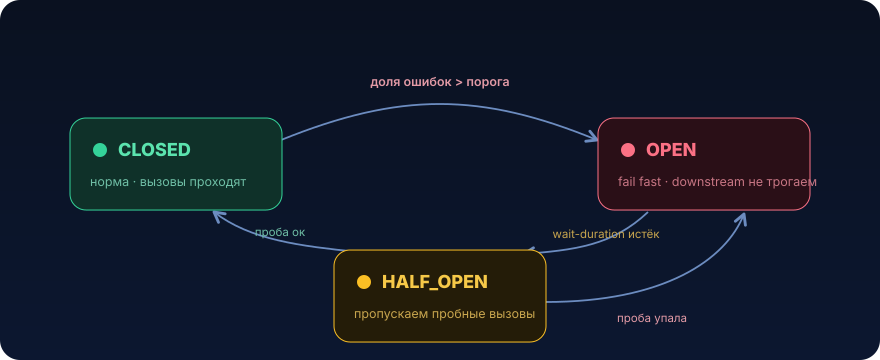

# Circuit Breaker


Предохранитель в электрощитке не «чинит» короткое замыкание. Он делает другое: быстро размыкает цепь, чтобы пожар в одной комнате не спалил весь дом. Circuit Breaker в распределённой системе ровно про это. Он не лечит упавший downstream, он не даёт упавшему downstream утащить за собой тебя

## Проблема

Пятница, вечер. Твой `order-service` при оформлении заказа синхронно ходит в `pricing-service` за актуальной ценой и скидками. Обычно это 20 мс. Всё летает.

В 19:42 у `pricing-service` деградирует база: соединения из пула не отдаются, запросы начинают висеть. `pricing-service` не отвечает `500`, он просто молчит. Твои HTTP-вызовы теперь упираются в таймаут. А таймаут у тебя, как это часто бывает, стоит «на всякий случай побольше», 30 секунд.

Смотрим наивный, «правильно выглядящий» код:

```java
@Service
public class PricingClient {

    private final RestClient restClient; // Spring 6 RestClient

    public Price getPrice(long sku) {
        // Выглядит невинно. Здесь и зарыта бомба.
        return restClient.get()
            .uri("/prices/{sku}", sku)
            .retrieve()
            .body(Price.class);
    }
}
```

А вызывающий его контроллер обрабатывает HTTP-запросы на стандартном пуле Tomcat (`server.tomcat.threads.max`, по умолчанию 200):

```java
@PostMapping("/orders")
public OrderResponse create(@RequestBody OrderRequest req) {
    var price = pricingClient.getPrice(req.sku()); // блокирует поток Tomcat на 30 сек
    return orderService.place(req, price);
}
```

Считаем математику катастрофы:

- к тебе приходит ~100 запросов/сек на создание заказа
- каждый теперь висит 30 секунд на вызове `pricing-service`
- через `200 / 100 = 2` секунды все 200 потоков Tomcat заняты ожиданием
- новые запросы встают в accept-очередь, потом отваливаются по таймауту у клиента

И вот тут самое обидное. К тебе приходят запросы не только на создание заказа. Приходит `GET /orders/{id}`, `GET /health`, вообще всё. Но свободных потоков нет, все висят на `pricing-service`. Сервис перестаёт отвечать целиком. Kubernetes liveness-проба не получает ответа, под убивают и рестартуют, трафик переезжает на соседние поды, те тоже забиваются, каскадный отказ.

Итог: `pricing-service` уронил заказы, каталог, здоровье подов и разбудил тебя в 20:00. Хотя, казалось бы, «просто одна из зависимостей была недоступна».

Ключевая мысль: проблема не в том, что downstream упал. Проблема в том, что ты продолжал в него ломиться и держать под это ресурсы. Каждый обречённый вызов это занятый поток, занятый коннекшн, съеденная память под стек. Ты платишь полную цену за запросы, которые заведомо провалятся

## Что это и когда применять

Circuit Breaker это обёртка вокруг вызова к нестабильной зависимости, которая считает ошибки и, когда их становится слишком много, перестаёт пропускать вызовы: вместо реального обращения к downstream она мгновенно кидает исключение (fail fast). Периодически она пробует, пропускает один-два вызова, и если downstream ожил, снова открывает движение.

Что это даёт:

- **fail fast вместо fail slow.** Вместо 30 секунд ожидания мгновенный отказ за микросекунды. Поток освобождается сразу
- **защита ресурсов вызывающего.** Потоки, коннекшны, память не утекают в чёрную дыру
- **защита downstream.** Пока сервис лежит, ты не долбишь его новыми запросами и даёшь ему шанс подняться, а не добиваешь retry-штормом
- **точка для graceful degradation.** На разомкнутом breaker удобно повесить fallback: отдать цену из кэша, дефолтную скидку или явную ошибку «оформление временно недоступно»

### Когда НЕ нужно

- **на локальные и внутрипроцессные вызовы.** Circuit Breaker про сетевые границы и внешние зависимости. Оборачивать в него обращение к своей же базе на основном пути или чистую CPU-функцию это бессмысленный оверхед и лишняя точка отказа
- **на батчи и офлайн-обработку, где нет живого потребителя.** Если Kafka-консьюмер обрабатывает сообщение и ему некуда торопиться, здесь важнее retry с backoff и корректный ack/DLT, а не размыкание. Fail fast в фоне часто означает «молча потеряли работу»
- **когда у зависимости и так есть надёжный быстрый таймаут и запрос дешёвый.** Один необязательный вызов с таймаутом 200 мс и хорошим fallback не создаёт каскад, breaker тут лишняя сложность
- **как замена таймауту.** Circuit Breaker не отменяет таймаут, он на нём стоит. Без агрессивного таймаута breaker не сможет быстро увидеть медленные вызовы. Таймаут это фундамент, breaker надстройка ([урок 05](05-timeouts.md))

Практическое правило: Circuit Breaker имеет смысл на синхронном вызове через сетевую границу к зависимости, которая может деградировать, где у тебя есть либо fallback, либо осмысленный быстрый отказ

## Как это работает

Circuit Breaker это конечный автомат с тремя состояниями.

<p align="center">
  
</p>

**CLOSED (замкнут, норма).** Все вызовы проходят к downstream. Breaker ведёт статистику по скользящему окну, по последним N вызовам (count-based) или за последние T секунд (time-based). Считает долю ошибок и долю медленных вызовов (превысивших `slowCallDurationThreshold`).

**Переход CLOSED → OPEN.** Как только доля ошибок (или медленных вызовов) в окне превышает порог, breaker размыкается. Важная деталь: срабатывает только после набора минимального числа вызовов (`minimumNumberOfCalls`), чтобы 1 ошибка из 1 вызова не размыкала цепь на пустом месте.

**OPEN (разомкнут, отказ).** Ни один вызов не идёт к downstream. Любое обращение мгновенно завершается `CallNotPermittedException` (или уходит в fallback). Breaker сидит так `waitDurationInOpenState` (например, 10 секунд), давая downstream отдышаться.

**Переход OPEN → HALF_OPEN.** По истечении wait-duration breaker пропускает ограниченное число пробных вызовов (`permittedNumberOfCallsInHalfOpenState`).

**HALF_OPEN (проба).** Если пробные вызовы прошли успешно, downstream ожил, идём в CLOSED. Если снова падают, downstream ещё лежит, возвращаемся в OPEN ещё на wait-duration.

### Ключевые параметры (Resilience4j)

| Параметр | Смысл | Типичное значение |
|---|---|---|
| `slidingWindowType` | окно: `COUNT_BASED` (по числу вызовов) или `TIME_BASED` (по секундам) | зависит от трафика |
| `slidingWindowSize` | размер окна | 20–100 вызовов / 10–60 сек |
| `minimumNumberOfCalls` | минимум вызовов до расчёта статистики | 10–20 |
| `failureRateThreshold` | % ошибок для размыкания | 50% |
| `slowCallRateThreshold` | % медленных вызовов для размыкания | 80–100% |
| `slowCallDurationThreshold` | что считать «медленным» | ~таймаут / 2 |
| `waitDurationInOpenState` | сколько сидим в OPEN | 5–30 сек |
| `permittedNumberOfCallsInHalfOpenState` | пробных вызовов в HALF_OPEN | 3–5 |

Два тонких, но критичных момента.

**1. `recordExceptions` / `ignoreExceptions`.** Считать провалом нужно только то, что говорит о нездоровье downstream: таймауты, `503`, `ConnectException`. А `HTTP 400 Bad Request` или `404` это твоя ошибка или нормальный бизнес-ответ, засчитывать их в failure rate нельзя, иначе кривой клиент разомкнёт breaker и оставит всех без сервиса. По умолчанию учи breaker игнорировать бизнес-исключения (`4xx`).

**2. Circuit Breaker всегда стоит поверх таймаута.** Порядок декораторов на вызове обычно такой (снаружи внутрь): `Retry → CircuitBreaker → TimeLimiter → сам вызов`. Таймаут гарантирует, что медленный вызов быстро становится измеримой ошибкой, breaker на основе этих ошибок принимает решение, retry (если он есть и операция идемпотентна) повторяет, но уже уважая состояние breaker: если цепь разомкнута, retry не долбит downstream.

## Пример на Java

Соберём реалистичный `PricingClient` с таймаутом, Circuit Breaker и fallback на кэш. Покажу и руками (чтобы понять механику), и через Resilience4j плюс Spring Boot (как делают в проде).

### Вариант руками, понять автомат

Не для прода, но отлично показывает суть. Минимальный count-based breaker:

```java
import java.time.Duration;
import java.time.Instant;
import java.util.concurrent.atomic.AtomicInteger;
import java.util.concurrent.atomic.AtomicReference;
import java.util.function.Supplier;

public final class SimpleCircuitBreaker {

    private enum State { CLOSED, OPEN, HALF_OPEN }

    private final int failureThreshold;          // сколько подряд ошибок → OPEN
    private final Duration openDuration;         // сколько сидим в OPEN

    private final AtomicReference<State> state = new AtomicReference<>(State.CLOSED);
    private final AtomicInteger consecutiveFailures = new AtomicInteger();
    private volatile Instant openedAt = Instant.MIN;

    public SimpleCircuitBreaker(int failureThreshold, Duration openDuration) {
        this.failureThreshold = failureThreshold;
        this.openDuration = openDuration;
    }

    public <T> T call(Supplier<T> action) {
        if (state.get() == State.OPEN) {
            // прошло ли время «отдыха»? если да, пробуем (HALF_OPEN)
            if (Instant.now().isBefore(openedAt.plus(openDuration))) {
                throw new CallNotPermittedException(); // fail fast, downstream не трогаем
            }
            state.set(State.HALF_OPEN);
        }

        try {
            T result = action.get();
            onSuccess();
            return result;
        } catch (RuntimeException e) {
            onFailure();
            throw e;
        }
    }

    private void onSuccess() {
        consecutiveFailures.set(0);
        state.set(State.CLOSED); // пробный вызов прошёл, цепь замкнулась
    }

    private void onFailure() {
        // в HALF_OPEN любая ошибка сразу возвращает в OPEN
        if (state.get() == State.HALF_OPEN
                || consecutiveFailures.incrementAndGet() >= failureThreshold) {
            state.set(State.OPEN);
            openedAt = Instant.now();
        }
    }

    public static final class CallNotPermittedException extends RuntimeException { }
}
```

Здесь видно всё главное: в OPEN мы не вызываем `action.get()` вообще, вот она, экономия ресурсов. В HALF_OPEN один вызов решает судьбу цепи. В реальной жизни так писать не надо (нет скользящего окна, учёта медленных вызовов, метрик, потокобезопасной статистики), для этого есть Resilience4j.

### Вариант для прода, Resilience4j плюс Spring Boot

Зависимость (Gradle):

```groovy
implementation 'io.github.resilience4j:resilience4j-spring-boot3:2.2.0'
implementation 'org.springframework.boot:spring-boot-starter-aop' // нужен для аннотаций
```

Конфигурация в `application.yml`. Обрати внимание на `ignoreExceptions` и `slowCallDurationThreshold`:

```yaml
resilience4j:
  circuitbreaker:
    instances:
      pricing:
        sliding-window-type: COUNT_BASED
        sliding-window-size: 20
        minimum-number-of-calls: 10           # не судим по первым 1-2 вызовам
        failure-rate-threshold: 50            # >50% ошибок в окне → OPEN
        slow-call-rate-threshold: 90          # >90% медленных → тоже OPEN
        slow-call-duration-threshold: 400ms   # медленный = дольше 400 мс
        wait-duration-in-open-state: 10s
        permitted-number-of-calls-in-half-open-state: 3
        automatic-transition-from-open-to-half-open-enabled: true
        record-exceptions:                    # ЭТО считаем провалом downstream
          - java.io.IOException
          - java.util.concurrent.TimeoutException
          - org.springframework.web.client.HttpServerErrorException  # 5xx
        ignore-exceptions:                    # ЭТО НЕ вина downstream, игнорируем
          - org.springframework.web.client.HttpClientErrorException  # 4xx
  timelimiter:
    instances:
      pricing:
        timeout-duration: 800ms               # жёсткий таймаут, фундамент под breaker
        cancel-running-future: true
```

Клиент с аннотациями. `@CircuitBreaker` плюс `fallbackMethod`, fallback вызывается и на ошибке downstream, и когда цепь разомкнута:

```java
import io.github.resilience4j.circuitbreaker.annotation.CircuitBreaker;
import org.springframework.stereotype.Service;
import org.springframework.web.client.RestClient;

@Service
public class PricingClient {

    private final RestClient restClient;
    private final PriceCache priceCache; // напр. Redis/Caffeine с последней известной ценой

    public PricingClient(RestClient restClient, PriceCache priceCache) {
        this.restClient = restClient;
        this.priceCache = priceCache;
    }

    @CircuitBreaker(name = "pricing", fallbackMethod = "priceFromCache")
    public Price getPrice(long sku) {
        return restClient.get()
            .uri("/prices/{sku}", sku)
            .retrieve()
            .body(Price.class);
    }

    // Сигнатура fallback = сигнатура метода + последний параметр Throwable.
    // Вызывается при провале ИЛИ при CallNotPermittedException (цепь OPEN).
    private Price priceFromCache(long sku, Throwable cause) {
        return priceCache.find(sku)
            .map(p -> p.withStale(true)) // помечаем «цена возможно устаревшая»
            .orElseThrow(() -> new PricingUnavailableException(sku, cause));
    }
}
```

Что мы получили по сравнению с наивной версией из «Проблемы»:

- вызов ограничен 800 мс, а не 30 секундами, поток Tomcat освобождается быстро
- после серии таймаутов breaker разомкнётся, следующие запросы возвращаются мгновенно из кэша, downstream не трогаем
- `4xx` не роняют breaker, кривой запрос не оставит всех без цен
- есть деградация: заказ оформится по последней известной цене вместо полного отказа

### Наблюдаемость обязательна

Разомкнутый breaker это событие, о котором надо знать. Resilience4j публикует метрики в Micrometer (`resilience4j_circuitbreaker_state`, `..._calls`) и события состояния. Минимум это алерт «breaker `pricing` в состоянии OPEN дольше 1 минуты» и логирование переходов:

```java
circuitBreakerRegistry.circuitBreaker("pricing").getEventPublisher()
    .onStateTransition(e -> log.warn("CB pricing: {} -> {}",
        e.getStateTransition().getFromState(),
        e.getStateTransition().getToState()));
```

## Подводные камни

1. **Circuit Breaker без таймаута бесполезен.** Если сам HTTP-вызов может висеть 30 секунд, breaker увидит деградацию слишком поздно и всё равно даст потокам утечь. Всегда ставь breaker поверх жёсткого таймаута (connect плюс read/response). Это грабля №1, на неё наступают чаще всего
2. **`4xx` засчитываются как отказ downstream.** По умолчанию любое исключение это «провал». Клиент с багом начинает слать `400`, breaker размыкается, и теперь никто не может получить цену, хотя сервис жив. Явно перечисляй `recordExceptions` (только 5xx/сеть/таймаут) и `ignoreExceptions` (4xx и бизнес-ошибки)
3. **Слишком агрессивные пороги дают «мигающий» breaker.** `minimumNumberOfCalls: 1` или `failureRateThreshold: 10%` размыкают цепь на случайном сетевом всплеске и режут здоровый трафик. Слишком мягкие (`failureRateThreshold: 95%`) не сработают, пока сервис почти полностью не ляжет. Пороги подбираются под реальный профиль ошибок, не «из головы»
4. **Retry поверх breaker без jitter даёт retry storm.** Если на разомкнутый breaker навесить retry, который синхронно ждёт и повторяет, ты либо забьёшь очередь ожидания, либо, когда downstream оживёт, все клиенты ломанутся одновременно и уронят его снова. Retry только для идемпотентных операций, с backoff и jitter, и он должен уважать `CallNotPermittedException`, не повторять её ([урок 03](03-backoff-jitter.md))
5. **Breaker per-instance, а не глобальный.** В Resilience4j состояние живёт в памяти пода. 10 подов это 10 независимых breaker, каждый учится на своей статистике. Это нормально, но учитывай: маленькое окно на поде с малым трафиком набирается медленно, реакция запаздывает
6. **Fallback, который сам ходит по сети.** Классика: цепь к `pricing-service` разомкнулась, а fallback лезет в Redis, который тоже прилёг, потому что деградировал весь кластер. Fallback должен быть дешёвым и локальным либо мгновенно-отказным
7. **HALF_OPEN пропускает боевой трафик в пробу.** Пробные вызовы в HALF_OPEN это реальные пользовательские запросы. Если downstream ещё нездоров, часть пользователей словит ошибку на «разведке». Это осознанный компромисс, помни о нём при настройке `permittedNumberOfCallsInHalfOpenState`

## Практическая задача

> 🎯 Уровень: middle → senior. Ожидаемое время: 3–4 часа с тестами

**Система.** `checkout-service` (Spring Boot, Java 21) на шаге оформления заказа синхронно вызывает внешний `promo-service`, узнать, применима ли промо-акция и какая скидка. `promo-service` это сторонняя команда, SLA у него так себе: пару раз в неделю он «залипает» на 10–40 секунд под нагрузкой, отвечая не ошибкой, а тишиной.

**Дано.** Сейчас код такой, и он ровно из-за отсутствия предохранителя роняет весь checkout:

```java
@Service
public class PromoClient {

    private final RestClient restClient;

    public Discount getDiscount(String cartId) {
        // Нет таймаута → read-timeout берётся дефолтный (фактически бесконечный).
        // Нет предохранителя → каждый залипший вызов держит поток Tomcat.
        return restClient.get()
            .uri("/promo/discount?cartId={id}", cartId)
            .retrieve()
            .body(Discount.class);
    }
}

@RestController
class CheckoutController {
    private final PromoClient promoClient;
    private final CheckoutService checkoutService;

    @PostMapping("/checkout")
    CheckoutResponse checkout(@RequestBody CheckoutRequest req) {
        Discount d = promoClient.getDiscount(req.cartId()); // тут всё и висит
        return checkoutService.finalize(req, d);
    }
}
```

Когда `promo-service` залипает, за считанные секунды все потоки Tomcat заняты ожиданием, и `checkout-service` перестаёт отвечать целиком, включая оформление заказов без промокода, которым `promo-service` вообще не нужен. Для бизнеса промо-скидка это необязательная часть: лучше оформить заказ без скидки, чем не оформить вовсе.

**ТЗ.** Реализовать защиту вызова `promo-service` через Circuit Breaker так, чтобы деградация `promo-service` не роняла checkout.

1. Добавить жёсткий таймаут на вызов (ориентир: read/response ≤ 1 сек, connect ≤ 300 мс). Без него всё остальное не работает
2. Обернуть вызов в Circuit Breaker (Resilience4j). Настроить окно, порог ошибок и/или порог медленных вызовов, `waitDurationInOpenState`
3. Настроить, что считать отказом: таймауты и `5xx` да, `4xx` («промокод не найден») нет
4. Реализовать fallback: при ошибке или разомкнутой цепи вернуть «скидка не применена» (`Discount.none()`), а не пробрасывать исключение в контроллер. Checkout должен завершаться успешно
5. Добавить метрику или лог перехода breaker в OPEN, чтобы дежурный узнал о проблеме

**Критерии приёмки** (проверь тестами, отметь галочками):

- [ ] при «зависшем» `promo-service` (endpoint с задержкой 30 сек через WireMock) один вызов `checkout` завершается быстро (в пределах таймаута ~1 сек), а не за 30 сек
- [ ] после серии таймаутов breaker переходит в OPEN, следующий `checkout` возвращается практически мгновенно (fallback, downstream не вызывается, проверить по счётчику обращений WireMock)
- [ ] при этом `checkout` возвращает 200 и заказ оформляется с `Discount.none()`
- [ ] ответ `promo-service` со статусом 404 не размыкает breaker и обрабатывается как обычная бизнес-ситуация
- [ ] после восстановления `promo-service` breaker сам возвращается в CLOSED через HALF_OPEN

<details>
<summary>Подсказки (без готового решения)</summary>

- порядок обёрток: таймаут самый внутренний, breaker над ним, fallback снаружи. Если оставляешь синхронный `RestClient`, задай таймауты на уровне HTTP-клиента (`ClientHttpRequestFactory` с `Duration`), а breaker дай `slowCallDurationThreshold` чуть меньше таймаута
- `minimumNumberOfCalls` не ставь в 1, иначе первый же случайный таймаут разомкнёт цепь
- для критерия «downstream не вызывается в OPEN» удобно проверять `wireMockServer.verify(...)`, а не время ответа
- fallback-метод должен иметь ту же сигнатуру, что основной, плюс параметр `Throwable`. Убедись, что он не ходит по сети
- аннотации Resilience4j срабатывают только через бин: `spring-boot-starter-aop` подключён, метод с `@CircuitBreaker` вызывается не через `this.` из того же класса (как и `@Transactional`)

</details>

## Что почитать

- [Resilience4j: CircuitBreaker](https://resilience4j.readme.io/docs/circuitbreaker), состояния, скользящие окна, все параметры и интеграция со Spring Boot
- [Amazon Builders' Library: Timeouts, retries, and backoff with jitter](https://aws.amazon.com/builders-library/timeouts-retries-and-backoff-with-jitter/), почему таймаут фундамент и как это сочетается с предохранителем
- [Microsoft Azure Architecture Center: Circuit Breaker pattern](https://learn.microsoft.com/en-us/azure/architecture/patterns/circuit-breaker), каноничное описание, диаграммы состояний, антипаттерны
- [Martin Fowler: CircuitBreaker](https://martinfowler.com/bliki/CircuitBreaker.html), первоисточник в популярном изложении

---

← [Таймауты (05)](05-timeouts.md) · [Обзор раздела](README.md) · [Bulkhead (07) →](07-bulkhead.md)
