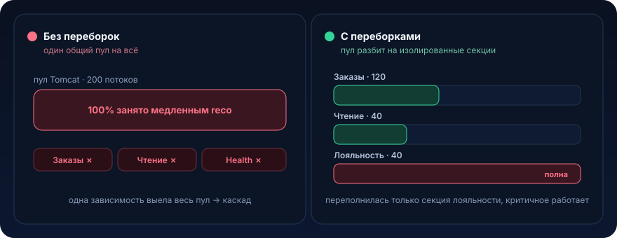

# Bulkhead


Название пришло из судостроения. Корпус большого корабля делят поперечными стенами, переборками, на изолированные отсеки. Пробили один отсек, он заполнился водой, корабль просел, но плывёт. Без переборок одна пробоина топит всё судно.

В бэкенде роль воды играет исчерпание ресурсов (потоки, соединения, память), а роль пробоины это один медленный или зависший внешний вызов. Задача паттерна ровно та же: не дать локальной аварии затопить весь сервис

## Проблема

Есть монолитный сервис заказов на Spring Boot. Он обслуживает HTTP-запросы на встроенном Tomcat. По умолчанию у Tomcat один пул рабочих потоков, `server.tomcat.threads.max=200`. Каждый входящий HTTP-запрос занимает поток из этого пула на всё время обработки, включая время ожидания ответов от внешних систем.

Эндпоинтов много:

- `GET /orders/{id}`, читает заказ из PostgreSQL, быстро, 5–10 мс
- `GET /orders/{id}/health-check`, лёгкая проверка, миллисекунды
- `POST /orders/{id}/recommendations`, ходит во внешний сервис рекомендаций по HTTP

Сервис рекомендаций сторонний, best effort, по SLA необязательный. Живёт он на отдельной инфраструктуре, и однажды у него деградирует база: он начинает отвечать не за 50 мс, а за 30 секунд (или вообще висит, пока не сработает таймаут сокета).

Вот наивный клиент, который выглядит нормально:

```java
@Service
public class RecommendationService {

    private final RestClient restClient; // общий RestClient на весь сервис

    public List<Recommendation> fetch(long orderId) {
        // Никакого таймаута на чтение. Никакого ограничения на кол-во
        // одновременных вызовов. Поток Tomcat просто ждёт ответа.
        return restClient.get()
                .uri("https://reco.internal/api/v1/orders/{id}/reco", orderId)
                .retrieve()
                .body(new ParameterizedTypeReference<>() {});
    }
}
```

Что происходит под нагрузкой, когда `reco.internal` начинает висеть по 30 секунд:

```
Секунда 0:   идёт ~50 rps на /recommendations. Каждый вызов держит поток 30с.
Секунда 5:   накопилось ~250 «висящих» потоков... но их максимум 200. Пул забит.
Секунда 6:   потоков из пула больше нет. НОВЫЕ запросы к /orders/{id}
             (быстрые, к своей БД!) встают в очередь acceptCount и ждут.
Секунда 10:  очередь переполнена -> Tomcat отдаёт Connection refused / 503.
Секунда 12:  liveness/readiness probe от Kubernetes тоже не может получить
             поток -> под помечается NotReady -> его выкидывают из балансировщика.
Секунда 15:  трафик переезжает на соседние поды -> они забиваются так же ->
             каскадный отказ всего деплоймента.
```

Ключевой момент, из-за которого это так больно: упал необязательный сторонний сервис рекомендаций, а лёг весь сервис заказов, включая критичные операции с собственной здоровой базой. Радиус поражения оказался несопоставим с причиной. Мы связали судьбу критичных операций с судьбой некритичной зависимости через общий разделяемый ресурс, пул потоков Tomcat.

То же самое происходит и с другими общими пулами:

- **пул JDBC-соединений** (HikariCP, по умолчанию 10). Один тяжёлый отчётный запрос, держащий соединения, и обычные транзакции не могут получить коннект
- **общий `ThreadPoolExecutor`** на асинхронные задачи. Одна залипшая задача выедает воркеры, остальные фичи, которые тоже туда сабмитят, встают
- **пул HTTP-коннектов** Feign/Apache HttpClient, разделяемый между несколькими внешними сервисами

Везде один и тот же анти-паттерн: разные по критичности потоки работы делят один пул ресурсов без изоляции

## Что это и когда применять

Bulkhead (переборка) это изоляция ресурсов: ты делишь общий пул на несколько независимых секций и назначаешь каждому классу вызовов свою секцию с жёстким лимитом. Когда одна секция исчерпана, вызовы в неё сразу получают отказ (fail-fast), но не могут занять ресурсы других секций.

<p align="center">
  
</p>

Проще говоря: вместо одного большого ведра воды на всех несколько ведёрок с именами. Сервис рекомендаций может опустошить только своё ведёрко. Критичные операции пьют из своего и не замечают чужой аварии.

Какую проблему решает:

- **ограничивает радиус поражения.** Отказ одной зависимости не выедает ресурсы, нужные другим
- **даёт fail-fast вместо fail-slow.** Лучше мгновенно вернуть «рекомендации сейчас недоступны», чем 30 секунд держать поток и утащить за собой весь под
- **защищает от медленных, а не только от упавших зависимостей.** Circuit breaker реагирует на ошибки, bulkhead реагирует на занятость, а «медленно, но без ошибок» это как раз то, что топит пулы

Два типа bulkhead в Resilience4j:

1. **semaphore bulkhead** ограничивает число одновременных вызовов через семафор. Вызов выполняется в том же потоке (потоке вызывающего). Дёшево, не создаёт своих потоков. Но если сам вызывающий поток блокируется на медленном I/O, семафор ограничит их количество, но не освободит потоки Tomcat, они всё равно висят, просто их не больше N
2. **thread-pool bulkhead** выделяет под класс вызовов отдельный пул потоков плюс очередь. Вызов уходит в чужой поток, вызывающий получает `CompletableFuture`. Это настоящая переборка: медленный сервис топит свой пул, а потоки Tomcat освобождаются сразу. Дороже (context switch, копирование контекста), зато изоляция полная

### Когда НЕ нужно

- **на чисто CPU-bound код без внешних зависимостей.** Bulkhead изолирует от чужой медлительности. Если у тебя нет I/O наружу, изолировать не от чего, ты только добавишь overhead и лимиты, которые сам же и упрёшь
- **когда зависимость ровно одна и она критична.** Если весь смысл сервиса это проксировать один внешний API, изолировать его «в отдельную секцию» бессмысленно: если он лёг, сервис всё равно бесполезен. Тут нужен таймаут плюс circuit breaker, а не переборка
- **на каждый метод подряд.** Микро-переборки на всё дают десятки пулов, которые в сумме создают сотни потоков и съедают память. Изолируй классы вызовов по критичности и по зависимости, а не отдельные методы
- **как замена таймаутам.** Bulkhead без таймаута полумера: секция из 10 слотов, забитых 30-секундными висяками, всё равно даёт отказ всем в эту секцию. Bulkhead и таймаут работают в паре, не вместо друг друга

Правило: bulkhead это вторая линия обороны после таймаута. Таймаут ограничивает, как долго один вызов держит ресурс. Bulkhead ограничивает, сколько ресурсов этот класс вызовов может занять суммарно

## Как это работает

### Механика semaphore bulkhead

Перед вызовом пытаемся занять слот семафора (`tryAcquire`). Есть слот, выполняем вызов синхронно, в потоке вызывающего, и в `finally` освобождаем слот. Свободного слота нет, ждём максимум `maxWaitDuration` (обычно 0, не ждать вовсе) и, не дождавшись, кидаем `BulkheadFullException`.

### Механика thread-pool bulkhead

Поток Tomcat отдаёт задачу в чужой пул и тут же освобождается, получив `CompletableFuture`. Задачу обрабатывает другой поток из выделенного пула с очередью. Пул и очередь полны, `BulkheadFullException` (fail-fast). Принципиальная разница: даже если весь reco-пул забит 30-секундными висяками, потоки Tomcat живут своей жизнью и обслуживают `/orders/{id}`.

### Ключевые параметры

Semaphore bulkhead:

| Параметр | Смысл | Как выбирать |
|---|---|---|
| `maxConcurrentCalls` | сколько вызовов одновременно | = разумной доле пула Tomcat, чтобы одна зависимость не могла занять больше, скажем, 25% потоков |
| `maxWaitDuration` | сколько ждать слот | чаще `0`, fail-fast; ненулевое даёт «мягкую» очередь, но копит latency |

ThreadPool bulkhead:

| Параметр | Смысл | Как выбирать |
|---|---|---|
| `coreThreadPoolSize` / `maxThreadPoolSize` | размер собственного пула | по Little's Law: `threads ≈ target_throughput * latency`. Для 20 rps при 200 мс латентности хватит ~4 потоков |
| `queueCapacity` | буфер перед пулом | небольшой (10–50). Большая очередь = скрытая latency и OOM-риск |
| `keepAliveDuration` | когда гасить лишние потоки | по умолчанию нормально |

Как выбрать лимит по-инженерному: посчитай, сколько потоков этот класс вызовов имеет право съесть, чтобы остальным хватило. Если у Tomcat 200 потоков и есть три класса вызовов, а рекомендации некритичны, дай им 20–40, но не 200.

### Комбинация паттернов (порядок важен)

Bulkhead редко работает один. Боевая обвязка одного внешнего вызова:

```
Retry ( Bulkhead ( TimeLimiter ( CircuitBreaker ( внешний вызов ) ) ) )
```

Читать изнутри наружу: circuit breaker решает, звонить ли вообще, time limiter обрывает долгий вызов, bulkhead ограничивает параллелизм, retry (осторожно, только для идемпотентных) перезапускает. В Resilience4j этот порядок задаётся при декорировании, и он неслучайный: bulkhead снаружи от таймаута, чтобы слот освобождался таймаутом, а не висел вечно.

## Пример на Java

### Вариант 1: руками на семафоре (чтобы понять механику)

```java
public class SemaphoreBulkhead {

    private final Semaphore semaphore;
    private final String name;

    public SemaphoreBulkhead(String name, int maxConcurrentCalls) {
        this.name = name;
        // fair=false: пропускная способность важнее строгого порядка
        this.semaphore = new Semaphore(maxConcurrentCalls, false);
    }

    public <T> T execute(Supplier<T> action) {
        // tryAcquire без ожидания -> fail-fast, поток не залипает
        if (!semaphore.tryAcquire()) {
            throw new BulkheadFullException(name);
        }
        try {
            return action.get();
        } finally {
            // критично: освобождаем слот ВСЕГДА, даже при исключении
            semaphore.release();
        }
    }

    public static final class BulkheadFullException extends RuntimeException {
        BulkheadFullException(String name) {
            super("Bulkhead '" + name + "' is full, rejecting call");
        }
    }
}
```

Этого достаточно, чтобы ограничить число одновременных вызовов. Но помни: вызов всё ещё в потоке Tomcat. Чтобы освободить поток Tomcat, нужен отдельный пул, вариант 2.

### Вариант 2: Resilience4j, декларативно на Spring Boot

Зависимость:

```groovy
implementation 'io.github.resilience4j:resilience4j-spring-boot3:2.2.0'
```

Конфиг (`application.yml`). Под reco мы даём thread-pool bulkhead (настоящая переборка потоков) плюс таймаут:

```yaml
resilience4j:
  thread-pool-bulkhead:
    instances:
      recommendations:
        core-thread-pool-size: 4      # Little's Law: 20 rps * 0.2s ≈ 4
        max-thread-pool-size: 8
        queue-capacity: 20            # маленькая очередь -> fail-fast, а не рост latency
        keep-alive-duration: 20ms
  timelimiter:
    instances:
      recommendations:
        timeout-duration: 800ms       # обрываем долгий вызов, освобождаем слот
        cancel-running-future: true
  circuitbreaker:
    instances:
      recommendations:
        sliding-window-size: 20
        failure-rate-threshold: 50
        wait-duration-in-open-state: 10s
```

Клиент. `@Bulkhead` с `type = THREADPOOL` требует возвращать `CompletableFuture`, метод уходит в отдельный пул:

```java
@Service
public class RecommendationService {

    private final RestClient restClient;

    public RecommendationService(RestClient.Builder builder) {
        // ВАЖНО: даже с bulkhead ставим таймауты на самом клиенте,
        // это последний рубеж, если что-то мимо аннотаций.
        var factory = new SimpleClientHttpRequestFactory();
        factory.setConnectTimeout(300);
        factory.setReadTimeout(1000);
        this.restClient = builder.requestFactory(factory).build();
    }

    // Порядок аннотаций задаёт порядок обёрток.
    @CircuitBreaker(name = "recommendations")
    @TimeLimiter(name = "recommendations")
    @Bulkhead(name = "recommendations", type = Bulkhead.Type.THREADPOOL)
    public CompletableFuture<List<Recommendation>> fetch(long orderId) {
        return CompletableFuture.completedFuture(
                restClient.get()
                        .uri("https://reco.internal/api/v1/orders/{id}/reco", orderId)
                        .retrieve()
                        .body(new ParameterizedTypeReference<>() {}));
    }
}
```

Контроллер с осмысленным fallback: если переборка полна или таймаут, быстро отдаём пустые рекомендации, а не роняем ответ:

```java
@RestController
@RequestMapping("/orders/{id}/recommendations")
public class RecommendationController {

    private final RecommendationService service;

    @GetMapping
    public List<Recommendation> recommendations(@PathVariable long id) {
        try {
            // join не блокирует поток Tomcat надолго: TimeLimiter оборвёт за 800мс
            return service.fetch(id).join();
        } catch (CompletionException | CallNotPermittedException e) {
            // BulkheadFullException / TimeoutException / открытый CB -> деградируем
            return List.of();
        }
    }
}
```

Что мы получили: если reco.internal висит, забивается reco-пул из 8 потоков. Потоки Tomcat отдают туда задачу и мгновенно возвращаются к `/orders/{id}`. Когда reco-пул и очередь полны, новые запросы на рекомендации сразу получают пустой список за миллисекунды. Сервис заказов жив.

### Вариант 3: изоляция на уровне пулов базы

Тот же принцип для JDBC. Не давай тяжёлым отчётам делить пул с оперативными транзакциями, два DataSource, две переборки:

```java
@Configuration
public class DataSourceConfig {

    // Оперативный пул: быстрые короткие транзакции. Основной, критичный.
    @Bean
    @Primary
    @ConfigurationProperties("app.datasource.oltp")
    public HikariDataSource oltpDataSource() {
        var ds = new HikariDataSource();
        ds.setMaximumPoolSize(20);
        ds.setConnectionTimeout(2000); // не ждать коннект вечно
        return ds;
    }

    // Отчётный пул: тяжёлые долгие запросы. Изолирован -> не выест OLTP.
    @Bean
    @ConfigurationProperties("app.datasource.reporting")
    public HikariDataSource reportingDataSource() {
        var ds = new HikariDataSource();
        ds.setMaximumPoolSize(4);
        ds.setConnectionTimeout(500);
        return ds;
    }
}
```

Теперь зависший отчётный запрос может исчерпать только свои 4 соединения. 20 оперативных остаются доступны.

## Подводные камни

1. **Bulkhead без таймаута это полумера.** Секция из 8 слотов, забитых бесконечными висяками, всё равно откажет всем. Bulkhead ограничивает количество занятых ресурсов, таймаут длительность удержания каждого. Нужны оба. Всегда ставь `connectTimeout` плюс `readTimeout` на самом HTTP-клиенте как последний рубеж
2. **Semaphore bulkhead не освобождает потоки Tomcat.** Частая ошибка: повесили `Type.SEMAPHORE` на блокирующий HTTP-вызов и думают, что защитились. Семафор ограничит число одновременных вызовов, но каждый по-прежнему держит поток Tomcat 30 секунд. От исчерпания пула Tomcat спасает только thread-pool bulkhead (свой пул) либо таймаут
3. **Слишком большая очередь равна скрытой latency и OOM.** `queueCapacity: 10000` выглядит «щедро», но превращает fail-fast в fail-slow: запросы копятся, растёт p99, а под нагрузкой очередь съедает heap. Маленькая очередь плюс быстрый отказ почти всегда лучше большой очереди
4. **Лимит выбран «на глаз» и упирается сам в себя.** Дали reco-пулу 2 потока при пиковом 20 rps и латентности 200 мс, по Little's Law нужно ~4, и ты стабильно отбиваешь половину легитимного трафика. Считай лимит: `threads ≈ throughput * latency`, потом добавь запас. И мониторь `resilience4j.bulkhead.available.concurrent.calls`
5. **Потеря контекста при переходе в чужой поток.** ThreadPool bulkhead исполняет вызов в другом потоке, туда не переедут сами по себе `SecurityContext`, MDC (correlation id для логов), tracing-span, транзакция. Логи «расклеятся», трейсы порвутся, `@Transactional` не пересечёт границу потока. Нужны `TaskDecorator` / context propagation
6. **`@Transactional` и thread-pool bulkhead несовместимы напрямую.** Транзакция привязана к потоку. Уводя вызов в чужой пул, ты выносишь его из транзакции вызывающего. Не заворачивай в thread-pool bulkhead методы, которые должны идти в общей транзакции с вызывающим кодом
7. **Fallback, который делает работу.** Если fallback при полной переборке сам ходит в сеть, в ту же базу или в другую тяжёлую операцию, ты просто переместил пробоину. Fallback обязан быть дешёвым и локальным: кэш, пустой список, значение по умолчанию
8. **Забыли `release()` в ручной реализации.** В самописном семафоре освобождение слота обязано быть в `finally`. Один пропущенный путь исключения, и слоты «утекают», секция медленно деградирует до нуля доступных слотов без единой висящей задачи

## Практическая задача

> 🎯 Уровень: senior. Ожидаемое время: 4–5 часов с нагрузочным тестом

**Система.** Сервис оформления заказов `checkout-service` на Spring Boot (Tomcat, `threads.max=200`). Три группы эндпоинтов:

- `POST /checkout`, критичный путь: пишет заказ в свою PostgreSQL, публикует событие в Kafka. Должен работать всегда
- `GET /checkout/{id}`, чтение заказа из своей базы. Критичный
- `POST /checkout/{id}/loyalty`, начисление бонусов через внешний сервис лояльности `loyalty.internal` по HTTP. Некритичный, best effort: если бонусы не начислились сейчас, начислим фоном позже

**Дано, текущий сломанный код:**

```java
@Service
public class LoyaltyService {

    private final RestClient restClient; // общий, без таймаутов

    public LoyaltyResult accrue(long orderId, long amount) {
        return restClient.post()
                .uri("https://loyalty.internal/api/v1/accrue")
                .body(new AccrueRequest(orderId, amount))
                .retrieve()
                .body(LoyaltyResult.class);
    }
}

@RestController
public class LoyaltyController {
    private final LoyaltyService loyaltyService;

    @PostMapping("/checkout/{id}/loyalty")
    public LoyaltyResult loyalty(@PathVariable long id, @RequestParam long amount) {
        return loyaltyService.accrue(id, amount); // держит поток Tomcat до ответа
    }
}
```

Сегодня в 14:00 `loyalty.internal` начал отвечать за 25 секунд. Через минуту весь `checkout-service` перестал принимать `POST /checkout`, клиенты видят 503, Kubernetes выкидывает поды из балансировки. Продажи встали из-за некритичного начисления бонусов.

**ТЗ.** Реализовать переборку так, чтобы деградация `loyalty.internal` не могла обрушить критичные `POST /checkout` и `GET /checkout/{id}`.

1. Изолировать вызовы к сервису лояльности в отдельный ограниченный пул потоков (не общий с Tomcat). Обосновать выбор размера пула и очереди расчётом (throughput × latency), а не «на глаз»
2. Поставить таймаут на вызов лояльности (и на уровне HTTP-клиента, и как time limiter), чтобы слот не удерживался дольше разумного
3. Реализовать дешёвый fallback: при полной переборке или таймауте эндпоинт лояльности должен быстро вернуть статус «отложено» (поставить задачу в outbox на фоновое начисление), а не падать и не ходить в сеть повторно синхронно
4. Добавить осмысленную обработку `BulkheadFullException` / `TimeoutException`

**Критерии приёмки** (проверь тестами, отметь галочками):

- [ ] под нагрузкой на `/checkout/{id}/loyalty` с замоканным медленным (20 с) `loyalty.internal` эндпоинты `POST /checkout` и `GET /checkout/{id}` продолжают отвечать за нормальное время (p99 не деградирует)
- [ ] число одновременно висящих на лояльности потоков не превышает лимита секции (по метрике `resilience4j.bulkhead...` или дампу потоков)
- [ ] при полной переборке запрос к `/loyalty` возвращает ответ за миллисекунды со статусом «отложено», а не висит 20 секунд
- [ ] потоки Tomcat не исчерпываются: readiness-проба остаётся зелёной под нагрузкой на лояльность

<details>
<summary>Подсказки (без готового решения)</summary>

- semaphore bulkhead здесь недостаточно, подумай, почему поток Tomcat всё ещё будет висеть 20 секунд, и что даёт `Type.THREADPOOL`
- прикинь лимит: если пик по бонусам ~30 rps, а здоровая латентность ~150 мс, сколько потоков реально нужно? Заложи небольшой запас, но не 200
- метод под `@Bulkhead(type = THREADPOOL)` должен возвращать `CompletableFuture`, продумай, как это стыкуется с контроллером и обработкой ошибок
- уводя вызов в чужой поток, ты теряешь MDC/correlation id в логах, подумай про `TaskDecorator` / context propagation
- fallback «поставить в outbox» отлично сочетается с [transactional outbox](10-transactional-outbox.md): критичный `POST /checkout` и так пишет в свою базу, запись «начислить бонусы позже» в ту же базу дёшева и надёжна
- не забудь таймауты на самом `RestClient`, resilience4j это не заменяет, а дополняет

</details>

## Что почитать

- [Resilience4j: Bulkhead](https://resilience4j.readme.io/docs/bulkhead), оба типа, semaphore и thread-pool
- [Amazon Builders' Library: Timeouts, retries, and backoff with jitter](https://aws.amazon.com/builders-library/timeouts-retries-and-backoff-with-jitter/)
- [Amazon Builders' Library: Using load shedding to avoid overload](https://aws.amazon.com/builders-library/using-load-shedding-to-avoid-overload/), про fail-fast и защиту ресурсов под перегрузкой
- Michael Nygard, *Release It!*, главы про Bulkheads, Circuit Breaker, Timeouts, книга, из которой эти паттерны вошли в индустрию

---

← [Circuit Breaker (06)](06-circuit-breaker.md) · [Обзор раздела](README.md) · [Dead Letter Queue (08) →](08-dead-letter-queue.md)
