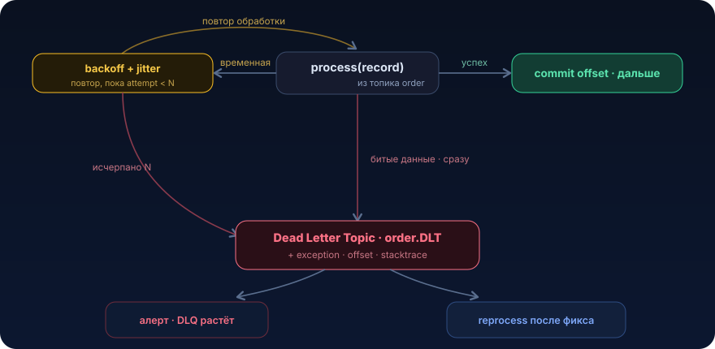

# Dead Letter Queue


Одно битое сообщение способно остановить целую партицию Kafka: наивный at-least-once честно переигрывает «ядовитую» запись по кругу, а за ней стоят сотни тысяч валидных. Dead Letter Queue это «папка Проблемные»: сообщение, которое не обработалось после N попыток, откладывают в сторону, а конвейер едет дальше

## Проблема

Пятница, 18:40. Ты уже собираешься закрывать ноут, и тут прилетает алерт: `consumer lag` по топику `order` за 20 минут вырос с нуля до 2 миллионов сообщений. Заказы не создаются, продавцы в поддержке, менеджеры в чате.

Лезешь в логи. Одна и та же ошибка, десятки тысяч строк в секунду:

```
ERROR OrderListener - Failed to process record offset=48213
java.lang.NullPointerException: Cannot invoke "BigDecimal.scale()" because "price" is null
	at OrderMapper.toEntity(OrderMapper.java:64)
```

Всё встало из-за одного сообщения на офсете 48213. В нём `price = null`, новый релиз upstream-сервиса начал в редком кейсе (товар «под заказ») слать заказы без цены. Твой консьюмер на таком сообщении бросает исключение. А дальше классика Kafka:

```java
@KafkaListener(topics = "order", groupId = "seller-order-service")
public void onOrder(KafkaOrder order) {
    // маппинг падает с NPE, если order.price() == null
    var entity = orderMapper.toEntity(order);
    orderService.create(entity);          // сюда управление не доходит
    // offset коммитится только при успешном выходе из метода
}
```

Логика выглядит правильно: если обработка упала, не коммитим офсет, значит сообщение обработается ещё раз, ничего не потеряем. Именно так работает at-least-once.

Но вот беда: сообщение-то детерминированно ядовитое. Оно упадёт и на второй попытке, и на двухсотой, данные не поменяются сами собой. Kafka (или Spring Kafka с дефолтным бесконечным ретраем) послушно переигрывает один и тот же офсет по кругу. Партиция встаёт колом: за «отравленным» сообщением стоят ещё сотни тысяч валидных заказов, и они не поедут никогда, потому что консьюмер не может перешагнуть офсет 48213.

Это и есть poison message (ядовитое сообщение): запись, обработка которой всегда фейлится по причине, которая не исчезнет от повтора. А наивный at-least-once без «аварийного выхода» превращает одно битое сообщение в полный простой партиции.

Цена вопроса:

- **head-of-line blocking**, одно сообщение блокирует всю очередь за ним
- **retry storm**, бесконечные ретраи жгут CPU, забивают логи, крутят внешние вызовы (если обработка ходит в базу/HTTP)
- **расследование вслепую**, среди миллионов одинаковых стектрейсов найти то самое битое сообщение тяжело

Нам нужен механизм, который скажет: «это сообщение N раз не смогло обработаться, отложи его в сторону и иди дальше». Сторона называется Dead Letter Queue

## Что это и когда применять

Dead Letter Queue (DLQ), в Kafka Dead Letter Topic (DLT), это отдельная очередь или топик, куда отправляются сообщения, которые не удалось обработать после исчерпания разумного числа попыток. Обработчик, вместо того чтобы вечно долбиться в ядовитое сообщение, после N неудач перекладывает его в DLQ, коммитит офсет основного топика и едет дальше.

Проще говоря, DLQ это «папка Проблемные» для сообщений. Основной конвейер не должен останавливаться из-за одной битой детали, её снимают с ленты и кладут в ящик, чтобы разобрать позже руками или отдельным процессом.

Что это даёт:

- **разблокирует очередь.** Валидные сообщения за poison-записью обрабатываются сразу
- **не теряет данные.** Битое сообщение не выбрасывается, оно сохранено в DLQ со всем контекстом (стектрейс, оригинальный топик, офсет, заголовки)
- **даёт точку наблюдения.** Метрика «сколько сообщений в DLQ» это прямой сигнал качества входных данных. Алерт на рост DLQ ловит проблему раньше, чем клиенты
- **позволяет reprocess.** После фикса кода сообщения из DLQ можно переиграть обратно в основной топик

### Когда НЕ нужно и частые ошибки

- **DLQ не замена ретраям транзиентных ошибок.** Если ошибка временная (таймаут базы, 503 от соседнего сервиса, дедлок), сообщение надо ретраить с backoff, оно обработается само. Отправлять транзиентную ошибку сразу в DLQ значит закапывать сообщения, которые прошли бы со второй попытки. DLQ для невосстановимых (non-retryable) ошибок и для тех, что пережили все ретраи
- **не сваливай в одну DLQ всё подряд без классификации ошибок.** `NullPointerException` из-за битых данных и `SocketTimeoutException` из-за упавшего Postgres это принципиально разные вещи. Первую в DLQ сразу, вторую ретраить
- **DLQ без потребителя это /dev/null с лишними шагами.** Если в DLQ никто не смотрит (нет алерта, нет процесса разбора), ты просто тихо теряешь данные и узнаёшь об этом от бизнеса через неделю. DLQ обязана иметь мониторинг размера, алерт и регламент разбора
- **не применяй DLQ там, где нужен строгий порядок и остановка.** Иногда бизнес-требование это «если сломалось, встань и разбуди человека, но НЕ обрабатывай ничего дальше» (финансовый реестр, где пропуск записи недопустим). Тогда head-of-line blocking это фича, а не баг, и DLQ противопоказана

## Как это работает

Ключевая идея это конвейер с тремя исходами на каждое сообщение: успех, повторяемая ошибка (ретрай), непроходимая ошибка или исчерпаны ретраи (DLQ).

<p align="center">
  
</p>

Шаги:

1. **читаем сообщение** из основного топика
2. **обрабатываем.** Успех, коммит офсета, следующий
3. **классифицируем ошибку.** Это самый важный и самый забываемый шаг:
   - **fatal / non-retryable**, данные битые или бизнес-правило нарушено: `null` в обязательном поле, невалидный JSON, `ConstraintViolation`, неизвестный enum, «продавец не существует». Повтор не поможет, сразу в DLQ, ретраи пропускаем
   - **retryable / transient**, инфраструктура моргнула: таймаут, `503`, `DeadlockLoserDataAccessException`, `OptimisticLockException`, недоступность соседнего сервиса. Повтор с высокой вероятностью пройдёт, ретраим
4. **ретраим с backoff.** Между попытками задержка, растущая экспоненциально, обязательно с jitter (случайным разбросом), чтобы тысячи консьюмеров не ретраили синхронно и не устроили retry storm ([урок 03](03-backoff-jitter.md)). Число попыток ограничено (N)
5. **исчерпали ретраи**, сообщение всё равно едет в DLQ (даже если ошибка была временной, раз она не прошла за N попыток, дальше пусть разбирается человек)
6. **DLQ живёт своей жизнью**: мониторинг, алерт, разбор, при необходимости reprocess обратно в основной топик после исправления

Ключевые параметры, которые надо осознанно выбрать:

| Параметр | О чём | Типичный выбор |
|---|---|---|
| Число ретраев `N` | сколько раз пробуем до DLQ | 3–5 для transient, 0 для fatal |
| Backoff | задержка между ретраями | exponential: 500ms → 1s → 2s → 4s |
| Jitter | случайный разброс задержки | ±20–50% от delay |
| Blocking vs non-blocking retry | ждём в том же потоке или через отдельные retry-топики | non-blocking, если нельзя блокировать партицию |
| Классификатор ошибок | какие исключения retryable | явный список, решить и зафиксировать |

**Blocking retry** (Spring Kafka `DefaultErrorHandler` с `BackOff`) прост, но на время ретраев держит партицию, если backoff большой, лаг растёт. **Non-blocking retry** (`@RetryableTopic`) отправляет сообщение в отдельные топики `order-retry-0`, `order-retry-1` с возрастающими задержками, не блокируя основную партицию, но ломает строгий порядок. Выбор зависит от того, что важнее: порядок или throughput.

## Пример на Java

Начнём с руками, чтобы была видна механика, потом как это делает Spring Kafka из коробки.

### Вариант 1. Явная классификация плюс ручная отправка в DLT

```java
@Component
@RequiredArgsConstructor
public class OrderListener {

    private final OrderService orderService;
    private final OrderMapper orderMapper;
    private final KafkaTemplate<String, KafkaOrder> kafkaTemplate;

    // Исключения, которые бесполезно ретраить, сразу в DLQ
    private static final Set<Class<? extends Throwable>> FATAL = Set.of(
            IllegalArgumentException.class,        // битые данные, невалидный enum
            NullPointerException.class,            // обязательное поле = null
            ConstraintViolationException.class     // бизнес-инвариант нарушен
    );

    @KafkaListener(topics = "order", groupId = "seller-order-service")
    public void onOrder(ConsumerRecord<String, KafkaOrder> record) {
        try {
            var entity = orderMapper.toEntity(record.value());
            orderService.create(entity);
            // выход без исключения => Spring закоммитит офсет
        } catch (Exception e) {
            if (isFatal(e)) {
                // ядовитое сообщение: не ретраим, сразу откладываем и едем дальше
                sendToDlt(record, e);
                return;                 // офсет закоммитится, партиция разблокирована
            }
            // транзиентная ошибка: пробрасываем, пусть отработает retry/backoff
            throw e;
        }
    }

    private boolean isFatal(Throwable e) {
        return FATAL.stream().anyMatch(type -> type.isInstance(e));
    }

    private void sendToDlt(ConsumerRecord<String, KafkaOrder> record, Exception e) {
        var dltRecord = new ProducerRecord<>(
                record.topic() + ".DLT", record.key(), record.value());
        // сохраняем контекст расследования в заголовках
        dltRecord.headers()
                .add("x-original-topic", record.topic().getBytes(UTF_8))
                .add("x-original-offset", Long.toString(record.offset()).getBytes(UTF_8))
                .add("x-original-partition", Integer.toString(record.partition()).getBytes(UTF_8))
                .add("x-exception-class", e.getClass().getName().getBytes(UTF_8))
                .add("x-exception-message",
                        String.valueOf(e.getMessage()).getBytes(UTF_8));
        kafkaTemplate.send(dltRecord);
    }
}
```

Здесь важна классификация: `NullPointerException` из нашего продакшн-сценария попадает в `FATAL`, минуя ретраи уходит в `order.DLT`, офсет коммитится, партиция едет дальше. А таймаут базы (не fatal) пробрасывается наружу и попадает в штатный retry-механизм.

### Вариант 2. Боевой способ, Spring Kafka `DefaultErrorHandler` плюс `DeadLetterPublishingRecoverer`

Руками писать отправку в DLT почти никогда не нужно, Spring Kafka делает это за тебя. Конфигурируем один error handler на весь контейнер:

```java
@Configuration
public class KafkaErrorHandlingConfig {

    @Bean
    public DefaultErrorHandler errorHandler(KafkaTemplate<Object, Object> template) {
        // Recoverer: после исчерпания попыток публикует в <topic>.DLT
        // и сам добавляет заголовки kafka_dlt-exception-*, kafka_dlt-original-*
        var recoverer = new DeadLetterPublishingRecoverer(template);

        // Exponential backoff: 500ms, x2, до 10s, максимум 4 попытки
        var backOff = new ExponentialBackOffWithMaxRetries(4);
        backOff.setInitialInterval(500L);
        backOff.setMultiplier(2.0);
        backOff.setMaxInterval(10_000L);

        var handler = new DefaultErrorHandler(recoverer, backOff);

        // Эти исключения НЕ ретраятся, сразу в DLT (классификация fatal-ошибок)
        handler.addNotRetryableExceptions(
                IllegalArgumentException.class,
                NullPointerException.class,
                ConstraintViolationException.class,
                MethodArgumentNotValidException.class);

        return handler;
    }
}
```

При такой конфигурации листенер снова становится тривиальным, он просто бросает исключение, а инфраструктура решает: ретраить или в DLT.

```java
@KafkaListener(topics = "order", groupId = "seller-order-service")
public void onOrder(KafkaOrder order) {
    var entity = orderMapper.toEntity(order);   // бросит NPE на битых данных
    orderService.create(entity);                // бросит DataAccessException при проблемах с БД
}
// NPE -> в addNotRetryableExceptions -> сразу order.DLT
// DataAccessException -> 4 попытки с backoff -> если не прошло, тоже order.DLT
```

### Вариант 3. Non-blocking retry через `@RetryableTopic`

Если нельзя блокировать партицию на время backoff, пусть ретраи идут через отдельные топики:

```java
@RetryableTopic(
        attempts = "4",
        backoff = @Backoff(delay = 1000, multiplier = 2.0),
        // fatal-исключения не ретраятся, сразу в DLT
        exclude = {IllegalArgumentException.class, NullPointerException.class},
        dltStrategy = DltStrategy.FAIL_ON_ERROR,
        // топики: order-retry-0, order-retry-1, ... и order-dlt
        topicSuffixingStrategy = TopicSuffixingStrategy.SUFFIX_WITH_INDEX_VALUE)
@KafkaListener(topics = "order", groupId = "seller-order-service")
public void onOrder(KafkaOrder order) {
    orderService.create(orderMapper.toEntity(order));
}

@DltHandler
public void onDlt(KafkaOrder order,
                  @Header(KafkaHeaders.DLT_EXCEPTION_MESSAGE) String error) {
    // сюда попадают сообщения после всех ретраев, логируем, метрика, алерт
    log.error("Order moved to DLT: {}, reason: {}", order, error);
    dlqMetrics.increment();
}
```

### Разбор DLQ: дедуп при reprocess

Когда после фикса кода ты переигрываешь сообщения из DLQ обратно, легко создать дубликаты (часть заказов уже создалась при частичном успехе). Reprocess обязан быть идемпотентным. Простейшая защита это уникальный ключ плюс `ON CONFLICT` в Postgres (это [урок 09](09-deduplication.md)):

```sql
CREATE TABLE seller_order (
    id           BIGSERIAL PRIMARY KEY,
    external_id  BIGINT NOT NULL,
    status       VARCHAR(32) NOT NULL,
    created_at   TIMESTAMP NOT NULL DEFAULT now()
);

-- гарантирует, что один и тот же заказ не создастся дважды при reprocess
CREATE UNIQUE INDEX seller_order_external_id_udx ON seller_order (external_id);
```

```java
@Transactional
public void create(SellerOrder order) {
    // INSERT ... ON CONFLICT DO NOTHING: повторная обработка того же
    // external_id не создаёт второй заказ. Дедуп на уровне БД, а не приложения.
    orderRepository.insertIgnoreConflict(order);
}
```

## Подводные камни

1. **DLQ вместо ретраев для транзиентных ошибок.** Если ты пихаешь в DLT `SocketTimeoutException`, то при коротком сетевом моргании туда улетят тысячи валидных сообщений, и придётся руками их реплеить. Транзиентные ошибки ретраить, в DLQ они попадают только после исчерпания попыток. Держи явный список `notRetryable` и осознанно решай, что в нём
2. **Ретраи неидемпотентной обработки.** Если `orderService.create()` не идемпотентен, blocking-retry (4 попытки) может создать 4 заказа: первая попытка вставила строку и упала на отправке события, вторая вставила снова. Любой ретрай требует идемпотентности обработчика (уникальный индекс плюс `ON CONFLICT`, idempotency key). Ретрай без идемпотентности хуже, чем отсутствие ретрая
3. **Retry storm без jitter.** `ExponentialBackOff` без разброса плюс падение общей зависимости (базы) даёт синхронные ретраи всех консьюмеров всех подов, добивающие уже лежащую зависимость. Всегда добавляй jitter
4. **DLQ без мониторинга и алерта.** Самая частая беда: DLT настроили, галочку поставили, забыли. Сообщения тихо капают в DLT неделями. Обязательно: метрика `dlt_messages_total`, алерт на рост, дашборд. Рост DLT это инцидент, а не «когда-нибудь посмотрим»
5. **Poison message в самом DLT-продьюсере.** Если сериализация сообщения в DLT падает (слишком большой payload превышает `max.request.size`), recoverer сам бросит исключение, и ты вернёшься к бесконечному ретраю исходного сообщения. Проверяй, что DLT-топик выдержит любой payload, логируй `key`/`offset` даже если тело не улетело
6. **Ретраи держат партицию (blocking retry).** `DefaultErrorHandler` с backoff 10s и 5 попытками это до 50 секунд простоя партиции на одном сообщении. При потоке это огромный лаг. Throughput важнее порядка, non-blocking, наоборот, держи backoff коротким
7. **Потеря порядка при non-blocking retry.** `@RetryableTopic` уводит сообщение в retry-топик, а следующие за ним обрабатываются сразу, порядок в рамках ключа ломается. Для потоков, где важен порядок событий одной сущности (статусы одного заказа), это баг
8. **DLT без ретеншена и без разбора накапливается вечно.** У DLT-топика должен быть осознанный retention и процесс разбора. Иначе через полгода там миллионы сообщений, и никто не знает, актуальны ли они

## Практическая задача

> 🎯 Уровень: middle → senior. Ожидаемое время: 3–4 часа с Testcontainers

**Система.** Сервис `seller-order-service` потребляет из Kafka-топика `order` сообщения о новых заказах (DTO `KafkaOrder`) и создаёт записи в Postgres. Consumer group `seller-order-service`. Порядок сообщений в рамках партиции для этой задачи не критичен (каждый заказ независим).

**Дано.** Текущий листенер (упрощённо):

```java
@KafkaListener(topics = "order", groupId = "seller-order-service")
public void onOrder(KafkaOrder order) {
    var entity = orderMapper.toEntity(order);   // NPE, если order.price() == null
    orderService.create(entity);                // может бросить DataAccessException при проблемах с БД
}
```

Никакого error handler не сконфигурировано, используется дефолтный бесконечный ретрай. Сегодня в проде upstream начал изредка присылать заказы с `price == null`. Одно такое сообщение застряло на офсете, `mapper.toEntity` бросает `NullPointerException`, партиция встала, лаг растёт, валидные заказы не создаются.

**ТЗ.** Сделать так, чтобы ядовитое сообщение не блокировало очередь, при этом транзиентные ошибки базы по-прежнему ретраились, а битые сообщения не терялись.

1. Классификация ошибок. `NullPointerException` (и другие ошибки битых данных: `IllegalArgumentException`, `ConstraintViolationException`) non-retryable, отправляются в `order.DLT` немедленно. `DataAccessException` / таймауты retryable
2. Retry с backoff. Для retryable не больше 4 попыток, exponential backoff (старт 500ms, множитель 2, потолок 10s), с jitter. После исчерпания попыток тоже в DLT
3. DLQ. Сообщения из DLT сохраняют контекст: original offset/partition, класс и сообщение исключения (Spring делает это через `DeadLetterPublishingRecoverer`)
4. Идемпотентность. `orderService.create()` должен быть безопасен к повтору: уникальный индекс на `external_id` и `INSERT ... ON CONFLICT DO NOTHING`, чтобы ретрай/реплей не создавал дубль заказа
5. Наблюдаемость. `@DltHandler` (или лог в recoverer), инкрементирующий метрику `dlt_messages_total`

**Критерии приёмки** (функциональный тест на Testcontainers Kafka плюс Postgres, отметь галочками):

- [ ] сообщение с `price == null` не блокирует обработку: следующее валидное создаёт заказ (отправь валидное → ядовитое → валидное, в БД два заказа, ядовитое в `order.DLT`)
- [ ] ядовитое сообщение оказывается в `order.DLT` с заголовком, содержащим `NullPointerException`
- [ ] ядовитое сообщение обрабатывается ровно один раз (не 200 ретраев), non-retryable не ретраится
- [ ] отправка двух сообщений с одинаковым `external_id` создаёт ровно один заказ (второй гасится `ON CONFLICT`)
- [ ] транзиентная ошибка ретраится: первые 2 вызова `create()` бросают `DataAccessException`, третий проходит, заказ создаётся, в DLT ничего

<details>
<summary>Подсказки (без готового решения)</summary>

- один `@Bean DefaultErrorHandler` на контейнер закрывает пункты 1–3: `DeadLetterPublishingRecoverer` плюс `ExponentialBackOffWithMaxRetries` плюс `addNotRetryableExceptions(...)`
- jitter из коробки в `ExponentialBackOffWithMaxRetries` нет, либо возьми `@RetryableTopic`-подход, либо добавь случайный разброс сам, в тесте jitter проверять не обязательно, но в проде он обязателен
- заголовки DLT, которые ставит Spring: `KafkaHeaders.DLT_EXCEPTION_FQCN`, `KafkaHeaders.DLT_ORIGINAL_OFFSET`, по ним удобно ассертить
- для «обработано ровно один раз» считай вызовы реального бина через счётчик, а не через `@MockBean` (он ломает контекст, см. правила тестирования проекта)
- не забудь создать DLT-топик (или включи автосоздание в тестовом профиле), иначе recoverer может сам упасть

</details>

## Что почитать

- [Spring for Apache Kafka: Handling Exceptions](https://docs.spring.io/spring-kafka/reference/kafka/annotation-error-handling.html), `DefaultErrorHandler`, `DeadLetterPublishingRecoverer`, `@RetryableTopic`
- [Confluent: Error Handling Patterns for Apache Kafka](https://www.confluent.io/blog/error-handling-patterns-in-kafka/), Dead Letter Queues и стратегии
- [Amazon Builders' Library: Timeouts, retries, and backoff with jitter](https://aws.amazon.com/builders-library/timeouts-retries-and-backoff-with-jitter/)
- [microservices.io: Transactional Outbox](https://microservices.io/patterns/data/transactional-outbox.html), надёжная публикация событий, смежная с DLQ тема

---

← [Bulkhead (07)](07-bulkhead.md) · [Обзор раздела](README.md) · [Дедупликация (09) →](09-deduplication.md)
