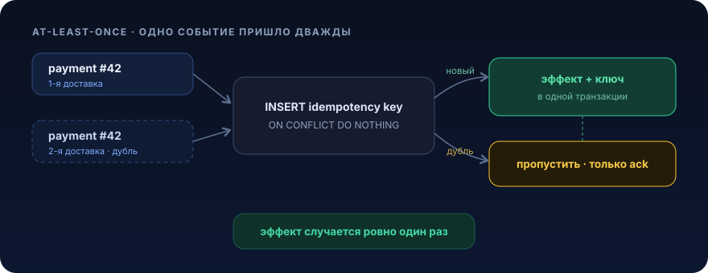

# Дедупликация


«Доставить ровно один раз» это красивая иллюзия со слайдов. Реальность жёстче: брокеры, ретраи, балансировщики и таймауты гарантируют доставку хотя бы один раз (at-least-once). А значит, рано или поздно одно и то же событие прилетит дважды. Урок про то, как сделать так, чтобы это не превратилось в двойные списания, дубли писем и разъезжающиеся счётчики

## Проблема

Пятница, вечер. Ты пишешь консьюмер, который слушает топик `payment_succeeded` и начисляет продавцу деньги на баланс. Код выглядит правильно:

```java
@KafkaListener(topics = "payment_succeeded", groupId = "billing")
public void onPayment(PaymentEvent event) {
    // 1. Считаем текущий баланс
    Seller seller = sellerDao.findById(event.sellerId()).orElseThrow();

    // 2. Начисляем
    seller.setBalance(seller.getBalance() + event.amount());
    sellerDao.save(seller);

    // 3. Пишем в ledger и шлём уведомление
    ledgerDao.save(new LedgerEntry(event.sellerId(), event.amount()));
    notificationService.send(event.sellerId(), "Зачислено " + event.amount());
}
```

Тесты зелёные, на стенде работает. Выкатили в прод. Через неделю приходит саппорт: «Продавцу зачислили 5000 вместо 2500, и он получил два одинаковых пуша».

Что произошло. Consumer обработал сообщение, начислил деньги, но не успел закоммитить offset: под убили при деплое, случился rebalance, GC-пауза превысила `max.poll.interval.ms`. Kafka честно решает «раз offset не подтверждён, значит не обработано» и передаёт то же сообщение снова, возможно уже другому инстансу. Твой идемпотентный на вид код выполняется второй раз:

```
Попытка 1:  balance 0    -> +2500 -> balance 2500  -> offset НЕ закоммичен (под умер)
             rebalance, сообщение переотправлено
Попытка 2:  balance 2500 -> +2500 -> balance 5000  -> offset закоммичен
```

Итог: `+= amount` это операция с побочным эффектом, зависящим от прошлого состояния. Выполнить её дважды не равно выполнить один раз. Деньги «из воздуха», два письма, разбитый ledger. И это не баг в твоём коде в классическом смысле, код правильный для случая «ровно одна доставка». Просто такого случая в природе нет.

То же самое ломается в куче мест:

- POST `/payments` с ретраем клиента по таймауту, два платежа
- вебхук от платёжного шлюза, который они шлют «до 200 OK», а твой 200 потерялся в сети, двойное подтверждение заказа
- retry HTTP-вызова во внешний сервис, который на самом деле успел выполниться, дубль на их стороне

Общий корень один: сеть и брокеры не умеют exactly-once, а бизнес-эффекты не идемпотентны. Дедупликация это мост между этими двумя фактами

## Что это и когда применять

Дедупликация это отбрасывание повторной обработки события или запроса, которое система уже обработала. Проще говоря: у каждого события есть устойчивый идентификатор, перед выполнением эффекта мы проверяем «а я это уже делал?» и, если да, не делаем повторно (возвращаем тот же результат или просто молча подтверждаем).

Тесно связанное понятие это идемпотентность ([урок 01](01-idempotency.md)): свойство операции давать один и тот же результат при повторном выполнении. Дедупликация это один из способов сделать неидемпотентную операцию идемпотентной снаружи.

Что она решает:

- at-least-once доставка из Kafka/RabbitMQ/SQS
- клиентские ретраи HTTP по таймауту
- вебхуки внешних систем «с гарантией доставки»
- повторная отправка формы (double-submit) пользователем

### Когда НЕ нужно

- **операция уже идемпотентна по своей природе.** `SET status = 'PAID'`, `PUT` на ресурс целиком, `balance = X` (не `+=`). Повторить `UPDATE order SET status='SHIPPED' WHERE id=1` дважды ничего не сломается. Дедуп тут лишний оверхед и лишняя таблица
- **чистые read-запросы.** GET ничего не меняет, дедуплицировать нечего
- **эффект и так защищён natural key.** Если ты вставляешь строку с уникальным бизнес-ключом и база сама отобьёт дубль через `UNIQUE`-констрейнт, отдельный слой дедупа не нужен, констрейнт и есть дедуп
- **когда потеря дубля неприемлема, а лишний дубль терпим.** Метрики, аналитические события «примерно посчитать клики», дешевле пережить редкий дубль, чем строить дедуп-инфраструктуру. Сначала посчитай цену дубля

Правило: дедуп нужен там, где эффект не идемпотентен И дубль дорог (деньги, письма, внешние вызовы, инкременты)

## Как это работает

Механика в основе всегда одна: устойчивый ключ плюс атомарная проверка-и-запись «уже видели».

<p align="center">
  
</p>

Критично: пометка ключа и бизнес-эффект должны быть в одной транзакции. Иначе получишь гонку: записали ключ, упали, эффект не выполнен, ключ висит, повтор считается дублем, эффект потерян навсегда. Атомарность «пометили как обработанное» плюс «обработали» это сердце дедупликации.

### Ключевые варианты реализации

**1. Где хранить дедуп-стор:**

| Хранилище | Плюсы | Минусы / когда |
|---|---|---|
| Та же PostgreSQL (таблица плюс `UNIQUE`) | Атомарность с бизнес-транзакцией из коробки, ничего не теряется | Нужен процесс очистки старых ключей |
| Redis (`SET key NX EX`) | Быстро, TTL встроен | Отдельная транзакционная граница от базы, нужна аккуратность, возможна потеря ключа при флеше |
| Natural key прямо в бизнес-таблице | Ноль лишних сущностей | Работает только если эффект это вставка строки |

Для денег и заказов дефолт это PostgreSQL в той же транзакции. Redis хорош для «дешёвых» дедупов (защита от double-submit) и для распределённых сценариев, где база не общая.

**2. Что брать за idempotency key:**

- для Kafka стабильный бизнес-ID из payload (`paymentId`, `orderId + eventType`), не offset и не `UUID.randomUUID()` в консьюмере (он будет разный на каждой доставке)
- для HTTP заголовок `Idempotency-Key`, который генерирует клиент один раз и переиспользует при ретраях (так делает Stripe)
- ключ должен быть детерминированным для «одного и того же» бизнес-события

**3. Окно дедупликации (TTL):**

Хранить ключи вечно нельзя, таблица распухнет. Но окно должно перекрывать максимально возможную задержку повторной доставки: retention топика, max backoff ретраев, время лежания в DLT. Если брокер может передоставить сообщение через 3 дня, а ты чистишь ключи через 1 час, дедуп дырявый. Практично: TTL это `max_retry_window` с запасом 2–3×, часто это дни, а не минуты.

**4. Что возвращать на дубль:**

- Kafka-консьюмер: просто ack, ничего не делаем
- HTTP: в идеале вернуть тот же ответ, что и на первый запрос (тот же `201` с тем же телом). Для этого в дедуп-таблице хранят не только ключ, но и сериализованный результат первой обработки

## Пример на Java

Разберём два уровня: руками через PostgreSQL (полный контроль, для денег) и через инструмент, библиотеку идемпотентности плюс `ON CONFLICT`.

### Вариант A. Дедуп-таблица плюс одна транзакция (Kafka-консьюмер)

Схема:

```sql
CREATE TABLE processed_event (
    idempotency_key TEXT PRIMARY KEY,          -- бизнес-ключ события
    consumer_group  TEXT        NOT NULL,      -- один ключ можно обработать разными группами
    processed_at    TIMESTAMPTZ NOT NULL DEFAULT now()
);

-- Индекс под очистку старых ключей (см. подводные камни)
CREATE INDEX processed_event_processed_at_idx ON processed_event (processed_at);
```

Уникальность делает составной PRIMARY KEY (или отдельный `UNIQUE(idempotency_key, consumer_group)`). Именно база гарантирует, что два конкурентных инстанса не проведут эффект дважды: `INSERT ... ON CONFLICT DO NOTHING` атомарен.

```java
@Repository
public class ProcessedEventDao {

    private final JdbcTemplate jdbc;

    ProcessedEventDao(JdbcTemplate jdbc) {
        this.jdbc = jdbc;
    }

    /**
     * Пытается пометить событие как обрабатываемое.
     * @return true, ключ новый, эффект надо выполнить; false, дубль, пропускаем.
     */
    boolean markIfFirstTime(String key, String consumerGroup) {
        int inserted = jdbc.update(
            "INSERT INTO processed_event (idempotency_key, consumer_group) "
                + "VALUES (?, ?) ON CONFLICT DO NOTHING",
            key, consumerGroup
        );
        return inserted == 1; // 0 означает конфликт → уже обработано
    }
}
```

```java
@Service
public class BillingService {

    private final ProcessedEventDao processedEventDao;
    private final SellerDao sellerDao;
    private final LedgerDao ledgerDao;
    private final NotificationService notificationService;

    // конструктор опущен для краткости

    /**
     * ВЕСЬ метод это одна транзакция. Пометка ключа и бизнес-эффект
     * коммитятся атомарно: либо оба, либо ни одного.
     */
    @Transactional
    public void applyPayment(PaymentEvent event) {
        // idempotency key, стабильный бизнес-ID, одинаковый на всех доставках
        boolean first = processedEventDao.markIfFirstTime(event.paymentId(), "billing");
        if (!first) {
            // дубль: молча выходим, offset закоммитится, эффект не повторится
            return;
        }

        Seller seller = sellerDao.findById(event.sellerId()).orElseThrow();
        seller.credit(event.amount());          // доменный метод вместо setBalance(+=)
        sellerDao.save(seller);

        ledgerDao.save(new LedgerEntry(event.paymentId(), event.sellerId(), event.amount()));
        // уведомление идемпотентно НЕ станет от транзакции; см. подводные камни
        notificationService.send(event.sellerId(), "Зачислено " + event.amount());
    }
}
```

```java
@Component
public class PaymentListener {

    private final BillingService billingService;

    PaymentListener(BillingService billingService) {
        this.billingService = billingService;
    }

    @KafkaListener(topics = "payment_succeeded", groupId = "billing")
    public void onPayment(PaymentEvent event) {
        billingService.applyPayment(event); // транзакция открывается внутри бина
    }
}
```

Почему это работает при гонке двух инстансов: оба делают `INSERT ON CONFLICT`. База сериализует их на строке PK, ровно один получит `inserted == 1`, второй `0` и выйдет. Никаких распределённых локов руками.

### Вариант B. HTTP endpoint с `Idempotency-Key` и сохранением ответа

Здесь дубль должен вернуть тот же ответ, а не просто «уже сделано».

```sql
CREATE TABLE idempotent_request (
    idempotency_key TEXT PRIMARY KEY,
    response_status INT         NOT NULL,
    response_body   JSONB       NOT NULL,
    created_at      TIMESTAMPTZ NOT NULL DEFAULT now()
);
```

```java
@Service
public class PaymentService {

    private final IdempotentRequestDao requestDao;
    private final PaymentDao paymentDao;
    private final ObjectMapper objectMapper;

    // конструктор опущен

    @Transactional
    public PaymentResult createOrGet(String key, CreatePaymentRequest req) {
        // Быстрый путь: уже обрабатывали, вернуть сохранённый ответ
        Optional<StoredResponse> existing = requestDao.find(key);
        if (existing.isPresent()) {
            return existing.get().deserialize(objectMapper); // тот же ответ, что и в первый раз
        }

        // Создаём платёж (не идемпотентная операция!)
        Payment payment = paymentDao.save(Payment.create(req.sellerId(), req.amount()));
        PaymentResult result = new PaymentResult(payment.getId(), 201, "CREATED");

        // Сохраняем ключ + ответ. ON CONFLICT ловит гонку двух параллельных запросов
        // с одним ключом: если кто-то успел первым, откатываемся и отдаём его ответ.
        boolean stored = requestDao.saveIfAbsent(key, result, objectMapper);
        if (!stored) {
            throw new ConcurrentRequestException(key); // ретрайнется, второй раз попадёт в быстрый путь
        }
        return result;
    }
}
```

Ключевая мысль: `saveIfAbsent` это тот же `INSERT ON CONFLICT DO NOTHING`, только он ещё и сериализует результат. Гонка двух одновременных запросов с одинаковым ключом разрешается на уровне PK, а не приложения.

### Вариант C. Готовые инструменты

Не всегда нужно писать руками. В экосистеме есть:

- **Spring Kafka**: включить exactly-once на уровне «read-process-write» через транзакционный producer плюс `isolation.level=read_committed`. Это не отменяет дедуп при записи в базу (это отдельный ресурс), но убирает дубли в цепочке Kafka→Kafka
- **специализированные библиотеки идемпотентности** (в проекте это `com.uzum:idempotency-lib-jpa`), которые оборачивают обработчик аннотацией и ведут дедуп-таблицу за тебя:

```java
@Idempotent(keyExpression = "#event.paymentId")
public void applyPayment(PaymentEvent event) {
    // библиотека сама сделала markIfFirstTime в той же транзакции;
    // на дубль метод просто не вызовется
    ...
}
```

Под капотом ровно та же дедуп-таблица и `ON CONFLICT`. Библиотека экономит бойлерплейт, но понимать механику обязательно: иначе не отловишь баги с TTL, границами транзакции и выбором ключа.

## Подводные камни

1. **Пометка ключа и эффект в разных транзакциях.** Классика: сначала `redis.set(key)`, потом отдельно пишем в базу, между ними падаем. Ключ есть, эффекта нет, повтор считается дублем, данные потеряны навсегда. Дедуп-запись и бизнес-эффект должны коммититься атомарно. С Redis плюс PostgreSQL это принципиально сложнее, чем «всё в одной базе»
2. **Нестабильный idempotency key.** Взяли за ключ `UUID.randomUUID()` в консьюмере, timestamp получения или Kafka offset, и дедуп не работает вообще, потому что при передоставке ключ другой. Ключ обязан быть детерминированной функцией от бизнес-события. Если продюсер не кладёт стабильный ID, это баг продюсера, чини там
3. **Слишком короткое окно дедупа (TTL).** Чистишь ключи через час, а брокер может передоставить сообщение из DLT через двое суток, дубль просочится. TTL должен перекрывать максимальную задержку повторной доставки с запасом (retention топика плюс max backoff плюс время в DLT)
4. **Дедуп-таблица без очистки и без индекса.** Обратная крайность: не чистим никогда, таблица на сотни миллионов строк, `INSERT` замедляется, автовакуум задыхается. Нужен фоновый джоб `DELETE FROM processed_event WHERE processed_at < now() - interval '7 days'` и индекс по `processed_at`, иначе очистка сделает seq scan по всей таблице
5. **Побочные эффекты, которые нельзя откатить транзакцией.** `notificationService.send(...)` внутри `@Transactional` уже ушёл в сеть, даже если транзакция потом откатится. И наоборот: если письмо шлётся, а транзакция откатывается по конфликту, письмо всё равно улетело. Внешние эффекты выноси за коммит (через outbox, [урок 10](10-transactional-outbox.md)), иначе дедуп защищает базу, но не защищает от двойного письма
6. **Дедуп на уровне сообщения вместо уровня эффекта.** Одно событие «заказ оплачен» может порождать несколько эффектов (начислить баланс, списать сток, послать чек). Если дедупишь «обработку сообщения» целиком, но обработчик после ретрая частично прошёл, можно получить перекос. Либо весь обработчик строго атомарен и идемпотентен как единое целое, либо дедупь каждый эффект отдельным ключом
7. **Self-invocation ломает `@Transactional`.** Если `applyPayment` с дедупом вызывается через `this.applyPayment(...)` из того же бина, Spring-прокси не сработает, транзакция не откроется, атомарность «ключ плюс эффект» рассыпется. Вызов только через инжектированный бин
8. **Забыли, что БД-констрейнт уже дедупит.** Иногда городят дедуп-таблицу поверх вставки, у которой и так есть `UNIQUE` по бизнес-ключу. Тогда достаточно поймать `DuplicateKeyException` или сделать `INSERT ON CONFLICT DO NOTHING` на самой бизнес-таблице, отдельный слой лишний

## Практическая задача

> 🎯 Уровень: middle → senior. Ожидаемое время: 3–4 часа с Testcontainers

**Система.** Сервис начисления кэшбэка. Он слушает Kafka-топик `order_completed` и на каждый завершённый заказ начисляет покупателю кэшбэк на бонусный счёт, пишет запись в историю начислений и шлёт пуш «Вам начислено N бонусов». Топик at-least-once, консьюмер-группа `cashback`.

**Дано, текущий код, который ломается в проде:**

```java
@KafkaListener(topics = "order_completed", groupId = "cashback")
public void onOrderCompleted(OrderCompletedEvent event) {
    long cashback = event.orderAmount() / 100; // 1%
    BonusAccount acc = bonusAccountDao.findByUserId(event.userId()).orElseThrow();
    acc.setBalance(acc.getBalance() + cashback);   // <-- += состояние
    bonusAccountDao.save(acc);
    bonusHistoryDao.save(new BonusHistory(event.userId(), cashback, event.orderId()));
    pushService.send(event.userId(), "Вам начислено " + cashback + " бонусов");
}
```

Симптом из прода: при деплоях и ребалансах часть пользователей получает двойной кэшбэк и два одинаковых пуша. `OrderCompletedEvent` содержит стабильное поле `orderId`.

**ТЗ.** Сделать обработку идемпотентной через дедупликацию.

1. Дедуп-механизм на PostgreSQL: таблица `processed_event` (миграция Liquibase по правилам проекта: `IF NOT EXISTS`, комментарии на русском, индекс `CONCURRENTLY`)
2. Атомарную пометку ключа плюс начисление в одной транзакции. Ключ это `orderId` (при желании составной `orderId + consumerGroup`)
3. Начисление баланса переписать так, чтобы даже без дедупа оно было ближе к идемпотентности (доменный метод `credit`, а не публичный `setBalance(+=)`)
4. Пуш вынести так, чтобы дубль пуша не отправлялся (слать после успешного коммита или через outbox, а не внутри транзакции, которая может откатиться)
5. Фоновую очистку старых ключей с TTL, перекрывающим retention топика

**Критерии приёмки** (функциональный тест на Testcontainers, unit-тесты не пишем, отметь галочками):

- [ ] повторная доставка события с тем же `orderId` не создаёт второе начисление: баланс изменился ровно на `orderAmount/100`, а не вдвое
- [ ] в `bonus_history` ровно одна запись на `orderId`
- [ ] пуш ушёл один раз (проверить через счётчик отправок)
- [ ] два конкурентных инстанса, обрабатывающих одно событие одновременно, дают тот же результат (эффект один), смоделировать гонку двумя параллельными вызовами
- [ ] разные `orderId` обрабатываются независимо (дедуп не «залипает» на все события)

<details>
<summary>Подсказки (без готового решения)</summary>

- дубль ловится на уровне базы: `INSERT ... ON CONFLICT DO NOTHING`, смотри на число вставленных строк. Не изобретай `SELECT` затем `INSERT`, это гонка
- `PRIMARY KEY` / `UNIQUE` по ключу и есть твой дедуп-замок, отдельные локи не нужны
- проверь, что метод с `@Transactional` вызывается через бин, а не `this`, иначе транзакции не будет и вся атомарность развалится
- прикинь, что произойдёт, если пометить ключ, но упасть до начисления. Что должно быть внутри транзакции, а что снаружи?
- для «пуш ровно один раз» честный продакшн-ответ это outbox-таблица плюс поллер, а не `pushService.send` внутри транзакции. Минимально отправка в `afterCommit`

</details>

## Что почитать

- [Stripe API: Idempotent Requests](https://docs.stripe.com/api/idempotent_requests), эталонная реализация `Idempotency-Key` в HTTP API: клиентский ключ, сохранение ответа, окно хранения
- [microservices.io: Idempotent Consumer](https://microservices.io/patterns/communication-style/idempotent-consumer.html) и [Transactional Outbox](https://microservices.io/patterns/data/transactional-outbox.html), дедуп на приёме и надёжная связка эффекта с публикацией
- [Amazon Builders' Library: Timeouts, retries, and backoff with jitter](https://aws.amazon.com/builders-library/timeouts-retries-and-backoff-with-jitter/), почему at-least-once неизбежен и как ретраи порождают дубли
- [Идемпотентность](01-idempotency.md) из этого раздела, база, на которой стоит дедуп

---

← [Dead Letter Queue (08)](08-dead-letter-queue.md) · [Обзор раздела](README.md) · [Transactional Outbox (10) →](10-transactional-outbox.md)
