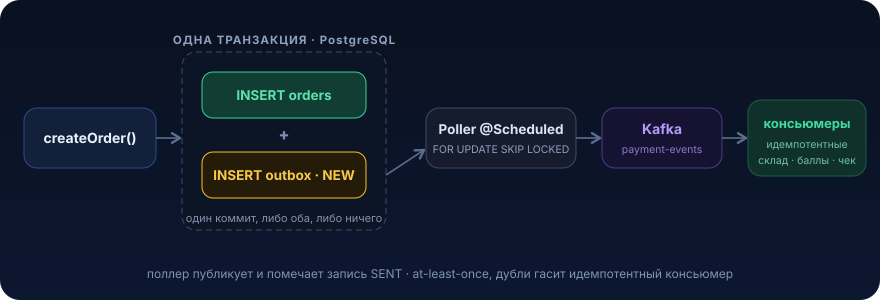

# Transactional Outbox


Ты уже умеешь открывать транзакцию и слать сообщение в Kafka. Проблема в том, что это две разные системы с двумя разными коммитами, и между ними всегда есть зазор, в который прилетает сбой. Урок про то, как перестать терять события «в щели» между базой и брокером, не изобретая распределённый двухфазный коммит

## Проблема

Есть сервис заказов. Пользователь оформляет заказ: мы сохраняем строку в PostgreSQL и публикуем событие `OrderCreated` в Kafka, чтобы на него отреагировали склад, платежи и нотификации.

Наивный код выглядит правильно:

```java
@Service
@RequiredArgsConstructor
public class OrderService {

    private final OrderRepository orderRepository;
    private final KafkaTemplate<String, OrderCreatedEvent> kafka;

    @Transactional
    public Order createOrder(CreateOrderCommand cmd) {
        Order order = orderRepository.save(Order.newFrom(cmd)); // 1. пишем в БД

        // 2. шлём событие в Kafka
        kafka.send("order-created", order.getId().toString(),
                new OrderCreatedEvent(order.getId(), order.getTotal()));

        return order; // 3. коммит транзакции
    }
}
```

На ревью это пройдёт. В демо это работает. В проде теряет заказы.

Разберём, что тут физически происходит. У нас два хранилища (база и брокер) и два независимых коммита. Возможны варианты рассинхрона:

**Сценарий А. `kafka.send()` внутри транзакции, но событие ушло, а коммит базы упал.** `KafkaTemplate.send()` асинхронный: он кладёт сообщение в буфер продюсера и почти сразу возвращает управление. Реальная отправка на брокер происходит в фоне и не привязана к транзакции базы. Если после `send()` коммит базы упадёт (нарушение констрейнта, обрыв соединения, таймаут), то заказа в базе нет, а событие `OrderCreated` уже улетело подписчикам. Склад начинает собирать заказ, которого не существует. Платёжный сервис ищет заказ по id и не находит.

**Сценарий Б. Коммит базы прошёл, а паблиш упал.** Переставим строки: сначала коммит, потом `send()`. Транзакция закоммитилась, заказ в базе есть. А потом брокер недоступен, продюсер отвалился по таймауту, под приложения убили (OOM, деплой, `kill -9`) ровно между коммитом и отправкой. Заказ в базе есть, события нет. Никто не собирает заказ, клиент оплатил, товар не едет. Это тихая потеря: ни ошибки пользователю, ни алерта. Обнаружится через сутки в саппорте.

```
   createOrder()
        │
        ├── INSERT order ──────► [PostgreSQL] ✅ committed
        │
        ╳  <-- POD KILLED / брокер недоступен
        │
        └── kafka.send() ──────► [Kafka] ❌ НЕ отправлено

   Итог: заказ есть, события нет. Состояния разошлись.
```

Это классический dual-write problem: попытка атомарно записать в две системы, у которых нет общей транзакции. Между двумя коммитами всегда есть окно отказа, и никакой порядок строк его не закрывает: ты просто выбираешь, что именно потеряешь, то ли фантомное событие без данных, то ли данные без события.

«Ну поставлю `try/catch` и откачу» не спасает. Если `send()` бросил исключение, ты откатишь базу. Но `send()` асинхронный: он часто не бросает сразу, а зафейлится в фоне уже после коммита. А если под умер между коммитом и отправкой, никакой `catch` вообще не выполнится.

Цена вопроса в проде: рассинхрон между сервисами, ручные сверки, «потерянные» заказы и платежи, релизы по ночам с проверкой «а всё ли доехало». Нужен способ сделать запись данных и факт «событие надо отправить» одной атомарной операцией

## Что это и когда применять

Transactional Outbox это паттерн, в котором ты не шлёшь событие в брокер напрямую из бизнес-транзакции, а записываешь его в ту же самую базу, в ту же самую транзакцию, в отдельную таблицу-«исходящих» (`outbox`). А отдельный процесс (поллер или CDC) читает эту таблицу и уже гарантированно доставляет события в Kafka.

Идея в одном предложении: превратить два коммита в один. И бизнес-данные, и запись «надо отправить событие X» летят в PostgreSQL в рамках одной ACID-транзакции. Либо закоммитилось всё, либо ничего. Dual-write исчезает, потому что write теперь ровно один, в базу.

Доставка в Kafka становится отдельной, ретраибельной задачей: если брокер лежит, запись в outbox просто ждёт и будет отправлена позже. Событие не теряется, оно лежит в базе как надёжный «список дел».

Что паттерн даёт по гарантиям:

- **атомарность** данных и намерения отправить событие
- **at-least-once** доставку: событие уйдёт хотя бы один раз (возможны дубли, их гасим идемпотентностью на консьюмере, [урок 09](09-deduplication.md))
- устойчивость к падению брокера и к рестарту приложения в любой момент

Чего он не даёт: exactly-once (его в распределёнке практически не бывает) и мгновенной доставки, есть небольшая задержка на поллинг.

### Когда НЕ нужно

- **нет двух систем.** Если ты пишешь только в базу и больше никуда не публикуешь, outbox не нужен, писать нечего
- **событие некритично и его потеря допустима.** Метрика «пользователь навёл мышку», аналитический клик, best-effort лог. Если потеря одного события в год никого не разбудит, не усложняй
- **данные и потребитель в одной транзакции.** Если «событие» это просто вызов другого метода того же приложения в той же транзакции, брокер вообще не нужен
- **у тебя уже есть CDC-инфраструктура (Debezium).** Тогда outbox-таблица остаётся, но поллер писать руками не надо, читает Debezium. Это тот же паттерн, другой транспорт
- **синхронный запрос-ответ.** Если вызывающему нужен немедленный результат от внешнего сервиса, outbox не про это, это асинхронная доставка событий, а не RPC

Правило: outbox нужен там, где факт изменения данных обязан привести к событию, и потеря события это инцидент. Заказы, платежи, списания, изменения статусов. Не «всё подряд»

## Как это работает

Пишем бизнес-данные и outbox-запись в одной транзакции, а отдельный поллер забирает новые записи и публикует их в Kafka:

```
@Transactional {
    INSERT INTO orders (...)                 -- бизнес-данные
    INSERT INTO outbox (aggregate, payload,  -- событие как строка в той же БД
                        status='NEW')
}   -- один коммит: либо оба INSERT, либо ни одного
```

<p align="center">
  
</p>

Ключевые параметры и варианты реализации:

**a) Конкурентный забор записей, `FOR UPDATE SKIP LOCKED`.** В проде поллер работает в нескольких подах одновременно. Чтобы два инстанса не схватили одну запись и не отправили её дважды сверх меры, забираем пачку через `SELECT ... FOR UPDATE SKIP LOCKED`. Заблокированные другим воркером строки просто пропускаются, каждый под берёт свою пачку. Это дешёвый способ горизонтально масштабировать поллер без распределённого лока (подробно в [уроке 14](14-claim-lease.md)).

**b) Что ретраить, а что нет.** Ретраим транзиентные ошибки доставки: брокер недоступен, таймаут, лидер партиции переизбирается. НЕ ретраим бесконечно отравленные сообщения (poison pill): если payload битый и сериализация падает всегда, вечный ретрай застопорит очередь. Отсюда `attempts` плюс порог: после N попыток статус `FAILED` и в DLQ или на алерт, чтобы разобрать руками, а очередь поехала дальше ([урок 08](08-dead-letter-queue.md)).

**c) At-least-once значит идемпотентность на консьюмере.** Между `kafka.send()` (успех) и `UPDATE status='SENT'` под может умереть. Тогда после рестарта запись всё ещё `NEW`, и событие уйдёт повторно. Это неизбежная плата за надёжность: outbox гарантирует «хотя бы раз», а не «ровно раз». Значит, консьюмер обязан быть идемпотентным. Кладём в каждое событие уникальный `messageId` (id outbox-записи или бизнес-ключ) и на стороне консьюмера дедупим через `INSERT ... ON CONFLICT DO NOTHING`.

**d) Порядок событий.** Если важен порядок (статусы одного заказа), поллер должен читать `ORDER BY id` и класть события одного агрегата в одну партицию Kafka (key = orderId). Иначе консьюмер увидит `SHIPPED` раньше `CREATED`.

**e) Очистка (retention).** Outbox-таблица растёт. Либо `DELETE` сразу после успешной отправки, либо помечаем `SENT` и чистим фоновым джобом (`DELETE WHERE status='SENT' AND sent_at < now() - interval '3 days'`). Без очистки таблица распухает, поллер-запрос деградирует.

## Пример на Java

Реалистичная реализация на Spring Boot плюс PostgreSQL плюс Kafka. Сначала схема, потом продюсер (запись в outbox в одной транзакции), поллер, потом идемпотентный консьюмер.

### 1. Схема БД (Liquibase / SQL)

```sql
-- outbox-таблица: очередь исходящих событий
CREATE TABLE outbox (
    id             BIGSERIAL   PRIMARY KEY,
    aggregate_type VARCHAR(64) NOT NULL,          -- 'order', 'payment'...
    aggregate_id   VARCHAR(64) NOT NULL,          -- id заказа → ключ партиции
    event_type     VARCHAR(64) NOT NULL,          -- 'OrderCreated'
    payload        JSONB       NOT NULL,          -- тело события
    status         VARCHAR(16) NOT NULL DEFAULT 'NEW', -- NEW | SENT | FAILED
    attempts       INT         NOT NULL DEFAULT 0,
    created_at     TIMESTAMPTZ NOT NULL DEFAULT now(),
    sent_at        TIMESTAMPTZ
);

-- частичный индекс: поллер сканирует только необработанные записи,
-- SENT-строки в индекс не попадают → запрос остаётся быстрым даже на большой таблице
CREATE INDEX outbox_new_idx ON outbox (id) WHERE status = 'NEW';

-- дедуп-таблица на стороне консьюмера: уникальный ключ = защита от повторной обработки
CREATE TABLE processed_messages (
    message_id   BIGINT      PRIMARY KEY,          -- id outbox-записи
    processed_at TIMESTAMPTZ NOT NULL DEFAULT now()
);
```

### 2. Запись в outbox, в той же транзакции, что и бизнес-данные

```java
@Service
@RequiredArgsConstructor
public class OrderService {

    private final OrderRepository orderRepository;
    private final OutboxRepository outboxRepository;
    private final ObjectMapper objectMapper;

    /**
     * Бизнес-данные и событие пишутся в ОДНОЙ транзакции.
     * Никакого kafka.send() здесь нет, только запись в БД.
     * Либо закоммитится и order, и outbox-запись, либо ничего.
     */
    @Transactional
    public Order createOrder(CreateOrderCommand cmd) {
        Order order = orderRepository.save(Order.newFrom(cmd));

        OutboxRecord record = OutboxRecord.builder()
                .aggregateType("order")
                .aggregateId(order.getId().toString())
                .eventType("OrderCreated")
                .payload(toJson(new OrderCreatedEvent(order.getId(), order.getTotal())))
                .status(OutboxStatus.NEW)
                .build();

        outboxRepository.save(record); // тот же transaction context, тот же коммит
        return order;
    }

    private String toJson(Object event) {
        try {
            return objectMapper.writeValueAsString(event);
        } catch (JsonProcessingException e) {
            throw new IllegalStateException("Failed to serialize event", e);
        }
    }
}
```

### 3. Repository с конкурентным забором записей

```java
public interface OutboxRepository extends JpaRepository<OutboxRecord, Long> {

    /**
     * Забираем пачку необработанных записей.
     * FOR UPDATE SKIP LOCKED: несколько подов-поллеров не дерутся за одни строки:
     * заблокированные другим воркером записи пропускаются.
     */
    @Query(value = """
            SELECT * FROM outbox
            WHERE status = 'NEW'
            ORDER BY id
            LIMIT :limit
            FOR UPDATE SKIP LOCKED
            """, nativeQuery = true)
    List<OutboxRecord> lockBatchForPublishing(@Param("limit") int limit);
}
```

### 4. Поллер, отдельный процесс доставки

```java
@Component
@RequiredArgsConstructor
@Slf4j
public class OutboxPoller {

    private static final int BATCH_SIZE = 100;
    private static final int MAX_ATTEMPTS = 10;

    private final OutboxRepository outboxRepository;
    private final KafkaTemplate<String, String> kafka;

    /**
     * Каждые 500 мс забираем пачку и публикуем.
     * Транзакция на весь цикл: SELECT ... FOR UPDATE держит лок до конца метода,
     * поэтому UPDATE статуса и снятие лока происходят атомарно.
     */
    @Scheduled(fixedDelay = 500)
    @Transactional
    public void publishBatch() {
        List<OutboxRecord> batch = outboxRepository.lockBatchForPublishing(BATCH_SIZE);
        if (batch.isEmpty()) {
            return;
        }

        batch.forEach(this::publishOne);
    }

    private void publishOne(OutboxRecord record) {
        try {
            // key = aggregateId → все события одного заказа в одну партицию (порядок сохранён)
            SendResult<String, String> result = kafka.send(
                    "order-events",
                    record.getAggregateId(),
                    withMessageId(record)          // messageId = id записи → дедуп на консьюмере
            ).get();                                // ждём подтверждения брокера синхронно

            record.markSent();                      // status=SENT, sent_at=now()
        } catch (Exception e) {
            // транзиентная ошибка: запись остаётся NEW, повторим на след. цикле
            record.incrementAttempts();
            if (record.getAttempts() >= MAX_ATTEMPTS) {
                record.markFailed();                // poison pill → в FAILED, разбор вручную/DLQ
                log.error("Outbox record {} exhausted retries, moved to FAILED",
                        record.getId(), e);
            } else {
                log.warn("Failed to publish outbox record {}, attempt {}",
                        record.getId(), record.getAttempts(), e);
            }
        }
        // изменения record сохранятся при коммите транзакции метода (dirty checking)
    }

    private String withMessageId(OutboxRecord record) {
        // messageId прокидываем в payload или заголовок Kafka; здесь упрощённо в теле
        return record.getPayload(); // в реальном коде добавь record.getId() в headers
    }
}
```

> Даже с `SKIP LOCKED` возможен дубль (под умер между `kafka.send()` и коммитом статуса), это by design at-least-once. Дедуп ниже.

### 5. Идемпотентный консьюмер, дедуп через уникальный ключ

```java
@Component
@RequiredArgsConstructor
public class OrderEventsConsumer {

    private final ProcessedMessageRepository processedRepository;
    private final WarehouseService warehouseService;

    /**
     * Дедуп через INSERT в processed_messages с PK на message_id.
     * Повторная доставка того же события → нарушение PK → безопасный skip.
     */
    @KafkaListener(topics = "order-events", groupId = "warehouse")
    @Transactional
    public void onMessage(ConsumerRecord<String, String> msg) {
        long messageId = extractMessageId(msg); // из headers/payload

        boolean firstTime = processedRepository.tryInsert(messageId);
        if (!firstTime) {
            return; // уже обрабатывали, идемпотентный пропуск дубля
        }

        OrderCreatedEvent event = parse(msg.value());
        warehouseService.reserveStock(event); // бизнес-обработка в той же транзакции
    }
}
```

```java
public interface ProcessedMessageRepository extends JpaRepository<ProcessedMessage, Long> {

    /**
     * ON CONFLICT DO NOTHING: атомарная проверка-и-вставка.
     * Возвращает 1, если вставили (первый раз), 0, если такой message_id уже есть.
     */
    @Modifying
    @Query(value = """
            INSERT INTO processed_messages (message_id)
            VALUES (:messageId)
            ON CONFLICT (message_id) DO NOTHING
            """, nativeQuery = true)
    int insertIfAbsent(@Param("messageId") long messageId);

    default boolean tryInsert(long messageId) {
        return insertIfAbsent(messageId) == 1;
    }
}
```

Ключевые места: `@Transactional` на `createOrder` покрывает и order, и outbox, один коммит; поллер полностью отвязан от бизнес-логики; `ON CONFLICT DO NOTHING` даёт атомарный дедуп без гонок.

## Подводные камни

1. **`kafka.send()` внутри бизнес-транзакции это НЕ outbox.** Самая частая ошибка: «я же в транзакции». Продюсер Kafka не участвует в транзакции PostgreSQL. Отправка асинхронна и переживает rollback. Смысл паттерна именно в том, чтобы не звать брокер из бизнес-транзакции вообще, только `INSERT` в outbox. Если видишь `kafka.send()` рядом с `orderRepository.save()` под одним `@Transactional`, паттерн сломан
2. **Отсутствие идемпотентности на консьюмере.** Outbox это at-least-once, дубли неизбежны (под умер между send и update статуса). Если консьюмер не дедупит, будет двойное списание, два письма клиенту, двойной резерв на складе. Дедуп-таблица или уникальный индекс обязательны, не «на потом»
3. **Дедуп-ключ с коротким окном жизни.** Чистишь `processed_messages` через час, а ретрай отравленной записи прилетел через сутки, дубль проскочил, потому что ключа уже нет. Окно дедупа должно быть больше максимального времени жизни записи в outbox (MAX_ATTEMPTS × backoff)
4. **Outbox без индекса и без очистки.** Таблица растёт до миллионов строк, поллер делает `SELECT ... WHERE status='NEW'` по full scan, лаг доставки растёт, база под нагрузкой. Нужен частичный индекс `WHERE status='NEW'` (в него не попадают отправленные) и retention-джоб. Без этого паттерн сам становится инцидентом через месяц
5. **Poison pill без предела ретраев.** Битый payload, который всегда падает на сериализации, при бесконечном ретрае встаёт в начало очереди и блокирует все последующие события. Нужен счётчик `attempts` и переход в `FAILED`/DLQ, чтобы очередь ехала дальше, а битую запись разобрали руками
6. **Потеря порядка при масштабировании поллера.** Несколько подов плюс `SKIP LOCKED` плюс партиции по хэшу это события одного заказа могут уйти в разные партиции и переупорядочиться (`SHIPPED` перед `CREATED`). Если порядок критичен, key партиции = `aggregateId`, и `ORDER BY id` в выборке. Не полагайся на «обычно приходит по порядку»
7. **`@Scheduled` без учёта многоподовости и без `FOR UPDATE SKIP LOCKED`.** Если несколько инстансов запускают поллер по расписанию и берут записи простым `SELECT ... WHERE status='NEW'` без блокировки, они схватят одни строки и разошлют лавину дублей. `SKIP LOCKED` (или ShedLock для single-poller) обязателен

## Практическая задача

> 🎯 Уровень: senior. Ожидаемое время: 4–5 часов с Testcontainers

**Система.** Сервис платежей `payment-service` на Spring Boot плюс PostgreSQL плюс Kafka. Когда пользователь подтверждает оплату, сервис создаёт запись платежа и должен опубликовать событие `PaymentCompleted` в топик `payment-events`, на которое подписаны: сервис заказов (перевести заказ в `PAID`), сервис лояльности (начислить баллы), сервис нотификаций (отправить чек).

**Дано, текущий код, который ломается:**

```java
@Service
@RequiredArgsConstructor
public class PaymentService {

    private final PaymentRepository paymentRepository;
    private final KafkaTemplate<String, PaymentCompletedEvent> kafka;

    @Transactional
    public Payment completePayment(CompletePaymentCommand cmd) {
        Payment payment = paymentRepository.save(
                Payment.completed(cmd.orderId(), cmd.amount()));

        // публикация прямо из бизнес-транзакции
        kafka.send("payment-events", payment.getOrderId().toString(),
                new PaymentCompletedEvent(payment.getId(),
                        payment.getOrderId(), payment.getAmount()));

        return payment;
    }
}
```

**Что уже случилось в проде:** во время деплоя брокера часть подов оплатила заказы в базе, но события `PaymentCompleted` не ушли (под перезапустился между коммитом и фактической отправкой). Заказы висят в `CREATED`, клиенты оплатили, товар не едет, баллы не начислены. Плюс, когда включили ретраи на клиенте, всплыла обратная проблема: некоторым клиентам начислили баллы дважды.

**ТЗ.** Переделай `completePayment` на Transactional Outbox.

1. Таблицу `outbox` и запись события в неё в той же транзакции, что и `Payment`. Из `completePayment` убрать `kafka.send()` полностью
2. Поллер (`@Scheduled`), который забирает новые записи и публикует их в `payment-events`. Забор должен корректно работать при нескольких подах
3. Обработку ошибок доставки: транзиентные ошибки ретрай, «отравленные» записи после N попыток в `FAILED`, не блокируя очередь
4. Идемпотентность на стороне сервиса лояльности: повторная доставка `PaymentCompleted` не должна начислять баллы второй раз

**Критерии приёмки** (проверь тестами, отметь галочками):

- [ ] Kafka недоступна в момент `completePayment` → платёж сохраняется в базе, событие уходит автоматически после восстановления брокера (ничего не потеряно)
- [ ] приложение убить (`kill -9`) сразу после коммита платежа → после рестарта событие всё равно публикуется
- [ ] повторная доставка одного `PaymentCompleted` (отправь дважды) не приводит ко второму начислению баллов
- [ ] два инстанса поллера параллельно не рассылают одну запись многократно (кроме допустимого редкого дубля, который гасится п.4)
- [ ] одна битая запись в outbox не останавливает доставку остальных

<details>
<summary>Подсказки (без готового решения)</summary>

- правильная проверка «атомарности»: в тесте останови Kafka, вызови `completePayment`, убедись, что в `payment` строка есть, а событие ещё лежит в `outbox` со статусом `NEW`. Подними Kafka, дождись, что запись стала `SENT`
- для конкурентного забора смотри `SELECT ... FOR UPDATE SKIP LOCKED` (нативный запрос). Подумай, почему обычный `findByStatus('NEW')` тут даст дубли
- для идемпотентности лояльности: что можно сделать уникальным ключом? `payment.id`? `orderId`? Что произойдёт при `INSERT ... ON CONFLICT DO NOTHING`, если запись уже есть?
- не забудь про очистку outbox и частичный индекс по `status='NEW'`, без них тест пройдёт, но в проде поллер деградирует
- где взять `messageId` для дедупа так, чтобы он был стабилен между повторными доставками? Он должен генерироваться до отправки, а не в консьюмере

</details>

## Что почитать

- [microservices.io: Transactional Outbox](https://microservices.io/patterns/data/transactional-outbox.html), каноническое описание паттерна и связанного Polling Publisher
- [Debezium: Reliable Microservices Data Exchange With the Outbox Pattern](https://debezium.io/blog/2019/02/19/reliable-microservices-data-exchange-with-the-outbox-pattern/), тот же паттерн через CDC вместо поллера
- [Amazon Builders' Library: Timeouts, retries, and backoff with jitter](https://aws.amazon.com/builders-library/timeouts-retries-and-backoff-with-jitter/), почему ретраи доставки нужны с backoff и jitter
- [Дедупликация](09-deduplication.md) из этого раздела, обязательная пара к outbox

---

← [Дедупликация (09)](09-deduplication.md) · [Обзор раздела](README.md) · [Реконциляция (11) →](11-reconciliation.md)
