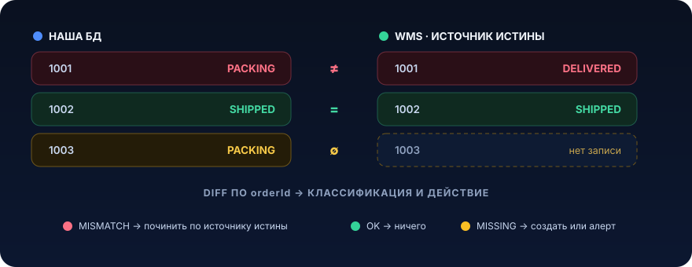

# Реконциляция


Событийная интеграция красива на диаграмме и предательски в проде. Kafka at-least-once, ретраи, DLT, идемпотентность, всё это снижает вероятность рассинхрона, но не обнуляет её. Рано или поздно твоя база и чужая система начинают рассказывать разные истории про один и тот же заказ. Реконциляция это про то, как жить в мире, где события теряются, и всё равно сходиться к правде

## Проблема

У нас FBS-сервис (fulfillment by seller). Есть заказ, у него на складе (WMS, внешняя система) меняется статус: `PACKING → SHIPPED → DELIVERED`. WMS публикует событие в Kafka-топик `order_status`, мы его консьюмим и двигаем свой `SellerOrder.status`.

Наивный консьюмер выглядит правильно:

```java
@KafkaListener(topics = "order_status", groupId = "seller-order-service-02")
public void onStatus(OrderStatusUpdateDto event) {
    var order = orderDao.findByExternalId(event.orderId())
        .orElseThrow(() -> new OrderNotFoundException(event.orderId()));

    order.applyStatus(event.status(), event.happenedAt()); // двигаем стейт-машину
    orderDao.save(order);
    // ack происходит автоматически после выхода из метода
}
```

Что тут может пойти не так? На ревью ничего. В проде целый зоопарк:

1. **WMS уронил событие.** Ретрай на их стороне выработался, DLT нет, событие про `SHIPPED` просто не доехало. У нас заказ навсегда завис в `PACKING`
2. **Мы «съели» событие.** `OrderNotFoundException` в момент, когда заказ ещё не успел создаться (гонка `order` против `order_status`), сообщение улетело в DLT, руки до DLT не дошли. У нас `PACKING`, у них `DELIVERED`
3. **Топик перегнали, поменяли consumer group, чистили офсеты после инцидента**, потеряли кусок истории
4. **Отравленное сообщение** заблокировало партицию на 40 минут, а потом кто-то нажал skip

Симптом всегда одинаковый: дрейф состояний. Через неделю у тебя в базе 300 заказов в `PACKING`, которые на складе давно уехали клиенту. Продавцу капают штрафы за «непереданный вовремя заказ», хотя он всё передал. Служба поддержки заводит тикеты, ты руками пишешь `UPDATE seller_order SET status = ...`, и это худшее, что можно делать в проде в пятницу.

Почему это дорого:

- **деньги напрямую.** Штрафы, компенсации, неверные выплаты продавцам
- **тихо.** Нет эксепшена, нет алерта. Событие не пришло, значит, ничего не произошло. Отсутствие данных не кидает stacktrace
- **накапливается.** Каждый потерянный ивент это +1 к вечному расхождению. Оно не самоисправляется

Ключевая мысль: надёжная доставка событий уменьшает частоту расхождений, но не гарантирует их отсутствие. Пока есть две системы и сеть между ними, состояния будут расходиться. Значит, нужен механизм, который периодически спрашивает «а мы всё ещё согласны про мир?» и чинит то, что разошлось

## Что это и когда применять

Реконциляция (reconciliation, сверка) это фоновый процесс, который периодически сравнивает состояние двух систем по общему ключу, находит расхождения и приводит их к согласованному виду.

Проще говоря: раз в N минут или часов ты берёшь свою картину мира и чужую, кладёшь рядом, и там, где они не совпали, чинишь (или хотя бы громко сигналишь).

Это классический приём eventual consistency: мы не пытаемся сделать интеграцию строго консистентной (это дорого и часто невозможно между разными владельцами), а признаём, что расхождения будут, и строим отдельный контур, который их вычищает. Реконциляция это «страховочная сетка» под событийной интеграцией, а не замена ей.

Аналогия из жизни это бухгалтерская сверка. Каждый день видно движения по счёту, но в конце месяца всё равно сверяют выписку банка с внутренним учётом, потому что где-то что-то потерялось или задвоилось, и это находят именно сверкой.

### Когда применять

- интеграция через события, где доставка at-least-once или хуже, и потеря/дубль ивента приводит к дрейфу
- есть **источник истины** (source of truth), система, чьё состояние считаем эталонным (обычно внешний склад, платёжный провайдер, партнёр)
- расхождение имеет цену: деньги, штрафы, SLA, юридические последствия
- у источника истины есть способ массово отдать состояние: batch-API, отчёт, snapshot-топик, реплика базы, ежедневная файл-выгрузка

### Когда НЕ нужно

- **внутри одного сервиса или одной базы.** Если обе стороны живут в одной транзакции PostgreSQL, тебе не нужна реконциляция, тебе нужна транзакция. Не решай фоновой сверкой то, что решается `@Transactional`
- **строгая консистентность обязательна прямо сейчас** (списание денег в моменте). Тут нужны 2PC/Saga/синхронная проверка, а не «починим через час»
- **нет источника истины.** Если непонятно, чьё состояние правильное, сверка превращается в философский спор: ты находишь расхождение, но не знаешь, кого чинить. Сначала договорись, кто эталон
- **данные не критичны и самовосстанавливаются.** Кэш, аналитика, счётчики «примерно», дешевле пересчитать, чем строить контур сверки
- **источник истины не умеет отдавать состояние массово.** Если единственный способ узнать статус это дёргать по одному заказу, а их миллионы, сверка «в лоб» положит их API. Нужен другой механизм выгрузки

Реконциляция дополняет надёжную доставку, а не отменяет её. Сначала делаешь нормальный outbox плюс идемпотентный консьюмер плюс DLT-мониторинг, и сверху реконциляцию как последнюю линию обороны. Если начать с реконциляции вместо нормальной интеграции, получишь систему, которая постоянно «чинится» и никогда не работает правильно с первого раза

## Как это работает

Раз в интервал снимаем два снапшота (свой и источника истины), сравниваем по общему ключу и раскладываем расхождения на корзины:

<p align="center">
  
</p>

**Шаги 1–2. Снять два снапшота.** Свой SQL-запросом. Чужой batch-API источника истины. Критично снимать по одному «срезу»: сравнивать состояние на момент времени T, а не «наше сейчас против их 3 часа назад».

**Шаг 3. Diff по общему ключу.** Обычно `externalOrderId`. Проходим по объединению ключей и раскладываем на три корзины.

**Шаг 4. Классификация.** Не все расхождения одинаковы:

- `MISMATCH`, ключ есть у обоих, значения разные. Самый частый и обычно самый безопасный для авто-починки
- `MISSING_HERE`, есть в источнике истины, нет у нас. Возможно, потеряли событие о создании. Иногда чиним (создаём), иногда только алертим
- `MISSING_THERE`, есть у нас, нет в источнике. Опаснее: возможно, мы что-то создали лишнее, или это лаг снапшота. Обычно не удаляем автоматически, только алерт

**Шаг 5. Reconcile action.** Тут ключевые параметры дизайна:

- **направление истины.** Кто кого чинит? Определи заранее и жёстко: «WMS источник истины по статусу отгрузки». Двусторонняя сверка «кто свежее, тот и прав» без чёткого владельца поля это источник вечных качелей
- **авто-починка против алерта.** Спектр от «полностью авто» до «только детектим, чинит человек». Разумный дефолт: безопасные, обратимые, частые расхождения чинить автоматически, редкие, необратимые, денежные детектить и эскалировать. И всегда метрика по количеству, чтобы взрыв расхождений (баг в интеграции) не «чинился» тихо тоннами авто-правок
- **только-детект режим на старте.** Первую неделю новую сверку запускают в режиме «считаем расхождения, ничего не чиним». Смотри на объём. Если их 5 в день, включай авто-починку. Если 50 000, у тебя не дрейф, у тебя сломанная интеграция, и авто-починка её замаскирует

Варианты снапшота источника истины:

| Механизм | Когда | Плюсы / минусы |
|---|---|---|
| **Batch pull-API** (`POST /orders/statuses` со списком id) | Умеренный объём, есть API | Просто, но нужно пагинировать, беречь их rate limit |
| **Периодический snapshot-топик** | Партнёр публикует полное состояние | Не грузит API, нужен отдельный консьюмер снапшота |
| **Файл-выгрузка (CSV/parquet в S3) раз в сутки** | Большой объём, «ночная сверка» | Дёшево для миллионов строк, лаг до суток |
| **Реплика/CDC чужой базы** | Есть доступ (внутри компании) | Свежо и полно, связывает тебя с их схемой |

На практике комбинируют: частая инкрементальная сверка «горячих» заказов (застрявших в промежуточном статусе дольше SLA) плюс редкая полная как ловушка для всего, что инкрементальная пропустила.

## Пример на Java

Реалистичный сценарий: сверяем статусы FBS-заказов, которые «висят» в промежуточных статусах, против WMS batch-API. Источник истины по статусу отгрузки это WMS. Чиним `MISMATCH` автоматически (двигаем только вперёд по стейт-машине), остальное метрика плюс алерт.

### Снапшот нашего состояния (DAO)

```java
public interface SellerOrderDao extends JpaRepository<SellerOrder, Long> {

    // Инкрементальная сверка: берём только заказы, застрявшие в промежуточных
    // статусах дольше SLA, именно они кандидаты на потерянное событие.
    @Query("""
        select o from SellerOrder o
        where o.status in :statuses
          and o.statusUpdatedAt < :stuckBefore
        """)
    List<SellerOrder> findStuck(
        @Param("statuses") Set<OrderStatus> statuses,
        @Param("stuckBefore") Instant stuckBefore);
}
```

### Клиент источника истины (WMS), защищённый Resilience4j

Сверка не должна класть WMS batch-API и не должна падать целиком из-за одного таймаута. Оборачиваем в retry плюс timeout плюс rate limiter. Ретраить можно смело: batch-запрос статусов идемпотентен (это чтение).

```java
@Component
@RequiredArgsConstructor
public class WmsStatusClient {

    private final WmsFeignClient feign;

    // Читающий batch-запрос идемпотентен → ретраи безопасны.
    // Rate limiter бережёт чужой API; timeout не даёт сверке зависнуть навсегда.
    @Retry(name = "wmsStatus")
    @RateLimiter(name = "wmsStatus")
    @TimeLimiter(name = "wmsStatus")   // требует CompletableFuture-возврата
    public CompletableFuture<Map<String, WmsStatus>> fetchStatuses(List<String> externalIds) {
        return CompletableFuture.supplyAsync(() ->
            feign.getStatuses(new BatchStatusRequest(externalIds)).stream()
                .collect(Collectors.toMap(WmsOrderStatus::orderId, WmsOrderStatus::status)));
    }
}
```

```yaml
# application.yml, конфиг Resilience4j
resilience4j:
  retry:
    instances:
      wmsStatus:
        max-attempts: 3
        wait-duration: 500ms
        enable-exponential-backoff: true
        exponential-backoff-multiplier: 2
        enable-randomized-wait: true      # jitter против retry storm
        randomized-wait-factor: 0.5
        retry-exceptions:
          - java.io.IOException
          - feign.RetryableException
  ratelimiter:
    instances:
      wmsStatus:
        limit-for-period: 20              # не больше 20 batch-запросов
        limit-refresh-period: 1s
        timeout-duration: 2s
  timelimiter:
    instances:
      wmsStatus:
        timeout-duration: 5s
```

### Сам джоб реконциляции

```java
@Component
@RequiredArgsConstructor
@Slf4j
public class OrderStatusReconciliationJob {

    private static final Set<OrderStatus> INTERMEDIATE =
        Set.of(OrderStatus.PACKING, OrderStatus.SHIPPED);
    private static final Duration STUCK_THRESHOLD = Duration.ofHours(2);
    private static final int BATCH_SIZE = 500;

    private final SellerOrderDao orderDao;
    private final WmsStatusClient wmsClient;
    private final OrderStatusReconciler reconciler;   // отдельный бин, транзакция через прокси
    private final MeterRegistry meter;

    // ShedLock, чтобы в multi-instance деплое джоб не запускали 3 пода параллельно.
    @Scheduled(cron = "0 */15 * * * *")
    @SchedulerLock(name = "orderStatusReconciliation", lockAtMostFor = "10m")
    public void reconcile() {
        var stuck = orderDao.findStuck(INTERMEDIATE, Instant.now().minus(STUCK_THRESHOLD));
        if (stuck.isEmpty()) {
            return;
        }
        log.info("Reconciliation: {} stuck orders to check", stuck.size());

        // Наш снапшот: ключ → наш статус
        var ours = stuck.stream()
            .collect(Collectors.toMap(SellerOrder::getExternalId, Function.identity()));

        // Снапшот истины батчами, чтобы не отправить 50k id одним запросом
        ListUtils.partition(List.copyOf(ours.keySet()), BATCH_SIZE)
            .forEach(chunk -> reconcileChunk(chunk, ours));
    }

    private void reconcileChunk(List<String> ids, Map<String, SellerOrder> ours) {
        Map<String, WmsStatus> theirs = wmsClient.fetchStatuses(ids).join();

        ids.forEach(id -> {
            var order = ours.get(id);
            var truth = theirs.get(id);

            if (truth == null) {
                // Есть у нас, нет в источнике истины → не удаляем, только сигналим
                meter.counter("reconciliation.mismatch",
                    "type", "MISSING_THERE").increment();
                log.warn("Reconciliation MISSING_THERE: order {} not found in WMS", id);
                return;
            }

            var mapped = truth.toDomainStatus();
            if (mapped == order.getStatus()) {
                return; // согласны, ничего не делаем
            }

            // Расхождение. Чиним только forward-переходы, каждый заказ в своей транзакции,
            // чтобы одна кривая запись не откатывала весь батч.
            meter.counter("reconciliation.mismatch", "type", "MISMATCH").increment();
            reconciler.reconcileOne(order.getId(), mapped, truth.happenedAt());
        });
    }
}
```

### Reconciler, отдельный бин, транзакция на один заказ

```java
@Service
@RequiredArgsConstructor
@Slf4j
public class OrderStatusReconciler {

    private final SellerOrderDao orderDao;
    private final MeterRegistry meter;

    // Отдельный бин + public метод → @Transactional реально работает через прокси
    // (self-invocation из джоба бы транзакцию не открыл).
    @Transactional
    public void reconcileOne(Long orderId, OrderStatus truth, Instant happenedAt) {
        var order = orderDao.findById(orderId).orElseThrow();

        // Источник истины WMS, но двигаем только ВПЕРЁД по стейт-машине.
        // Откат PACKING←DELIVERED из-за лага снапшота это не починка, это баг.
        if (!order.getStatus().canTransitionTo(truth)) {
            meter.counter("reconciliation.skipped", "reason", "illegal_transition").increment();
            log.warn("Reconciliation skip: {} illegal {} -> {}",
                orderId, order.getStatus(), truth);
            return;
        }

        log.info("Reconciliation FIX: order {} {} -> {} (source: WMS)",
            orderId, order.getStatus(), truth);
        order.applyStatus(truth, happenedAt);
        orderDao.save(order);
        meter.counter("reconciliation.fixed").increment();
    }
}
```

### Дедуп починки (чтобы сверка не «чинила» одно и то же в цикле)

Если событие всё-таки прилетит после того, как сверка уже починила заказ, консьюмер и сверка не должны драться. Идемпотентность решается на уровне применения статуса: переход в тот же статус это no-op. Плюс уникальный индекс на журнале сверок, чтобы не плодить дубли записей о починке:

```sql
--liquibase formatted sql

-- changeset i.simakov:1
-- comment: журнал починок реконциляции (аудит + дедуп)
CREATE TABLE IF NOT EXISTS reconciliation_fix (
    id             BIGSERIAL PRIMARY KEY,
    external_id    TEXT      NOT NULL,
    from_status    TEXT      NOT NULL,
    to_status      TEXT      NOT NULL,
    source         TEXT      NOT NULL,
    happened_at    TIMESTAMP NOT NULL,
    created_at     TIMESTAMP NOT NULL DEFAULT now()
);

-- changeset i.simakov:2 runInTransaction:false
-- comment: дедуп, одна и та же починка (external_id + целевой статус + момент) не задваивается
CREATE UNIQUE INDEX CONCURRENTLY IF NOT EXISTS reconciliation_fix_external_id_to_status_happened_at_udx
    ON reconciliation_fix (external_id, to_status, happened_at);
```

Запись в журнал делаем через `ON CONFLICT DO NOTHING`, повторная попытка починить тот же переход просто ничего не вставит.

## Подводные камни

1. **Лаг снапшотов принимают за расхождение.** Ты снял своё состояние в 12:00, их в 11:45. За 15 минут статус успел уехать. Сверка кричит «MISMATCH!», а это просто отставание. Лечится: сверять только записи «старше» некоторого порога (заказ не менялся N часов, тогда лаг ни при чём), и/или сравнивать по `happenedAt`, а не по факту «сейчас разное»
2. **Авто-починка чинит назад по стейт-машине.** Из-за того же лага источник на момент снапшота показывал старый статус, и «починка» откатывает заказ `DELIVERED → SHIPPED`. Классика. Всегда разрешай только валидные переходы (`canTransitionTo`) и, как правило, только вперёд
3. **Сверка кладёт чужой API.** Наивный джоб дёргает источник истины по каждому заказу в цикле, без батчей и без rate limit. В ночь запускается полная сверка на 2 млн заказов, и партнёр получает DDoS от тебя. Батчи плюс `RateLimiter` плюс backoff обязательны. Договорись с владельцем API о лимитах письменно
4. **Авто-починка маскирует сломанную интеграцию.** Консьюмер тихо падает и ничего не обрабатывает, а сверка каждые 15 минут героически «дочиняет» тысячи заказов. Метрики зелёные, данные сходятся, и никто не замечает, что основной поток мёртв, пока сверка не захлебнётся. Всегда держи метрику объёма расхождений и алерт на её всплеск. Резкий рост `reconciliation.fixed` это инцидент, а не успех
5. **Нет идемпотентности между сверкой и консьюмером.** Событие прилетает уже после того, как сверка починила заказ, и ты применяешь статус дважды, дёргаешь сайд-эффекты (штраф, нотификация) повторно. Применение статуса должно быть идемпотентным (переход в тот же статус no-op), а сайд-эффекты защищены дедуп-ключом ([урок 09](09-deduplication.md))
6. **Джоб запускается на всех подах разом.** В multi-instance деплое `@Scheduled` без распределённого лока запустит сверку на каждом поде параллельно, тройная нагрузка на WMS и гонки на починке. `@SchedulerLock` (ShedLock) или Quartz с персистентным стором
7. **Один кривой заказ откатывает весь батч.** Если сверка идёт в одной большой транзакции, `RuntimeException` на 499-м заказе из 500 откатит все 499 починок. Транзакция на один заказ (`reconcileOne`), ошибки логируем и продолжаем
8. **Журнал сверок без ретеншена.** `reconciliation_fix` пишется каждые 15 минут годами и превращается в таблицу-монстр. Нужен TTL или партиционирование по дате и чистка, иначе аудит починок сам станет инцидентом

## Практическая задача

> 🎯 Уровень: senior. Ожидаемое время: 4–5 часов с Testcontainers

**Система.** Платёжный контур маркетплейса. Мы создаём платежи во внешнем PSP (payment service provider) и слушаем его вебхуки о смене статуса платежа: `PENDING → AUTHORIZED → CAPTURED` (или `FAILED`). Своё состояние храним в таблице `payment`. PSP это источник истины по статусу платежа.

**Дано, то, что сейчас ломается.** Единственный путь обновления статуса это вебхук:

```java
@PostMapping("/webhooks/psp")
public ResponseEntity<Void> onPspWebhook(@RequestBody PspEvent event) {
    var payment = paymentDao.findByPspId(event.pspId())
        .orElseThrow(() -> new PaymentNotFoundException(event.pspId()));
    payment.setStatus(event.status());   // прямой сеттер, без проверки перехода
    paymentDao.save(payment);
    return ResponseEntity.ok().build();
}
```

Проблемы в проде: PSP иногда не доставляет вебхук (их ретраи выдыхаются за 24 часа), часть вебхуков прилетала, пока сервис лежал на деплое, и PSP пометил их как доставленные. В результате в базе тысячи платежей навсегда зависли в `PENDING`/`AUTHORIZED`, хотя деньги в PSP давно `CAPTURED`. Финансы расходятся, реконсиляция с банком не сходится.

**ТЗ.** Реализовать фоновую реконциляцию статусов платежей против PSP.

1. Джоб по расписанию, который берёт платежи в не-финальных статусах (`PENDING`, `AUTHORIZED`), застрявшие дольше SLA (> 30 минут без изменений), и сверяет их статус с PSP
2. Запрос статусов к PSP батчами, с ретраями (jitter), timeout и rate limit. Ретраить только идемпотентное чтение
3. Diff и классификация: `MISMATCH`, `MISSING_THERE` (у нас есть, PSP не знает, только алерт, ничего не трогаем)
4. Авто-починка только валидных forward-переходов по стейт-машине платежа. Переход в тот же статус no-op. Каждый платёж в своей транзакции
5. Идемпотентность относительно вебхука: если вебхук и сверка применяют один переход, второй раз ничего не происходит и сайд-эффекты (проводка, нотификация) не дублируются. Дедуп (уникальный индекс или `ON CONFLICT`)
6. Метрика количества расхождений по типам и починок. Джоб защищён распределённым локом

**Критерии приёмки** (проверь тестами, отметь галочками):

- [ ] платёж, застрявший в `AUTHORIZED`, при статусе `CAPTURED` в PSP после прогона сверки становится `CAPTURED`, в журнале ровно одна запись о починке
- [ ] повторный прогон по уже починенному платежу это no-op: не создаёт вторую запись и не триггерит повторную проводку
- [ ] приход вебхука `CAPTURED` после того, как сверка уже перевела платёж в `CAPTURED`, не создаёт второй эффект (дедуп-ключ отрабатывает)
- [ ] сверка не откатывает `CAPTURED → AUTHORIZED`, даже если снапшот PSP из-за лага показал старый статус (переход отклонён, инкремент `reconciliation.skipped`)
- [ ] один «ядовитый» платёж не срывает обработку остального батча
- [ ] PSP не получает более N запросов в секунду при любом объёме застрявших платежей

<details>
<summary>Подсказки (без готового решения)</summary>

- порог «застрял» это `status in (...) AND status_updated_at < now() - interval`. Не сверяй свежие платежи: почти все «расхождения» на свежих это лаг доставки вебхука, а не потеря
- дедуп-ключ починки это комбинация `(psp_id, target_status)` или `(psp_id, target_status, happened_at)`. Подумай, какое окно правильно: слишком узкое (с миллисекундами) не сдедупит, слишком широкое склеит легитимные разные переходы
- forward-переход проще описать как `Map<PaymentStatus, Set<PaymentStatus>>` допустимых переходов или методом `canTransitionTo`. `FAILED` и `CAPTURED` финальные, из них никуда
- отдельный `@Transactional`-бин для починки одного платежа, иначе self-invocation из джоба не откроет транзакцию
- прогони сверку сначала в режиме detect-only (считаем и логируем, не чиним), оцени, сколько их. Если платёжный контур внезапно выдаёт десятки тысяч расхождений, включать авто-починку рано: сначала чини доставку вебхуков

</details>

## Что почитать

- [Resilience4j](https://resilience4j.readme.io/docs) (Retry, RateLimiter, TimeLimiter), как конфигурировать backoff с jitter, лимитеры и таймауты для клиента источника истины
- [Amazon Builders' Library: Timeouts, retries, and backoff with jitter](https://aws.amazon.com/builders-library/timeouts-retries-and-backoff-with-jitter/), почему ретраи без jitter ломают именно фоновые джобы вроде сверки
- [microservices.io: Saga](https://microservices.io/patterns/data/saga.html) и [Transactional Outbox](https://microservices.io/patterns/data/transactional-outbox.html), надёжная доставка, поверх которой реконциляция становится страховкой
- [Microsoft: Compensating Transaction](https://learn.microsoft.com/en-us/azure/architecture/patterns/compensating-transaction) и Scheduler Agent Supervisor, паттерны обнаружения и починки рассогласованного состояния

---

← [Transactional Outbox (10)](10-transactional-outbox.md) · [Обзор раздела](README.md) · [Saga (12) →](12-saga.md)
