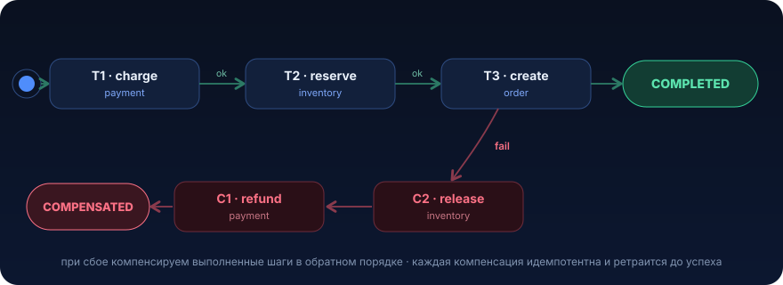

# Saga


Распределённая бизнес-операция затрагивает несколько сервисов с разными базами, и общего ACID у них нет. `@Transactional` над сетевыми вызовами это иллюзия: коммит в чужой системе уже случился, твой `rollback` его не отменит. Saga решает это явно: последовательность локальных транзакций, где при сбое выполненные шаги компенсируются обратными действиями

## Проблема

Оформление заказа в маркетплейсе. Один клик «Оплатить», а под капотом три разных сервиса, три разные базы:

1. `payment-service` списывает деньги с карты (внешний эквайринг)
2. `inventory-service` резервирует товар на складе
3. `order-service` создаёт заказ и шлёт событие в доставку

В монолите на одной базе это была бы одна `@Transactional`-обёртка: либо всё, либо ничего. Роллбэк за нас делает Postgres. Но у нас три отдельные базы (а платёж вообще чужой HTTP-сервис), и общего ACID нет. `@Transactional` над сетевыми вызовами не работает: коммит в чужой системе уже случился, откатить его твоим `rollback` невозможно.

Наивная реализация выглядит логично и проходит ревью:

```java
@Transactional // ⚠️ иллюзия атомарности: транзакция локальная, вызовы сетевые
public void placeOrder(OrderRequest req) {
    paymentClient.charge(req.userId(), req.amount());      // (1) деньги ушли
    inventoryClient.reserve(req.sku(), req.qty());         // (2) BOOM: нет на складе → 409
    orderRepository.save(new Order(req));                   // (3) не доехали
}
```

Что произошло в реальном инциденте: шаг (1) успешно списал 15 000 ₽ у клиента. Шаг (2) упал, товар за эти 200 мс раскупили, склад вернул `409 Conflict`. Исключение вылетело, локальная транзакция `order-service` откатилась, но деньги уже списаны в эквайринге. Никакой `rollback` их не вернёт, это была запись в чужой системе через HTTP.

Итог: клиент заплатил, заказа нет, товара нет. Поддержка, чарджбэк, репутационный ущерб. И это ещё «хороший» сценарий, с честной ошибкой. Хуже, когда шаг (2) отвалился по таймауту: ты не знаешь, зарезервирован товар или нет, и слепой ретрай сверху резервирует его дважды.

Корень проблемы: у распределённой бизнес-операции нет единой точки коммита или отката. Значит, откат нужно реализовать явно, как бизнес-действия, отменяющие уже сделанное. Это и есть Saga

## Что это и когда применять

Saga это способ выполнить бизнес-операцию из нескольких локальных транзакций в разных сервисах так, что при сбое на любом шаге ранее выполненные шаги компенсируются обратными действиями.

Ключевая идея: вместо одной большой ACID-транзакции последовательность из `T1, T2, ..., Tn`, у каждого шага `Ti` есть компенсирующая транзакция `Ci`, откатывающая его эффект на бизнес-уровне. Если `T3` упал, выполняем `C2, C1` в обратном порядке.

Важно: компенсация это не технический rollback. Это новое бизнес-действие. Нельзя «отменить» списание, можно сделать возврат (refund). Нельзя стереть отправленное письмо, можно послать «отмена заказа». Мир saga это eventual consistency, а не мгновенная согласованность: между «списали деньги» и «вернули деньги» есть окно, когда система несогласована, и это нормально, если бизнес это допускает.

Два стиля оркестрации:

- **оркестрация (orchestration)**, центральный координатор (saga orchestrator) знает весь сценарий, дёргает шаги и запускает компенсации. Логика в одном месте, легко трейсить, легко тестировать. Минус: координатор становится узлом, который надо не уронить
- **хореография (choreography)**, сервисы реагируют на события друг друга без центра. `payment` опубликовал `PaymentCompleted`, `inventory` подписан, резервирует, публикует `InventoryReserved`, и так далее. Слабая связность, но сценарий «размазан» по сервисам, тяжело понять поток целиком и легко словить циклы

Для 2–4 шагов с нетривиальными компенсациями почти всегда лучше оркестрация, её и разбираем.

### Когда НЕ нужно

- **всё в одной базе.** Если операция затрагивает несколько таблиц одной базы, это обычная `@Transactional`, и никакой saga не нужно. Saga это цена за отсутствие общего ACID, не плати её без нужды
- **операция читающая или идемпотентно-перезапускаемая.** Если шаг можно просто безопасно повторить до успеха (retry с backoff), компенсации не нужны
- **нет что компенсировать.** Если бизнес допускает «повисший» промежуточный статус и его подчистит фоновый reconciliation-джоб ([урок 11](11-reconciliation.md)), иногда это проще saga
- **шаги независимы и не требуют отката друг друга.** Тогда это просто набор задач, а не транзакция

Saga оправдана, когда шагов несколько, они в разных транзакционных доменах, частичное выполнение это реальный ущерб (деньги, товар, обязательства), и есть осмысленное обратное действие

## Как это работает

Оркестратор ведёт состояние saga в своей базе (это критично, без персистентного состояния saga не переживёт рестарт пода) и двигает её по шагам. Каждый шаг и каждая компенсация идемпотентны:

<p align="center">
  
</p>

Состояние saga в базе примерно такое:

```
saga_id | state              | current_step | payload
--------+--------------------+--------------+--------------------
  42    | STEP_2_RESERVING   | 2            | {userId, sku, ...}
  43    | COMPENSATING       | 2            | {...}
  44    | COMPLETED          | 3            | {...}
```

Ключевые механики, без которых saga разваливается:

1. **Идемпотентность каждого шага.** Оркестратор может упасть между «выполнил шаг» и «записал, что выполнил», и после рестарта повторит шаг. Значит `charge`, `reserve`, `refund` должны быть безопасны к повтору. Достигается idempotency key: клиент шага передаёт уникальный ключ (`sagaId + stepName`), сервис-получатель дедуплицирует по нему через уникальный индекс или `ON CONFLICT` ([урок 01](01-idempotency.md))
2. **Персистентное состояние плюс поллер/ретраи.** После каждого шага пишем прогресс в базу в той же локальной транзакции, что и результат шага (или через outbox). Фоновый процесс добивает «зависшие» saga: нашёл saga в `STEP_2_RESERVING` старше N секунд, продолжил с шага 2 (идемпотентность спасёт от двойного эффекта)
3. **Компенсации идут строго в обратном порядке** и тоже идемпотентны и ретраятся до успеха (компенсация не имеет права «сдаться», иначе деньги зависнут). Если компенсация принципиально не может выполниться, эскалация в алерт, saga в состоянии `COMPENSATION_FAILED`
4. **Семантика «отменяемости» шага.** Шаги делят на:
   - *compensatable*, можно откатить (резерв → release)
   - *pivot*, точка невозврата: после неё откат уже не делаем, идём только вперёд («товар физически отгружен»)
   - *retriable*, после pivot, такие только ретраятся вперёд до успеха

   Проектируя saga, располагай шаги так, чтобы все откатываемые шли до pivot, а всё «неоткатное и обязательное» после
5. **Таймауты и различение «упал» против «неизвестно».** Сетевой вызов может завершиться таймаутом, ты не знаешь, применился эффект или нет. Поэтому шаг спрашивает получателя по idempotency key («этот charge уже был?») либо просто ретраит идемпотентную операцию. Никогда не трактуй таймаут как гарантированный неуспех

## Пример на Java

Реалистичный оркестратор на Spring Boot плюс PostgreSQL. Покажу состояние saga в базе, идемпотентность шага через уникальный индекс плюс `ON CONFLICT`, выполнение с компенсациями, Resilience4j retry на сетевые вызовы, поллер для зависших saga.

### Схема БД

```sql
-- Состояние саги: переживает рестарт пода, основа для поллера
CREATE TABLE order_saga (
    saga_id      UUID PRIMARY KEY,
    state        TEXT        NOT NULL,          -- STARTED, RESERVING, COMPLETED, COMPENSATING, COMPENSATED, FAILED
    current_step INT         NOT NULL DEFAULT 0,
    payload      JSONB       NOT NULL,
    created_at   TIMESTAMPTZ NOT NULL DEFAULT now(),
    updated_at   TIMESTAMPTZ NOT NULL DEFAULT now()
);

-- Поллеру нужно быстро находить «зависшие» саги
CREATE INDEX order_saga_state_updated_at_idx
    ON order_saga (state, updated_at);

-- Журнал идемпотентности на стороне КАЖДОГО сервиса-получателя.
-- Уникальный индекс по ключу, физическая гарантия «ровно один раз».
CREATE TABLE processed_request (
    idempotency_key TEXT PRIMARY KEY,
    result          JSONB       NOT NULL,
    created_at      TIMESTAMPTZ NOT NULL DEFAULT now()
);
```

### Модель шага саги

```java
/**
 * Один шаг саги: прямое действие action() и компенсация compensate().
 * Оба ОБЯЗАНЫ быть идемпотентны, их могут вызвать повторно после рестарта.
 */
public interface SagaStep {
    String name();

    /** Прямое действие. Кидает исключение при бизнес- или сетевом сбое. */
    void action(SagaContext ctx);

    /** Компенсация. Должна быть безопасна к повтору и «мягкой» к «нечего откатывать». */
    void compensate(SagaContext ctx);
}
```

### Идемпотентная операция на стороне сервиса-получателя

Дедуп через уникальный индекс `processed_request.idempotency_key` плюс `ON CONFLICT`. Это и есть «physical exactly-once»: даже два параллельных ретрая не создадут два платежа.

```java
@Service
@RequiredArgsConstructor
public class PaymentService {

    private final JdbcTemplate jdbc;
    private final AcquiringClient acquiring; // внешний HTTP

    /**
     * Списание с дедупликацией по idempotencyKey.
     * Повторный вызов с тем же ключом вернёт прежний результат, не списав второй раз.
     */
    @Transactional
    public ChargeResult charge(String idempotencyKey, long userId, long amount) {
        // 1) Пытаемся «застолбить» ключ. Если он уже есть, второй charge не выполняем.
        int inserted = jdbc.update("""
            INSERT INTO processed_request (idempotency_key, result)
            VALUES (?, '{}'::jsonb)
            ON CONFLICT (idempotency_key) DO NOTHING
            """, idempotencyKey);

        if (inserted == 0) {
            // Ключ уже обработан, возвращаем сохранённый результат, деньги не трогаем.
            return readStoredResult(idempotencyKey);
        }

        // 2) Ключ наш, выполняем реальное списание.
        String providerTxnId = acquiring.charge(userId, amount); // внешний вызов

        // 3) Фиксируем результат под тем же ключом (в той же транзакции).
        jdbc.update("UPDATE processed_request SET result = ?::jsonb WHERE idempotency_key = ?",
            "{\"txnId\":\"" + providerTxnId + "\"}", idempotencyKey);

        return new ChargeResult(providerTxnId);
    }

    /** Компенсация: возврат. Тоже идемпотентен по ключу refund. */
    @Transactional
    public void refund(String idempotencyKey) {
        // ... аналогичный ON CONFLICT-паттерн для дедупа возврата
    }
}
```

### Оркестратор

```java
@Service
@RequiredArgsConstructor
@Slf4j
public class OrderSagaOrchestrator {

    private final OrderSagaRepository sagaRepo;
    private final List<SagaStep> steps; // [ChargeStep, ReserveStep, CreateOrderStep], порядок важен

    /**
     * Выполняет сагу. При сбое на шаге i запускает компенсации шагов i-1..0
     * в обратном порядке. Состояние пишется в БД после каждого перехода.
     */
    public void run(UUID sagaId, OrderRequest req) {
        var saga = sagaRepo.startOrLoad(sagaId, req); // идемпотентный старт: если saga уже есть, грузим

        int completed = saga.currentStep(); // с какого шага продолжать (после рестарта)
        try {
            for (int i = completed; i < steps.size(); i++) {
                SagaStep step = steps.get(i);
                log.info("saga {} → step {} ({})", sagaId, i, step.name());
                step.action(new SagaContext(sagaId, req));
                sagaRepo.markStepDone(sagaId, i + 1, "STEP_" + (i + 1)); // прогресс в БД
            }
            sagaRepo.markState(sagaId, "COMPLETED");
        } catch (Exception ex) {
            log.error("saga {} failed at step {} → compensating", sagaId, completed, ex);
            compensate(sagaId, req, sagaRepo.load(sagaId).currentStep() - 1);
        }
    }

    /** Компенсации строго в обратном порядке, каждая ретраится до успеха. */
    private void compensate(UUID sagaId, OrderRequest req, int fromStep) {
        sagaRepo.markState(sagaId, "COMPENSATING");
        for (int i = fromStep; i >= 0; i--) {
            SagaStep step = steps.get(i);
            try {
                step.compensate(new SagaContext(sagaId, req));
            } catch (Exception ex) {
                // Компенсация не имеет права «сдаться»: помечаем для поллера/алерта.
                log.error("saga {} compensation FAILED at step {}", sagaId, i, ex);
                sagaRepo.markState(sagaId, "COMPENSATION_FAILED");
                throw ex; // поллер добьёт позже
            }
        }
        sagaRepo.markState(sagaId, "COMPENSATED");
    }
}
```

### Шаг с Resilience4j retry на сетевом вызове

Сетевой вызов идемпотентный (по ключу), поэтому его безопасно ретраить. Retry с экспоненциальным backoff и jitter ([урок 03](03-backoff-jitter.md)).

```java
@Component
@RequiredArgsConstructor
public class ChargeStep implements SagaStep {

    private final PaymentClient paymentClient;

    @Override public String name() { return "charge-payment"; }

    @Override
    @Retry(name = "payment") // Resilience4j: ретраит только сетевые/5xx, см. конфиг ниже
    public void action(SagaContext ctx) {
        // Ключ детерминирован: sagaId + шаг. Ретрай пошлёт ТОТ ЖЕ ключ → дедуп на стороне payment.
        String idemKey = ctx.sagaId() + ":charge";
        paymentClient.charge(idemKey, ctx.req().userId(), ctx.req().amount());
    }

    @Override
    @Retry(name = "payment")
    public void compensate(SagaContext ctx) {
        String idemKey = ctx.sagaId() + ":refund";
        paymentClient.refund(idemKey); // возврат тоже идемпотентен
    }
}
```

```yaml
# application.yml, Resilience4j: ретраим только «повторяемые» ошибки, с jitter
resilience4j.retry:
  instances:
    payment:
      max-attempts: 4
      wait-duration: 200ms
      enable-exponential-backoff: true
      exponential-backoff-multiplier: 2
      enable-randomized-wait: true          # jitter против retry storm
      randomized-wait-factor: 0.5
      retry-exceptions:
        - java.io.IOException                # таймауты/сеть, ретраим
        - feign.RetryableException
      ignore-exceptions:
        - com.example.InsufficientFundsException  # бизнес-отказ, НЕ ретраим, сразу компенсация
```

### Поллер для зависших saga

Оркестратор может упасть в середине. Поллер находит saga, застрявшие в промежуточном состоянии, и добивает их, идемпотентность делает это безопасным.

```java
@Component
@RequiredArgsConstructor
@Slf4j
public class SagaRecoveryPoller {

    private final OrderSagaRepository sagaRepo;
    private final OrderSagaOrchestrator orchestrator;

    /** Каждые 30 c добираем «зависшие» саги старше 1 минуты. */
    @Scheduled(fixedDelay = 30_000)
    public void recoverStuck() {
        var stuck = sagaRepo.findStuck(
            List.of("STARTED", "STEP_1", "STEP_2", "COMPENSATING", "COMPENSATION_FAILED"),
            Duration.ofMinutes(1));

        stuck.forEach(saga -> {
            log.warn("recovering stuck saga {} in state {}", saga.sagaId(), saga.state());
            // run() продолжит с current_step; идемпотентность не даст задвоить эффект
            orchestrator.run(saga.sagaId(), saga.payload());
        });
    }
}
```

## Подводные камни

1. **Компенсация это бизнес-действие, а не rollback.** Нельзя «отменить» отправленное письмо или проведённую отгрузку. Проектируй компенсацию как реальную обратную операцию (refund, release, cancel-notification) и располагай неоткатные шаги после pivot-точки
2. **Ретрай неидемпотентной операции задваивает эффект.** Если `charge` не дедуплицирует по ключу, любой ретрай (Resilience4j, поллер, повтор Kafka) спишет деньги дважды. Idempotency key плюс уникальный индекс на стороне получателя обязателен, а не «желателен»
3. **Retry storm без jitter.** Упал платёжный провайдер, все поды одновременно ретраят по одинаковому расписанию и добивают его в момент восстановления. Всегда `enable-randomized-wait` плюс экспоненциальный backoff. И ретрай только повторяемые ошибки: бизнес-отказ (`InsufficientFunds`, `409 Conflict`) ретраить бессмысленно, это сразу компенсация
4. **Таймаут не равен неуспеху.** Вызов ушёл в таймаут, ты не знаешь, применился эффект или нет. Слепое «раз упало, компенсируем» может отменить успешно выполненный шаг, а «раз упало, повторяем» без идемпотентности задвоит. Ключ решает и это: повтор с тем же ключом либо доделает, либо вернёт прежний результат
5. **Компенсация, которая сама падает.** `refund` тоже ходит по сети и тоже может упасть. Компенсации нельзя «сдаваться»: ретраить до успеха, а при исчерпании состояние `COMPENSATION_FAILED`, алерт и ручной разбор. Иначе деньги зависнут молча
6. **Saga без персистентного состояния.** Если прогресс держать только в памяти оркестратора, рестарт пода в середине saga это потерянный откат и несогласованность навсегда. Состояние в базе, после каждого перехода, плюс поллер-recovery
7. **Поллер без индекса и без очистки.** `findStuck` по `state`/`updated_at` без индекса превратится в seq scan по растущей таблице. А `processed_request` без TTL распухнет, idempotency-журнал чистят фоновым джобом (окно дедупа должно покрывать максимальное время жизни ретраев, обычно часы-сутки)
8. **Слишком широкое окно несогласованности.** Между `charge` и `refund` клиент видит списание без заказа. Это допустимо, но окно надо мониторить (метрика «сколько saga висит в COMPENSATING» и алерт на возраст), растущее окно означает деградацию compensate-пути

## Практическая задача

> 🎯 Уровень: senior. Ожидаемое время: 5–6 часов с Testcontainers

**Система.** Сервис бронирования на Spring Boot. Эндпоинт `POST /bookings` бронирует тур: (1) списывает предоплату через внешний `payment-service` (HTTP), (2) резервирует место в отеле через `hotel-service` (HTTP, своя база), (3) создаёт бронь в своей базе. Общего ACID нет.

**Дано, сейчас ломается ровно из-за отсутствия saga:**

```java
@PostMapping("/bookings")
@Transactional // локальная транзакция, но вызовы сетевые
public BookingResponse book(@RequestBody BookingRequest req) {
    String txnId = paymentClient.charge(req.userId(), req.amount()); // (1)
    hotelClient.reserve(req.hotelId(), req.dates());                  // (2) может кинуть 409 «мест нет»
    Booking b = bookingRepo.save(new Booking(req, txnId));            // (3)
    return new BookingResponse(b.getId());
}
```

Прод-инциденты: на шаге (2) отель отдаёт `409` (деньги списаны, брони нет, возврата нет); клиент нажал «Оплатить» дважды (два списания, две брони); под рестартнулся между (1) и (2) (деньги списаны, дальше ничего).

**ТЗ.** Реализовать saga-оркестратор для этого сценария.

1. Три шага с компенсациями: `charge`↔`refund`, `reserve`↔`release`, `createBooking`↔`cancelBooking`. При сбое на любом шаге компенсировать выполненные в обратном порядке
2. Идемпотентность: `charge` и `reserve` дедуплицируют по `idempotencyKey` (детерминированный из `sagaId`+шаг) через уникальный индекс плюс `ON CONFLICT` на стороне получателя
3. Персистентное состояние saga в базе (таблица плюс индекс под поиск зависших)
4. Recovery-поллер, добивающий saga, застрявшие в промежуточном состоянии дольше N
5. Ретраи сетевых вызовов через Resilience4j: backoff плюс jitter, ретраить только сетевые/5xx, бизнес-`409` сразу в компенсацию, не ретраить

**Критерии приёмки** (проверь тестами, отметь галочками):

- [ ] сбой на шаге (2) `reserve` → списание компенсируется `refund`, saga в `COMPENSATED`, денег у клиента не осталось
- [ ] повторный `book` с тем же idempotency key не создаёт второй платёж и вторую бронь (в `payment` ровно одна запись, в `bookingRepo` одна бронь)
- [ ] рестарт между шагами (прогнать `orchestrator.run` дважды для одной `sagaId`) не задваивает эффект, итог тот же
- [ ] таймаут на `reserve` (`IOException`) → ретрай, при исчерпании попыток корректная компенсация
- [ ] падение компенсации `refund` → saga переходит в `COMPENSATION_FAILED`, поллер повторяет её позже

<details>
<summary>Подсказки (без готового решения)</summary>

- idempotency key строй детерминированно: `sagaId + ":" + stepName`. Тогда любой повтор (ретрай, поллер, двойной сабмит с тем же sagaId) попадёт в дедуп. sagaId генерируй на входе из бизнес-ключа запроса (хеш `userId+hotelId+dates`), чтобы двойной сабмит дал тот же sagaId
- дедуп на получателе: `INSERT ... ON CONFLICT (idempotency_key) DO NOTHING`, и если `inserted == 0`, вернуть сохранённый результат, не выполняя действие
- различай типы исключений: `retry-exceptions` (сеть) против `ignore-exceptions` (бизнес-409) в конфиге Resilience4j
- функциональный тест на Testcontainers (Postgres) плюс WireMock для `payment`/`hotel`, сбои эмулируй статусами WireMock (409, 500, задержка → таймаут)
- не забудь про очистку `processed_request` и индекс под поллер, иначе тест на «много saga» покажет деградацию

</details>

## Что почитать

- [microservices.io: Saga pattern](https://microservices.io/patterns/data/saga.html), каноническое описание оркестрации/хореографии, compensatable/pivot/retriable шагов
- [microservices.io: Transactional Outbox](https://microservices.io/patterns/data/transactional-outbox.html), как надёжно публиковать события saga без dual-write
- [Microsoft: Saga distributed transactions pattern](https://learn.microsoft.com/en-us/azure/architecture/reference-architectures/saga/saga), практический разбор с диаграммами состояний и trade-offs
- [Amazon Builders' Library: Timeouts, retries, and backoff with jitter](https://aws.amazon.com/builders-library/timeouts-retries-and-backoff-with-jitter/), почему нужен jitter и как не устроить retry storm

---

← [Реконциляция (11)](11-reconciliation.md) · [Обзор раздела](README.md) · [Кэширование и инвалидация (13) →](13-caching.md)
