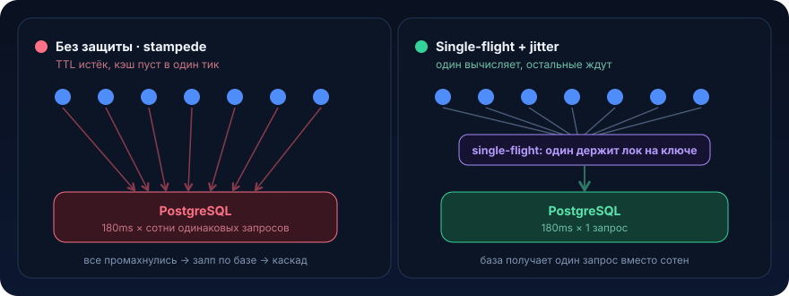

# Кэширование и инвалидация


Кэш это самый быстрый способ ускорить систему и самый быстрый способ её уронить. Между этими двумя исходами лежит понимание двух вещей: когда данные в кэше становятся ложью (stale) и что происходит в момент, когда кэш пустеет (stampede). Урок про обе

## Проблема

Есть эндпоинт витрины: `GET /catalog/{categoryId}` отдаёт список товаров категории с ценами, остатками и рейтингом. Запрос тяжёлый, джойн на пять таблиц, агрегаты, сортировка по релевантности. В базе он живёт ~180 мс. На главной категории «Смартфоны» его дёргают ~3000 раз в секунду.

Инженер делает очевидное, вешает кэш:

```java
@Service
public class CatalogService {

    private final CatalogRepository repository;
    private final Cache<Long, List<ProductView>> cache; // Caffeine, TTL = 60s

    public List<ProductView> getCategory(Long categoryId) {
        var cached = cache.getIfPresent(categoryId);
        if (cached != null) {
            return cached;
        }
        // промах, идём в базу
        var products = repository.loadCategoryHeavy(categoryId); // ~180 ms
        cache.put(categoryId, products);
        return products;
    }
}
```

Выглядит правильно. И 59 секунд из 60 работает прекрасно: 3000 rps обслуживаются из памяти за микросекунды, база отдыхает.

А на 60-й секунде TTL истекает. И вот что происходит буквально в один тик:

```
t = 60.000s   запись протухла, cache.getIfPresent() → null
t = 60.000s   поток #1: промах → SELECT ... (180 ms)
t = 60.001s   поток #2: промах (запись всё ещё не положена) → SELECT ...
t = 60.001s   поток #3: промах → SELECT ...
   ...
t = 60.180s   ~540 потоков успели промахнуться и уйти в базу,
              пока первый ещё не вернулся и не заполнил кэш
```

Это **cache stampede** (он же thundering herd, dogpile): пока первый запрос считает тяжёлый результат, кэш пуст, и все параллельные запросы честно промахиваются и дублируют ту же работу. Вместо одного `SELECT` база получает сотни одинаковых, в самый пик нагрузки. Пул коннектов (скажем, 20) мгновенно исчерпывается, запросы встают в очередь, latency подскакивает, healthcheck по таймауту помечает под нездоровым, оркестратор его перезапускает, и трафик переезжает на оставшиеся поды, где ровно та же протухшая запись протухает в ту же секунду. Каскад.

Вторая, тихая беда это **stale data**. Продавец обновил цену, но 60 секунд витрина отдаёт старую. Для рейтинга это терпимо, для цены это чек в корзине не сходится с чеком на карточке и тикет в поддержку. Наивный TTL-кэш ничего не знает про то, что данные изменились: он ждёт, пока истечёт таймер.

Итого две задачи, которые кэш ставит, но сам по себе не решает:

1. **инвалидация**, как гарантировать, что после изменения данных кэш не отдаёт ложь дольше, чем мы готовы терпеть
2. **защита от stampede**, как сделать, чтобы обновление кэша не превращалось в залп по базе

## Что это и когда применять

Кэш это сохранённая копия результата дорогой операции, которую мы отдаём вместо повторного вычисления. Работает на одном простом допущении: читают намного чаще, чем пишут, и небольшая устареваемость допустима. Если это допущение верно, кэш даёт порядки ускорения. Если неверно, кэш добавляет сложность, баги когерентности и ничего не ускоряет.

Что решает:

- снимает нагрузку с дорогого источника (база, внешний HTTP, тяжёлое вычисление)
- режет latency: память или Redis вместо джойнов и сетевых хопов
- сглаживает пики: источник видит поток промахов, а не поток запросов

### Когда НЕ нужно

- **данные меняются так же часто, как читаются.** Кэш с hit rate 5% это просто лишний слой, который ещё и врёт. Сначала измерь отношение чтений к записям
- **требуется строгая консистентность.** Баланс кошелька, остаток на складе в момент списания, статус платежа, здесь читать протухшую копию нельзя. Кэшируй производные и витринные данные, но не источник истины для транзакционных решений
- **кардинальность ключей огромна, а повторов почти нет.** Кэш по уникальному `requestId`, который больше никогда не встретится, это утечка памяти под видом оптимизации
- **дешёвый запрос.** Если операция стоит 2 мс и не нагружает источник, кэш добавит больше кода и риска рассинхрона, чем сэкономит
- **пока нет доказанной проблемы.** Кэш это отложенный источник багов когерентности. Не плати этой ценой авансом. Профилируй, найди реальный горячий запрос, кэшируй его

Практическое правило: кэш оправдан, когда `(частота чтений) × (стоимость промаха)` велика, а `(частота записей)` и `(цена устаревания)` малы

## Как это работает

### Базовый паттерн, cache-aside (lazy loading)

Приложение само управляет кэшем: на чтение сначала спрашивает кэш, при промахе идёт в источник и кладёт результат обратно. Альтернативы: read-through / write-through (кэш сам ходит в источник и синхронно пишет насквозь), write-behind (запись в кэш, асинхронный флаш в базу). Для сервисного бэкенда на практике почти всегда cache-aside, он прост и явен.

### Инвалидация: три честных стратегии

Инвалидация это ответ на вопрос «сколько времени я готов отдавать устаревшие данные». Три подхода, часто комбинируются:

1. **TTL (expiration).** Запись живёт фиксированное время, потом протухает. Просто, самоочищается, ограничивает окно устаревания сверху. Минус: не реагирует на изменения раньше срока и порождает stampede на момент истечения
2. **write-invalidate (событийная).** Тот, кто меняет данные, выкидывает ключ из кэша (или обновляет его). В распределённой системе через сообщение (Kafka-событие «товар изменён» → все инстансы делают `evict`). Даёт свежесть, но требует, чтобы все пути записи знали про кэш
3. **версионирование ключа.** В ключ зашивается версия или `updatedAt`: `product:42:v17`. Меняются данные, меняется ключ, старая запись просто перестаёт запрашиваться и вымывается по TTL. Отлично убирает гонки «evict против put»

TTL ставят почти всегда как страховочную сетку (даже при событийной инвалидации, на случай потерянного события). Событийную добавляют там, где устаревание дорого.

### Защита от stampede

<p align="center">
  
</p>

Четыре приёма, комбинируются:

1. **single-flight (request coalescing).** На один ключ в один момент ровно одно вычисление, остальные ждут его результат. В Caffeine это встроено в `LoadingCache.get`
2. **jitter к TTL.** Если тысяча ключей создана в одну секунду с TTL=60s, они и протухнут в одну секунду, синхронный залп. Разброс TTL (`60s ± random(0..10s)`) размазывает истечения по времени ([урок 03](03-backoff-jitter.md))
3. **early recompute / stale-while-revalidate.** Не ждать полного истечения: с ростом «возраста» записи один счастливчик асинхронно пересчитывает её в фоне, пока остальные ещё получают чуть-чёрствую, но валидную копию. Классика это алгоритм XFetch
4. **распределённый лок на пересчёт.** В нескольких инстансах single-flight внутри JVM не спасает, каждый инстанс промахнётся независимо. Лок в Redis (`SET lock:key NX PX 5000`) выбирает одного пересчитывающего на весь кластер, остальные ждут или отдают stale

Комбинация «single-flight плюс jitter плюс TTL как страховка» закрывает 90% случаев в одном инстансе. Redis-лок добавляют, когда инстансов много, а промах по источнику особенно дорог.

## Пример на Java

Возьмём тот самый каталог. Начнём с локального кэша Caffeine (одна JVM), затем покажем распределённый вариант.

### Локальный кэш: Caffeine плюс single-flight плюс jitter

```java
import com.github.benmanes.caffeine.cache.Caffeine;
import com.github.benmanes.caffeine.cache.LoadingCache;
import com.github.benmanes.caffeine.cache.Expiry;
import java.util.List;
import java.util.concurrent.ThreadLocalRandom;
import java.util.concurrent.TimeUnit;

@Service
public class CatalogService {

    private final CatalogRepository repository;
    private final LoadingCache<Long, List<ProductView>> cache;

    public CatalogService(CatalogRepository repository) {
        this.repository = repository;
        this.cache = Caffeine.newBuilder()
            .maximumSize(10_000)
            // единый source of truth загрузки; на один ключ один поток загрузки,
            // остальные конкурентные вызовы get() ЖДУТ его результат (single-flight)
            .build(this::loadWithJitter);
    }

    // LoadingCache.get() сам делает cache-aside + coalescing:
    // hit → отдаёт из памяти; miss → вызывает loader ровно один раз на ключ.
    public List<ProductView> getCategory(Long categoryId) {
        return cache.get(categoryId);
    }

    private List<ProductView> loadWithJitter(Long categoryId) {
        return repository.loadCategoryHeavy(categoryId);
    }

    // событийная инвалидация: вызывается из consumer'а Kafka-события
    // "категория изменилась" (см. ниже)
    public void invalidate(Long categoryId) {
        cache.invalidate(categoryId);
    }
}
```

Проблема наивного `expireAfterWrite(60s)` это синхронное истечение всех ключей. Управляем TTL индивидуально через `Expiry`, добавляя jitter:

```java
// Собираем кэш с per-entry TTL: базовые 60s ± до 10s разброса,
// чтобы записи не протухали синхронно и не создавали залп по базе.
this.cache = Caffeine.newBuilder()
    .maximumSize(10_000)
    .expireAfter(new Expiry<Long, List<ProductView>>() {
        @Override
        public long expireAfterCreate(Long key, List<ProductView> value, long currentTime) {
            long baseNanos = TimeUnit.SECONDS.toNanos(60);
            long jitterNanos = TimeUnit.SECONDS.toNanos(
                ThreadLocalRandom.current().nextInt(0, 11)); // 0..10s
            return baseNanos + jitterNanos;
        }
        @Override
        public long expireAfterUpdate(Long key, List<ProductView> value,
                                      long currentTime, long currentDuration) {
            return currentDuration; // при обновлении TTL не продлеваем
        }
        @Override
        public long expireAfterRead(Long key, List<ProductView> value,
                                    long currentTime, long currentDuration) {
            return currentDuration; // чтение TTL не двигает
        }
    })
    .build(this::loadWithJitter);
```

Событийная инвалидация, consumer, который слушает изменения и чистит кэш на своём инстансе:

```java
@Component
public class CategoryChangedListener {

    private final CatalogService catalogService;

    @KafkaListener(topics = "catalog_changed", groupId = "catalog-cache-invalidator")
    public void onCategoryChanged(CategoryChangedEvent event) {
        // выкидываем протухший ключ немедленно, не дожидаясь TTL;
        // следующий запрос перечитает свежие данные
        catalogService.invalidate(event.categoryId());
    }
}
```

> Важно: в consumer group каждый инстанс должен получить событие инвалидации на своём локальном кэше. Либо у каждого инстанса свой `groupId` (fan-out всем), либо инвалидация идёт в общий Redis. Общий `groupId` для чистки локальных кэшей это типичная ошибка: событие уйдёт только одному поду.

### Spring Cache-абстракция (декларативно)

Если не нужна тонкая настройка stampede-защиты, тот же cache-aside пишется аннотациями:

```java
@Service
public class CatalogService {

    @Cacheable(cacheNames = "catalog", key = "#categoryId", sync = true) // sync=true → single-flight
    public List<ProductView> getCategory(Long categoryId) {
        return repository.loadCategoryHeavy(categoryId);
    }

    @CacheEvict(cacheNames = "catalog", key = "#categoryId")
    public void invalidate(Long categoryId) {
        // тело пустое, важен сам факт evict по ключу
    }
}
```

`sync = true` включает coalescing (реализация зависит от провайдера, Caffeine поддерживает).

### Распределённый stampede-lock на Redis

Когда инстансов десятки, single-flight внутри JVM не спасает: каждый под промахнётся сам по себе и уйдёт в базу. Ставим лок на пересчёт в Redis, пересчитывает один на весь кластер, остальные ждут или отдают stale.

```java
@Service
public class DistributedCatalogService {

    private final StringRedisTemplate redis;
    private final CatalogRepository repository;
    private final ObjectMapper objectMapper;

    private static final Duration TTL = Duration.ofSeconds(60);
    private static final Duration LOCK_TTL = Duration.ofSeconds(5);

    public List<ProductView> getCategory(Long categoryId) throws Exception {
        String dataKey = "catalog:" + categoryId;
        String cached = redis.opsForValue().get(dataKey);
        if (cached != null) {
            return deserialize(cached); // hit
        }
        return loadUnderLock(categoryId, dataKey);
    }

    private List<ProductView> loadUnderLock(Long categoryId, String dataKey) throws Exception {
        String lockKey = "lock:" + dataKey;
        String token = UUID.randomUUID().toString();

        // SET lock NX PX 5000: атомарно захватываем право на пересчёт.
        // Только один инстанс во всём кластере получит true.
        Boolean acquired = redis.opsForValue()
            .setIfAbsent(lockKey, token, LOCK_TTL);

        if (Boolean.TRUE.equals(acquired)) {
            try {
                var products = repository.loadCategoryHeavy(categoryId); // единственный SELECT
                redis.opsForValue().set(dataKey, serialize(products), TTL);
                return products;
            } finally {
                releaseLock(lockKey, token); // снимаем лок только если он всё ещё наш
            }
        }

        // лок занят другим инстансом: коротко ждём и перечитываем кэш,
        // вместо того чтобы тоже долбить базу
        for (int i = 0; i < 20; i++) {
            Thread.sleep(50);
            String cached = redis.opsForValue().get(dataKey);
            if (cached != null) {
                return deserialize(cached);
            }
        }
        // fallback: пересчитавший не успел (упал/таймаут), считаем сами, чтобы не отдать ошибку
        return repository.loadCategoryHeavy(categoryId);
    }

    // снятие лока должно быть атомарным: проверить "мой ли токен" и удалить,
    // иначе рискуем снять чужой лок, взятый после истечения нашего TTL
    private void releaseLock(String lockKey, String token) {
        String lua = """
            if redis.call('get', KEYS[1]) == ARGV[1] then
                return redis.call('del', KEYS[1])
            else
                return 0
            end
            """;
        redis.execute(
            new DefaultRedisScript<>(lua, Long.class),
            List.of(lockKey), token);
    }

    private String serialize(List<ProductView> v) throws Exception {
        return objectMapper.writeValueAsString(v);
    }

    private List<ProductView> deserialize(String s) throws Exception {
        return objectMapper.readValue(s, new TypeReference<>() {});
    }
}
```

Ключевые места: `setIfAbsent(..., LOCK_TTL)` это `SET NX PX`, атомарный захват; снятие через Lua со сверкой токена, чтобы под, чей лок уже протух и перешёл к другому, не снял чужой; fallback-путь гарантирует, что падение «пересчитывающего» не превратится в 5xx для всех ждущих.

> В проде за этим стоит зрелая библиотека, Redisson (`RLock`, `RMapCache` с локальным near-cache и pub/sub-инвалидацией), а не самописный лок. Пример выше чтобы видеть механику, а не потому что его надо копировать в продакшн.

## Подводные камни

1. **TTL без jitter и single-flight даёт stampede.** Ровно та боль из «Проблемы». Даже идеальный hit rate 99.9% не спасает: те 0.1% приходятся на момент истечения и бьют залпом. Всегда: coalescing на пересчёт плюс разброс TTL
2. **Гонка «evict против put» при событийной инвалидации.** Поток A читает старое значение из базы (до коммита изменения), в это время прилетает событие и делает `evict`, затем A кладёт в кэш только что прочитанное старое значение, и оно живёт до TTL. Лечится версионированием ключа (`product:42:v17`) либо инвалидацией после коммита записи (не в той же транзакции, а по факту её завершения)
3. **Локальный кэш в N инстансах это N разных истин.** `@Cacheable` на Caffeine в каждом поде свой. Событие инвалидации с общим `groupId` получит только один под, остальные продолжат отдавать stale. Либо fan-out события каждому инстансу, либо общий Redis-кэш
4. **Кэширование ошибок и пустых ответов (negative caching).** Источник моргнул, вернул пустой список или бросил исключение, а ты это закэшировал на 60 секунд. Теперь валидные данные недоступны минуту после восстановления. Правило: не кэшировать исключения, для «легитимно пусто» короткий отдельный TTL
5. **Стохастическое устаревание под нагрузкой.** При `expireAfterAccess` (TTL продлевается на каждом чтении) горячий ключ может никогда не протухнуть и отдавать stale вечно. Для данных, которые должны освежаться, используй `expireAfterWrite`, а не `expireAfterAccess`
6. **Лок без атомарного снятия и без TTL.** Redis-лок, снимаемый простым `DEL` без сверки токена, снимает чужой лок, взятый после истечения твоего. Лок без `PX` это вечный дедлок, если держатель упал. Снятие только Lua со сверкой владельца, захват только с TTL
7. **Кэш как источник истины для транзакционных решений.** Списание остатка или баланса по значению из кэша это продажа того, чего нет. Кэш для чтения витрин, а решение об изменении состояния принимается по актуальному источнику (при необходимости под блокировкой строки или оптимистичной версией)
8. **Неограниченный размер и высококардинальные ключи.** Кэш без `maximumSize` по ключу-`requestId` это OOM, замаскированный под оптимизацию. Всегда ограничивай размер и настраивай вытеснение

## Практическая задача

> 🎯 Уровень: middle → senior. Ожидаемое время: 3–4 часа с Testcontainers

**Система.** Сервис профилей продавца. Эндпоинт `GET /sellers/{sellerId}/rating` отдаёт агрегированный рейтинг: средняя оценка, число заказов, процент отмен. Расчёт тяжёлый, агрегаты по таблице заказов за 90 дней (~200 мс). Сервис работает в **4 инстансах** за балансировщиком. Топовые продавцы получают ~1500 rps на этот эндпоинт. Рейтинг пересчитывается событием `seller_rating_updated` в Kafka (прилетает при закрытии/отмене заказа), устаревание рейтинга на минуту-две бизнес считает допустимым, на десять минут нет.

**Дано, текущий код, который ломается.** Наивный кэш без защиты, ровно как в начале урока:

```java
@Service
public class SellerRatingService {

    private final RatingRepository repository;
    private final Cache<Long, RatingView> cache =
        Caffeine.newBuilder()
            .expireAfterWrite(120, TimeUnit.SECONDS) // всё протухает синхронно
            .build();

    public RatingView getRating(Long sellerId) {
        var cached = cache.getIfPresent(sellerId);
        if (cached != null) {
            return cached;
        }
        var rating = repository.calculateRating(sellerId); // ~200 ms
        cache.put(sellerId, rating);
        return rating;
    }
    // события seller_rating_updated нигде не обрабатываются, данные stale до 120s
}
```

Что наблюдается в проде: каждые ~2 минуты по топовым продавцам latency прыгает с 3 мс до 1.5 с, в логах таймауты пула коннектов; после обновления рейтинга витрина ещё до двух минут показывает старое число (жалобы продавцов «отменил заказ, а процент отмен не изменился»).

**ТЗ.** Переделать кэш так, чтобы устранить и stampede, и излишний stale.

1. **Single-flight** на пересчёт, при промахе по горячему ключу в базу уходит один запрос, а не сотня
2. **Jitter к TTL**, записи не протухают синхронно
3. **Событийную инвалидацию**, consumer `seller_rating_updated` инвалидирует (или пере-загружает) ключ на всех 4 инстансах. Продумать доставку события каждому инстансу, а не одному
4. **TTL как страховку**, на случай потерянного события рейтинг всё равно освежается не позже, чем через ~2 минуты

**Критерии приёмки** (проверь тестами, отметь галочками):

- [ ] при 500 одновременных запросах на один «холодный» `sellerId` `repository.calculateRating` вызывается ровно один раз (счётчик или spy в функциональном тесте)
- [ ] после события `seller_rating_updated` для продавца X следующий запрос возвращает свежее значение на каждом инстансе, а не только на одном
- [ ] массовое истечение TTL не порождает синхронного залпа: интервал между истечениями соседних ключей ненулевой
- [ ] ни ошибка, ни пустой результат `calculateRating` не кэшируются на полный TTL

<details>
<summary>Подсказки (без готового решения)</summary>

- `LoadingCache.get` уже даёт coalescing внутри JVM, начни с него, не изобретай лок руками для одного инстанса
- для jitter это `Caffeine.expireAfter(Expiry)` с разбросом в `expireAfterCreate`
- для доставки события всем инстансам: либо уникальный `groupId` на инстанс (fan-out), либо вынести кэш в общий Redis и инвалидировать там. Взвесь: 4 локальных Caffeine дадут субмикросекундные чтения, но требуют fan-out инвалидации, общий Redis проще инвалидировать, но добавляет сетевой хоп
- инвалидацию делай по факту прихода события, убедись, что она не конфликтует с гонкой «читаю старое из базы → кладу поверх свежего evict» (пункт 2 из подводных камней), здесь помогает загрузка свежего значения в самом обработчике события, а не голый `evict`
- подумай, где здесь распределённый Redis-лок избыточен. Для 4 инстансов и допустимого stale в минуту он, возможно, лишняя сложность

</details>

## Что почитать

- [Caffeine Wiki](https://github.com/ben-manes/caffeine/wiki), про `Expiry`, `LoadingCache` (single-flight), `refreshAfterWrite` и eviction, де-факто стандарт локального кэша на JVM
- [Amazon Builders' Library: Caching challenges and strategies](https://aws.amazon.com/builders-library/caching-challenges-and-strategies/), thundering herd, negative caching, TTL jitter, локальный против внешнего кэша на боевом опыте AWS
- [Redis: Distributed Locks with Redlock](https://redis.io/docs/latest/develop/use-cases/patterns/distributed-locks/), корректный захват и снятие лока на пересчёт
- [Backoff и jitter](03-backoff-jitter.md) из этого раздела, тот же jitter, что размазывает истечения TTL

---

← [Saga (12)](12-saga.md) · [Обзор раздела](README.md) · [Claim и lease (14) →](14-claim-lease.md)
