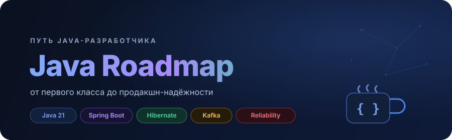
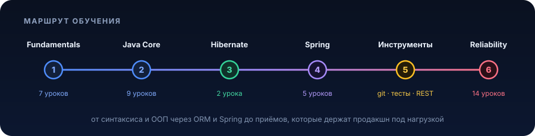

  

  
  
  
  
  

  <b>План изучения Java с нуля до уровня, на котором пишут и держат живой продакшн.</b> 
  Синтаксис и ООП → коллекции и потоки → ORM и Spring → приёмы надёжности, которые отличают инженера от джуна.

  <a href="https://roadmap.sh/r?id=65c9ad4bd789a518cf2f4cde">Визуальный roadmap на roadmap.sh</a>

  

<b>Как проходить</b>

 

- Идите по разделам сверху вниз, каждый следующий опирается на предыдущий
- Внутри урока: сначала теория и схема, потом код, потом практическая задача под конец
- Не пропускайте практику. Читать про `Stream API` и написать свой пайплайн это разные навыки
- Раздел «Надёжность» читайте после Spring, когда уже есть, на что накладывать эти приёмы
- Застряли, загляните в раздел [Подготовка к собеседованию](#interview), там частые вопросы с разбором

---

## Java Fundamentals

7 уроков · с нуля · синтаксис, конструкции, введение в ООП

1. [Введение в платформу Java](src/main/resources/java-core/1-java-fundamentals/lvl1/1-java-fundamentals-level-1.md)
2. [Основные конструкции](src/main/resources/java-core/1-java-fundamentals/lvl2/1-java-fundamentals-level-2.md)
3. [Практика](src/main/resources/java-core/1-java-fundamentals/lvl3/1-java-fundamentals-level-3.md)
4. [Крестики-нолики в процедурном стиле](src/main/resources/java-core/1-java-fundamentals/lvl4/1-java-fundamentals-level-4.md)
5. [Введение в ООП](src/main/resources/java-core/1-java-fundamentals/lvl5/1-java-fundamentals-level-5.md)
6. [Продвинутое ООП](src/main/resources/java-core/1-java-fundamentals/lvl6/1-java-fundamentals-level-6.md)
7. [Практика ООП и работа со строками](src/main/resources/java-core/1-java-fundamentals/lvl7/1-java-fundamentals-level-7.md)

## Java Core

9 уроков · middle · исключения, обобщения, коллекции, сеть, JDBC, Stream API

1. [Объектно-ориентированное программирование Java](src/main/resources/java-core/2-java-core/lvl1/2-java-core-level-1.md)
2. [Концепция обработки исключений](src/main/resources/java-core/2-java-core/lvl2/2-java-core-level-2.md)
3. [Обобщения](src/main/resources/java-core/2-java-core/lvl3/2-java-core-level-3.md)
4. [Виды коллекций](src/main/resources/java-core/2-java-core/lvl4/2-java-core-level-4.md)
5. [Средства ввода-вывода](src/main/resources/java-core/2-java-core/lvl5/2-java-core-level-5.md)
6. [Работа с сетью](src/main/resources/java-core/2-java-core/lvl6/2-java-core-level-6.md)
7. [Работа с JSON](src/main/resources/java-core/2-java-core/lvl7/2-java-core-level-7.md)
8. [JDBC](src/main/resources/java-core/2-java-core/lvl8/2-java-core-level-8.md)
9. [Java Stream API](src/main/resources/java-core/2-java-core/lvl9/2-java-core-level-9.md)

## Hibernate

2 урока · middle · ORM, маппинг, Criteria API

1. [Hibernate](src/main/resources/other/hibernate/hibernate.md)
2. [Hibernate Criteria](src/main/resources/other/hibernate/hibernate-criteria.md)

## Spring / Spring Boot

5 уроков · middle · IoC/DI, Boot, Data JPA, Security, Cloud

1. [Spring (Core, IoC/DI)](src/main/resources/other/spring/spring-core.md)
2. [Spring Boot 3](src/main/resources/other/spring/spring-boot.md)
3. [Spring Data JPA](src/main/resources/other/spring/spring-data.md)
4. [Spring Security](src/main/resources/other/spring/spring-security.md)
5. [Spring Cloud](src/main/resources/other/spring/spring-cloud.md)

## Инструменты и практики

паттерны, git, тесты, сборка, инфраструктура, архитектура, REST

1. [Порождающие шаблоны](src/main/resources/other/patterns/Creational-Patterns.md)
2. [Структурные паттерны](src/main/resources/other/patterns/Structural-Patterns.md)
3. [Поведенческие паттерны](src/main/resources/other/patterns/Behavioral-Patterns.md)
4. [GIT](src/main/resources/other/git/git.md)
5. [JUnit](src/main/resources/other/junit/junit.md)
6. [JUnit Mockito](src/main/resources/other/junit/junit-mockito.md)
7. [Maven](src/main/resources/other/maven/Maven.md)
8. [Инфраструктура](src/main/resources/other/infrastructure/infrastructure.md) &mdash; CI/CD · Docker · Kubernetes · Jenkins
9. [Архитектура](src/main/resources/other/architecture/architecture.md) &mdash; монолит · микросервисы · межсервисное взаимодействие · тестирование уровней
10. [REST API](src/main/resources/other/rest/rest.md)
11. Agile _(в разработке)_
12. Scrum _(в разработке)_

## Надёжность и архитектура

14 уроков · senior · приёмы, которые держат продакшн под нагрузкой

Продакшн ломается не на алгоритмах, а на сети, дублях, гонках и отказах. Каждый урок построен одинаково: проблема из реального продакшна → теория → механика → пример на Java → грабли → практическая задача под этот приём. [Обзор раздела со схемами](src/main/resources/other/reliability/README.md).

| # | Приём | О чём |
|---|-------|-------|
| 1 | [Идемпотентность](src/main/resources/other/reliability/01-idempotency.md) | повтор запроса не должен списывать деньги дважды |
| 2 | [Ретраи](src/main/resources/other/reliability/02-retries.md) | безопасно повторять при временных сбоях |
| 3 | [Backoff и jitter](src/main/resources/other/reliability/03-backoff-jitter.md) | не превратить ретраи в retry storm |
| 4 | [Rate limiting](src/main/resources/other/reliability/04-rate-limiting.md) | ограничить частоту, защитить от перегрузки |
| 5 | [Таймауты](src/main/resources/other/reliability/05-timeouts.md) | зависший вызов не должен держать поток вечно |
| 6 | [Circuit Breaker](src/main/resources/other/reliability/06-circuit-breaker.md) | fail fast вместо каскадного отказа |
| 7 | [Bulkhead](src/main/resources/other/reliability/07-bulkhead.md) | изолировать ресурсы по секциям |
| 8 | [Dead Letter Queue](src/main/resources/other/reliability/08-dead-letter-queue.md) | ядовитое сообщение не блокирует очередь |
| 9 | [Дедупликация](src/main/resources/other/reliability/09-deduplication.md) | at-least-once без двойной обработки |
| 10 | [Transactional Outbox](src/main/resources/other/reliability/10-transactional-outbox.md) | решение проблемы dual-write |
| 11 | [Реконциляция](src/main/resources/other/reliability/11-reconciliation.md) | фоновая сверка и починка расхождений |
| 12 | [Saga](src/main/resources/other/reliability/12-saga.md) | распределённые транзакции через компенсации |
| 13 | [Кэширование и инвалидация](src/main/resources/other/reliability/13-caching.md) | быстро, без stale и cache stampede |
| 14 | [Claim и lease](src/main/resources/other/reliability/14-claim-lease.md) | воркеры разбирают таблицу задач без долгих локов |

## Database

Подборка статей на Хабре, чтобы разобраться с индексами, изоляцией и планами запросов:

1. https://habr.com/p/794839/
2. https://habr.com/p/763648/
3. https://habr.com/p/779598/
4. https://habr.com/ru/company/yandex/blog/435880/
5. https://habr.com/ru/post/664028/
6. https://habr.com/ru/post/582698/
7. https://habr.com/ru/articles/469415/

## Interview

[Подготовка к собеседованию Java Dev](src/main/resources/interview/java-interview.md) &mdash; частые вопросы с разбором.

---

## Содействие

Нашли ошибку или знаете, как объяснить тему понятнее, заводите issue или присылайте pull request. Правки в текст, новые задачи и схемы приветствуются.

## Лицензия

Проект под лицензией MIT, подробности в файле [LICENSE](LICENSE).
