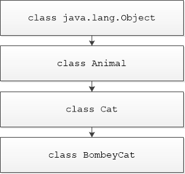

# Java Core 1

>
>[Что такое класс](#что-такое-класс)
>
>[Первый класс](#первый-класс)
>
>[Создание объектов](#создание-объектов)
>
>> [Подробное рассмотрение оператора new](#подробное-рассмотрение-оператора-new)
>
>[Конструкторы](#конструкторы)
>
>[Инкапсуляция](#инкапсуляция)
>
>[Дополнительные вопросы](#дополнительные-вопросы)
>
>[Основы наследования и полиморфизм](#основы-наследования-и-полиморфизм)
>
>[Класс Object](#класс-object)
>
>[Абстрактные классы и методы](#абстрактные-классы-и-методы)
>>
>> [Ключевое слово final в сочетании с наследованием](#ключевое-слово-final-в-сочетании-с-наследованием)
>
>[Интерфейсы](#интерфейсы)
>
>[Перечисления](#перечисления)
>>
>> [Конструкторы, методы, переменные экземпляра и перечисления](#конструкторы-методы-переменные-экземпляра-и-перечисления)
>
>[Внутренние и вложенные классы](#внутренние-и-вложенные-классы)
>
>[Практическое задание](#практическое-задание)
>
>[Дополнительные материалы](#дополнительные-материалы)
>
>[Используемая литература](#используемая-литература)
>

# Объектно-ориентированное программирование Java

Принципы ООП, классы, объекты, интерфейсы, перечисления, внутренние/вложенные/анонимные/локальные классы.

# Что такое класс

Класс определяет форму и сущность объекта и является логической конструкцией, на основе которой построен весь язык Java. Наиболее важная
особенность класса состоит в том, что он определяет новый тип данных, которым можно воспользоваться для создания объектов этого типа, т.е.
класс --- это шаблон (чертеж), по которому создаются объекты (экземпляры класса). Для определения формы и сущности класса указываются данные,
которые он должен содержать, а также код, воздействующий на эти данные.

Если мы хотим работать в нашем приложении с документами, то необходимо для начала объяснить, что такое документ, описать его в виде класса
(чертежа) Document. Рассказать какие у него должны быть свойства: название, содержание, количество страниц, информация о том, кем он
подписан и т.д. В этом же классе мы описываем что можно делать с документами: печатать в консоль, подписывать, изменять содержание,
название и т.д. Результатом такого описания и будет наш класс Document. Однако это по-прежнему всего лишь чертеж. Если нам нужны конкретные
документы, то необходимо создавать объекты: документ №1, документ №2, документ №3. Все эти документы будут иметь одну и ту же структуру
(название, содержание, ...), с ними можно выполнять одни и те же действия, НО наполнение будет разным (в первом документе содержится
приказ о назначении работника на должность, во втором, о выдаче премии отделу разработки и т.д.).

**Заметка.** Приведенный пример является абстрактным, и нет
необходимости говорить о том, что структура таких документов будет
совершенно разной.

Посмотрим на упрощенную форму объявления класса:

```
модификатор_доступа class имя_класса {
    модификатор_доступа тип_переменной имя_поля; // первое поле
    модификатор_доступа тип_переменной имя_поля; // второе поле
    // ...
    модификатор_доступа тип_переменной имя_поля; // n-е поле

    модификатор_доступа имя_коструктора(список_аргументов) {
        // ...
    }

    модификатор_доступа тип_метода имя_метода(список_аргументов) {
        // тело метода
    }
    // ...
    модификатор_доступа тип_метода имя_метода(список_аргументов) {
        // тело метода
    }
}
```

Пример класса User (пользователь):

```java
public class User {
    private int id;
    private String name;
    private String position;
    private int age;

    public User(int id, String name, String position, int age) {
        this.id = id;
        this.name = name;
        this.position = position;
        this.age = age;
    }

    public void info() {
        System.out.println("id: " + id + "; Имя пользователя: " + name + "; Должность: " + position + "; Возраст: " + age);
    }

    public void changePosition(String position) {
        this.position = position;
        System.out.println("Пользователь " + name + " получил новую должность: " + position);
    }
}
```

Как правило, переменные, объявленные в классе, описывают свойства
будущих объектов, а методы - их поведение. Например, в классе User
(пользователь) можно объявить переменные: int id, String name, String
position, int age; которые говорят о том, что у пользователя есть
идентификационный номер (id), имя (name), должность (position) и возраст
(age). Методы info() и changePosition(), объявленные в классе User,
означают что мы можем выводить информацию о нем в консоль (info) и
изменять его должность (changePosition).

Переменные, объявленные в классе, называются полями экземпляра, каждый
объект класса содержит собственные копии этих переменных, и изменение
значения поля у одного объекта никак не повлияет на это же поле другого
объекта.

**Важно!** Код должен содержаться либо в теле методов, либо в блоках
инициализации и не может "висеть в воздухе", как показано в следующем
примере.

```java
public class User {
    // ...

    public void info() {
        System.out.println("id: " + id + "; Имя пользователя: " + name + "; Должность: " + position + "; Возраст: " + age);
    }

    age++; // Ошибка
    System.out.println(age); // Ошибка

    public void changePosition(String position) {
        this.position = position;
        System.out.println("Пользователь " + name + " получил новую должность: " + position);
    }
}
```

Поля экземпляра и методы, определённые в классе, называются членами
класса. В большинстве классов действия над полями осуществляются через
его методы.

# Первый класс

Представим, что нам необходимо работать в нашем приложении с котами.
Java ничего не знает о том, что такое коты, поэтому нам необходимо
создать новый класс (тип данных), и объяснить, что же такое кот. Для
этого начнем прописывать класс Cat. Пусть у котов есть три свойства:
name (кличка), color (цвет) и age (возраст); и они пока ничего не умеют
делать.

```java
public class Cat {
    String name;
    String color;
    int age;
}

```

**Важно!** Имя класса должно совпадать с именем файла, в котором он
объявлен, т.е. класс Cat должен находиться в файле Cat.java

Итак, мы рассказали Java что такое коты, теперь если мы хотим создать в
нашем приложении кота, следует воспользоваться следующим оператором.

```java
Cat cat1 = new Cat();
```

Подробный разбор того, что происходит в этой строке, будет проведен в
следующем пункте. Пока же нам достаточно знать, что мы создали объект
типа Cat (экземпляр класса Cat), и для того, чтобы с ним работать,
положили его в переменную, которой присвоили имя cat1. На самом деле, в
переменной не лежит весь объект, а только ссылка где его искать в
памяти, но об этом позже.

Объект cat1 создан по "чертежу" Cat, и значит у него есть поля name,
color, age, с которыми можно работать (получать или изменять их
значения). Для доступа к полям объекта служит операция-точка, которая
связывает имя объекта с именем поля. Например, чтобы присвоить полю
color объекта cat1 значение "White", нужно выполнить следующий оператор:

```java
cat1.color ="Белый";
```

Операция-точка служит для доступа к полям и методам объекта по его
имени. Рассмотрим пример консольного приложения, работающего с объектами
класса Cat.

```java
public class CatDemoApp {
    public static void main(String[] args) {
        Cat cat1 = new Cat();
        Cat cat2 = new Cat();
        cat1.name = "Барсик";
        cat1.color = "Белый";
        cat1.age = 4;
        cat2.name = "Мурзик";
        cat2.color = "Черный";
        cat2.age = 6;
        System.out.println("Кот1 имя: " + cat1.name + " цвет: " + cat1.color + " возраст: " + cat1.age);
        System.out.println("Кот2 имя: " + cat2.name + " цвет: " + cat2.color + " возраст: " + cat2.age);
    }
}
```

Результат работы программы:

```
Кот1 имя: Барсик цвет: Белый возраст: 4
Кот2 имя: Мурзик цвет: Черный возраст: 6
```

Вначале мы создали два объекта типа Cat: cat1 и cat2, соответственно они
имеют одинаковый набор полей (name, color, age), однако каждому из них
мы в эти поля записали разные значения. Как видно из результатом печати
в консоле, изменение значения полей одного объекта, никак не влияет на
значения полей другого объекта. Данные объектов cat1 и cat2 изолированы
друг от друга.

# Создание объектов

Как создавать новые типы данных (классы) мы разобрались, мельком
посмотрели и как создаются объекты наших классов. Давайте теперь
поподробнее разберем как создавать объекты, и что при этом происходит.

Создание объекта проходит в два этапа. Сначала создается переменная,
имеющая интересующий нас тип (в данном случае Cat), в нее мы сможем
записать ссылку на будущий объект (поэтому при работе с классами и
объектами мы говорим о ссылочных типах данных). Затем необходимо
выделить память под наш объект, создать и положить объект в выделенную
часть памяти, и сохранить ссылку на этот объект в памяти в нашу
переменную.

**Заметка.** Область памяти, в которой создаются и хранятся объекты, называется кучей (heap).

Для непосредственного создания объекта применяется оператор new, который
резервирует память под объект и возвращает ссылку на него, в общих
чертах эта ссылка представляет собой адрес объекта в памяти,
зарезервированной оператором new.

```java
public static void main(String[] args) {
    Cat cat1;
    cat1 = new Cat();
}
```

В первой строке кода переменная cat1 объявляется как ссылка на объект
типа Cat и пока ещё не ссылается на конкретный объект (первоначально
значение переменной cat1 равно null). В следующей строке выделяется
память для объекта типа Cat, и в переменную cat1 сохраняется ссылка на
него. После выполнения второй строки кода переменную cat1 можно
использовать так, как если бы она была объектом типа Cat. Обычно новый
объект создается в одну строку (*Cat cat1 = new Cat()*), вместо двух
строк из листинга выше.

### Подробное рассмотрение оператора new

Оператор new динамически выделяет память для нового объекта, общая форма
применения этого оператора имеет следующий вид:

```
Имя_класса имя_переменной = new Имя_класса();
```

Имя_класса() в правой части выполняет вызов конструктора данного класса,
который позволяет подготовить наш объект к работе.

Рассмотрим еще один пример, в котором создаются новые объекты.

```java
public static void main(String[] args) {
    Cat cat1 = new Cat();
    Cat cat2 = cat1;
}
```

На первый взгляд может показаться, что переменной cat2 присваивается
ссылка на копию объекта cat1, т.е. переменные cat1 и cat2 будут
ссылаться на разные объекты в памяти. **Но это не так**. На самом деле
cat1 и cat2 будут ссылаться на один и тот же объект. Присваивание
переменной cat1 значения переменной cat2 не привело к выделению области
памяти или копированию объекта, лишь к тому, что переменная cat2
ссылается на тот же объект, что и переменная cat1.


Таким образом, любые изменения, внесённые в объекте по ссылке cat2,
окажут влияние на объект, на который ссылается переменная cat1,
поскольку это один и тот же объект в памяти.

# Конструкторы

Давайте еще раз взглянем на один из предыдущих примеров.

```java
public class CatDemoApp {
    public static void main(String[] args) {
        Cat cat1 = new Cat();
        cat1.name = "Барсик";
        cat1.color = "Белый";
        cat1.age = 4;
        System.out.println("Кот1 имя: " + cat1.name + " цвет: " + cat1.color + " возраст: " + cat1.age);
    }
}
```

Чтобы создать объект мы тратим одну строку кода (*Cat cat1 = new
Cat()*). Поля этого объекта заполнятся автоматически значениями
по-умолчанию (целочисленные - 0, логические - false, ссылочные - null и
т.д.). Нам бы хотелось дать коту какое-то имя, указать его возраст и
цвет, поэтому мы прописываем еще три строки кода. В таком подходе есть
несколько недостатков: во-первых, мы напрямую обращаемся к полям объекта
(чего не стоит делать, в соответствии с принципами инкапсуляции, о
которых речь пойдет чуть позже), а во-вторых, если полей у класса будет
намного больше, то для создания всего лишь одного объекта будет уходить
10-20+ строк кода, что очень неудобно. Было бы неплохо иметь возможность
сразу при создании объекта указывать значения его полей.

Для инициализации объектов при создании в Java предназначены
**конструкторы**. Имя конструктора обязательно должно совпадать с именем
класса, а синтаксис аналогичен синтаксису метода. Если создать
конструктор класса Cat как показано ниже, он автоматически будет
вызываться при создании объекта.

```java
public class Cat {
    private String name;
    private String color;
    private int age;

    public Cat() {
        System.out.println("Это конструктор класса Cat");
        name = "Барсик";
        color = "Белый";
        age = 2;
    }
}

public class MainClass {
    public static void main(String[] args) {
        Cat cat1 = new Cat();
    }
}
```

Теперь, при создании объектов класса Cat, все коты будут иметь
одинаковые имена, цвет и возраст (а именно, белый двухлетний Барсик).

**Заметка.** Еще раз обращаем внимание, что в строке Cat cat1 = **new**
**[Cat()]{.underline}**; подчеркнутая часть кода и есть вызов
конструктора класса Cat.

**Важно!** У классов **всегда** есть конструктор. Даже если вы не пропишите свою реализацию конструктора, то Java автоматически создаст
пустой конструктор по-умолчанию. Для класса Cat, он будет выглядеть так:

```
public Cat() {

}
```

## Параметризованные конструкторы

При использовании конструктора из предыдущего примера, все созданные
коты будут одинаковыми, пока мы вручную не поменяем значения их полей.
Чтобы можно было указывать начальные значения полей наших объектов
необходимо создать параметризованный конструктор.

**Важная заметка!** В приведенном ниже примере, в аргументах
конструктора используется нижнее подчеркивание \_, это сделано для
упрощения понимания логики заполнения полей объекта. И в будущем будет
заменено на более корректное использование ключевого слова this.

```java
public class Cat {
    private String name;
    private String color;
    private int age;

    public Cat(String _name, String _color, int _age) {
        name = _name;
        color = _color;
        age = _age;
    }
}
```

При такой форме конструктора, когда мы будем создавать кота, необходимо
будет обязательно указать его имя, цвет и возраст. Набор полей, которые
будут заполнены через конструктор, вы определяете сами, то есть вы не
обязаны все поля, которые есть в классе записывать в аргументы
конструктора.

```java
public static void main(String[] args) {
    Cat cat1 = new Cat("Барсик", "Коричневый", 4);
    Cat cat2 = new Cat("Мурзик", "Белый", 5);
}
```

Наборы значение (Барсик, Коричневый, 4) и (Мурзик, Белый, 5) будут
переданы в качестве аргументов конструктора (\_name, \_color, \_age), а
конструктор запишет полученные значения в поля объект (name, color,
age). То есть начальные значения полей каждого из объектов будет
определяться тем, что мы передадим ему в конструкторе. Как видите,
теперь нам нет необходимости обращаться напрямую к полям объектов, и мы
в одну строку можем проинициализировать наш новый объект.

## Ключевое слово this

Иногда требуется, чтобы метод ссылался на вызвавший его объект. Для этой
цели в Java определено ключевое слово this. Им можно пользоваться в теле
любого нестатического метода для ссылки на текущий объект, т.е. объект у
которого был вызван этот метод.

Очень часто ключевое слово this применяется в конструкторах класса.
Представьте что поле класса называется name и аргумент конструктора тоже
имеет имя name. Как в таком случае внутри тела конструктора отличить
поле класса от аргумента. В этом как раз и помогает ключевое слово this.
**this.name** - это ссылка на поле объекта для которого вызывается
конструктор, а просто **name** ссылка на аргумент конструктора.

```java
public class Cat {
    private String name; // <- this.name указывает сюда
    private String color;
    private int age;

    public Cat(String name, String color, int age) { // <- а name один из аргументов конструктора
        this.name = name;
        this.color = color;
        this.age = age;
    }
}
```

Эта версия конструктора действует точно так же, как и предыдущая.
Ключевое слово this применяется в данном случае для того, чтобы отличить
аргумент конструктора от поля объекта.

Для еще одного случая применения ключевого слова this давайте посмотрим
на следующий код.

```java
public static void main(String[] args) {
    Cat cat1 = new Cat();
    Cat cat2 = new Cat();
    Cat[] cats = new Cat[2];
    cat1.putMeInArray(cats, 0);
    cat2.putMeInArray(cats, 1);
}
```

Допустим у нас есть несколько объектов типа Cat, и пустой массив такого
же типа. Представим себе немного абстрактную задачу, при которой кот
должен с помощью метода

putMeInArray(Cat\[\] cats, int arrayIndex)

положить себя в ячейку массива Cat\[\] cats на позицию arrayIndex.
Понятно что мы можем написать cats\[0\] = cat1 и cats\[1\] = cat2, но в
данном случае мы хотим, чтобы коты сами себя закидывали в массив. В
таком случае, реализация метода putMeInArray() будет выглядеть вот так:

```java
public class Cat {
    // ...
    public void putMeInArray(Cat[] cats, int arrayIndex) {
        cats[arrayIndex] = this;
    }
    // ...
}
```

При выполнении cat1.putMeInArray() ключевое слово **this** укажет на
объект cat1, при cat2.putMeInArray() - на объект cat2. То есть this
указывает на объект у которого мы вызвали метод putMeInArray().

## Перегрузка конструкторов

Наряду с перегрузкой обычных методов возможна перегрузка и
конструкторов. Мы можем как не объявлять ни одного конструктора, так и
объявить их несколько. Также как и при перегрузке методов, имеет
значение набор аргументов, не может быть нескольких конструкторов с
одним и тем же набором аргументов.

```java
public class Cat {
    private String name;
    private String color;
    private int age;

    public Cat(String name, String color, int age) {
        this.name = name;
        this.color = color;
        this.age = age;
    }

    public Cat(String name) {
        this.name = name;
        this.color = "Неизвестно";
        this.age = 1;
    }
}
```

**Важно!** Как только вы создали в классе свою реализацию
конструктора, конструктор по-умолчанию автоматически создаваться не
будет. И если вам понадобится такая форма конструктора (в которой нет
аргументов, и которая ничего не делает), необходимо будет конструктор
по-умолчанию вручную.

```java
public Cat() {

}
```

В этом случае допустимы будут следующие варианты создания объектов:

```java
public static void main(String[] args) {
    // Cat cat1 = new Cat(); этот конструктор больше не работает
    Cat cat2 = new Cat("Барсик");
    Cat cat3 = new Cat("Мурзик", "Белый", 5);
}
```

Соответствующий перегружаемый конструктор вызывается в зависимости от
аргументов, указываемых при выполнении оператора new.

**Важно!** Не лишним будет напомнить что у классов **всегда** есть
конструктор, даже если вы не пропишите свою реализацию конструктора.

# Инкапсуляция

Инкапсуляция связывает данные с манипулирующим ими кодом и позволяет
управлять доступом к членам класса из отдельных частей программы,
предоставляя доступ только с помощью определенного ряда методов, что
позволяет предотвратить злоупотребление этими данными.

То есть класс должен представлять собой «черный ящик», которым можно
пользоваться, но его внутренний механизм защищен от повреждений.

Способ доступа к члену класса определяется модификатором доступа,
присутствующим в его объявлении. Некоторые аспекты управления доступом
связаны, главным образом, с наследованием и пакетами, и будут
рассмотрены позднее. В Java определяются следующие модификаторы доступа:
public, private и protected, а также уровень доступа, предоставляемый по
умолчанию. То есть если ни один из трех модификаторов явно не указан в
том месте, где ожидается модификатор, это означает, что применяется
модификатор по умолчанию.

Любой **public** член класса доступен из любой части программы.
Компонент, объявленный как **private**, доступен только внутри класса, в
котором объявлен. Если в объявлении члена класса отсутствует явно
указанный модификатор доступа (**default**), то он доступен для
подклассов и других классов из данного пакета. Если же требуется, чтобы
элемент был доступен за пределами его текущего пакета, но только
классам, непосредственно производным от данного класса, то такой элемент
должен быть объявлен как **protected**.

Модификатор доступа предшествует остальной спецификации типа члена.

```java
public int num;
protected char symb;
boolean active;

private void calculate(float x1, float x2) {
    // ...
}
```

Инкапсуляция говорит о том, что доступ к данным объекта должен
осуществляться только через методы. Если поле экземпляра открыто для
изменения напрямую присваиванием через точку, то на такое нарушение
инкапсуляции должны иметься веские основания. Таким образом, для доступа
к данным обычно используются методы доступа, определённые в классе этого
объекта: геттеры и сеттеры. Они позволяют полностью контролировать
процесс установки и получения значений

Геттер позволяет узнать содержимое поля, его тип совпадает с типом поля
для которого он создан, а имя, как правило, начинается со слова get, к
которому добавляется имя поля.

Сеттер используется для изменения значения поля, имеет тип void и
именуется по аналогии с геттером, только get заменяется на set. Сеттер
позволяет добавлять ограничения на изменение полей --- в примере ниже с
помощью сеттера не получится указать коту отрицательный или нулевой
возраст.

```java
public class Cat {
    private String name;
    private int age;

    public void setAge(int age) {
        if (age >= 0) {
            this.age = age;
        } else {
            System.out.println("Введен некорректный возраст");
        }
    }

    public int getAge() {
        return age;
    }

    public void setName(String name) {
        this.name = name;
    }

    public String getName() {
        return name;
    }
}
```

**Заметка.** Если для приватного поля создан только геттер, то вне
класса это поле будет доступно только для чтения. Если ни создан ни
геттер, ни сеттер, то работа с полем снаружи класса может
осуществляться только косвенно, через другие методы этого класса.
(Пусть в классе Cat есть поле вес, оно private и для него нет геттеров
и сеттеров. Тогда мы не можем через сеттер изменить вес кота напрямую,
но если мы его покормим, то кот может сам набрать вес. Мы не можем
запросить вес через геттер и получить конкретное значение, но у кота
может быть метод info(), который выведет в консоль нам величину,
записанную в поле weight.

Особенности всех уровней доступа в языке Java сведены в таблицу:

| Модификатор                                                                             | private | Модификатор отсутствует | protected | public |
|-----------------------------------------------------------------------------------------|---------|-------------------------|-----------|--------|
| Один и тот же класс                                                                     | +       | +                       | +         | +      |
| Подкласс, производный от класса из того же самого пакета                                | -       | +                       | +         | +      |
| Класс из того же самого пакета, не являющийся подклассом                                | -       | +                       | +         | +      |
| Подкласс, производный от класса другого пакета                                          | -       | -                       | +         | +      |
| Класс из другого пакета, не являющийся подклассом, производный от класса данного пакета | -       | -                       | -         | +      |

# Дополнительные вопросы

**Сборка «мусора».** Поскольку выделение памяти под объекты
осуществляется динамически с помощью оператора new, в процессе
выполнения программы необходимо периодически удалять объекты из памяти
для ее очистки, иначе она может и закончиться. В Java освобождение
оперативной памяти осуществляется автоматически и называется сборкой
«мусора». При отсутствии любых ссылок на объект считается, что он больше
не нужен, и занимаемую им память можно освободить. Во время выполнения
программы сборка «мусора» выполняется с некоторой периодичностью и не
будет выполняться немедленно, как только один или несколько объектов
больше не используются.

**Ключевое слово static.** Иногда возникает необходимость создать поле
класса, общее для всех объектов этого класса, или метод, который можно
было бы использовать без необходимости создания объектов класса, в
котором он прописан. Обращение к такому полю или методу должно
осуществляться через имя класса. Для этого при объявлении поля или
метода указывается ключевое слово static. Когда член класса объявлен как
static (статический), он доступен до создания любых объектов его класса
и без ссылки на конкретный объект. Наиболее распространенным примером
статического члена служит метод main(). При создании объектов класса
копии статических полей не создаются и все объекты этого класса
используют одно и то же статическое поле.

На методы, объявленные как static, накладываются следующие ограничения:

1. Они могут непосредственно вызывать только другие статические методы.
2. Им непосредственно доступны только статические переменные.
3. Они никоим образом не могут использовать ссылки типа this или super.

Все эти пункты являются следствием того, что static метод не связан ни с
одним из объектов.

# Основы наследования и полиморфизм

Одним из основополагающих принципов ООП является наследование, который
позволяет создать класс (суперкласс), определяющий какие-то общие черты
набора классов, а затем этот общий класс может наследоваться другими,
более специализированными классами (подклассами), каждый из которых
будет добавлять свои особые характеристики. Подкласс наследует члены,
определённые в суперклассе, добавляя к ним собственные.

**Важно!** Подкласс будет наследовать члены, определённые в
суперклассе, в соответствии с модификаторами доступа этих членов. Если
у суперкласса будет private поле, то подкласс не унаследует это поле.

Для реализации наследования используется ключевое слово extends в
следующей форме:

```
class имя_подкласса extends имя_суперкласса
```

Представим, что в нашем приложении нам придется работать с различными
животными (считаем что они домашние), у всех этих животных должна быть
кличка (name), и все они должны уметь прыгать. Если представить, что нам
нужно штук 10 разных классов животных, то поле name и метод jump() надо
будет в каждом из них прописывать, тем самым дублируя один и тот же код
(а если одинаковых полей и методов больше?). Вместо дублирования кода,
мы можем создать суперкласс Animal, в котором и описать эти общие для
всех подклассов черты. После чего создавать подклассы и наследоваться от
класса Animal. В приведенном ниже примере представлена только структура
Animal и Cat классов, можно мысленно представить что помимо Cat у нас
еще есть Dog, Hamster, и т.д.

```java
public class Animal {
    String name;

    public Animal() {
    }

    public Animal(String name) {
        this.name = name;
    }

    public void animalInfo() {
        System.out.println("Животное: " + name);
    }

    public void jump() {
        System.out.println("Животное подпрыгнуло");
    }
}

public class Cat extends Animal {
    String color;

    public Cat(String name, String color) {
        this.name = name;
        this.color = color;
    }

    public void catInfo() {
        System.out.println("Кот имя: " + name + " цвет: " + color);
    }
}

public class AnimalsApp {
    public static void main(String[] args) {
        Animal animal = new Animal("Дружок");
        Cat cat = new Cat("Барсик", "Белый");
        animal.animalInfo();
        cat.animalInfo();
        cat.catInfo();
    }
}

// Результат:
// Животное: Дружок
// Животное: Барсик
// Кот имя: Барсик цвет: Белый
```

**Заметка.** В приведенном примере специально оставлены конструктор
по-умолчанию для класса Animal и методы animalInfo() и catInfo(). Эти
части кода в дальнейшем немного оптимизируются, как только мы
разберемся в соответствующих темах.

Подкласс Cat включает в себя все члены своего суперкласса Аnimal. Именно
поэтому объект cat имеет доступ к методу animalInfo(), и в методе
catInfo() возможна непосредственная ссылка на переменную color, как если
бы она была частью класса Cat.

В свою очередь у кота появилось такое свойство как цвет (color) и метод
catInfo(), которых нет в суперклассе Animal.

Несмотря на то что класс Аnimal является суперклассом для класса Cat, он
в то же время остается полностью независимым и самостоятельным классом.
То, что один класс является суперклассом для другого, совсем не
исключает возможность его самостоятельного использования.

**Важно!** Для каждого создаваемого класса можно указать только один
суперкласс --- в Java не поддерживается множественное наследование.
Если суперкласс не указан явно, то класс наследуется от класса
java.lang.Object (в приведенном выше примере, класс Animal является
подклассом суперкласса Object)

Более того, один подкласс может быть суперклассом другого подкласса.



**Важно!** Абсолютно все классы в Java являются прямыми или косвенными
наследниками класса Object (из пакета java.lang). Cat является
подклассом Animal, а Animal подкласс Object, следовательно Cat тоже
подкласс Object.

## Ключевое слово super

Ключевое слово super означает обращение к суперклассу. У ключевого слова
super имеются две общие формы. Первая служит для вызова конструктора
суперкласса, вторая --- для обращения к члену суперкласса, скрываемому
членом подкласса.

Из подкласса можно вызывать конструктор, определенный в его суперклассе,
используя следующую форму ключевого слова super:

```
super(список_аргументов)
```

Здесь список_аргументов определяет аргументы, требующиеся конструктору
суперкласса.

**Важно!** Если необходимо вызвать конструктор суперкласса через
super(), то этот вызов должен быть первым оператором, выполняемым в
конструкторе подкласса. Стоит отметить, что если мы этого не сделаем,
то Java сама первой строкой в конструкторе подкласса будет осуществлять
вызов конструктора по умолчанию из суперкласса.

Такая конструкция позволяет заполнять даже поля суперкласса с
модификатором доступа private. Например:

```java
public class Animal {
    private int a;
    protected int z;

    public Animal(int a) {
        this.a = a;
    }
}

public class Cat extends Animal {
    private int b;
    protected int z;

    public Cat(int a, int b) {
        super(a);        // первым делом вызываем конструктор Animal
        this.b = b;
    }

    public void test() {
        z = 10;          // Обращение к полю z класса Cat
        super.z = 20;    // Обращение к полю z класса Animal
    }
}

public class BombeyCat extends Cat {
    private int c;

    public BombeyCat(int a, int b, int c) {
        super(a, b);    // первым делом вызываем конструктор Cat
        this.c = c;
    }
}
```

Вторая форма применения ключевого слова super действует подобно
ключевому слову this, за исключением того, что ссылка указывает на
суперкласс. Вторая форма наиболее пригодна в тех случаях, когда имена
членов подкласса скрывают члены суперкласса с такими же именами, в
примере выше поле z класса Cat скрывает поле z суперкласса, поэтому для
доступа к полю суперкласса используется запись super.z. То же
справедливо и для методов.

**Важно!** Если вы только начинаете программировать, то КРАЙНЕ НЕ
РЕКОМЕНДУЕТСЯ объявлять поля с одинаковыми именами в суперклассе и его
подклассах, потому как очень легко будет запутаться с каким из полей вы
работаете. Такое объявление переменных имеет только если вы без этого
никак не можете обойтись, и абсолютно четко понимаете что делаете.

### Порядок вызова конструкторов

При вызове конструктора BombeyCat будут по цепочке вызваны конструкторы
родительских классов, начиная с самого первого класса.

```java
BombeyCat bombeyCat = new BombeyCat();
// Animal() => Cat() => BombeyCat()
```

Конструкторы вызываются в порядке наследования, поскольку суперклассу
ничего неизвестно о своих подклассах, и поэтому любая инициализация
должна быть выполнена в нём совершенно независимо от любой
инициализации, выполняемой подклассом. Следовательно, она должна
выполняться в первую очередь.

## Переопределение методов

Если у супер- и подкласса совпадают сигнатуры методов, то говорят, что
метод из подкласса переопределяет метод из суперкласса. Когда
переопределённый метод вызывается из своего подкласса, он всегда
ссылается на свой вариант, определённый в подклассе. А вариант метода,
определённого в суперклассе, будет скрыт.

Пусть любое животное в нашем приложении должно уметь подавать голос,
по-умолчанию при вызове метода voice() мы будем видеть стандартное
сообщение, что животное издало какой-то звук. Для тех же классов,
которые издают вполне конкретные звуки, мы можем переопределить метод
voice(), и например, конкретизировать что Cat именно мяукает, а не
что-то еще делает.

```java
public class Animal {
    void voice() {
        System.out.println("Животное издало какой-то звук");
    }
}

public class Dog extends Animal {
}

public class Cat extends Animal {
    @Override
    void voice() {
        System.out.println("Кот мяукнул");
    }
}

public class AnimalsApp {
    public static void main(String[] args) {
        Animal animal = new Animal();
        Cat cat = new Cat();
        Dog dog = new Dog();
        animal.voice();
        cat.voice();
        dog.voice();
    }
}

// Результат:
// Животное издало звук
// Кот мяукнул
// Животное издало звук
```

Когда метод voice() вызывает объект типа Cat, выбирается вариант этого
метода, определённый в классе Cat. У объекта же класса Dog своей
реализации метода voice() не было, поэтому dog выполнил вариант метода
voice(), который описан в суперклассе Animal.

**Важно!** Над методами подклассов, переопределяющими методы
суперклассов, можно ставить аннотацию *\@Override*, но она не является
обязательной. Она всего лишь проверит, действительно ли в родительском
классе есть такой метод, который вы собрались переопределять.

Если при переопределении метода необходим функционал из этого метода
суперкласса, то можно использовать конструкцию *super.method()*. Пример
и результат использования:

```java
public class Cat extends Animal {
    @Override
    public void voice() {
        super.voice(); // вызываем метод voice() суперкласса
        System.out.println("Кот мяукнул");
    }
}

public class CatsApp {
    public static void main(String[] args) {
        Cat cat = new Cat();
        cat.voice();
    }
}

// Результат:
// Животное издало звук
// Кот мяукнул
```

**Важно!** Переопределение методов выполняется только в том случае,
если имя, список аргументов и возвращаемый тип обоих методов
одинаковы. В противном случае оба метода считаются перегруженными.
Переопределенные методы позволяют поддерживать в Java полиморфизм во
время выполнения, он позволяет определить в общем классе методы,
которые станут общими для всех производных от него классов, а в
подклассах --- конкретные реализации некоторых или всех этих методов.

При работе с суперклассами и подклассами существует возможность создать
ссылку на суперкласс и записать в нее объект подкласса.

```java
public class DemoApp {
    public static void main(String[] args) {
        Animal animal = new Cat();
        animal.voice();
        if (animal instanceof Cat) {
            ((Cat) animal).methodFromCatClass();
            System.out.println("В animal действительно лежит кот");
        }
    }
}
```

Несмотря на то, что объект типа Cat лежит переменной типа Animal,
реализацию метода voice() он будет брать именно ту, которая ближе к
нему, то есть описанная в классе Cat. При обращении к объекту типа Cat
через ссылку на Animal мы будем видеть только те методы и поля, которые
предоставляет нам класс Animal.

Если же у нас в классе Cat есть некий метод methodFromCatClass() и мы
захотим его все же выполнить через переменную animal, необходимо явно
указать класс с которым мы работаем: ((Cat)animal). Это называется
casting, в русском языке прижился глагол \"закастить\". После чего мы
сможем пользоваться методами и полями из класса Cat.

Если в animal будет лежать ссылка не на объект типа Cat и вы
используется запись вида ((Cat)animal), это операция приведет к ошибке в
работе программы (исключению ClassCastException). Чтобы избежать такой
ошибки можно воспользоваться оператором instanceof, который проверяет
принадлежность объекта к какому-либо классу.

# Класс Object

Абсолютно все классы в Java наследуются от класса **java.lang.Object**.
Особое внимание необходимо уделить нескольким методам этого класса:
equals(), hashCode() и toString().

Начнем с самого простого - метода **toString()**, который предназначен
для преобразования любого объекта в текстовый вид. Допустим мы создали
объект класса Cat и передаем его в качестве аргумента методу
System.out.println(), что же мы увидим в консоли?

```java
public class Cat {
    private String name;

    public Cat(String name) {
        this.name = name;
    }

    public static void main(String[] args) {
        Cat cat = new Cat("Барсик");
        System.out.println(cat);
    }
}

// Результат:
// Cat@1b6d3586
```

Получился какой-то набор символов. Если присмотреться, то мы видим что
вместо объекта отпечаталось имя класса, символ @, и потом
последовательность Cat@1b6d3586. Откуда все это берется? По-умолчанию у
объекта cat срабатывает метод toString(), доставшийся ему по
наследованию от класса Object, и полученная строка печатается в консоль.
Если заглянуть в класс Object, то увидим следующее:

```java
public class Object {
    // ...
    public String toString() {
        return getClass().getName() + "@" + Integer.toHexString(hashCode());
    }
    // ...
}
```

Из этого куска кода видно, что при распечатке объекта, печатается имя
его класса, символ @, и хэш-код в шестнадцатеричном представлении (что
такое хэш-код скажем чуть-чуть позднее). Если мы хотим, чтобы печаталось
что-то более осмысленное, то можем переопределить этот метод.

```java
public class Cat {
    private String name;

    public Cat(String name) {
        this.name = name;
    }

    @Override
    public String toString() {
        return "Cat: " + name;
    }

    public static void main(String[] args) {
        Cat cat = new Cat("Барсик");
        System.out.println(cat);
    }
}

// Результат:
// Cat: Барсик
```

Итак, метод toString() объясняет Java как мы хотим представлять объекты
наших классов в текстовом виде.

Следующим важным методом является **hashCode()**. Его практическое
применение вы встретите при работе с коллекциями (HashSet,
LinkedHashSet, HashMap и др.), пока только посмотрим за что он отвечает,
и как его можно переопределять. Метод hashCode() возвращает число типа
int, в зависимости от содержимого объекта.

```java
public class Object {
    // ...
    public native int hashCode();
    // ...
}
```

Мы не сможем посмотреть стандартную Java реализацию этого метода, так
как он написан в нативном виде. Если в процессе работы программы у
одного и того же объекта (при условии что он не меняет свое состояние)
вызывать hashCode(), этот метод должен возвращать одно и то же значение.
При этом между запусками программы, hashCode у одного и того же объекта
не обязательно будет постоянным (при использовании стандартной
реализации).

Давайте попробуем переопределить метод hashCode() в нашем классе Cat.

```java
public class Cat {
    private String name;
    private int age;

    public Cat(String name) {
        this.name = name;
    }

    @Override
    public String toString() {
        return "Cat: " + name;
    }

    @Override
    public int hashCode() {
        return name.hashCode() + age * 71;
    }

    public static void main(String[] args) {
        Cat cat = new Cat("Барсик");
        System.out.println(cat);
    }
}
```

Теперь хэш-код объектов типа Cat, будет зависеть от имени и возраста
кота.

Третий важный метод, о котором необходимо сказать, это конечно же
**equals()**. Вы должны помнить, что для сравнения объектов вместо ==
необходимо использовать метод equals(). Но тут возникает вопрос, если мы
написали свой собственный класс (Cat), то откуда Java узнает как
сравнивать объекты этого класса, ответ - никак. Метод equals() в классе
Object, по-умолчанию сравнивает пару объектов просто через оператор ==.
Поэтому необходимо переопределять этот метод в наших классах.

```java
public class Cat {
    private String name;
    private int age;

    public Cat(String name, int age) {
        this.name = name;
        this.age = age;
    }

    @Override
    public String toString() {
        return "Cat: " + name;
    }

    @Override
    public boolean equals(Object obj) {
        if (this == obj) { // <-- this – это cat1, т.к. он участвует в конструкции                                                                System.out.println(cat1.equals(cat2)); а obj – это cat2
            return true;
        }
        if (obj == null || getClass() != o.getClass()) { // <-- условие проверяет, что объект, переданный в качестве аргумента, не существует (равно Null) или  не является объектом типа Cat
            return false;
        }
        Cat another = (Cat) obj;
        return this.age == another.age && this.name.equals(another.name); // <-- указываем, по значениям каких полей мы хотим проводить сравнение двух котов (name и age). Если их значения равны, значит и оба кота равны между собой
    }

    @Override
    public int hashCode() {
        return name.hashCode() + age * 71;
    }

    public static void main(String[] args) {
        Cat cat1 = new Cat("Барсик", 5);
        Cat cat2 = new Cat("Барсик", 5);
        System.out.println(cat1.equals(cat2));
    }
}
```

Результатом сравнения cat1 и cat2 будет теперь конечно же true. Итак,
что же написано в методе equals()? Первым условием мы проверяем и не
сравниваем ли мы объект самого с собой? (например, cat1.equals(cat1)). В
таком случае, конечно же такие объекты равны. Второе условие проверяет,
что объект, переданный в качестве аргумента существует и является
объектом типа Cat, в противном случае говорим что сравнивать бесполезно,
и возвращаем false. Если же мы дошли до return, то нам осталось только
указать по значениям каких полей мы хотим проводить сравнение двух
котов. В данном случае это поля name и age. Если их значения равны,
значит и оба кота равны между собой. Вот теперь Java знает каким образом
ей сравнивать объекты "нашего" класса Cat.

**Важно!** При переопределении методов hashCode() и equals() необходимо обязательно придерживаться следующего:

- Если объекты равны через метод equals(), то их hashCode() **обязательно** должны быть равны;
- Если объекты не равны по equals(), то **желательно** чтобы их
  hashCode() отличались, но этого не всегда удается достичь (так
  как hashCode() возвращает не уникальное число)

# Абстрактные классы и методы

Иногда суперкласс требуется определить таким образом, чтобы объявить в
нём структуру заданной абстракции, не предоставляя полную реализацию
каждого метода. Например, определение метода voice() в классе Animal
служит лишь в качестве шаблона, поскольку все животные издают разные
звуки, а значит нет возможности прописать хоть какую-то реализацию этого
метода в классе Animal. Для этой цели служит абстрактный метод (с
модификатором **abstract**). Иногда они называются методами под
ответственностью подкласса, поскольку в суперклассе для них никакой
реализации не предусмотрено, и они обязательно должны быть
переопределены в подклассе.

```java
abstract void voice();
```

При указании ключевого слова abstract в объявлении метода, тело метода
будет отсутствовать. Класс, содержащий хоть один абстрактный метод,
должен быть объявлен как абстрактный (в объявлении класса также
добавляется ключевое слово abstract).

Нельзя создавать объекты абстрактного класса, поскольку он определён не
полностью. Кроме того, нельзя объявлять абстрактные конструкторы или
абстрактные статические методы. Любой подкласс, производный от
абстрактного класса, обязан реализовать все абстрактные методы из своего
суперкласса (при условии что подкласс сам не является абстрактным). При
этом абстрактный класс вполне может содержать конкретные реализации
методов. Пример:

```java
public abstract class Animal {
    public abstract void voice();

    public void jump() {
        System.out.println("Животное подпрыгнуло");
    }
}

public class Cat extends Animal {
    @Override
    public void voice() {
        System.out.println("Кот мяукнул");
    }
}
```

**Важно! Что нужно помнить об абстрактных классах:**

- Нельзя создать объект абстрактного класса;
- В абстрактном классе могут быть конкретные реализации методов;
- Если в классе объявлен хоть один абстрактный метод, сам класс должен быть объявлен абстрактным;

Несмотря на то, что абстрактные классы не позволяют получать экземпляры
объектов, их всё же можно применять для создания ссылок на объекты
подклассов.

```java
Animal a = new Cat();
```

## Ключевое слово final в сочетании с наследованием

Существует несколько способов использования ключевого слова final:

**Первый способ**: создание именованной константы.

```java
final int MONTHS_COUNT = 12; // final в объявлении поля или переменной
```

**Второй способ**: предотвращение переопределения методов: подклассы не
имеют возможности переопределять final метод

```java
public final void run() {  // final в объявлении метода

}
```

**Третий способ:** запрет наследования от текущего класса.

```java
public final class A {      // final в объявлении класса
}

// public class B extends A {  // Ошибка, класс A не может иметь подклассы
// }
```

# Интерфейсы

С помощью ключевого слова interface можно полностью абстрагировать
интерфейс класса от его реализации, то есть указать, **что** именно
должен выполнять класс, но не **как** это делать. Синтаксически
интерфейсы аналогичны классам, но не содержат переменные экземпляра, а
объявления их методов, как правило, не содержат тело метода. Каждый
интерфейс может быть реализован любым количеством классов. Кроме того,
один класс может реализовать любое количество интерфейсов. Чтобы
реализовать интерфейс, в классе должен быть переопределён весь набор
методов интерфейса.

## Объявление интерфейса

Определение интерфейса подобно определению класса.

```
Модификатор_доступа interface имя_интерфейса {
   возвращаемый_тип имя_метода1(список_аргументов);
   возвращаемый_тип имя_метода2(список_аргументов);
   тип имя_переменной1 = значение;
   тип имя_переменной2 = значение;
}
```

Методы интерфейса имеют модификаторы public и abstract (даже если вы это
явно не указали). Каждый класс, реализующий интерфейс, должен
переопределить (реализовать) все его методы. В интерфейсах могут быть
объявлены поля, они неявно будут иметь модификаторы public static final,
и обязательно должны быть инициализированы. Ниже приведён пример
объявления интерфейса.

```java
public interface Callback {
    void callback(int param);
}
```

## Реализация интерфейсов

Интерфейс может быть реализован в одном или нескольких классах, для
этого в объявлении класса необходимо добавить ключевое слово implements
(как показано ниже), а затем переопределить методы интерфейса. Поскольку
реализация интерфейса происходит с помощью ключевого слова implements,
этот процесс получил название "имплементировать".

```
Модификатор_доступа class имя_класса [extend суперкласс] [implements имя_интерфейса, ...] { }
```

Если в классе имплементируется больше одного интерфейса, имена
интерфейсов разделяются запятыми. Если в классе реализуются два
интерфейса, в которых объявлен один и тот же метод, то этот метод
прописывается в самом классе только один раз. Рассмотрим небольшой
пример класса, где реализуется приведенный ранее интерфейс Callback.

```java
public class Client implements Callback {
    // имплементация метода callback() интерфейса Callback
    public void callback(int param) {
        System.out.println("param: " + param);
    }

    // метод самого класса
    public void info() {
        System.out.println("Client Info");
    }
}
```

## Доступ к реализациям через ссылки на интерфейсы

По аналогии с тем, что ссылку на объект подкласса можно записать в
ссылку на суперкласс (Animal a = new Cat(\...)), можно сделать и ссылку
на объект любого класса, который реализует указанный интерфейс (Flyable
f = new Bird(\...); где class Bird implements Flyable). При вызове
метода по одной из таких ссылок нужный вариант будет выбираться в
зависимости от конкретного экземпляра интерфейса, на который делается
ссылка.

```java
public interface Callback {
    void callback(int param);
}

public class ClientOne implements Callback {
    public void callback(int param) {
        System.out.println("ClientOne param: " + param);
    }
}

public class ClientTwo implements Callback {
    public void callback(int param) {
        System.out.println("ClientTwo param: " + param);
    }
}

public class TestClass {
    public static void main(String[] args) {
        Callback c1 = new ClientOne();
        Callback c2 = new ClientTwo();
        c1.callback(1);
        c2.callback(2);
    }
}

// Результат:
// ClientOne param:1
// ClientTwo param:2
```

Вызываемый вариант метода callback() выбирается в зависимости от класса
объекта, на который переменные с1, c2 ссылаются во время выполнения.

# Перечисления

В простейшей форме *перечисление* --- это список именованных однотипных
констант, определяющих новый тип данных, в объектах которого могут
храниться только значения из этого списка. В качестве примера можно
привести названия дней недели или месяцев в году --- все они являются
перечислениями.

Для создания перечислений используется ключевое слово **enum**.

```java
public enum Fruit {
    ORANGE, APPLE, BANANA, CHERRY
}
```

Идентификаторы ORANGE, APPLE и т.д. --- *константы перечисления,* каждая
из которых неявно объявлена как public и static член перечисления Fruit.
Типом этих констант является тип перечисления (в данном случае Fruit).

Определив перечисление, можно создавать переменные этого типа, подобно
созданию переменных примитивных типов, то есть без использования
оператора new.

```java
public static void main(String[] args) {
    Fruit fruit = Fruit.APPLE;
    System.out.println(fruit);
    if (fruit == Fruit.APPLE) {
        System.out.println("fruit действительно является яблоком");
    }
    switch (fruit) {
        case APPLE:
            System.out.println("fruit - яблоко");
            break;
        case ORANGE:
            System.out.println("fruit - апельсин");
            break;
        case CHERRY:
            System.out.println("fruit - вишня");
            break;
    }
}

// Результат:
// APPLE
// fruit действительно является яблоком
// fruit - яблоко
```

Поскольку переменная fruit относится к типу Fruit, ей можно присваивать
только те значения, которые определены для данного типа.

Для проверки равенства констант перечислимого типа используется операция
сравнения ==. Перечисления можно использовать в качестве селектора в
блоке switch, при этом используются простые имена констант (APPLE), а не
уточненные (Fruit.APPLE).

При отображении константы перечислимого типа, например, с помощью метода
System.out.println(), выводится её имя. Как правило, имена констант в
перечислении Fruit указываются прописными (заглавными) буквами,
поскольку они обычно играют ту же роль, что и final переменные, которые
традиционно обозначаются прописными буквами.

В Java перечисления реализованы как типы классов, и отличаются от
обычных классов отсутствием необходимости использовать оператор new, и
тем, что enum не могут выступать в роли супер- и подклассов*.*

Во всех перечислениях присутствуют методы: values() --- возвращает
массив, содержащий список констант, и valueOf(String str) --- константу
перечисления, значение которой соответствует строке аргументу str.
Пример использования этих методов:

```java
public static void main(String[] args) {
    System.out.println("Все элементы перечисления:");
    for (Fruit fruit : Fruit.values()) {
        System.out.println(fruit);
    }
    System.out.println("Поиск по названию: " + Fruit.valueOf("BANANA"));
}

// Результат:
// Все элементы перечисления:
// ORANGE
// APPLE
// BANANA
// CHERRY
// Поиск по названию: BANANA
```

### Конструкторы, методы, переменные экземпляра и перечисления

В перечислении каждая константа является объектом класса данного
перечисления. Таким образом, перечисление может иметь конструкторы,
методы и переменные экземпляра. Если определить для объекта
перечислимого типа конструктор, он будет вызываться всякий раз при
создании константы перечисления. Для каждой константы перечисляемого
типа можно вызвать любой метод, определённый в перечислении. Кроме того,
у каждой константы перечисляемого типа имеется собственная копия любой
переменной экземпляра, определённой в перечислении. Ниже приведён пример
перечисления Fruit, к которому было добавлено название фрукта на русском
языке и вес в условных единицах.

```java
public enum Fruit {
    ORANGE("Апельсин", 3), APPLE("Яблоко", 3), BANANA("Банан", 2), CHERRY("Вишня", 1);
    private String russianTitle;
    private int weight;

    public String getRussianTitle() {
        return russianTitle;
    }

    public int getWeight() {
        return weight;
    }

    Fruit(String russianTitle, int weight) {
        this.russianTitle = russianTitle;
        this.weight = weight;
    }
}

public class Main {
    public static void main(String[] args) {
        for (Fruit fruit : Fruit.values()) {
            System.out.printf("Средний вес фрукта %s составляет: %d ед.\n", fruit.getRussianTitle(), fruit.getWeight());
        }
    }
}

// Результат:
// Средний вес фрукта Апельсин составляет: 3 ед.
// Средний вес фрукта Яблоко составляет: 3 ед.
// Средний вес фрукта Банан составляет: 2 ед.
// Средний вес фрукта Вишня составляет: 1 ед.
```

Итак, перечисление Fruit претерпело ряд изменений. Во-первых, появились
две переменные экземпляра russianTitle --- название фрукта на русском и
weight --- средний вес фрукта в условных единицах. Во-вторых, добавлен
конструктор, заполняющий поля. В-третьих, добавлены геттеры. И
в-четвертых, список констант перечислимого типа стал завершаться точкой
с запятой, которая требуется в том случае, если класс перечисления
содержит наряду с константами и другие члены.

# Внутренние и вложенные классы

Существует возможность определять один класс в другом классе, в таком
случае он будет называться вложенными, и область его действия будет
ограничена областью действия внешнего класса. Так, если класс В
определён в кассе А, то класс B не может существовать независимо от
класса А. Вложенный класс имеет доступ к членам (в том числе закрытым)
того класса, в который он вложен. Но внешний класс не имеет доступа к
членам вложенного класса. Вложенный класс, объявленный непосредственно в
области действия своего внешнего класса, считается его членом. Классы,
объявленные внутри кодовых блоков, называются локальными.

Существуют два типа вложенных классов: статический и нестатический.

Статическим называется такой вложенный класс, который объявлен с
модификатором statiс, поэтому он должен обращаться к нестатическим
членам своего внешнего класса посредством объекта. Это означает, что
вложенный статический класс не может непосредственно ссылаться на
нестатические члены своего внешнего класса.

Внутренний класс --- это нестатический вложенный класс. Он имеет доступ
ко всем переменным и методам своего внешнего класса и может
непосредственно ссылаться на них таким же образом, как это делают
остальные нестатические члены внешнего класса. Ниже приведён пример
работы с внутренним классом.

```java
public class Outer {
    class Inner {
        private int innerVar;

        public Inner(int innerVar) {
            this.innerVar = innerVar;
        }

        void innerTest() {
            System.out.println("innerVar: " + innerVar);
            System.out.println("outerVar: " + outerVar);
        }
    }

    private int outerVar;

    public Outer(int outerVar) {
        this.outerVar = outerVar;
    }

    public void outerTest() {
        System.out.println("outerVar: " + outerVar);
        // System.out.println("innerVar: " + innerVar); тут ошибка
        Inner io = new Inner(20);
        System.out.println("io.innerVar = " + io.innerVar);
    }
}
```

# Практическое задание

Задание необходимо сдать через Git. [Инструкция](https://docs.google.com/document/d/1RAT_ukE39iOfbz1xa39QXae2hBUEZ4U6Fko_wFDdrsM/edit)

1. Разобраться с имеющимся кодом.
2. Добавить класс Team, который будет содержать:

- название команды;
- массив из четырех участников --- в конструкторе можно сразу всех
  участников указывать);
- метод для вывода информации о членах команды, прошедших дистанцию;
- метод вывода информации обо всех членах команды.

3. Добавить класс Course (полоса препятствий), в котором будут
   находиться:

- массив препятствий;
- метод, который будет просить команду пройти всю полосу.
  В итоге должно получиться похожее:

```java
public static void main(String[] args) {
    Course c = new Course(/*...*/); // Создаем полосу препятствий
    Team team = new Team(/*...*/); // Создаем команду
    c.doIt(team); // Просим команду пройти полосу
    team.showResults(); // Показываем результаты
}
```

# Дополнительные материалы

1. Кей С. Хорстманн, Гари Корнелл Java. Библиотека профессионала. Том 1. Основы // Пер. с англ. - М.: Вильямс, 2014. - 864 с.
2. Брюс Эккель. Философия Java // 4-е изд.: Пер. с англ. - СПб.: Питер, 2016. - 1 168 с.
3. Г. Шилдт. Java 8. Полное руководство // 9-е изд.: Пер. с англ. - М.: Вильямс, 2015. - 1 376 с.
4. Г. Шилдт. Java 8: Руководство для начинающих. // 6-е изд.: Пер. с англ. - М.: Вильямс, 2015. - 720 с.

# Используемая литература

Для подготовки данного методического пособия были использованы следующие
ресурсы:

1. Г. Шилдт. Java 8. Полное руководство // 9-е изд.: Пер. с англ. - М.: Вильямс, 2015. - 1 376 с.
