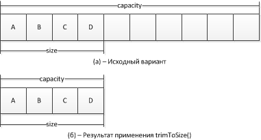
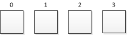
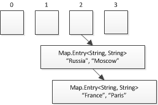

# Java Уровень 11

>
>[Коллекции](#коллекции)
>
>> [Класс ArrayList](#класс-arraylist)
>>
>> [Класс LinkedList](#класс-linkedlist)
>>
>> [Классы HashМap, LinkedHashMap, TreeMap](#классы-hashмap-linkedhashmap-treemap)
>>
>> [Классы HashSet, LinkedHashSet, TreeSet](#классы-hashset-linkedhashset-treeset)
>>
>> [Итераторы](#итераторы)
>>
>> [Интерфейс Comparable](#интерфейс-comparable)
>
>[Практическое задание](#практическое-задание)
>
>[Дополнительные материалы](#дополнительные-материалы)
>
>[Используемая литература](#используемая-литература)
>

# Виды коллекций

Виды контейнеров в Java: List, Map, Set. Основные реализации и приемы использования, проход по элементам коллекции, сравнение и сортировка элементов коллекции."

# Коллекции

Коллекция представляет собой контейнер, который хранит в себе множество
элементов, и позволяющий работать с этой группой элементов как с одним
объектом. Коллекции используются для хранения, получения, обработки
множества объектов.

Если вы только начинаете программировать, то можете сразу пролистать
методичку до пункта "класс ArrayList". Если уже научились работать с
коллекциями, то можете дополнить ваши знания тем что здесь написано.

При работе с коллекциями в Java используется следующий набор
интерфейсов: Collection, Set, SortedSet, List, Queue, Deque, Map,
SortedMap. Иерархия этих интерфейсов представлена на рисунке ниже
([[https://docs.oracle.com/javase/tutorial/collections/interfaces/index.html]{.underline}](https://docs.oracle.com/javase/tutorial/collections/interfaces/index.html)).


Давайте посмотрим на основное назначение каждого интерфейса:

- **Collection** - является "корневым" элементом иерархии коллекций. Коллекция представляет собой группу объектов, называемых элементами. Интерфейс описывает
  функционал присущий абсолютно всем коллекциям.

- **Set** - коллекция, представляющая собой множество элементов, которое не может содержать дубликаты.

- **List** - коллекция, содержащая в себе последовательность элементов. В этом типе коллекций дубликаты разрешены. List позволяет обращаться к своим элементам
  по индексу, добавлять/изменять/удалять элементы.

- **Queue** - коллекция, позволяющая управлять процессом обработки элементов. Как правило, работает в режиме FIFO (first-in, first-out, первый вошел - первый
  вышел, например, очередь в кабинет). В таком случае элементы добавляются в хвост, а забираются с головы.

- **Deque** - коллекция, позволяющая управлять процессом обработки элементов. Deque может использоваться как в режиме FIFO , так и в режиме LIFO (last-in,
  first-out, последний вошел - первый вышел, например, в стопку бумаг кладут сверху листы, и оттуда же их забирают). Deque позволяет добавлять/изменять/удалять
  элементы как в голове, так и в хвосте коллекции.

- **Map**, коллекция, которая отображает ключ, к его значению. Map не может содержать дублирующиеся ключи. Map не наследуется от интерфейса Collection.

- **SortedSet** и **SortedMap** представляют собой упорядоченные в порядке возрастания версии коллекций Set (сортировка идет по элементам) и Map (сортировка
  производится по ключам).

Перейдем теперь к практическим вопросам работы с коллекциями.

## Класс ArrayList

Обычные массивы после создания имеют фиксированную длину, которую нельзя
изменить напрямую. Если такая необходимость возникнет, можно попытаться
это сделать следующим образом:

```java
public static void main(String[] args) {
    int[] arr = {1, 2, 3, 4};
    int[] arrNew = new int[10];
    System.arraycopy(arr, 0, arrNew, 0, arr.length);
    arr = arrNew;
    arrNew = null;
}
```

В коде выше создан массив arr имеющий длину 4. Для увеличения его
размера до 10 элементов, мы создаем новый массив arrNew длиной 10, с
помощью метода System.arraycopy() копируем все элементы из arr в arrNew,
и записываем в arr ссылку на новый массив arrNew. В результате arr
изменил свой размер с 4 до 10.

Чтобы не "изобретать колесо" для решения этой проблемы, можно
воспользоваться готовыми классами Java. Класс ArrayList представляет
собой динамический массив, размер которого может изменяться по мере
необходимости (в основе своей он использует обычный массив).

**Важно!** Класс ArrayList, как и все коллекции в целом, может работать
только с ссылочными типами данных. Для хранения примитивов необходимо
использовать "обертки": Byte, Short, Integer, Long, Float, Double,
Character, Boolean.

У ArrayList есть два основных параметра: размер (size) и емкость
(capacity). size указывает на то, сколько объектов уже хранится в нем, а
capacity - на сколько объектов рассчитана данная коллекция (по-умолчанию
начальная емкость равна 10, и может задана через конструктор).
Схематично структура и принцип работы ArrayList представлены на рисунке 1.


Рисунок 1 - Схема работы ArrayList

На рисунке 1.а мы видим ArrayList, который можно создать как:
ArrayList<String> arrayList = new ArrayList<>(Arrays.asList("A",
"B", "C", "D")). Размер (size) такого листа составляет 4, потому что мы
добавили туда 4 строки. Начальная же емкость, как и было сказано выше,
равна 10. Внутри ArrayList для хранения данных на самом деле зашит самый
обычный Java массив, емкость как раз и показывает размер этого
внутреннего массива. Если при создании мы добавили в коллекцию сразу 4
элемента, то в массиве остается еще 6 свободных мест. После шести
вызовов метода add() ArrayList окажется заполненным (рис. 1.б).
**Важно!** Когда вы добавляете в ArrayList новый элемент и не
превышаете его емкости, вы работаете с одним и тем же внутренним
массивом, он не пересоздается каждый раз! При выполнении операций по
удалению элементов, или их изменению, вы также работаете с одним и тем
же внутренним массивом.

Если размер листа равен его емкости и мы попытаемся добавить в него
новый элемент, то произойдет следующее:


В памяти создается новый массив, длина которого равна емкости ArrayList
умноженной на 1.5. Затем данные из массива ArrayList'а копируются в
новый массив, и туда добавляется новый элемент (из arrayList.add(...)).
После чего ArrayList переписывает ссылку внутреннего массива на вновь
созданный. Старый же массив будет удален из памяти сборщиком мусора.
Поскольку ссылка на внутренний массив ArrayList была переписана, а длина
нового массива в полтора раза больше исходного, то соответственно и
емкость ArrayList вырастет в полтора раза.

При таком подходе пользователю не приходится думать о том, что может
закончится место для хранения объектов, особенно в случаях когда при
старте программы неизвестно сколько может понадобиться места (допустим
считываем строки из файла, содержимое которого может меняться с течением
времени).

Еще одной важной особенностью ArrayList является то, что в нем не может
быть "пустых мест" между элементами. Допустим существует ArrayList с
элементами { 1, 2, 3, 4, 5 }, при удалении элемента 3, он примет вид {
1, 2, 4, 5 }, то есть элементы, после удаленного переместятся влево на
одну позицию (то есть на месте 3 не образуется никакого null или
чего-либо еще). null может содержаться в ArrayList только если вы его
туда добавите. Вновь созданный ArrayList также не состоит из набора
null, при попытке обратиться к элементу с индексом, превышающим size -
1, будет брошено исключение IndexOutOfBoundException (например, если в
ArrayList есть набор элементов {1, 1, 1}, и мы попытаемся обратиться к
элементу с индексом 3).

Класс ArrayList<E> является обобщенным, где Е обозначает тип объектов,
хранимых в списке. В классе ArrayList определены следующие конструкторы:

| Конструктор                            | Описание                                                                   |
|----------------------------------------|----------------------------------------------------------------------------|
| `ArrayList()`                          | Создает пустой ArrayList с начальной ёмкостью 10                           |
| `ArrayList(Collection<? extends Е> c)` | Создает ArrayList, инициализируемый элементами заданной коллекции `c`      |
| `ArrayList(int initialCapacity)`       | Создает ArrayList, имеющий указанную начальную емкость (`initialCapacity`) |

Основные методы для работы с ArrayList:

| Метод                          | Действие                                                                                              |
|--------------------------------|-------------------------------------------------------------------------------------------------------|
| `boolean add(E e)`             | Добавить элемент в конец списка                                                                       |
| `void add(int index, E e)`     | Добавить элемент на позицию `index`                                                                   |
| `E get(int index)`             | Получить элемент списка с индексом `index`                                                            |
| `void set(int index, E e)`     | Заменить элемент на позиции `index`                                                                   |
| `E remove(int index)`          | Удалить элемент списка с заданной позиции, вернуть ссылку на удаленный объект                         |
| `boolean remove(E e)`          | Удалить заданный объект из списка, вернуть `true`, если объект был удален, `false` в противном случае |
| `void trimToSize()`            | «Урезать» емкость списка до его размера                                                               |
| `int size()`                   | Получить размер списка                                                                                |
| `ensureCapacity(int capacity)` | Увеличить емкости списка до значения `capacity`, только если текущая емкость меньше указанной         |
| `boolean contains(E e)`        | Проверить на присутствие указанного элемента в списке                                                 |

В следующем примере демонстрируется простое применение класса ArrayList.

```java
public static void main(String[] args) {
    ArrayList<String> arrayList = new ArrayList<>();
    arrayList.add("A");
    arrayList.add("B");
    arrayList.add("C");
    arrayList.add("D");
    arrayList.add("E");
    arrayList.add(1, "А0");
    System.out.println(arrayList);
    arrayList.remove("E");
    arrayList.remove(2);
    System.out.println(arrayList);
}

// Результат:
// [A, А0, B, C, D, E]
// [A, А0, C, D]
```

**Заметка.**
Начиная с версии Java 1.8, при объявлении коллекций допустимо
использовать запись:

```
ArrayList<String> arrayList = new ArrayList<>();
```

До этой версии:

```
ArrayList<String> arrayList = new ArrayList<String>();
```

То есть, начиная с 7 версии Java не обязательно дублировать <тип> в
правой части, и достаточно указать <>. Если компилятор начинает на
это ругаться, проверьте используемую версию языка.

В приведенном выше коде, создается ArrayList, который может хранить в
себе только объекты типа String, и в него по-порядку в конец списка
добавляются A, B, C, D, E, после чего в ячейку с индексом 1 кладется
элемент A0, что приводит к смещению всех элементов после 1-го на одну
ячейку вправо. Затем печатаем содержимое arrayList в консоль (у
коллекций очень удобная перегрузка метода toString(), которая позволяет
отдавать их в метод System.out.println() для отображения содержимого).
После первой печати, из ArrayList удаляется два элемента, вначале по
объекту "E"(в коллекции производится поиск этого элемента и его
удаление), а затем удаляется элемент из ячейки с индексом 2. Ну и в
конце концов печатается итоговая версия al.

Несмотря на то, что ёмкость объектов типа ArrayList наращивается
автоматически, её можно увеличивать и вручную, вызывая метод
ensureCapacity(), если заранее известно, что в коллекции предполагается
сохранить намного больше элементов, чем она содержит в данный момент.
Увеличив ёмкость списочного массива в самом начале его обработки, вы
можете избежать выполнения дорогостоящей операции перераспределения
памяти.

С другой стороны, если требуется уменьшить размер базового массива, на
основе которого строится объект типа ArrayList, до текущего количества
хранящихся в действительности объектов, следует вызвать метод
trimToSize(). Схематично принцип работы этого метода показан на рисунке 2.


Рисунок 2 - Принцип работы метода trimToSize()

**Получение массива из ArrayList.** При работе с ArrayList может
возникнуть необходимость преобразовать его в обычный массив, что можно
сделать вызвав метод toArray(). Вот некоторые причины для этого:
ускорение выполнения некоторых операций, передача массива в качестве
параметра методам, которые не перегружены для работы с коллекциями,
интеграция кода, использующего коллекции, с кодом, который работает
только с массивами. Имеется две перегрузки метода toArray():

```java
Object[] toArray();

<Т> Т[] toArray(Т[] array);
```

В первом случае метод toArray() возвращает массив объектов типа Object,
а во второй --- массив элементов того же типа, что и тип
коллекции(например, ArrayList<String> преобразуется к массиву
String[], что очень удобно). Рассмотрим пример использования данного
метода.

```java
public static void main(String[] args) {
    List<Integer> list = new ArrayList<>();
    list.add(1);
    list.add(2);
    list.add(3);
    Integer[] arr = new Integer[list.size()];
    list.toArray(arr);
}
```

Код довольно простой, вначале создаем целочисленный ArrayList и
складываем в него значения {1, 2, 3} после чего применяя метод toArray()
преобразуем его к массиву того же типа что и сам ArrayList. Как было
сказано ранее, для работы с примитивным типом int используем его
обертку - Integer.

**Важно! Что нужно помнить при работе с ArrayList:**

- ArrayList представляет собой динамический массив(список) в Java;
- Получение значения по индексу ячейки осуществляется с помощью метода **get()**;
- Для добавления элемента в ArrayList используем метод **add()**;
- Метод set() позволяет заменить значение ячейки по ее индексу;
- Чтобы удалить элемент по индексу или значению, используем метод remove();
- При удалении элемента не с конца ArrayList, все элементы, идущие после удаляемого элемента, будут смещены на 1 позицию влево.

## Класс LinkedList

LinkedList<E> предоставляет структуру данных связного списка, где Е
обозначает ссылочный тип хранимых объектов. У класса LinkedList имеется
два конструктора: LinkedList() - создает пустой LinkedList; и
LinkedList(Collection<? extends Е> сollection), позволяющий создать
LinkedList, который будет содержать элементы другой коллекции.

Структура LinkedList значительно отличается от ArrayList. Каждый элемент
в связном списке имеет ссылку на предыдущий и на следующий элементы. Сам
же LinkedList имеет ссылку на свой первый и последний элемент.
[**Важно!** В отличие от ArrayList, LinkedList не использует массивов в
своей внутренней структуре.]{.underline}

Структура LinkedList схематично показана на рисунке 3.


Рисунок 3 --- Структура LinkedList

LinkedList, как и ArrayList, имеет параметр size, показывающий
количество элементов в списке, но не имеет параметра capacity, так как
все объекты связаны между собой ссылками друг на друга и могут быть
раскиданы по памяти.

LinkedList позволяет производить поиск элемента по индексу, однако из-за
своей структуры, для поиска элемента приходится обходить элементы
коллекции или от первого, или от последнего, и пробегать по ссылкам,
пока не будет найден запрошенный элемент. Выбор начала поиска зависит от
указанного индекса, и size объекта LinkedList, если индекс меньше size /
2, то поиск будет начинаться с начала коллекции, в противном случае - с
конца. Это позволяет уменьшить количество операций необходимых для
поиска.

При удалении элемента нет необходимости куда-либо смещать элементы
коллекции (как это происходит в ArrayList), достаточно лишь переписать
ссылки у двух соседних с удаленным объектов. При большом количестве
элементов в коллекции, удаление из начала LinkedList будет производиться
быстрее чем из начала ArrayList, это связано опять же с тем, что
LinkedList перепишет всего пару ссылок, а ArrayList будет перемещать все
элементы после удаленного влево на одну позицию.

Ниже приведена таблица с методами для работы с LinkedList.

| Метод             | Действие                                           |
|-------------------|----------------------------------------------------|
| `addFirst(E e)`   | Добавить элемент в начало списка                   |
| `offerFirst(E e)` | Добавить элемент в начало списка                   |
| `addLast(E e)`    | Добавить элемент в конец списка                    |
| `offerLast(E e)`  | Добавить элемент в конец списка                    |
| `add(E e)`        | Добавить элемент в конец списка                    |
| `getFirst()`      | Получить первый элемент списка                     |
| `peekFirst()`     | Получить первый элемент списка                     |
| `removeFirst()`   | Получить первый элемент и удалить его из списка    |
| `pollFirst()`     | Получить первый элемент и удалить его из списка    |
| `getLast()`       | Получить последний элемент списка                  |
| `peekLast()`      | Получить последний элемент списка                  |
| `removeLast()`    | Получить последний элемент и удалить его из списка |
| `pollLast()`      | Получить последний элемент и удалить его из списка |

В следующем примере демонстрируется применение класса LinkedList:

```java
public static void main(String[] args) {
    LinkedList<String> linkedList = new LinkedList<>();
    linkedList.add("F");
    linkedList.add("B");
    linkedList.add("D");
    linkedList.add("Е");
    linkedList.add("C");
    linkedList.addLast("Z");
    linkedList.addFirst("A");
    linkedList.add(1, "А2");
    System.out.println("1. linkedList: " + linkedList);
    linkedList.remove("F");
    linkedList.remove(2);
    System.out.println("2. linkedList: " + linkedList);
    linkedList.removeFirst();
    linkedList.removeLast();
    System.out.println("3. linkedList: " + linkedList);
    String val = linkedList.get(2);
    linkedList.set(2, val + " изменено");
    System.out.println("4. linkedList: " + linkedList);
}

// Результат:
// 1. linkedList: [A, А2, F, B, D, Е, C, Z]
// 2. linkedList: [A, А2, D, Е, C, Z]
// 3. linkedList: [А2, D, Е, C]
// 4. linkedList: [А2, D, Е изменено, C]
```

Обратите внимание, как третий элемент связного списка linkedList
изменяется с помощью методов get() и set(). Для получения значения
элемента на позиции n, выполняется метод get(n). Для присвоения нового
значения элементу на этой позиции, методу set() передаётся
соответствующий индекс и новое значение.

**Best practice:**
Не используйте LinkedList. Единственное применение этой коллекции вопросы на интервью.

## Классы HashМap, LinkedHashMap, TreeMap

Класс HashMap<K, V> представляет собой хеш-таблицу для хранения пар
ключ-значение (Key(K) - ключ, Value(V) - значение), и обеспечивает
постоянное время выполнения методов get() и put() даже при большом
количестве элементов в коллекции. Типы ключа и значения могут
отличаться. Для того чтобы понять, что такое ключ, и что такое
значение, а также почему HashMap позволяет производить быстрый поиск
значения по ключу, необходимо немного углубиться в структуру и логику
работы HashMap.

**Важно!** Несмотря на то, что мы подробно рассматриваем логику работы
HashMap, для работы с этим типом данных вам совершенно не обязательно
все это помнить. Разбор внутренней структуры приведен для того, чтобы
вы понимали почему HashMap обеспечивает быстрый поиск значения по ключу
и откуда могут появиться проблемы с производительностью этой структуры
данных.

У HashMap есть два основных параметра:

- **capacity** - емкость, или количество элементов(bucket) во
  > внутренней таблице HashMap, по-умолчанию начальная емкость HashMap
  > равна 16, и всегда равна степени 2, при попытке указать в
  > конструкторе начальную емкость равную 28, она автоматически будет
  > увеличена до 32;

- **loadFactor** (по-умолчанию равен 0.75, должен находиться в
  > пределах от 0.0 до 1.0) - коэффициент, который показывает что при
  > добавлении в HashMap количества элементов бОльшего чем capacity *
  > loadFactor, емкость коллекции будет увеличена вдвое и произойдет
  > рехеширование записей(что это такое будет рассказано далее).

Теперь посмотрим на структуру HashMap, которая схематично представлена
на рисунке 4, для упрощения объяснения начальную емкость возьмем равной 4.



Рисунок 4 --- Структура HashMap

Каждая ячейка внутренней таблицы HashMap хранит в себе список (в
некоторых случаях может быть построено дерево) пар Map.Entry<K, V>.
Показанный на рисунке HashMap ничем не заполнен. Для добавления элемента
используется метод put(key, value), где в качестве первого аргумента
передается ключ, а в качестве второго - значение. Давайте посмотрим что
происходит при исполнении метода put, схема работы показана на рисунке 5.


Рисунок 5 - Принцип работы метода put()

Допустим мы хотим добавить в HashMap пару страна-столица
"Russia-Moscow". На первом шаге (1), из метода put вытаскивается ключ
"Russia" и по нему считается hashCode (2), при "совмещении" hashCode
ключа и емкости hashMap на этапе (3) мы получаем индекс ячейки, в
которую будет добавлена пара "Russia"-"Moscow" (4). ().

**Заметка.** Алгоритм совмещения hashCode и capacity не приводится, так
как может меняться от версии к версии jdk.

Поскольку hashCode для объекта не уникален, и количество ячеек во
внутренней таблице HashMap ограничено, может случиться так, что в одну
ячейку упадет несколько разных Map.Entry<>, такая ситуация называется
коллизией. Пример показан на рисунке 6 (на рисунке показан лишь пример,
на самом деле эти записи могут оказаться в разных ячейках, в зависимости
от hashCode ключей).



Рисунок 6 - Коллизия для пар "Russia"-"Moscow" и "France"-"Paris"

Как видите, разные записи складываются по порядку добавления в одну
ячейку (ячейка может содержать в себе LinkedList<Map.Entry> или
древовидную структуру).

При необходимости достать из HashMap значение по ключу происходит
обратный процесс. При выполнении метода get("France"), у указанного
ключа находится hashCode, после чего он "совмещается" с емкостью HashMap
и тем самым мы находим ячейку, в которой лежит искомая запись. Останется
только пройтись по коллекции в этой ячейке и найти Map.Entry у которой
ключ совпадает по equals() с искомым. Если бы мы хранили только значения
без ключей, то невозможно было бы понять какое значение к какому ключу
относится.

При создании HashMap можно использовать несколько перегруженных
конструкторов:

| Конструктор                                      | Описание                                                                    |
|--------------------------------------------------|-----------------------------------------------------------------------------|
| `HashMap()`                                      | Создает пустой `HashMap` с начальной емкостью 16                            |
| `HashMap(Map<? extends K, ? extends V> m)`       | Создает `HashMap`, инициализируемый элементами из `Map m`                   |
| `HashMap(int initialCapacity)`                   | Создает `HashMap` с указанной начальной емкостью                            |
| `HashMap(int initialCapacity, float loadFactor)` | Создает `HashMap` с указанной начальной емкостью и коэффициентом заполнения |

Следует иметь в виду, что HashMap не гарантирует порядок расположения
своих элементов, соответственно порядок их перебора может не
соответствовать порядку их добавления. (Такая "хаотичность" связана со
способом хранения записей). В следующем примере программы
демонстрируется применение класса HashMap:

```java
public static void main(String[] args) {
    HashMap<String, String> hm = new HashMap<>();
    hm.put("Russia", "Moscow");
    hm.put("France", "Paris");
    hm.put("Germany", "Berlin");
    hm.put("Norway", "Oslo");
    for (Map.Entry<String, String> o : hm.entrySet()) {
        System.out.println(o.getKey() + ": " + o.getValue());
    }
    hm.put("Germany", "Berlin2");
    System.out.println("New Germany Entry: " + hm.get("Germany"));
}

// Результат:
// Norway: Oslo
// France: Paris
// Germany: Berlin
// Russia: Moscow
// New Germany Entry: Berlin2
```

Выполнение данной программы начинается с создания HashMap<String,
String> hm и добавления в него стран и столиц. Далее его содержимое с
помощью цикла foreach выводится в консоль. Ключи и значения выводятся в
результате вызова методов getKey() и getValue(), определенных в
Мар.Entry. Обратите особое внимание на порядок изменения записи
Germany/Berlin. Метод put() автоматически заменяет ранее существовавшее
значение на новое при совпадении ключей, то есть не может быть
нескольких значений под одним ключом. Таким образом, после обновления
записи Germany/Berlin на Germany/Berlin2 HashMap по-прежнему содержит
только одну пару ключ/значение Germany/Berlin2.

Классы LinkedHashMap и TreeMap расширяют класс HashMap. LinkedHashMap
сохраняет порядок добавления записей, а TreeMap хранит пары
«ключ-значение» в отсортированном порядке (в порядке возрастания
ключей).

**Важно! Что нужно помнить при работе с HashMap:**

- HashMap предоставляет возможность быстрого поиска значения по ключу;
- Для того чтобы ваши собственные типы данных (классы) могли использоваться в качестве ключей HashMap, необходимо корректно реализовать методы hashCode() и
  equals();
- Метод put() используем для добавления пары ключ-значение, get() для получения значения по ключу;

## Классы HashSet, LinkedHashSet, TreeSet

**HashSet.** Класс HashSet служит для создания коллекции, содержащей
только уникальные элементы (особое внимание необходимо уделить
словосочетанию "только уникальные элементы") и основанной на
использовании внутренней хеш-таблицы. Преимущество хеширования
заключается в том, что оно обеспечивает постоянство времени выполнения
методов add(), contains(), remove() и size(). В классе HashSet
определены следующие конструкторы:

| Конструктор                                      | Описание                                                                          |
|--------------------------------------------------|-----------------------------------------------------------------------------------|
| `HashSet()`                                      | Создает пустой `HashSet` с начальной ёмкостью 16                                  |
| `HashSet(Collection<? extends Е> collection)`    | Создает `HashSet`, инициализируемый элементами из заданной коллекции `collection` |
| `HashSet(int initialCapacity)`                   | Создает `HashSet`, имеющий указанную начальную емкость                            |
| `HashSet(int initialCapacity, float loadFactor)` | Создает `HashSet`, имеющий указанную начальную емкость и коэффициент заполнения   |

Назначение capacity и loadFactor такое же, как и в случае с HashMap. В
классе HashSet не определяется никаких дополнительных методов, помимо
тех, что предоставляют его суперклассы и интерфейсы. Следует также иметь
в виду, что класс HashSet не гарантирует упорядоченности элементов,
поскольку процесс хеширования сам по себе обычно не приводит к созданию
отсортированных множеств. Ниже приведён пример, демонстрирующий
применение класса HashSet.

```java
public static void main(String[] args) {
    Set<String> set = new HashSet<>();
    set.add("Aльфa");
    set.add("Бета");
    set.add("Aльфa");
    set.add("Этa");
    set.add("Гaммa");
    set.add("Эпсилон");
    set.add("Oмeгa");
    set.add("Гaммa");
    System.out.println(set);
}

// Результат:
// [Гaммa, Эпсилон, Бета, Этa, Oмeгa, Aльфa]
```

Как видите, в коде объекты "Альфа" и "Гамма" были добавлены дважды,
однако HashSet сохранил только по одному варианту этих объектов.

**LinkedHashSet.** Класс LinkedHashSet<E> расширяет класс HashSet, не
добавляя никаких новых методов. У этого класса такие же конструкторы,
как и у класса HashSet. Класс LinkedHashSet использует связный список
для сохранения порядка добавления в него элементов. Следовательно, при
переборе элементов они будут извлекаться в том порядке, в каком были
добавлены. Пример:

```java
public static void main(String[] args) {
    Set<String> set = new LinkedHashSet<>();
    set.add("Бета");
    set.add("Aльфa");
    set.add("Этa");
    set.add("Гaммa");
    set.add("Эпсилон");
    set.add("Oмeгa");
    System.out.println(set);
}

// Результат:
// [Бета, Альфа, Эта, Гамма, Эпсилон, Омега]
```

**TreeSet.** Класс TreeSet создаёт коллекцию, где для хранения элементов
применяет древовидная структура. Объекты сохраняются в отсортированном
порядке по возрастанию. Время доступа и извлечения элементов достаточно
мало, благодаря чему класс TreeSet оказывается отличным выбором для
хранения больших объемов отсортированных данных.

В классе TreeSet определены следующие конструкторы:

- TreeSet ().
- TreeSet (Collection<? extends Е> сollection).
- TreeSet (Comparator<? super Е> comparator).
- TreeSet (SortedSet<E> s).

В первой форме конструктора создаётся пустое древовидное множество. Во
второй --- древовидное множество, содержащее элементы заданной коллекции
collection. В третьей --- пустое древовидное множество, элементы
которого будут отсортированы заданным компаратором. И, наконец, в
четвёртой форме создаётся древовидное множество, содержащее элементы
заданного отсортированного множества s. В приведённом ниже примере
программы демонстрируется применение класса TreeSet.

```java
public static void main(String[] args) {
    Set<String> set = new TreeSet<>();
    set.add("C");
    set.add("A");
    set.add("B");
    set.add("E");
    set.add("F");
    set.add("D");
    System.out.println(set);
}

// Результат:
// [A, B, C, D, E, F]
```

Элементы такого множества автоматически располагаются в отсортированном
порядке.

## Итераторы

Итератор позволяет обойти все элементы коллекции. Для работы с
итераторами служит интерфейс Iterator. Для получения объекта этого типа,
необходимо вызвать метод iterator() у коллекции.

```java
public static void main(String[] args) {
    List<String> list = new ArrayList<>();
    Iterator<String> iter = list.iterator();
}
```

Давайте рассмотрим три основных метода интерфейса Iterator: hasNext(),
next(), remove().

- **hasNext()** проверяет наличие элементов в коллекции, которые мы еще не видели;

- **next()** переходит на следующий элемент коллекции и возвращает ссылку на него;

- **remove()** удаляет элемент, на который указывает итератор в настоящий момент.

Поставим следующую задачу: есть список строк, из которого необходимо
удалить строки "A". Ниже представлено решение этой задачи.

```java
public static void main(String[] args) {
    List<String> list = new ArrayList<>(Arrays.asList("A", "B", "C", "C", "A", "A", "B", "C", "B"));
    Iterator<String> iter = list.iterator();
    while (iter.hasNext()) {
        String str = iter.next();
        if (str.equals("A")) {
            iter.remove();
        }
    }
    System.out.println(list);
}
// Результат: [B, C, C, B, C, B]
```

При работе с List мы можем использовать "расширенный" вариант
итератора - ListIterator.

```java
public static void main(String[] args) {
    List<String> list = new ArrayList<>(Arrays.asList("A", "B", "C", "C", "A", "A", "B", "C", "B"));
    ListIterator<String> iter = list.listIterator();
}
```

Этот интерфейс добавляет больше гибкости при работе с List.

- **hasPrevious()** - проверка есть ли элемент слева;
- **previous()** - переход на левый элемент и возврат ссылки на него;
- **nextIndex()** - получение индекса следующего элемента;
- **previousIndex()** - получение индекса предыдущего элемента;
- **add()** - добавить новый элемент на то место, на которое указывает итератор;
- **set()** - изменить элемент, на который указывает итератор.

Как видно из приведенного выше списка методов, при работе с листами мы
можем не только обходить элементы и удалять их, но и: работать с
индексами элементов, добавлять/изменять объекты в коллекции, двигаться
не только вправо, но и влево по списку.

## Интерфейс Comparable

При необходимости отсортировать коллекцию, или использовать
упорядоченную, возникает вопрос - каким образом Java понимает как
сортировать объекты? Рассмотрим этот вопрос на примере класса Cat.

```java
public class Cat {
    private String name;
    private int age;

    public Cat(String name, int age) {
        this.name = name;
        this.age = age;
    }

    @Override
    public String toString() {
        return "Cat [" + name + "]";
    }
}
```

Давайте создадим список объектов типа Cat, и попробуем отсортировать его
с помощью статического метода Collections.sort().

```java
public static void main(String[] args) {
    List<Cat> cats = new ArrayList<>(Arrays.asList(
            new Cat("A", 5), new Cat("B", 2), new Cat("C", 4)
    ));
    System.out.println(cats);
    Collections.sort(cats);
}
```

При таком варианте написания кода мы получим ошибку на этапе компиляции.
Java требует, чтобы класс Cat реализовал интерфейс Comparable.

```java
public class Cat implements Comparable {
    private String name;
    private int age;

    public Cat(String name, int age) {
        this.name = name;
        this.age = age;
    }

    @Override
    public int compareTo(Object o) {
        Cat another = (Cat) o;
        if (this.age > another.age) {
            return 1;
        }
        if (this.age < another.age) {
            return -1;
        }
        return 0;
    }

    @Override
    public String toString() {
        return "Cat [" + name + "]";
    }
}
```

В интерфейсе Comparable описан метод compareTo(Object o), который
отвечает за сравнение объектов нашего класса. Если метод compareTo()
вернет положительное число, значит текущий объект (this) больше o, если
отрицательное - this меньше o, если вернул 0, значит объекты равны между
собой. Указанную выше реализацию метода compareTo можно сократить до:

```java
public class Cat implements Comparable {
    // ...
    @Override
    public int compareTo(Object o) {
        return this.age - ((Cat) o).age;
    }
    // ...
}
```

Объяснив Java что хотим сравнивать котов именно по возрасту, мы можем
отсортировать список в порядке возрастания, и вывести его в консоль.

```java
public static void main(String[] args) {
    List<Cat> cats = new ArrayList<>(Arrays.asList(
            new Cat("A", 5), new Cat("B", 2), new Cat("C", 4)
    ));
    System.out.println(cats);
    Collections.sort(cats);
    System.out.println(cats);
}

// Результат:
// [Cat [A], Cat [B], Cat [C]]
// [Cat [B], Cat [C], Cat [A]]
```

Итак, интерфейс Comparable служит для описания способа сравнения
объектов для их дальнейшего упорядочивания. Данный интерфейс указывает
что объекты этого типа могут быть упорядочены.

**Best practice:**\
Интерфейсу Comparable лучше предпочитать интерфейс Comparator.\
Класс может имплементировать Comparable только 1 раз.\
Что если в следующий раз вы захотите сортировать котов не по имени, а по
весу?\
Интерфейс Comparator позволяет сравнивать 2 объекта и осуществлять
сортировку.\
И вы можете создать несколько реализаций NameComparator,
SizeBasedComparator

# Практическое задание

Задание необходимо сдать через Git. [Инструкция](https://docs.google.com/document/d/1RAT_ukE39iOfbz1xa39QXae2hBUEZ4U6Fko_wFDdrsM/edit)

1. Создать массив с набором слов (10-20 слов, должны встречаться повторяющиеся). Найти и вывести список уникальных слов, из которых состоит массив (дубликаты не
   считаем). Посчитать, сколько раз встречается каждое слово.

2. Написать простой класс Телефонный Справочник, который хранит в себе список фамилий и телефонных номеров. В этот телефонный справочник с помощью метода add()
   можно добавлять записи, а с помощью метода get() искать номер телефона по фамилии. Следует учесть, что под одной фамилией может быть несколько телефонов (в
   случае однофамильцев), тогда при запросе такой фамилии должны выводиться все телефоны. *Желательно не добавлять лишний функционал(дополнительные поля (имя,
   отчество, адрес), взаимодействие с пользователем через консоль и т.д). Консоль использовать только для вывода результатов проверки телефонного справочника.*

# Дополнительные материалы

1. Кей С. Хорстманн, Гари Корнелл Java. Библиотека профессионала. Том 1. Основы // Пер. с англ. - М.: Вильямс, 2014. - 864 с.
2. Брюс Эккель Философия Java // 4-е изд.: Пер. с англ. - СПб.:Питер, 2016. - 1 168 с.
3. Г. Шилдт. Java 8. Полное руководство // 9-е изд.: Пер. с англ. - М.: Вильямс, 2015. - 1 376 с.
4. Г. Шилдт. Java 8: Руководство для начинающих. // 6-е изд.: Пер. с англ. - М.: Вильямс, 2015. - 720 с.

# Используемая литература

Для подготовки данного методического пособия были использованы следующие
ресурсы:

1. [https://docs.oracle.com/javase/tutorial/collections/TOC.html](https://docs.oracle.com/javase/tutorial/collections/TOC.html)
2. Г. Шилдт. Java 8. Полное руководство // 9-е изд.: Пер. с англ. - М.: Вильямс, 2015. - 1 376 с.
