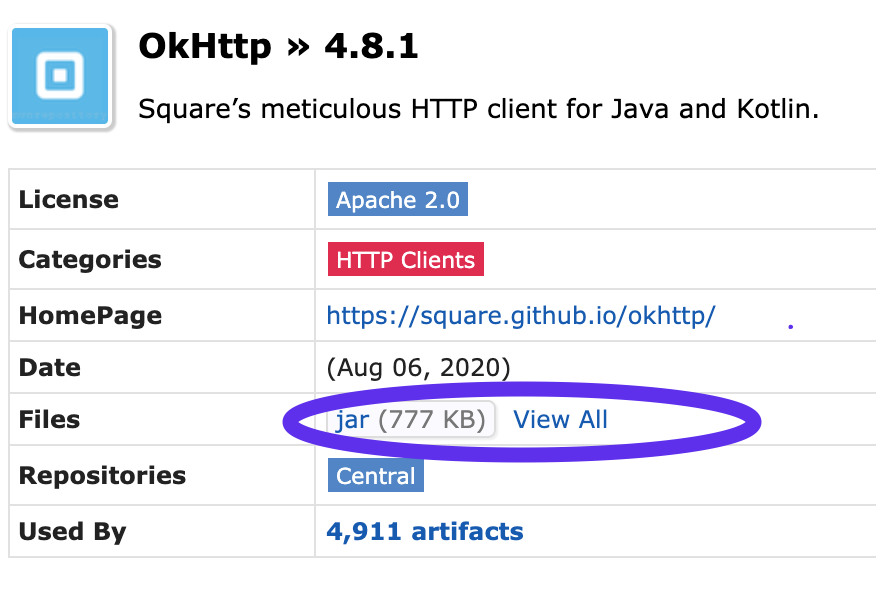
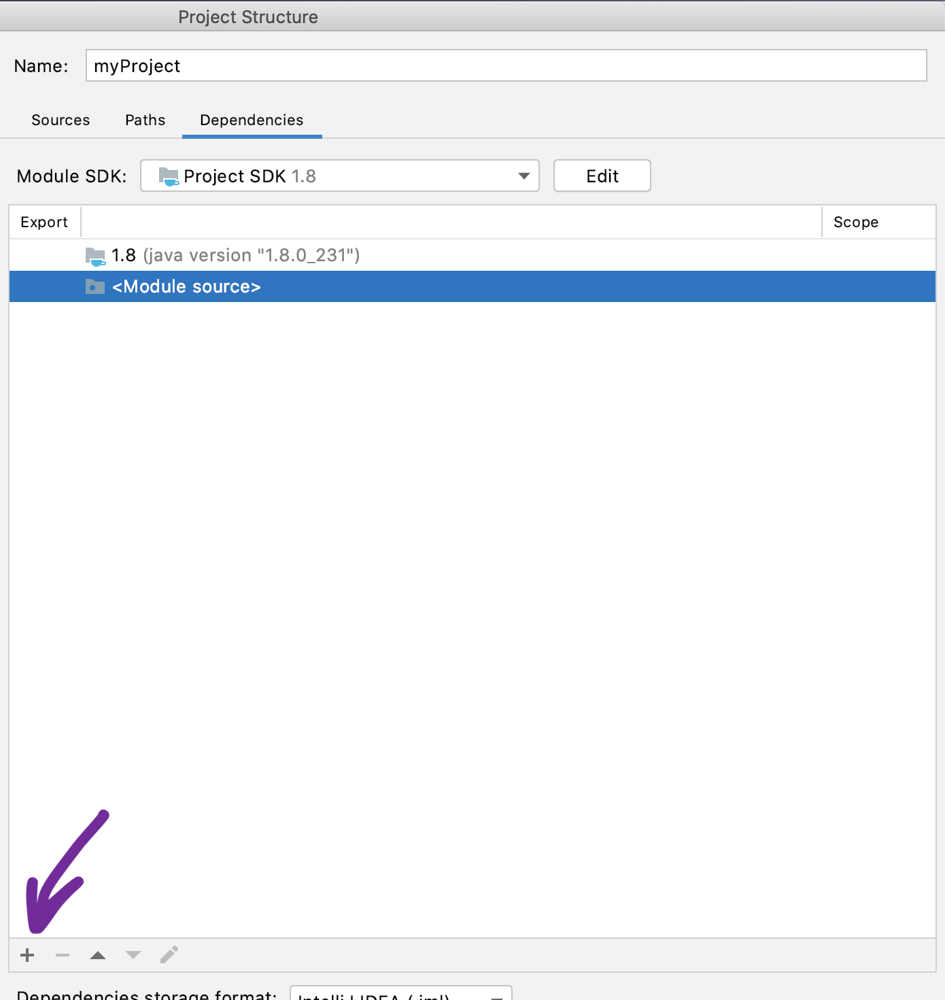

# Java Уровень 13

>
>[Основы работы в Сети](#основы-работы-в-сети)
>
>[Написание эхо-сервера](#написание-эхо-сервера)
>
>[Написание клиентской части](#написание-клиентской-части)
>
>[Практическое задание](#практическое-задание)
>
>[Дополнительные материалы](#дополнительные-материалы)
>

# Работа с сетью

Стандартные средства работы с сетью из пакета java.net. Обзор библиотеки OkHttp.

# Основы работы в Сети

В основу работы в сети, поддерживаемой в Java, положено понятие сокета,
обозначающего конечную точку в Сети. Сокеты составляют основу
современных способов работы в Сети, поскольку сокет позволяет отдельному
компьютеру одновременно обслуживать много разных клиентов, предоставляя
разные виды информации. Эта цель достигается благодаря применению порта
--- нумерованного сокета на отдельной машине.

Говорят, что серверный процесс «прослушивает» порт до тех пор, пока
клиент не соединится с ним. Сервер в состоянии принять запросы от многих
клиентов, подключаемых к порту с одним и тем же номером, хотя каждый
сеанс связи индивидуален. Для управления соединениями со многими
клиентами серверный процесс должен быть многопоточным или располагать
какими-то другими средствами для мультиплексирования одновременного
ввода-вывода.

Связь между сокетами устанавливается и поддерживается по определенному
сетевому протоколу. Протокол Интернета (IP) является низкоуровневым
маршрутизируемым сетевым протоколом, разбивающим данные на небольшие
пакеты и посылающим их через Сеть по определенному адресу, что не
гарантирует доставки всех этих пакетов по этому адресу. Протокол
управления передачи (ТСР) является сетевым протоколом более высокого
уровня, обеспечивающим связывание, сортировку и повторную передачу
пакетов, чтобы обеспечить надежную доставку данных. Еще одним сетевым
протоколом является протокол пользовательских дейтаграмм (UDP). Этот
сетевой протокол может быть использован непосредственно для поддержки
быстрой, не требующей постоянного соединения и надежной транспортировки
пакетов.

Как только соединение будет установлено, в действие вступает
высокоуровневый протокол, тип которого зависит от используемого порта.
Протокол ТСР/IP резервирует первые 1 024 порта для отдельных протоколов.
Например, порт 21 выделен для протокола FTР, порт 23 --- для протокола
Telnet, порт 25 --- для электронной почты, порт 80 --- для протокола
НТТР и т.д. Каждый сетевой протокол определяет порядок взаимодействия
клиента с портом.

Например, протокол НТТР[^1] используется серверами и веб-браузерами для
передачи гипертекста и графических изображений. Это довольно простой
протокол для базового постраничного просмотра информации,
предоставляемой веб-серверами. Рассмотрим принцип его действия. Когда
клиент запрашивает файл у НТТР-сервера, это действие называется
обращением. Оно состоит в том, чтобы отправить имя файла в специальном
формате в предопределенный порт и затем прочитать содержимое этого
файла. Сервер также сообщает код состояния, чтобы известить клиента, был
ли запрос обслужен, а также причину, по которой он не может быть
обслужен.

Главной составляющей Интернета является адрес, который есть у каждого
компьютера в Сети. Изначально все адреса состояли из 32-разрядных
значений, организованных по четыре 8-разрядных значения. Адрес такого
типа определен в протоколе IPv4. Но в последнее время вступила в
действие новая схема адресации, называемая IPv6 и предназначенная для
поддержки намного большего адресного пространства. Правда, для сетевого
программирования нa Java обычно не приходится беспокоиться, какого типа
адрес используется: IPv4 или IPv6, поскольку эта задача решается в Java
автоматически.

Сокеты по протоколу ТСР/IP служат для реализации надежных
двунаправленных постоянных двухточечных потоковых соединений между
хостами в Интернете. Сокет может служить для подключения системы
ввода-вывода в Java к другим программам, которые могут находиться как на
локальной машине, так и на любой другой в Интернете.

В Java поддерживаются две разновидности сокетов по протоколу ТСР/IP:
один --- для серверов, другой --- для клиентов. Класс ServerSocket
предназначен для создания сервера, который будет обрабатывать клиентские
подключения, тогда как класс Socket предназначен для обмена данными
между сервером и клиентами по сетевому протоколу. При создании объекта
типа Socket неявно устанавливается соединение клиента с сервером.

Для доступа к потокам ввода-вывода, связанным с классом Socket, можно
воспользоваться методами getInputStream() и getOutputStream(). Каждый из
этих методов может сгенерировать исключение типа IOException, если сокет
оказался недействительным из-за потери соединения. Эти потоки
ввода-вывода используются для передачи и приема данных.

# Написание эхо-сервера

```java
public class EchoServer {
    public static void main(String[] args) {
        Socket socket = null;
        try (ServerSocket serverSocket = new ServerSocket(8189)) {
            System.out.println("Сервер запущен, ожидаем подключения...");
            socket = serverSocket.accept();
            System.out.println("Клиент подключился");
            DataInputStream in = new DataInputStream(socket.getInputStream());
            DataOutputStream out = new DataOutputStream(socket.getOutputStream());
            while (true) {
                String str = in.readUTF();
                if (str.equals("/end")) {
                    break;
                }
                out.writeUTF("Эхо: " + str);
            }
        } catch (IOException e) {
            e.printStackTrace();
        }
    }
}
```

Для начала создается объект класса ServerSocket, представляющий собой
сервер, который прослушивает порт 8189. Метод server.accept() переводит
основной поток в режим ожидания, поэтому, пока никто не подключится,
следующая строка кода выполнена не будет. Как только клиент подключился,
информация о соединении с ним запишется в объект типа Socket. Для обмена
сообщениями с клиентом необходимо создать обработчики входящего и
исходящего потока, в данном случае это --- DataInputStream и
DataOutputStream.

Поскольку мы создаём эхо-сервер, обработка данных производится следующим
образом: сервер считывает сообщение, переданное клиентом, добавляет к
нему фразу «Эхо: » и отсылает обратно. Если клиент прислал сообщение
«end», общение с ним прекращается, и сокет закрывается.

Блок try-with-resources предназначен для гарантированного закрытия всех
сетевых соединений и освобождения ресурсов.

## Написание клиентской части

Ниже представлен полный код клиентской части для эхо-сервера. Пока
можете его просто бегло просмотреть, далее будем разбираться с каждым из
блоков.

```java
public class EchoClient extends JFrame {
    private final String SERVER_ADDR = "localhost";
    private final int SERVER_PORT = 8189;

    private JTextField msgInputField;
    private JTextArea chatArea;

    private Socket socket;
    private DataInputStream in;
    private DataOutputStream out;

    public EchoClient() {
        try {
            openConnection();
        } catch (IOException e) {
            e.printStackTrace();
        }
        prepareGUI();
    }

    public void openConnection() throws IOException {
        socket = new Socket(SERVER_ADDR, SERVER_PORT);
        in = new DataInputStream(socket.getInputStream());
        out = new DataOutputStream(socket.getOutputStream());
        new Thread(new Runnable() {
            @Override
            public void run() {
                try {
                    while (true) {
                        String strFromServer = in.readUTF();
                        if (strFromServer.equalsIgnoreCase("/end")) {
                            break;
                        }
                        chatArea.append(strFromServer);
                        chatArea.append("\n");
                    }
                } catch (Exception e) {
                    e.printStackTrace();
                }
            }
        }).start();
    }

    public void closeConnection() {
        try {
            in.close();
        } catch (IOException e) {
            e.printStackTrace();
        }
        try {
            out.close();
        } catch (IOException e) {
            e.printStackTrace();
        }
        try {
            socket.close();
        } catch (IOException e) {
            e.printStackTrace();
        }
    }

    public void sendMessage() {
        if (!msgInputField.getText().trim().isEmpty()) {
            try {
                out.writeUTF(msgInputField.getText());
                msgInputField.setText("");
                msgInputField.grabFocus();
            } catch (IOException e) {
                e.printStackTrace();
                JOptionPane.showMessageDialog(null, "Ошибка отправки сообщения");
            }
        }
    }

    public void prepareGUI() {
        // Параметры окна
        setBounds(600, 300, 500, 500);
        setTitle("Клиент");
        setDefaultCloseOperation(WindowConstants.EXIT_ON_CLOSE);

        // Текстовое поле для вывода сообщений
        chatArea = new JTextArea();
        chatArea.setEditable(false);
        chatArea.setLineWrap(true);
        add(new JScrollPane(chatArea), BorderLayout.CENTER);

        // Нижняя панель с полем для ввода сообщений и кнопкой отправки сообщений
        JPanel bottomPanel = new JPanel(new BorderLayout());
        JButton btnSendMsg = new JButton("Отправить");
        bottomPanel.add(btnSendMsg, BorderLayout.EAST);
        msgInputField = new JTextField();
        add(bottomPanel, BorderLayout.SOUTH);
        bottomPanel.add(msgInputField, BorderLayout.CENTER);
        btnSendMsg.addActionListener(new ActionListener() {
            @Override
            public void actionPerformed(ActionEvent e) {
                sendMessage();
            }
        });
        msgInputField.addActionListener(new ActionListener() {
            @Override
            public void actionPerformed(ActionEvent e) {
                sendMessage();
            }
        });

        // Настраиваем действие на закрытие окна
        addWindowListener(new WindowAdapter() {
            @Override
            public void windowClosing(WindowEvent e) {
                super.windowClosing(e);
                try {
                    out.writeUTF("/end");
                    closeConnection();
                } catch (IOException exc) {
                    exc.printStackTrace();
                }
            }
        });

        setVisible(true);
    }

    public static void main(String[] args) {
        SwingUtilities.invokeLater(new Runnable() {
            @Override
            public void run() {
                new EchoClient();
            }
        });
    }
}
```

Самое простое это метод prepareGUI() и main(), первый занимается
подготовкой интерфейса Swing к работе, а второй собственно запускает
наше клиентское приложение. Конструктор тоже содержит не особо много
кода и отвечает как раз за выполнение инициализации интерфейса через
prepareGUI() и подключение к серверу с помощью метода openConnection().

Давайте же посмотрим что за поля, связанные с сетевой частью, есть в
нашем клиенте.

```java
private final String SERVER_ADDR = "localhost";
private final int SERVER_PORT = 8189;
private Socket socket;
private DataInputStream in;
private DataOutputStream out;
```

Константа SERVER_ADDR задаёт адрес эхо-сервера, к которому будет
подключаться клиент, SERVER_PORT --- номер порта. Для открытия
соединения с сервером и обмена сообщениями используются объекты классов
Socket, DataInputStream и DataOutputStream, по аналогии с серверной
частью.

Далее смотрим на логику подключения к серверу.

```java
public void openConnection() throws IOException {
    socket = new Socket(SERVER_ADDR, SERVER_PORT);
    in = new DataInputStream(socket.getInputStream());
    out = new DataOutputStream(socket.getOutputStream());
    new Thread(new Runnable() {
        @Override
        public void run() {
            try {
                while (true) {
                    String strFromServer = in.readUTF();
                    if (strFromServer.equalsIgnoreCase("/end")) {
                        break;
                    }
                    chatArea.append(strFromServer);
                    chatArea.append("\n");
                }
            } catch (Exception e) {
                e.printStackTrace();
            }
        }
    }).start();
}
```

Первым делом открываем сокет с указанием ip-адреса и порта сервера.
Далее с помощью методов socket.getInputStream() и getOutputStream()
запрашиваем у сокета доступ к исходящему(в сторону сервера), и
входящему(направленному к нашему клиенту) потокам, но так как имея
просто потоки мы ничего сделать не сможем(не сможем передавать данные),
заворачиваем их в обработчики DataInputStream in и DataOutputStream out.

Сетевое соединение и обработчики проинициализированы, теперь запускаем
отдельный поток, чтобы слушать что же нам пришлет сервер. Если попробуем
это сделать в текущем потоке, то ничего не выйдет, так как зависнем в
цикле while(), и построение нашего объекта (клиентского окна) так и не
завершится. В этом отдельном потоке запускается цикл while() и начинает
слушать входящие сообщения, операция readUTF() блокирующая, и поток
будет периодически переходить в режим ожидания, пока сервер что-нибудь
не пришлет.

Как только сообщение от сервера пришло, мы записываем его в строку
strFromServer и выводим в основное текстовое поле нашего чата charArea.
(название chatArea дано с учетом того, что в будущем мы получим чат).

С открытием соединения мы разобрались. Для закрытия же используется
довольно простой метод closeConnection().

Ну и наконец метод для отправки сообщения в сторону сервера.

```java
public void sendMessage() {
    if (!msgInputField.getText().trim().isEmpty()) {
        try {
            out.writeUTF(msgInputField.getText());
            msgInputField.setText("");
            msgInputField.grabFocus();
        } catch (IOException e) {
            e.printStackTrace();
            JOptionPane.showMessageDialog(null, "Ошибка отправки сообщения");
        }
    }
}
```

Клиент берет содержимое текстового поля для отправки и с помощью метода
writeUTF() отправляет его серверу, после чего очищает текстовое поле и
переводит на него фокус. Если вдруг не удалось отправить сообщение, то
будет показано всплывающее окно с ошибкой.

# Отправка HTTP-запросов

Описанная выше работа с сокетами является низкоуровневой - передача
байтов информации идет на уровне транспортного протокола TCP.
Разумеется, на этом уровне мы можем реализовать передачу HTTP сообщений,
но для этого нам нужно будет вручную реализовать стандарт [RFC-2616](https://tools.ietf.org/html/rfc2616),
и следить за такими мелочами как количество символов перевода строки
между блоком заголовков и телом сообщения.

По счастливому стечению обстоятельств, в пакете java.net существуют
классы для более высокоуровневого сетевого взаимодействия - URL,
URLConnection, HttpUrlConnection.

## java.net.URL

Тим Бернерс-Ли (создатель веб) предложил масштабируемый способ
нахождения всех ресурсов в Интернете. Как только удается однозначно и
надежно что-нибудь именовать, это становится очень эффективным
принципом. Именно это и делает URL - унифицированный указатель ресурса.

**URL** обеспечивает довольно ясную форму однозначной идентификации
адресной информации в веб, и для этой цели они широко применяются
практически во всех браузерах. Класс **URL** из библиотеки сетевых
классов в Java предоставляет простой и краткий прикладной программный
интерфейс API для доступа к информации в Интернете с помощью **URL**.

Спецификация URL основывается на четырех составляющих.

Первая составляющая обозначает используемый сетевой протокол, отделяемый
двоеточием ( : ) от остальной части URL. К числу наиболее
распространенных сетевых протоколов относятся НТТР, FTР, gopher и file,
хотя ныне почти весь обмен данными через Интернет осуществляется по
протоколу НТТР (на самом деле большинство браузеров правильно
интерпретируют URL, даже если исключить из его спецификации составляющую
сетевого протокола http : / / " ) . Вторая составляющая обозначает имя
хоста или IP-адрес, используемый хостом. Она отделяется слева двойным
знаком косой черты (//), а справа - одним знаком косой черты (/) или
двоеточием ( : ), хотя это и необязательно. Третья составляющая
обозначает номер порта. Это необязательный параметр, отделяемый слева от
имени хоста двоеточием, а справа - одним знаком косой черты. (Так, если
порт 80 выбирается для сетевого протокола НТТР по умолчанию, то
указывать параметр :80 в URL излишне.) Четвертая составляющая означает
действительный путь к файлу. Большинство НТТР-серверов присоединяют имя
файла index.html к URL для непосредственного указания какого-нибудь
ресурса в каталоге.

У класса **URL** имеется ряд конструкторов, каждый из которых может
сгенерировать исключение типа **MalformedURLException**. В одной из
наиболее употребительных форм конструктора этого класса URL определяется
в виде символьной строки, похожей на ту, что можно видеть в поле адреса,
расположенном в верхней части окна браузера. Эта общая форма
конструктора класса **URL** выглядит следующим образом:

```
URL(String спецификатор_URL) throws MalformedURLException
```

Две приведенные ниже формы конструктора данного класса позволяют
разделить URL на отдельные составляющие.

```java
URL url1 = new URL("https://geekbrains.ru");
URL url2 = new URL("https", "geekbrains.ru", 443, "/");
```

В следующем примере формируется **URL** указывающий на страницу курсов
сайта Geekbrains и затем просматриваются его свойства:

```
URL geekbrainsURL = new URL("https://geekbrains.ru/courses");

System.out.println("Протокол: " + geekbrainsURL.getProtocol());
System.out.println("Порт: " + geekbrainsURL.getPort());
System.out.println("Хост: " + geekbrainsURL.getHost());
System.out.println("Файл: " + geekbrainsURL.getFile());
```

Вывод:

```
Протокол: https
Порт: -1
Хост: geekbrains.ru
Файл: /courses
```

Обратите внимание на то, что порт имеет номер -1, а это означает, что он
явно не установлен. Имея объект типа **URL**, можно извлечь из него
связанные с ним данные. Чтобы получить доступ к конкретным битам данных
или информационному наполнению объекта типа **URL**, следует создать из
него объект типа ***URLConnection***, вызвав его метод openConnection():

```java
URL geekbrainsURL = new URL("https://geekbrains.ru/courses");
URLConnection urlConnection = geekbrainsURL.openConnection();
```

Этот метод возвращает объект типа **URLConnection**, связанный с
вызывающим объектом типа **URL**. Следует, однако, иметь в виду, что
метод **openConnection**() может сгенерировать исключение типа
**IOException**.

## java.net.URLConnection

Класс URLConnection является классом общего назначения и предназначен
для доступа к атрибутам удаленного ресурса. Как только будет установлено
соединение с удаленным сервером, класс URLConnection можно использовать
для просмотра свойств удаленного объекта, прежде чем переносить его
локально.

Некоторые методы из класса URLConnection

| Метод                                        | Описание                                                                                                                                                                  |
|----------------------------------------------|---------------------------------------------------------------------------------------------------------------------------------------------------------------------------|
| `int getContentLength()`                     | Возвращает длину в байтах содержимого, связанного с ресурсом. Если длина недоступна, возвращается значение -1.                                                            |
| `long getContentLengthLong()`                | Возвращает длину в байтах содержимого, связанного с ресурсом. Если длина недоступна, возвращается значение -1.                                                            |
| `String getContentType()`                    | Возвращает тип содержимого, обнаруженного в ресурсе. Это значение поля заголовка content-type. Возвращает пустое значение null, если тип содержимого недоступен.          |
| `long getDate()`                             | Возвращает время дату ответа в миллисекундах, прошедших с 1 января 1970 г.                                                                                                |
| `long getExpiration()`                       | Возвращает время дату срока действия ресурса в миллисекундах, прошедших с 1 января 1970 г. Если дата срока действия ресурса недоступна, возвращается нуль.                |
| `String getHeaderField(int index)`           | Возвращает значение поля заголовка по указанному индексу начиная с нуля. Если значение параметра индекс превышает количество полей, то возвращается пустое значение null. |
| `String getHeaderField(String field)`        | Возвращает значение поля заголовка по указанному имени поля. Если указанное поле не найдено, то возвращается пустое значение null.                                        |
| `Map<String,List<String>> getHeaderFields()` | Возвращает отображение, содержащее все поля заголовков вместе с их значениями.                                                                                            |
| `InputStream getInputStream()`               | Возвращает поток ввода типа InputStream, привязанный к ресурсу. Этот поток ввода может использоваться для получения содержимого ресурса.                                  |

## java.net.HttpURLConnection

В Java предоставляется подкласс **HttpURLConnection**, производный от
класса **URLConnection** и поддерживающий соединения по сетеюму
протоколу НТТР. Чтобы получить объект класса **HttpURLConnection**,
следует вызвать метод **openConnection**( ) для объекта типа **URL**,
как описано выше, но результат нужно привести к типу
**HttpURLConnection**. (Разумеется, при этом необходимо убедиться. что
соединение по протоколу НТТР действительно установлено . ) Получив
ссылку на объект класса **HttpURLConnection**, можно вызывать любые
методы, унаследованные от класса **URLConnection**, а также любые
методы, определенные в самом классе **HttpURLConnection**

```java
public class HttpURLDemo {

    public static void main(String[] args) throws Exception {
        URL url = new URL("https://geekbrains.ru");

        HttpURLConnection hpCon =
                (HttpURLConnection) url.openConnection();

        // Получение информации о запросе
        System.out.println("Метод запроса:" + hpCon.getRequestMethod());
        System.out.println("Код ответа:" + hpCon.getResponseCode());
        System.out.println("Ответное сообщение:" + hpCon.getResponseMessage());

        // Получение заголовков
        Map<String, List<String>> headers = hpCon.getHeaderFields();
        for (String k : headers.keySet()) {
            System.out.printf("Ключ: %s, значение: %s \n", k, headers.get(k));
        }
    }
}
```

Вывод:

```
Метод запроса:GET
Код ответа:200
Ответное сообщение:OK
Ключ: Keep-Alive, значение: [timeout=15]
Ключ: null, значение: [HTTP/1.1 200 OK]
Ключ: Server, значение: [QRATOR]
Ключ: X-Request-Id, значение: [89464d2717f59baaf27a148ef659ae5e]
Ключ: X-Runtime, значение: [0.032211]
Ключ: X-Content-Type-Options, значение: [nosniff]
Ключ: Connection, значение: [keep-alive]
Ключ: Date, значение: [Sun, 09 Aug 2020 16:12:20 GMT]
Ключ: X-Frame-Options, значение: [SAMEORIGIN]
Ключ: Strict-Transport-Security, значение: [max-age=15724800]
Ключ: Cache-Control, значение: [max-age=0, private, must-revalidate]
Ключ: ETag, значение: [W/"938712affe05f96dd9cc101321523168"]
Ключ: Set-Cookie, значение: [_app_session=99d3181d58a1efd7c708cbf295a02848; path=/; HttpOnly, entrance_path=%2F; path=/; expires=Sun, 20 Sep 2020 16:12:20 -0000, utm_medium=referral; path=/; expires=Mon, 09 Aug 2021 16:12:20 -0000, utm_source=geekbrains.ru; path=/; expires=Mon, 09 Aug 2021 16:12:20 -0000]
Ключ: Vary, значение: [Accept-Encoding, Accept-Encoding]
Ключ: X-XSS-Protection, значение: [1; mode=block]
Ключ: Content-Length, значение: [49708]
Ключ: Content-Type, значение: [text/html; charset=utf-8]
```

## Другие классы пакета java.net

Разумеется, возможности стандартной библиотеки не ограничиваются
возможностями только лишь вышеперечисленных классов. Существуют также
классы для управления cookie-файлами, такие как **CookieManager**,
**HttpCookie**, **CookieHandler**, для работы с IP адресами -
**InetAddress**, классы, специфичные для работы по протоколу UDP -
**DatagramPacket, DatagramSocket** и другие.

# Сторонние библиотеки для работы с сетью

Вследствие огромной популярности языка программирования Java, существует
большое количество альтернативных библиотек для самых разных целей, не
поставляемых в стандартной JDK. Одним из самых популярных http-клиентов
для Java, широко используемом в мобильных приложениях под Android,
является разработанная компанией Square Inc и выложенная в открытый
доступ библиотека [OkHttp](https://github.com/square/okhttp/).
Показатель в 37.9 тысяч звезд на github - серьезный довод в пользу
большой популярности этого http клиента.

## Подключение сторонних jar в свой проект

На следующем по счету курсе мы подробно рассмотрим сборщик проектов
maven, упрощающий подключение сторонних библиотек и автоматизирующий
многие процессы, но на данный момент мы подключим jar архив с
библиотекой другим способом.

Для начала нужно скачать библиотеку. На момент составления методички,
актуальной версией является [v4.8.1](https://mvnrepository.com/artifact/com.squareup.okhttp3/okhttp/4.8.1)

Скачивание начинается после нажатия на обведенную на скриншоте кнопку.



Далее - открываем свой проект. (Пример приведен для Intellij IDEA)

**File -> Project Structure -> Modules -> Вкладка Dependencies**



После нажатия на "+" следует выбрать "Jar or directories" и выбрать
скачанный ранее jar архив с OkHttp. После нажатия на OK библиотека будет
доступна в проекте.

## OkHttp в действии

Создадим аналогичный запрос к сайту geekbrains.ru:

```java
public class OkHttpSample {

    public static void main(String[] args) throws IOException {

        // Экземпляр класса OkHttpClient выполняет всю работу по созданию и отправке запросов
        OkHttpClient client = new OkHttpClient();

        // Экземпляр класса Request создается через Builder (см. паттерн проектирования "Строитель")
        Request request = new Request.Builder()
                .url("https://geekbrains.ru")
                .build();

        // Получение объекта ответа от сервера
        Response response = client.newCall(request).execute();

        // Тело сообщения возвращается методом body объекта Response
        String body = response.body().string();

        System.out.println(response.code());
        System.out.println(response.headers());
        System.out.println(response.isRedirect());
        System.out.println(response.isSuccessful());
        System.out.println(response.protocol());
        System.out.println(response.receivedResponseAtMillis());
    }
}

```

Вывод:

```
200
Server: QRATOR
Date: Sun, 09 Aug 2020 16:59:45 GMT
Content-Type: text/html; charset=utf-8
Transfer-Encoding: chunked
Connection: keep-alive
Keep-Alive: timeout=15
Vary: Accept-Encoding
X-Frame-Options: SAMEORIGIN
X-XSS-Protection: 1; mode=block
X-Content-Type-Options: nosniff
ETag: W/"2f23d283becfb8c670dd5c38caf9feb1"
Cache-Control: max-age=0, private, must-revalidate
Set-Cookie: utm_source=geekbrains.ru; path=/; expires=Mon, 09 Aug 2021 16:59:45 -0000
Set-Cookie: utm_medium=referral; path=/; expires=Mon, 09 Aug 2021 16:59:45 -0000
Set-Cookie: entrance_path=%2F; path=/; expires=Sun, 20 Sep 2020 16:59:45 -0000
Set-Cookie: _app_session=b28217837b77ad86b2135d1a20cdb32a; path=/; HttpOnly
X-Request-Id: c8246e431d152b7ecf0970f5cd51b177
X-Runtime: 0.032881
Strict-Transport-Security: max-age=15724800

false
true
http/1.1
1596992385858
```

В процессе создания, клиент может быть тонко настроен: можно указать
произвольные ожидания, поведение при переадресации, попытки
переподключения при неудачных попытках соединения а также множество
других продвинутых настроек.

```java
OkHttpClient client = new OkHttpClient()
        .newBuilder()
        .connectTimeout(10, TimeUnit.SECONDS)
        .readTimeout(10, TimeUnit.SECONDS)
        .writeTimeout(10, TimeUnit.SECONDS)
        .followRedirects(true)
        .retryOnConnectionFailure(true)
        .build();
```

Также имеется возможность собирать URL из множества сегментов с помощью
класса **HttpUrl.**

Допустим, у нас есть запрос вида:

http:*//mytestservice.com/v2/companies/2?only_manufactures=true&in_top_100=true*

Его можно представить как совокупность составных частей:

```java
HttpUrl url = new HttpUrl.Builder()
        .scheme("http")
        .host(BASE_HOST) // mytestservice.com
        .addPathSegment(API_VERSION) // v2
        .addPathSegment(COMPANIES_API) // companies
        .addPathSegment(COMPANY_ID) // 2
        .addQueryParameter("only_manufactures", true)
        .addQueryParameter("in_top_100", true)
        .build();
```

Помимо отправки простейших http запросов, библиотека дает много таких
возможностей как

- управление кэшированием
- управление таймаутами
- отправка асинхронных (неблокирующих) запросов
- отправка файлов
- отправка составных запросов
- перехватчики запросов для удобства логирования

Познакомиться с основными возможностями и примерами использования
библиотеки можно на официальном ресурсе
[https://square.github.io/okhttp/](https://square.github.io/okhttp/)

# Практическое задание

Задание необходимо сдать через Git. [Инструкция](https://docs.google.com/document/d/1tD_AjQss1Qe_qEQ199Mu3sK_jrDt_ADLhxiG9BC7xeM/edit?usp=sharing)

1. С помощью http запроса получить в виде json строки погоду в Санкт-Петербурге на период времени, пересекающийся со следующим занятием (например, выборка
   погода на следующие 5 дней - подойдет)
2. Подобрать источник самостоятельно. Можно использовать api accuweather, порядок следующий: зарегистрироваться, зарегистрировать тестовое приложение для
   получения api ключа, найдите нужный endpoint и изучите документацию. Бесплатный тарифный план предполагает получение погоды не более чем на 5 дней вперед (
   этого достаточно для выполнения д/з).

# Дополнительные материалы

3. [https://docs.oracle.com/javase/7/docs/api/java/net/package-summary.html#package_description](https://docs.oracle.com/javase/7/docs/api/java/net/package-summary.html#package_description)

# Используемая литература

Для подготовки данного методического пособия были использованы следующие
ресурсы:

1. Г. Шилдт. Java 8. Полное руководство // 9-е изд.: Пер. с англ. - М.: Вильямс, 2015. - 1 376 с.
