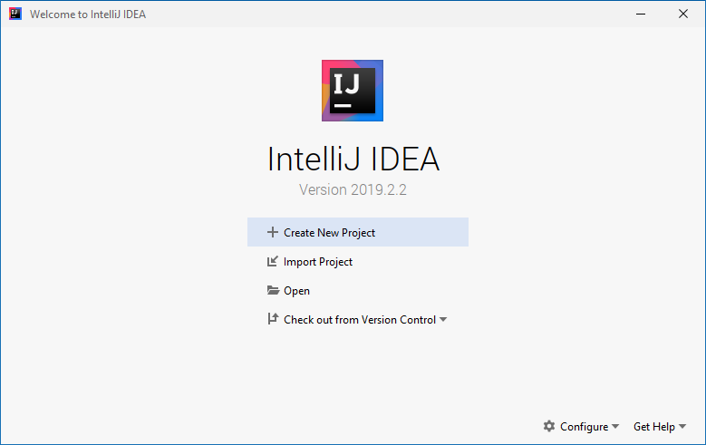
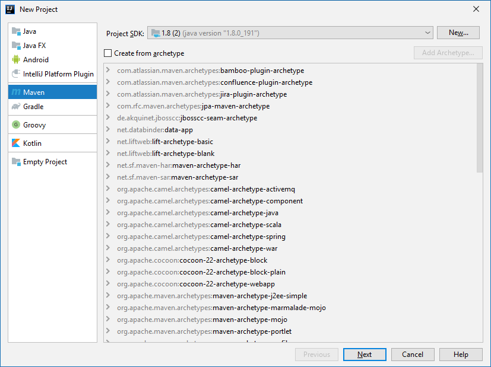
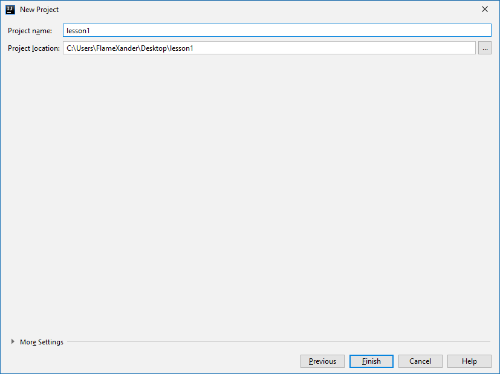
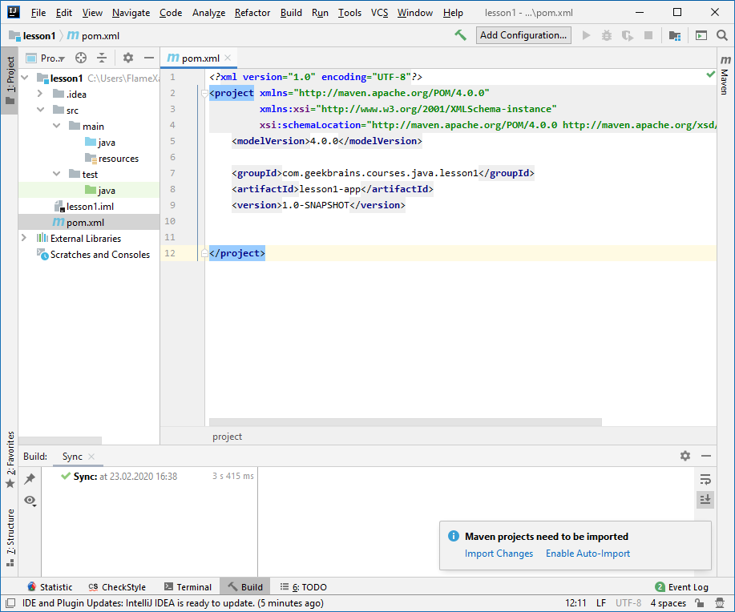
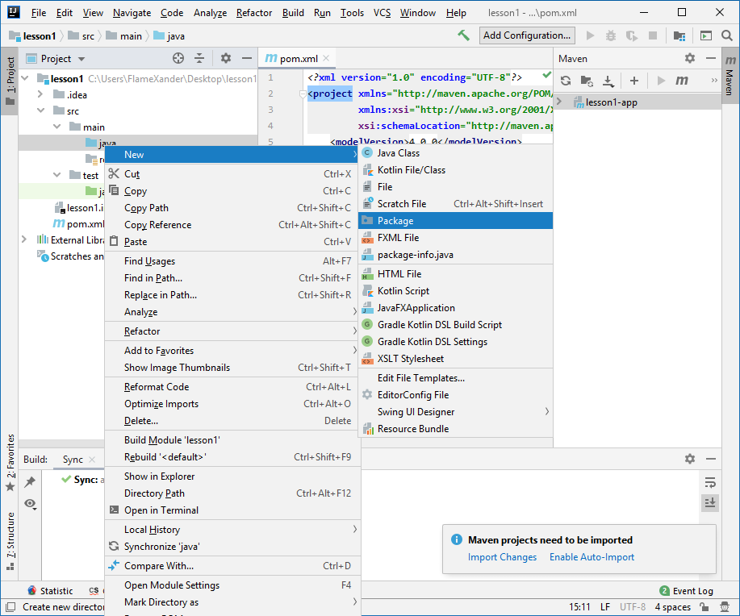
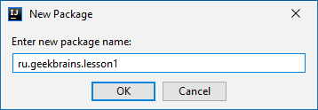
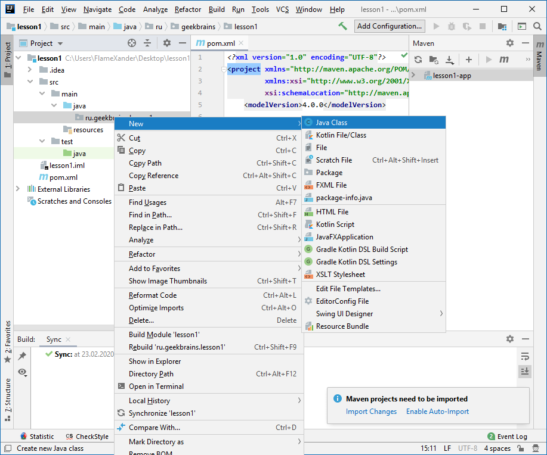
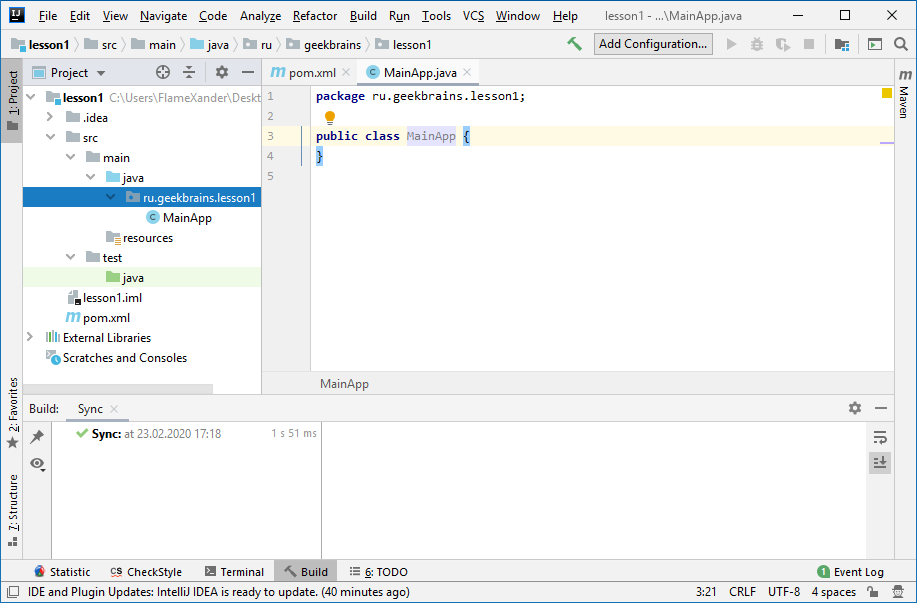

# Java Уровень 1

[Особенности платформы Java](#особенности-платформы-Java)

[Инструменты разработчика](#инструменты-разработчика)

[Создаем новый проект](#создаем-новый-проект)

> [Первая программа](#первая-программа)
>
> [Переменные и типы данных](#переменные-и-типы-данных)

[Арифметические операции](#арифметические-операции)

[Ещё одна простая программа](#ещё-одна-простая-программа)

[Методы](#методы)

[Условный оператор if](#условный-оператор-if)

> [В конце урока вы узнали ответы на
> вопросы:](#в-конце-урока-вы-узнали-ответы-на-вопросы)
>
> [В конце урока научитесь:](#в-конце-урока-научитесь)
>
> [Домашнее задание](#домашнее-задание)

[Дополнительные материалы](#дополнительные-материалы)

[Используемая литература](#используемая-литература)

[Подсказки по домашнему заданию](#подсказки-по-домашнему-заданию)

# Введение в платформу Java

Введение в платформу Java, инструменты разработчика, написание первой программы. Переменные, типы данных, арифметические операции. Методы. Условные операторы.

# Особенности платформы Java

| Преимущество                                       | Описание                                                                                                                                                                                                                                                                                                                                                              |
|----------------------------------------------------|-----------------------------------------------------------------------------------------------------------------------------------------------------------------------------------------------------------------------------------------------------------------------------------------------------------------------------------------------------------------------|
| Простота                                           | Язык Java обладает лаконичными, тесно связанными друг с другом и легко усваиваемыми языковыми средствами, был задуман как простой в изучении и  эффективный в употреблении язык программирования.                                                                                                                                                                     |
| Безопасность                                       | Java предоставляет безопасные средства для создания интернет-приложений.                                                                                                                                                                                                                                                                                              |
| Переносимость                                      | Программы на Java могут выполняться в любой среде, где есть исполняющая система Java (например, Windows, Linux, Android, MacOS и т.д.).                                                                                                                                                                                                                               |
| Объектно-ориентированный характер программирования | В Java воплощена современная философия объектно-ориентированного программирования.                                                                                                                                                                                                                                                                                    |
| Надежность                                         | Java уменьшает вероятность появления ошибок в программах благодаря строгой типизации данных и выполнению соответствующих проверок во время выполнения. Java исключает ошибки по работе с памятью за счет автоматического управления резервированием и освобождением памяти.                                                                                           |
| Многопоточность                                    | Язык Java обеспечивает встроенную поддержку многопоточного программирования и предоставляет множество удобных средств для решения задач синхронизации процессов. Это позволяет строить устойчиво работающие интерактивные системы.                                                                                                                                    |
| Архитектурная независимость                        | Язык Java не привязан к конкретному типу вычислительной машины или архитектуре операционной системы и следует принципу «написано однажды -- работает всегда».                                                                                                                                                                                                         |
| Интерпретируемость и высокая производительность    | Java предоставляет байт-код, обеспечивающий независимость от платформы. Компилируя программы в промежуточное представление, называемое байт-кодом, Java позволяет создавать межплатформенные программы, которые будут выполняться в любой системе, где реализована виртуальная машина JVМ. Байт-код Java максимально оптимизируется для повышения производительности. |

# Инструменты разработчика

Для написания программ необходимо установить инструменты разработчика
Java Development Кit (JDK), которые свободно предоставляется компанией
Oracle. JDK версии 8 можно загрузить [здесь](https://www.oracle.com/technetwork/java/javase/downloads/jdk8-downloads-2133151.html)

Восьмая версия JDK не является самой последней в настоящий момент,
однако ее более чем достаточно для того, чтобы начать изучение языка
Java.

Бесплатную версию среды разработки IntelliJ IDEA Community Edition можно
скачать с [сайта](https://www.jetbrains.com/idea/#chooseYourEdition) разработчиков:

При создании первого проекта в IntelliJ IDEA необходимо указать путь к
установленному JDK, как показано на рисунке ниже. Project SDK -\> New
-\> JDK -\> путь к папке jdk1.x.x_xxx.


# Создаем новый проект

При запуске IntelliJ IDEA появляется окно вида:



Для создания нового проекта выбираем пункт Create New Project.



На появившейся странице слева выбираем **Maven**. Это означает что наш
проект будет использовать инструмент управления и сборки проекта Apache
Maven. В пункте Project SDK должны быть прописана ссылка на JDK.


Теперь указываем идентификаторы проекта GroupId, ArtifactId и Version.
**GroupId** - идентификатор вашего проекта среди всех остальных
проектов, как правило, GroupId начинается с доменного имени, потом может
идти название организации/отдела/имени разработчика (элементы этого
идентификатора разделяются точками, аналогично пакетам, с которыми вы
позднее познакомитесь), и потом название проекта (например,
ru.geekbrains.courses.java.alex1234.lesson1, org.apache.maven,
com.flamexander.calculator). **ArtifactId** - имя самого проекта
(например, lesson1-app, calculator). Version - версия проекта.



Теперь осталось выбрать имя проекта и нажать кнопку Finish. Получим
проекта вида:



Файл pom.xml является основным конфигурационным файлом проекта. Сразу
после создания проекта желательно сделать несколько вещей: указать
версию языка, и включить авто-импорт настроек. На рисунке ниже показано
как это сделать.


**1.** Внутри элемента \<project\>\</project\> прописывается элемент
\<properties\>\</properties\> внутри которого указывается версия языка.
В данном случае выбрана версия 1.8, если вы используете JDK 13, то
вместо 1.8 необходимо написать 13.

**2.** Каждый раз, когда вы вносите
изменения в pom.xml необходимо их применять, чтобы обновление
происходило автоматически можно включить авто-импорт настроек, кликнув
Enable Auto-Import.

**3.4.** Авто-импорт не реагирует на изменение
версии языка поэтому нужно войти в панель управления Maven (3) и нажать
кнопку (4) Reimport All Maven Settings. На этом подготовительная работа
закончена.

Теперь немного о структуре проекта. В папке **src \> main \> java**
будут храниться исходники вашего приложения. **src \> main \>
resources** отвечает за ресурсы, которые должны быть упакованы в
итоговую сборку проекта. **src \> test \> java** предназначена для
написания тестов. На первом этапе изучения языка вам нужна только папка
**src \> main \> java.**

Для того чтобы начать писать код, нажимайте правой кнопкой на **src \>
main \> java** и выбирайте пункт **New \> Package**.



В появившемся окне указываете рабочий пакет. Имя пакета состоит из
набора элементов, разделенных точками. Первым элементом является
доменное имя (ru, com, org и т.д.), далее может идти наименование
организации/отдела/ваше имя, и потом название проекта. Можете указать
ru.geekbrains.lesson1



**Важно!** В названии элементов пакета (в примере выше это ru,
geekbrains, lesson1) не следует использовать спец символы (кроме
нижнего подчеркивания), заглавные буквы, начинать имя элемента с цифры.
Имя элемента также не может совпадать с ключевыми словами
зарезервированными языком Java.\
Более детально тема пакетов будет рассматривать на занятиях по
объектно-ориентированному программированию.

Пакеты нужны для организации структуры проекта. И по сути,
ru.geekbrains.lesson1 означает, что в папке java будет вложена папка ru,
в папке ru вложена geekbrains, а в geekbrains - lesson1. Наименование
пакетов никоим образом не связано ни с какими интернет адресами. Это
просто правило их именования.


После того как пакеты созданы, добавляете в него первый Java класс
(можете дать ему название MainApp, или любое другое, которое нравится,
главное чтобы первая буква в названии была заглавной, и каждое следующее
слово в названии также начиналось с заглавной буквы).



Если вы все правильно сделали то проект будет выглядеть вот так.



Как видите первой строкой в классе идет имя пакета с ключевым словом
package. В дальнейших примерах эта строка может быть опущена. Но, если
ваш класс находится внутри пакета, то эта строка (в данном случае
ru.geekbrains.lesson1) всегда будет первой в коде класса.

## Первая программа

Давайте посмотрим на то, как выглядит самая простая программа,
написанная на языке Java. Создадим новый проект и добавим в него класс
FirstApp.java.

```java
/**
 * Created by GeekBrains on 15.11.2018.
 */
public class FirstApp {
    public static void main(String[] args) {
        System.out.println("Hello, World!");
    }
}
```

В первых строчках кода мы видим так называемые комментарии, они могут
быть как однострочные (начинаются с символов //), так и многострочные
(блок текста, заключенный в /\* ... \*/). Комментарии упрощают работу с
кодом, разработчик может делать пометки, которые не будут влиять на
размер и скорость выполнения программы.

```java
// Однострочный комментарий
/*
...
Блочный комментарий
...
```

После комментариев идёт объявление класса FirstApp.

**Важно!** Имя класса должно совпадать с именем файла, в котором он
объявлен, т.е. класс FirstApp должен находиться в файле FirstApp.java

```java
public class FirstApp {
    public static void main(String[] args) {
        System.out.println("Hello, World!");
    }
}
```

Далее идёт объявление метода main(), с которого начинается исполнение
приложения.

**Важно!** Выполнение любой Java-программы начинается с вызова метода
main(). В одном классе может быть объявлен только один метод main().
Если методы main() объявлены в нескольких классах, то вы можете
выбирать с какого класса необходимо запускать ваше приложение.

Ключевое слово void сообщает компилятору, что метод main() не возвращает
значений. Методы могут также возвращать конкретные значения. Что такое
модификаторы доступа (public, private), ключевое слово static и
String\[\] args, будет объяснено позже, когда зайдет разговор об основах
ООП и массивах.

**Важно!** При написании кода на языке Java обязательно необходимо
учитывать регистр символов. (Main не равнозначно main, Void и void не
одно и то же, System не равнозначно system и т.д.)
**Важно!** Если вы работаете в IntelliJ IDEA, для упрощения/ускорения
написания метода main, вы можете пользоваться сокращением psvm.

В следующей строке кода System.out.println(\"**Hello, World!**\"),
которая находится в теле метода main(), в консоль выводится текстовая
строка **Hello, World!** с последующим переводом каретки на новую
строку. На самом деле вывод текста на экран выполняется встроенным
методом println(), который кроме текста может также выводить числа,
символы, значения переменных и т.д.

**Важно!** В языке Java все операторы обычно должны оканчиваться
символом ; . После закрытия кодовых блоков (там, где блок закрывается
скобкой } ) точка с запятой не ставится, потому что эти фигурные скобки
не являются операторами.

| **Практика!** Попробуйте создать новый Java проект в IntelliJ IDEA, добавить в него класс FirstApp, прописать в этом классе метод main() и код для вывода сообщения в консоль. Как только все это будет готово - запустите проект, и проверьте что в консоли выведено, то что указано в `System.out.println();` Если есть расхождения - сравните с кодом, представленным выше. |
|--------------------------------------------------------------------------------------------------------------------------------------------------------------------------------------------------------------------------------------------------------------------------------------------------------------------------------------------------------------------------------|
| **Дополнительно:** Попробуйте написать в круглых скобках `System.out.println()` какой-нибудь другой текст, целое или дробное число, и проверьте что получится.                                                                                                                                                                                                                 |

Теперь вы знаете как написать самую простую программу на языке Java и
запустить ее в IntelliJ IDEA.

## Переменные и типы данных

Переменные представляют собой зарезервированную область памяти для
хранения данных. В зависимости от типа переменной операционная система
выделяет память и решает, что именно должно в ней храниться.

В Java существует две группы типов данных.

- Примитивные.

- Ссылочные (объектные).

Существует 8 примитивных типов данных.

| Тип     | Описание                                                                        | Возможные значения                             | Пример                                        |
|---------|---------------------------------------------------------------------------------|------------------------------------------------|-----------------------------------------------|
| byte    | 8-битное знаковое целое                                                         | от -128 до 127                                 | `byte val = -120;`                            |
| short   | 16-битное знаковое целое                                                        | от -32768 до 32767                             | `short val = 12442;`                          |
| int     | 32-битное знаковое целое                                                        | от -2147483648 до 2147483647                   | `int val = 1000;`                             |
| long    | 64-битное знаковое целое                                                        | от -9223372036854775808 до 9223372036854775807 | `long val = 200000L;`                         |
| float   | 32-битное знаковое число с плавающей запятой одинарной точности                 | -                                              | `float val = 12.23f;`                         |
| double  | 64-битное знаковое число с плавающей запятой двойной точности                   | -                                              | `double val = -123.123;`                      |
| char    | 16-битный тип данных, предназначенный для хранения символов в кодировке Unicode | от '\u0000' до '\uffff' или от 0 до 65,535     | `char val1 = '*';`<br>`char val2 = '\u2242';` |
| boolean | логический тип данных                                                           | false, true                                    | `boolean val = false;`                        |

**Важно!** Если вы хотите указать float величину, то после числа необходимо поставить букву f. float floatVal = 12.24f; Если буква указана не будет, то
компилятор будет считать такое дробное число типом double. При использовании переменной типа long, после числа необходимо ставить букву L. long longValue =
20000000000L;
**Важно!** Если вы только начинаете программировать, то нет
необходимости запоминать количество бит для хранения переменной
определенного типа, или точные границы значений. Достаточно понять
какие значения, в каком типе можно хранить.
**Заметка.** Если вы только начали осваивать программирование, то
можете на первых этапах пользоваться для работы с целыми числами
переменными типа int, для дробных чисел float. А при дальнейшем
обучении разберетесь с остальными типами.

Ссылочных типов данных существует большое количество, кроме того, можно
создавать новые ссылочные типы, но обо всем этом будет рассказано на
следующих занятиях.

Общую структуру объявления переменной можно описать так:

```
[тип_данных] [идентификатор(имя_переменной)]; // объявление переменной
[тип_данных] [идентификатор(имя_переменной)] = [начальное_значение]; // объявление переменной с инициализацией
```

```java
public class FirstApp {
    public static void main(String[] args) {
        int a = 20;
        float b;
        b = 2.25f;
    }
}
```

Идентификаторы -- это имена переменных, которые начинаются с буквы, \$
или \_, после чего может идти любая последовательность символов.
Идентификаторы чувствительны к регистру.

**Важно!** Имена переменных должны быть написаны в camelCase - первая буква строчная, каждое следующее слово в имени с заглавной буквы и
без нижних подчеркиваний или пробелов. <br>
Правильные имена: floatValue, name, enginePower, firstName, lastName; <br>
Неправильные имена: Name, Title, EnginePower, First_name, last_name. <br>
Имя переменной не должно начинаться со спец символа (кроме нижнего подчеркивания) или цифры.

В качестве идентификаторов нельзя использовать ключевые слова Java .

**Заметка.** К ключевым словам языка Java относятся: abstract assert
boolean break byte case catch char class const continue default do
double else enum extends final finally float for goto if implements
import instanceof int interface long native new package private
protected public return short static strictfp super switch synchronized
this throw throws transient try void volatile while

Чтобы переменная не могла менять свое значение в процессе выполнения
программы, можно определить её как константу с помощью ключевого слова
final, если написать его перед указанием типа данных переменной.

```java
public class FirstApp {
    public static void main(String[] args) {
        final int a = 20;
    }
}
```

**Динамическая инициализация переменных.** Начальные значения переменных
могут рассчитываться на основе значений других переменных. В примере
ниже, для заполнения переменной volume используются значения переменных
radius и height.

```java
public class FirstApp {
    public static void main(String[] args) {
        float radius = 2.0f, height = 10.0f;
        // volume инициализируется динамически во время выполнения программы
        float volume = 3.1416f * radius * radius * height;
        System.out.println("Объем цилиндра равен " + volume);
    }
}
```

**Инициализация нескольких переменных в одну строку.** Если требуется
несколько переменных одного типа, их можно объявить в одном операторе
через запятую.

```java
public class FirstApp {
    public static void main(String[] args) {
        int x, y, z;
        x = y = z = 10; // присвоить значение 10 переменным x, y и z
        float d = 2.2f, e = 7.2f;
    }
}
```

# Арифметические операции

Вы можете выполнять обычные арифметические операции над числовыми
переменными.

| Операция | Описание                                  |
|----------|-------------------------------------------|
| `+`      | Сложение                                  |
| `-`      | Вычитание                                 |
| `*`      | Умножение                                 |
| `/`      | Деление                                   |
| `%`      | Деление по модулю                         |
| `++`     | Инкремент (приращение на 1)               |
| `+=`     | Сложение с присваиванием                  |
| `-=`     | Вычитание с присваиванием                 |
| `*=`     | Умножение с присваиванием                 |
| `/=`     | Деление с присваиванием                   |
| `%=`     | Деление по модулю с присваиванием         |
| `--`     | Декремент (отрицательное приращение на 1) |

Давайте посмотрим как это будет выглядеть в коде.

```java
public class FirstApp {
    public static void main(String[] args) {
        int a = 10;
        int b = 20;
        int c = (a + b - 5) * 2;
        System.out.println("c = " + c);
    }
}
```

В примере выше мы объявили и проинициализировали две целочисленные
переменные a и b, а затем объявили и проинициализировали переменную c,
которая вычисляется с использованием выражения, состоящего из набора
простых арифметических операций.

# Ещё одна простая программа

Вот так может выглядеть ещё одна программа, написанная на языке Java.

```java
public class FirstApp {
    public static void main(String[] args) {
        int a;
        int b;
        a = 128;
        System.out.println("a = " + a);
        b = a / 2;
        System.out.println("b = a / 2 = " + b);
    }
}
```

**Важно!**

- System.out.println(); отвечает за печать сообщений в консоль. В качестве аргумента вы можете подавать любые значения: строки, числа, объекты, логические типы
  данных и т.д.
- В процессе обучения вам постоянно придется пользоваться этим методом, поэтому с первого же занятия надо запомнить как он пишется.
- Если вы работаете в IntelliJ IDEA, то для быстрого набора этого метода можно использовать сокращение sout.

Выполнение начинается с первой строки метода main() и идет
последовательно сверху вниз. Первые две строки в методе main() означают
объявление двух целочисленных переменных с идентификаторами a и b. Затем
в переменную a записывается число 128 и выводится сообщение в консоль --
«a = 128». Затем значение переменной b вычисляется через значение
переменной a, как b = a / 2 (т.е. b = 128 / 2 = 64), и в консоль
выводится сообщение «b = a / 2 = 64».

# Методы

Общая форма объявления метода выглядит следующим образом.

```
тип_возвращаемого_методом_значения имя_метода (список_аргументов) {
   тело_метода;
}
```

Тип_возвращаемого_методом_значения обозначает конкретный тип данных
(int, float, char, boolean, String и т.д.), возвращаемых методом. Если
метод ничего не должен возвращать, указывается ключевое слово void. Для
возврата значения из метода используется оператор return.

```
return значение;
```

Для указания имени метода служит идентификатор «имя». Список аргументов
обозначает последовательность пар «тип_данных + идентификатор»,
разделенных запятыми. По существу, аргументы это набор данных,
необходимых для работы метода. Если для работы метода не требуются
аргументы, то оставляются пустые скобки - ().

Несколько примеров работы с методами.

```java
public class FirstApp {
    public static void main(String[] args) {
        // для вызова метода необходимо передать ему 2 аргумента типа int,
        // результатом работы будет целое число, которое напечатается в консоль
        System.out.println(summ(5, 5));

        // для вызова метода ему не нужно передавать аргументы,
        // и он не возвращает данные (метод объявлен как void)
        printSomeText();

        // для вызова метода передаем ему в качестве аргумента строку "Java",
        // которую он выведет в консоль
        printMyText("Java");
    }

    // метод возвращает целое число, принимает на вход два целых числа
    public static int summ(int a, int b) {
        // возвращаем сумму чисел
        return a + b;
    }

    // метод ничего не возвращает, не требует входных данных
    public static void printSomeText() {
        // печатаем Hello в консоль
        System.out.println("Hello");
    }

    // метод ничего не возвращает, принимает на вход строку
    public static void printMyText(String txtToPrint) {
        // выводим строку txtToPrint в консоль
        System.out.println(txtToPrint);
    }
}
```

При объявлении всех методов внутри основного класса программы после
public должно идти слово static. Если ключевое слово static будет
отсутствовать, этот метод не получится вызвать из метода main(). Смысл
этого ключевого слова будет пояснен на следующих занятиях в теме
«Объектно-ориентированное программирование».

# Условный оператор if

Условный оператор if позволяет выборочно выполнять отдельные части
программы. Ниже приведена простейшая форма оператора if.

```java
if(условие){
последовательность_операторов;
}
```

Здесь условие обозначает логическое выражение. Если (условие) истинно
(true), последовательность операторов выполняется, если ложно (false) --
не выполняется, например.

```java
public class FirstApp {
    public static void main(String[] args) {
        if (5 < 10) {
            System.out.println("5 меньше 10");
        }
    }
}
```

В данном примере числовое значение 5 меньше 10, и поэтому условное
выражение принимает логическое значение true, а следовательно,
выполняется метод println().

Рассмотрим ещё один пример с противоположным условием.

```java
public class FirstApp {
    public static void main(String[] args) {
        if (10 < 5) {
            System.out.println("Это сообщение никогда не будет выведено");
        }
    }
}
```

Теперь числовое значение 10 не меньше 5, а следовательно, метод
println() не вызывается, и в консоль ничего не выводится.

Могут быть использованы следующие операторы сравнения.

| Оператор | Значение         |
|----------|------------------|
| `<`      | Меньше           |
| `<=`     | Меньше или равно |
| `>`      | Больше           |
| `>=`     | Больше или равно |
| `==`     | Равно            |
| `!=`     | Не равно         |

Обратите внимание, что для проверки на равенство указывается два знака
равно.

Для проверки значения типа boolean используется запись.

```java
public class FirstApp {
    public static void main(String[] args) {
        boolean bool = true;
        if (bool) { // если bool == true
            // ...
        }
        if (!bool) { // если bool == false
            // ...
        }
    }
}
```

Ниже приведён пример программы, демонстрирующий применение оператора if.

```java
public class FirstApp {
    public static void main(String args[]) {
        // объявляем и инициализируем три переменные
        int a = 2, b = 3, c = 0;

        if (a < b) {      // если a меньше b
            System.out.println("a меньше b");
        }
        if (a == b) {    // если a равно b
            System.out.println("a равно b. Это сообщение не будет выведено");
        }
        c = a - b; // переменная с = 2 - 3 = -1
        System.out.println("с = " + c);
        if (c >= 0) {
            System.out.println("с не отрицательно");
        }
        if (c < 0) {
            System.out.println("c отрицательно");
        }
        c = b - a; // переменная с = 3 - 2 = 1
        System.out.println("с = " + c);
        if (c >= 0) {
            System.out.println("с неотрицательно");
        }
        if (c < 0) {
            System.out.println("c отрицательно");
        }
    }
}

// Результат:
// a меньше b
// с = -1
// с отрицательно
// с = 1
// с неотрицательно
```

Ещё один вариант условного оператора if-else представлен ниже. Если
условие верно, выполняется последовательность_операторов_1, если нет --
последовательность_операторов_2 (из блока else).

```
if(условие){
    последовательность операторов 1
} else {
    последовательность операторов 2
}
```

При использовании условий можно составлять более сложные конструкции с
помощью логических операторов И(&&) и ИЛИ(\|\|).

```
if (условие1 &&условие2) {
    ...
}
if (условие1 ||условие2) {
    ...
}
if ((условие1 && условие2)|| условие3) {
    ...
}
```

В первом случае (логическое И) для выполнения кода из блока if,
необходимо чтобы и условие1, и условие2 одновременно были верны. Во
втором случае (логическое ИЛИ) достаточно, чтобы хотя бы одно из условий
было верно.

## В конце урока вы узнали ответы на вопросы:

1) С чего начинается выполнение программы на языке Java?

2) Как выглядит объявление метода main?

3) Какие примитивные типы данных представлены в Java, и что в них можно хранить?

4) Что такое переменные и зачем они нужны?

5) Каких правил следует придерживаться при именовании переменных и методов?

6) Что такое методы и зачем они нужны? Что подразумевается под фразой "метод возвращает целочисленное значение"?

7) Для чего нужны условия, что они позволяют сделать?

## В конце урока научитесь:

1) Создавать новый проект в IntelliJ IDEA;

2) Создавать метод main();

3) Объявлять и инициализировать переменные;

4) Выводить сообщения в консоль с помощью System.out.println();

5) Создавать новые методы;

6) Писать хотя бы простые условия (без &&, \|\|, else);

## Домашнее задание

1. Создать пустой проект в IntelliJ IDEA и прописать метод main().

2. Создать переменные всех пройденных типов данных и инициализировать их значения.

3. Написать метод вычисляющий выражение a \* (b + (c / d)) и возвращающий результат,\ где a, b, c, d -- аргументы этого метода, имеющие тип float.

4. Написать метод, принимающий на вход два целых числа и проверяющий, что их сумма лежит в пределах от 10 до 20 (включительно), если да - вернуть true, в
   противном случае - false.

5. Написать метод, которому в качестве параметра передается целое число, метод должен напечатать в консоль, положительное ли число передали или отрицательное.
   *Замечание: ноль считаем положительным числом.*

6. Написать метод, которому в качестве параметра передается целое число. Метод должен вернуть true, если число отрицательное, и вернуть false если
   положительное.

7. Написать метод, которому в качестве параметра передается строка, обозначающая имя. Метод должен вывести в консоль сообщение «Привет, указанное_имя!».

8. \*Написать метод, который определяет, является ли год високосным, и выводит сообщение в консоль. Каждый 4-й год является високосным, кроме каждого 100-го,
   при этом каждый 400-й -- високосный.

*Если выполнение задач вызывает трудности, можете обратиться к последней
странице методического пособия. Для задач со \* не нужно искать решение
в интернете, иначе нет смысла их выполнять..*

**Рекомендации по оформлению кода домашнего задания**

```java
public class JavaApp {
    public static void main(String[] args) {
        // вызов метода напечатает результат в консоль
        printSomething();
        // если метод что-то возвращает, его вызов лучше закинуть в
        // System.out.println(), чтобы увидеть результат работы в консоли
        System.out.println(mulBy2(10));
        // ...
    }

    // метод ничего не возвращает
    public static void printSomething() {
        System.out.println("Java");  // печатается результат работы метода
    }

    // метод обязан вернуть целое число
    public static int mulBy2(int value) {
        // метод возвращает результат без печати
        return value * 2;
    }

    // ...
}
```

Комментарии проставлены для объяснения работы кода, так их прописывать
при выполнении домашнего задания не обязательно.

# Дополнительные материалы

1. К. Сьерра, Б. Бейтс Изучаем Java // Пер. с англ. -- М.: Эксмо, 2012. - 720 с.

2. Кей С. Хорстманн, Гари Корнелл Java. Библиотека профессионала. Том 1. Основы // Пер. с англ. -- М.: Вильямс, 2014. - 864 с.

3. \[ Если набрались опыта в написании кода на Java и хотите понять основы Git \] https://youtu.be/SQUcNEO8fxU

# Используемая литература

1. Брюс Эккель Философия Java // 4-е изд.: Пер. с англ. - СПб.: Питер, 2016. - 1168 с.

2. Г. Шилдт Java 8. Полное руководство // 9-е изд.: Пер. с англ. - М.: Вильямс, 2015. - 1376 с.

3. Г. Шилдт Java 8: Руководство для начинающих. // 6-е изд.: Пер. с англ. - М.: Вильямс, 2015. - 720 с.

# Подсказки по домашнему заданию

1) Объявление метода main():\
   > public static void main(String\[\] args) { }

2) Создать переменные типов: byte, short, int, long, float, double,
   > char, boolean;

3) public static int calculate(int a, int b, int c, int d) {\
   > ...\
   > }

4) public static boolean task10and20(int x1, int x2) {\
   > ...\
   > }

5)

 ```java
public static void isPositiveOrNegative(int x) {
    if (...){
        System.out.println(...);
    } else{
        System.out.println(...);
    }
}
 ```

6)

```java
public static boolean isNegative(int x) {
    if (...){
        return true;
    }
    return false;
}
   ```

7)

```java
public static void greetings(String name) {
    System.out.println(...);
}
```

*Вместо ... подставляете ваш код. Представлены не все существующие
решения, возможно вы найдете свое.*

*Как пропишите все методы, метод main() может выглядеть так:*

```java
public class JavaApp {
    public static void main(String[] args) {
        System.out.println(calculate(2, 2, 2, 2));
        System.out.println(task10and20(5, 6));
        isPositiveOrNegative(-30);
        // ...
    }
}
```

**Если до этого момента все равно непонятно как подступиться к задачам
(такое вполне может быть и это не страшно), давайте разберем
какой-нибудь пример.**

**Задание**: Написать метод, принимающий на вход три целых числа и
проверяющий, что их сумма больше 50 (включительно), если да -- вернуть
true, в противном случае -- false.

Разбираем задание по кускам и пишем код: ***Написать метод***

```java
public static void methodName() {

}
```

Как нас и просили в задаче метод мы написали. Теперь дальше:
***принимающий на вход три целых числа***. Это значит у метода три
аргумента, а раз целых числа то это вероятнее всего int. Корректируем
код.

```java
public static void methodName(int a, int b, int c) {

}
```

Последняя часть: ***и проверяющий, что их сумма больше 50
(включительно), если да -- вернуть true, в противном случае -- false.***
Если речь идет о возврате то тип метода меняется с void на какой-нибудь
другой. Так как нас просят вернуть true или false, то это тип boolean. И
в будущем в методе добавится оператор return.

```java
public static boolean methodName(int a, int b, int c) {

}
```

Теперь решаем центральный блок задачи: ***проверяющий, что их сумма
больше 50 (включительно).***

```java
public static boolean methodName(int a, int b, int c) {
    int sum = a + b + c;
    if (sum >= 50) {
        return true;
    } else {
        return false;
    }
}
```

Блок if может быть написан гораздо компактнее и проще. Но если вы
разбираетесь с программированием с нуля, не стоит жертвовать понятностью
кода. Поэтому пока берем такой вариант.

Наш метод готов, задача почти решена, осталось дать методу нормальное
имя.

```java
public static boolean isSumGreaterThan50(int a, int b, int c) {
    int sum = a + b + c;
    if (sum >= 50) {
        return true;
    } else {
        return false;
    }
}
```

**Задача решена!** Вот мы пошагово прошлись по одной задаче, попробуйте
использовать подобный подход для решения ваших задач.
