### [Назад к оглавлению](../../../../../README.md)

# Архитектура

## Оглавление

- [Монолитная архитектура](#Монолитная-архитектура)
- [Микросервисная архитектура](#Микросервисная-архитектура)
- [Отличия микросервисной и монолитной архитектуры](#Отличия-микросервисной-и-монолитной-архитектуры)
- [Виды межсервисного взаимодействия](#Виды-межсервисного-взаимодействия)
    - [Клиент и сервер](#Клиент-и-сервер)
    - [Синхронное взаимодействие](#Синхронное-взаимодействие)
    - [Асинхронное взаимодействие](#Асинхронное-взаимодействие)
    - [Как сервисы обмениваются информацией](#Как-сервисы-обмениваются-информацией)
- [Архитектурные паттерны](#Архитектурные-паттерны)
    - [Многоуровневый шаблон](#Многоуровневый-шаблон)
    - [Каналы и фильтры](#Каналы-и-фильтры)
    - [Model-View-Controller](#Model-View-Controller)
- [Как покрывать тестами разные уровни программы](#Как-покрывать-тестами-разные-уровни-программы)
    - [Сколько проверок каждого вида нужно приложению](#Сколько-проверок-каждого-вида-нужно-приложению)
        - [Расчёт на примере приложения](#Расчёт-на-примере-приложения)
        - [Ручные тесты](#Ручные-тесты)
        - [E2E-тесты](#E2E-тесты)
        - [Интеграционные тесты](#Интеграционные-тесты)
        - [Юнит-тесты](#Юнит-тесты)
    - [Когда запускают тесты разных уровней](#Когда-запускают-тесты-разных-уровней)
        - [Ориентироваться на пирамиду тестирования](#Ориентироваться-на-пирамиду-тестирования)
        - [Выполнять автотесты в несколько потоков](#Выполнять-автотесты-в-несколько-потоков)
        - [Когда запускать тесты](#Когда-запускать-тесты)
    - [Как оценивать покрытие](#Как-оценивать-покрытие)
        - [Юнит-тесты](#Юнит-тесты-2)
        - [Е2E-тесты](#Е2E-тесты)
        - [Интеграционные](#Интеграционные)

## Монолитная архитектура

Современные приложения часто состоят из трёх слоёв:

- **База данных** — здесь хранятся все данные, которые нужны приложению.
- **Бизнес-логика**, или бэкенд, где описана функциональность приложения. Бэкенд обращается к базе, когда нужно что-то сделать с данными.
- **UI** — через этот слой пользователь видит функциональность приложения и может с ним взаимодействовать. У некоторых приложений нет UI.

Приложение с монолитной архитектурой строится так:

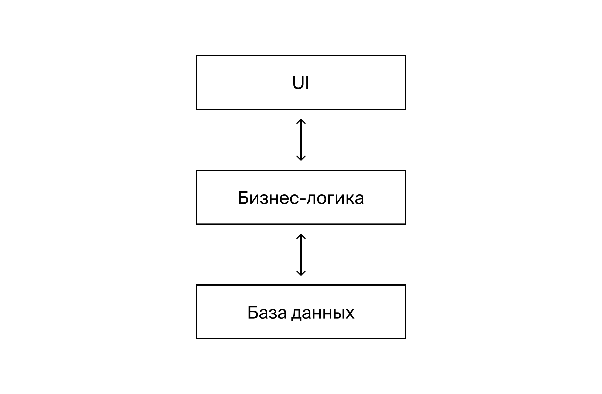

Слои приложения составляют монолит — единую структуру, в которой все части тесно связаны. Это похоже на стену из кирпичей, которую залили бетоном: нельзя что-то
переделать, не ломая её целиком.

**Пример**. Представь приложение интернет-магазина с функциональностью:

- каталог товаров и акций на них;
- реестр пользователей и их персональных скидок;
- заказ товаров, обработка, оплата и отслеживание.

Если разрабатывать такое приложение с монолитной архитектурой, получится три блока:

- база данных с таблицами для заказов, покупателей и товаров;
- бэкенд для действий с этими сущностями — например, в виде REST API;
- UI, который обращается к бэкенду и отображает функциональность для пользователей.

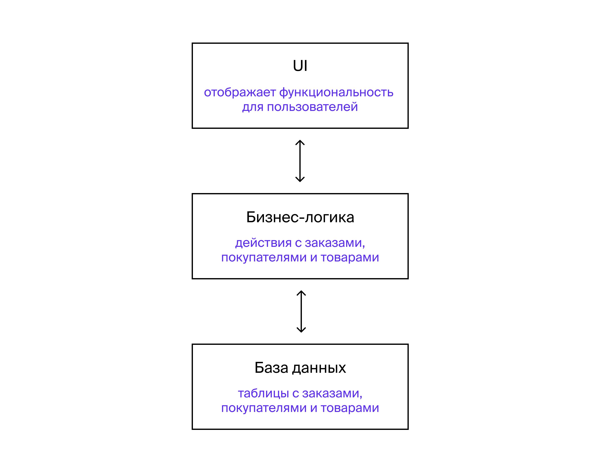

Главная особенность монолитной архитектуры — слои не делятся на части. Например, слой бизнес-логики будет отвечать сразу за всю функциональность приложения:
товары, пользователи, заказы и все действия с ними.

Если нужно написать небольшое приложение, которое не будет развиваться и усложняться, монолитная архитектура подойдёт. Ключевые плюсы: скорость разработки,
простота развёртывания и производительность.

Если функциональность будет развиваться, в монолите станет больше связей. С таким проектом сложно работать.

## Микросервисная архитектура

В микросервисной архитектуре приложение делится на сервисы. Это небольшие части, которые отвечают за отдельную функциональность.

У каждого микросервиса — конкретная, небольшая и независимая задача. При этом они не полностью автономны: микросервисы могут передавать друг другу информацию.

Схематично приложение с микросервисной архитектурой выглядит так:

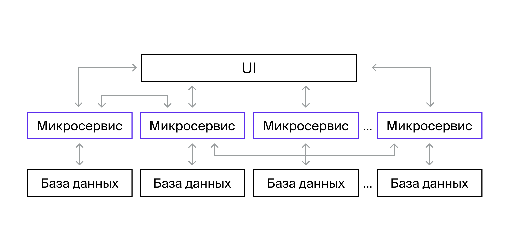

Каждый микросервис связан со своей базой данных. В ней хранятся только те данные, которые относятся к его функциональности. К другим базам у микросервиса нет
доступа.

Чаще всего из микросервисов состоит только слой бизнес-логики, а UI остаётся монолитом.

**Пример**. Если разрабатывать приложение интернет-магазина с микросервисной архитектурой, бизнес-логику можно разделить на блоки: заказы, пользователи и
товары. Получится три микросервиса. Вместо одной базы данных будет три: с заказами, пользователями и товарами.

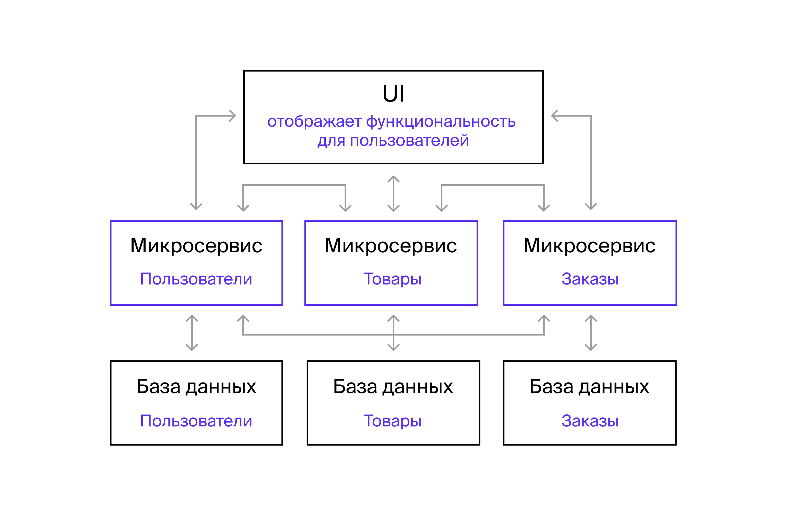

Микросервисная архитектура позволяет быстро внедрять изменения без потери качества, поэтому по ней построены многие приложения.

### Отличия микросервисной и монолитной архитектуры

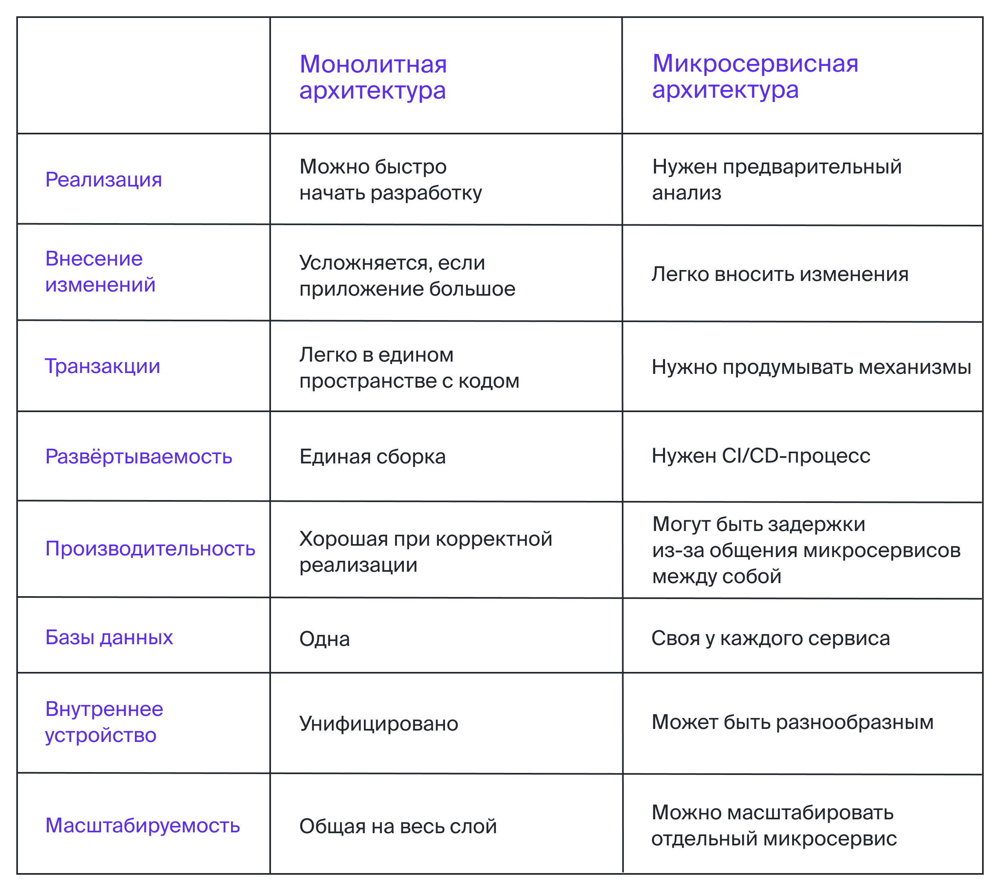

## Виды межсервисного взаимодействия

### Клиент и сервер

Ты уже знаешь, как взаимодействуют клиент и сервер в веб-приложениях. Клиент запрашивает информацию от сервера.

Сервисы тоже могут обмениваться данными по такой схеме.

**Пример**. В интернет-магазине есть сервис, который обрабатывает заказы. Он подключён к очереди новых заказов. Очередь пополняется, когда покупатель оформляет
заказ.

Сервис не может ничего добавить в очередь. Он берёт заказы, обрабатывает их, а затем обращается к другим сервисам: один формирует платёжные документы, а второй
отправляет письмо о заказе на почту клиента.

В этом примере клиент — это сервис обработки заказов, а серверы — сервисы, которые формируют платёжные документы и отправляют сообщения.

### **Синхронное взаимодействие**

Один сервис отправляет запрос другому и ждёт, когда второй обработает данные. Когда сервис получает ответ, он его обрабатывает.

### **Асинхронное взаимодействие**

При асинхронном взаимодействии между клиентом и сервером есть посредник — **шина данных**, или **брокер сообщений**. Эта система, которая принимает запросы от
сервисов, сохраняет данные, а затем передаёт их другим сервисам.

Клиент отправляет запрос брокеру. Брокер отправляет его серверу или кладёт в очередь.

### Как сервисы обмениваются информацией

Чаще всего сервисы отправляют запросы и получают ответы двумя способами:

- **По протоколу HTTP**. Такой способ тебе уже знаком: у сервиса есть API, к которому могут обращаться другие сервисы.
- **Через шину данных**. Этот способ сложнее: нужно использовать дополнительные инструменты, которые помогают сервисам обмениваться данными. Например, Apache
  Kafka или RabbitMQ.

  Клиент отправляет сообщения брокеру, а брокер — серверу. С одним брокером может работать несколько сервисов. Это возможно, потому что запросы от сервисов
  асинхронны: работа сервисов не блокируется, пока они ждут ответа от сервера.

## Архитектурные паттерны

Многие приложения похожи по внутренней реализации. Они построены по шаблонам — **архитектурным паттернам**. Это типовые решения для задач, которые часто
встречаются в разработке.

Тебе уже
знаком [клиент-серверный шаблон](https://practicum.yandex.ru/learn/qa-automation-engineer-java/courses/e2bf18c2-97c5-43f8-af20-80c52142e6f2/sprints/10893/topics/d247495a-b71f-45c2-9263-1facc7ed4c03/lessons/029f1d48-4608-4582-a034-2ed492d0bd13/).
Есть и другие архитектурные паттерны.

### Многоуровневый шаблон

Многоуровневый шаблон используют, когда программу можно разложить на подзадачи — слои. Каждый слой передаёт информацию следующему, более высокому слою.

Чаще всего встречаются четыре слоя:

1. **Слой представления, или пользовательского интерфейса**. Отрисовывает UI и собирает информацию от пользователя: например, о запросах к приложению.
2. **Слой приложения, или сервиса**. Обрабатывает информацию с уровня представления, передает её на уровень ниже и получает ответ. Этот слой может добавлять,
   изменять и удалять данные из слоя доступа к данным. Иногда слоя приложения нет — тогда всё выполняется на уровне бизнес-логики.
3. **Слой бизнес-логики, или предметной области**. Это классы, которые описывают основные сущности и логику работы программы. Например, в программе для игры в
   шахматы в слое бизнес-логик описаны поле, фигуры и возможные ходы.
4. **Слой доступа к данным, или хранения данных**. Отвечает за взаимодействие с БД или другими источниками данных.

### Каналы и фильтры

Этот шаблон подходит для программ, которые производят и обрабатывают потоки данных. Пример такой программы — компилятор.

По **каналу** передаётся написанный код, а **фильтры** анализируют и компилируют его.

### Model-View-Controller

Паттерн **MVC** (от англ. Model-View-Controller, «модель-представление-контроллер») подходит для программ, которые взаимодействовуют с пользователем.

Программу делят на три части:

1. **Модель**содержит ключевые данные и функциональность.
2. **Представление**показывает информацию пользователю. Представлений может быть несколько.
3. **Контроллер**обрабатывает данные от пользователя.

Например, перед тобой лежит собака. То, что ты видишь, — это **представление** собаки.

Когда ты с ней взаимодействуешь — чешешь за ухом — её нервная система получает информацию об этом.

Нервная система — это **контроллер**. Она передаёт сигналы в мозг — **модель**. Мозг передаёт обратный сигнал, и представление меняется: собака начинает дрыгать
лапой.

В приложении это устроено так:

- **Представление**— пользовательский интерфейс.
- **Контроллер**— обработчик событий, которые запускает пользователь.
- **Модель**— метод, который выполняет операции. Его запускает контроллер.

Обычно модель, представление и контроллер связаны так:

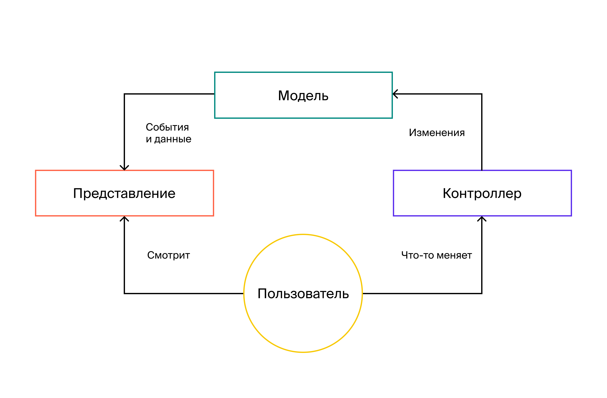

Схема не всегда такая. Во многих веб-приложениях модель и вид не взаимодействуют. Модель отдаёт данные контроллеру, а он передаёт их виду. Затем вид меняет
интерфейс.

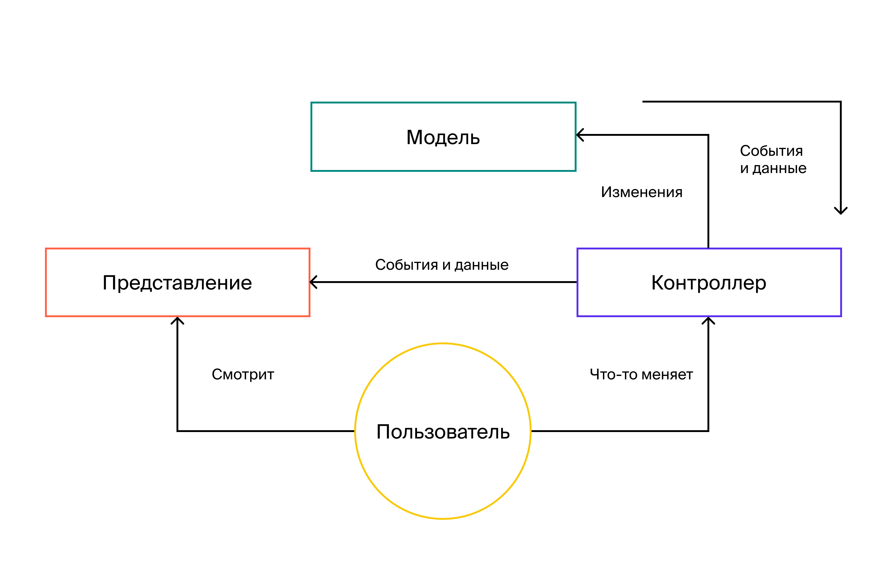

**Пример**. Части банковского приложения могут взаимодействовать так:

1. Пользователь взаимодействует с видом — интерфейсом: например, выпускает карту.
2. Запрос уходит на сервер: там контроллер получает запрос и определяет, какой метод API вызвать.
3. Модель выполняет бизнес-операции: регистрирует карту в базе данных, присваивает номер.
4. Модель отправляет данные — например, код 200 и номер карты — обратно в контроллер.
5. Контроллер передаёт эти данные в вид.
6. Пользователь видит в интерфейсе новую карту и её номер.

**Преимущества**. Этот паттерн помогает отделить внутреннее представление информации — бэкенд от представления пользователя — фронтенда.

В MVC компоненты изолированы. Например, можно полностью переписать любой из компонентов, не меняя остальные.

Ещё один плюс — можно использовать код повторно: иногда один и тот же компонент подходит для разных задач. Например, в контроллере приложения есть метод для
сортировки. Через него можно сортировать и новости, и товары.

# Как покрывать тестами разные уровни программы

Как ты знаешь, разные виды тестов выстраиваются в пирамиду тестирования.

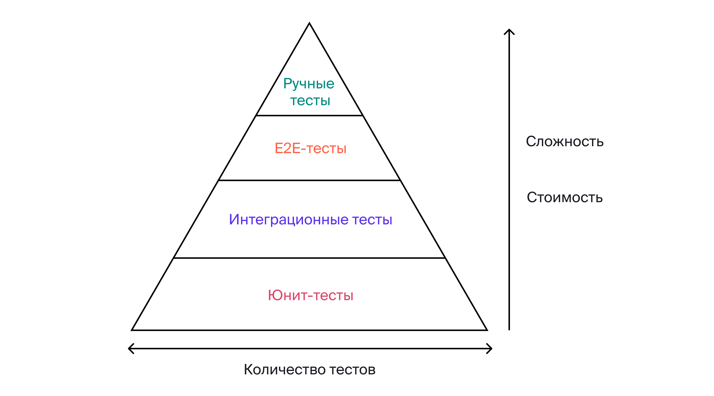

## Сколько проверок каждого вида нужно приложению

Универсального ответа нет: всё зависит от конкретного проекта.

Представь сервис со сложной бизнес-логикой. В коде много методов — а значит, и юнит-тестов.

А может быть наоборот: архитектура простая, а вот API-методов много. Юнит-тестов получится даже меньше, чем интеграционных.

### Расчёт на примере приложения

Посмотри, как распределятся тесты по уровням пирамиды в сервисе [Mesto](https://qa-mesto.praktikum-services.ru/).

Приложение состоит из нескольких слоёв:

- программный код с основными и вспомогательными методами;
- ручки и API-методы, с которыми работает фронтенд;
- UI — с ним работает пользователь через браузер.

Представь, что автотестами покрыты все три уровня. Получается, программный код покрыт юнит-тестами, ручки — интеграционными, а UI — E2E-тестами.

Чтобы считать было проще, представь, что написали только позитивные и негативные тесты. В реальности вариантов больше.

Например, поле ввода электронного адреса можно оставить пустым, ввести некорректный или несуществующий e-mail. Эти три ситуации можно назвать «негативный тест».

### Ручные тесты

Сперва функциональность Mesto проходит через ручных тестировщиков. Они готовят тест-кейсы.

Затем автоматизаторы пишут код, чтобы не проверять функциональность вручную каждый раз.

Если подходить к тестированию так, ручных тестов будет меньше всего, ведь новую функциональность проверяют вручную только один раз. Пока это единственное, что
можно определить точно.

Можно сказать, во время первого релиза ручных тестов столько же, сколько E2E-тестов. Но потом их становится меньше из-за автоматизации.

### E2E-тесты

Следующий уровень пирамиды — E2E-тесты. Нужно проверить такие сценарии:

1. Проверка отображения данных на главной странице без аутентификации.
2. Регистрация.
3. Аутентификация.
4. Проверка отображения данных профиля и списка фотографий.
5. Добавление фотографии.
6. Удаление фотографии.
7. Лайк фотографии.
8. Изменение аватара профиля.
9. Изменение имени профиля.

Для сценариев 1 и 4 негативных проверок не будет: в них проверяют только корректное отображение UI.

Вспомни условие: есть только позитивные и негативные проверки. Получится **16 E2E-тестов**:

- 2 — только позитивные, потому что проверяется UI;
- 7 позитивных и 7 негативных — для остальных сценариев: по две проверки на каждый.

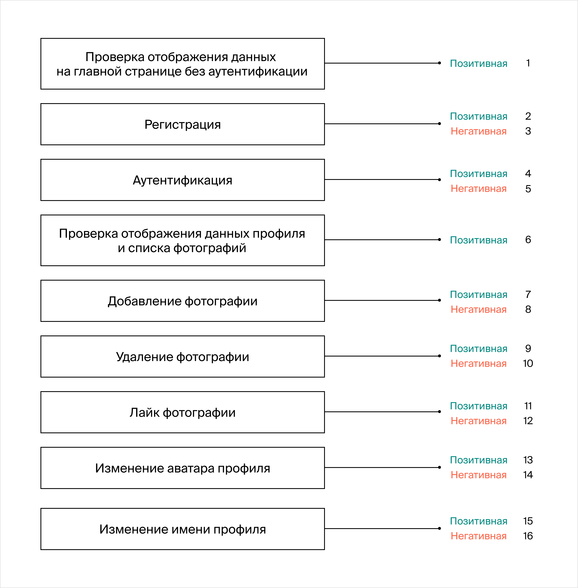

### Интеграционные тесты

Посмотри на доступные ручки и типы запросов, которые им соответствуют.

Каждый API-метод — отдельный сценарий для тестирования.

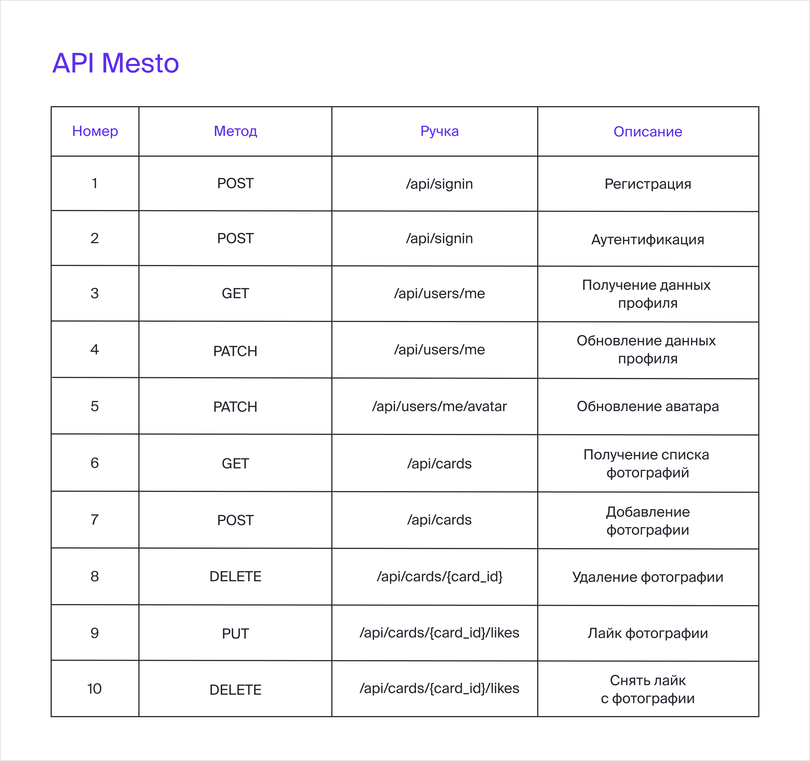

Для методов 3-10 нужны дополнительные негативные тесты. Они проверят, что нельзя обработать запрос без передачи токена.

Получится **28 интеграционных тестов**:

- 10 позитивных;
- 10 негативных;
- 8 негативных, связанных с аутентификацией.

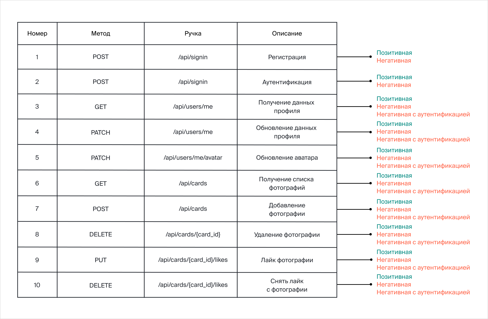

### Юнит-тесты

Как ты знаешь, юнит-тесты пишут на конкретные методы.

Сейчас у тебя нет доступа к исходному коду приложения. Не получится посчитать, сколько методов используют.

Это нормально: тестировщик не всегда видит исходный код. Чаще всего юнит-тестами занимается тот, кто эти методы создаёт, — разработчик.

Ты не можешь посчитать, сколько понадобится юнит-тестов. Но можно попробовать оценить на глаз.

Например, посмотри на метод `POST /api/cards`. Он добавляет фотографии на сайт. Скорее всего, его написали так:

- обработка входящего запроса;
- валидация полей — например, для e-mail и пароля;
- заполнение моделей данных, которые соответствуют ручке — например, модель данных фотографии или пользователя;
- обработка ошибок;
- подключение к базе данных;
- добавление значения в базу;
- считывание значения из базы;
- отправка ответа.

Получилось восемь действий. Для каждого нужен отдельный метод. На каждый метод разработчик напишет юнит-тест.

Если знать, сколько методов скрывается за каждой ручкой, можно прикинуть, сколько получится юнит-тестов.

Обрати внимание, что методы обработки входящего запроса, подключения к базе данных, добавления значения в базу, считывания значения из базы и отправки ответа
могут быть общими для нескольких ручек.

Примерное количество методов для всех ручек — 3 * 9 + 5 = **32 метода**:

- по 3 на каждую из 9 ручек;
- 5 общих методов.

## Когда запускают тесты разных уровней

Лучше всего запускать автотесты каждый раз, когда меняется код приложения. Тогда ты узнаешь, всё ли работает как нужно и где появились ошибки.

Такой вариант подойдёт, если автотестов мало: например, приложение небольшое или автоматизация только началась. Чем больше автотестов, тем дольше они
выполняются и тем позже команда узнает о результатах.

Есть несколько способов уменьшить время прогона.

### Ориентироваться на пирамиду тестирования

Пирамида показывает, что быстрых тестов нужно писать больше, чем медленных. Например, юнит-тестов должно быть больше, чем E2E. Тогда приложение будет хорошо
покрыто тестами, а прогон не займёт много времени.

Юнит-тест обычно выполняется несколько миллисекунд или десятков миллисекунд. В больших проектах бывают десятки тысяч юнит-тестов.

E2E-тест может длиться несколько минут. Чтобы ускорить прогон с тем же процентом покрытия, можно частично заменить E2E-тесты юнит-тестами. Например, вместо
десяти E2E-тестов написать один E2E и 10-15 юнит-тестов.

Если проект большой, со временем тестов становится много, даже если разрабатывать их по пирамиде тестирования. Тогда прогон занимает слишком много времени.

### Выполнять автотесты в несколько потоков

Ещё один способ ускорить прогон — выполнять
автотесты [в несколько потоков](https://practicum.yandex.ru/learn/qa-automation-engineer-java/courses/eaa09f96-5559-49b3-9805-4809d5f1ae8b/sprints/15046/topics/6841f513-7116-4718-bea3-47f7bc0b58ab/lessons/fab70d24-9690-4fe5-9083-d8f0e0dabd49/).
Чем больше потоков, тем быстрее пройдут тесты.

Обрати внимание: это правило работает не всегда. Если потоков много, нужна большая мощность серверов. Из-за этого сложнее распределить автотесты по потокам.

Тесты могут выполняться медленнее, если у потоков общие ресурсы: например, база с тестовыми данными. Придётся выбирать, какие проверки когда запускать.

### Когда запускать тесты

**Юнит-тесты** быстрые, поэтому их обычно запускают после каждой сборки приложения. Разработчик может быстро получить отчёт и продолжить писать код. Или
исправлять ошибки.

Для **интеграционных и E2E-тестов** есть разные варианты запуска.

✅ **«По кнопке»**. Тесты запускаются каждый раз, когда кто-то в команде решает, что нужен прогон. Обычно «кнопка» — это команда запуска автотестов в инструменте
CI/CD: например, Jenkins.

⏰ **По расписанию**. Команда решает, сколько раз в день и в какое время запускать тесты. Например, через планировщик заданий сервера CI/CD. Чаще всего тесты
запускают раз в день — ночью. Иногда бывает два прогона: ночью и в середине дня. Когда прогон занимает много времени, автотесты можно запускать не каждый день.
Например, если команда написала много E2E-тестов.

➡️ **Перед релизом**. Некоторые команды запускают все автотесты прямо перед релизом.

Обычно можно совмещать несколько вариантов, Например, автотесты выполняются по расписанию, но их можно запустить и вручную — «по кнопке».

**Другие способы**

Есть и другие способы сократить время прогона. Например, выполнять не все интеграционные и E2E-тесты, а только для той функциональности, которая изменилась.

Ты можешь комбинировать все эти способы. Например, на каждое изменение кода выполнять тест-сьют для этой функциональности, а по ночам делать полный прогон.

## Как оценивать покрытие

### Юнит-тесты-2

**По условиям.** Условие считается покрытым, если каждая ветвь решения выполнилась.

Например, условие `if (salary > salaryLimit)` покрыто частично: тест проверяет только вариант с зарплатой ниже лимита. Превышение не проверяется.

**По методам.** Метод считается покрытым, если он выполнился при тестировании хотя бы один раз.

Например, метод `calculateSalary` вызывается в тесте. Значит, он покрыт.

Вручную считать покрытие неудобно и долго. Помогают специальные инструменты. Один из самых популярных — **плагин Jacoco**.

### Е2E-тесты

E2E-тесты можно оценивать по требованиям и по тест-кейсам.

**По требованиям**. В идеальном мире происходит так: есть набор требований и набор тестов. С одним или несколькими пунктами требований можно сопоставить хотя бы
один из тестов.

Например, есть требование: «Нельзя зарегистрироваться дважды с одним и тем же электронным адресом». И есть тест со сценарием — регистрируемся один раз,
регистрируемся второй раз с тем же адресом. Требование покрыто.

Процент покрытия вычисляется так:

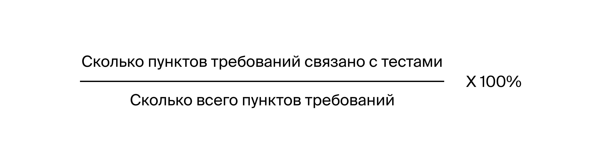

Например, есть 10 требований, а связанных тестов — 5. Процент покрытия — 50%.

**По тест-кейсам**. Можно сопоставить проверки с тест-кейсами и рассчитать покрытие так:

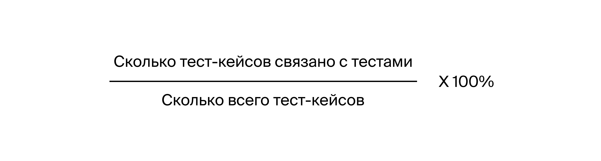

Например, для приложения составили 1000 тест-кейсов. Тесты написали на 500 из них. Значит, покрытие 500 / 1000 * 100 % = 50 %.

Такой подход точнее, чем способ с требованиями. В тест-кейсах указывают конкретные параметры, поэтому связать их с тестами проще.

**Тонкости.** Обрати внимание, что нужно следить за актуальностью тест-кейсов — и менять тесты, если что-то переписали.

### Интеграционные

Можно оценивать покрытие по тому, **сколько ручек API протестировано**:

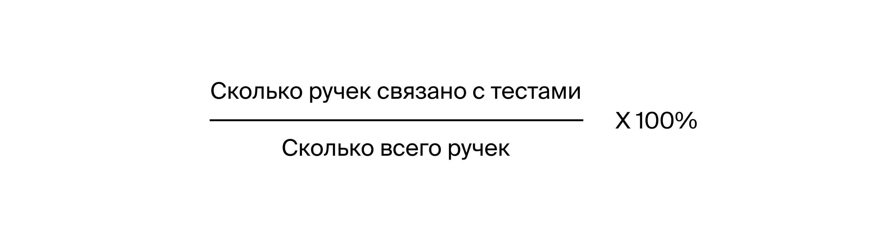

Например, API состоит из 50 ручек. Интеграционные тесты написали на 25. Значит, тестовое покрытие 25 / 50 * 100 % = 50 %.

**Минусы**. У этого подхода есть минус. Не учитывается, как детально протестированы обязательные параметры ручек. А ещё непонятно, применялись ли необязательные
параметры.

Например, есть ручка GET-запроса — она ищет пользователей. Искать можно по двум параметрам: ID пользователя и его имя.

Эти параметры необязательные. Можно не указывать их — тогда поиск идёт по всему сразу. Ещё можно указать один или сразу оба параметра.

На ручку написали два теста — на запрос без параметров и на запрос с ID. Теста на запрос с именем нет. Формально ручка покрыта, ведь тест на неё есть. Но поиск
по имени не проверили: он может не работать.

Если требования и тест-кейсы написаны для ручек API, можно оценивать покрытие так же, как в случае с E2E тестами.

### [Назад к оглавлению](../../../../../README.md)
