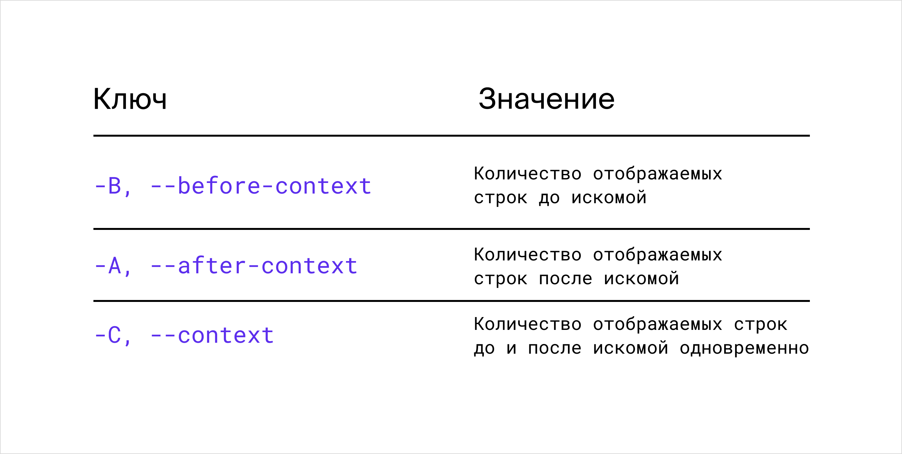
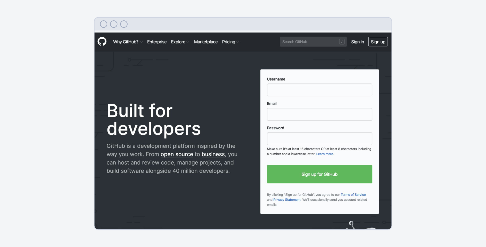
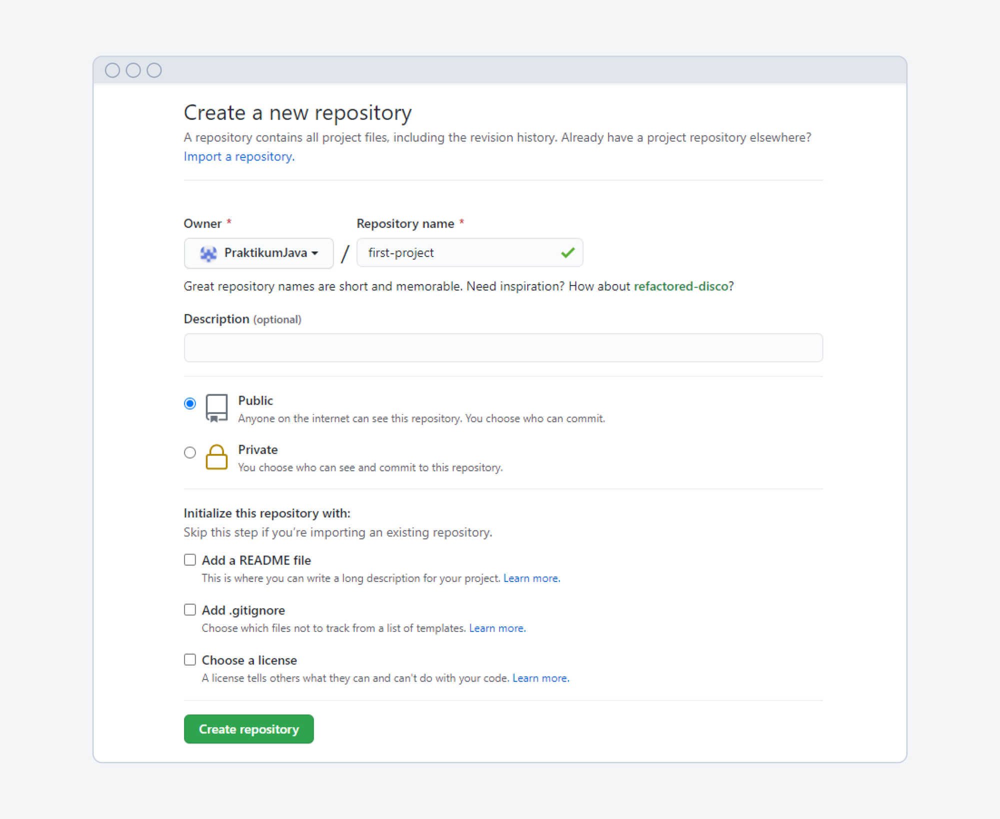
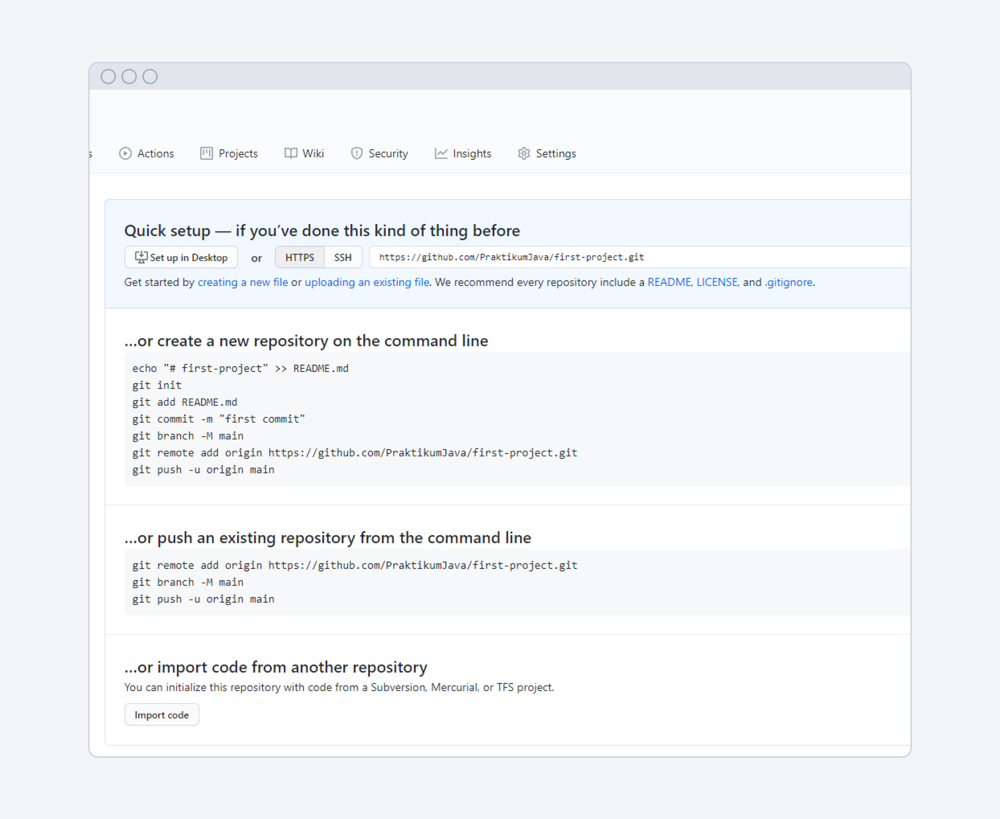
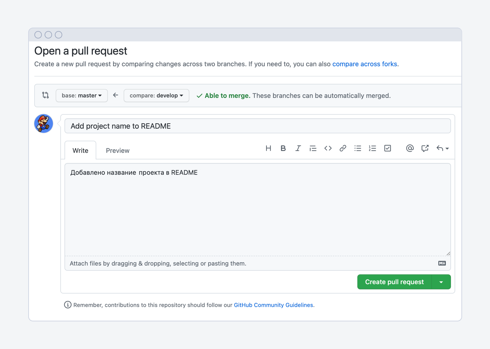

### [Назад к оглавлению](../../../../../README.md)

# Консоль

- `man date` — показать дополнительную информацию про команду `date`;
- `clear` — очистить консоль;
- `exit` — закрыть консоль;
- `pwd`— показать, в какой ты папке;
- `ls`— показать файлы в папке, где ты сейчас;
- `ls -a` — показать файлы и папки, включая скрытые;
- `cd first-project`— перейти в папку first-project;
- `cd first-project/qa`— перейти в папку qa, находящуюся в папке first-project;
- `cd ..`— перейти на уровень выше в родительскую папку;
- `cd ../..` — перейти на два уровня выше;
- `cd /` — перейти в корневую директорию;
- `cd ~`— перейти в домашнюю директорию;
- `mkdir second-project`— в текущей папке создать папку с именем second-project;
- `rm about.html`— удалить файл about.html;
- `rmdir images`— удалить папку images;
- `rm -r second-project`— удалить папку second-project и всё, что она содержит;
- `touch Main.java`— создать файл Main.java в текущей папке;
- `touch Main.java Cat.java`— если нужно создать несколько файлов, их имена можно вводить через пробел;
- `nano logs/2020/1/apache_2020-01-01.txt` — открыть текстовый файл apache_2020-01-01.txt;
- `echo "Who's morty?"` — вывести в окно терминала строку Who's morty?
- `echo "text" > filename` — записать строку text в файл filename;
- `echo "Who's morty?" > ~/logs/2020/1/secrets.txt` — записать строку Who's morty? в файл secrets.txt;
- `cat ~/logs/2020/1/apache_2020-01-01.txt` — вывести содержимое в окно терминала;
- `cat a.txt > b.txt` — перезаписать содержимое файла a.txt в b.txt;
- `cat a.txt >> b.txt` — скопировать содержимое файла a.txt в конец b.txt;
- `cp brothers.html sisters.html` — скопировать файл brothers.html и назвать новый файл sisters.html;
- `cp ../docs/brothers.html ../Documents/` — скопировать brothers.html в папку Documents;
- `mv card.txt ~/` — перенести card.txt из текущей директории в домашнюю;
- `mv my_app.ssh your_app.ssh` — переименовать файл my_app.ssh в your_app.ssh;
- `grep DELETE apache_2020-01-01.txt` — вывести все строки из файла apache_2020-01-01.txt, которые содержат DELETE;
- `grep -R DELETE ~/logs/2020/1` — вывести все строки внутри каталога, которые содержат DELETE;
- `grep -n DELETE apache_2020-01-01.txt` — вывести все строки и их номера из файла apache_2020-01-01.txt, которые содержат DELETE.

Чтобы вывести соседние строки, применяй ключи `-B`, `-A` и `-C`.



Иногда слово записывается в другом регистре или сокращённо. В этом случае можешь применять:

- ключ`–i`, который игнорирует регистр;
- символ астериск`*`, который заменит любое количество любых символов, например: `grep -i ERR* /test1/test2/test_Logs/Log1.txt`.
- `grep -i N[ua]m1 /test1/test2/test_Logs/Log1.txt` — найти совпадения по шаблону, где на месте второго символа может быть как u, так и a. Например, Num1, Nam1,
  num1, nam1.
- `.` — точка, заменяет один любой символ. `grep "204 3.96" ~logs/2020/1/apache_2020-01-01.txt`.
- `^` — означает начало строки. Команда выведет только те строки, в начале которых встречает указанный шаблон: `grep "^one" text.txt`.
- `$` — означает конец строки. Команда выведет только те строки, в конце которых встречает указанный шаблон: `grep "one$" text.txt`.

# Git

Git — это **система** **версионного контроля**. Иногда команда работает над кодом совместно: каждый разработчик пишет свои кусочки программы, а потом делится
ими с коллегами. Тут и пригодится Git.

Он нужен не только для коллективной работы. Git используют и для контроля версий личных проектов.

## Как установить Git

### Windows

Скачай и установи Git. [Ссылка на скачивание с официального сайта Git.](https://git-scm.com/download/)

Когда запустишь установщик, он предложит компоненты для установки. Среди них будет GitBash — это ещё одна программа для полноценной работы с Git. Обязательно
поставь галочку напротив неё.

Также поставь галочку на пункте «Использовать Git из командной строки» (Use Git from... the Command Prompt).

### macOS

Скачай и установи Git. [Ссылка на скачивание с официального сайта Git.](https://git-scm.com/download/)

Программа-установщик предложит варианты применения сервиса. Выбери «Использовать Git из командной строки» (Use Git from... the Command Prompt).

### Linux

Для Linux есть много версий. Найди подходящую в[разделе установки Git на Linux](https://git-scm.com/download/linux).

Для установки нужно использовать терминал. Найди программу Terminal в поиске или выбери её в списке программ.

Когда терминал откроется, найди команду установки Git для своей версии Linux. Скопируй её в терминал и нажми Enter.

## Как указать свои данные

Тебе нужно указать информацию о себе. Система будет привязывать её к твоим действиям. И коллеги смогут понять, какие из изменений — твои.

Открой терминал для macOS или Git Bash для Windows. Убедись, что Git установлен. Для этого запроси его версию:

```bash
git --version
```

Ты увидишь сообщение:

```bash
git version 2.17.1 # это пример; у тебя может быть другая версия Git
```

Укажи информацию о себе: имя пользователя и электронный адрес.

Пропиши их в файле `.gitconfig` — в нём хранятся глобальные настройки программы. Запусти утилиту `git config` в командной строке с опцией `--global`. Свои
данные укажи как значения свойств `user.name` и `user.email`:

```bash
git config --global user.name "Example Name"
# введи своё имя латиницей и в кавычках
```

```bash
git config --global user.email exampleName@mail.com
# здесь нужно ввести свой актуальный e-mail
```

Теперь проверь, что всё получилось: выполни команду `git config` с опцией `--list`.

```bash
git config --list
# вывели в окно командной строки список всех свойств конфига
```

Откроется перечень (Windows) или новый файл (macOS). Среди прочих свойств ты увидишь свои данные:

```bash
user.name=Example Name
user.email=exampleName@mail.com
```

Пользователям macOS нужно будет выйти из просмотра файла: нажать клавишу [**Q**]. Это сработает при включённой латинской раскладке.

### Не меняй имя, пока работаешь над проектом

Имя и e-mail в процессе разработки проекта менять нежелательно. Так:

- коллегам будет проще тебя узнать,
- удобнее смотреть свои собственные изменения.

### Где хранятся настройки

Неважно, в какой директории ты находишься в командной строке. Если нужно просмотреть или изменить настройки, вызов `git config--global` сработает отовсюду.

## Репозиторий

Это место, где хранятся данные, история их изменений и другая служебная информация. Проще говоря — там система собирает все сохранённые версии твоего проекта.

Обычно под каждый проект создают свой репозиторий.

### Создание локального репозитория Git

Сначала организуй для проекта рабочую директорию — папку с именем `java-learning`.

```bash
# Создали папку для проекта, назвали её java-learning.

mkdir java-learning
# создали папку java-learning в текущей директории
```

Создать папку недостаточно. Она не станет репозиторием автоматически.

Нужно сообщить системе, что файлы в этой папке предстоит отслеживать. Этот процесс называется **инициализацией**. Его запускают командой `git init` (от англ.
initialization, «инициализация»).

Инициализируй Git вызовом `git init`.

```bash
cd java-learning
# перешли в созданную папку java-learning

git init
# инициализировали git в папке java-learning
```

Команда `git init` создаёт в папке с проектом скрытую поддиректорию **.git.** Там будет храниться история изменений.

### Статусы файлов в Git

Версионный контроль в Git предполагает, что любой файл репозитория находится в одном из четырёх состояний:

1. **Неотслеживаемый** (англ. untracked).
2. **Добавленный** в индекс, индексируемый (англ. staged, «выдвинутый на плацдарм»).
3. **Изменённый** (англ. modified).
4. **Сохранённый**, на жаргоне разработчиков «коммит» или «закоммиченный» (англ. committed, «брошенный в бой»).

Логика такая: когда в инициализированной папке появляется файл, он попадает в состояние «неотслеживаемый». Ты можешь делать с файлом что-угодно — Git не будет
учитывать изменения.

Чтобы Git обратил внимание на этот файл, его нужно **добавить в индекс**. Так файл перейдёт в состояние «добавленный».

Если в добавленный файл внести изменения, он станет «изменённым».

Когда ты закончишь редактировать файл, его нужно будет сохранить. То есть сообщить Git, что текущее состояние файла следует запомнить. Тогда ты сможешь
вернуться к этой версии, если дальше что-то пойдёт не так.

Такое сохранение называют **коммитом**:


<aside>
📌 Обрати внимание: индексировать и сохранить файл — не одно и то же.

</aside>

Git следит за действиями с добавленным файлом. Но не сохраняет его обновления. Только фиксирует, что файл изменился. Как бы делает слепок каждого нового
состояния. Но этот слепок — всего лишь заготовка для коммита.

Коммит берёт последнее состояние файла из индекса и сохраняет его. Теперь оно будет храниться в памяти системы.

Команды Git, которые тебе предстоит изучить, выполняют одну из трёх задач:

- изменяют состояние файла,
- отображают информацию о файле,
- показывают разницу между его версиями.

## Как узнать статус файла

Чтобы узнать состояние файлов в репозитории, используют команду `git status` (англ. status, «состояние»).

В папке java-learning выполни команду `git status`. Ты увидишь такое сообщение:

```bash
# ввели команду для отображения состояния репозитория
git status
# вот что Git сообщает в ответ
On branch master
No commits yet
Untracked files:
  (use "git add <file>..." to include in what will be committed)
	App.java
	Main.java
nothing added to commit but untracked files present (use "git add" to track)
```

Git видит файлы, но они пока не добавлены во временное хранилище. Файлы в статусе **untracked** (англ. «не отслеживаются») выделены красным цветом. Git не
получил команду следить за их состоянием.

Посмотри на замечание в скобках. Команда `git status` предлагает добавить файлы во временное хранилище с помощью команды `git add`*.* Это нужно, чтобы **тебе
было что коммитить:

```bash
(use "git add <file>..." to include in what will be committed)
```

## Как добавить файлы в индекс

Команда `git add` (англ. add, «добавить») добавляет файлы в индекс **Staging Area** (англ. «плацдарм», «место временного сосредоточения», «временное
хранилище»).

После этой команды указывают имя файла, который предстоит отслеживать: `git add название_файла`.

```bash
git add Main.java
# добавили файл Main.java
```

Можно добавить во временное хранилище все файлы сразу. Поможет команда `-- all` (англ. all, «все»). Файлы из вложенных каталогов также добавятся в
индекс: `git add --all`.

Опцию `-- all` **** можно заменить точкой: `git add .`

```bash
git add --all
# добавили все файлы

git add .
# тоже добавили все файлы
```

Файлы добавлены. Посмотри, как изменился репозиторий:

```bash
git status
# вызвали команду для отображения изменений

On branch master
No commits yet
Changes to be committed: # файлы ожидают коммита
  (use "git rm --cached <file>..." to unstage)
# добавились файлы в индекс
	new file:   App.java
	new file:   Main.java
```

Как видишь, все файлы добавлены в индекс и готовы к коммиту. У файлов в директории java-learning теперь статус **new file** (англ. «новый файл»).

## Как сохранить изменения

Когда все файлы добавлены в индекс, сделай первый коммит — зафиксируй все изменения в сохранённой версии и оставь комментарий.

Сделать это можно специальной командой `git commit` c ключом `-m` (от англ. message, «послание»). После ключа указывают комментарий в кавычках:

```powershell
git commit -m "My first commit"
# сделали первый коммит
# текст комментария — "My first commit", в переводе "Мой первый коммит"
# комментарии лучше писать латиницей, чтобы они корректно отображались в командной строке
```

Лучше ответственно писать комментарии. Потом они помогут тебе разобраться в сохранённых версиях . В комментарии к коммиту следует пояснить, что и почему
изменилось в проекте.

Нажми [**Enter**]. Так ты запустишь команду, которая выполнит коммит и выведет сообщение:

```bash
[master (root-commit) ab98382] My first commit
 2 files changed, 10 insertions(+), 0 deletions(-)
 create mode 100644 App.java
 create mode 100644 Main.java
```

В первой строке ты видишь свой комментарий `My first commit`. В квадратных скобках перед ним — информация о коммите:

- **Master** — название ветви, в которой сделан коммит. Не удивляйся, если у тебя имя ветви **main**, а не master. Это нормально. О ветвлении будет отдельный
  урок.
- **Root-commit** (англ. «корневой коммит») — означает, что этот коммит самый первый. В этой папке такое сообщение ты больше не увидишь.
- **Контрольная сумма** — первые семь символов уникального хеша, присвоенного коммиту. Здесь это `ab98382`. Подробно о хешировании в следующем уроке.

Ниже информация о файлах коммита:

- изменено два файла — `2 files changed`;
- в общем счёте в них добавлено семь строк, и ни одна пока не удалена:`7 insertions(+), 0 deletions(-)`;
- список зафиксированных файлов и тип действия с ними — создание (`create mode 100644 App.java` и т. д.).

### Изменение последнего коммита

Если нужно добавить в репозиторий новый файл, можно не делать новый коммит. Достаточно добавить изменения к последнему коммиту.

Для этого есть опция `--amend` (англ. amend, «исправить»): `git commit --amend -m "Текст комментария"`.

Эта команда добавляет в последний коммит файлы и обновляет комментарий:

```bash
git commit -m "First commit: change Main.java"
# сделали первый коммит, в кавычках написали комментраий

git add --all
# создали новые файлы и добавили их в индекс Git

git commit --amend -m "First commit: new files added"
# добавили эти файлы к предыдущему коммиту
```

### Как и**зменить имя файла**

Если просто переименовать файл в репозитории, Git потеряет его из вида. Переименованный файл попадёт в статус «неотслеживаемый»: его нужно будет заново
индексировать и коммитить.

Чтобы избежать лишних действий, переименовывай файлы командой `git mv` (mv — от англ. move, «переехать»):

```powershell
git mv Converter.java DataConverter.java
# переименовали файл Converter.java в DataConverter.java
```

### Как удалить файл

Просто удалить файл тоже не выйдет. Git отметит его как удалённый и продолжит за ним следить.

Нужно сделать так, чтобы Git перестал отслеживать файл. Для этого есть команда `git rm` (rm — от англ. remove, «удаление»):

```powershell
git rm DataConverter.java
# Git удалит файл DataConverter.java
# и перестанет отслеживать его изменения
```

### Как игнорировать файл

Не все файлы в рабочей папке нужно отслеживать: некоторые тебе не понадобятся. Например, операционная система или редактор кода создаёт скрытые
файлы: `.DS_Store`, `.idea`. Если ты видишь такие файлы, их не нужно коммитить.

Создай в корне проекта скрытый файл `.gitignore`.

<aside>
📌 Все файлы, название которых начинается с точки, — скрытые.

</aside>

Файл  `.gitignore` — текстовый. Достаточно внести в него название любого файла, и Git перестанет его отслеживать.

В `.gitignore` можно оставлять комментарии. Только не забудь поставить в начале строки символ `#`:

```
# игнорировать файл Readme.md
Readme.md

# игнорировать все файлы с расширением .doc
*.doc
```

Если файл находится не в корне проекта, нужно указать путь до него.

```
# игнорировать файл release.properties в директории target
target/release.properties
```

## Ветвление

Это параллельная разработка по нескольким линиям.

Код можно дорабатывать по-разному: добавлять функционал, тестировать, исправлять баги, оптимизировать архитектуру. Чтобы одна задача не блокировала другую,
используют ветвление. Оно позволяет разделить версии проекта и работать над ними по отдельности.

После инициализации репозитория создаётся основная линия разработки — ветка проекта. Это действие автоматически запускается командой `git init`.

Чтобы посмотреть, в какой ты сейчас ветке, понадобится команда `git branch`:

```bash
# команда для просмотра ветки
git branch

# перейди в файл, где будет указана твоя ветка. Чтобы выйти, нажми [Q]
* master
(END)
```

Если вместо `master` ты видишь `main`, не переживай — всё в порядке. Для обозначения основной ветки по умолчанию используется одно из этих имён. Выбор делает
система: он может зависеть от настроек репозитория или версии Git.

Для удобства в примерах везде имя `master`.

### Как создать новую ветку

Обычно в `master` находится стабильная версия проекта. Чтобы не испортить её в процессе доработки, создают вторую ветку. И уже там экспериментируют: дописывают
или изменяют рабочий код.

Вторую ветку можно назвать как угодно. Обычно при выборе имени отталкиваются от задачи. Но в проектах, которые ты будешь сдавать на курсе, называй её`develop` (
англ. «разработка»). Это общепринятое имя, и ревьюеры будут ожидать его.

Новые ветки создают командой `git branch` (англ. branch, «ветка») с указанием названия ветки.

```bash
# создали ветку и назвали её develop
git branch develop
```

### Как переключиться с одной ветки на другую

Тебе удалось создать ветку `develop`, но ты всё ещё находишься в ветке `master`. Чтобы перейти в `develop`, нужна команда `git checkout название_ветки` ****(
англ. checkout, в знач. «контроль»):

```bash
git checkout develop
# ввели команду

Switched to branch 'develop'
# получили сообщение о том, что переключились в ветку develop
```

Можно создать ветку и тут же переключиться на неё:

```bash
git checkout -b название_ветки
```

### Слияние веток

Слияние веток — это зачисление в текущую ветку коммитов из одной или нескольких других веток.

Допустим, в ветке `master` хранится основной класс приложения [Application.java](http://Application.java). А в ветке `develop` для него создаются тесты в новом
файле [ApplicationTest.java](http://ApplicationTest.java).

Ветки нужно слить между собой, чтобы прогресс добавился в основную линию.

Если файл [Application.java](http://Application.java) менялся в ветке`develop`, при слиянии файл обновится в `master`.

Для слияния веток используют команду `git merge` (англ. merge, «слияние»). Само это действие часто называют «смёрджить»:

```bash
git merge [название той ветки, которую присоединяют]
```

Коммиты переходят в ту ветку, на которой ты находишься, когда мёрджишь. Обычно слияние происходит в пользу основной линии разработки. Поэтому перед мёрджем
переключись в `master`:

```bash
git branch
 * develop
 master
# смотрим, в какой ветке находимся; это develop

git checkout master
# переключились в ветку master

git merge develop
# скопировали коммиты из ветки develop в ветку master
```

## Конфликты

Если несколько коллег работают над разными частями кода в одном файле, при слиянии веток могут появиться конфликты.

Чтобы помочь пользователям справиться с этим, Git оставляет подсказки. Когда ветки сливаются с конфликтом, в консоли появляется сообщение:

```bash
git merge develop
# сливаем ветку develop в master

CONFLICT (content): Merge conflict in [название файла]
Automatic merge failed; fix conflicts and then commit the result.
```

Система объясняет, в каком файле произошли конфликты. Нужно их разрешить, а затем сделать коммит с изменениями.

Лучше всего разобрать такую ситуацию по шагам. Тебе нужно создать папку `countDown` (англ. «обратный отсчёт») c текстовым файлом `down.txt`.

В файле запиши строку `1 2 3 4 5`:

```bash
# countDown\down.txt
# 1 2 3 4 5
# инициализируй репозиторий
git init

# добавь файлы к коммиту
git add .

# сделай коммит
git commit -m "from 1 to 5"
[master (root-commit) 0391022] from 1 to 5
 1 file changed, 1 insertion(+)
 create mode 100644 down.txt
```

В другой ветке, `develop`, нужно отредактировать файл `down.txt`*:* изменить **порядок чисел на `5 4 3 2 1`.

```bash
# создай ветку develop
git branch develop

# переключись в develop
git checkout develop
Switched to branch 'develop'

# countDown\down.txt
# 5 4 3 2 1
# добавь файлы к коммиту
git add .

# коммит
git commit -m "from 5 to 1"
[develop 60ae4b8] from 5 to 1
 1 file changed, 1 insertion(+), 1 deletion(-)

# переключись в master
git checkout master
Switched to branch 'master'
```

Теперь ты снова в ветке `master`.

Отредактируй здесь файл `down.txt`: замени числа словами `one two three four five`.

```bash
# countDown\down.txt
# one two three four five
# добавили файлы к коммиту
git add .

# сделали коммит
git commit -m "in words"
[master d8c83a3] in words
 1 file changed, 1 insertion(+), 1 deletion(-)

# слили файлы из ветки develop в ветку master
git merge develop

# и вот конфликт!
Auto-merging down.txt
CONFLICT (content): Merge conflict in down.txt
Automatic merge failed; fix conflicts and then commit the result.
```

Когда видишь сообщение о конфликтах, открывай проблемный файл в редакторе кода. Прямо в коде этого файла Git напишет замечание — в той строке, где текст
отличается.

В файле `down.txt` сообщение будет таким:

```
<<<<<<< HEAD
one two three four five
=======
5 4 3 2 1
>>>>>>> develop
```

Git доложил о проблемах слияния следующее:

- В основной ветке, на которую направлен указатель `HEAD`, строка состоит из слов. Это последняя версия файла.
- А в версии `develop` — из цифр: `5 4 3 2 1`.

Конфликт возник, потому что данные противоречат друг другу.

Чтобы избавиться от конфликта, выбери нужный вариант и в текстовом редакторе впиши его в код файла:

```
5 4 3 2 1
```

Затем перейди в командную строку и сделай коммит:

```bash
# 5 4 3 2 1
# добавили файлы к коммиту
git add .
# коммит с комментарием "разрешили этот конфликт"
git commit -m "settled this conflict"
[master e549776] settled this conflict
# проверили содержимое файла
cat down.txt
5 4 3 2 1
```

Конфликт разрешён! Теперь ветки проекта сольются без проблем.

### Удаление ветки

Когда ветка больше не нужна, её можно удалить командой `git branch -d имя ветки`.

```bash
git branch -d develop
# удалили ветку develop
```

## GitHub

GitHub — это веб-сервис для совместной разработки. В нём используют систему Git.

Можно сказать, GitHub — социальная сеть для разработчиков. Здесь можно завести аккаунт и разместить код. А ещё — вместе работать над любыми open source
проектами (англ. «открытое программное обеспечение»).

Многие крупные компании держат на GitHub свои официальные репозитории. Например, Twitter, Google, Apple, Valve. Это отличная площадка, чтобы отточить навыки
работы с Git.

### Регистрация на GitHub



Регистрация проходит в несколько шагов:

1. Введи логин и пароль.
2. Выбери бесплатный аккаунт — Choose free.
3. Опросник можно пропустить. Для этого докрути до конца страницы и нажми Complete setup.
4. Осталось подтвердить регистрацию. На почту придёт письмо со ссылкой для активации аккаунта — перейди по ней.

## Пул-реквест

Тебе предстоит создать репозиторий на GitHub и сделать пул-реквест, чтобы твой код добавили к основному коду проекта.

### Как создать репозиторий

Зайди в свой профиль по ссылке: `https://github.com/username`. Вместо `username` поставь имя, которое было указано при регистрации.

Перед тобой твоя страница на GitHub. Её видят другие пользователи. Пока что у тебя нет проектов, поэтому здесь написано You don't have any public repositories
yet (англ. «Пока нет публичных репозиториев»).


Создай репозиторий. Для этого перейди во вкладку Repositories, нажми New:


Открылось окно создания нового репозитория. Назови репозиторий `first-project`:



Обрати внимание на другие элементы страницы:

- **Owner** (англ. «владелец») ****— твоё имя на GitHub.
- **Description** (англ. «описание») — описание проекта. Это поле необязательно.
- **Public** (англ. «публичный») — это значит, что любой пользователь GitHub может увидеть репозиторий.

Нажми Create repository («Создать репозиторий»).

Репозиторий создан: страница с ним открывается автоматически.

Чтобы с репозиторием можно было работать в IDE, его нужно склонировать на компьютер.

### Как склонировать репозиторий

Пока репозиторий пуст. Его нужно скачать и наполнить файлами.

Ты увидишь такой экран:



Обрати внимание на блок Quick setup со ссылкой на твой проект. Она ещё пригодится.

Чтобы клонировать репозиторий с проектом, тебе понадобится команда `git clone` (англ. clone, «клонировать»). У неё такая
структура: `git clone — [адрес, откуда копирушь]—[путь до папки, куда копируешь]`.

Открой командную строку и склонируй репозиторий на свой компьютер. Если ты находишься в папке, куда клонируешь, указывать путь не нужно. Достаточно дать ссылку
на проект:

```bash
git clone https://github.com/PractikumJava/first-project.git
# скопировали репозиторий в текущую директорию
```

На компьютере появится папка с названием репозитория.

Зайди в неё из командной строки. Достаточно ввести `cd` и несколько букв названия, а потом нажать [**Tab**]. Командная строка дополнит название сама:

```bash
cd first-project
# перешли в папку с проектом
```

### README.md

README — это инструкция к твоему проекту. Она поможет коллегам понять, как им пользоваться. Это важно для публичных проектов и будущих работодателей.

README представляет собой текстовый файл в специальном формате `md` ******(от англ. markdown, «простой язык разметки»). Md похож на HTML: в нём тоже нужно
выделять заголовки, абзацы, ссылки. Но уже не тегами, а специальными символами.

Инструкцию следует правильно оформить и опубликовать: она всегда лежит в корне проекта. Как именно оформить — написано
в [документации](https://github.com/adam-p/markdown-here/wiki/Markdown-Cheatsheet).

Создай файл README:

```bash
touch README.md
# создать файл README.md
```

Добавь файлы в индекс:

```bash
git add --all
# так ты добавишь всё
```

Сделай коммит:

```bash
git commit -m "First commit"
# так сделаешь коммит с комментарием First commit
```

[Подробнее о команде git clone в официальной документации Git](https://git-scm.com/book/ru/v2/Основы-Git-Создание-Git-репозитория/#r_git_cloning).

### Как отправить изменения в GitHub

Нужно загрузить изменения на удалённый репозиторий. Для этого есть команда `git push` (англ. push, в значении «от себя»).

Готовый репозиторий скопирован с сервера, поэтому для первой публикации изменений нужно использовать команду `git push` с ключом `-u` **и двумя аргументами:

- Первый аргумент — это имя сервера, с которого скопирован репозиторий `origin` (англ. «источник»).
- Второй аргумент — это имя ветки `master`. Или `main`, если у тебя её зовут так.

Ключ `-u` связывает локальную ветку с веткой удалённого репозитория. Этот ключ нужно использовать, если публикуешь новые ветки.

Опубликовать новую ветку нужно так:

```bash
git push -u origin master
```

Ты увидишь добавленные файлы в своём репозитории на GitHub.

### Как сделать пул-реквест

Ты не можешь просто взять и залить свой код в стабильную версию проекта, он должен пройти проверку. Для этого и нужен pull request: это запрос на то, чтобы твой
код объединили с основным.

Создай новую ветку и переключись на неё:

```bash
git checkout -b develop
# создать новую ветку develop и переключиться на неё
```

Открой [README.md](http://readme.md/) с помощью `nano`:

```bash
nano README.md
# открыть файл README
```

Добавь в [README](http://readme.md/) название проекта `first-project` и сохрани его командой `Ctrl + O`.

Добавь файлы в индекс:

```bash
git add --all
# добавили всё
```

Сделай коммит:

```bash
git commit -m "add the project name to README"
# сделали коммит с комментарием add the project name to README
```

Запушь изменение в ветке developer на GitHub:

```bash
git push -u origin develop
```

Отлично, изменения отправлены в репозиторий.

Теперь сделай свой первый пул-реквест. Для этого перейди в репозиторий. Там ты увидишь кнопку Compare & pull request:


Заполни название и описание пул-реквеста:



В конце нажми зелёную кнопку Create pull request. Этот пул-реквест получит владелец репозитория: твой наставник, тимлид или коллега.

Во вкладке Pull requests можно обсудить изменения:


Если есть замечания, их нужно исправить: сделать коммит и запушить изменения. Если замечаний нет, коллеги объединят твой код с оригинальным кодом
ветки `master`. Для этого они нажмут Merge pull request или попросят тебя сделать это.

### Из чего состоит Pull Request

У каждого пул-реквеста есть:

- Название — краткое описание предлагаемых изменений: «Адаптивный хедер сайта», «Замена альбома на галерею» и другое.
- Описание — развёрнутое описание изменений. Можно не оставлять, но лучше с ним.
- Исходная ветка — ветка, в которой тебе удалось написать код. Например, `site-header`.
- Целевая ветка — основная ветка проекта, в которую хочешь внести изменения.

У пул-реквеста два основных исхода:

- Merge *—* предлагаемые изменения приняты, код вливается в целевую ветку.
- Close — изменения не приняты, пул-реквест закрывается.

### [Назад к оглавлению](../../../../../README.md)
