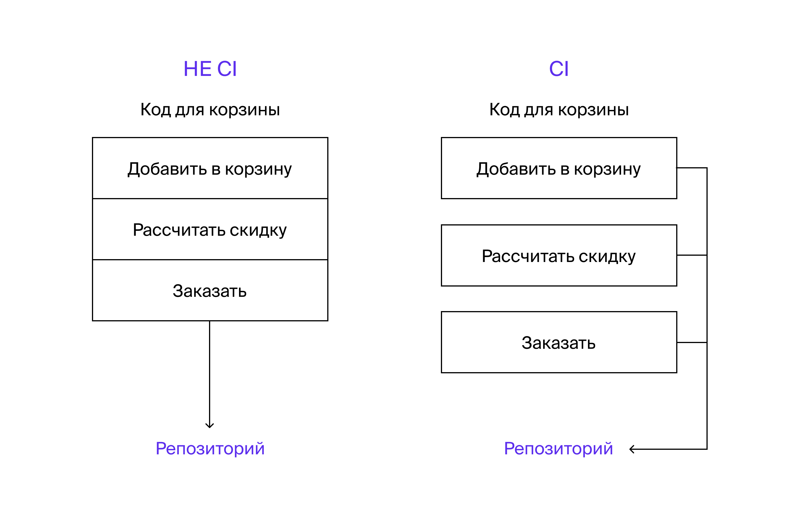
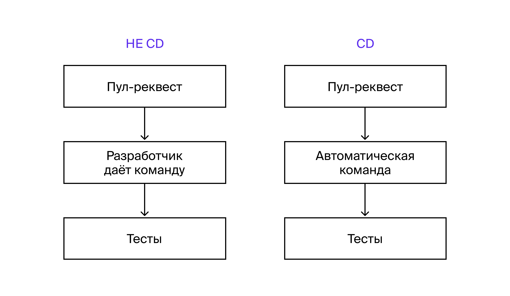
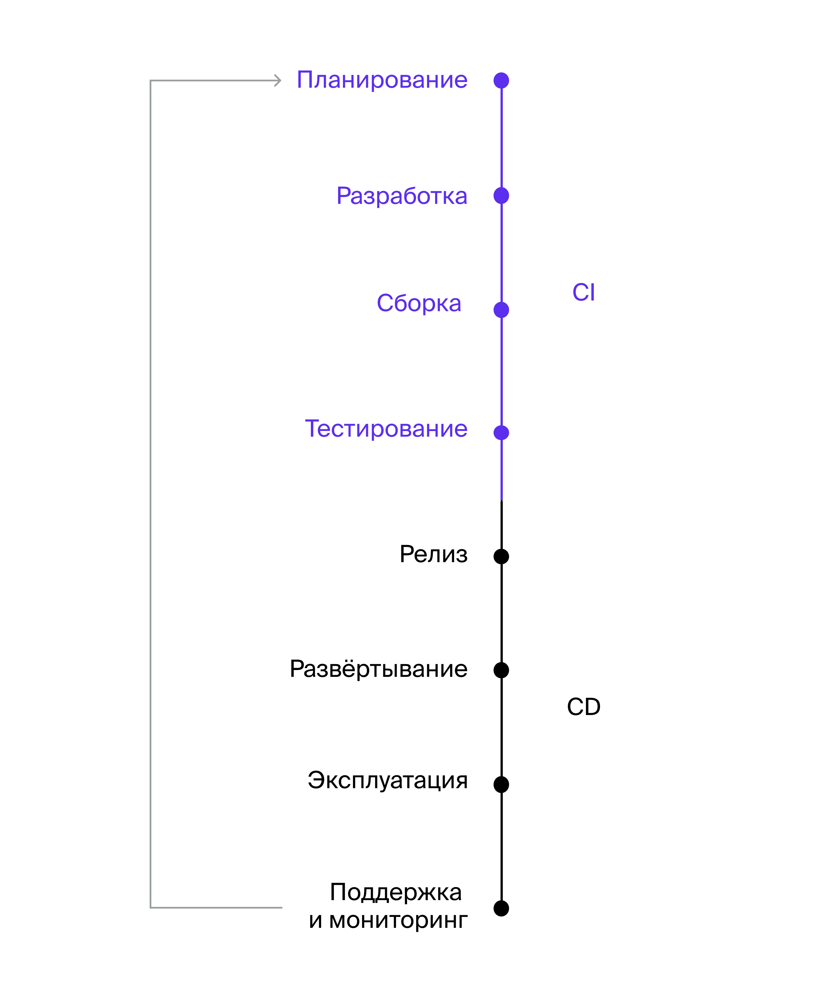
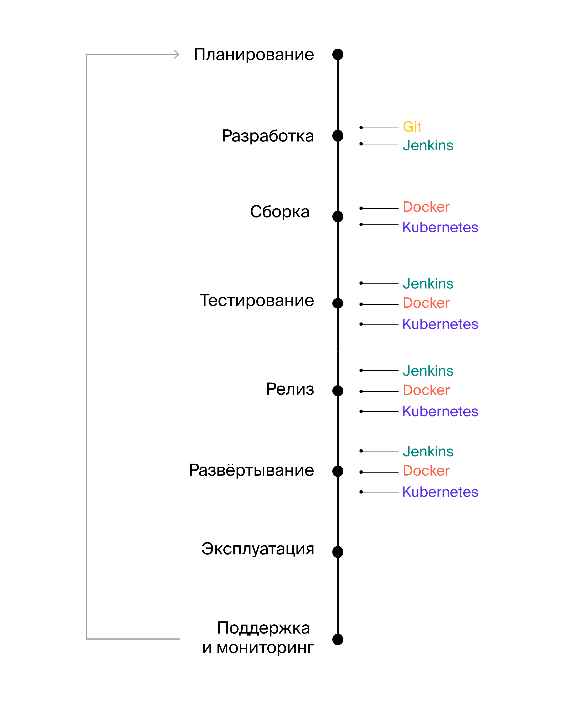
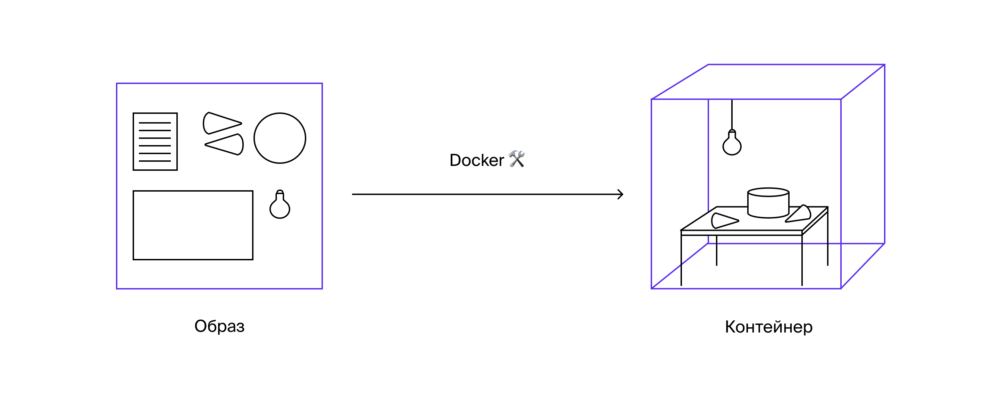
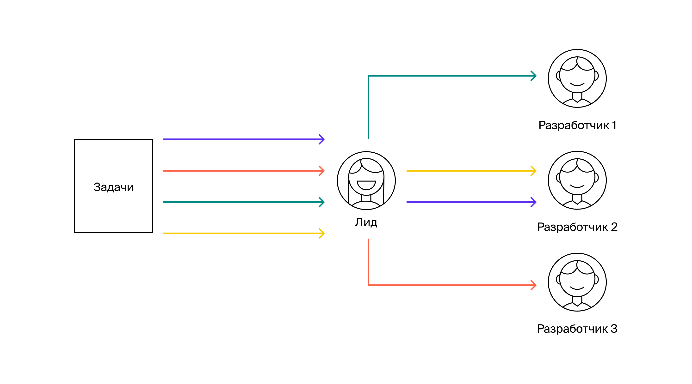
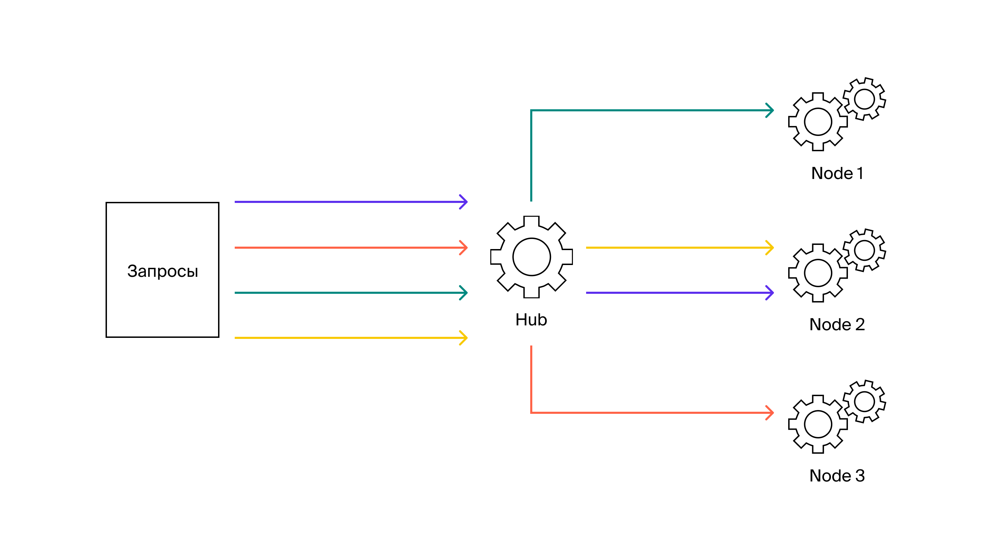
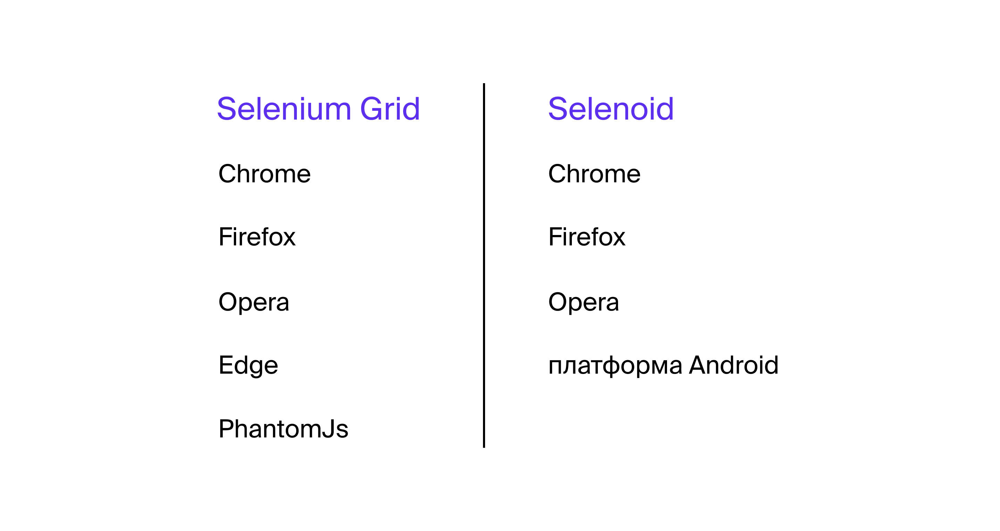
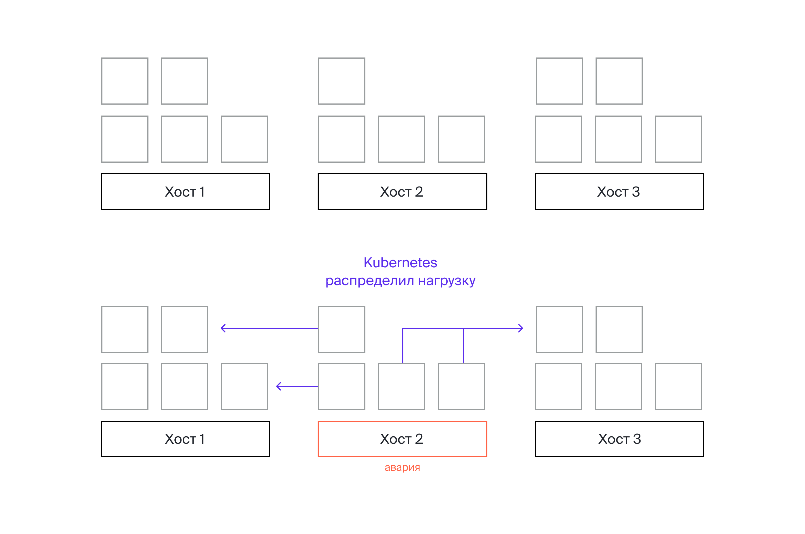
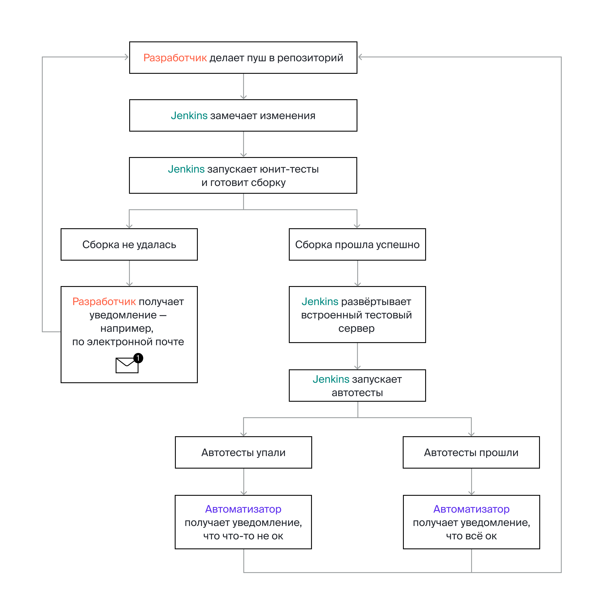

### [Назад к оглавлению](../../../../../README.md)

# Инфраструктура

## Оглавление

- [СI](#СI)
- [CD](#CD)
- [Процесс CI/CD](#Процесс-CI-CD)
- [Чем помогает CI/CD](#Чем-помогает-CI-CD)
- [Инструменты CI/CD](#Инструменты-CI-CD)
- [Docker](#Docker)
    - [Как Docker собирает контейнеры](#Как-Docker-собирает-контейнеры)
    - [Зачем Docker автоматизатору](#Зачем-Docker-автоматизатору)
    - [Docker и Selenium Grid](#Docker-и-Selenium-Grid)
- [Node](#Node)
- [Hub](#Hub)
- [Selenoid](#Selenoid)
- [Kubernetes](#Kubernetes)
    - [Запускать несколько контейнеров одновременно](#Запускать-несколько-контейнеров-одновременно)
    - [Масштабировать контейнеры](#Масштабировать-контейнеры)
    - [Балансировать нагрузку на контейнеры](#Балансировать-нагрузку-на-контейнеры)
- [Jenkins](#Jenkins)

### СI

**СI** (Continuous Integration) — **непрерывная интеграция**. Это значит, что репозиторий проекта постоянно обновляется. Изменения проверяются автоматически.

Иными словами, как только можно проверить маленький кусочек функциональности, его сразу загружают на тестовый стенд.

**Пример.** Представь: команда разрабатывает корзину для товаров в интернет-магазине.

Разработчик написал код для части функциональности — например, для метода расчёта скидок. Он сделал пул-реквест в `master`-ветку. Тут же запускаются проверки:
сначала юнит-тесты, потом интеграционные и E2E.

Это и есть непрерывная интеграция. Как только что-то изменилось, нужно:

- сразу залить новый кусочек в репозиторий;
- проверить, что новый код не конфликтует со старым.

Другой подход — программа попадёт в общую ветку разработки, только когда разработчик допишет код до конца. Это не CI.

### **CD**

**CD** (Continuous Delivery) — **непрерывное развёртывание**. Это значит, что процессы сборки и заливки на стенд — автоматические.

Например, разработчик залил код в ветку и сделал пул-реквест. Тут же запустились тесты — сами, автоматически.

Если тесты не упали, пул-реквест попадает в основную ветку. Она собирается, приложение попадает на стенд.

Без СD всё происходит не автоматически, а по команде разработчика или тестировщика.

### Процесс CI CD

Процесс CI/CD состоит из нескольких этапов:

Представь, что разработчикам нужно сделать новую функциональность для сервиса [Mesto](https://qa-mesto.praktikum-services.ru/): теперь на сайт можно добавлять
видео.

Вот как проходит процесс:

- **Планирование** — менеджер передаёт команде задачу.
- **Разработка** — разработчик создаёт отдельную ветку и пишет в ней код.
- **Сборка** — новая функциональность попадает в основную ветку разработки. Приложение автоматически загружается на тестовый стенд.
- **Тестирование** — запускаются тесты. Они проверяют, что функциональность работает точно так, как описано в документации.
- **Релиз** — если тесты не упали, функциональность попадает в `master`-ветку.
- **Развёртывание** — `master`-ветка собирается на продуктивном стенде.
- **Эксплуатация** — пользователи видят новую функциональность и добавляют видео на сайт.
- **Поддержка и мониторинг** — пользователи дают обратную связь, команда дорабатывает продукт.

Ручные операции в этом процессе заменили командами и скриптами.

Как только проходит последний этап, всё начинается заново — получается цикл.

**Как выглядит цикл разработки без CI/CD.** Разработчик сделал коммит в репозиторий. Автотесты не запускаются сами: тестировщику нужно дать команду.

Разработчикам приходится подключаться к стендам, чтобы залить актуальную версию приложения. Когда много операций совершают вручную, легко что-то упустить —
поэтому появляются ошибки.

### Чем помогает CI CD

**Обновлять приложение чаще и быстрее**. На стендах практически всегда актуальная версия приложения, потому что изменения сразу проходят тесты и попадают в
основную ветку.

**Оптимизировать поиск багов на всех этапах**. Приложение обновляется маленькими кусочками, поэтому легко найти ошибку.

**Ускорить цикл разработки**. Процессы автоматизированы, поэтому не нужно ждать, пока кто-то запустит автотесты.

### Инструменты CI CD

Вот какие инструменты помогают на разных этапах:

- Git — объединить код нескольких разработчиков.
- Jenkins — запускать действия автоматически: компиляцию, запуск тестов и сборку проекта.
- Docker — запустить приложение в разных окружениях.
- Kubernetes — оптимизировать работу с докер-контейнерами.

### Docker

Docker помогает запускать приложение в разных окружениях.

Представь: автор приложения пишет код и кладёт его в репозиторий. Другой разработчик его клонирует.

Разработчик развернёт проект на своём компьютере — не таком, как у автора проекта. У него другая операционная система и настройки. Например, у автора приложения
Java 8, у другого разработчика — Java 11.

Приложение может не запуститься.

Docker позволяет «упаковать» приложение вместе со всем программным обеспечением. Представь, что вместе с кодом хранятся операционная система, библиотеки,
определённая версия Java и остальные настройки.

Можно сказать, разработчик и правда кладёт в «упаковку» с кодом компьютер, на котором его писал.

Представь: тебе продали рецепт торта, а вместе с ним в коробке — всё, что нужно для готовки. Продукты, скалка, миксер, а ещё — портативная кухня с духовкой и
холодильником.

Docker берёт «упакованные» настройки и создаёт окружение на их основе. Он как будто запускает приложение в отдельной коробочке.

Коробка автономна: всё, что нужно для работы сервиса, уже есть внутри. Это и есть контейнер.

### Как Docker собирает контейнеры

Чтобы Docker собрал контейнер, ему нужен **образ**.

Можно сказать, образ — шаблон для контейнера. Это текстовый файл с инструкциями.

В образе указаны:

- операционная система,
- версия Java,
- код приложения,
- другие настройки виртуального окружения.

Контейнер — это ящик с рецептом, портативной кухней и продуктами для торта. Тогда образ — это заготовки и инструкция, как этот ящик собирать.

Docker берёт образ и на его основе создаёт контейнер. Из одного образа можно создать сколько угодно контейнеров.

Каждый контейнер получает уникальный идентификатор — CONTAINER ID. Он выглядит примерно так: `94f92052f55f`. По идентификатору к контейнеру можно обращаться —
например, чтобы остановить его.

### Зачем Docker автоматизатору

**Запускать автотесты**

В контейнерах можно запускать автотесты. Как ты знаешь, для сборки тестировщику нужен Maven. А ещё ты пишешь тесты на Java, поэтому понадобится JDK.

Пригодится контейнер, в котором есть Maven и JDK. Образ для такого контейнера [уже есть](https://hub.docker.com/_/maven).

Автоматизатор или DevOps смонтируют контейнер на его основе.

**Тестировать в разных версиях браузеров**

Если хочешь запускать автотесты в разных версиях одного браузера, придётся установить несколько копий Google Chrome или Mozilla Firefox на один компьютер. Они
могут конфликтовать.

Вместо этого можно создать несколько контейнеров — каждый со своим браузером.

### Docker и Selenium Grid

Чтобы работать в Docker было удобнее, можно развернуть специальный инструмент — **Selenium Grid**.

Selenium Grid — это сервер. Его используют, чтобы запустить тесты сразу в нескольких контейнерах.

Представь: автотесту нужно открыть браузер. Он отправляет запрос: «Мне нужен браузер — такая-то версия».

Selenium Grid принимает запрос и перенаправляет его на свободный сервер — тот, где есть WebDriver и нужный браузер.

Чтобы лучше понять, как это работает, вот аналогия. Представь, что есть команда разработчиков и её лид.

Команде приходит много разных задач. Сперва они попадают к лиду. Лид распределяет задачи между разработчиками: смотрит, кто из них посвободнее, а кто занят.

Selenium Grid можно запустить в двух режимах: **Node** и **Hub**.

### **Node**

**Node** — это серверы с запущенным WebDriver и браузером. Их ещё называют «узлами». К ним Selenium Grid и подключает автотесты.

В примере с командой и задачами разработчики — это несколько разных Node.

### **Hub**

**Hub** — это центральный сервер. Он принимает запросы и распределяет нагрузку между Node.

Автотесты подключаются к Hub, а он определяет, к какому Node их направить. Если Node — это разработчики, то Hub — их лид.

Node может быть несколько, а вот Hub чаще всего один.

Hub выбирает Node по параметрам, которые ему передают автотесты. Например, нужна определённая версия определённого браузера. Hub ищет контейнер с подходящей
версией.

Есть ещё один инструмент, который делает то же самое.

### Selenoid

Selenoid — такой же инструмент, как Selenium Grid.

Принцип работы — аналогичный. Есть один [Hub](https://hub.docker.com/r/selenoid/hub) и несколько [Node](https://hub.docker.com/r/selenoid/chrome).

Но в Selenium Grid нужно монтировать контейнеры с браузерами самостоятельно. А Selenoid поручает это хабу.

Ещё эти два инструмента поддерживают разные браузеры:

Скорее всего, тебе не придётся настраивать эти инструменты самостоятельно.

## Kubernetes

Kubernetes помогает управлять контейнерами. Чтобы лучше запомнить, зачем нужен этот инструмент, обрати внимание на его название: Kubernetes — от греческого
«управляющий» или «рулевой».

### **Запускать несколько контейнеров одновременно**

Иногда тестировщику достаточно развернуть один контейнер и создать к нему запросы. Например, если сервис маленький: на него заходят от силы десять человек.

Но бывает, нужно развернуть много контейнеров одновременно. Например, тестировщик проверяет банковское приложение. Запросов к нему будет много: провести
транзакцию, отобразить счета, вычислить кешбэк.

Одного контейнера не хватит: он будет долго «думать» или вовсе упадёт под нагрузкой. Можно развернуть несколько серверов вручную, но это долго и неудобно. А ещё
можно ошибиться.

Тут поможет Kubernetes: он развернёт больше контейнеров автоматически.

### **Масштабировать контейнеры**

Часто делают так: выкатывают новую функциональность сначала на часть пользователей, а потом на всех.

Например, добавили кнопку «Загрузить видео» на сайт. Сначала её запускают на тысячу человек: проверяют, что всё работает как нужно. Приложению хватит пары
серверов.

Если всё в порядке, видео загружается, пользователи довольны — функциональность раскатывают на всех. Нужно больше серверов. Тогда Kubernetes увеличивает число
контейнеров.

### **Балансировать нагрузку на контейнеры**

Обычно на разных компьютерах разворачивают несколько одинаковых хостов. Это нужно для страховки: если на каком-то хосте неполадки, копия продолжит работать.

Хосты нужно загружать равномерно, чтобы все они выдерживали нагрузку.

Если произойдёт авария, один из хостов может сломаться. Запросы, которые шли на него, нужно распределить между рабочими контейнерами. Kubernetes делает это сам.

Чтобы управлять Kubernetes, нужно вводить команды в консоли. Пока что тебе не понадобится это делать.

В крупных компаниях Kubernetes настраивает команда DevOps: она отвечает за инфраструктуру для тестирования и разработки.

## Jenkins

Jenkins помогает запускать пайплайны — цепочки действий после определённого события.

Как обычно проходит непрерывная интеграция с Jenkins.

**Пуш в репозиторий**. Когда программист заканчивает работать над новой функциональностью, он делает пуш в общий репозиторий.

**Jenkins замечает изменения**. Сервер Jenkins регулярно проверяет, не изменился ли код в общем репозитории.

**Jenkins готовит сборку**. Как только программист запушит изменения, Jenkins начнёт готовить новую сборку. Для этого к нему можно подключить плагин Maven.

**Пока Jenkins готовит сборку, он запускает юнит-тесты**. Если тесты упадут, разработчик получит уведомление — например, по электронной почте.

Можно настраивать списки получателей: например, чтобы уведомление получили менеджер или тестировщик.

Если со сборкой всё в порядке, Jenkins развёртывает встроенный тестовый сервер. Он готовит окружение, в котором запускает автотесты.

**Jenkins рассказывает о результатах тестирования**. Чаще всего уведомление приходит автоматизатору тестирования — прошли автотесты или нет.

Отчёты настраивают так, как удобно компании. Например, можно собрать целую HTML-страницу. А можно просто прислать текст: «Запущено 5 тестов, 3 прошли, а 2 —
нет».

**Jenkins продолжит проверять хранилище исходного кода**. Процесс повторится.

### [Назад к оглавлению](../../../../../README.md)
