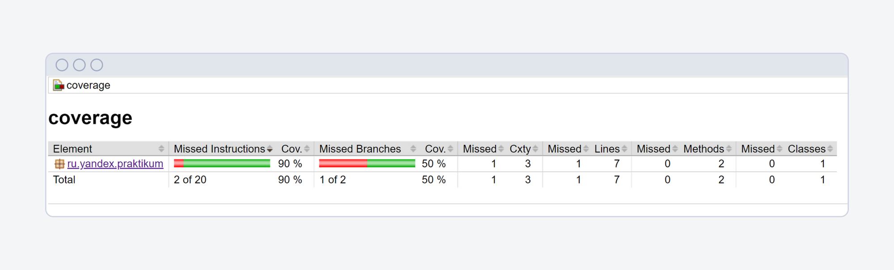
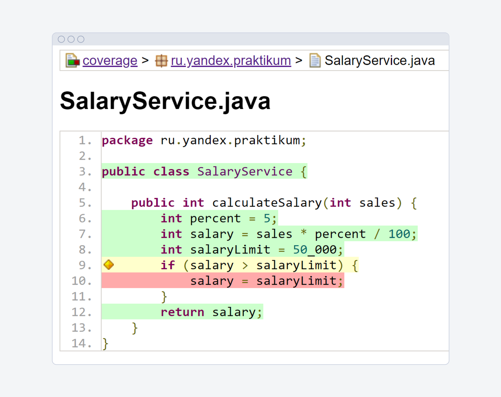
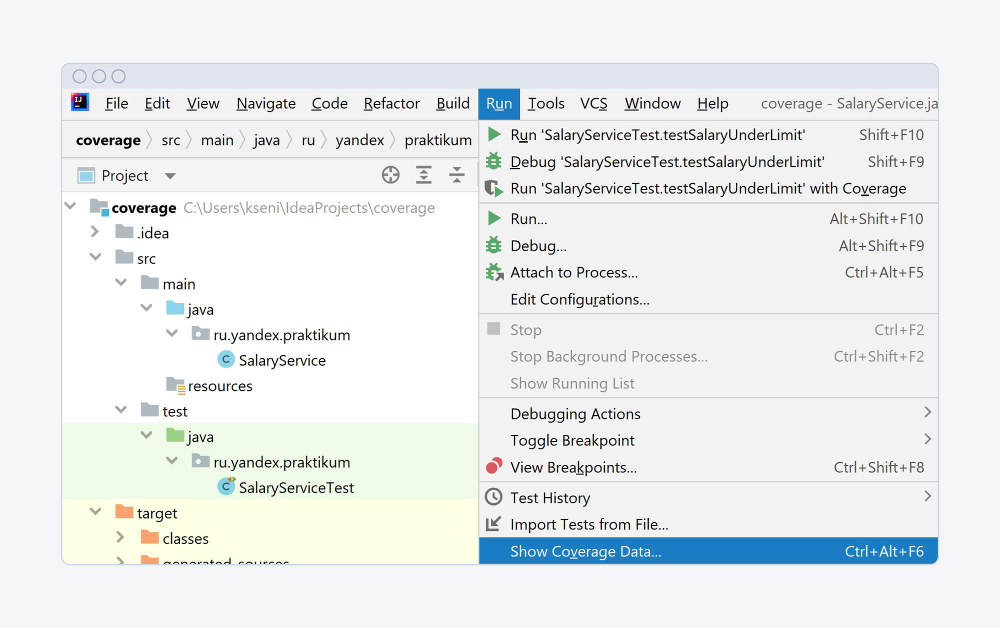
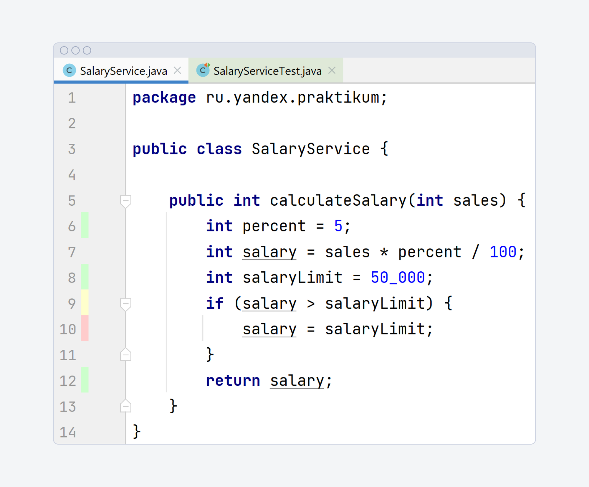
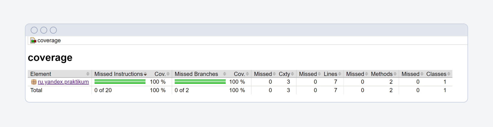
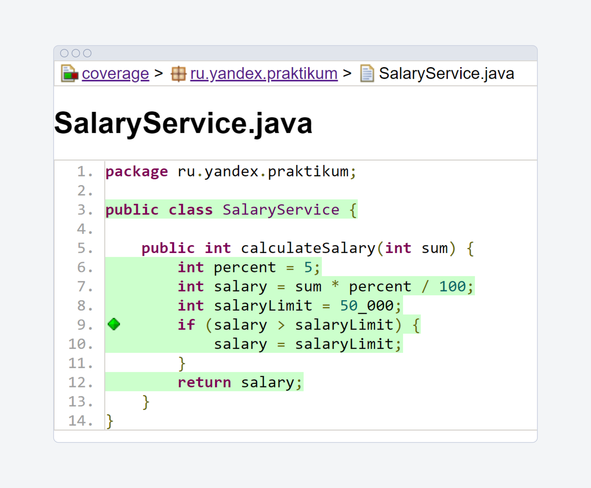

### [Назад к оглавлению](../../../../../README.md)

# Инъекции зависимостей

### Что такое зависимость

Зависимость — это когда одна сущность не может работать без другой. Например, разработчик не может написать программу без компьютера.

**Зависимость** **в программировании** (dependency) означает, что один программный компонент не работает без другого. Например, класс «программист» — без класса
«компьютер».

**Пример.** Представь холодильник. Когда его дверца открывается, внутри включается свет. Для этого в холодильнике есть лампочка. Если она не работает, свет в
холодильнике не загорится. Получается, свет связан с лампочкой — это зависимость.

Этот пример легко переложить на язык Java. Пусть холодильнику в коде соответствует класс `Fridge`, а лампочке — `HorizontLamp`. Класс лампочки называется так,
потому что её произвели на заводе «Горизонт».

В классе холодильника есть метод `openDoor()`. Он открывает дверцу. А класс лампочки содержит метод `switchLightOn()`, который включает свет.

Чтобы включить свет при открытии дверцы, нужно вызвать метод `switchLightOn()` для объекта `HorizontLamp` внутри класса `Fridge`:

```java
public class HorizontLamp {
    // метод, который включает лампочку
    public void switchLightOn() {
        System.out.println("Лампочка загорелась");
    }
}

public class Fridge {
    // метод открывает двери
    public void openDoor() {
        // объект класса HorizontLamp
        HorizontLamp horizontLamp = new HorizontLamp();
        // включается свет
        horizontLamp.switchLightOn();

    }
}
```

Чтобы в одном классе использовать методы другого, нужно создать в нём объект этого другого класса. Чтобы «холодильник» включил свет, в методе `openDoor()`
создали экземпляр «лампочки».

```java
// создали объект класса HorizontLamp
HorizontLamp horizontLamp = new HorizontLamp();
```

Класс `Fridge` зависит от `HorizontLamp`, потому что не сможет без него работать. Поэтому класс `Fridge` называют **зависимым**, а класс `HorizontLamp` — *
*зависимостью**.

У кода с зависимостями есть недостатки. Представь: завод «Горизонт» нужно заменить на «СуперЛампочка». Объект класса `HorizontLamp` меняется на объект
класса `SuperLamp`.

Ещё может произойти так, что конструктор класса `HorizontLamp` изменится. Например, у него появится параметр — мощность лампочки.

В обоих случаях нужно переписать код класса `Fridge`, ведь лампочка находится прямо в нём.

### Что такое инъекция зависимостей

**Инъекция зависимостей** (англ. Dependency Injection, или DI) — это принцип построения кода.

В основе принципа лежит такая идея:

<aside>
💡  Когда ты создаёшь зависимость внутри зависимого объекта, появляются сложности. → Значит, нужно вынести создание зависимости из объекта в другое место. → Тогда зависимость можно будет внедрить в объект в готовом виде.

</aside>

В примере с холодильником класс `Fridge` должен получать готовый объект класса `HorizontLamp` и просто использовать его. Это и есть инъекция зависимостей.

### Как написать инъекцию зависимости

Чтобы ослабить связь между зависимым классом и зависимостью, создай интерфейс. Его будут реализовывать все объекты с нужным функционалом. Тогда зависимый класс
будет связываться с общим интерфейсом.

Для этого нужно:

1. **Создать интерфейс для класса-зависимости.** Здесь их сразу два — `HorizontLamp` и `SuperLamp`. Поэтому пусть интерфейс называется `Lamp`.

2. **Создать в зависимом классе поле того же типа, что и интерфейс.** По принципу инкапсуляции, его нужно сделать приватным. Например, `private Lamp lamp` в
   классе `Fridge`.

3. **Создать конструктор с параметром того же типа, что и интерфейс.** Например, `public Fridge(Lamp lamp)`. Внутри конструктора передать значение параметра в
   созданное поле: `this.lamp = lamp`.

```java
// общий интерфейс ILamp, который будут имплементировать и HorizontLamp, и SuperLamp
public interface ILamp {
    void switchLightOn();
}

public class HorizontLamp implements ILamp {
    // метод включает свет лампочкой «Горизонт»
    @Override
    public void switchLightOn() {
        System.out.println("I am switching Horizont lamp");
    }
}

public class SuperLamp implements ILamp {
    // метод включает свет лампочкой «Суперлампа»
    @Override
    public void switchLightOn() {
        System.out.println("I am switching Super lamp and shining brightly!");
    }
}

public class Fridge {
    // объект lamp — поле класса Fridge
    private ILamp lamp;

    // Объект horizontLamp передаётся в конструтор. Он создан извне
    // объект попадает в переменную класса
    public Fridge(ILamp lamp) {
        this.lamp = lamp;
    }

    public void openDoor() {
        // объект класса horizontLamp используют, чтобы включить свет
        lamp.switchLightOn();
        // дальше может быть код, который выполняется после открытия дверцы
    }
}
```

Чтобы внедрить в класс `Fridge` зависимость, нужно создать объекты в другом классе — например, в классе `Example`:

```java
public class Example {
    public static void main(String[] args) {
// чтобы заменить лампочку, достаточно вызвать new SuperLamp(),
// остальной код не изменится
        ILamp horizontLamp = new HorizontLamp();
        Fridge fridge = new Fridge(horizontLamp);
        fridge.openDoor();
    }
}
```

### Зависимость в поле класса

Зависимость может находится не только внутри метода, но и в поле класса. Например, вот так:

```java
public class HorizontLamp {
    // метод, который включает лампочку
    public void switchLightOn() {
        System.out.println("Лампочка загорелась");
    }
}

public class Fridge {
    // объект класса HorizontLamp как поле класса Fridge
    HorizontLamp horizontLamp = new HorizontLamp();

    // метод открывает двери
    public void openDoor() {
        // включается свет
        horizontLamp.switchLightOn();
    }
}
```

У этого кода будут те же слабые места. Код с инъекцией зависимости будет точно таким же.

### Главное

Запомни:

- Инъекция зависимости означает, что класс получает объект, который создан за его пределами.
- Внедрить инъекцию зависимостей можно при помощи конструктора. Нужно объявить переменную внутри одного класса, а присвоить значение — в другом. Значение ты
  передашь в конструкторе как параметр.

# Моки и стабы

## Что такое мок

Мок (от англ. mock — «передразнивать») — это «дублёр» реальной сущности в коде. Он помогает протестировать модуль, не вызывая реальный код.

В мок можно заложить часть действий — только те, которые нужны для тестирования. Мок — как дублёр в кино: он подменяет актёра, но ему необязательно так же
хорошо играть.

**Пример**. Представь два объекта: `Sender` и `Mailbox`. `Sender` только отправляет письма, а у `Mailbox` есть разные функции: например, сортировка писем и
поиск спама. Чтобы отправлять письма, `Mailbox` вызывает метод объекта `Sender`.

Чтобы протестировать этот метод, не нужно отправлять настоящие письма. Достаточно убедиться, что метод в объекте `Sender` сработал. Для этого можно создать мок.

Например, объект `Mailbox` может вызывать не настоящий метод объекта `Sender`, а метод из мока.

## Когда нужны моки

### **Реальный код сложно настроить**

Иногда с реальным кодом приходится выполнять дополнительные действия.

**Пример**. Например, тебе нужно протестировать метод `sellTicket()`. Он помогает купить билеты в кино и проверяет возраст пользователя.

Чтобы получить возраст, `sellTicket()` вызывает метод `getAge()` класса `Person`. `getAge()` возвращает возраст пользователя, который зарегистрирован в
приложении.

Тест для метода `sellTicket()` займёт несколько строк. Но чтобы создать реальный объект класса `Person`, нужно задать 30 полей и вызвать дополнительные методы.

Вместо этого можно создать мок класса `Person`, в котором будут только те поля и методы, которые нужны для тестирования метода `sellTicket()`.

### Приложение использует внешние связи

Например, приложение может получать данные из базы или от других серверов.

**Пример**. Представь, что метод `getAge()` работает через базу данных. Во время тестирования может произойти сетевая ошибка, или база данных может быть
неактивна из-за технических работ.

Чтобы разорвать внешние связи и обеспечить атомарность тестов, нужно создать мок.

### Нужно протестировать часть системы в изоляции

Иногда одну и ту же систему одновременно разрабатывают разные команды. Одна часть системы может быть готова, а другая — ещё в разработке.

Чтобы протестировать систему, можно создать моки. Они будут эмулировать ещё не готовые части.

**Пример**. В классе доставки еды `Delivery` есть метод `getOrder()`. Он возвращает номер заказа по имени пользователя через метод `getOrderId()`
класса `Order`. Цель тестирования — убедиться, что метод `getOrderId()` вызван, а метод `getOrder()` отработал; неважно, с каким результатом.

Можно создать мок-объект класса `Order` и проверить, что метод вызвали определённое количество раз.

## Как подключить библиотеку Mockito

Специальная библиотека Mockito нужна, чтобы подключить моки.

Чтобы подключить Mockito к проекту, нужно добавить зависимость в `pom.xml`:

```xml

<dependency>
    <groupId>org.mockito</groupId>
    <artifactId>mockito-core</artifactId>
    <version>3.12.4</version>
    <scope>test</scope>
</dependency>
```

Чтобы Mockito работала корректно, понадобится ещё одна библиотека — Byte Buddy. Её тоже нужно подключить:

```xml

<dependency>
    <groupId>net.bytebuddy</groupId>
    <artifactId>byte-buddy</artifactId>
    <version>1.11.16</version>
</dependency>
```

Теперь можно подключить Mockito к тестовому классу. Есть два способа:

1. Добавить аннотацию `@RunWith` с раннером `MockitoJUnitRunner`:

```java

@RunWith(MockitoJUnitRunner.class)
public class Praktikum {
    ...
}
```

1. Добавить в тестовый класс метод `init()`. Чтобы он запускался перед каждым тестом, нужна аннотация `@Before`:

```java
public class Praktikum {

    @Before
    public void init() {
        MockitoAnnotations.initMocks(this);
    }
    ...
}
```

## Как создать мок

Чтобы создать мок, можно использовать:

- метод `mock()`:

```java
Car car = Mockito.mock(Car.class);
```

- аннотацию `@Mock`:

```java

@Mock
Car car;
```

Второй вариант лаконичнее, поэтому его используют чаще.

Когда ты создаёшь мок, все возвращаемые значения меняются на значения по умолчанию. Если метод возвращал ссылочный тип, мок вернёт `null`, если примитив —
значение примитива по умолчанию.

Можно создать мок любого класса или интерфейса, если он не `private` или `final`. Например, не получится создать мок строкового объекта, потому что
класс `String` объявлен как `final`.

Если написать такой код:

```java

@Mock
String mockedString;
```

Получится ошибка:

```java
org.mockito.exceptions.base.MockitoException:
Cannot mock/spy

class java.lang.String
Mockito cannot
mock/
spy because :
        -final class
```

### Метод `verify()`

Моки помогают убедиться, что метод объекта вызвали с определёнными аргументами. В Mockito для этого есть метод `verify()`.

Например, есть класс `Car` с методом `setCarBrand()`.

```java
public class Car {

    private String carBrand;

    public void setCarBrand(String carBrand) {
        this.carBrand = carBrand;
    }

}
```

Через мок-объект `car` можно вызвать метод и проверить, что всё сработало:

```java
import org.junit.Test;
import org.junit.runner.RunWith;
import org.mockito.Mock;
import org.mockito.Mockito;
import org.mockito.junit.MockitoJUnitRunner;

@RunWith(MockitoJUnitRunner.class)
public class Praktikum {

    @Mock
    Car car; // создали мок

    @Test
    public void test() {
        car.setCarBrand("Lamborghini"); // вызвали метод объекта с аргументом
        Mockito.verify(car).setCarBrand("Lamborghini"); // проверили, что метод вызван с этим параметром
    }
}
```

Если после `verify()` указать не тот аргумент, с которым метод вызван, произойдёт ошибка:

```java
import org.junit.Test;
import org.junit.runner.RunWith;
import org.mockito.Mock;
import org.mockito.Mockito;
import org.mockito.junit.MockitoJUnitRunner;

@RunWith(MockitoJUnitRunner.class)
public class Praktikum {

    @Mock
    Car car;

    @Test
    public void test() {
        car.setCarBrand("Lamborghini"); // вызвали метод объекта с аргументом
        Mockito.verify(car).setCarBrand("Lada"); // в проверке передали другой аргумент
    }
}
```

### Метод `times()`

Можно проверить, что метод вызвали несколько раз. Внутри `verify()` нужно вызвать ещё один метод — `times()`:

```java
import org.junit.Test;
import org.junit.runner.RunWith;
import org.mockito.Mock;
import org.mockito.Mockito;
import org.mockito.junit.MockitoJUnitRunner;

@RunWith(MockitoJUnitRunner.class)
public class Praktikum {

    @Mock
    Car car;

    @Test
    public void test() {
        car.setCarBrand("Lamborghini");
        car.setCarBrand("Lamborghini");
        car.setCarBrand("Lamborghini"); // вызвали метод с одним аргументом три раза
        Mockito.verify(car, Mockito.times(3)).setCarBrand("Lamborghini");
        // проверили, что метод вызван три раза с этим аргументом
    }
}
```

### Методы семейства `any`

Если нужно проверить, что метод вызван с любым аргументом, понадобятся методы семейства `any`:

- метод `any()` проверяет, что в метод передан любой аргумент ссылочного типа;
- методы `anyString()`, `anyList()`, `anyInt()` применяют для аргументов определённого типа: строка, список, целое число.

Например, можно проверить, что в качестве аргумента в метод `setCarBrand()` передали любую строку:

```java
import org.junit.Test;
import org.junit.runner.RunWith;
import org.mockito.Mock;
import org.mockito.Mockito;
import org.mockito.junit.MockitoJUnitRunner;

@RunWith(MockitoJUnitRunner.class)
public class Praktikum {

    @Mock
    Car car;

    @Test
    public void test() {
        car.setCarBrand("Lamborghini"); // вызвали метод объекта с аргументом
        Mockito.verify(car).setCarBrand(Mockito.anyString());
        // проверили, что метод вызван с любой строкой в качестве аргумента
        Mockito.verify(car).setCarBrand(Mockito.any()); // тоже сработает: String - ссылочный тип данных
    }
}
```

## Что такое стабы

Стабы — ещё один вид «дублёров» реального кода.

Моки отвечают за поведение объектов: например, помогают проверить, что тестируемый метод отработал.

Стабы (от англ. stub — «заглушка») — это объекты с заданным состоянием. Если вызвать методы стаба, вернутся заранее определённые данные.

## Когда нужны стабы

Представь: реальные данные из метода сложно получить. При этом нужно проверить, что он возвращает значения.

Например, нужно написать юнит-тесты для метода `getOrderId()` в классе доставки еды `Order`. Он возвращает номер заказа по имени пользователя. Метод ищет
пользователя в базе данных.

Чтобы не ждать ответы на запросы от базы данных, можно создать стаб: он всегда будет возвращать один и тот же номер заказа — 2.

## Как создать стабы

Стабы создают так же, как моки, — через аннотацию `@Mock` из Mockito.

Стабам нужны методы:

- `when()` — «когда вызван метод»;
- `thenReturn()` — «вернуть значение».

Например, в классе `Engine` есть метод `getPower()`, который возвращает значение 125.

```java
public class Engine {

    public int getPower() {
        return 125;
    }

}
```

Класс `Car` использует `getPower()` в своём методе `getEnginePower()`.

```java
public class Car {

    Engine engine;

    public Car(Engine engine) {
        this.engine = engine;
    }

    public int getEnginePower() {
        return engine.getPower();
    }

}
```

Если нужно, чтобы при тестировании метод `getPower()` возвращал другое значение — например, 500 — можно создать стаб:

```java
import org.junit.Test;
import org.junit.runner.RunWith;
import org.mockito.Mock;
import org.mockito.Mockito;
import org.mockito.junit.MockitoJUnitRunner;

@RunWith(MockitoJUnitRunner.class)
public class Praktikum {

    @Mock
    Engine engine;

    @Test
    public void test() {
        Car car = new Car(engine);
        System.out.println(car.getEnginePower()); // аннотация @Mock стирает возвращаемые значения, поэтому выведется 0
        Mockito.when(engine.getPower()).thenReturn(500);
        // теперь при вызове getPower() всегда будет возвращаться 500
        System.out.println(car.getEnginePower()); // выведется 500
    }
}
```

### Как создать стабы для методов с параметрами

Можно создать стабы и для методов с параметрами. Например, метод `getWheelsCount()` принимает на вход количество передних и задних колёс и возвращает их сумму:

```java
public class Wheel {

    public int countWheels(int frontWheels, int backWheels) {
        return frontWheels + backWheels;
    }

}
```

```java
public class Car {

    Wheel wheel;

    public Car(Wheel wheel) {
        this.wheel = wheel;
    }

    public int getWheelsCount(int frontWheels, int backWheels) {
        return wheel.countWheels(frontWheels, backWheels);
    }

}
```

В коде стаба нужно указать, при каких аргументах метод должен возвращать значение:

```java
import org.junit.Test;
import org.junit.runner.RunWith;
import org.mockito.Mock;
import org.mockito.Mockito;
import org.mockito.junit.MockitoJUnitRunner;

@RunWith(MockitoJUnitRunner.class)
public class Praktikum {

    @Mock
    Wheel wheel;

    @Test
    public void test() {
        Car car = new Car(wheel);
        Mockito.when(wheel.countWheels(2, 2)).thenReturn(5);
				/* Теперь стаб будет выводить 5, только если переданы аргументы 2 и 2.
				Иначе - 0 */
        System.out.println(car.getWheelsCount(2, 2)); // выведется 5
    }
}
```

### Стабы и методы семейства `any`

Со стабами тоже можно использовать методы семейства `any`. Например, нужно, чтобы стаб выводил значение, только когда в него передают целые числа:

```java
import org.junit.Test;
import org.junit.runner.RunWith;
import org.mockito.Mock;
import org.mockito.Mockito;
import org.mockito.junit.MockitoJUnitRunner;

@RunWith(MockitoJUnitRunner.class)
public class Praktikum {

    @Mock
    Wheel wheel;

    @Test
    public void test() {
        Car car = new Car(wheel);
        Mockito.when(wheel.countWheels(Mockito.anyInt(), Mockito.anyInt())).thenReturn(5);
        /* Теперь стаб выведет 5, если передать в него любое целое число.
				Иначе - 0 */
        System.out.println(car.getWheelsCount(2, 2)); // выведется 5
        System.out.println(car.getWheelsCount(3, 7)); // выведется 5
    }
}
```

# Разрыв зависимостей

**Изолированный тест** не зависит от других тестов или окружения. Он работает сам по себе.

**Пример.** Есть два теста. Первый проверяет, что в базу данных добавилось значение. Второй — что это значение выводится на экран.

Второй тест не изолирован, потому что зависит от первого. Если первый тест упадёт, значение не появится в базе данных. Второй не сможет работать.

### Свойства изолированных тестов

Изолированные тесты можно запускать как угодно:

- по одному;
- в наборе тестов;
- в порядке по умолчанию — том, который задан во фреймворке. Например, тесты запускаются по алфавиту;
- в случайном порядке.

Они дадут одинаковый результат в любом случае.

Если тест не изолирован, это значит:

- Тест падает, если запустить только его, но вместе с другими тестами проходит. Как в примере со строками.
- Запускать тесты можно только в определённом порядке. Например, первый тест вводит данные в поле ввода, а второй с ним работает. Если сначала запустить второй
  тест, он не найдёт данные и упадёт.

### Атомарность

Хороший тест нельзя декомпозировать на несколько маленьких тестов.

**Пример.** Ты тестируешь интрнет-магазин. Он состоит из нескольких экранов: стартовая страница, страница выбора товаров, личный кабинет.

Нужно проверить, что товар добавляется в корзину. Для этого не стоит проходить весь путь от стартовой страницы: можно сразу перейти к странице выбора товара.
Тестировщик отсекает всё ненужное и проверяет только конкретную функциональность.

### Изоляция и атомарность

Изоляция тесно связана с атомарностью. Атомарный тест должен быть изолирован.

**Пример.** Кажется, что в базе данных можно объединить два теста: сначала добавить данные, а потом вывести на экран. Но тогда тесты не атомарны.

Чтобы сделать тесты и атомарными, и изолированными, во второй тест можно передать постоянные значения. То есть не брать их из базы, а зашить значения в сам
тест.

### Когда нужно разорвать зависимость

Хороший тест должен быть изолирован. Но бывает, программе нужны данные извне. Например, нужно получить объект из внешней базы данных.

Нужно проверить, что будет, если внешний ресурс не сработает. Чаще всего не получится вызвать настоящий сбой во вешней системе, но с помощью Mockito его можно
сымитировать.

### Как разорвать зависимость

С помощью Mockito можно разорвать зависимость тестов от внешних данных. Библиотека сымитирует ответы внешних систем. Ты сможешь проверить, как программа ведет
себя в разных ситуациях.

**Пример.** Представь, что класс соединяется с удалённым сервером и получает от него данные. Это внешняя связь. Программа зависит от сервера: если он не
работает, код не получит нужную информацию.

Класс `ServiceClass` получает код ответа:

```java
import java.io.IOException;
import java.net.HttpURLConnection;
import java.net.URL;

public class ServiceClass {

    public int sendGet(String requestUrl) throws IOException {
        /*
        Строка преобразуется в объект URL. Его используют, чтобы установить
        http/https соединение с удалённым сервером */
        URL url = new URL(requestUrl);
        // Открывается соединение между программой и удалённым сервером
        HttpURLConnection connection = (HttpURLConnection) url.openConnection();
        /* http-метод отпраляется на сервер
        GET запрашивает информацию */
        connection.setRequestMethod("GET");
        // Приходит код ответа от сервера
        return connection.getResponseCode();
    }

}
```

Класс `Server` проверяет, что сервер доступен:

```java
public class Server {

    public String checkServer(int responseCode) {
        if (200 == responseCode) {
            return "Сервер доступен";
        } else {
            return "Сервер недоступен";
        }
    }

}
```

Сервер должен обработать запрос и вернуть данные:

```java
import org.junit.Assert;
import org.junit.Test;

import java.io.IOException;

public class Praktikum {

    @Test
    public void test() throws IOException {
        ServiceClass serviceClass = new ServiceClass();
        Server server = new Server();
        int responseCode = serviceClass.sendGet("http://www.example.com/junk");
        System.out.println("Код ответа от сервера: " + responseCode);
        String status = server.checkServer(responseCode);
        Assert.assertEquals("Сервер доступен", status);
    }

}
```

Что-то пошло не так. Метод `sendGet()` вернул ошибку 404 — Not Found. Тест не прошёл.

Это означает, что программа не нашла сервер. Так может получиться, если его только разрабатывают, а тестировать нужно уже сейчас. Или если проблемы с сетью.

Чтобы протестировать код, нужно разорвать зависимость с внешним ресурсом. Поможет библиотека Mockito: она сымитирует работу сервера. Понадобится создать мок и
вернуть ответ:

```java
import org.junit.Assert;
import org.junit.Test;
import org.junit.runner.RunWith;
import org.mockito.Mock;
import org.mockito.Mockito;
import org.mockito.junit.MockitoJUnitRunner;

import java.io.IOException;

@RunWith(MockitoJUnitRunner.class)
public class Praktikum {

    // мок класса, чтобы перехватывать вызовы его методов
    @Mock
    ServiceClass serviceClass;

    @Test
    public void test() throws IOException {
        Server server = new Server();
        /* Вернётся код 200,
        ты имитируешь корректную работу нужного ресурса */
        Mockito.when(serviceClass.sendGet(Mockito.anyString())).thenReturn(200);
        int responseCode = serviceClass.sendGet("http://www.example.com/junk");
        System.out.println("Код ответа от сервера: " + responseCode);
        String status = server.checkServer(responseCode);
        Assert.assertEquals("Сервер доступен", status);
    }
}
```

В этот раз тест получит ответ сервера.

# Оценка покрытия

Покрытие кода ****(code coverage) говорит, какой процент программы выполняется во время тестов. Можно смотреть на процент покрытых строк кода, условных
операторов и методов.

**Пример.** Сервис вычисляет зарплату менеджера по продажам. Сотрудник получает 5% со всех продаж за месяц, но не больше пятидесяти тысяч:

```java
public class SalaryService {

    public int calculateSalary(int sales) {
        int percent = 5;
        int salary = sales * percent / 100;
        int salaryLimit = 50_000;
        if (salary > salaryLimit) {
            salary = salaryLimit;
        }
        return salary;
    }
}
```

Тестировщик написал юнит-тест для этого сервиса:

```java
import org.junit.Assert;
import org.junit.Test;

public class SalaryServiceTest {

    @Test
    public void shouldCalculateSalaryWhenUnderLimit() {
        SalaryService salaryService = new SalaryService();
        int actual = salaryService.calculateSalary(50_000);
        int expected = 2_500;

        Assert.assertEquals(expected, actual);
    }
}
```

Нужно понять, хорошо ли метод `calculateSalary` покрыт тестами. Для этого понадобится оценить покрытие.

### Процент строк кода

Строка кода считается покрытой, если она хотя бы раз выполнилась во время теста.

Например, строка `int salary = sales * percent / 100;` покрыта. Она всегда выполняется, когда ты вызываешь метод `calculateSalary`. Её вызов не зависит от
параметров.

А вот строка `salary = salaryLimit;` выполняется не всегда. Если зарплата не превышает лимит, код внутри `if` не выполняется. Эта строка не покрыта.

### Процент покрытых условий

Условие считается покрытым, если каждая ветвь решения выполнилась.

Например, условие `if (salary > salaryLimit)` покрыто частично: тест проверяет только вариант с зарплатой ниже лимита. Превышение не проверяется.

### Процент покрытых методов

Метод считается покрытым, если он выполнился при тестировании хотя бы один раз.

Например, метод `calculateSalary` вызывается в тесте. Значит, он покрыт.

### Как считать покрытие

Вручную считать покрытие неудобно и долго. Помогают специальные инструменты. Один из самых популярных — **плагин Jacoco**.

Плагин — это модуль, который расширяет возможности программы. Его нужно подключать отдельно. Это похоже на расширения в браузере: например, блокировщик рекламы.

**Подключить плагин.** Нужно добавить секцию `build` в `pom.xml`. В неё и записываются плагины — с помощью тега `plugin`:

```java
<? xml version = "1.0"
encoding="UTF-8"?>
<project xmlns="http://maven.apache.org/POM/4.0.0"
xmlns:xsi="http://www.w3.org/2001/XMLSchema-instance"
xsi:schemaLocation="http://maven.apache.org/POM/4.0.0 http://maven.apache.org/xsd/maven-4.0.0.xsd">
    <modelVersion>4.0.0</modelVersion>

    <groupId>ru.example</groupId>
    <artifactId>coverage</artifactId>
    <version>1.0-SNAPSHOT</version>

    <properties>
        <!--
здесь настройки-->
    </properties>

    <dependencies>
        <!--
здесь зависимости-->
    </dependencies>

    <build>
        <plugins>
            <plugin>
                <!--
здесь плагин
jacoco-->
            </plugin>
        </plugins>
    </build>

</project>
```

Затем нужно указать `groupId`, `artifactId`, `version` — так же, как для `dependency`:

```java
        <build>
        <plugins>
            <plugin>
								<groupId>org.jacoco</groupId>
                <artifactId>jacoco-maven-plugin</artifactId>
                <version>0.8.7</version>
            </plugin>
        </plugins>
    </build>
```

Остаётся добавить конфигурацию для плагина — в теге `executions`.

**Проанализировать покрытие и создать отчёт с этими данными.** Понадобится две цели Jacoco.

**Цель плагина** — это задача, которую он выполняет. Например, цель `mvn compiler:compile` — скомпилировать код.

Первая цель — `prepare-agent`. Она нужна для корректной работы плагина. Вторая — `report`: она генерирует отчёт.

```java
<build>
        <plugins>
            <plugin>
                <groupId>org.jacoco</groupId>
                <artifactId>jacoco-maven-plugin</artifactId>
                <version>0.8.7</version>
                <executions>
                    <execution>
                        <!--
id выбираешь
самостоятельно-->
                        <id>prepare-agent</id>
                        <!--
в какой
фазе maven
будет выполняться
цель-->
                        <phase>initialize</phase>
                        <!--
        цель jacoco, которую
нужно выполнить-->
                        <goals>
                            <goal>prepare-agent</goal>
                        </goals>
                    </execution>
                    <execution>
                        <id>report</id>
                        <phase>verify</phase>
                        <goals>
                            <goal>report</goal>
                        </goals>
                    </execution>
                </executions>
            </plugin>
        </plugins>
    </build>
```

**Посмотреть отчёт.** Самый простой способ посмотреть отчёт — открыть его в браузере. Выполни команду `mvn verify`: для этого в IDEA нажми Ctrl дважды.
Откроется окно: напиши в нём эту команду.

Найди в папке `target/site/jacoco/` файл index.html, нажми на него правой кнопкой мыши и выбери Open In — Browser — твой браузер.



В отчёте отображается процент покрытых строк кода — столбец Missed Instructions. В примере покрыто 90% строк.

Процент покрытых ветвей — столбец Missed Branches. В примере покрыто 50% ветвей.

Чтобы увидеть подробнее, какие именно строки и ветви не покрыты, зайди в пакет, класс и метод внутри него:



Цвета строк означают, насколько полно тест покрыт. Зелёный — покрыто тестами, жёлтый — покрыто частично, красный — не покрыто совсем.

Отчёт можно посмотреть и прямо в IDEA: для этого открой Run — Show Coverage Data. Нажми + (Add) и выбери файл jacoco.exec.



После этого нажми Show Selected. У цветов слева те же значения:



Чтобы жёлтые и красные строки стали зелёными, достаточно добавить всего один тест. Он проверит случай с зарплатой, которая превышает лимит:

```java
import org.junit.Assert;
import org.junit.Test;

public class SalaryServiceTest {

    @Test
    public void testSalaryUnderLimit() {
        SalaryService salaryService = new SalaryService();
        int actual = salaryService.calculateSalary(50_000);
        int expected = 2_500;

        Assert.assertEquals(expected, actual);
    }

    @Test
    public void testSalaryOverLimit() {
        SalaryService salaryService = new SalaryService();
        int actual = salaryService.calculateSalary(1_000_000);
        int expected = 50_000;

        Assert.assertEquals(expected, actual);
    }
}
```

Теперь отчёт о покрытии сообщает о 100%:





### Какой процент покрытия нужен

В реальных задачах сложно достичь покрытия 100%. Обычно на проектах выбирают другой минимально необходимый процент покрытия — например, 80%.

### Тонкости

Важно помнить: покрытие 100% не означает, что протестированы все возможные сценарии. Инструменты оценки покрытия не учитывают, какие тестовые данные ты
используешь.

Представь, что кто-то по ошибке изменил код метода, который вычисляет зарплату. Условие `if (salary > salaryLimit)` превратилось в `if (salary > test)`:

```java
public class SalaryService {

    public int calculateSalary(int sales) {
        int percent = 5;
        int salary = sales * percent / 100;
        int salaryLimit = 50_000;
        int test = 40_000;
        if (salary > test) {
            salary = salaryLimit;
        }
        return salary;
    }
}
```

В код закралась ошибка, а тесты всё ещё проходят и покрытие равно 100%. Кроме количественного покрытия должно быть и качественное. Поэтому когда пишешь тесты и
подбираешь тестовые данные, важно использовать техники тест-дизайна.

### [Назад к оглавлению](../../../../../README.md)
