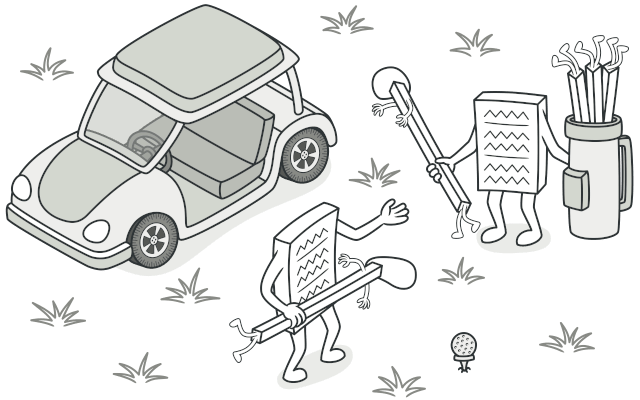
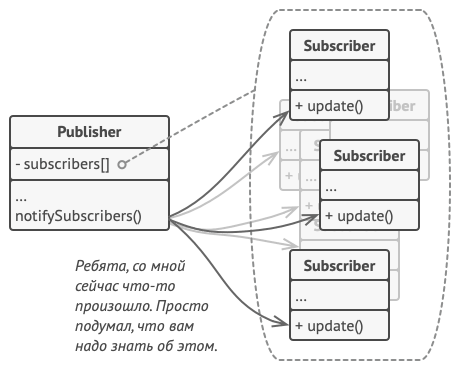
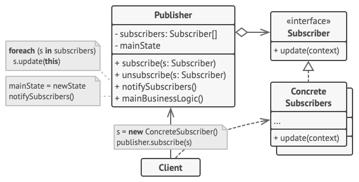
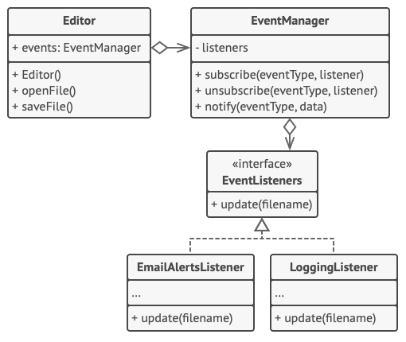

# Поведенческие паттерны проектирования
Список поведенческих паттернов проектирования, которые решают задачи эффективного и безопасного взаимодействия между объектами программы.
+ **Цепочка обязанностей (Chain of Responsibility)**
+ Команда (Command)
+ Итератор (Iterator)
+ Посредник (Mediator)
+ Снимок (Memento)
+ **Наблюдатель (Observer)**
+ Состояние (State)
+ **Стратегия (Strategy)**
+ Шаблонный метод (Template Method)
+ Посетитель (Visitor)
# Цепочка обязанностей
## Суть паттерна
**Цепочка обязанностей** — это поведенческий паттерн проектирования, который позволяет передавать запросы последовательно по цепочке обработчиков. Каждый последующий обработчик решает, может ли он обработать запрос сам и стоит ли передавать запрос дальше по цепи.

## Проблема
Представьте, что вы делаете систему приёма онлайн-заказов. Вы хотите ограничить к ней доступ так, чтобы только авторизованные пользователи могли создавать заказы. Кроме того, определённые пользователи, владеющие правами администратора, должны иметь полный доступ к заказам.

Вы быстро сообразили, что эти проверки нужно выполнять последовательно. Ведь пользователя можно попытаться «залогинить» в систему, если его запрос содержит логин и пароль. Но если такая попытка не удалась, то проверять расширенные права доступа попросту не имеет смысла.

На протяжении следующих нескольких месяцев вам пришлось добавить ещё несколько таких последовательных проверок.

- Неплохо бы проверять данные, передаваемые в запросе перед тем, как вносить их в систему — вдруг запрос содержит данные о покупке несуществующих продуктов.
- Кто-то предложил блокировать массовые отправки формы с одним и тем же логином, чтобы предотвратить подбор паролей ботами.
- Кто-то заметил, что форму заказа неплохо бы доставать из кеша, если она уже была однажды показана.


С каждой новой «фичей» код проверок, выглядящий как большой клубок условных операторов, всё больше и больше раздувался. При изменении одного правила приходилось трогать код всех проверок. А для того, чтобы применить проверки к другим ресурсам, пришлось продублировать их код в других классах.

Поддерживать такой код стало не только очень хлопотно, но и затратно. И вот в один прекрасный день вы получаете задачу рефакторинга...
## Решение
Как и многие другие поведенческие паттерны, Цепочка обязанностей базируется на том, чтобы превратить отдельные поведения в объекты. В нашем случае каждая проверка переедет в отдельный класс с единственным методом выполнения. Данные запроса, над которым происходит проверка, будут передаваться в метод как аргументы.

А теперь по-настоящему важный этап. Паттерн предлагает связать объекты обработчиков в одну цепь. Каждый из них будет иметь ссылку на следующий обработчик в цепи. Таким образом, при получении запроса обработчик сможет не только сам что-то с ним сделать, но и передать обработку следующему объекту в цепочке.

Передавая запросы в первый обработчик цепочки, вы можете быть уверены, что все объекты в цепи смогут его обработать. При этом длина цепочки не имеет никакого значения.

И последний штрих. Обработчик не обязательно должен передавать запрос дальше, причём эта особенность может быть использована по-разному.

В примере с фильтрацией доступа обработчики прерывают дальнейшие проверки, если текущая проверка не прошла. Ведь нет смысла тратить попусту ресурсы, если и так понятно, что с запросом что-то не так.

Но есть и другой подход, при котором обработчики прерывают цепь только когда они _могут_ обработать запрос. В этом случае запрос движется по цепи, пока не найдётся обработчик, который может его обработать. Очень часто такой подход используется для передачи событий, создаваемых классами графического интерфейса в результате взаимодействия с пользователем.

Например, когда пользователь кликает по кнопке, программа выстраивает цепочку из объекта этой кнопки, всех её родительских элементов и общего окна приложения на конце. Событие клика передаётся по этой цепи до тех пор, пока не найдётся объект, способный его обработать. Этот пример примечателен ещё и тем, что цепочку всегда можно выделить из древовидной структуры объектов, в которую обычно и свёрнуты элементы пользовательского интерфейса.


Очень важно, чтобы все объекты цепочки имели общий интерфейс. Обычно каждому конкретному обработчику достаточно знать только то, что следующий объект в цепи имеет метод `выполнить`. Благодаря этому связи между объектами цепочки будут более гибкими. Кроме того, вы сможете формировать цепочки на лету из разнообразных объектов, не привязываясь к конкретным классам.
## Аналогия из жизни

Вы купили новую видеокарту. Она автоматически определилась и заработала под Windows, но в вашей любимой Ubuntu «завести» её не удалось. Со слабой надеждой вы звоните в службу поддержки.

Первым вы слышите голос автоответчика, предлагающий выбор из десятка стандартных решений. Ни один из вариантов не подходит, и робот соединяет вас с живым оператором.

Увы, но рядовой оператор поддержки умеет общаться только заученными фразами и давать шаблонные ответы. После очередного предложения «выключить и включить компьютер» вы просите связать вас с настоящими инженерами.

Оператор перебрасывает звонок дежурному инженеру, изнывающему от скуки в своей каморке. Уж он-то знает, как вам помочь! Инженер рассказывает вам, где скачать подходящие драйвера и как настроить их под Ubuntu. Запрос удовлетворён. Вы кладёте трубку.
## Структура

1. **Обработчик** определяет общий для всех конкретных обработчиков интерфейс. Обычно достаточно описать единственный метод обработки запросов, но иногда здесь может быть объявлен и метод выставления следующего обработчика.
2. **Базовый обработчик** — опциональный класс, который позволяет избавиться от дублирования одного и того же кода во всех конкретных обработчиках.

    Обычно этот класс имеет поле для хранения ссылки на следующий обработчик в цепочке. Клиент связывает обработчики в цепь, подавая ссылку на следующий обработчик через конструктор или сеттер поля. Также здесь можно реализовать базовый метод обработки, который бы просто перенаправлял запрос следующему обработчику, проверив его наличие.
3. **Конкретные обработчики** содержат код обработки запросов. При получении запроса каждый обработчик решает, может ли он обработать запрос, а также стоит ли передать его следующему объекту.

    В большинстве случаев обработчики могут работать сами по себе и быть неизменяемыми, получив все нужные детали через параметры конструктора.
4. **Клиент** может либо сформировать цепочку обработчиков единожды, либо перестраивать её динамически, в зависимости от логики программы. Клиент может отправлять запросы любому из объектов цепочки, не обязательно первому из них.
## Псевдокод
В этом примере **Цепочка обязанностей** отвечает за показ контекстной помощи для активных элементов пользовательского интерфейса.


Графический интерфейс приложения обычно структурирован в виде дерева. Класс `Диалог`, отображающий всё окно приложения — это корень дерева. Диалог содержит `Панели`, которые, в свою очередь, могут содержать либо другие вложенные панели, либо простые элементы, вроде `Кнопок`.

Простые элементы могут показывать небольшие подсказки, если для них указан текст помощи. Но есть и более сложные компоненты, для которых этот способ демонстрации помощи слишком прост. Они определяют собственный способ отображения контекстной помощи.


Пример вызова контекстной помощи в цепочке объектов UI.

Когда пользователь наводит указатель мыши на элемент и жмёт клавишу `F1`, приложение шлёт этому элементу запрос на показ помощи. Если он не содержит никакой справочной информации, запрос путешествует далее по списку контейнера элемента, пока не находится тот, который способен отобразить помощь.
## Применимость
Когда программа должна обрабатывать разнообразные запросы несколькими способами, но заранее неизвестно, какие конкретно запросы будут приходить и какие обработчики для них понадобятся.
С помощью Цепочки обязанностей вы можете связать потенциальных обработчиков в одну цепь и при получении запроса поочерёдно спрашивать каждого из них, не хочет ли он обработать запрос.

Когда важно, чтобы обработчики выполнялись один за другим в строгом порядке.
Цепочка обязанностей позволяет запускать обработчиков последовательно один за другим в том порядке, в котором они находятся в цепочке.

Когда набор объектов, способных обработать запрос, должен задаваться динамически.
В любой момент вы можете вмешаться в существующую цепочку и переназначить связи так, чтобы убрать или добавить новое звено.
##  Преимущества и недостатки
- Уменьшает зависимость между клиентом и обработчиками.
-  Реализует _принцип единственной обязанности_.
-  Реализует _принцип открытости/закрытости_.
- Запрос может остаться никем не обработанным.
## Примеры реализации паттерна
## Слои авторизации и аутентификации пользователей
Этот пример показывает как пользовательские данные проходят последовательную аутентификацию в множестве обработчиков, связанных в одну цепь.

Этот пример отличается от канонической версии тем, что проверка обрывается, если очередной обработчик **не может** обработать запрос. В классическом варианте, следование по цепочке заканчивается как только нашёлся элемент цепи, который **может** обработать запрос. Просто знайте, что Концептуальный пример от этого не меняется, а код отличается только условием выхода из цепи.
###  **middleware**
####  **middleware/Middleware.java:** Базовый класс проверок
```java
package ru.chain_of_responsibility.example.middleware;

/**
 * Базовый класс цепочки.
 */
public abstract class Middleware {
    private Middleware next;

    /**
     * Помогает строить цепь из объектов-проверок.
     */
    public static Middleware link(Middleware first, Middleware... chain) {
        Middleware head = first;
        for (Middleware nextInChain: chain) {
            head.next = nextInChain;
            head = nextInChain;
        }
        return first;
    }

    /**
     * Подклассы реализуют в этом методе конкретные проверки.
     */
    public abstract boolean check(String email, String password);

    /**
     * Запускает проверку в следующем объекте или завершает проверку, если мы в
     * последнем элементе цепи.
     */
    protected boolean checkNext(String email, String password) {
        if (next == null) {
            return true;
        }
        return next.check(email, password);
    }
}
```
####  **middleware/ThrottlingMiddleware.java:** Проверка на лимит запросов

```java
package ru.chain_of_responsibility.example.middleware;

/**
 * Конкретный элемент цепи обрабатывает запрос по-своему.
 */
public class ThrottlingMiddleware extends Middleware {
    private int requestPerMinute;
    private int request;
    private long currentTime;

    public ThrottlingMiddleware(int requestPerMinute) {
        this.requestPerMinute = requestPerMinute;
        this.currentTime = System.currentTimeMillis();
    }

    /**
     * Обратите внимание, вызов checkNext() можно вставить как в начале этого
     * метода, так и в середине или в конце.
     *
     * Это даёт еще один уровень гибкости по сравнению с проверками в цикле.
     * Например, элемент цепи может пропустить все остальные проверки вперёд и
     * запустить свою проверку в конце.
     */
    public boolean check(String email, String password) {
        if (System.currentTimeMillis() > currentTime + 60_000) {
            request = 0;
            currentTime = System.currentTimeMillis();
        }

        request++;

        if (request > requestPerMinute) {
            System.out.println("Request limit exceeded!");
            Thread.currentThread().stop();
        }
        return checkNext(email, password);
    }
}
```
####  **middleware/UserExistsMiddleware.java:** Проверка пароля
```java
package ru.chain_of_responsibility.example.middleware;

import ru.chain_of_responsibility.example.server.Server;

/**
 * Конкретный элемент цепи обрабатывает запрос по-своему.
 */
public class UserExistsMiddleware extends Middleware {
    private Server server;

    public UserExistsMiddleware(Server server) {
        this.server = server;
    }

    public boolean check(String email, String password) {
        if (!server.hasEmail(email)) {
            System.out.println("This email is not registered!");
            return false;
        }
        if (!server.isValidPassword(email, password)) {
            System.out.println("Wrong password!");
            return false;
        }
        return checkNext(email, password);
    }
}
```
####  **middleware/RoleCheckMiddleware.java:** Проверка роли
```java
package ru.chain_of_responsibility.example.middleware;

/**
 * Конкретный элемент цепи обрабатывает запрос по-своему.
 */
public class RoleCheckMiddleware extends Middleware {
    public boolean check(String email, String password) {
        if (email.equals("admin@example.com")) {
            System.out.println("Hello, admin!");
            return true;
        }
        System.out.println("Hello, user!");
        return checkNext(email, password);
    }
}
```
### **server**
####  **server/Server.java:** Сервер, на который заходим
```java
package ru.chain_of_responsibility.example.server;

import ru.chain_of_responsibility.example.middleware.Middleware;

import java.util.HashMap;
import java.util.Map;

/**
 * Класс сервера.
 */
public class Server {
    private Map<String, String> users = new HashMap<>();
    private Middleware middleware;

    /**
     * Клиент подаёт готовую цепочку в сервер. Это увеличивает гибкость и
     * упрощает тестирование класса сервера.
     */
    public void setMiddleware(Middleware middleware) {
        this.middleware = middleware;
    }

    /**
     * Сервер получает email и пароль от клиента и запускает проверку
     * авторизации у цепочки.
     */
    public boolean logIn(String email, String password) {
        if (middleware.check(email, password)) {
            System.out.println("Authorization have been successful!");

            // Здесь должен быть какой-то полезный код, работающий для
            // авторизированных пользователей.

            return true;
        }
        return false;
    }

    public void register(String email, String password) {
        users.put(email, password);
    }

    public boolean hasEmail(String email) {
        return users.containsKey(email);
    }

    public boolean isValidPassword(String email, String password) {
        return users.get(email).equals(password);
    }
}
```
####  **Demo.java:** Клиентский код
```java
package ru.chain_of_responsibility.example;

import ru.chain_of_responsibility.example.middleware.Middleware;
import ru.chain_of_responsibility.example.middleware.RoleCheckMiddleware;
import ru.chain_of_responsibility.example.middleware.ThrottlingMiddleware;
import ru.chain_of_responsibility.example.middleware.UserExistsMiddleware;
import ru.chain_of_responsibility.example.server.Server;

import java.io.BufferedReader;
import java.io.IOException;
import java.io.InputStreamReader;

/**
 * Демо-класс. Здесь всё сводится воедино.
 */
public class Demo {
    private static BufferedReader reader = new BufferedReader(new InputStreamReader(System.in));
    private static Server server;

    private static void init() {
        server = new Server();
        server.register("admin@example.com", "admin_pass");
        server.register("user@example.com", "user_pass");

        // Проверки связаны в одну цепь. Клиент может строить различные цепи,
        // используя одни и те же компоненты.
        Middleware middleware = Middleware.link(
            new ThrottlingMiddleware(2),
            new UserExistsMiddleware(server),
            new RoleCheckMiddleware()
        );

        // Сервер получает цепочку от клиентского кода.
        server.setMiddleware(middleware);
    }

    public static void main(String[] args) throws IOException {
        init();

        boolean success;
        do {
            System.out.print("Enter email: ");
            String email = reader.readLine();
            System.out.print("Input password: ");
            String password = reader.readLine();
            success = server.logIn(email, password);
        } while (!success);
    }
}
```
####  **OutputDemo.txt:** Результат выполнения
```
Enter email: admin@example.com
Input password: admin_pass
Hello, admin!
Authorization have been successful!


Enter email: wrong@example.com
Input password: wrong_pass
This email is not registered!
Enter email: wrong@example.com
Input password: wrong_pass
This email is not registered!
Enter email: wrong@example.com
Input password: wrong_pass
Request limit exceeded!
```
# Стратегия
## Суть паттерна
**Стратегия** — это поведенческий паттерн проектирования, который определяет семейство схожих алгоритмов и помещает каждый из них в собственный класс, после чего алгоритмы можно взаимозаменять прямо во время исполнения программы.

## Проблема
Вы решили написать приложение-навигатор для путешественников. Оно должно показывать красивую и удобную карту, позволяющую с лёгкостью ориентироваться в незнакомом городе.

Одной из самых востребованных функций являлся поиск и прокладывание маршрутов. Пребывая в неизвестном ему городе, пользователь должен иметь возможность указать начальную точку и пункт назначения, а навигатор — проложит оптимальный путь.

Первая версия вашего навигатора могла прокладывать маршрут лишь по дорогам, поэтому отлично подходила для путешествий на автомобиле. Но, очевидно, не все ездят в отпуск на машине. Поэтому следующим шагом вы добавили в навигатор прокладывание пеших маршрутов.

Через некоторое время выяснилось, что некоторые люди предпочитают ездить по городу на общественном транспорте. Поэтому вы добавили и такую опцию прокладывания пути.

Но и это ещё не всё. В ближайшей перспективе вы хотели бы добавить прокладывание маршрутов по велодорожкам. А в отдалённом будущем — интересные маршруты посещения достопримечательностей.

Код навигатора становится слишком раздутым.

Если с популярностью навигатора не было никаких проблем, то техническая часть вызывала вопросы и периодическую головную боль. С каждым новым алгоритмом код основного класса навигатора увеличивался вдвое. В таком большом классе стало довольно трудно ориентироваться.

Любое изменение алгоритмов поиска, будь то исправление багов или добавление нового алгоритма, затрагивало основной класс. Это повышало риск сделать ошибку, случайно задев остальной работающий код.

Кроме того, осложнялась командная работа с другими программистами, которых вы наняли после успешного релиза навигатора. Ваши изменения нередко затрагивали один и тот же код, создавая конфликты, которые требовали дополнительного времени на их разрешение.
## Решение
Паттерн Стратегия предлагает определить семейство схожих алгоритмов, которые часто изменяются или расширяются, и вынести их в собственные классы, называемые _стратегиями_.

Вместо того, чтобы изначальный класс сам выполнял тот или иной алгоритм, он будет играть роль контекста, ссылаясь на одну из стратегий и делегируя ей выполнение работы. Чтобы сменить алгоритм, вам будет достаточно подставить в контекст другой объект-стратегию.

Важно, чтобы все стратегии имели общий интерфейс. Используя этот интерфейс, контекст будет независимым от конкретных классов стратегий. С другой стороны, вы сможете изменять и добавлять новые виды алгоритмов, не трогая код контекста.


Стратегии построения пути.

В нашем примере каждый алгоритм поиска пути переедет в свой собственный класс. В этих классах будет определён лишь один метод, принимающий в параметрах координаты начала и конца пути, а возвращающий массив точек маршрута.

Хотя каждый класс будет прокладывать маршрут по-своему, для навигатора это не будет иметь никакого значения, так как его работа заключается только в отрисовке маршрута. Навигатору достаточно подать в стратегию данные о начале и конце маршрута, чтобы получить массив точек маршрута в оговорённом формате.

Класс навигатора будет иметь метод для установки стратегии, позволяя изменять стратегию поиска пути на лету. Такой метод пригодится клиентскому коду навигатора, например, переключателям типов маршрутов в пользовательском интерфейсе.
##  Аналогия из жизни

Различные стратегии попадания в аэропорт.

Вам нужно добраться до аэропорта. Можно доехать на автобусе, такси или велосипеде. Здесь вид транспорта является стратегией. Вы выбираете конкретную стратегию в зависимости от контекста — наличия денег или времени до отлёта.
## Структура


1. **Контекст** хранит ссылку на объект конкретной стратегии, работая с ним через общий интерфейс стратегий.
2. **Стратегия** определяет интерфейс, общий для всех вариаций алгоритма. Контекст использует этот интерфейс для вызова алгоритма. Для контекста неважно, какая именно вариация алгоритма будет выбрана, так как все они имеют одинаковый интерфейс.
3. **Конкретные стратегии** реализуют различные вариации алгоритма.
4. Во время выполнения программы контекст получает вызовы от клиента и делегирует их объекту конкретной стратегии.
5. Клиент должен создать объект конкретной стратегии и передать его в конструктор контекста. Кроме этого, клиент должен иметь возможность заменить стратегию на лету, используя сеттер. Благодаря этому, контекст не будет знать о том, какая именно стратегия сейчас выбрана.
## Применимость
Когда вам нужно использовать разные вариации какого-то алгоритма внутри одного объекта.
Стратегия позволяет варьировать поведение объекта во время выполнения программы, подставляя в него различные объекты-поведения (например, отличающиеся балансом скорости и потребления ресурсов).

Когда у вас есть множество похожих классов, отличающихся только некоторым поведением.
Стратегия позволяет вынести отличающееся поведение в отдельную иерархию классов, а затем свести первоначальные классы к одному, сделав поведение этого класса настраиваемым.

Когда вы не хотите обнажать детали реализации алгоритмов для других классов.
Стратегия позволяет изолировать код, данные и зависимости алгоритмов от других объектов, скрыв эти детали внутри классов-стратегий.

Когда различные вариации алгоритмов реализованы в виде развесистого условного оператора. Каждая ветка такого оператора представляет собой вариацию алгоритма.
Стратегия помещает каждую лапу такого оператора в отдельный класс-стратегию. Затем контекст получает определённый объект-стратегию от клиента и делегирует ему работу. Если вдруг понадобится сменить алгоритм, в контекст можно подать другую стратегию.
##  Преимущества и недостатки
- Горячая замена алгоритмов на лету.
- Изолирует код и данные алгоритмов от остальных классов.
- Уход от наследования к делегированию.
- Реализует _принцип открытости/закрытости_.
- Усложняет программу за счёт дополнительных классов.
- Клиент должен знать, в чём состоит разница между стратегиями, чтобы выбрать подходящую.
## Примеры реализации паттерна
## Методы оплаты в интернет магазине
В этом примере Стратегия реализует выбор платёжного метода в интернет магазине. Когда пользователь сформировал заказ, он получает выбор из нескольких платёжных стредств: электронного кошелька или кредитной карты.

В данном случае конкретные стратегии платёжных методов не только проводят саму оплату, но и собирают необходимые данные на форме заказа.
### **strategies**
####  **strategies/PayStrategy.java:** Общий интерфейс стратегий оплаты
```java
package ru.strategy.example.strategies;

/**
 * Общий интерфейс всех стратегий.
 */
public interface PayStrategy {
    boolean pay(int paymentAmount);
    void collectPaymentDetails();
}
```
####  **strategies/PayByPayPal.java:** Оплата через PayPal
```java
package ru.strategy.example.strategies;

import java.io.BufferedReader;
import java.io.IOException;
import java.io.InputStreamReader;
import java.util.HashMap;
import java.util.Map;

/**
 * Конкретная стратегия. Реализует оплату корзины интернет магазина через
 * платежную систему PayPal.
 */
public class PayByPayPal implements PayStrategy {
    private static final Map<String, String> DATA_BASE = new HashMap<>();
    private final BufferedReader READER = new BufferedReader(new InputStreamReader(System.in));
    private String email;
    private String password;
    private boolean signedIn;

    static {
        DATA_BASE.put("amanda1985", "amanda@ya.com");
        DATA_BASE.put("qwerty", "john@amazon.eu");
    }

    /**
     * Собираем данные от клиента.
     */
    @Override
    public void collectPaymentDetails() {
        try {
            while (!signedIn) {
                System.out.print("Enter the user's email: ");
                email = READER.readLine();
                System.out.print("Enter the password: ");
                password = READER.readLine();
                if (verify()) {
                    System.out.println("Data verification has been successful.");
                } else {
                    System.out.println("Wrong email or password!");
                }
            }
        } catch (IOException ex) {
            ex.printStackTrace();
        }
    }

    private boolean verify() {
        setSignedIn(email.equals(DATA_BASE.get(password)));
        return signedIn;
    }

    /**
     * Если клиент уже вошел в систему, то для следующей оплаты данные вводить
     * не придется.
     */
    @Override
    public boolean pay(int paymentAmount) {
        if (signedIn) {
            System.out.println("Paying " + paymentAmount + " using PayPal.");
            return true;
        } else {
            return false;
        }
    }

    private void setSignedIn(boolean signedIn) {
        this.signedIn = signedIn;
    }
}
```
####  **strategies/PayByCreditCard.java:** Оплата кредиткой
```java
package ru.strategy.example.strategies;

import java.io.BufferedReader;
import java.io.IOException;
import java.io.InputStreamReader;

/**
 * Конкретная стратегия. Реализует оплату корзины интернет магазина кредитной
 * картой клиента.
 */
public class PayByCreditCard implements PayStrategy {
    private final BufferedReader READER = new BufferedReader(new InputStreamReader(System.in));
    private CreditCard card;

    /**
     * Собираем данные карты клиента.
     */
    @Override
    public void collectPaymentDetails() {
        try {
            System.out.print("Enter the card number: ");
            String number = READER.readLine();
            System.out.print("Enter the card expiration date 'mm/yy': ");
            String date = READER.readLine();
            System.out.print("Enter the CVV code: ");
            String cvv = READER.readLine();
            card = new CreditCard(number, date, cvv);

            // Валидируем номер карты...

        } catch (IOException ex) {
            ex.printStackTrace();
        }
    }

    /**
     * После проверки карты мы можем совершить оплату. Если клиент продолжает
     * покупки, мы не запрашиваем карту заново.
     */
    @Override
    public boolean pay(int paymentAmount) {
        if (cardIsPresent()) {
            System.out.println("Paying " + paymentAmount + " using Credit Card.");
            card.setAmount(card.getAmount() - paymentAmount);
            return true;
        } else {
            return false;
        }
    }

    private boolean cardIsPresent() {
        return card != null;
    }
}
```
####  **strategies/CreditCard.java:** Кредитная карта
```java
package ru.strategy.example.strategies;

/**
 * Очень наивная реализация кредитной карты.
 */
public class CreditCard {
    private int amount;
    private String number;
    private String date;
    private String cvv;

    CreditCard(String number, String date, String cvv) {
        this.amount = 100_000;
        this.number = number;
        this.date = date;
        this.cvv = cvv;
    }

    public void setAmount(int amount) {
        this.amount = amount;
    }

    public int getAmount() {
        return amount;
    }
}
```
### **order**
####  **order/Order.java:** Класс заказа
```java
package ru.strategy.example.order;

import ru.strategy.example.strategies.PayStrategy;

/**
 * Класс заказа. Ничего не знает о том каким способом (стратегией) будет
 * расчитыватся клиент, а просто вызывает метод оплаты. Все остальное стратегия
 * делает сама.
 */
public class Order {
    private int totalCost = 0;
    private boolean isClosed = false;

    public void processOrder(PayStrategy strategy) {
        strategy.collectPaymentDetails();
        // Здесь мы могли бы забрать и сохранить платежные данные из стратегии.
    }

    public void setTotalCost(int cost) {
        this.totalCost += cost;
    }

    public int getTotalCost() {
        return totalCost;
    }

    public boolean isClosed() {
        return isClosed;
    }

    public void setClosed() {
        isClosed = true;
    }
}
```
####  **Demo.java:** Клиентский код
```java
package ru.strategy.example;

import ru.strategy.example.order.Order;
import ru.strategy.example.strategies.PayByCreditCard;
import ru.strategy.example.strategies.PayByPayPal;
import ru.strategy.example.strategies.PayStrategy;

import java.io.BufferedReader;
import java.io.IOException;
import java.io.InputStreamReader;
import java.util.HashMap;
import java.util.Map;

/**
 * Первый в мире консольный интерет магазин.
 */
public class Demo {
    private static Map<Integer, Integer> priceOnProducts = new HashMap<>();
    private static BufferedReader reader = new BufferedReader(new InputStreamReader(System.in));
    private static Order order = new Order();
    private static PayStrategy strategy;

    static {
        priceOnProducts.put(1, 2200);
        priceOnProducts.put(2, 1850);
        priceOnProducts.put(3, 1100);
        priceOnProducts.put(4, 890);
    }

    public static void main(String[] args) throws IOException {
        while (!order.isClosed()) {
            int cost;

            String continueChoice;
            do {
                System.out.print("Please, select a product:" + "\n" +
                        "1 - Mother board" + "\n" +
                        "2 - CPU" + "\n" +
                        "3 - HDD" + "\n" +
                        "4 - Memory" + "\n");
                int choice = Integer.parseInt(reader.readLine());
                cost = priceOnProducts.get(choice);
                System.out.print("Count: ");
                int count = Integer.parseInt(reader.readLine());
                order.setTotalCost(cost * count);
                System.out.print("Do you wish to continue selecting products? Y/N: ");
                continueChoice = reader.readLine();
            } while (continueChoice.equalsIgnoreCase("Y"));

            if (strategy == null) {
                System.out.println("Please, select a payment method:" + "\n" +
                        "1 - PalPay" + "\n" +
                        "2 - Credit Card");
                String paymentMethod = reader.readLine();

                // Клиент создаёт различные стратегии на основании
                // пользовательских данных, конфигурации и прочих параметров.
                if (paymentMethod.equals("1")) {
                    strategy = new PayByPayPal();
                } else {
                    strategy = new PayByCreditCard();
                }
            }

            // Объект заказа делегирует сбор платёжных данны стратегии, т.к.
            // только стратегии знают какие данные им нужны для приёма оплаты.
            order.processOrder(strategy);

            System.out.print("Pay " + order.getTotalCost() + " units or Continue shopping? P/C: ");
            String proceed = reader.readLine();
            if (proceed.equalsIgnoreCase("P")) {
                // И наконец, стратегия запускает приём платежа.
                if (strategy.pay(order.getTotalCost())) {
                    System.out.println("Payment has been successful.");
                } else {
                    System.out.println("FAIL! Please, check your data.");
                }
                order.setClosed();
            }
        }
    }
}
```
####  **OutputDemo.txt:** Результат выполнения
```
Please, select a product:
1 - Mother board
2 - CPU
3 - HDD
4 - Memory
1
Count: 2
Do you wish to continue selecting products? Y/N: y
Please, select a product:
1 - Mother board
2 - CPU
3 - HDD
4 - Memory
2
Count: 1
Do you wish to continue selecting products? Y/N: n
Please, select a payment method:
1 - PalPay
2 - Credit Card
1
Enter the user's email: user@example.com
Enter the password: qwerty
Wrong email or password!
Enter user email: amanda@ya.com
Enter password: amanda1985
Data verification has been successful.
Pay 6250 units or Continue shopping?  P/C: p
Paying 6250 using PayPal.
Payment has been successful.
```
# Наблюдатель
## Суть паттерна
**Наблюдатель** — это поведенческий паттерн проектирования, который создаёт механизм подписки, позволяющий одним объектам следить и реагировать на события, происходящие в других объектах.


## Проблема
Представьте, что вы имеете два объекта: `Покупатель` и `Магазин`. В магазин вот-вот должны завезти новый товар, который интересен покупателю.

Покупатель может каждый день ходить в магазин, чтобы проверить наличие товара. Но при этом он будет злиться, без толку тратя своё драгоценное время.

Постоянное посещение магазина или спам?

С другой стороны, магазин может разослать спам каждому своему покупателю. Многих это расстроит, так как товар специфический, и не всем он нужен.

Получается конфликт: либо покупатель тратит время на периодические проверки, либо магазин тратит ресурсы на бесполезные оповещения.
## Решение
Давайте называть `Издателями` те объекты, которые содержат важное или интересное для других состояние. Остальные объекты, которые хотят отслеживать изменения этого состояния, назовём `Подписчиками`.

Паттерн Наблюдатель предлагает хранить внутри объекта издателя список ссылок на объекты подписчиков, причём издатель не должен вести список подписки самостоятельно. Он предоставит методы, с помощью которых подписчики могли бы добавлять или убирать себя из списка.


Подписка на события.

Теперь самое интересное. Когда в издателе будет происходить важное событие, он будет проходиться по списку подписчиков и оповещать их об этом, вызывая определённый метод объектов-подписчиков.

Издателю безразлично, какой класс будет иметь тот или иной подписчик, так как все они должны следовать общему интерфейсу и иметь единый метод оповещения.

Оповещения о событиях.

Увидев, как складно всё работает, вы можете выделить общий интерфейс, описывающий методы подписки и отписки, и для всех издателей. После этого подписчики смогут работать с разными типами издателей, а также получать оповещения от них через один и тот же метод.
##  Аналогия из жизни

Подписка на газеты и их доставка.

После того как вы оформили подписку на газету или журнал, вам больше не нужно ездить в супермаркет и проверять, не вышел ли очередной номер. Вместо этого издательство будет присылать новые номера по почте прямо к вам домой сразу после их выхода.

Издательство ведёт список подписчиков и знает, кому какой журнал высылать. Вы можете в любой момент отказаться от подписки, и журнал перестанет вам приходить.
## Структура


1. **Издатель** владеет внутренним состоянием, изменение которого интересно отслеживать подписчикам. Издатель содержит механизм подписки: список подписчиков и методы подписки/отписки.
2. Когда внутреннее состояние издателя меняется, он оповещает своих подписчиков. Для этого издатель проходит по списку подписчиков и вызывает их метод оповещения, заданный в общем интерфейсе подписчиков.
3. **Подписчик** определяет интерфейс, которым пользуется издатель для отправки оповещения. В большинстве случаев для этого достаточно единственного метода.
4. **Конкретные подписчики** выполняют что-то в ответ на оповещение, пришедшее от издателя. Эти классы должны следовать общему интерфейсу подписчиков, чтобы издатель не зависел от конкретных классов подписчиков.
5. По приходу оповещения подписчику нужно получить обновлённое состояние издателя. Издатель может передать это состояние через параметры метода оповещения. Более гибкий вариант — передавать через параметры весь объект издателя, чтобы подписчик мог сам получить требуемые данные. Как вариант, подписчик может постоянно хранить ссылку на объект издателя, переданный ему в конструкторе.
6. **Клиент** создаёт объекты издателей и подписчиков, а затем регистрирует подписчиков на обновления в издателях.
## Псевдокод
В этом примере **Наблюдатель** позволяет объекту текстового редактора оповещать другие объекты об изменениях своего состояния.

Пример оповещения объектов о событиях в других объектах.

Список подписчиков составляется динамически, объекты могут как подписываться на определённые события, так и отписываться от них прямо во время выполнения программы.

В этой реализации редактор не ведёт список подписчиков самостоятельно, а делегирует это вложенному объекту. Это даёт возможность использовать механизм подписки не только в классе редактора, но и в других классах программы.

Для добавления в программу новых подписчиков не нужно менять классы издателей, пока они работают с подписчиками через общий интерфейс.
## Применимость
Когда после изменения состояния одного объекта требуется что-то сделать в других, но вы не знаете наперёд, какие именно объекты должны отреагировать.
Описанная проблема может возникнуть при разработке библиотек пользовательского интерфейса, когда вам надо дать возможность сторонним классам реагировать на клики по кнопкам.
Паттерн Наблюдатель позволяет любому объекту с интерфейсом подписчика зарегистрироваться на получение оповещений о событиях, происходящих в объектах-издателях.

Когда одни объекты должны наблюдать за другими, но только в определённых случаях.
Издатели ведут динамические списки. Все наблюдатели могут подписываться или отписываться от получения оповещений прямо во время выполнения программы.
## Преимущества и недостатки
- Издатели не зависят от конкретных классов подписчиков и наоборот.
- Вы можете подписывать и отписывать получателей на лету.
- Реализует _принцип открытости/закрытости_.
- Подписчики оповещаются в случайном порядке.
## Примеры реализации паттерна
## Подписка и оповещения
В этом примере Наблюдатель используется для передачи событий между объектами текстового редактора. Всякий раз когда объект редактора меняет своё состояние, он оповещает своих наблюдателей. Объекты `EmailNotificationListener` и `LogOpenListener` следят за этими уведомлениями и выполняют полезную работу в ответ.

Классы подписчиков не связаны с классом редактора и могут быть повторно использованы в других приложениях если потребуется. Класс `Editor` зависит только от общего интерфейса подписчиков. Это позволяет добавлять новые типы подписчиков не меняя существующего кода редактора.

### **publisher**
####  **publisher/EventManager.java:** Базовый издатель
```java
package ru.observer.example.publisher;

import ru.observer.example.listeners.EventListener;

import java.io.File;
import java.util.ArrayList;
import java.util.HashMap;
import java.util.List;
import java.util.Map;

public class EventManager {
    Map<String, List<EventListener>> listeners = new HashMap<>();

    public EventManager(String... operations) {
        for (String operation : operations) {
            this.listeners.put(operation, new ArrayList<>());
        }
    }

    public void subscribe(String eventType, EventListener listener) {
        List<EventListener> users = listeners.get(eventType);
        users.add(listener);
    }

    public void unsubscribe(String eventType, EventListener listener) {
        List<EventListener> users = listeners.get(eventType);
        users.remove(listener);
    }

    public void notify(String eventType, File file) {
        List<EventListener> users = listeners.get(eventType);
        for (EventListener listener : users) {
            listener.update(eventType, file);
        }
    }
}
```

### **editor**
####  **editor/Editor.java:** Конкретный издатель, изменение которого хотят отслеживать наблюдатели
```java
package ru.observer.example.editor;

import ru.observer.example.publisher.EventManager;

import java.io.File;

public class Editor {
    public EventManager events;
    private File file;

    public Editor() {
        this.events = new EventManager("open", "save");
    }

    public void openFile(String filePath) {
        this.file = new File(filePath);
        events.notify("open", file);
    }

    public void saveFile() throws Exception {
        if (this.file != null) {
            events.notify("save", file);
        } else {
            throw new Exception("Please open a file first.");
        }
    }
}
```

###  **listeners**
####  **listeners/EventListener.java:** Интерфейс подписчиков
```java
package refactoring_guru.observer.example.listeners;

import java.io.File;

public interface EventListener {
    void update(String eventType, File file);
}
```
####  **listeners/EmailNotificationListener.java:** Слушатель, рассылающий email-уведомления
```java
package ru.observer.example.listeners;

import java.io.File;

public class EmailNotificationListener implements EventListener {
    private String email;

    public EmailNotificationListener(String email) {
        this.email = email;
    }

    @Override
    public void update(String eventType, File file) {
        System.out.println("Email to " + email + ": Someone has performed " + eventType + " operation with the following file: " + file.getName());
    }
}
```

####  **listeners/LogOpenListener.java:** Слушатель, записывающий лог операций
```java
package ru.observer.example.listeners;

import java.io.File;

public class LogOpenListener implements EventListener {
    private File log;

    public LogOpenListener(String fileName) {
        this.log = new File(fileName);
    }

    @Override
    public void update(String eventType, File file) {
        System.out.println("Save to log " + log + ": Someone has performed " + eventType + " operation with the following file: " + file.getName());
    }
}
```
####  **Demo.java:** Клиентский код
```java
package ru.observer.example;

import ru.observer.example.editor.Editor;
import ru.observer.example.listeners.EmailNotificationListener;
import ru.observer.example.listeners.LogOpenListener;

public class Demo {
    public static void main(String[] args) {
        Editor editor = new Editor();
        editor.events.subscribe("open", new LogOpenListener("/path/to/log/file.txt"));
        editor.events.subscribe("save", new EmailNotificationListener("admin@example.com"));

        try {
            editor.openFile("test.txt");
            editor.saveFile();
        } catch (Exception e) {
            e.printStackTrace();
        }
    }
}
```
####  **OutputDemo.txt:** Результат выполнения
```
Save to log \path\to\log\file.txt: Someone has performed open operation with the following file: test.txt
Email to admin@example.com: Someone has performed save operation with the following file: test.txt
```
