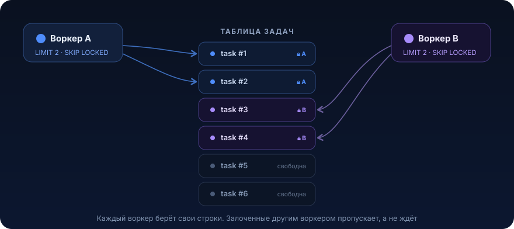
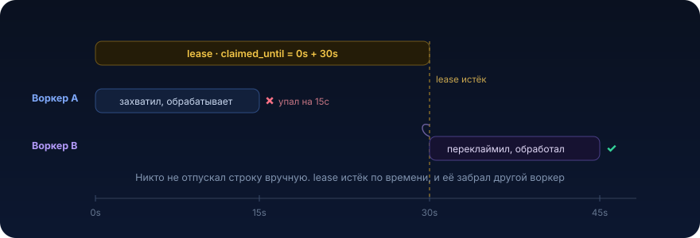

# Claim и lease


Почти в каждом сервисе есть фоновый разгребатель очереди в таблице: поллер outbox, отправка уведомлений, дозапрос данных, пересчёт по расписанию. Пока инстанс один, всё просто. Как только их становится два (а их станет два, ради HA и throughput), возникает вопрос: как несколько воркеров разбирают одну таблицу задач, не обрабатывая одни и те же строки и не блокируя друг друга. Урок про два приёма, которые это решают: короткий захват через `SKIP LOCKED` и lease по времени

## Разминка

Три вопроса перед чтением. Ответы под спойлером.

1. Поллер держит `SELECT ... FOR UPDATE` открытым на всё время обработки строки (внешний вызов ~20с). Пул соединений 10. Что произойдёт при пачке из 100 строк?
2. Два инстанса поллера читают одну таблицу задач одновременно. Как сделать, чтобы они не брали одни и те же строки и при этом не ждали друг друга?
3. Воркер захватил строку и упал посреди обработки. Как другой воркер поймёт, что строку можно забрать?

<details>
<summary>Показать ответы</summary>

1. **Пул соединений закончится.** Каждая долгая транзакция держит соединение, 10 строк займут весь пул, остальные воркеры ждут коннект, throughput падает почти до нуля. Держать лок на всё время обработки нельзя, особенно если внутри внешний вызов
2. **`FOR UPDATE SKIP LOCKED`.** Каждый воркер берёт свою пачку, строки, залоченные другим воркером, пропускаются вместо ожидания. Никто никого не блокирует
3. **По времени.** Строка помечается «занята до момента T» (lease, claimed_until). Если воркер умер, T проходит, строка снова видна как свободная и её переклаймит другой. Отдельный статус «в обработке» для этого не нужен, достаточно таймстампа

</details>

## Проблема

Есть таблица задач и фоновый поллер, который раз в N секунд забирает пачку и обрабатывает. Наивная версия на одном инстансе:

```java
@Scheduled(fixedDelay = 30_000)
@Transactional
public void poll() {
    var tasks = taskRepo.findByStatus(Status.PENDING);   // взяли всё pending
    for (var task : tasks) {
        var result = externalProvider.send(task);        // ← внешний вызов, может быть медленным
        task.markSent(result);
    }
}
```

Пока инстанс один, а задач мало, это работает. Дальше начинаются проблемы:

- **два инстанса берут одни и те же строки.** Оба прочитали `PENDING`, оба отправили, клиент получил уведомление дважды
- **одна транзакция на всю пачку.** Внешний вызов внутри `@Transactional` держит соединение и блокировки всё время отправки. Сто задач по 200 мс это транзакция на 20 секунд
- **упавший воркер роняет всю пачку.** Обработали 50 из 100, инстанс упал, транзакция откатилась, 50 успешных отправок «забыты», при следующем проходе отправятся снова

Соблазн решить это через `SELECT ... FOR UPDATE` (залочить строки, чтобы второй инстанс их не взял) упирается в ту же стену: лок живёт до конца транзакции, а транзакция висит на всё время обработки. Лочить строку на 20 секунд, пока идёт HTTP-запрос наружу, значит держать соединение и блокировку ровно столько же. Пул кончится.

Правильная постановка: **захват строки должен быть коротким и не совпадать по времени с обработкой.** Забрать пачку, быстро закоммитить захват, обработать снаружи транзакции. Дальше два способа, как это сделать

## Что это и когда применять

Обе техники решают одну задачу: несколько воркеров разбирают строки из таблицы, каждую строку берёт ровно один воркер за цикл, без взаимной блокировки.

**`FOR UPDATE SKIP LOCKED`** это короткий эксклюзивный захват. Воркер лочит N строк, строки, уже залоченные другими, пропускает. Лок живёт, пока открыта транзакция. Годится, когда обработка **быстрая** и укладывается в ту же короткую транзакцию: пересчитать поле, переложить в другую таблицу, отправить в локальную очередь.

**Lease (claim по времени)** это захват на срок. Воркер быстро проставляет строке «занята до `now() + TTL`» и сразу коммитит. Обработка идёт **вне** этой транзакции. Если воркер упал, TTL истекает и строку берёт другой. Годится, когда обработка **долгая или содержит внешний вызов**: отправка через провайдера, дозапрос в другой сервис, любая работа, которую нельзя держать под открытой транзакцией.

Как выбрать:

| Ситуация | Приём |
|---|---|
| Обработка быстрая, целиком в БД, одна короткая транзакция | `SELECT ... FOR UPDATE SKIP LOCKED` |
| Обработка долгая или есть внешний вызов (HTTP, брокер, провайдер) | Lease по времени (claimed_until) |
| Воркеров несколько, важна устойчивость к падению инстанса | Lease, обязательно |
| Строгий «ровно один раз» на обработке | Ни один сам по себе не даёт, нужна идемпотентность (см. [01](01-idempotency.md)) |

### Когда НЕ нужно

- **один инстанс и обработка тривиальна.** Пока поллер один и внутри нет внешних вызовов, хватит обычной транзакции. Не тащите lease заранее
- **есть готовый брокер под задачу.** Если у вас уже Kafka или SQS и семантика туда ложится, не превращайте таблицу в очередь руками. Claim/lease по таблице это когда очередь именно в БД (тот же outbox, задачи со сложным SQL-фильтром, транзакционная связка с бизнес-данными)
- **работа не разбивается на строки.** Claim про «много независимых единиц работы». Для единичной синглтон-задачи нужен не claim, а leader election или распределённый лок

## Как это работает

### SKIP LOCKED: короткий захват

```sql
SELECT id, payload
FROM outbound_task
WHERE status = 'PENDING'
ORDER BY created_at
FOR UPDATE SKIP LOCKED
LIMIT 100;
```

Каждый воркер в своей транзакции берёт до 100 не залоченных строк. Параллельный воркер те же строки видит залоченными и пропускает (`SKIP LOCKED`), а не ждёт. Обработка идёт внутри этой же транзакции, на коммите локи снимаются. Ключевое ограничение: **лок держится до конца транзакции**, поэтому обработка обязана быть быстрой.

### Lease: захват на срок

Когда обработка долгая, захват и обработку надо разнести. Помечаем строки «занята до `now() + TTL`» и сразу коммитим:

```sql
UPDATE outbound_task
SET claimed_until = now() + interval '30 seconds',
    claimed_by    = :workerId,
    updated_at    = now()
WHERE id IN (
    SELECT id FROM outbound_task
    WHERE status = 'PENDING'
      AND (claimed_until IS NULL OR claimed_until < now())   -- свободна или lease истёк
    ORDER BY created_at
    FOR UPDATE SKIP LOCKED
    LIMIT 100
)
RETURNING id, payload;
```

Внутренний `SELECT ... FOR UPDATE SKIP LOCKED` защищает от гонки двух воркеров на самом захвате, а `UPDATE ... RETURNING` возвращает захваченные строки. Транзакция короткая: только пометка. Дальше воркер обрабатывает `RETURNING`-строки **вне** этой транзакции. Логика видимости строки простая:

- `claimed_until IS NULL` строку ещё никто не брал
- `claimed_until < now()` кто-то брал, но не завершил вовремя, lease истёк, строку можно забрать
- `claimed_until >= now()` строка сейчас у живого воркера, не трогаем

<p align="center">
  
</p>

Отдельный статус «IN_PROGRESS» здесь **избыточен**. Таймстамп `claimed_until` сам по себе кодирует и «занята», и «до какого момента». Промежуточный статус только добавит ещё одно состояние, которое надо не забыть сбросить при падении, а lease сбрасывается сам, по времени.

### Что при падении воркера

<p align="center">
  
</p>

Воркер A захватил строку до `t + 30s` и упал на 15-й секунде. Строка остаётся помеченной, но никем не обрабатывается. На 30-й секунде lease истекает, и следующий цикл любого воркера видит строку свободной и берёт её. Никакого ручного «отпустить лок при падении» не нужно, время всё делает само. Плата за это: строку обработают **дважды** (A частично, B целиком), поэтому обработка обязана быть идемпотентной.

### TTL нужно подбирать

Lease TTL должен быть **больше** реального времени обработки, иначе живой воркер не успеет закончить, lease истечёт, и строку заберёт второй, пока первый ещё работает. Если обработка иногда дольше TTL, воркер должен **продлевать** lease по ходу (heartbeat):

```java
// воркер обрабатывает долгую задачу и раз в 10с продлевает свой lease
taskRepo.extendLease(taskId, workerId, Duration.ofSeconds(30));
```

```sql
UPDATE outbound_task
SET claimed_until = now() + interval '30 seconds'
WHERE id = :id AND claimed_by = :workerId;   -- продлеваем только свой захват
```

## Пример на Java

Соберём поллер отправки уведомлений: таблица задач, несколько инстансов, медленный внешний провайдер.

### Схема базы (PostgreSQL)

```sql
CREATE TABLE outbound_task (
    id            BIGSERIAL PRIMARY KEY,
    payload       JSONB       NOT NULL,               -- что отправить
    status        VARCHAR(16) NOT NULL DEFAULT 'PENDING',   -- PENDING | SENT | FAILED
    claimed_until TIMESTAMPTZ,                        -- до этого момента строка занята воркером
    claimed_by    VARCHAR(64),                        -- какой инстанс держит
    attempts      INT         NOT NULL DEFAULT 0,
    created_at    TIMESTAMPTZ NOT NULL DEFAULT now(),
    updated_at    TIMESTAMPTZ NOT NULL DEFAULT now()
);

-- частичный индекс: поллер ищет только необработанные строки
CREATE INDEX outbound_task_claim_idx
    ON outbound_task (claimed_until)
    WHERE status = 'PENDING';
```

### Захват пачки одним коротким запросом

```java
@Repository
public interface OutboundTaskRepository extends JpaRepository<OutboundTask, Long> {

    @Modifying
    @Query(value = """
        UPDATE outbound_task
        SET claimed_until = now() + make_interval(secs => :ttlSeconds),
            claimed_by    = :workerId,
            updated_at    = now()
        WHERE id IN (
            SELECT id FROM outbound_task
            WHERE status = 'PENDING'
              AND (claimed_until IS NULL OR claimed_until < now())
            ORDER BY created_at
            FOR UPDATE SKIP LOCKED
            LIMIT :batchSize
        )
        RETURNING id, payload, attempts
        """, nativeQuery = true)
    List<OutboundTaskRow> claimBatch(String workerId, int ttlSeconds, int batchSize);
}
```

### Поллер: короткий захват, обработка снаружи

```java
@Component
public class OutboundDispatcher {

    private static final int TTL_SECONDS = 30;
    private static final int BATCH_SIZE = 100;

    private final OutboundTaskRepository tasks;
    private final NotificationProvider provider;    // внешний, может быть медленным
    private final String workerId = InstanceId.current();   // уникален на инстанс

    public OutboundDispatcher(OutboundTaskRepository tasks, NotificationProvider provider) {
        this.tasks = tasks;
        this.provider = provider;
    }

    @Scheduled(fixedDelay = 5_000)
    public void poll() {
        // 1. Короткая транзакция: захватили пачку и сразу отпустили
        var batch = claim();
        if (batch.isEmpty()) {
            return;
        }
        // 2. Обработка ВНЕ транзакции захвата: внешние вызовы не держат лок
        for (var task : batch) {
            process(task);
        }
    }

    @Transactional
    protected List<OutboundTaskRow> claim() {
        return tasks.claimBatch(workerId, TTL_SECONDS, BATCH_SIZE);
    }

    private void process(OutboundTaskRow task) {
        try {
            // send идемпотентен по task.id: провайдеру уходит тот же ключ (см. урок 01)
            provider.send(task.id(), task.payload());
            markSent(task.id());
        } catch (RuntimeException e) {
            markFailed(task.id());   // отпустит строку под ретрай или уведёт в FAILED по attempts
        }
    }

    @Transactional
    protected void markSent(long id) {
        tasks.updateStatus(id, workerId, Status.SENT);
    }

    @Transactional
    protected void markFailed(long id) {
        tasks.releaseForRetry(id, workerId);   // claimed_until = null, attempts + 1
    }
}
```

Важные места:

- `claim()` и `process()` в **разных** транзакциях. Захват короткий, внешний вызов идёт без открытой транзакции и без удержанных локов
- `workerId` уникален на инстанс, чтобы продление и завершение трогали только свой захват
- `provider.send(task.id(), ...)` идемпотентен по id задачи. Lease даёт at-least-once, дубль обработки возможен при переклейме, поэтому отправка обязана гасить повтор (это ровно [урок 01](01-idempotency.md))
- при ошибке строка возвращается в пул (`claimed_until = null`), но с ростом `attempts`, чтобы «ядовитая» задача не крутилась вечно (это стык с [DLQ](08-dead-letter-queue.md))

## Найди баг

Ниже захват через lease, который прошёл ревью. Новые задачи почему-то никогда не отправляются, хотя лежат в таблице со `status = PENDING`. Найди причину.

```sql
UPDATE outbound_task
SET claimed_until = now() + interval '30 seconds',
    claimed_by    = :workerId
WHERE status = 'PENDING'
  AND claimed_until < now()          -- берём свободные
ORDER BY created_at
LIMIT 100
RETURNING id, payload;
```

<details>
<summary>Где баг</summary>

Тут два бага.

**1. `claimed_until < now()` теряет свежие строки.** У только что вставленной задачи `claimed_until = NULL`, а `NULL < now()` в SQL это `NULL`, то есть **не** `TRUE`. Такие строки не попадают в `WHERE` и не захватываются **никогда**. Обрабатываются только те, кого кто-то уже трогал, а свежие висят вечно.

**2. `UPDATE ... ORDER BY ... LIMIT` без `FOR UPDATE SKIP LOCKED`** не защищён от гонки двух воркеров на самом захвате: под нагрузкой они начнут ждать друг друга на блокировках вместо того, чтобы разбирать разные строки.

Правильно, целиком:

```sql
UPDATE outbound_task
SET claimed_until = now() + interval '30 seconds',
    claimed_by    = :workerId,
    updated_at    = now()
WHERE id IN (
    SELECT id FROM outbound_task
    WHERE status = 'PENDING'
      AND (claimed_until IS NULL OR claimed_until < now())   -- свободна ИЛИ lease истёк
    ORDER BY created_at
    FOR UPDATE SKIP LOCKED                                    -- защита от гонки на захвате
    LIMIT 100
)
RETURNING id, payload;
```

Что изменилось против бажной версии:

- `(claimed_until IS NULL OR claimed_until < now())` вместо `claimed_until < now()`, иначе свежие строки с `NULL` не берутся никогда
- захват идёт **подзапросом** с `FOR UPDATE SKIP LOCKED`, а не голым `UPDATE ... ORDER BY ... LIMIT`, иначе два воркера дерутся на блокировках вместо того, чтобы работать параллельно

</details>

## Подводные камни

1. **Лок на всё время обработки.** `SELECT ... FOR UPDATE`, а внутри транзакции внешний вызов. Лок и соединение держатся столько же, сколько идёт запрос наружу, пул кончается. Захват должен быть коротким, обработка снаружи
2. **`NULL < now()`.** Условие `claimed_until < now()` молча теряет строки со свежим `NULL`. Всегда `(claimed_until IS NULL OR claimed_until < now())`
3. **Захват без `SKIP LOCKED`.** Два воркера на одной таблице без `SKIP LOCKED` начинают ждать друг друга на блокировках, параллелизм схлопывается. `SKIP LOCKED` в подзапросе захвата обязателен
4. **TTL короче обработки.** Lease истекает, пока живой воркер ещё работает, строку забирает второй. TTL берут с запасом над реальным временем обработки, а для долгих задач продлевают lease по ходу (heartbeat)
5. **Обработка не идемпотентна.** Lease это at-least-once: при переклейме строку обработают дважды. Без идемпотентности на стороне эффекта получите дубли (двойная отправка, двойное списание). Claim/lease **всегда** идёт в паре с идемпотентностью
6. **Нет потолка попыток.** «Ядовитая» задача падает, возвращается в пул, снова падает, и так вечно, забивая воркеров. Нужен счётчик `attempts` и увод в `FAILED`/DLQ после порога
7. **Нет индекса под захват.** Поллер каждые несколько секунд делает `WHERE status = 'PENDING' AND ...`. Без частичного индекса это seq scan по всей таблице, который с ростом обработанных строк деградирует

## Практическая задача

> 🎯 Уровень: middle → senior. Ожидаемое время: 3–4 часа с тестами

**Система.** Сервис `notification-dispatcher` рассылает уведомления. Есть таблица `outbound_task` со `status = PENDING` и полем `payload`. Отправка идёт через внешнего провайдера, вызов `provider.send(...)` занимает от 100 мс до нескольких секунд и иногда падает. Сервис поднят в **двух и более инстансах** ради надёжности и throughput.

**Что нужно.** Реализовать поллер, который:

1. забирает пачку `PENDING`-задач и обрабатывает их, отправляя через провайдера
2. работает в нескольких инстансах: каждую задачу за цикл берёт ровно один инстанс, инстансы не блокируют друг друга и не отправляют одно и то же дважды в один цикл
3. **не держит транзакцию** на время внешнего вызова
4. переживает падение инстанса: задачи упавшего воркера подхватываются другим в пределах разумного времени
5. не крутит «ядовитую» задачу вечно: после порога попыток уводит её в `FAILED`

**Критерии приёмки** (проверь тестами, отметь галочками):

- [ ] два поллера, N задач `PENDING` → каждая захвачена ровно одним воркером за цикл, ни одна не обработана дважды в одном цикле
- [ ] транзакция захвата **не открыта** во время `provider.send(...)` (проверить, замерив время удержания соединения или подложив задержку в провайдер)
- [ ] воркер «падает» сразу после захвата (симуляция) → его задачи по истечении lease подхватывает другой воркер в следующем цикле
- [ ] свежевставленная задача с `claimed_until IS NULL` берётся на первом же цикле
- [ ] задача, падающая при отправке, после K попыток уходит в `FAILED`, а не крутится бесконечно

<details>
<summary>Подсказки (без готового решения)</summary>

- захват одним запросом: `UPDATE ... SET claimed_until = now() + TTL WHERE id IN (SELECT id ... WHERE (claimed_until IS NULL OR claimed_until < now()) FOR UPDATE SKIP LOCKED LIMIT N) RETURNING ...`
- разнеси захват и обработку по **разным** транзакциям: захват короткий, `provider.send` снаружи
- сделай `provider.send` идемпотентным по `task.id`, lease даёт at-least-once
- TTL бери с запасом над временем отправки, для честности добавь тест с задержкой провайдера близко к TTL
- индекс: частичный `WHERE status = 'PENDING'` по `claimed_until`
- для теста «падения» не обязательно ронять процесс: захвати строки и просто не завершай их, дождись истечения TTL и запусти второй цикл

</details>

<details>
<summary>Эскиз решения (открывай, когда попробовал сам)</summary>

Скелет уже собран в разделе «Пример на Java» выше: `claimBatch(...)` для захвата, `poll()` с разнесением захвата и обработки, `markSent` / `markFailed` в отдельных транзакциях.

Что дополнительно ловят критерии приёмки:

- **разные транзакции.** Если `process()` окажется внутри той же транзакции, что `claim()`, тест на удержание соединения провалится. В Spring вынеси `claim()` и `markSent()` в отдельный бин или вызывай через `TransactionTemplate`, чтобы self-invocation не съел прокси (см. правило про `@Transactional` и self-invocation)
- **падение и переклейм.** Тест: захвати пачку воркером `A` с TTL 2с, ничего не делай, подожди 2с, запусти цикл воркера `B`, проверь, что `B` забрал те же строки. Это доказывает, что lease сбрасывается по времени без ручного релиза
- **порог попыток.** `markFailed` инкрементит `attempts` и при `attempts >= K` ставит `FAILED` вместо возврата в пул. Иначе «ядовитая» строка вернётся и займёт воркера снова
- **дубли при переклейме.** Тест на идемпотентность: одну и ту же задачу обработали два воркера (переклейм), у провайдера должен остаться **один** эффект. Это связка с [уроком 01](01-idempotency.md)

</details>

## Что почитать

- [PostgreSQL docs: FOR UPDATE / SKIP LOCKED](https://www.postgresql.org/docs/current/sql-select.html#SQL-FOR-UPDATE-SHARE), как работает пропуск залоченных строк
- [Craig Ringer: What is SELECT SKIP LOCKED for in PostgreSQL 9.5](https://www.enterprisedb.com/blog/what-skip-locked-postgresql-95), разбор от одного из авторов фичи
- [Brandur: Postgres as a Queue](https://brandur.org/postgres-queues), таблица как очередь, захват, lease и грабли на проде
- [Идемпотентность](01-idempotency.md) из этого же раздела, обязательная пара к lease

---

← [Кэширование (13)](13-caching.md) · [Обзор раздела →](README.md)
