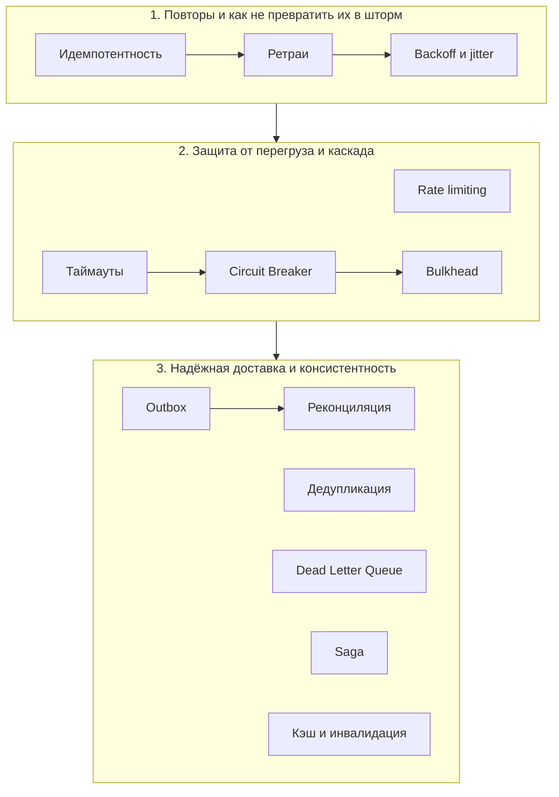

# Надёжность и архитектура

Алгоритмы спрашивают на собесах. А в проде всё ломается по другим причинам: сеть моргнула, сообщение пришло дважды, клиент дважды нажал «Оплатить», сосед по кластеру лёг и потянул за собой остальных.

Этот раздел про приёмы, которые с этим справляются. Ни один из них не сложный сам по себе. Сложно другое: вовремя понять, какой из них сейчас нужен

## Зачем это

Джун пишет happy path: запрос прошёл, ответ вернулся, всё хорошо. Дальше начинается работа, которую видно только в проде:

> а если этот вызов повиснет?
> а если запрос придёт дважды?
> а если после записи в базу, но до отправки события, процесс упадёт?

Здесь ты научишься задавать эти вопросы заранее и отвечать на них готовыми паттернами, а не героическими фиксами в три часа ночи

## Карта приёмов

Тринадцать приёмов разбиты на три группы. Стрелка означает «обычно идёт следом»: ретраи не имеют смысла без идемпотентности, ретраи без backoff превращаются в шторм, и так далее

| Приём | Какую проблему решает | Когда применять |
|-------|-----------------------|-----------------|
| [Идемпотентность](01-idempotency.md) | Повтор запроса (ретрай, двойной клик, таймаут) выполняет операцию дважды, деньги списались дважды | Любая операция с побочным эффектом, которую клиент или сеть могут повторить: платежи, создание заказов, списания |
| [Ретраи](02-retries.md) | Вызов внешнего сервиса изредка падает временной ошибкой (503, network reset), хотя со второй попытки прошёл бы | Вызовы, где ошибка транзиентна и повтор реально помогает; только над идемпотентной операцией |
| [Backoff и jitter](03-backoff-jitter.md) | Тысячи клиентов ретраят одновременно и добивают уже лежащий сервис | Всегда, когда есть ретраи: экспоненциальная пауза плюс случайный разброс |
| [Rate limiting](04-rate-limiting.md) | Один клиент выжирает всю пропускную способность API, остальным не хватает | Публичные и общие API, дорогие эндпоинты, защита downstream от перегруза |
| [Таймауты](05-timeouts.md) | Внешний вызов висит бесконечно, поток занят навсегда, пул потоков исчерпывается | Каждый сетевой вызов, запрос к базе, обращение к очереди, без исключений |
| [Circuit Breaker](06-circuit-breaker.md) | Downstream лёг, каждый запрос ждёт таймаут, потоки копятся, отказ каскадно роняет наш сервис | Вызовы к нестабильному внешнему сервису, который может лечь надолго |
| [Bulkhead](07-bulkhead.md) | Один медленный внешний вызов выжирает общий пул потоков и топит все остальные операции | Когда разные операции делят один пул ресурсов и должны быть изолированы друг от друга |
| [Dead Letter Queue](08-dead-letter-queue.md) | «Ядовитое» сообщение всегда падает и бесконечно ретраится, блокируя всю очередь | Любой консьюмер очереди или топика, где сообщение может оказаться неисправимо битым |
| [Дедупликация](09-deduplication.md) | Брокер доставляет at-least-once, одно событие пришло дважды, обработали дважды | Обработка событий из Kafka и очередей с гарантией at-least-once |
| [Transactional Outbox](10-transactional-outbox.md) | Dual-write: записали в базу, публикация события в Kafka упала после коммита, состояния разошлись | Когда изменение в базе должно надёжно породить событие во внешней системе |
| [Реконциляция](11-reconciliation.md) | Со временем состояния двух систем (наша база и склад) расходятся из-за потерянных событий | Фоновая сверка для любой интеграции, где события могут теряться |
| [Saga](12-saga.md) | Бизнес-операция затрагивает несколько сервисов, общего ACID нет, часть шагов прошла, часть упала | Распределённые транзакции: заказ плюс оплата плюс резерв склада без общей базы |
| [Кэширование и инвалидация](13-caching.md) | Дорогой запрос повторяется тысячи раз, данные устаревают, при истечении кэша все бьют в базу | Частые дорогие чтения относительно редко меняющихся данных |

## Как приёмы связаны

Это не список из тринадцати не связанных штук, а связка. Сила в сочетаниях:

- **Ретраи требуют идемпотентности.** Повторять можно только то, что безопасно выполнить дважды. Ретрай над неидемпотентной операцией даёт двойное списание. Сначала (01), потом (02)
- **Ретраи без backoff и jitter дают retry storm.** Голые ретраи под нагрузкой превращают моргание сервиса в его смерть: все клиенты синхронно долбят в одну секунду. (02) всегда идёт с (03)
- **Timeout, Circuit Breaker и Bulkhead, троица защиты от каскада.** Таймаут (05) не даёт запросу висеть вечно, предохранитель (06) перестаёт долбить лежащий downstream, переборки (07) не дают одной больной интеграции утопить остальные
- **Rate limiting** (04) из той же семьи, только защита со стороны входа, а не выхода
- **Outbox, дедупликация и реконциляция дают «ровно один раз» на практике.** Честного exactly-once в распределённой системе нет. Его собирают из трёх кусков: outbox (10) гарантирует, что событие уедет, дедуп (09) гасит дубли на приёме, реконциляция (11) фоном ловит и чинит то, что всё-таки разошлось. DLQ (08) ловит то, что не обрабатывается в принципе
- **Saga** (12) это оркестрация всего перечисленного для распределённой транзакции: каждый шаг идемпотентен, ретраится, а откат делается компенсациями
- **Кэширование** (13) стоит особняком, но и его провалы из той же оперы: cache stampede лечится теми же идеями, что и thundering herd

## Как проходить раздел

Каждый урок построен вокруг конкретной проблемы из прода, а не вокруг определения паттерна. Поэтому:

- [ ] Прочитай проблему в начале урока и остановись
- [ ] Попробуй решить сам. Как не дать запросу повиснуть вечно? Что сделать, чтобы повтор платежа не списал деньги дважды? Набросай решение в голове или на бумаге, честно, до того как читать дальше
- [ ] Посмотри разбор. Скорее всего интуиция уже нащупала половину паттерна, теперь ты увидишь, как его доводят до продакшена и где он ломается
- [ ] Реши практическую задачу в конце урока, с прогоном под тесты из критериев приёмки

Так приёмы осядут не как заученные термины, а как рефлекс: увидел сетевой вызов, сразу подумал про таймаут; увидел ретрай, сразу про идемпотентность и backoff

> 💡 Код из примеров удобно гонять в песочнице, не поднимая проект: [JDoodle (Java)](https://www.jdoodle.com/online-java-compiler/) для логики, [db-fiddle (PostgreSQL)](https://www.db-fiddle.com/) для SQL со схемами и `ON CONFLICT`

## Прогресс

Отмечай пройденное, чтобы видеть, где ты:

- [ ] 01. [Идемпотентность](01-idempotency.md)
- [ ] 02. [Ретраи](02-retries.md)
- [ ] 03. [Backoff и jitter](03-backoff-jitter.md)
- [ ] 04. [Rate limiting](04-rate-limiting.md)
- [ ] 05. [Таймауты](05-timeouts.md)
- [ ] 06. [Circuit Breaker](06-circuit-breaker.md)
- [ ] 07. [Bulkhead](07-bulkhead.md)
- [ ] 08. [Dead Letter Queue](08-dead-letter-queue.md)
- [ ] 09. [Дедупликация](09-deduplication.md)
- [ ] 10. [Transactional Outbox](10-transactional-outbox.md)
- [ ] 11. [Реконциляция](11-reconciliation.md)
- [ ] 12. [Saga](12-saga.md)
- [ ] 13. [Кэширование и инвалидация](13-caching.md)

[← Назад к оглавлению roadmap](../../../../../README.md)
