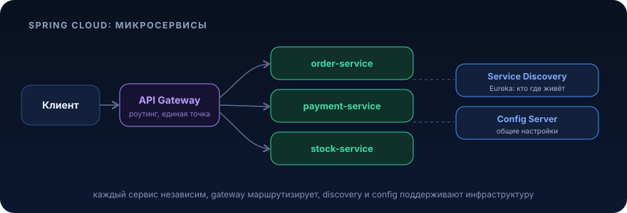

# Spring Cloud (микросервисы)


<p align="center">
  
</p>

> Стек урока: **Java 21, Spring Boot 3.x (Jakarta EE), PostgreSQL**. Всё, что ниже, про Spring Boot 3 и Spring Cloud 2023.x+ (BOM-версии, которые совместимы с Boot 3). Никаких `javax.*`, `WebSecurityConfigurerAdapter` и XML-контекстов.

Это **обзорный** урок. Цель, не научить вас поднимать 12 сервисов, а научить понимать, *из чего* состоит распределённая система на Spring, *какую цену* вы за это платите и, главное, **когда всё это НЕ нужно**. Микросервисы, не апгрейд монолита, а размен: вы меняете простоту внутрипроцессного вызова на операционную сложность сети. Разберёмся, за что именно.

---

## Зачем это нужно / какую проблему решает

Представьте: вы, команда из 40 разработчиков на одном большом монолите `shop-backend`. Всё началось хорошо, но сейчас:

- **Деплой это событие.** Чтобы выкатить правку в модуль «отзывы», вы пересобираете и передеплоиваете весь монолит вместе с оплатой, каталогом и складом. Одна команда блокирует пять других. Релиз-поезд ходит раз в неделю, и все на него опаздывают.
- **Масштабируется всё сразу.** В «чёрную пятницу» нагрузка растёт на *поиск* и *корзину*, но масштабировать вы вынуждены весь монолит целиком, 8 ГБ heap в каждой реплике, включая никому не нужный в пике модуль «бухгалтерская выгрузка».
- **Падение в одном месте кладёт всё.** Утечка памяти в редко используемом отчёте роняет процесс, и вместе с ним оплату.
- **Технологический замок.** Хотите переписать поиск на другой стек или обновить мажор библиотеки, нельзя, всё в одном classpath.

Микросервисный подход отвечает: **разрежьте систему по бизнес-границам** (`payment-service`, `catalog-service`, `order-service`), дайте каждой команде свой деплой, своё масштабирование, свою БД. Теперь «отзывы» катятся 20 раз в день и никого не трогают, а поиск масштабируется отдельно.

Но как только вы разрезали монолит на процессы, общающиеся по сети, вылезает **новый класс проблем**, которых в монолите не было в принципе:

| Проблема | В монолите | В микросервисах |
|---|---|---|
| Найти другой модуль | `@Autowired`, и он тут | Где сейчас живёт `payment-service`? На каком хосте, каком порту, сколько реплик? → **Service Discovery** |
| Конфигурация | один `application.yml` | 15 сервисов × 4 окружения = хаос → **Config Server** |
| Внешний вход | один порт | 15 портов, где auth, CORS, rate limit? → **API Gateway** |
| Вызов другого модуля | вызов метода, всегда успешен | сетевой вызов, который **упадёт**, зависнет, вернёт 500 → **OpenFeign + Resilience4j** |
| «Почему запрос тормозит?» | один стектрейс | запрос прошёл через 6 сервисов, где потерялись 800 мс? → **распределённая трассировка** |

**Spring Cloud** это набор стартеров, которые дают готовые решения для каждой из этих проблем, интегрированные в привычную модель Spring Boot. Именно их мы и разбираем.

> **Главная мысль урока, которую держите в голове до самого конца:** каждый пункт правой колонки это код, инфраструктура и режимы отказа, которых у вас *не было*. Микросервисы решают организационные и масштабные проблемы ценой инженерной сложности. Если у вас нет этих проблем, вы платите цену впустую. К вопросу «когда НЕ нужно» вернёмся в конце.

---

## Ключевые понятия

### Config Server, централизованная конфигурация

Проблема: 15 сервисов, у каждого свои `application.yml`, и в каждом, адрес БД, таймауты, фичефлаги, которые различаются между `dev`/`stage`/`prod`. Хранить это в 15 репозиториях и синхронизировать вручную, боль. Менять таймаут в проде, пересобирать образ.

**Spring Cloud Config Server**, отдельный сервис, который отдаёт конфигурацию по HTTP. Конфиги лежат в одном месте (обычно Git-репозиторий), а клиенты при старте (или по сигналу `refresh`) забирают свою часть.

- Клиент запрашивает `{имя-приложения}/{профиль}` → сервер отдаёт слитый набор `application.yml` (общий) + `order-service-prod.yml` (специфичный).
- Секреты шифруются (`{cipher}...`), а лучше, вообще не в Config Server, а в Vault (Spring Cloud Config поддерживает Vault-backend).
- Git как бэкенд = вся история изменений конфига под ревью и откатом.

> В облачных стеках (Kubernetes) эту роль часто берут `ConfigMap`/`Secret` + внешний секрет-менеджер, а Config Server не поднимают. Это нормально, Spring Cloud не обязателен, если платформа уже решает задачу.

### Service Discovery, «где живёт сервис?»

В монолите зависимость это бин. В сети это IP:порт, который **меняется**: реплики поднимаются и гаснут (автоскейл, рестарты, падения). Хардкодить адреса нельзя.

**Service Discovery** это реестр: сервисы при старте *регистрируются* («я `payment-service`, я на `10.0.3.7:8081`, я жив»), а клиенты *спрашивают* реестр по логическому имени. Классика в мире Spring, **Netflix Eureka** (`spring-cloud-starter-netflix-eureka-server` / `-client`). Клиент шлёт heartbeat; перестал слать, его выкидывают из реестра.

Поверх этого работает **клиентская балансировка** (`spring-cloud-loadbalancer`): клиент получает *список* инстансов `payment-service` и сам выбирает, к кому пойти (round-robin и т.п.), без отдельного L7-балансировщика на каждый вызов.

> В Kubernetes discovery обычно уже встроен: `Service` даёт стабильное DNS-имя и балансировку из коробки. Тогда Eureka не нужна, вы зовёте `http://payment-service/...`, а k8s разрулит. Это ещё один пример, где Spring Cloud-компонент вытесняется платформой.

### API Gateway, единая точка входа

15 сервисов = 15 адресов. Наружу так выставлять нельзя: где централизованно проверять JWT, резать CORS, ставить rate limit, маршрутизировать `/api/orders/**` → `order-service`?

**Spring Cloud Gateway**, реактивный (на Spring WebFlux) шлюз. Он:
- **маршрутизирует** по предикатам (path, header, method) на нужный сервис (можно через discovery: `lb://order-service`);
- прогоняет запрос через **фильтры**, аутентификация, добавление/удаление заголовков, retry, circuit breaker, rate limiting;
- даёт клиенту *один* стабильный адрес, скрывая внутреннюю топологию.

Rate limiting, идемпотентность на входе, ретраи это уже территория раздела **«Надёжность и архитектура»** роадмапа; Gateway, удобное место, где эти паттерны применяются централизованно.

### OpenFeign, межсервисные HTTP-вызовы декларативно

Когда `order-service` должен спросить у `payment-service` статус оплаты, писать руками `RestClient`/`WebClient` с URL, сериализацией и обработкой ошибок, многословно. **Spring Cloud OpenFeign** позволяет описать вызов как **интерфейс с аннотациями**, а реализацию сгенерирует фреймворк:

```java
@FeignClient(name = "payment-service") // имя из discovery → балансировка автоматически
public interface PaymentClient {
    @GetMapping("/payments/{orderId}")
    PaymentDto getByOrder(@PathVariable Long orderId);
}
```

Вы инжектите `PaymentClient` как обычный бин и зовёте `getByOrder(...)`, под капотом HTTP-запрос, балансировка через discovery, сериализация. Feign легко оборачивается в Resilience4j (таймаут, circuit breaker, fallback).

> Feign, блокирующий. Для реактивного/стримингового взаимодействия берут `WebClient`. Для простых синхронных вызовов между сервисами Feign, прагматичный дефолт.

### Resilience4j, устойчивость к отказам

Сетевой вызов **всегда может упасть**: таймаут, 503, недоступная реплика. Если `order-service` синхронно ждёт зависший `payment-service`, его потоки копятся, и он падает следом, **каскадный отказ**.

**Resilience4j** даёт паттерны:
- **Circuit Breaker**, «предохранитель»: после серии ошибок перестаёт долбить упавший сервис (open), даёт ему очухаться, периодически пробует (half-open).
- **Retry**, повтор с backoff (только для **идемпотентных** операций!).
- **TimeLimiter**, **Bulkhead**, **RateLimiter**, таймауты, изоляция пулов, ограничение частоты.

Это большая тема со своими граблями (ретраи неидемпотентных операций, дублирование эффектов). Подробно, в разделе **«Надёжность и архитектура»** роадмапа (идемпотентность, ретраи, rate limiting). Здесь важно понять: **в распределённой системе устойчивость, не опция, а обязательная часть каждого межсервисного вызова.**

### Распределённая трассировка, «где потерялись 800 мс?»

Запрос от пользователя прошёл: Gateway → `order-service` → `payment-service` → `catalog-service`. Ответ пришёл за 1.2 с. Где узкое место? В монолите, один стектрейс; здесь, четыре разных лога на четырёх хостах, и связать их нечем.

**Micrometer Tracing** (в Spring Boot 3 пришёл на смену Spring Cloud Sleuth) присваивает каждому входящему запросу **traceId**, а каждому шагу, **spanId**, и *пробрасывает* их между сервисами через HTTP-заголовки (W3C `traceparent`). Экспортёр (**Zipkin**, **Tempo**, Jaeger через OTLP) собирает спаны в единую «водопадную» диаграмму: видно, что 800 мс съел вызов `catalog-service`.

`traceId` также попадает в MDC логов, по нему можно собрать логи *всех* сервисов по одному запросу. Без трассировки отлаживать распределённую систему практически невозможно.

---

## Примеры на Java

Соберём минимальный, но реалистичный срез: `order-service` принимает заказ, сохраняет в PostgreSQL и синхронно спрашивает у `payment-service` статус оплаты через Feign, обёрнутый в circuit breaker.

### 1. Зависимости (Maven)

BOM Spring Cloud фиксирует совместимые версии всех стартеров это единственный правильный способ подключать Spring Cloud.

```xml
<properties>
    <spring-cloud.version>2023.0.3</spring-cloud.version> <!-- совместимо с Spring Boot 3.2/3.3 -->
</properties>

<dependencyManagement>
    <dependencies>
        <dependency>
            <groupId>org.springframework.cloud</groupId>
            <artifactId>spring-cloud-dependencies</artifactId>
            <version>${spring-cloud.version}</version>
            <type>pom</type>
            <scope>import</scope>
        </dependency>
    </dependencies>
</dependencyManagement>

<dependencies>
    <!-- web + jpa + postgres -->
    <dependency>
        <groupId>org.springframework.boot</groupId>
        <artifactId>spring-boot-starter-web</artifactId>
    </dependency>
    <dependency>
        <groupId>org.springframework.boot</groupId>
        <artifactId>spring-boot-starter-data-jpa</artifactId>
    </dependency>
    <dependency>
        <groupId>org.postgresql</groupId>
        <artifactId>postgresql</artifactId>
        <scope>runtime</scope>
    </dependency>

    <!-- межсервисные вызовы -->
    <dependency>
        <groupId>org.springframework.cloud</groupId>
        <artifactId>spring-cloud-starter-openfeign</artifactId>
    </dependency>
    <!-- устойчивость: circuit breaker на Resilience4j -->
    <dependency>
        <groupId>org.springframework.cloud</groupId>
        <artifactId>spring-cloud-starter-circuitbreaker-resilience4j</artifactId>
    </dependency>

    <!-- распределённая трассировка: Micrometer + экспорт в Zipkin -->
    <dependency>
        <groupId>org.springframework.boot</groupId>
        <artifactId>spring-boot-starter-actuator</artifactId>
    </dependency>
    <dependency>
        <groupId>io.micrometer</groupId>
        <artifactId>micrometer-tracing-bridge-brave</artifactId>
    </dependency>
    <dependency>
        <groupId>io.zipkin.reporter2</groupId>
        <artifactId>zipkin-reporter-brave</artifactId>
    </dependency>
</dependencies>
```

### 2. Сущность и репозиторий (Jakarta, PostgreSQL)

```java
package com.example.order.domain;

import jakarta.persistence.Column;
import jakarta.persistence.Entity;
import jakarta.persistence.EnumType;
import jakarta.persistence.Enumerated;
import jakarta.persistence.GeneratedValue;
import jakarta.persistence.GenerationType;
import jakarta.persistence.Id;
import jakarta.persistence.Table;
import java.math.BigDecimal;
import java.time.Instant;

@Entity
@Table(name = "orders")
public class Order {

    @Id
    @GeneratedValue(strategy = GenerationType.IDENTITY)
    private Long id;

    @Column(nullable = false)
    private Long customerId;

    @Column(nullable = false)
    private BigDecimal amount;

    @Enumerated(EnumType.STRING) // строкой, а не ordinal, не поедет при добавлении статуса
    @Column(nullable = false)
    private OrderStatus status;

    @Column(nullable = false, updatable = false)
    private Instant createdAt;

    protected Order() { // для JPA
    }

    public Order(Long customerId, BigDecimal amount) {
        this.customerId = customerId;
        this.amount = amount;
        this.status = OrderStatus.NEW;
        this.createdAt = Instant.now();
    }

    // изменение состояния, через осмысленный метод, не через setStatus(...)
    public void markPaid() {
        if (this.status != OrderStatus.NEW) {
            throw new IllegalStateException("Оплатить можно только новый заказ, текущий статус: " + status);
        }
        this.status = OrderStatus.PAID;
    }

    public Long getId() {
        return id;
    }

    public OrderStatus getStatus() {
        return status;
    }

    public BigDecimal getAmount() {
        return amount;
    }
}
```

```java
package com.example.order.domain;

public enum OrderStatus {
    NEW, PAID, CANCELLED
}
```

```java
package com.example.order.domain;

import org.springframework.data.jpa.repository.JpaRepository;

public interface OrderRepository extends JpaRepository<Order, Long> {
}
```

### 3. Feign-клиент к payment-service с fallback

```java
package com.example.order.client;

import org.springframework.cloud.openfeign.FeignClient;
import org.springframework.web.bind.annotation.GetMapping;
import org.springframework.web.bind.annotation.PathVariable;

// name = логическое имя сервиса (через discovery → клиентская балансировка).
// fallback, что вернуть, если payment-service недоступен (сработал circuit breaker).
@FeignClient(name = "payment-service", fallback = PaymentClientFallback.class)
public interface PaymentClient {

    @GetMapping("/payments/{orderId}")
    PaymentDto getByOrder(@PathVariable Long orderId);
}
```

```java
package com.example.order.client;

// record, иммутабельный DTO контракта между сервисами
public record PaymentDto(Long orderId, String state) {
}
```

```java
package com.example.order.client;

import org.springframework.stereotype.Component;

// Деградация вместо падения: не знаем статус оплаты, считаем "неизвестно",
// а не роняем весь запрос создания заказа.
@Component
public class PaymentClientFallback implements PaymentClient {

    @Override
    public PaymentDto getByOrder(Long orderId) {
        return new PaymentDto(orderId, "UNKNOWN");
    }
}
```

Чтобы fallback заработал, включаем интеграцию Feign с circuit breaker (в `application.yml`):

```yaml
feign:
  circuitbreaker:
    enabled: true
```

### 4. Сервис, конструкторная инъекция, транзакция на public-методе бина

```java
package com.example.order.service;

import com.example.order.client.PaymentClient;
import com.example.order.client.PaymentDto;
import com.example.order.domain.Order;
import com.example.order.domain.OrderRepository;
import java.math.BigDecimal;
import org.springframework.stereotype.Service;
import org.springframework.transaction.annotation.Transactional;

@Service
public class OrderService {

    private final OrderRepository orderRepository;
    private final PaymentClient paymentClient;

    // конструкторная инъекция: зависимости final, легко тестировать, нет скрытого NPE
    public OrderService(OrderRepository orderRepository, PaymentClient paymentClient) {
        this.orderRepository = orderRepository;
        this.paymentClient = paymentClient;
    }

    @Transactional
    public Order createOrder(Long customerId, BigDecimal amount) {
        var order = orderRepository.save(new Order(customerId, amount));

        // синхронный межсервисный вызов; при недоступности сработает fallback → "UNKNOWN"
        PaymentDto payment = paymentClient.getByOrder(order.getId());
        if ("PAID".equals(payment.state())) {
            order.markPaid();
        }
        return order;
    }
}
```

> Важно: сетевой вызов внутри `@Transactional` держит открытой транзакцию БД на время ожидания сети. В нагруженном коде это антипаттерн (соединение к БД занято, пока ждём чужой сервис). В проде оплату обычно делают **асинхронно** (событие в Kafka + outbox), а не синхронно под транзакцией. Здесь показано синхронно ради наглядности, держите этот нюанс в голове.

### 5. Контроллер, тонкий, только делегирует

```java
package com.example.order.web;

import com.example.order.domain.Order;
import com.example.order.service.OrderService;
import jakarta.validation.Valid;
import jakarta.validation.constraints.NotNull;
import jakarta.validation.constraints.Positive;
import java.math.BigDecimal;
import org.springframework.http.HttpStatus;
import org.springframework.http.ResponseEntity;
import org.springframework.web.bind.annotation.PostMapping;
import org.springframework.web.bind.annotation.RequestBody;
import org.springframework.web.bind.annotation.RequestMapping;
import org.springframework.web.bind.annotation.RestController;

@RestController
@RequestMapping("/api/orders")
public class OrderController {

    private final OrderService orderService;

    public OrderController(OrderService orderService) {
        this.orderService = orderService;
    }

    @PostMapping
    public ResponseEntity<OrderResponse> create(@Valid @RequestBody CreateOrderRequest request) {
        Order order = orderService.createOrder(request.customerId(), request.amount());
        var body = new OrderResponse(order.getId(), order.getStatus().name());
        return ResponseEntity.status(HttpStatus.CREATED).body(body);
    }

    public record CreateOrderRequest(
            @NotNull Long customerId,
            @NotNull @Positive BigDecimal amount) {
    }

    public record OrderResponse(Long id, String status) {
    }
}
```

### 6. Конфигурация приложения (`application.yml`)

```yaml
spring:
  application:
    name: order-service          # это имя увидят discovery и трассировка
  datasource:
    url: jdbc:postgresql://localhost:5432/orders
    username: ${DB_USER}         # секреты, из окружения/секрет-менеджера, НЕ в yml
    password: ${DB_PASSWORD}
  jpa:
    hibernate:
      ddl-auto: validate          # схему катает Liquibase/Flyway, не Hibernate
    properties:
      hibernate:
        jdbc:
          time_zone: UTC

management:
  tracing:
    sampling:
      probability: 1.0            # 100% трейсов в dev; в проде обычно 0.1
  zipkin:
    tracing:
      endpoint: http://localhost:9411/api/v2/spans

# circuit breaker по умолчанию: 50% ошибок из окна → open на 5с
resilience4j:
  circuitbreaker:
    instances:
      payment-service:
        sliding-window-size: 10
        failure-rate-threshold: 50
        wait-duration-in-open-state: 5s
```

Точка входа с включённым Feign:

```java
package com.example.order;

import org.springframework.boot.SpringApplication;
import org.springframework.boot.autoconfigure.SpringBootApplication;
import org.springframework.cloud.openfeign.EnableFeignClients;

@SpringBootApplication
@EnableFeignClients // включает сканирование @FeignClient-интерфейсов
public class OrderServiceApplication {

    public static void main(String[] args) {
        SpringApplication.run(OrderServiceApplication.class, args);
    }
}
```

### 7. Миграция схемы (SQL, PostgreSQL)

```sql
CREATE TABLE orders (
    id          BIGINT GENERATED BY DEFAULT AS IDENTITY PRIMARY KEY,
    customer_id BIGINT         NOT NULL,
    amount      NUMERIC(19, 2) NOT NULL CHECK (amount > 0),
    status      VARCHAR(32)    NOT NULL,
    created_at  TIMESTAMPTZ    NOT NULL DEFAULT now()
);

CREATE INDEX orders_customer_id_idx ON orders (customer_id);
```

---

## Частые ошибки / подводные камни

1. **Полевая инъекция вместо конструкторной.** `@Autowired private PaymentClient client;` прячет зависимости, ломает `final`, мешает тестировать и позволяет создать объект в невалидном состоянии. Всегда, конструктор (см. `OrderService` выше). Для одного конструктора даже `@Autowired` не нужен.

2. **`@Transactional` на private/self-invocation методе.** Spring оборачивает бин прокси; вызов `this.doWork()` внутри того же класса или `private`-метод **проходит мимо прокси**, транзакция не откроется, и вы этого не заметите, пока не словите частичный коммит. Транзакционный метод должен быть `public` и вызываться *через бин* (другой бин или инжектированный self). Плюс: не держите сетевые вызовы внутри транзакции (см. заметку к `OrderService`).

3. **Ретрай неидемпотентной операции.** Соблазн: обернуть *любой* Feign-вызов в `@Retry`. Но если вы ретраите `POST /payments` (списание денег), а первый запрос *дошёл*, но ответ потерялся, вы спишете дважды. Ретраить можно только идемпотентные операции (GET, или POST с ключом идемпотентности). Подробно, раздел **«Надёжность и архитектура»**.

4. **Микросервисы с общей БД.** Разрезали код на сервисы, но все ходят в одну схему PostgreSQL, получили «распределённый монолит»: сервисы связаны через таблицы, нельзя менять схему независимо, транзакционные границы размыты. Правило: **у каждого сервиса, своя БД**, общение, только через API/события, никогда через чужие таблицы.

5. **Секреты в конфиге / в Git.** Пароль БД, ключи API прямо в `application.yml`, закоммиченном в репозиторий, утечка ждёт своего часа. Секреты, только через переменные окружения, Vault или k8s `Secret`. В `application.yml`, плейсхолдеры `${DB_PASSWORD}`.

6. **Синхронная цепочка вызовов без circuit breaker.** `A → B → C → D` синхронно, и D затормозил. Без предохранителя потоки A/B/C копятся в ожидании, пулы исчерпываются, **каскадное падение** всей цепочки из-за одного медленного сервиса. Каждый исходящий вызов должен иметь таймаут + circuit breaker + осмысленный fallback.

7. **Stateful там, где нужен stateless.** Храните сессию/кэш в памяти инстанса, и при масштабировании до 3 реплик пользователь, попавший на другую реплику, «теряет» состояние. Сервисы за балансировщиком должны быть **stateless**; состояние, во внешнем хранилище (Redis, БД).

---

## Практическая задача

**Контекст.** Вы развиваете `order-service` (код выше). Появился сервис `catalog-service`, который отдаёт актуальную цену и остаток товара. Теперь при создании заказа `order-service` должен сходить в `catalog-service`, проверить, что товар в наличии, и взять цену *оттуда* (не доверять цене от клиента).

**Дано:**
- `order-service`, как в примерах (PostgreSQL, Feign, Resilience4j, трассировка уже подключены).
- `catalog-service` предоставляет эндпоинт `GET /items/{sku}` → `{ "sku": "...", "price": 1990.00, "available": 42 }`.
- `catalog-service` живёт нестабильно: иногда отвечает за 3+ секунды или отдаёт 503.

**ТЗ.** Доработать создание заказа так, чтобы:
1. Запрос на создание заказа принимал `sku` и `quantity` (а не `amount`, сумму считаем сами).
2. `order-service` дёргал `catalog-service` через **новый Feign-клиент** `CatalogClient`.
3. Итоговая сумма считалась как `price × quantity` по цене из каталога.
4. Если `quantity > available`, заказ **не** создаётся, клиент получает `409 Conflict` с внятным сообщением.
5. Вызов каталога был защищён: **таймаут** (не ждать дольше 2 с) и **circuit breaker**; при недоступности каталога заказ **не создаётся молча с мусорной ценой**, а возвращается `503 Service Unavailable`, то есть fallback здесь НЕ должен «придумывать» цену.
6. `traceId` вызова к каталогу был виден в трейсе (проверить, что span появляется в Zipkin).

**Критерии приёмки:**
- [ ] `POST /api/orders` с `{ "customerId": 1, "sku": "ABC", "quantity": 3 }` создаёт заказ с суммой `price×3` и статусом `NEW`.
- [ ] При `quantity` больше остатка, `409`, заказ в БД не появился (проверить, что транзакция откатилась / запись не создана).
- [ ] При остановленном `catalog-service`, ответ `503` за ≤2 с (а не зависание на 30 с дефолтного таймаута), заказ не создан.
- [ ] После нескольких ошибок подряд circuit breaker в состоянии `open` (видно в `/actuator/health` или метриках), и запросы отсекаются *сразу*, не дожидаясь таймаута.
- [ ] В Zipkin у запроса создания заказа виден дочерний span вызова `catalog-service`.

**Подсказки (без готового решения):**
- Отличайте *бизнес-отказ* (нет остатка → `409`, это валидный ответ, **не** повод открывать circuit breaker) от *технического* (таймаут/503 → `503`). Настройте `recordExceptions`/`ignoreExceptions` в Resilience4j так, чтобы `409` не считался «ошибкой сервиса».
- Для правила «не придумывать цену» fallback должен **бросать** исключение, которое ваш `@ControllerAdvice` замапит в `503`, а не возвращать фейковый `CatalogDto`.
- Таймаут Feign настраивается через `spring.cloud.openfeign.client.config.catalog-service.read-timeout` (либо через `TimeLimiter` Resilience4j).
- Валидацию остатка и подсчёт суммы делайте **в сервисе**, не в контроллере (контроллер тонкий).
- Не забудьте, что при `409` не должно остаться записи в БД, где у вас граница транзакции и когда происходит проверка остатка относительно `save()`?

---

## Что почитать

- **Spring Cloud OpenFeign, референс:** https://docs.spring.io/spring-cloud-openfeign/reference/
- **Spring Cloud Gateway, референс:** https://docs.spring.io/spring-cloud-gateway/reference/
- **Distributed Tracing в Spring Boot 3 (Micrometer Tracing), официальная дока:** https://docs.spring.io/spring-boot/reference/actuator/tracing.html
- **Resilience4j, официальная документация (Circuit Breaker, Retry, TimeLimiter):** https://resilience4j.readme.io/docs/getting-started
- **Guide: Spring Cloud Circuit Breaker (spring.io/guides):** https://spring.io/guides/gs/cloud-circuit-breaker
- **Baeldung, Introduction to Spring Cloud OpenFeign:** https://www.baeldung.com/spring-cloud-openfeign

---

[← Spring Security](spring-security.md) · [Оглавление](../../../../../README.md) · [REST API →](../rest/rest.md)
