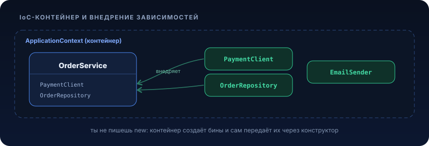

# Spring (Core, IoC/DI)


<p align="center">
  
</p>

## Зачем это нужно / какую проблему решает

Представь сервис оформления заказов. `OrderService` считает цену, сохраняет заказ в БД и шлёт письмо клиенту. Пишешь честно, руками:

```java
public class OrderService {
    private final OrderRepository repository;
    private final PricingService pricing;
    private final EmailNotifier notifier;

    public OrderService() {
        // сами создаём весь граф зависимостей
        DataSource ds = new HikariDataSource(buildConfig());
        this.repository = new JdbcOrderRepository(ds);
        this.pricing = new PricingService(new TaxRateClient("https://tax.api"));
        this.notifier = new EmailNotifier(new SmtpClient("smtp.internal", 587));
    }
}
```

Что здесь плохо, и с каждым месяцем всё хуже:

- **Жёсткая связанность.** `OrderService` намертво знает про `JdbcOrderRepository`, `Hikari`, SMTP-хост и порт. Захотел заменить БД на кафку, SMTP на мок, правишь конструктор бизнес-класса.
- **Граф объектов собирается вручную.** `DataSource` нужен и репозиторию заказов, и репозиторию клиентов, и репозиторию платежей. Каждый создаёт свой пул соединений, вместо одного общего у тебя их десять. Кто-то забыл закрыть, утечка.
- **Тестировать невозможно.** Чтобы протестировать расчёт цены, поднимается реальный SMTP и реальная БД, потому что они зашиты в конструктор. Подменить нечем.
- **Конфигурация размазана.** Хост, порт, URL прибиты гвоздями в коде вместо внешнего файла. Секреты, там же (привет, git-история).

Корень боли: **класс сам отвечает и за свою бизнес-логику, и за создание своих зависимостей.** Это две разные ответственности, и вторая расползается по всему коду.

**Inversion of Control (IoC)** переворачивает это: не объект создаёт свои зависимости, а внешний контейнер создаёт объекты и *отдаёт* им готовые зависимости. **Dependency Injection (DI)**, конкретный механизм: зависимости «вкалываются» снаружи через конструктор.

С Spring тот же сервис выглядит так:

```java
@Service
public class OrderService {
    private final OrderRepository repository;
    private final PricingService pricing;
    private final EmailNotifier notifier;

    // Spring сам найдёт и передаст готовые бины
    public OrderService(OrderRepository repository, PricingService pricing, EmailNotifier notifier) {
        this.repository = repository;
        this.pricing = pricing;
        this.notifier = notifier;
    }
}
```

Класс больше не знает, *откуда* берутся зависимости и *как* они устроены. Он объявляет: «мне нужны эти три штуки». Сборкой графа, единственным пулом соединений, порядком инициализации и подстановкой моков в тестах занимается контейнер. Связанность падает, тестируемость взлетает, конфигурация уезжает во внешние файлы и профили.

Это не магия это фабрика объектов на стероидах, про которую мы дальше разберём, что именно она делает.

## Ключевые понятия

### IoC-контейнер и бины

**Бин (bean)** это объект, жизненным циклом которого управляет Spring: он его создаёт, конфигурирует, связывает с другими бинами и уничтожает. Твой `OrderService`, `OrderRepository`, `DataSource`, всё это бины.

**IoC-контейнер**, фабрика, которая держит реестр всех бинов, знает их зависимости и умеет собрать корректный граф. По умолчанию каждый бин, **синглтон**: один экземпляр на весь контейнер, переиспользуется везде, где он нужен. Именно поэтому пул соединений становится один на всё приложение, а не десять.

Контейнер работает в две фазы:
1. **Регистрация определений бинов** (bean definitions), сканирование классов и конфигураций, построение «чертежей»: какой класс, какой scope, какие зависимости.
2. **Создание и связывание**, контейнер инстанцирует бины в правильном порядке (сначала зависимости, потом зависящих) и внедряет их друг в друга.

### ApplicationContext

`ApplicationContext` это и есть тот самый контейнер в его боевой ипостаси. Помимо реестра бинов он даёт: публикацию событий, интернационализацию, доступ к ресурсам и, главное, интеграцию с автоконфигурацией Spring Boot.

В Spring Boot ты почти никогда не создаёшь контекст руками это делает `@SpringBootApplication`:

```java
@SpringBootApplication
public class OrderApplication {
    public static void main(String[] args) {
        SpringApplication.run(OrderApplication.class, args);
        // внутри: создан ApplicationContext, просканированы бины,
        // собран граф, поднят встроенный Tomcat
    }
}
```

`@SpringBootApplication` это composed-аннотация: `@Configuration` + `@ComponentScan` (сканирует пакет класса и вложенные) + `@EnableAutoConfiguration`.

### Как объявляются бины

Два основных способа.

**1. Стереотипные аннотации + компонент-сканирование.** Вешаешь аннотацию на класс, а `@ComponentScan` его подхватывает:

- `@Component`, базовый стереотип, «это бин».
- `@Service`, бин с бизнес-логикой (семантически = `@Component`, но читается яснее).
- `@Repository`, бин доступа к данным; вдобавок Spring транслирует специфичные для БД исключения в общий `DataAccessException`.
- `@Controller` / `@RestController`, веб-слой.

Технически для контейнера все они, `@Component`. Разница в намерении (и в паре побочных бонусов у `@Repository`/`@Controller`).

**2. `@Configuration` + `@Bean`.** Нужно, когда объект не твой (класс из библиотеки, аннотацию не повесить) или создание нетривиально:

```java
@Configuration
public class HttpClientConfig {

    @Bean
    public RestClient taxApiClient(@Value("${tax.api.base-url}") String baseUrl) {
        return RestClient.builder().baseUrl(baseUrl).build();
    }
}
```

Метод, помеченный `@Bean`, возвращает объект, его возвращаемое значение и становится бином. Имя бина по умолчанию = имя метода.

### Инъекция зависимостей: конструкторная, по умолчанию

Три вида инъекции, но использовать надо один.

**Конструкторная (предпочтительная).** Зависимости приходят параметрами конструктора:

```java
@Service
public class OrderService {
    private final OrderRepository repository; // final, гарантия неизменности

    public OrderService(OrderRepository repository) {
        this.repository = repository;
    }
}
```

Почему она правильная:
- Поля можно сделать `final` → **иммутабельность**, объект нельзя оставить полусобранным.
- Зависимости **обязательны и видны** в сигнатуре: класс с 8 параметрами конструктора честно кричит, что он God-object и его пора дробить.
- Объект **тестируется без Spring**, в тесте просто `new OrderService(mockRepo)`.
- Если начиная со Spring 4.3 у класса **один конструктор**, `@Autowired` над ним не нужен, контейнер и так поймёт. С Lombok, `@RequiredArgsConstructor` генерирует конструктор по `final`-полям.

**Полевая (`@Autowired` на поле), не использовать.** Поле нельзя сделать `final`, зависимости скрыты, без Spring класс не инстанцируется, легко получить `null`:

```java
@Service
public class BadService {
    @Autowired private OrderRepository repository; // так не надо
}
```

**Сеттерная**, узкая ниша: действительно опциональные зависимости или разрыв редких циклических связей. В обычном коде, почти никогда.

Если под тип подходит несколько бинов, разрулить неоднозначность помогают `@Qualifier("beanName")` и `@Primary` (пометить один как «по умолчанию»).

### Scope бинов

**Scope** определяет, сколько экземпляров бина живёт и как долго:

- `singleton` (по умолчанию), один на контейнер. **Обязан быть stateless**: его дёргают конкурентно из многих потоков.
- `prototype`, новый экземпляр на каждый запрос из контейнера.
- `request` / `session` (web), на HTTP-запрос / HTTP-сессию.

99% бинов, синглтоны. Это накладывает правило: **не храни в синглтоне изменяемое состояние запроса** (текущего юзера, счётчик, «последний заказ»). Общий мутабельный state в синглтоне под нагрузкой = гонки данных и плавающие баги.

### Жизненный цикл бина

Что происходит с бином от рождения до смерти:

1. Контейнер читает bean definition.
2. Инстанцирование (вызов конструктора → сюда приходит конструкторная инъекция).
3. Заполнение остальных зависимостей (сеттеры/поля, если есть).
4. Коллбэки инициализации: метод с `@PostConstruct` → тут прогревают кеши, проверяют конфиг. На этом этапе все зависимости уже на месте.
5. Бин готов и живёт в контексте.
6. При остановке приложения, `@PreDestroy`: закрыть пулы, слить буферы.

```java
@Component
public class WarmupCache {
    @PostConstruct
    void init() { /* зависимости уже внедрены, можно прогревать */ }

    @PreDestroy
    void shutdown() { /* освободить ресурсы */ }
}
```

Важно: **конструктор ≠ место для тяжёлой инициализации**. В конструкторе делай только присваивание зависимостей; всё, что требует уже собранного объекта, в `@PostConstruct`.

### Профили и внешняя конфигурация

**Профиль**, именованный набор бинов/настроек под окружение (`dev`, `test`, `prod`).

```java
@Configuration
@Profile("prod")
public class ProdNotifierConfig {
    @Bean
    EmailNotifier emailNotifier() { return new SmtpEmailNotifier(); }
}

@Configuration
@Profile("!prod") // всё, кроме prod
public class LocalNotifierConfig {
    @Bean
    EmailNotifier emailNotifier() { return new LoggingEmailNotifier(); }
}
```

Активный профиль: `SPRING_PROFILES_ACTIVE=prod` или `--spring.profiles.active=prod`. Настройки для профиля, в `application-prod.yml` поверх базового `application.yml`.

Значения тянутся снаружи через `@Value("${...}")` или типобезопасно через `@ConfigurationProperties`. **Секреты в файлах и git не хранятся**, они приходят из переменных окружения / секрет-хранилища.

### Чем это отличается от «магии»

Со стороны кажется, что бины возникают из воздуха. Внутри, детерминированный процесс без рефлексии-волшебства «на удачу»:

- **Компонент-сканирование**, Spring обходит classpath в указанных пакетах и ищет классы со стереотипными аннотациями. Это обычный обход, а не ясновидение.
- **Разрешение зависимостей**, по типу (и по имени при неоднозначности) контейнер сопоставляет, какой бин куда подставить. Не нашёл кандидата или нашёл двух, падает при старте с внятной ошибкой, а не молча в рантайме.
- **Прокси для `@Transactional`/`@Cacheable`/`@Async`**, Spring оборачивает бин прокси-объектом, который перехватывает вызовы публичных методов *извне* и добавляет поведение (открыть транзакцию, закешировать). Отсюда два важных следствия: аннотации работают только на публичных методах и только при вызове через бин (не через `this`).

Понимаешь эти три механизма, и «магия» превращается в предсказуемый инструмент, а ошибки старта читаются с первого раза.

## Примеры на Java

Сквозной пример: заказы. Сущность → репозиторий → сервис → контроллер → конфиг. Всё на Java 21 / Spring Boot 3, импорты `jakarta.*`.

**Сущность (JPA, Jakarta).**

```java
package com.example.order.model;

import jakarta.persistence.Column;
import jakarta.persistence.Entity;
import jakarta.persistence.EnumType;
import jakarta.persistence.Enumerated;
import jakarta.persistence.GeneratedValue;
import jakarta.persistence.GenerationType;
import jakarta.persistence.Id;
import jakarta.persistence.Table;
import java.math.BigDecimal;
import java.time.Instant;

@Entity
@Table(name = "orders")
public class Order {

    @Id
    @GeneratedValue(strategy = GenerationType.IDENTITY)
    private Long id;

    @Column(nullable = false)
    private Long customerId;

    @Column(nullable = false)
    private BigDecimal amount;

    @Enumerated(EnumType.STRING) // храним строкой, а не хрупким ordinal
    @Column(nullable = false)
    private OrderStatus status;

    @Column(nullable = false)
    private Instant createdAt;

    protected Order() { } // требование JPA

    public Order(Long customerId, BigDecimal amount) {
        this.customerId = customerId;
        this.amount = amount;
        this.status = OrderStatus.NEW;
        this.createdAt = Instant.now();
    }

    // меняем состояние осмысленным методом, а не публичным сеттером
    public void markPaid() {
        if (status != OrderStatus.NEW) {
            throw new IllegalStateException("Оплатить можно только новый заказ, текущий статус: " + status);
        }
        this.status = OrderStatus.PAID;
    }

    public Long getId() { return id; }
    public Long getCustomerId() { return customerId; }
    public BigDecimal getAmount() { return amount; }
    public OrderStatus getStatus() { return status; }
    public Instant getCreatedAt() { return createdAt; }
}
```

```java
package com.example.order.model;

public enum OrderStatus { NEW, PAID, CANCELLED }
```

**Репозиторий (Spring Data JPA).** Интерфейс, реализацию Spring генерирует сам, это тоже бин.

```java
package com.example.order.repository;

import com.example.order.model.Order;
import com.example.order.model.OrderStatus;
import java.util.List;
import org.springframework.data.jpa.repository.JpaRepository;

public interface OrderRepository extends JpaRepository<Order, Long> {
    List<Order> findByCustomerIdAndStatus(Long customerId, OrderStatus status);
}
```

**Сервис, конструкторная инъекция.**

```java
package com.example.order.service;

import com.example.order.model.Order;
import com.example.order.repository.OrderRepository;
import java.math.BigDecimal;
import org.springframework.stereotype.Service;
import org.springframework.transaction.annotation.Transactional;

@Service
public class OrderService {

    private final OrderRepository repository;
    private final EmailNotifier notifier;

    // единственный конструктор, @Autowired не нужен
    public OrderService(OrderRepository repository, EmailNotifier notifier) {
        this.repository = repository;
        this.notifier = notifier;
    }

    @Transactional // публичный метод, вызывается через прокси-бин, транзакция откроется
    public Order placeOrder(Long customerId, BigDecimal amount) {
        Order order = repository.save(new Order(customerId, amount));
        notifier.notifyCreated(order.getId());
        return order;
    }

    @Transactional(readOnly = true)
    public Order getById(Long id) {
        return repository.findById(id)
            .orElseThrow(() -> new OrderNotFoundException(id));
    }
}
```

**Абстракция уведомителя + две реализации под профили.**

```java
package com.example.order.service;

public interface EmailNotifier {
    void notifyCreated(Long orderId);
}
```

```java
package com.example.order.service;

import org.slf4j.Logger;
import org.slf4j.LoggerFactory;
import org.springframework.context.annotation.Profile;
import org.springframework.stereotype.Component;

@Component
@Profile("!prod") // локально и в тестах просто логируем
public class LoggingEmailNotifier implements EmailNotifier {
    private static final Logger log = LoggerFactory.getLogger(LoggingEmailNotifier.class);

    @Override
    public void notifyCreated(Long orderId) {
        log.info("[stub-email] Заказ {} создан", orderId);
    }
}
```

**Контроллер, тонкий, только делегирует.**

```java
package com.example.order.controller;

import com.example.order.model.Order;
import com.example.order.service.OrderService;
import jakarta.validation.Valid;
import jakarta.validation.constraints.NotNull;
import jakarta.validation.constraints.Positive;
import java.math.BigDecimal;
import org.springframework.http.HttpStatus;
import org.springframework.http.ResponseEntity;
import org.springframework.web.bind.annotation.GetMapping;
import org.springframework.web.bind.annotation.PathVariable;
import org.springframework.web.bind.annotation.PostMapping;
import org.springframework.web.bind.annotation.RequestBody;
import org.springframework.web.bind.annotation.RequestMapping;
import org.springframework.web.bind.annotation.RestController;

@RestController
@RequestMapping("/api/orders")
public class OrderController {

    private final OrderService orderService;

    public OrderController(OrderService orderService) {
        this.orderService = orderService;
    }

    // DTO запроса как record, иммутабельный, с bean-validation
    public record CreateOrderRequest(
        @NotNull Long customerId,
        @NotNull @Positive BigDecimal amount) { }

    @PostMapping
    public ResponseEntity<Order> create(@Valid @RequestBody CreateOrderRequest req) {
        Order order = orderService.placeOrder(req.customerId(), req.amount());
        return ResponseEntity.status(HttpStatus.CREATED).body(order);
    }

    @GetMapping("/{id}")
    public Order get(@PathVariable Long id) {
        return orderService.getById(id);
    }
}
```

**`@Configuration` + `@Bean`** для чужого класса (клиент внешнего API).

```java
package com.example.order.config;

import org.springframework.beans.factory.annotation.Value;
import org.springframework.context.annotation.Bean;
import org.springframework.context.annotation.Configuration;
import org.springframework.web.client.RestClient;

@Configuration
public class ExternalClientConfig {

    @Bean
    public RestClient taxApiClient(@Value("${tax.api.base-url}") String baseUrl) {
        return RestClient.builder().baseUrl(baseUrl).build();
    }
}
```

**Внешняя конфигурация, `application.yml` + профиль.**

```yaml
# application.yml, базовые настройки
spring:
  application:
    name: order-service
  datasource:
    url: jdbc:postgresql://localhost:5432/orders
    username: ${DB_USER}        # секреты из окружения, не в файле
    password: ${DB_PASSWORD}
  jpa:
    hibernate:
      ddl-auto: validate        # схему ведёт Liquibase/Flyway, не Hibernate
    open-in-view: false         # выключаем OSIV, про это в подводных камнях

tax:
  api:
    base-url: http://localhost:8081
```

```yaml
# application-prod.yml, накатывается поверх при профиле prod
spring:
  jpa:
    properties:
      hibernate.jdbc.batch_size: 50
tax:
  api:
    base-url: https://tax.internal.company.com
```

**Схема таблицы (миграция).**

```sql
CREATE TABLE orders (
    id          BIGSERIAL PRIMARY KEY,
    customer_id BIGINT       NOT NULL,
    amount      NUMERIC(19,2) NOT NULL,
    status      VARCHAR(32)  NOT NULL,
    created_at  TIMESTAMPTZ  NOT NULL
);
CREATE INDEX orders_customer_id_status_idx ON orders (customer_id, status);
```

## Частые ошибки / подводные камни

**1. Полевая инъекция вместо конструкторной.** `@Autowired` на приватном поле не даёт сделать его `final`, прячет зависимости, ломает тестирование без Spring и позволяет создать полусобранный объект. Всегда, конструктор (с Lombok `@RequiredArgsConstructor`). Полевую инъекцию оставь только автогенерённому коду.

**2. `@Transactional` (или `@Cacheable`, `@Async`) на private-методе или при self-invocation.** Аннотация работает через прокси, который перехватывает только публичные вызовы *извне*. Вызов `this.doInTx()` внутри того же бина идёт мимо прокси, транзакция не откроется, и ты об этом узнаешь по неконсистентным данным в проде, а не по ошибке.

```java
public void process(Order o) {
    save(o); // мимо прокси, транзакции НЕТ
}
@Transactional
public void save(Order o) { ... } // публичный, но вызван через this
```
Лечится выносом транзакционного метода в отдельный бин или программной транзакцией через `TransactionTemplate`.

**3. Изменяемое состояние в singleton-бине.** Синглтон обслуживает все потоки одновременно. Поле `private Order lastOrder;` или `private int counter;` в `@Service` это гонка данных: один запрос затирает данные другого. Сервисы держи **stateless**; всё, что относится к конкретному запросу, передавай параметрами или храни в request-scope.

**4. `FetchType.EAGER` по умолчанию везде и N+1.** `@ManyToOne` по умолчанию EAGER, каждый заказ тянет клиента отдельным запросом, список из 100 заказов = 101 запрос к БД. Ставь `FetchType.LAZY` и подгружай нужное через `JOIN FETCH` / entity graph. Плюс отключай Open-Session-In-View (`spring.jpa.open-in-view=false`), чтобы ленивые загрузки не улетали за пределы сервисного слоя незаметно.

**5. Секреты и окруженческие значения в `application.yml` под git.** Пароль БД, токен платёжки в yml-файле = утечка в первый же `git log`. Секреты, только через переменные окружения (`${DB_PASSWORD}`) или секрет-хранилище; в репозитории лежат лишь плейсхолдеры и несекретные дефолты.

**6. `NoUniqueBeanDefinitionException`, два кандидата на один тип.** Две реализации `EmailNotifier` без разграничения → контейнер не знает, какую внедрять, и падает на старте. Разграничивай профилем (`@Profile`), пометкой основного (`@Primary`) или явным выбором на месте инъекции (`@Qualifier("smtpNotifier")`). Ошибка на старте это хорошо: лучше, чем неправильный бин в рантайме.

**7. Тяжёлая работа в конструкторе бина.** Обращение к БД, прогрев кеша, HTTP-вызовы в конструкторе выполняются до того, как объект полностью собран и контекст готов, и роняют старт непонятной ошибкой. Всё это, в `@PostConstruct`, где зависимости уже внедрены.

## Практическая задача

**Контекст.** Ты пришёл в сервис, где уведомления клиентам жёстко зашиты в `OrderService`, а `SmtpEmailSender` создаётся прямо в конструкторе через `new`. Тесты не пишутся (поднимается реальный SMTP), локально спам летит на боевой сервер, а перевести часть уведомлений с email на «пуш» без переписывания сервиса нельзя.

**Дано (упрощённо, реальный «плохой» код):**

```java
@Service
public class OrderService {
    @Autowired
    private OrderRepository repository; // полевая инъекция

    private final SmtpEmailSender sender = new SmtpEmailSender("smtp.prod:587"); // хост в коде

    public Order placeOrder(Long customerId, BigDecimal amount) {
        Order order = repository.save(new Order(customerId, amount));
        sender.send(customerId, "Заказ " + order.getId() + " создан");
        return order;
    }
}
```

**ТЗ.** Переработай так, чтобы способ доставки уведомления был подменяемым и настраивался окружением, а сервис стал тестируемым без внешних систем:

1. Введи абстракцию `OrderNotifier` (интерфейс) и две реализации: боевую (`EmailOrderNotifier`) и локальную/тестовую заглушку (`LoggingOrderNotifier`), которая только пишет в лог.
2. Перепиши `OrderService` на **конструкторную инъекцию**; все поля, `final`, никакого `new` для зависимостей внутри класса.
3. Настрой выбор реализации **профилем**: `prod` → email, всё остальное → заглушка. На старте приложения должна подниматься ровно одна реализация `OrderNotifier` (никаких `NoUniqueBeanDefinitionException`).
4. SMTP-хост и порт вынеси во внешнюю конфигурацию (`application-prod.yml` / переменные окружения), убери из кода.
5. Сделай так, чтобы отправка уведомления происходила **в той же транзакции**, что и сохранение заказа, но с учётом того, что `@Transactional` работает через прокси (не сломай self-invocation).

**Критерии приёмки.**
- В `OrderService` нет ни `@Autowired` на поле, ни `new` для зависимостей; конструктор один, поля `final`.
- Запуск с `--spring.profiles.active=prod` поднимает `EmailOrderNotifier`, без профиля/с `test`, `LoggingOrderNotifier`; в обоих случаях контекст стартует.
- SMTP-хост нигде не захардкожен; при отсутствии переменной окружения это видно из конфига, а не спрятано в коде.
- Можно написать функциональный тест `placeOrder`, не поднимая реальный SMTP.

**Подсказки (без готового решения).**
- Разграничить два бина одного типа помогает `@Profile("prod")` / `@Profile("!prod")`, либо `@Primary` + `@Qualifier`.
- Значения из yml прокидываются в `@Bean`-метод или конструктор через `@Value("${...}")`, либо типобезопасно через `@ConfigurationProperties`.
- Если захочешь сделать уведомление устойчивым к сбоям SMTP (ретраи, чтобы одно и то же письмо не ушло дважды) это уже про идемпотентность и повторные попытки: смотри раздел роадмапа **«Надёжность и архитектура»**, здесь достаточно чистой развязки зависимостей.
- Проверь себя: попробуй в тесте `new OrderService(mockRepo, mockNotifier)`, если компилируется и работает без Spring, развязка удалась.

## Что почитать

- [Spring Framework Reference, Core Technologies (IoC Container, Beans)](https://docs.spring.io/spring-framework/reference/core/beans.html), первоисточник по контейнеру, определениям бинов, scope и жизненному циклу.
- [Spring Boot Reference, Spring Boot Features (Externalized Configuration, Profiles)](https://docs.spring.io/spring-boot/reference/features/external-config.html), как устроены `application.yml`, профили и приоритет источников настроек в Boot 3.
- [Guide: Constructor Dependency Injection in Spring (Baeldung)](https://www.baeldung.com/constructor-injection-in-spring), предметный разбор, почему конструкторная инъекция предпочтительнее полевой и сеттерной.
- [Spring Data JPA Reference](https://docs.spring.io/spring-data/jpa/reference/jpa.html), репозитории как бины, деривация запросов, транзакции и связь с Hibernate 6.

---

[← Hibernate Criteria](../hibernate/hibernate-criteria.md) · [Оглавление](../../../../../README.md) · [Spring Boot 3 →](spring-boot.md)
