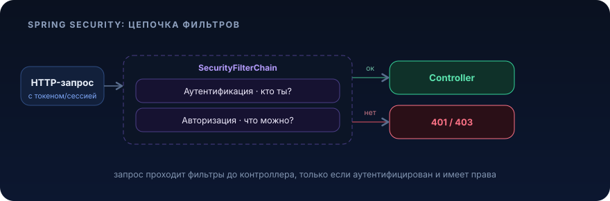

# Spring Security


<p align="center">
  
</p>

## Зачем это нужно / какую проблему решает

Представь: ты выкатил REST API интернет-магазина. `GET /api/orders/{id}` возвращает заказ, `DELETE /api/orders/{id}` удаляет его, `GET /api/admin/reports` отдаёт выручку за месяц. Пока ты тестируешь локально, всё прекрасно. Потом кто-то делает `curl https://shop.example.com/api/admin/reports` без единого токена и получает финансы компании. А ещё покупатель Вася меняет `{id}` в URL и читает чужой заказ Пети.

Проблема не в бизнес-логике, она корректна. Проблема в том, что **каждый эндпоинт должен знать, кто его дёргает и имеет ли право**. Писать это руками в каждом контроллере (`if (currentUser == null) return 401; if (!currentUser.isAdmin()) return 403;`), путь к катастрофе: ты забудешь проверку ровно в том эндпоинте, где она критична, продублируешь логику 200 раз и не сможешь её единообразно поменять.

Spring Security решает это, вставляя **цепочку фильтров перед контроллерами**. Каждый HTTP-запрос проходит сквозь неё: сначала выясняется, *кто ты* (аутентификация), затем, *что тебе можно* (авторизация). Контроллер получает управление, только если запрос легитимен. Ты описываешь правила декларативно в одном месте, а не размазываешь `if`-ы по коду.

Две задачи, которые нужно чётко разделять:

- **Аутентификация (authentication)**, «кто ты?». Проверка личности: логин/пароль, JWT-токен, сессионная кука, mTLS-сертификат. Результат, объект `Authentication` с твоими данными и ролями.
- **Авторизация (authorization)**, «что тебе можно?». Уже зная, кто ты, система решает: пустить на `/api/admin/**` или ответить `403 Forbidden`.

Классика путаницы новичков: `401 Unauthorized` это на самом деле про **аутентификацию** («ты не представился / токен невалиден»), а `403 Forbidden`, про **авторизацию** («мы знаем, кто ты, но сюда нельзя»). Названия HTTP-статусов исторически неудачные, держи в голове, что 401 = «залогинься», 403 = «тебе не положено».

## Ключевые понятия

### SecurityFilterChain, сердце конфигурации

Spring Security 6 (Spring Boot 3.x) отказался от `WebSecurityConfigurerAdapter`, его **удалили**. Сейчас конфигурация строится вокруг бина `SecurityFilterChain`: ты объявляешь `@Bean`, который через fluent-API `HttpSecurity` описывает правила. Это компонентный подход вместо наследования: несколько цепочек можно объявить для разных групп путей и упорядочить через `@Order`.

Внутри, линейка сервлет-фильтров (`SecurityFilterChain` буквально список `Filter`-ов). Запрос идёт по ним: `CorsFilter` → `CsrfFilter` → фильтр аутентификации → `AuthorizationFilter` → твой `DispatcherServlet`. Понимание, что это **фильтры до контроллера**, снимает 90% магии.

### Authentication и SecurityContext

Результат успешной аутентификации, объект `Authentication` (кто, какие `GrantedAuthority`). Он кладётся в `SecurityContext`, который живёт в `SecurityContextHolder` (по умолчанию, `ThreadLocal` на время обработки запроса). Из любого места кода достаёшь текущего пользователя, но лучше, через инъекцию `@AuthenticationPrincipal`, а не через статический холдер.

### UserDetailsService и UserDetails

Где брать пользователей? Интерфейс `UserDetailsService` c единственным методом `loadUserByUsername(String)` это твой мост к БД. Он возвращает `UserDetails`: логин, **хэш** пароля, набор `authorities`. Spring сам сравнит присланный пароль с хэшем через `PasswordEncoder`. Ты реализуешь `UserDetailsService` поверх своего JPA-репозитория, и Security ничего не знает про твою таблицу `users`, только про контракт.

### PasswordEncoder и BCrypt

Пароли **никогда** не хранят в открытом виде и не хэшируют «голым» SHA-256. Нужен медленный адаптивный алгоритм с солью: **BCrypt** (или Argon2, SCrypt, PBKDF2). `BCryptPasswordEncoder` генерирует соль сам, зашивает её в строку хэша (`$2a$10$...`) и настраивается по «стоимости» (work factor, по умолчанию 10 это 2^10 итераций). При росте железа поднимаешь фактор, старые хэши остаются валидными. Для новых проектов, где нужна миграция алгоритмов, есть `DelegatingPasswordEncoder` (префикс `{bcrypt}`, `{argon2}` в хэше).

### Form login vs stateless (JWT / OAuth2 Resource Server)

Два принципиально разных мира:

- **Form login + сессия**, классика для server-rendered приложений (Thymeleaf). После логина сервер создаёт `HttpSession`, кладёт `JSESSIONID` в куку, состояние хранится на сервере. Stateful.
- **Stateless (JWT / OAuth2 Resource Server)**, для SPA, мобилок, микросервисов. Сервер **не хранит сессию**. Клиент на каждый запрос шлёт `Authorization: Bearer <token>`. Сервер проверяет подпись токена (обычно JWT, подписанный внешним Identity Provider, Keycloak, Auth0, Cognito) и восстанавливает `Authentication` из claim'ов. Ничего не помнит между запросами. Идеально масштабируется горизонтально, любой инстанс обработает запрос без общего session-store.

В микросервисах почти всегда второй вариант: `spring-boot-starter-oauth2-resource-server`, ты только указываешь, где взять публичный ключ (`issuer-uri`), а валидацию подписи и парсинг claim'ов Spring делает сам.

### Method security (@PreAuthorize)

Правила на уровне URL (`requestMatchers`) грубоваты, когда доступ зависит от данных: «редактировать заказ может только его владелец». Тут включается **method security**: `@EnableMethodSecurity` + аннотации `@PreAuthorize` / `@PostAuthorize` прямо на методах сервиса. Внутри, SpEL-выражения: `@PreAuthorize("hasRole('ADMIN') or #order.ownerId == authentication.principal.id")`. Проверка навешивается через Spring AOP-прокси, поэтому работает только на публичных методах бина, вызванных **снаружи** (та же self-invocation проблема, что и у `@Transactional`).

### CSRF и CORS кратко

- **CSRF (Cross-Site Request Forgery)**, атака, где чужой сайт заставляет браузер жертвы отправить запрос с её кукой. Актуально только для **cookie-based** аутентификации (form login). Spring Security включает CSRF-защиту по умолчанию: на изменяющие запросы (POST/PUT/DELETE) требуется CSRF-токен. Для **stateless JWT** API, где нет кук, CSRF не работает как вектор → защиту отключают (`csrf(csrf -> csrf.disable())`). Это не «отключить безопасность», это «убрать неприменимый механизм».
- **CORS (Cross-Origin Resource Sharing)**, браузерный механизм: можно ли фронту с `app.example.com` дёргать API на `api.example.com`. Настраивается бином `CorsConfigurationSource`. Путать с CSRF, типичная ошибка: CORS разрешает легитимные кросс-доменные запросы, CSRF защищает от нелегитимных.

## Примеры на Java

Разберём **stateless JWT-ресурс-сервер** (самый частый кейс для микросервиса) и параллельно покажем локальную аутентификацию через `UserDetailsService` + BCrypt, чтобы было видно обе стороны.

### JPA-сущность пользователя

```java
package com.example.shop.user;

import jakarta.persistence.*;
import java.util.Set;

@Entity
@Table(name = "users")
public class UserEntity {

    @Id
    @GeneratedValue(strategy = GenerationType.IDENTITY)
    private Long id;

    @Column(nullable = false, unique = true)
    private String username;

    // храним BCrypt-хэш, НЕ пароль в открытом виде
    @Column(name = "password_hash", nullable = false)
    private String passwordHash;

    // роли пользователя; @ElementCollection тянет их отдельной таблицей user_roles
    @ElementCollection(fetch = FetchType.EAGER) // роли маленькие и нужны всегда при логине, EAGER здесь оправдан
    @CollectionTable(name = "user_roles", joinColumns = @JoinColumn(name = "user_id"))
    @Column(name = "role")
    @Enumerated(EnumType.STRING)
    private Set<Role> roles;

    protected UserEntity() { } // требуется JPA

    public UserEntity(String username, String passwordHash, Set<Role> roles) {
        this.username = username;
        this.passwordHash = passwordHash;
        this.roles = roles;
    }

    public Long getId() { return id; }
    public String getUsername() { return username; }
    public String getPasswordHash() { return passwordHash; }
    public Set<Role> getRoles() { return roles; }
}
```

```java
package com.example.shop.user;

public enum Role {
    USER,
    ADMIN
}
```

### Репозиторий

```java
package com.example.shop.user;

import org.springframework.data.jpa.repository.JpaRepository;
import java.util.Optional;

public interface UserRepository extends JpaRepository<UserEntity, Long> {
    Optional<UserEntity> findByUsername(String username);
}
```

### UserDetailsService поверх БД

```java
package com.example.shop.user;

import org.springframework.security.core.authority.SimpleGrantedAuthority;
import org.springframework.security.core.userdetails.*;
import org.springframework.stereotype.Service;

@Service
public class DbUserDetailsService implements UserDetailsService {

    private final UserRepository userRepository;

    // конструкторная инъекция, не @Autowired на поле
    public DbUserDetailsService(UserRepository userRepository) {
        this.userRepository = userRepository;
    }

    @Override
    public UserDetails loadUserByUsername(String username) {
        var user = userRepository.findByUsername(username)
            .orElseThrow(() -> new UsernameNotFoundException("User not found: " + username));

        var authorities = user.getRoles().stream()
            // Spring ждёт префикс ROLE_ для hasRole(...)
            .map(role -> new SimpleGrantedAuthority("ROLE_" + role.name()))
            .toList();

        // возвращаем встроенную реализацию UserDetails с ХЭШЕМ пароля
        return User.withUsername(user.getUsername())
            .password(user.getPasswordHash())
            .authorities(authorities)
            .build();
    }
}
```

### Конфигурация SecurityFilterChain (stateless JWT resource server)

```java
package com.example.shop.config;

import org.springframework.context.annotation.*;
import org.springframework.security.config.Customizer;
import org.springframework.security.config.annotation.method.configuration.EnableMethodSecurity;
import org.springframework.security.config.annotation.web.builders.HttpSecurity;
import org.springframework.security.config.http.SessionCreationPolicy;
import org.springframework.security.crypto.bcrypt.BCryptPasswordEncoder;
import org.springframework.security.crypto.password.PasswordEncoder;
import org.springframework.security.web.SecurityFilterChain;
import org.springframework.web.cors.*;
import java.util.List;

@Configuration
@EnableMethodSecurity // включает @PreAuthorize/@PostAuthorize
public class SecurityConfig {

    @Bean
    public SecurityFilterChain filterChain(HttpSecurity http) throws Exception {
        http
            // CORS, разрешаем фронту ходить в API (бин ниже)
            .cors(Customizer.withDefaults())
            // CSRF не нужен для stateless Bearer-token API: нет кук, нет вектора
            .csrf(csrf -> csrf.disable())
            // ключевое для stateless: сервер НЕ создаёт HttpSession
            .sessionManagement(sm -> sm.sessionCreationPolicy(SessionCreationPolicy.STATELESS))
            .authorizeHttpRequests(auth -> auth
                // публичные эндпоинты
                .requestMatchers("/api/auth/**", "/actuator/health").permitAll()
                // только админам
                .requestMatchers("/api/admin/**").hasRole("ADMIN")
                // всё остальное, только аутентифицированным
                .anyRequest().authenticated()
            )
            // включаем OAuth2 Resource Server с валидацией JWT
            .oauth2ResourceServer(oauth -> oauth.jwt(Customizer.withDefaults()));

        return http.build();
    }

    @Bean
    public PasswordEncoder passwordEncoder() {
        // work factor 10 по умолчанию; поднимай при росте железа
        return new BCryptPasswordEncoder();
    }

    @Bean
    public CorsConfigurationSource corsConfigurationSource() {
        var config = new CorsConfiguration();
        config.setAllowedOrigins(List.of("https://app.example.com"));
        config.setAllowedMethods(List.of("GET", "POST", "PUT", "DELETE"));
        config.setAllowedHeaders(List.of("Authorization", "Content-Type"));
        var source = new UrlBasedCorsConfigurationSource();
        source.registerCorsConfiguration("/**", config);
        return source;
    }
}
```

### application.yml, откуда брать ключ для проверки JWT

```yaml
spring:
  security:
    oauth2:
      resourceserver:
        jwt:
          # адрес Identity Provider (Keycloak/Auth0/...);
          # Spring сам скачает JWKS-ключи и провалидирует подпись токена
          issuer-uri: https://idp.example.com/realms/shop
```

### Контроллер с method security

```java
package com.example.shop.order;

import org.springframework.security.access.prepost.PreAuthorize;
import org.springframework.security.core.annotation.AuthenticationPrincipal;
import org.springframework.security.oauth2.jwt.Jwt;
import org.springframework.web.bind.annotation.*;

@RestController
@RequestMapping("/api/orders")
public class OrderController {

    private final OrderService orderService;

    public OrderController(OrderService orderService) {
        this.orderService = orderService;
    }

    // @AuthenticationPrincipal достаёт JWT текущего пользователя из SecurityContext
    @GetMapping("/{id}")
    public OrderDto getOrder(@PathVariable Long id, @AuthenticationPrincipal Jwt jwt) {
        // владельца проверяем внутри сервиса (см. @PreAuthorize ниже)
        return orderService.getForUser(id, jwt.getSubject());
    }

    // грубая проверка на уровне метода: только ADMIN
    @PreAuthorize("hasRole('ADMIN')")
    @DeleteMapping("/{id}")
    public void deleteOrder(@PathVariable Long id) {
        orderService.delete(id);
    }
}
```

```java
package com.example.shop.order;

import org.springframework.security.access.prepost.PreAuthorize;
import org.springframework.stereotype.Service;

@Service
public class OrderService {

    private final OrderRepository orderRepository;

    public OrderService(OrderRepository orderRepository) {
        this.orderRepository = orderRepository;
    }

    // тонкая авторизация «по данным»: пускаем ADMIN ИЛИ владельца заказа.
    // #id, аргумент метода, доступен в SpEL; проверка через returnObject невозможна
    // до вызова, поэтому владение проверяем в самом методе (см. ниже) либо @PostAuthorize.
    @PreAuthorize("hasRole('ADMIN') or @orderSecurity.isOwner(#id, authentication.name)")
    public OrderDto getForUser(Long id, String subject) {
        return orderRepository.findById(id)
            .map(OrderDto::from)
            .orElseThrow(() -> new OrderNotFoundException(id));
    }

    public void delete(Long id) {
        orderRepository.deleteById(id);
    }
}
```

### Регистрация пользователя, как правильно сохранять пароль

```java
package com.example.shop.auth;

import com.example.shop.user.*;
import org.springframework.security.crypto.password.PasswordEncoder;
import org.springframework.stereotype.Service;
import java.util.Set;

@Service
public class RegistrationService {

    private final UserRepository userRepository;
    private final PasswordEncoder passwordEncoder;

    public RegistrationService(UserRepository userRepository, PasswordEncoder passwordEncoder) {
        this.userRepository = userRepository;
        this.passwordEncoder = passwordEncoder;
    }

    public void register(String username, String rawPassword) {
        // encode() генерирует соль и BCrypt-хэш; в БД уходит только хэш
        var hash = passwordEncoder.encode(rawPassword);
        userRepository.save(new UserEntity(username, hash, Set.of(Role.USER)));
    }
}
```

## Частые ошибки / подводные камни

1. **Полевая инъекция вместо конструкторной.** `@Autowired private UserRepository repo;` мешает тестировать, скрывает обязательные зависимости и позволяет создать бин в невалидном состоянии. Всегда, `final`-поля + конструктор (Spring с одним конструктором инъектит без `@Autowired`). Это же требование стайл-гайда в проде.

2. **CSRF отключают там, где он нужен, и наоборот.** Если у тебя server-rendered приложение с form login и `JSESSIONID`-кукой, **не отключай** CSRF, иначе откроешь классическую CSRF-дыру. Если stateless Bearer-token API без кук, CSRF отключить корректно, он неприменим. Решает не «модно/немодно», а **есть ли кука, которую браузер шлёт автоматически**.

3. **`@PreAuthorize` на private-методе или при self-invocation.** Method security работает через Spring AOP-прокси, ровно как `@Transactional`. Аннотация на `private`-методе или на публичном, вызванном через `this.method()` из того же бина, **молча игнорируется**, проверки не будет, дыра открыта. Вызывай через инжектированный бин. (См. раздел роадмапа «Надёжность и архитектура» про прокси и self-invocation.)

4. **Забыли `SessionCreationPolicy.STATELESS` в JWT-API.** Без него Spring на каждый запрос всё равно заводит `HttpSession`, память течёт, а горизонтальное масштабирование ломается на sticky-session. Для токенового API, обязательно `STATELESS`.

5. **Хранение секретов и алгоритм хэширования.** Пароли, только через `PasswordEncoder` (BCrypt/Argon2), никогда не `MessageDigest.getInstance("SHA-256")` без соли и без «медленности». Секреты (issuer, client-secret, ключи БД), не в `application.yml` в гите, а через переменные окружения / Vault / K8s Secrets. Захардкоженный секрет в конфиге, находка для того, кто получит доступ к репозиторию.

6. **Путаница `hasRole` vs `hasAuthority` и префикс `ROLE_`.** `hasRole("ADMIN")` под капотом ищет authority `ROLE_ADMIN`. Если ты положил в `GrantedAuthority` строку `"ADMIN"` без префикса, `hasRole("ADMIN")` не сработает, а `hasAuthority("ADMIN")` сработает. Держи одно соглашение: роли с префиксом `ROLE_`, права/scope, без.

7. **`permitAll()` не значит «анонимно всегда».** Порядок `requestMatchers` важен: правила проверяются сверху вниз, первый матч выигрывает. Если `anyRequest().authenticated()` окажется выше специфичного `permitAll()`, публичный эндпоинт закроется. Специфичные пути, выше, `anyRequest()`, всегда последним.

## Практическая задача

**Контекст.** Ты пишешь микросервис `notes-service`, хранилище личных заметок. Фронт, SPA на React, ходит в API с `Authorization: Bearer <JWT>`, токены выдаёт корпоративный Keycloak. Сервис должен быть stateless и готов к горизонтальному масштабированию.

**Дано.**
- Заметка: `id`, `ownerUsername`, `title`, `body`, `createdAt`.
- В JWT есть claim `preferred_username` (логин) и claim `roles` со значениями `USER` / `ADMIN`.
- Keycloak доступен по `issuer-uri: https://keycloak.corp.local/realms/notes`.
- Эндпоинты:
  - `POST /api/notes`, создать заметку (владелец = текущий пользователь);
  - `GET /api/notes/{id}`, прочитать;
  - `DELETE /api/notes/{id}`, удалить;
  - `GET /api/admin/notes`, список всех заметок всех пользователей;
  - `GET /actuator/health`, здоровье, публичный.

**ТЗ.**
1. Настрой `SecurityFilterChain` как OAuth2 Resource Server с валидацией JWT, `STATELESS`-сессиями и выключенным CSRF (обоснуй в комментарии, почему выключен).
2. `/actuator/health`, публичный; `/api/admin/**`, только `ADMIN`; всё остальное, только аутентифицированным.
3. Роли из claim `roles` должны превращаться в `ROLE_USER` / `ROLE_ADMIN` (напиши свой `Converter<Jwt, ? extends AbstractAuthenticationToken>` или настрой `JwtAuthenticationConverter`).
4. Прочитать/удалить заметку может **только её владелец или ADMIN**. Реализуй это через `@PreAuthorize` (не через `if` в контроллере).
5. Настрой CORS: разрешён только origin `https://notes.corp.local`, методы `GET/POST/DELETE`.

**Критерии приёмки.**
- Запрос без токена на `/api/notes/1` → `401`.
- Токен валидного `USER`, который не владелец, на чужую заметку → `403`.
- Владелец на свою заметку → `200`.
- `USER` на `/api/admin/notes` → `403`; `ADMIN` → `200`.
- Любой запрос на `/actuator/health` без токена → `200`.
- В коде **нет** `HttpSession`, нет проверок владения через `if` в контроллере, нет полевой инъекции.

**Подсказки (без готового решения).**
- Маппинг claim'а `roles` в authorities, через `JwtAuthenticationConverter` + `JwtGrantedAuthoritiesConverter` или собственную лямбду; не забудь префикс `ROLE_`.
- Проверку владельца удобно вынести в отдельный бин (`@Component("noteSecurity")`) с методом `boolean isOwner(Long noteId, String username)` и звать его из SpEL: `@PreAuthorize("hasRole('ADMIN') or @noteSecurity.isOwner(#id, authentication.name)")`.
- Помни про self-invocation: `@PreAuthorize`-метод должен вызываться через прокси (снаружи бина), иначе проверка не сработает.
- Для функциональных тестов пригодятся `spring-security-test` и `SecurityMockMvcRequestPostProcessors.jwt()`, можно подсунуть JWT с нужными claim'ами без реального Keycloak.
- Про идемпотентность `POST /api/notes`, ретраи и rate limiting на публичных эндпоинтах, см. раздел роадмапа «Надёжность и архитектура»; здесь фокус только на access control.

## Что почитать

- [Spring Security Reference, Architecture (Servlet)](https://docs.spring.io/spring-security/reference/servlet/architecture.html), как устроена цепочка фильтров, `SecurityContext`, `Authentication`. Первоисточник.
- [Spring Security, OAuth2 Resource Server / JWT](https://docs.spring.io/spring-security/reference/servlet/oauth2/resource-server/jwt.html), официальный гайд по stateless JWT, валидации подписи и `JwtAuthenticationConverter`.
- [Spring Security, Method Security](https://docs.spring.io/spring-security/reference/servlet/authorization/method-security.html), `@EnableMethodSecurity`, `@PreAuthorize`/`@PostAuthorize`, SpEL-выражения.
- [Baeldung, Spring Security with Spring Boot](https://www.baeldung.com/security-spring), практический хаб со свежими примерами под Spring Security 6 / Boot 3 (form login, JWT, тестирование).

---

[← Spring Boot 3](spring-boot.md) · [Оглавление](../../../../../README.md) · [Spring Cloud →](spring-cloud.md)
