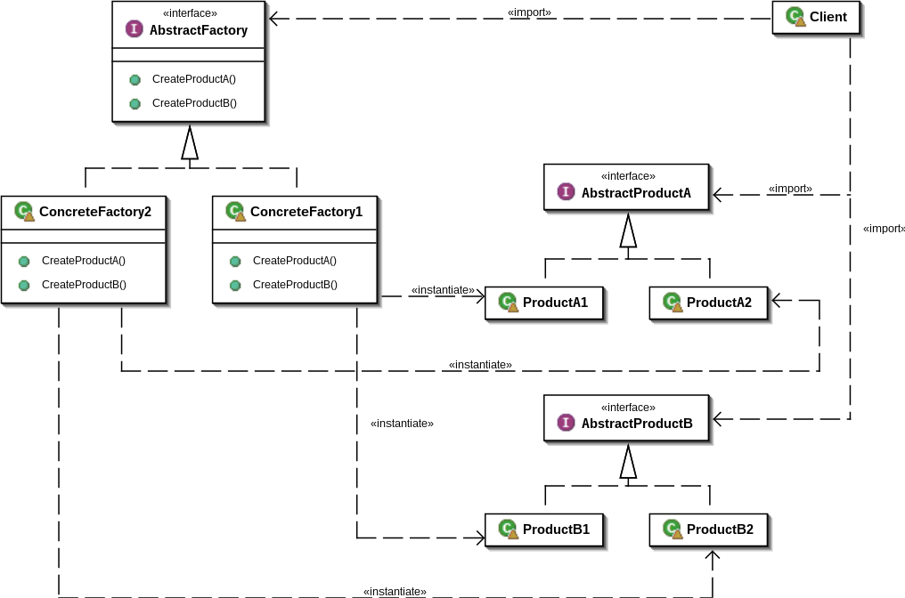

# Creational Patterns

Порождающие шаблоны (creational patterns) — шаблоны проектирования, которые позволяют сделать систему независимой от
способа создания, композиции и представления объектов.

Проще говоря, порождающие паттерны предназначены для создания экземпляра объекта или группы связанных объектов. К ним
относятся:

+ Singleton, или Одиночка
+ Builder, или Строитель
+ Factory Method, или Фабричный метод
+ Prototype, или Прототип
+ Abstract Factory, или Абстрактная фабрика

## Builder

Строитель (Builder) — порождающий шаблон проектирования предоставляет способ создания составного объекта.

### Цель

Отделяет конструирование сложного объекта от его представления так, что в результате одного и того же процесса
конструирования могут получаться разные представления.

### Плюсы

+ позволяет изменять внутреннее представление объекта;
+ изолирует код, реализующий конструирование и представление;
+ дает более тонкий контроль над процессом конструирования.

### Применение


Итак, паттерн проектирования Builder можно разбить на следующие важные компоненты:

+ Product (продукт) - Класс, который определяет сложный объект, который мы пытаемся шаг за шагом сконструировать, используя простые объекты.
+ Builder (строитель) - абстрактный класс/интерфейс, который определяет все этапы, необходимые для производства сложного объекта-продукта. Как правило, здесь
  объявляются (абстрактно) все этапы (buildPart), а их реализация относится к классам конкретных строителей (ConcreteBuilder).
+ ConcreteBuilder (конкретный строитель) - класс-строитель, который предоставляет фактический код для создания объекта-продукта. У нас может быть несколько
  разных ConcreteBuilder-классов, каждый из которых реализует различную разновидность или способ создания объекта-продукта.
+ Director (распорядитель) - супервизионный класс, под конролем котрого строитель выполняет скоординированные этапы для создания объекта-продукта. Распорядитель
  обычно получает на вход строителя с этапами на выполнение в четком порядке для построения объекта-продукта.

```java
public class Intern {

    private final String name;
    private final int age;

    public Intern(String name, int age) {
        this.name = name;
        this.age = age;
    }

    public static InternBuilder builder() {
        return new InternBuilder();
    }

    public static class InternBuilder {

        private String name;
        private int age;

        InternBuilder() {

        }

        public InternBuilder name(String name) {
            this.name = name;
            return this;
        }

        public InternBuilder age(int age) {
            this.age = age;
            return this;
        }

        public Intern build() {
            return new Intern(name, age);
        }

        @Override
        public String toString() {
            return String.format("InternBuilder(name = %s, age = %d)", this.name, this.age);
        }
    }

    @Override
    public String toString() {
        return String.format("Intern(name = %s, age = %d)", this.name, this.age);
    }
}
```

### Использование

```java
Intern vaga = Intern.builder()
        .name("Vaga")
        .age(21)
        .build();
```

Давайте реализуем пример со сборкой автомобилей, используя паттерн проектирования Builder.

Шаг 1: Создайте класс Car (автомобиль), который в нашем примере является продуктом:

```java
import lombok.Getter;
import lombok.Setter;

@Setter
@Getter
public class Car {

    private String chassis;
    private String body;
    private String paint;
    private String interior;

    public Car() {
        super();
    }

    public Car(String chassis,
               String body,
               String paint,
               String interior) {
        this();
        this.chassis = chassis;
        this.body = body;
        this.paint = paint;
        this.interior = interior;
    }

    @Override
    public String toString() {
        return "Car [chassis=" + chassis + ", body=" + body + ", paint=" + paint;
    }
}
```

Шаг 2: Создайте абстрактный класс/интерфейс CarBuilder, в котором определите все необходимые шаги для создания
автомобиля.

```java
public interface CarBuilder {
    CarBuilder fixChassis();

    CarBuilder fixBody();

    CarBuilder paint();

    CarBuilder fixInterior();

    Car build();
}
```

Обратите внимание, что я сделал тип CarBuilder типом возврата всех этапов, созданных здесь. Это позволит нам вызывать
этапы по цепочке. Здесь есть один очень важный метод build, который заключается в том, чтобы получить результат или
создать конечный объект Car. Этот метод фактически проверяет годность автомобиля и выпускает (возвращает) его только в
том случае, если его сборка завершена успешно (все валидно).

Шаг 3: Теперь пора написать ConcreteBuilder. Как я уже упоминал, у нас могут быть разные варианты ConcreteBuilder, и
каждый из них выполняет сборку по-своему, чтобы предоставить нам различные представления сложного объекта Car.

```java
public class ClassicCarBuilder implements CarBuilder {

    private String chassis;
    private String body;
    private String paint;
    private String interior;

    public ClassicCarBuilder() {
        super();
    }

    @Override
    public CarBuilder fixChassis() {
        this.chassis = "Classic Chassis";
        return this;
    }

    @Override
    public CarBuilder fixBody() {
        this.body = "Classic Body";
        return this;
    }

    @Override
    public CarBuilder paint() {
        this.paint = "Classic White Paint";
        return this;
    }

    @Override
    public CarBuilder fixInterior() {
        this.interior = "Classic interior";
        return this;
    }

    @Override
    public Car build() {
        return new Car(chassis, body, paint, interior);
    }
}
```

## Singleton

Одиночка (англ. Singleton) — порождающий шаблон проектирования, гарантирующий, что в однопоточном приложении будет
единственный экземпляр некоторого класса, и предоставляющий глобальную точку доступа к этому экземпляру.

### Цель

У класса есть только один экземпляр, и он предоставляет к нему глобальную точку доступа. При попытке создания данного
объекта он создаётся только в том случае, если ещё не существует, в противном случае возвращается ссылка на уже
существующий экземпляр и нового выделения памяти не происходит.

### Плюсы

+ Синглтон класс может быть «лениво» загружен, если это тяжелый объект, но у статического класса нет таких преимуществ и он всегда сразу загружается.

### Минусы

+ Написать юнит-тесты для синглтона легче чем для статического класса
+ Усложняется контроль за межпоточными гонками и задержками
    + Конфликт двух потоков за недостроенного одиночку приведёт к задержке.
+ Сами по себе одиночки никак не заведуют порядком выгрузки. Возможна даже ситуация «сборщик мусора уничтожил одиночку, клиент создал нового». Если этот порядок
  важен, можно перевести систему на умные указатели
+ Статические классы обеспечивают лучшую производительность чем синглтоны, поскольку статические методы связываются при компиляции.

### Lazy или eager загрузка singleton?

При реализации синглтона у нас есть два варианта:

+ Eager loading (нетерпеливая/ранняя загрузка) — ранняя загрузка, создание экземпляра при инициализации.
+ Lazy loading (ленивая/отложенная загрузка) — создание экземпляра по требованию.

Ленивая загрузка используется, когда требуется отложить инициализацию очень больших объектов или вычисление тяжелых конструкций, а так же при наличии
статических полей или методов, которые могут быть использованы до того как
потребуется экземпляр; тогда и только тогда вам нужна ленивая инициализация. В противном случае предпочтительнее использовать раннюю загрузку.

### Применение

### Eager loading singleton

* если ранняя загрузка подходит вам – выбирайте ее

Этот способ имеет ряд преимуществ:

+ Нет необходимости синхронизировать getInstance метод, поскольку все потоки видят тот же самый экземпляр и не требуется
  использования дорогой блокировки.
+ Статический инициализатор запускается в момент инициализации класса, после загрузки класса, но перед использованием этого класса любым потоком.
+ Ключевое слово final означает, что экземпляр не может быть переопределен, гарантируя существование одного, и только одного экземпляра.

```java
private static final Singleton INSTANCE = new Singleton();
```

Статический инициализатор так же возможен, при необходимости. Загрузчик класса выполняет тот же самый процесс:

```java
private static final Singleton INSTANCE;

static {
    try {
        INSTANCE = new Singleton();
    } catch (Exception e) {
        throw new RuntimeException("An error occurred!", e);
    }
}
```

Заметьте, что конструктор сделан приватным для исключения возможности создать экземпляр класса вне синглтон класса:

```java
private Singleton() {
}
```

### Грубая синхронизация

* простейший способ с серьезными проблемами производительности

В многопоточном окружении требуется быть уверенным, что только один поток (исполнения) может выполнить метод getInstance в данный момент. Самый простой способ
для синглтона отложенной загрузки – использовать ключевое слово synchronized для метода.

С точки зрения производительности этот код неэффективен и имеет ненужный оверхед (накладные расходы).

```java
public class Singleton {
    private static Singleton instance = null;

    private Singleton() {
    }

    public static synchronized Singleton getInstance() {
        if (instance == null) {
            instance = new Singleton();
        }
        return instance;
    }
}
```

В общем — не используйте этот вариант в серьезных проектах.

### Double-checked locking синглтон

* известная версия с малознакомыми проблемами

Double checked locking – это способ предотвратить создание другого экземпляра синглтона в многопоточном окружении при
вызове метода getInstance.

+ Экземпляр синглтона проверяется дважды перед инициализацией.
+ Синхронизированная критическая секция используется только после первой проверки экземпляра синглтона для улучшения производительности.
+ Ключевое слово volatile используется при определении членов экземпляра. Это принуждает компилятор всегда читать и писать в главную память и не использовать
  кэш CPU. С volatile переменной гарантируется happens-before отношение, все записи выполняются перед любым чтением.

```java
public class Singleton {
    private volatile static Singleton instance = null;

    private Singleton() {
    }

    public static Singleton getInstance() {
        if (instance == null) {
            synchronized (Singleton.class) {
                if (instance == null) {
                    instance = new Singleton();
                }
            }
        }
        return instance;
    }
}
```

### Недостатки

+ Поскольку для правильной работы требуется ключевое слово volatile, этот способ не совместим с Java 1.4 и ранними версиями. Проблема в том, что неупорядоченная
  запись может позволить возвратить ссылку на экземпляр до того как выполнится конструктор синглтона.
+ Падение производительности из-за отказа использования кеша для volatile переменных.
+ Экземпляр синглтона проверяется дважды перед инициализацией. Способ довольно многословен и затрудняет чтение.

### Initialization-on-demand holder идиома

* лучшая реализация для лениво загружаемого синглтона

+ Настолько отложенный, насколько это возможно, работает во всех известных версиях Java.
+ Использует гарантии языка, касаемо инициализации классов и поэтому работает корректно во всех Java-совместимых компиляторах и виртуальных машинах.
+ Отсутствие накладных расходов из-за синхронизации. Тесты производительности показывают, что так намного быстрее, чем даже синхронизация без конкуренции.

```java
public class Singleton {
    private Singleton() {
    }

    public static Singleton getInstance() {
        return SingletonHolder.INSTANCE;
    }

    private static class SingletonHolder {
        private static final Singleton INSTANCE = new Singleton();
    }
}
```

Это отличный способ получить синглтон используя требования JVM к классам и инициализации объектов. JVM гарантирует, что статический класс SingletonHolder не
инициализируется до тех пор, пока JVM определит, что SingletonHolder должен быть выполнен. Статический класс SingletonHolder выполняется когда статический метод
getInstance вызывается на классе Singleton, и когда это случается в первый раз, JVM загружает и инициализирует SingletonHolder класс.

Поскольку JLS (Java Language Specification) гарантирует, что фаза инициализации классов должна быть не конкурентной, никакой синхронизации не требуется для
статического метода getInstance во время загрузки и инициализации.

### Основанный на enum singleton

* современный взгляд на старую проблему

Эта реализация синглтона использует гарантии Java, что любое enum значение инстанцируется только один раз и enum
обеспечивает неявную поддержку потоковой безопасности (thread safety). Поскольку Java enum значения доступны глобально,
то это может использоваться как синглтон.

```java
public enum Singleton {
    SINGLETON;

    public void method() {
    }
}
```

Как это работает? Вторая строка кода может считаться чем-то вроде:

```java
public final static Singleton SINGLETON = new Singleton();
```

И мы получаем старый добрый синглтон с ранней загрузкой.

Помните, что поскольку это enum, вы всегда можете получить доступ к экземпляру через Singleton.SINGLETON:

```java
Singleton s = Singleton.SINGLETON;
```

### Преимущества

+ Для предотвращения создания еще одного экземпляра синглтона во время десериализации используйте синглтон, основанный на enum, поскольку о сериализации enum
  заботится JVM. Сериализация и десериализация enum работает по другому, нежели для обычных java объектов. Единственное, что сериализуется – это имя enum
  значения. Во время процесса десериализации enum метод valueOf используется с десериализованным именем для получения желаемого экземпляра.
+ Основанный на enum синглтон позволяет защитить себя от рефлексивных атак (reflection attack). Причиной, почему рефлексия не может быть использована для
  инстанцирования объектов типа enum, является запрет Java спецификации и данное правило закодировано в реализации метода newInstance класса Constructor,
  который обычно используется для создания объектов с помощью рефлексии:

```
if ((clazz.getModifiers() & Modifier.ENUM) != 0)
    throw new IllegalArgumentException("Cannot reflectively create enum objects");
```

+ Enum не был задуман имеющим возможность быть клонированным, т.к. должен существовать один экземпляр каждого значения.
+ Самый лаконичный код среди всех реализаций синглтона.

### Недостатки

+ Основанный на enum синглтон не поддерживает ленивую инициализацию.
+ Если вы поменяете вашу архитектуру и захотите конвертировать ваш синглтон в мультитон (multiton - гарантирует, что класс имеет поименованные экземпляры
  объекта и обеспечивает глобальную точку доступа к ним), enum вам в этом не поможет. Паттерн мультитон используется для контролируемого создания различных
  экземпляров, которые управляются с помощью map, что позволяет контролировать уникальность объекта по какому-либо признаку. Вместо того, что бы иметь
  единственный экземпляр на приложение (например java.lang.Runtime) паттерн мультитон обеспечивает единственный экземпляр на ключ.
+ Enum появился только только в Java 5, поэтому его невозможно использовать в ранних версиях.

### Кстати, почему синглтон может считаться анти-паттерном?

Почему вам следовало бы избегать паттерн Singleton (Одиночка) и вместо него использовать Dependency Injection (Инъекция
зависимости)? Например, каждый класс, которому нужен доступ к общему объекту, получает ссылку на него через свой
конструктор или через DI-контейнер.

Чем больше классов вызывают метод getInstance, тем больше код становится сильно связным (tightly coupled), монолитным,
не тестируемым и сложным для изменений и повторного использования из-за неконфигурируемых скрытых зависимостей.

### Сильная связность (tight coupling)

Поскольку синглтон предоставляет глобальный статус другим классам, он очень часто используется во многих местах в коде.
Это превращает синглтон в центральное место вашего приложения от которого напрямую или косвенно зависит остальной код.
Конкретный модуль может быть сложно переиспользовать и тестировать, т.к. зависимые модули так же должны быть включены.

### Сложности с тестированием

Поскольку фабричный метод (getInstance) глобально доступный, вы вызываете его с именем класса, вместо того, что бы
полагаться на интерфейс, который позже вы можете заменить другой реализацией или mock. Вот почему невозможно заменить
его, когда вы хотите протестировать метод или класс.

### Синглтон сохраняет состояние пока приложение выполняется

Постоянное состояние – враг юнит-тестирования. Одной из причин эффективности юнит-тестирования является независимость
каждого теста от других. Если это не так, то очередность, в которой выполняются тесты, влияет на результаты их
выполнения. Это может приводить к случаям, когда тесты завершаются с ошибкой, хотя не должны, а так же может приводить к
успешно выполненным тестам, что даже хуже.

## Factory Method

Фабричный метод (англ. Factory Method), или виртуальный конструктор (англ. Virtual Constructor) — порождающий шаблон
проектирования, предоставляющий подклассам (дочерним классам, субклассам) интерфейс для создания экземпляров некоторого
класса. В момент создания наследники могут определить, какой класс создавать. Иными словами, данный шаблон делегирует
создание объектов наследникам родительского класса.

### Цель

Определяет интерфейс для создания объекта, но оставляет подклассам решение о том, на основании какого класса создавать объект. Фабричный метод позволяет классу
делегировать создание подклассов. Используется, когда:

+ классу заранее неизвестно, объекты каких подклассов ему нужно создавать.
+ класс спроектирован так, чтобы объекты, которые он создаёт, специфицировались подклассами.
+ класс делегирует свои обязанности одному из нескольких вспомогательных подклассов, и планируется локализовать знание о том, какой класс принимает эти
  обязанности на себя.

### Структура

+ Product — продукт определяет интерфейс объектов, создаваемых абстрактным методом;
+ ConcreteProduct — конкретный продукт реализует интерфейс Product;
+ Creator — создатель объявляет фабричный метод, который возвращает объект типа Product. Может также содержать реализацию этого метода «по умолчанию»;
  может вызывать фабричный метод для создания объекта типа Product;
+ ConcreteCreator — конкретный создатель переопределяет фабричный метод таким образом, чтобы он создавал и возвращал объект класса ConcreteProduct.


### Плюсы

+ позволяет сделать код создания объектов более универсальным, не привязываясь к конкретным классам (ConcreteProduct), а
  оперируя лишь общим интерфейсом (Product);
+ позволяет установить связь между параллельными иерархиями классов.

### Минусы

+ необходимость создавать наследника Creator для каждого нового типа продукта (ConcreteProduct).

```java
interface Product {
}

class ConcreteProductA implements Product {
}

class ConcreteProductB implements Product {
}

abstract class Creator {
    public abstract Product factoryMethod();
}

class ConcreteCreatorA extends Creator {
    @Override
    public Product factoryMethod() {
        return new ConcreteProductA();
    }
}

class ConcreteCreatorB extends Creator {
    @Override
    public Product factoryMethod() {
        return new ConcreteProductB();
    }
}

public class FactoryMethodExample {
    public static void main(String[] args) {
        Creator[] creators = {new ConcreteCreatorA(), new ConcreteCreatorB()};
        for (Creator creator : creators) {
            Product product = creator.factoryMethod();
            System.out.printf("Created {%s}\n", product.getClass());
        }
    }
}
```

Результат работы:

```
Created {class ConcreteProductA}
Created {class ConcreteProductB}
```

### Abstract Factory

Абстрактная фабрика (англ. Abstract factory) — порождающий шаблон проектирования, предоставляет интерфейс для создания
семейств взаимосвязанных или взаимозависимых объектов, не специфицируя их конкретных классов.

### Цель

Предоставляет интерфейс для создания семейств взаимосвязанных или взаимозависимых объектов, не специфицируя их
конкретных классов.

### Реализация



### Плюсы

+ изолирует конкретные классы;
+ упрощает замену семейств продуктов;
+ гарантирует сочетаемость продуктов.

### Минусы

+ сложно добавить поддержку нового вида продуктов.

```java
public class AbstractFactoryExample {
    public static void main(String[] args) {
        AbstractFactory factory1 = new ConcreteFactory1();
        Client client1 = new Client(factory1);
        client1.execute();

        AbstractFactory factory2 = new ConcreteFactory2();
        Client client2 = new Client(factory2);
        client2.execute();
    }
}

class Client {
    private AbstractProductA productA;
    private AbstractProductB productB;

    Client(AbstractFactory factory) {
        productA = factory.createProductA();
        productB = factory.createProductB();
    }

    void execute() {
        productB.interact(productA);
    }
}

interface AbstractFactory {
    AbstractProductA createProductA();

    AbstractProductB createProductB();
}

interface AbstractProductA {
    void interact(AbstractProductB b);
}

interface AbstractProductB {
    void interact(AbstractProductA a);
}

class ConcreteFactory1 implements AbstractFactory {
    @Override
    public AbstractProductA createProductA() {
        return new ProductA1();
    }

    @Override
    public AbstractProductB createProductB() {
        return new ProductB1();
    }
}

class ConcreteFactory2 implements AbstractFactory {
    @Override
    public AbstractProductA createProductA() {
        return new ProductA2();
    }

    @Override
    public AbstractProductB createProductB() {
        return new ProductB2();
    }
}

class ProductA1 implements AbstractProductA {
    @Override
    public void interact(AbstractProductB b) {
        System.out.println(this.getClass().getName() + " interacts with " + b.getClass().getName());
    }
}

class ProductB1 implements AbstractProductB {
    @Override
    public void interact(AbstractProductA a) {
        System.out.println(this.getClass().getName() + " interacts with " + a.getClass().getName());
    }

}

class ProductA2 implements AbstractProductA {
    @Override
    public void interact(AbstractProductB b) {
        System.out.println(this.getClass().getName() + " interacts with " + b.getClass().getName());
    }
}

class ProductB2 implements AbstractProductB {
    @Override
    public void interact(AbstractProductA a) {
        System.out.println(this.getClass().getName() + " interacts with " + a.getClass().getName());
    }

}
```
