### [Назад к оглавлению](../../../../README.md)

# Структурные паттерны проектирования

Список структурных паттернов проектирования, которые отвечают за построение удобных в поддержке иерархий классов.

+ Адаптер (Adapter)
+ Мост (Bridge)
+ Компоновщик (Composite)
+ Декоратор (Decorator)
+ Фасад (Facade)
+ Легковес (Flyweight)
+ Заместитель (Proxy)

## Адаптер

Также известен как: Wrapper, Обёртка, Adapter

### Суть паттерна

Адаптер — это структурный паттерн проектирования, который позволяет объектам с несовместимыми интерфейсами работать вместе.


### Проблема

Представьте, что вы делаете приложение для торговли на бирже. Ваше приложение скачивает биржевые метрики из нескольких источников в XML, а затем рисует красивые графики.

В какой-то момент вы решаете улучшить приложение, применив стороннюю библиотеку аналитики. Но вот беда — библиотека поддерживает только формат данных JSON, несовместимый с вашим приложением.

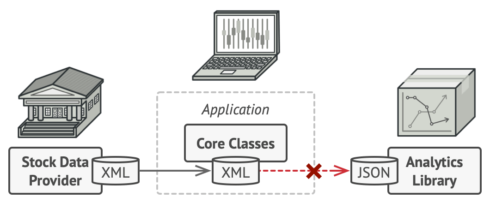

Подключить стороннюю библиотеку не выйдет из-за несовместимых форматов данных.

Вы смогли бы переписать библиотеку, чтобы та поддерживала формат XML. Но, во-первых, это может нарушить работу существующего кода, который уже зависит от библиотеки. А во-вторых, у вас может просто не быть доступа к её исходному коду.

### Решение

Вы можете создать адаптер. Это объект-переводчик, который трансформирует интерфейс или данные одного объекта в такой вид, чтобы он стал понятен другому объекту.

При этом адаптер оборачивает один из объектов, так что другой объект даже не знает о наличии первого. Например, вы можете обернуть объект, работающий в метрах, адаптером, который бы конвертировал данные в футы.

Адаптеры могут не только переводить данные из одного формата в другой, но и помогать объектам с разными интерфейсами работать сообща. Это работает так:

+ Адаптер имеет интерфейс, который совместим с одним из объектов.
+ Поэтому этот объект может свободно вызывать методы адаптера.
+ Адаптер получает эти вызовы и перенаправляет их второму объекту, но уже в том формате и последовательности, которые
  понятны второму объекту.

Иногда возможно создать даже двухсторонний адаптер, который работал бы в обе стороны.


Программа может работать со сторонней библиотекой через адаптер.

Таким образом, в приложении биржевых метрик вы могли бы создать класс XML_To_JSON_Adapter, который бы оборачивал объект того или иного класса библиотеки аналитики. Ваш код посылал бы адаптеру запросы в формате XML, а адаптер сначала транслировал входящие данные в формат JSON, а затем передавал бы их методам обёрнутого объекта аналитики.

### Аналогия из жизни


Содержимое чемоданов до и после поездки за границу.

Когда вы в первый раз летите за границу, вас может ждать сюрприз при попытке зарядить ноутбук. Стандарты розеток в разных странах отличаются. Ваша европейская зарядка будет бесполезна в США без специального адаптера, позволяющего подключиться к розетке другого типа.

### Структура

#### Адаптер объектов

Эта реализация использует агрегацию: объект адаптера «оборачивает», то есть содержит ссылку на служебный объект. Такой подход работает во всех языках программирования.


#### Адаптер классов

Эта реализация базируется на наследовании: адаптер наследует оба интерфейса одновременно. Такой подход возможен только языках, поддерживающих множественное наследование, например, C++.


### Псевдокод

В этом шуточном примере Адаптер преобразует один интерфейс в другой, позволяя совместить квадратные колышки и круглые отверстия.


Пример адаптации квадратных колышков и круглых отверстий.

Адаптер вычисляет наименьший радиус окружности, в которую можно вписать квадратный колышек, и представляет его как круглый колышек с этим радиусом.

```
// Классы с совместимыми интерфейсами: КруглоеОтверстие и КруглыйКолышек.
class RoundHole is
    constructor RoundHole(radius) { ... }

    method getRadius() is
        // Вернуть радиус отверстия.

    method fits(peg: RoundPeg) is
        return this.getRadius() >= peg.getRadius()

class RoundPeg is
    constructor RoundPeg(radius) { ... }

    method getRadius() is
        // Вернуть радиус круглого колышка.


// Устаревший, несовместимый класс: КвадратныйКолышек.
class SquarePeg is
    constructor SquarePeg(width) { ... }

    method getWidth() is
        // Вернуть ширину квадратного колышка.


// Адаптер позволяет использовать квадратные колышки и круглые
// отверстия вместе.
class SquarePegAdapter extends RoundPeg is
    private field peg: SquarePeg

    constructor SquarePegAdapter(peg: SquarePeg) is
        this.peg = peg

    method getRadius() is
        // Вычислить половину диагонали квадратного колышка по
        // теореме Пифагора.
        return peg.getWidth() * Math.sqrt(2) / 2


// Где-то в клиентском коде.
hole = new RoundHole(5)
rpeg = new RoundPeg(5)
hole.fits(rpeg) // TRUE

small_sqpeg = new SquarePeg(5)
large_sqpeg = new SquarePeg(10)
hole.fits(small_sqpeg) // Ошибка компиляции, несовместимые типы

small_sqpeg_adapter = new SquarePegAdapter(small_sqpeg)
large_sqpeg_adapter = new SquarePegAdapter(large_sqpeg)
hole.fits(small_sqpeg_adapter) // TRUE
hole.fits(large_sqpeg_adapter) // FALSE
```

### Применимость

Когда вы хотите использовать сторонний класс, но его интерфейс не соответствует остальному коду приложения.

Адаптер позволяет создать объект-прослойку, который будет превращать вызовы приложения в формат, понятный стороннему классу.

Когда вам нужно использовать несколько существующих подклассов, но в них не хватает какой-то общей функциональности, причём расширить суперкласс вы не можете.

Вы могли бы создать ещё один уровень подклассов и добавить в них недостающую функциональность. Но при этом придётся дублировать один и тот же код в обеих ветках подклассов.

Более элегантным решением было бы поместить недостающую функциональность в адаптер и приспособить его для работы с суперклассом. Такой адаптер сможет работать со всеми подклассами иерархии. Это решение будет сильно напоминать паттерн Декоратор.

### Шаги реализации

1. Убедитесь, что у вас есть два класса с несовместимыми интерфейсами:
    + полезный сервис — служебный класс, который вы не можете изменять (он либо сторонний, либо от него зависит другой
      код);
    + один или несколько клиентов — существующих классов приложения, несовместимых с сервисом из-за неудобного или
      несовпадающего интерфейса.

2. Опишите клиентский интерфейс, через который классы приложения смогли бы использовать класс сервиса.

3. Создайте класс адаптера, реализовав этот интерфейс.

4. Поместите в адаптер поле, которое будет хранить ссылку на объект сервиса. Обычно это поле заполняют объектом, переданным в конструктор адаптера. В случае простой адаптации этот объект можно передавать через параметры методов адаптера.

5. Реализуйте все методы клиентского интерфейса в адаптере. Адаптер должен делегировать основную работу сервису.

6. Приложение должно использовать адаптер только через клиентский интерфейс. Это позволит легко изменять и добавлять адаптеры в будущем.

### Преимущества и недостатки

+ Отделяет и скрывает от клиента подробности преобразования различных интерфейсов.
+ Усложняет код программы из-за введения дополнительных классов.

### Отношения с другими паттернами

+ Адаптер предоставляет совершенно другой интерфейс для доступа к существующему объекту. С другой стороны, при использовании паттерна Декоратор интерфейс либо остается прежним, либо расширяется. Причём Декоратор поддерживает рекурсивную вложенность, чего не скажешь об Адаптере.
+ Фасад задаёт новый интерфейс, тогда как Адаптер повторно использует старый. Адаптер оборачивает только один класс, а Фасад оборачивает целую подсистему. Кроме того, Адаптер позволяет двум существующим интерфейсам работать сообща, вместо того, чтобы задать полностью новый.

### Примеры реализации паттерна

#### Адаптер на Java

Адаптер — это структурный паттерн, который позволяет подружить несовместимые объекты.

Адаптер выступает прослойкой между двумя объектами, превращая вызовы одного в вызовы понятные другому.

Применимость: Паттерн можно часто встретить в Java-коде, особенно там, где требуется конвертация разных типов данных или совместная работа классов с разными интерфейсами.

Примеры Адаптеров в стандартных библиотеках Java:

+ `java.util.Arrays#asList()`
+ `java.util.Collections#list()`
+ `java.util.Collections#enumeration()`
+ `java.io.InputStreamReader(InputStream) (возвращает объект Reader)`
+ `java.io.OutputStreamWriter(OutputStream) (возвращает объект Writer)`
+ `javax.xml.bind.annotation.adapters.XmlAdapter#marshal() и #unmarshal()`

Признаки применения паттерна: Адаптер получает конвертируемый объект в конструкторе или через параметры своих методов.
Методы Адаптера обычно совместимы с интерфейсом одного объекта. Они делегируют вызовы вложенному объекту, превратив
перед этим параметры вызова в формат, поддерживаемый вложенным объектом.

`round`

`round/RoundHole.java: Круглое отверстие`

```java
package ru.adapter.example.round;

/**
 * КруглоеОтверстие совместимо с КруглымиКолышками.
 */
public class RoundHole {
    private double radius;

    public RoundHole(double radius) {
        this.radius = radius;
    }

    public double getRadius() {
        return radius;
    }

    public boolean fits(RoundPeg peg) {
        return (this.getRadius() >= peg.getRadius());
    }
}
```

`round/RoundPeg.java: Круглый колышек`

```java
package ru.adapter.example.round;

/**
 * КруглыеКолышки совместимы с КруглымиОтверстиями.
 */
public class RoundPeg {
    private double radius;

    public RoundPeg() {
    }

    public RoundPeg(double radius) {
        this.radius = radius;
    }

    public double getRadius() {
        return radius;
    }
}
```

`square`

`square/SquarePeg.java: Квадратный колышек`

```java
package ru.adapter.example.square;

/**
 * КвадратныеКолышки несовместимы с КруглымиОтверстиями (они остались в проекте
 * после бывших разработчиков). Но мы должны как-то интегрировать их в нашу
 * систему.
 */
public class SquarePeg {
    private double width;

    public SquarePeg(double width) {
        this.width = width;
    }

    public double getWidth() {
        return width;
    }

    public double getSquare() {
        return Math.pow(this.width, 2);
    }
}
```

`adapters`

`adapters/SquarePegAdapter.java: Адаптер квадратных колышков к круглым отверстиям`

```java
package ru.adapter.example.adapters;

import ru.adapter.example.round.RoundPeg;
import ru.adapter.example.square.SquarePeg;

/**
 * Адаптер позволяет использовать КвадратныеКолышки и КруглыеОтверстия вместе.
 */
public class SquarePegAdapter extends RoundPeg {
    private SquarePeg peg;

    public SquarePegAdapter(SquarePeg peg) {
        this.peg = peg;
    }

    @Override
    public double getRadius() {
        double result;
        // Рассчитываем минимальный радиус, в который пролезет этот колышек.
        result = (Math.sqrt(Math.pow((peg.getWidth() / 2), 2) * 2));
        return result;
    }
}
```

`Demo.java: Клиентский код`

```java
package ru.adapter.example;

import ru.adapter.example.adapters.SquarePegAdapter;
import ru.adapter.example.round.RoundHole;
import ru.adapter.example.round.RoundPeg;
import ru.adapter.example.square.SquarePeg;

/**
 * Где-то в клиентском коде...
 */
public class Demo {
    public static void main(String[] args) {
        // Круглое к круглому — всё работает.
        RoundHole hole = new RoundHole(5);
        RoundPeg rpeg = new RoundPeg(5);
        if (hole.fits(rpeg)) {
            System.out.println("Round peg r5 fits round hole r5.");
        }

        SquarePeg smallSqPeg = new SquarePeg(2);
        SquarePeg largeSqPeg = new SquarePeg(20);
        // hole.fits(smallSqPeg); // Не скомпилируется.

        // Адаптер решит проблему.
        SquarePegAdapter smallSqPegAdapter = new SquarePegAdapter(smallSqPeg);
        SquarePegAdapter largeSqPegAdapter = new SquarePegAdapter(largeSqPeg);
        if (hole.fits(smallSqPegAdapter)) {
            System.out.println("Square peg w2 fits round hole r5.");
        }
        if (!hole.fits(largeSqPegAdapter)) {
            System.out.println("Square peg w20 does not fit into round hole r5.");
        }
    }
}
```

## Фасад

Также известен как: Facade

### Суть паттерна

Фасад — это структурный паттерн проектирования, который предоставляет простой интерфейс к сложной системе классов, библиотеке или фреймворку.


### Проблема

Вашему коду приходится работать с большим количеством объектов некой сложной библиотеки или фреймворка. Вы должны самостоятельно инициализировать эти объекты, следить за правильным порядком зависимостей и так далее.

В результате бизнес-логика ваших классов тесно переплетается с деталями реализации сторонних классов. Такой код довольно сложно понимать и поддерживать.

### Решение

Фасад — это простой интерфейс для работы со сложной подсистемой, содержащей множество классов. Фасад может иметь урезанный интерфейс, не имеющий 100% функциональности, которой можно достичь, используя сложную подсистему напрямую. Но
он предоставляет именно те фичи, которые нужны клиенту, и скрывает все остальные.

Фасад полезен, если вы используете какую-то сложную библиотеку со множеством подвижных частей, но вам нужна только часть её возможностей.

К примеру, программа, заливающая видео котиков в социальные сети, может использовать профессиональную библиотеку сжатия видео. Но все, что нужно клиентскому коду этой программы — простой метод encode(filename, format). Создав класс с таким методом, вы реализуете свой первый фасад.

### Аналогия из жизни

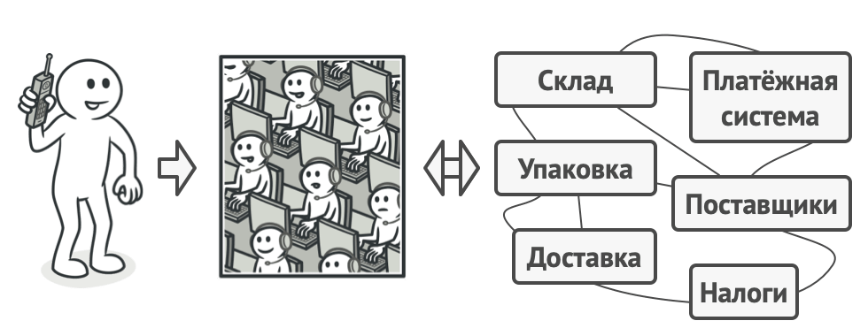
Пример телефонного заказа.

Когда вы звоните в магазин и делаете заказ по телефону, сотрудник службы поддержки является вашим фасадом ко всем службам и отделам магазина. Он предоставляет вам упрощённый интерфейс к системе создания заказа, платёжной системе и отделу доставки.

### Структура


### Псевдокод

В этом примере Фасад упрощает работу со сложным фреймворком видеоконвертации.

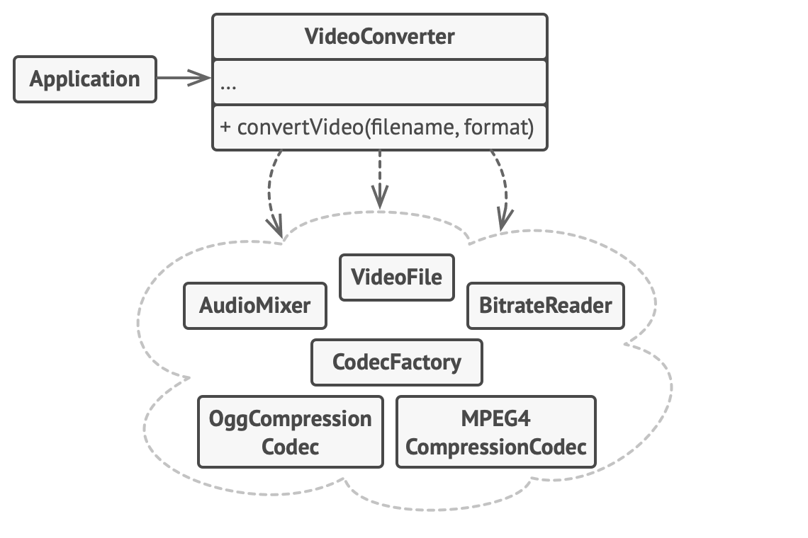
Пример изоляции множества зависимостей в одном фасаде.

Вместо непосредственной работы с дюжиной классов, фасад предоставляет коду приложения единственный метод для конвертации видео, который сам заботится о том, чтобы правильно сконфигурировать нужные объекты фреймворка и получить требуемый
результат.

```
// Классы сложного стороннего фреймворка конвертации видео. Мы
// не контролируем этот код, поэтому не можем его упростить.

class VideoFile
// ...

class OggCompressionCodec
// ...

class MPEG4CompressionCodec
// ...

class CodecFactory
// ...

class BitrateReader
// ...

class AudioMixer
// ...


// Вместо этого мы создаём Фасад — простой интерфейс для работы
// со сложным фреймворком. Фасад не имеет всей функциональности
// фреймворка, но зато скрывает его сложность от клиентов.
class VideoConverter is
    method convert(filename, format):File is
        file = new VideoFile(filename)
        sourceCodec = (new CodecFactory).extract(file)
        if (format == "mp4")
            destinationCodec = new MPEG4CompressionCodec()
        else
            destinationCodec = new OggCompressionCodec()
        buffer = BitrateReader.read(filename, sourceCodec)
        result = BitrateReader.convert(buffer, destinationCodec)
        result = (new AudioMixer()).fix(result)
        return new File(result)

// Приложение не зависит от сложного фреймворка конвертации
// видео. Кстати, если вы вдруг решите сменить фреймворк, вам
// нужно будет переписать только класс фасада.
class Application is
    method main() is
        convertor = new VideoConverter()
        mp4 = convertor.convert("funny-cats-video.ogg", "mp4")
        mp4.save()
```

### Применимость

Когда вам нужно представить простой или урезанный интерфейс к сложной подсистеме.

Часто подсистемы усложняются по мере развития программы. Применение большинства паттернов приводит к появлению меньших классов, но в бóльшем количестве. Такую подсистему проще повторно использовать, настраивая её каждый раз под конкретные
нужды, но вместе с тем, применять подсистему без настройки становится труднее. Фасад предлагает определённый вид системы по умолчанию, устраивающий большинство клиентов.

Когда вы хотите разложить подсистему на отдельные слои.

Используйте фасады для определения точек входа на каждый уровень подсистемы. Если подсистемы зависят друг от друга, то зависимость можно упростить, разрешив подсистемам обмениваться информацией только через фасады.

Например, возьмём ту же сложную систему видеоконвертации. Вы хотите разбить её на слои работы с аудио и видео. Для каждой из этих частей можно попытаться создать фасад и заставить классы аудио и видео обработки общаться друг с другом через эти фасады, а не напрямую.

### Шаги реализации

1. Определите, можно ли создать более простой интерфейс, чем тот, который предоставляет сложная подсистема. Вы на правильном пути, если этот интерфейс избавит клиента от необходимости знать о подробностях подсистемы.

2. Создайте класс фасада, реализующий этот интерфейс. Он должен переадресовывать вызовы клиента нужным объектам подсистемы. Фасад должен будет позаботиться о том, чтобы правильно инициализировать объекты подсистемы.

3. Вы получите максимум пользы, если клиент будет работать только с фасадом. В этом случае изменения в подсистеме будут затрагивать только код фасада, а клиентский код останется рабочим.

4. Если ответственность фасада начинает размываться, подумайте о введении дополнительных фасадов.

### Преимущества и недостатки

+ Изолирует клиентов от компонентов сложной подсистемы.
+ Фасад рискует стать божественным объектом, привязанным ко всем классам программы.

### Отношения с другими паттернами

+ Фасад задаёт новый интерфейс, тогда как Адаптер повторно использует старый. Адаптер оборачивает только один класс, а Фасад оборачивает целую подсистему. Кроме того, Адаптер позволяет двум существующим интерфейсам работать сообща, вместо того, чтобы задать полностью новый.
+ Фасад можно сделать Одиночкой, так как обычно нужен только один объект-фасад.

### Фасад на Java

Фасад — это структурный паттерн, который предоставляет простой (но урезанный) интерфейс к сложной системе объектов, библиотеке или фреймворку.

Кроме того, что Фасад позволяет снизить общую сложность программы, он также помогает вынести код, зависимый от внешней системы в единственное место.

Применимость: Паттерн часто встречается в клиентских приложениях, написанных на Java, которые используют классы-фасады для упрощения работы со сложными библиотеки или API.

Примеры Фасадов в стандартных библиотеках Java:

+ `javax.faces.context.FacesContext` использует «под капотом» классы `LifeCycle`, `ViewHandler`, `NavigationHandler` и многие другие, но клиенты об этом даже не знают (что не мешает заменить эти классы другими с помощью инъекций).

+ `javax.faces.context.ExternalContext` использует внутри классы `ServletContext`, `HttpSession`, `HttpServletRequest`, `HttpServletResponse`, и так далее.

Признаки применения паттерна: Фасад угадывается в классе, который имеет простой интерфейс, но делегирует основную часть работы другим классам. Чаще всего, фасады сами следят за жизненным циклом объектов сложной системы.

### Простой интерфейс к сложной библиотеке видеоконвертации

В этом примере Фасад упрощает работу клиента со сложной библиотекой видеоконвертации.

Фасад предоставляет пользователю лишь один простой метод, скрывая за собой целую систему с видеокодеками, аудиомикшерами и другими не менее сложными объектами.

`some_complex_media_library: Сложная библиотека видеоконвертации`

`some_complex_media_library/VideoFile.java: Класс видеофайла`

```java
package ru.facade.example.some_complex_media_library;

public class VideoFile {
    private String name;
    private String codecType;

    public VideoFile(String name) {
        this.name = name;
        this.codecType = name.substring(name.indexOf(".") + 1);
    }

    public String getCodecType() {
        return codecType;
    }

    public String getName() {
        return name;
    }
}
```

`some_complex_media_library/Codec.java: Интерфейс кодека`

```java
package ru.facade.example.some_complex_media_library;

public interface Codec {

}
```

`some_complex_media_library/MPEG4CompressionCodec.java: Кодек MPEG4`

```java
package ru.facade.example.some_complex_media_library;

public class MPEG4CompressionCodec implements Codec {
    public String type = "mp4";
}
```

`some_complex_media_library/OggCompressionCodec.java: Кодек Ogg`

```java
package ru.facade.example.some_complex_media_library;

public class OggCompressionCodec implements Codec {
    public String type = "ogg";
}
```

`some_complex_media_library/CodecFactory.java: Фабрика видеокодеков кодеков`

```java
package ru.facade.example.some_complex_media_library;

public class CodecFactory {
    public static Codec extract(VideoFile file) {
        String type = file.getCodecType();
        if (type.equals("mp4")) {
            System.out.println("CodecFactory: extracting mpeg audio...");
            return new MPEG4CompressionCodec();
        } else {
            System.out.println("CodecFactory: extracting ogg audio...");
            return new OggCompressionCodec();
        }
    }
}
```

`some_complex_media_library/BitrateReader.java: Bitrate-конвертер`

```java
package ru.facade.example.some_complex_media_library;

public class BitrateReader {
    public static VideoFile read(VideoFile file, Codec codec) {
        System.out.println("BitrateReader: reading file...");
        return file;
    }

    public static VideoFile convert(VideoFile buffer, Codec codec) {
        System.out.println("BitrateReader: writing file...");
        return buffer;
    }
}
```

`some_complex_media_library/AudioMixer.java: Микширование аудио`

```java
package ru.facade.example.some_complex_media_library;

import java.io.File;

public class AudioMixer {
    public File fix(VideoFile result) {
        System.out.println("AudioMixer: fixing audio...");
        return new File("tmp");
    }
}
```

`facade`

`facade/VideoConversionFacade.java: Фасад библиотеки работы с видео`

```java
package ru.facade.example.facade;

import ru.facade.example.some_complex_media_library.*;

import java.io.File;

public class VideoConversionFacade {
    public File convertVideo(String fileName, String format) {
        System.out.println("VideoConversionFacade: conversion started.");
        VideoFile file = new VideoFile(fileName);
        Codec sourceCodec = CodecFactory.extract(file);
        Codec destinationCodec;
        if (format.equals("mp4")) {
            destinationCodec = new MPEG4CompressionCodec();
        } else {
            destinationCodec = new OggCompressionCodec();
        }
        VideoFile buffer = BitrateReader.read(file, sourceCodec);
        VideoFile intermediateResult = BitrateReader.convert(buffer, destinationCodec);
        File result = (new AudioMixer()).fix(intermediateResult);
        System.out.println("VideoConversionFacade: conversion completed.");
        return result;
    }
}
```

`Demo.java: Клиентский код`

```java
package ru.facade.example;

import ru.facade.example.facade.VideoConversionFacade;

import java.io.File;

public class Demo {
    public static void main(String[] args) {
        VideoConversionFacade converter = new VideoConversionFacade();
        File mp4Video = converter.convertVideo("youtubevideo.ogg", "mp4");
        // ...
    }
}
```

`OutputDemo.txt: Результат выполнения`

```
VideoConversionFacade: conversion started.
CodecFactory: extracting ogg audio...
BitrateReader: reading file...
BitrateReader: writing file...
AudioMixer: fixing audio...
VideoConversionFacade: conversion completed.
```

## Декоратор

Также известен как: Wrapper, Обёртка, Decorator

### Суть паттерна

Декоратор — это структурный паттерн проектирования, который позволяет динамически добавлять объектам новую функциональность, оборачивая их в полезные «обёртки».

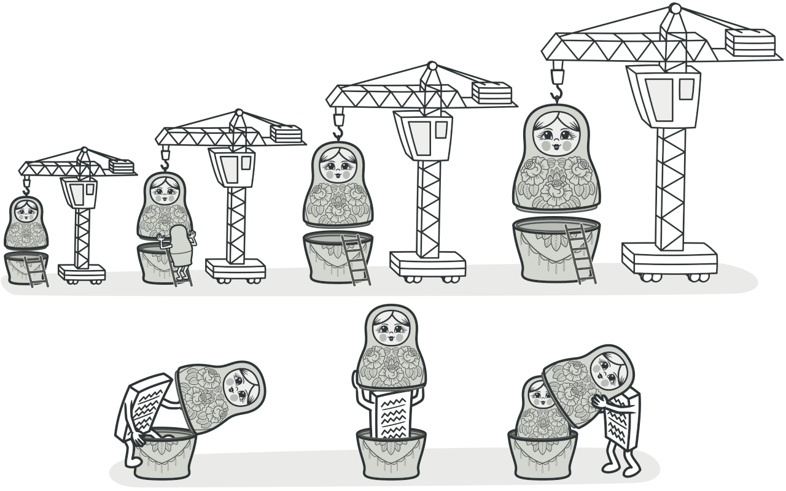

### Проблема

Вы работаете над библиотекой оповещений, которую можно подключать к разнообразным программам, чтобы получать уведомления о важных событиях.

Основой библиотеки является класс Notifier с методом send, который принимает на вход строку-сообщение и высылает её всем администраторам по электронной почте. Сторонняя программа должна создать и настроить этот объект, указав кому отправлять оповещения, а затем использовать его каждый раз, когда что-то случается.


Сторонние программы используют главный класс оповещений.

В какой-то момент стало понятно, что одних email-оповещений пользователям мало. Некоторые из них хотели бы получать извещения о критических проблемах через SMS. Другие хотели бы получать их в виде сообщений Facebook. Корпоративные пользователи хотели бы видеть сообщения в Slack.

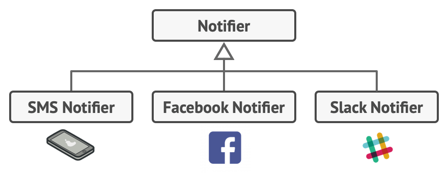
Каждый тип оповещения живёт в собственном подклассе.

Сначала вы добавили каждый из этих типов оповещений в программу, унаследовав их от базового класса Notifier. Теперь пользователь выбирал один из типов оповещений, который и использовался в дальнейшем.

Но затем кто-то резонно спросил, почему нельзя выбрать несколько типов оповещений сразу? Ведь если вдруг в вашем доме начался пожар, вы бы хотели получить оповещения по всем каналам, не так ли?

Вы попытались реализовать все возможные комбинации подклассов оповещений. Но после того как вы добавили первый десяток классов, стало ясно, что такой подход невероятно раздувает код программы.

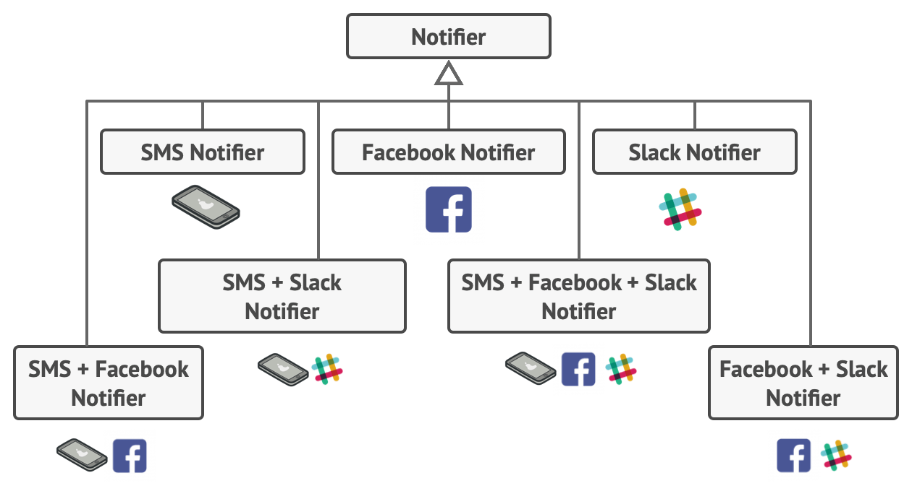
Комбинаторный взрыв подклассов при совмещении типов оповещений.

Итак, нужен какой-то другой способ комбинирования поведения объектов, который не приводит к взрыву количества подклассов.

### Решение

Наследование — это первое, что приходит в голову многим программистам, когда нужно расширить какое-то существующее поведение. Но механизм наследования имеет несколько досадных проблем.

+ Он статичен. Вы не можете изменить поведение существующего объекта. Для этого вам надо создать новый объект, выбрав другой подкласс.
+ Он не разрешает наследовать поведение нескольких классов одновременно. Из-за этого вам приходится создавать множество подклассов-комбинаций для получения совмещённого поведения.

Одним из способов обойти эти проблемы является замена наследования агрегацией либо композицией . Это когда один объект содержит ссылку на другой и делегирует ему работу, вместо того чтобы самому наследовать его поведение. Как раз на этом принципе построен паттерн Декоратор.

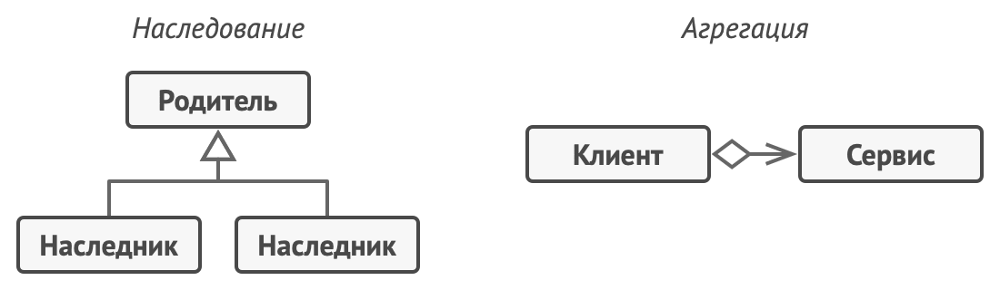
Наследование против Агрегации.

Декоратор имеет альтернативное название — обёртка. Оно более точно описывает суть паттерна: вы помещаете целевой объект в другой объект-обёртку, который запускает базовое поведение объекта, а затем добавляет к результату что-то своё.

Оба объекта имеют общий интерфейс, поэтому для пользователя нет никакой разницы, с каким объектом работать — чистым или обёрнутым. Вы можете использовать несколько разных обёрток одновременно — результат будет иметь объединённое поведение всех обёрток сразу.

В примере с оповещениями мы оставим в базовом классе простую отправку по электронной почте, а расширенные способы отправки сделаем декораторами.


Расширенные способы оповещения становятся декораторами.

Сторонняя программа, выступающая клиентом, во время первичной настройки будет заворачивать объект оповещений в те обёртки, которые соответствуют желаемому способу оповещения.


Программа может составлять составные объекты из декораторов.

Последняя обёртка в списке и будет тем объектом, с которым клиент будет работать в остальное время. Для остального клиентского кода, по сути, ничего не изменится, ведь все обёртки имеют точно такой же интерфейс, что и базовый класс оповещений.

Таким же образом можно изменять не только способ доставки оповещений, но и форматирование, список адресатов и так далее.
К тому же клиент может «дообернуть» объект любыми другими обёртками, когда ему захочется.

### Аналогия из жизни

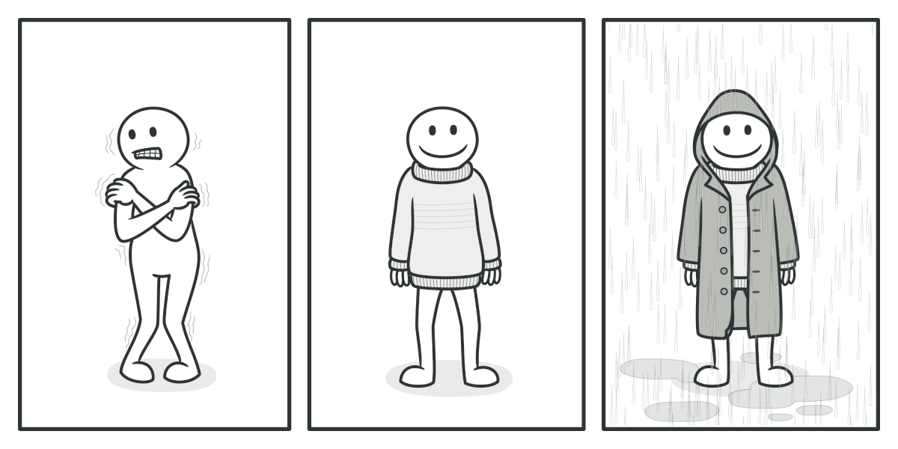
Одежду можно надевать слоями, получая комбинированный эффект.

Любая одежда — это аналог Декоратора. Применяя Декоратор, вы не меняете первоначальный класс и не создаёте дочерних классов. Так и с одеждой — надевая свитер, вы не перестаёте быть собой, но получаете новое свойство — защиту от холода. Вы можете пойти дальше и надеть сверху ещё один декоратор — плащ, чтобы защититься и от дождя.

### Структура


### Псевдокод

В этом примере Декоратор защищает финансовые данные дополнительными уровнями безопасности прозрачно для кода, который их использует.


Пример шифрования и компрессии данных с помощью обёрток.

Приложение оборачивает класс данных в шифрующую и сжимающую обёртки, которые при чтении выдают оригинальные данные, а при записи — зашифрованные и сжатые.

Декораторы, как и сам класс данных, имеют общий интерфейс. Поэтому клиентскому коду не важно, с чем работать — c «чистым» объектом данных или с «обёрнутым».

```
// Общий интерфейс компонентов.
interface DataSource is
    method writeData(data)
    method readData():data

// Один из конкретных компонентов реализует базовую
// функциональность.
class FileDataSource implements DataSource is
    constructor FileDataSource(filename) { ... }

    method writeData(data) is
        // Записать данные в файл.

    method readData():data is
        // Прочитать данные из файла.

// Родитель всех декораторов содержит код обёртывания.
class DataSourceDecorator implements DataSource is
    protected field wrappee: DataSource

    constructor DataSourceDecorator(source: DataSource) is
        wrappee = source

    method writeData(data) is
        wrappee.writeData(data)

    method readData():data is
        return wrappee.readData()

// Конкретные декораторы добавляют что-то своё к базовому
// поведению обёрнутого компонента.
class EncryptionDecorator extends DataSourceDecorator is
    method writeData(data) is
        // 1. Зашифровать поданные данные.
        // 2. Передать зашифрованные данные в метод writeData
        // обёрнутого объекта (wrappee).

    method readData():data is
        // 1. Получить данные из метода readData обёрнутого
        // объекта (wrappee).
        // 2. Расшифровать их, если они зашифрованы.
        // 3. Вернуть результат.

// Декорировать можно не только базовые компоненты, но и уже
// обёрнутые объекты.
class CompressionDecorator extends DataSourceDecorator is
    method writeData(data) is
        // 1. Запаковать поданные данные.
        // 2. Передать запакованные данные в метод writeData
        // обёрнутого объекта (wrappee).

    method readData():data is
        // 1. Получить данные из метода readData обёрнутого
        // объекта (wrappee).
        // 2. Распаковать их, если они запакованы.
        // 3. Вернуть результат.


// Вариант 1. Простой пример сборки и использования декораторов.
class Application is
    method dumbUsageExample() is
        source = new FileDataSource("somefile.dat")
        source.writeData(salaryRecords)
        // В файл были записаны чистые данные.

        source = new CompressionDecorator(source)
        source.writeData(salaryRecords)
        // В файл были записаны сжатые данные.

        source = new EncryptionDecorator(source)
        // Сейчас в source находится связка из трёх объектов:
        // Encryption > Compression > FileDataSource

        source.writeData(salaryRecords)
        // В файл были записаны сжатые и зашифрованные данные.


// Вариант 2. Клиентский код, использующий внешний источник
// данных. Класс SalaryManager ничего не знает о том, как именно
// будут считаны и записаны данные. Он получает уже готовый
// источник данных.
class SalaryManager is
    field source: DataSource

    constructor SalaryManager(source: DataSource) { ... }

    method load() is
        return source.readData()

    method save() is
        source.writeData(salaryRecords)
    // ...Остальные полезные методы...


// Приложение может по-разному собирать декорируемые объекты, в
// зависимости от условий использования.
class ApplicationConfigurator is
    method configurationExample() is
        source = new FileDataSource("salary.dat")
        if (enabledEncryption)
            source = new EncryptionDecorator(source)
        if (enabledCompression)
            source = new CompressionDecorator(source)

        logger = new SalaryManager(source)
        salary = logger.load()
    // ...
```

### Применимость

Когда вам нужно добавлять обязанности объектам на лету, незаметно для кода, который их использует.

Объекты помещают в обёртки, имеющие дополнительные поведения. Обёртки и сами объекты имеют одинаковый интерфейс, поэтому клиентам без разницы, с чем работать — с обычным объектом данных или с обёрнутым.

Когда нельзя расширить обязанности объекта с помощью наследования.

Во многих языках программирования есть ключевое слово final, которое может  заблокировать наследование класса. Расширить такие классы можно только с помощью Декоратора.

### Шаги реализации

1. Убедитесь, что в вашей задаче есть один основной компонент и несколько опциональных дополнений или надстроек над ним.
2. Создайте интерфейс компонента, который описывал бы общие методы как для основного компонента, так и для его дополнений.
3. Создайте класс конкретного компонента и поместите в него основную бизнес-логику.
4. Создайте базовый класс декораторов. Он должен иметь поле для хранения ссылки на вложенный объект-компонент. Все методы базового декоратора должны делегировать действие вложенному объекту.
5. И конкретный компонент, и базовый декоратор должны следовать одному и тому же интерфейсу компонента.
6. Теперь создайте классы конкретных декораторов, наследуя их от базового декоратора. Конкретный декоратор должен выполнять свою добавочную функцию, а затем (или перед этим) вызывать эту же операцию обёрнутого объекта.
7. Клиент берёт на себя ответственность за конфигурацию и порядок обёртывания объектов.

### Преимущества и недостатки

+ Большая гибкость, чем у наследования.
+ Позволяет добавлять обязанности на лету.
+ Можно добавлять несколько новых обязанностей сразу.
+ Позволяет иметь несколько мелких объектов вместо одного объекта на все случаи жизни.
+ Трудно конфигурировать многократно обёрнутые объекты.
+ Обилие крошечных классов.

### Отношения с другими паттернами

+ Адаптер предоставляет совершенно другой интерфейс для доступа к существующему объекту. С другой стороны, при использовании паттерна Декоратор интерфейс либо остается прежним, либо расширяется. Причём Декоратор поддерживает рекурсивную вложенность, чего не скажешь об Адаптере.
+ С Адаптером вы получаете доступ к существующему объекту через другой интерфейс. Используя Заместитель, интерфейс остается неизменным. Используя Декоратор, вы получаете доступ к объекту через расширенный интерфейс.
+ Декоратор и Заместитель имеют схожие структуры, но разные назначения. Они похожи тем, что оба построены на принципе композиции и делегируют работу другим объектам. Паттерны отличаются тем, что Заместитель сам управляет жизнью сервисного объекта, а обёртывание Декораторов контролируется клиентом.

## Заместитель

Также известен как: Proxy

### Суть паттерна

Заместитель — это структурный паттерн проектирования, который позволяет подставлять вместо реальных объектов специальные объекты-заменители. Эти объекты перехватывают вызовы к оригинальному объекту, позволяя сделать что-то до или после передачи вызова оригиналу.

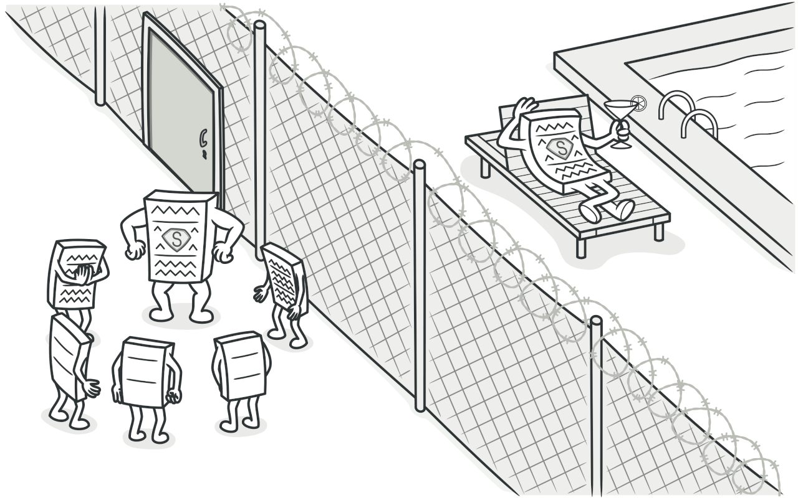

### Проблема

Для чего вообще контролировать доступ к объектам? Рассмотрим такой пример: у вас есть внешний ресурсоёмкий объект, который нужен не все время, а изредка.

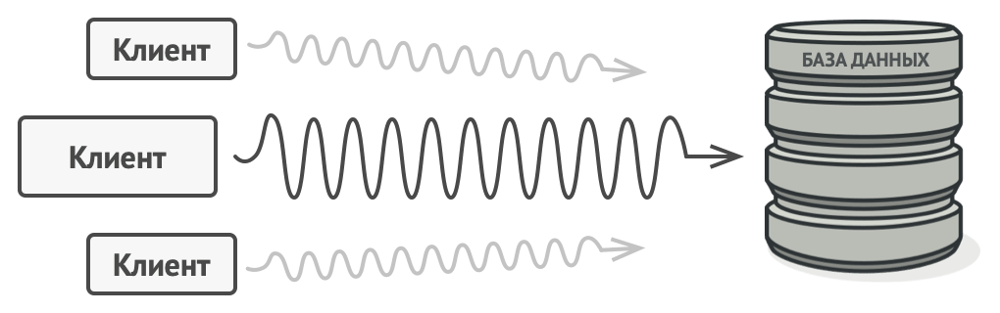
Запросы к базе данных могут быть очень медленными.

Мы могли бы создавать этот объект не в самом начале программы, а только тогда, когда он кому-то реально понадобится.
Каждый клиент объекта получил бы некий код отложенной инициализации. Но, вероятно, это привело бы к множественному дублированию кода.

В идеале, этот код хотелось бы поместить прямо в служебный класс, но это не всегда возможно. Например, код класса может находиться в закрытой сторонней библиотеке.

### Решение

Паттерн Заместитель предлагает создать новый класс-дублёр, имеющий тот же интерфейс, что и оригинальный служебный объект. При получении запроса от клиента объект-заместитель сам бы создавал экземпляр служебного объекта и переадресовывал бы ему всю реальную работу.

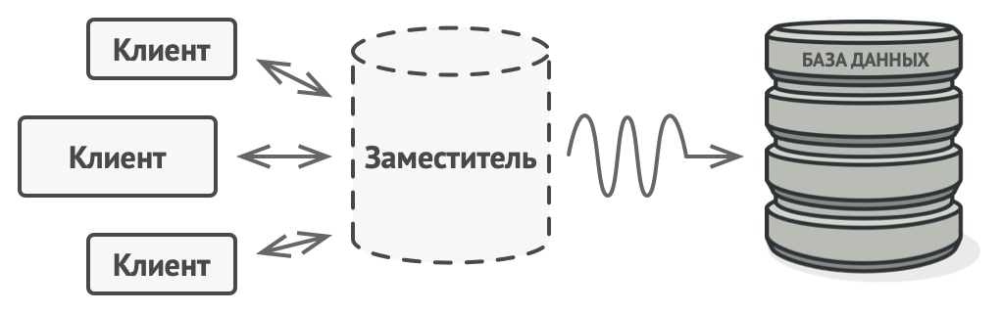

Заместитель «притворяется» базой данных, ускоряя работу за счёт ленивой инициализации и кеширования повторяющихся запросов.

Но в чём же здесь польза? Вы могли бы поместить в класс заместителя какую-то промежуточную логику, которая выполнялась бы до (или после) вызовов этих же методов в настоящем объекте. А благодаря одинаковому интерфейсу, объект-заместитель
можно передать в любой код, ожидающий сервисный объект.

### Аналогия из жизни

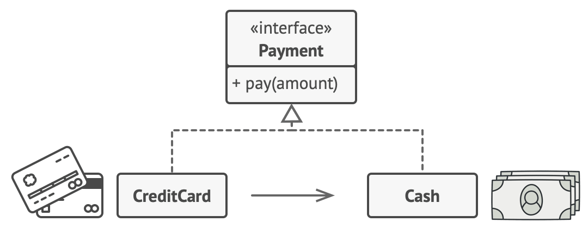
Платёжной картой можно расплачиваться, как и наличными.

Платёжная карточка — это заместитель пачки наличных. И карточка, и наличные имеют общий интерфейс — ими можно оплачивать товары. Для покупателя польза в том, что не надо таскать с собой тонны наличных, а владелец магазина рад, что ему не нужно делать дорогостоящую инкассацию наличности в банк — деньги поступают к нему на счёт напрямую.

### Структура


### Псевдокод

В этом примере Заместитель помогает добавить в программу механизм ленивой инициализации и кеширования результатов работы библиотеки интеграции с YouTube.


Пример кеширования результатов работы реального сервиса с помощью заместителя.

Оригинальный объект начинал загрузку по сети, даже если пользователь запрашивал одно и то же видео. Заместитель же загружает видео только один раз, используя для этого служебный объект, но в остальных случаях возвращает закешированный файл.

```
// Интерфейс удалённого сервиса.
interface ThirdPartyYouTubeLib is
    method listVideos()
    method getVideoInfo(id)
    method downloadVideo(id)

// Конкретная реализация сервиса. Методы этого класса
// запрашивают у YouTube различную информацию. Скорость запроса
// зависит не только от качества интернет-канала пользователя,
// но и от состояния самого YouTube. Значит, чем больше будет
// вызовов к сервису, тем менее отзывчивой станет программа.
class ThirdPartyYouTubeClass implements ThirdPartyYouTubeLib is
    method listVideos() is
        // Получить список видеороликов с помощью API YouTube.

    method getVideoInfo(id) is
        // Получить детальную информацию о каком-то видеоролике.

    method downloadVideo(id) is
        // Скачать видео с YouTube.

// С другой стороны, можно кешировать запросы к YouTube и не
// повторять их какое-то время, пока кеш не устареет. Но внести
// этот код напрямую в сервисный класс нельзя, так как он
// находится в сторонней библиотеке. Поэтому мы поместим логику
// кеширования в отдельный класс-обёртку. Он будет делегировать
// запросы к сервисному объекту, только если нужно
// непосредственно выслать запрос.
class CachedYouTubeClass implements ThirdPartyYouTubeLib is
    private field service: ThirdPartyYouTubeLib
    private field listCache, videoCache
    field needReset

    constructor CachedYouTubeClass(service: ThirdPartyYouTubeLib) is
        this.service = service

    method listVideos() is
        if (listCache == null || needReset)
            listCache = service.listVideos()
        return listCache

    method getVideoInfo(id) is
        if (videoCache == null || needReset)
            videoCache = service.getVideoInfo(id)
        return videoCache

    method downloadVideo(id) is
        if (!downloadExists(id) || needReset)
            service.downloadVideo(id)

// Класс GUI, который использует сервисный объект. Вместо
// реального сервиса, мы подсунем ему объект-заместитель. Клиент
// ничего не заметит, так как заместитель имеет тот же
// интерфейс, что и сервис.
class YouTubeManager is
    protected field service: ThirdPartyYouTubeLib

    constructor YouTubeManager(service: ThirdPartyYouTubeLib) is
        this.service = service

    method renderVideoPage(id) is
        info = service.getVideoInfo(id)
        // Отобразить страницу видеоролика.

    method renderListPanel() is
        list = service.listVideos()
        // Отобразить список превьюшек видеороликов.

    method reactOnUserInput() is
        renderVideoPage()
        renderListPanel()

// Конфигурационная часть приложения создаёт и передаёт клиентам
// объект заместителя.
class Application is
    method init() is
        YouTubeService = new ThirdPartyYouTubeClass()
        YouTubeProxy = new CachedYouTubeClass(YouTubeService)
        manager = new YouTubeManager(YouTubeProxy)
        manager.reactOnUserInput()
```

### Применимость

Ленивая инициализация (виртуальный прокси). Когда у вас есть тяжёлый объект, грузящий данные из файловой системы или базы данных.

Вместо того чтобы грузить данные сразу после старта программы, можно сэкономить ресурсы и создать объект тогда, когда он действительно понадобится.

Защита доступа (защищающий прокси). Когда в программе есть разные типы пользователей, и вам хочется защищать объект от неавторизованного доступа. Например, если ваши объекты — это важная часть операционной системы, а пользователи —
сторонние программы (хорошие или вредоносные).

Прокси может проверять доступ при каждом вызове и передавать выполнение служебному объекту, если доступ разрешён.

Локальный запуск сервиса (удалённый прокси). Когда настоящий сервисный объект находится на удалённом сервере.

В этом случае заместитель транслирует запросы клиента в вызовы по сети в протоколе, понятном удалённому сервису.

Логирование запросов (логирующий прокси). Когда требуется хранить историю обращений к сервисному объекту.

Заместитель может сохранять историю обращения клиента к сервисному объекту.

Кеширование объектов («умная» ссылка). Когда нужно кешировать результаты запросов клиентов и управлять их жизненным циклом.

Заместитель может подсчитывать количество ссылок на сервисный объект, которые были отданы клиенту и остаются активными.
Когда все ссылки освобождаются, можно будет освободить и сам сервисный объект (например, закрыть подключение к базе данных).

Кроме того, Заместитель может отслеживать, не менял ли клиент сервисный объект. Это позволит использовать объекты повторно и здóрово экономить ресурсы, особенно если речь идёт о больших прожорливых сервисах.

### Шаги реализации

1. Определите интерфейс, который бы сделал заместитель и оригинальный объект взаимозаменяемыми.
2. Создайте класс заместителя. Он должен содержать ссылку на сервисный объект. Чаще всего, сервисный объект создаётся самим заместителем. В редких случаях заместитель получает готовый сервисный объект от клиента через конструктор.
3. Реализуйте методы заместителя в зависимости от его предназначения. В большинстве случаев, проделав какую-то полезную работу, методы заместителя должны передать запрос сервисному объекту.
4. Подумайте о введении фабрики, которая решала бы, какой из объектов создавать — заместитель или реальный сервисный объект. Но, с другой стороны, эта логика может быть помещена в создающий метод самого заместителя.
5. Подумайте, не реализовать ли вам ленивую инициализацию сервисного объекта при первом обращении клиента к методам заместителя.

### Преимущества и недостатки

+ Позволяет контролировать сервисный объект незаметно для клиента.
+ Может работать, даже если сервисный объект ещё не создан.
+ Может контролировать жизненный цикл служебного объекта.
+ Усложняет код программы из-за введения дополнительных классов.
+ Увеличивает время отклика от сервиса.

### Отношения с другими паттернами

+ С Адаптером вы получаете доступ к существующему объекту через другой интерфейс. Используя Заместитель, интерфейс остается неизменным. Используя Декоратор, вы получаете доступ к объекту через расширенный интерфейс.
+ Фасад похож на Заместитель тем, что замещает сложную подсистему и может сам её инициализировать. Но в отличие от Фасада, Заместитель имеет тот же интерфейс, что его служебный объект, благодаря чему их можно взаимозаменять.
+ Декоратор и Заместитель имеют схожие структуры, но разные назначения. Они похожи тем, что оба построены на принципе композиции и делегируют работу другим объектам. Паттерны отличаются тем, что Заместитель сам управляет жизнью сервисного объекта, а обёртывание Декораторов контролируется клиентом.

### Заместитель на Java

Заместитель — это объект, который выступает прослойкой между клиентом и реальным сервисным объектом. Заместитель получает вызовы от клиента, выполняет свою функцию (контроль доступа, кеширование, изменение запроса и прочее), а затем
передаёт вызов сервисному объекту.

Заместитель имеет тот же интерфейс, что и реальный объект, поэтому для клиента нет разницы — работать через заместителя или напрямую.

Применимость: Паттерн Заместитель применяется в Java коде тогда, когда надо заменить настоящий объект его суррогатом, причём незаметно для клиентов настоящего объекта. Это позволит выполнить какие-то добавочные поведения до или после
основного поведения настоящего объекта.

Примеры Заместителя в стандартных библиотеках Java:

`java.lang.reflect.Proxy`
`java.rmi.*`
`javax.ejb.EJB (см. комментарии)`
`javax.inject.Inject (см. комментарии)`
`javax.persistence.PersistenceContext`

Признаки применения паттерна: Класс заместителя чаще всего делегирует всю настоящую работу своему реальному объекту.
Заместители часто сами следят за жизненным циклом своего реального объекта.

### Кеширующий заместитель

Этот пример показывает как с помощью Заместителя можно сделать более эффективной коммуникацию по сети с внешним видеосервисом, кешируя повторяющиеся запросы.

Заместитель особенно полезен, если у вас нет доступа к коду служебных классов, поведение которых хочется улучшить. Он позволяет изменить поведение реального объекта, прозрачно для клиентского кода. В этом примере заместитель и сам реальный объект взаимозаменяемы.

`some_cool_media_library`
`some_cool_media_library/ThirdPartyYouTubeLib.java: Интерфейс удалённого сервиса`

```java
package ru.proxy.example.some_cool_media_library;

import java.util.HashMap;

public interface ThirdPartyYouTubeLib {
    HashMap<String, Video> popularVideos();

    Video getVideo(String videoId);
}
```

`some_cool_media_library/ThirdPartyYouTubeClass.java: Реализация удалённого `сервиса

```java
package ru.proxy.example.some_cool_media_library;

import java.util.HashMap;

public class ThirdPartyYouTubeClass implements ThirdPartyYouTubeLib {

    @Override
    public HashMap<String, Video> popularVideos() {
        connectToServer("http://www.youtube.com");
        return getRandomVideos();
    }

    @Override
    public Video getVideo(String videoId) {
        connectToServer("http://www.youtube.com/" + videoId);
        return getSomeVideo(videoId);
    }

    // -----------------------------------------------------------------------
    // Fake methods to simulate network activity. They as slow as a real life.

    private int random(int min, int max) {
        return min + (int) (Math.random() * ((max - min) + 1));
    }

    private void experienceNetworkLatency() {
        int randomLatency = random(5, 10);
        for (int i = 0; i < randomLatency; i++) {
            try {
                Thread.sleep(100);
            } catch (InterruptedException ex) {
                ex.printStackTrace();
            }
        }
    }

    private void connectToServer(String server) {
        System.out.print("Connecting to " + server + "... ");
        experienceNetworkLatency();
        System.out.print("Connected!" + "\n");
    }

    private HashMap<String, Video> getRandomVideos() {
        System.out.print("Downloading populars... ");

        experienceNetworkLatency();
        HashMap<String, Video> hmap = new HashMap<String, Video>();
        hmap.put("catzzzzzzzzz", new Video("sadgahasgdas", "Catzzzz.avi"));
        hmap.put("mkafksangasj", new Video("mkafksangasj", "Dog play with ball.mp4"));
        hmap.put("dancesvideoo", new Video("asdfas3ffasd", "Dancing video.mpq"));
        hmap.put("dlsdk5jfslaf", new Video("dlsdk5jfslaf", "Barcelona vs RealM.mov"));
        hmap.put("3sdfgsd1j333", new Video("3sdfgsd1j333", "Programing lesson#1.avi"));

        System.out.print("Done!" + "\n");
        return hmap;
    }

    private Video getSomeVideo(String videoId) {
        System.out.print("Downloading video... ");

        experienceNetworkLatency();
        Video video = new Video(videoId, "Some video title");

        System.out.print("Done!" + "\n");
        return video;
    }

}
```

`some_cool_media_library/Video.java: Видеофайл`

```java
package ru.proxy.example.some_cool_media_library;

public class Video {
    public String id;
    public String title;
    public String data;

    Video(String id, String title) {
        this.id = id;
        this.title = title;
        this.data = "Random video.";
    }

}
```

`proxy`
`proxy/YouTubeCacheProxy.java: Сервисный класс для работы с кешем`

```java
package ru.proxy.example.proxy;

import ru.proxy.example.some_cool_media_library.ThirdPartyYouTubeClass;
import ru.proxy.example.some_cool_media_library.ThirdPartyYouTubeLib;
import ru.proxy.example.some_cool_media_library.Video;

import java.util.HashMap;

public class YouTubeCacheProxy implements ThirdPartyYouTubeLib {
    private ThirdPartyYouTubeLib youtubeService;
    private HashMap<String, Video> cachePopular = new HashMap<String, Video>();
    private HashMap<String, Video> cacheAll = new HashMap<String, Video>();

    public YouTubeCacheProxy() {
        this.youtubeService = new ThirdPartyYouTubeClass();
    }

    @Override
    public HashMap<String, Video> popularVideos() {
        if (cachePopular.isEmpty()) {
            cachePopular = youtubeService.popularVideos();
        } else {
            System.out.println("Retrieved list from cache.");
        }
        return cachePopular;
    }

    @Override
    public Video getVideo(String videoId) {
        Video video = cacheAll.get(videoId);
        if (video == null) {
            video = youtubeService.getVideo(videoId);
            cacheAll.put(videoId, video);
        } else {
            System.out.println("Retrieved video '" + videoId + "' from cache.");
        }
        return video;
    }

    public void reset() {
        cachePopular.clear();
        cacheAll.clear();
    }

}
```

`downloader`
`downloader/YouTubeDownloader.java: Загрузчик файлов`

```java
package ru.proxy.example.downloader;

import ru.proxy.example.some_cool_media_library.ThirdPartyYouTubeLib;
import ru.proxy.example.some_cool_media_library.Video;

import java.util.HashMap;

public class YouTubeDownloader {
    private ThirdPartyYouTubeLib api;

    public YouTubeDownloader(ThirdPartyYouTubeLib api) {
        this.api = api;
    }

    public void renderVideoPage(String videoId) {
        Video video = api.getVideo(videoId);
        System.out.println("\n-------------------------------");
        System.out.println("Video page (imagine fancy HTML)");
        System.out.println("ID: " + video.id);
        System.out.println("Title: " + video.title);
        System.out.println("Video: " + video.data);
        System.out.println("-------------------------------\n");
    }

    public void renderPopularVideos() {
        HashMap<String, Video> list = api.popularVideos();
        System.out.println("\n-------------------------------");
        System.out.println("Most popular videos on YouTube (imagine fancy HTML)");
        for (Video video : list.values()) {
            System.out.println("ID: " + video.id + " / Title: " + video.title);
        }
        System.out.println("-------------------------------\n");
    }

}
```

`Demo.java: Клиентский код`

```java
package ru.proxy.example;

import ru.proxy.example.downloader.YouTubeDownloader;
import ru.proxy.example.proxy.YouTubeCacheProxy;
import ru.proxy.example.some_cool_media_library.ThirdPartyYouTubeClass;

public class Demo {

    public static void main(String[] args) {
        YouTubeDownloader naiveDownloader = new YouTubeDownloader(new ThirdPartyYouTubeClass());
        YouTubeDownloader smartDownloader = new YouTubeDownloader(new YouTubeCacheProxy());

        long naive = test(naiveDownloader);
        long smart = test(smartDownloader);
        System.out.print("Time saved by caching proxy: " + (naive - smart) + "ms");

    }

    private static long test(YouTubeDownloader downloader) {
        long startTime = System.currentTimeMillis();

        // User behavior in our app:
        downloader.renderPopularVideos();
        downloader.renderVideoPage("catzzzzzzzzz");
        downloader.renderPopularVideos();
        downloader.renderVideoPage("dancesvideoo");
        // Users might visit the same page quite often.
        downloader.renderVideoPage("catzzzzzzzzz");
        downloader.renderVideoPage("someothervid");

        long estimatedTime = System.currentTimeMillis() - startTime;
        System.out.print("Time elapsed: " + estimatedTime + "ms\n");
        return estimatedTime;
    }

}
```

```
OutputDemo.txt: Результат выполнения
Connecting to http://www.youtube.com... Connected!
Downloading populars... Done!

-------------------------------
Most popular videos on YouTube (imagine fancy HTML)
ID: sadgahasgdas / Title: Catzzzz.avi
ID: asdfas3ffasd / Title: Dancing video.mpq
ID: 3sdfgsd1j333 / Title: Programing lesson#1.avi
ID: mkafksangasj / Title: Dog play with ball.mp4
ID: dlsdk5jfslaf / Title: Barcelona vs RealM.mov
-------------------------------

Connecting to http://www.youtube.com/catzzzzzzzzz... Connected!
Downloading video... Done!

-------------------------------
Video page (imagine fancy HTML)
ID: catzzzzzzzzz
Title: Some video title
Video: Random video.
-------------------------------

Connecting to http://www.youtube.com... Connected!
Downloading populars... Done!

-------------------------------
Most popular videos on YouTube (imagine fancy HTML)
ID: sadgahasgdas / Title: Catzzzz.avi
ID: asdfas3ffasd / Title: Dancing video.mpq
ID: 3sdfgsd1j333 / Title: Programing lesson#1.avi
ID: mkafksangasj / Title: Dog play with ball.mp4
ID: dlsdk5jfslaf / Title: Barcelona vs RealM.mov
-------------------------------

Connecting to http://www.youtube.com/dancesvideoo... Connected!
Downloading video... Done!

-------------------------------
Video page (imagine fancy HTML)
ID: dancesvideoo
Title: Some video title
Video: Random video.
-------------------------------

Connecting to http://www.youtube.com/catzzzzzzzzz... Connected!
Downloading video... Done!

-------------------------------
Video page (imagine fancy HTML)
ID: catzzzzzzzzz
Title: Some video title
Video: Random video.
-------------------------------

Connecting to http://www.youtube.com/someothervid... Connected!
Downloading video... Done!

-------------------------------
Video page (imagine fancy HTML)
ID: someothervid
Title: Some video title
Video: Random video.
-------------------------------

Time elapsed: 9354ms
Connecting to http://www.youtube.com... Connected!
Downloading populars... Done!

-------------------------------
Most popular videos on YouTube (imagine fancy HTML)
ID: sadgahasgdas / Title: Catzzzz.avi
ID: asdfas3ffasd / Title: Dancing video.mpq
ID: 3sdfgsd1j333 / Title: Programing lesson#1.avi
ID: mkafksangasj / Title: Dog play with ball.mp4
ID: dlsdk5jfslaf / Title: Barcelona vs RealM.mov
-------------------------------

Connecting to http://www.youtube.com/catzzzzzzzzz... Connected!
Downloading video... Done!

-------------------------------
Video page (imagine fancy HTML)
ID: catzzzzzzzzz
Title: Some video title
Video: Random video.
-------------------------------

Retrieved list from cache.

-------------------------------
Most popular videos on YouTube (imagine fancy HTML)
ID: sadgahasgdas / Title: Catzzzz.avi
ID: asdfas3ffasd / Title: Dancing video.mpq
ID: 3sdfgsd1j333 / Title: Programing lesson#1.avi
ID: mkafksangasj / Title: Dog play with ball.mp4
ID: dlsdk5jfslaf / Title: Barcelona vs RealM.mov
-------------------------------

Connecting to http://www.youtube.com/dancesvideoo... Connected!
Downloading video... Done!

-------------------------------
Video page (imagine fancy HTML)
ID: dancesvideoo
Title: Some video title
Video: Random video.
-------------------------------

Retrieved video 'catzzzzzzzzz' from cache.

-------------------------------
Video page (imagine fancy HTML)
ID: catzzzzzzzzz
Title: Some video title
Video: Random video.
-------------------------------

Connecting to http://www.youtube.com/someothervid... Connected!
Downloading video... Done!

-------------------------------
Video page (imagine fancy HTML)
ID: someothervid
Title: Some video title
Video: Random video.
-------------------------------

Time elapsed: 5875ms
Time saved by caching proxy: 3479ms
```

### [Назад к оглавлению](../../../../README.md)
