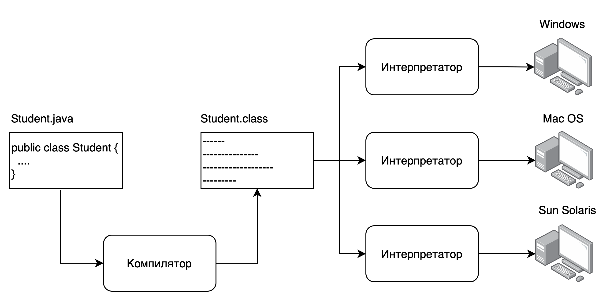

# Введение в платформу Java

## Как код становится программой?

`КОД -> ИСПОЛНЯЕМЫЙ МОДУЛЬ`

* [_Исходный код_](https://ru.wikipedia.org/wiki/Исходный_код) - текст компьютерной программы на каком-либо языке
  программирования или языке разметки, который может быть прочтён человеком

* [_Исполняемый модуль_](http://wp.wiki-wiki.ru/wp/index.php/Исполнимый_модуль) - файл, содержащий программу в виде, в
  котором она может быть исполнена компьютером.

* [_Транслятор_](https://ru.wikipedia.org/wiki/Транслятор) - программа, которая преобразует программу с одного языка
  программирования, в программу на другом языке.

* [_Компилятор_](https://ru.wikipedia.org/wiki/Компилятор) - программа, переводящая текст, написанный на языке
  программирования, в набор машинных кодов

* [_Интерпретатор_](https://ru.wikipedia.org/wiki/Интерпретатор) - программа, выполняющая построчный анализ, обработку и
  выполнение исходного кода программы или запроса, в отличие от компиляции, где весь текст программы, перед запуском
  анализируется и транслируется в машинный или байт-код без её выполнения (Python, JavaScript, PHP).

В чем разница? В компилируемых языках программа сразу после компиляции становится исполняемой, в интерпретируемых языках

- в процессе запуска. Программы компилируемые работают быстрее, чем интерпретируемые.

Для чего нам нужны интерпретируемые? Потому что машинный код у каждой архитектуры ЭВМ свой. Поэтому, если вы
скомпилировали программу для архитектуры Intel, то она может не заработать на AMD. Поэтому для каждого типа архитектуры
нужно программу заново компилировать.

В интерпретируемых языках проблема решена с помощью создания интерпретаторов для всех типов архитектур. Таким образом,
мы достигаем кроссплатформенности, один и тот же код работает везде без необходимости перекомпилировать его.

* Смешанный вариант - хотим обеспечить скорость работы программы и кроссплатформенность - `Java`. Изначально программа
  _компилируется_ в байт-код (`.class`). Байт-код - это код виртуальной машины `Java` и он одинаковый для всех типов
  JVM. В свою очередь, под каждую архитектуру существует свой вариант `JVM` и поэтому мы достигаем
  кросс-платформенности.
  _Байт-код_ - оптимизированный код, поэтому он выполняется быстрее, чем в случае с обычной _интерпретацией_.

* `JVM` - виртуальная машина `Java`, `эмулирует операционную систему и железо`. Программы на `Java` запускаются внутри
  этой изолированной среды.



## Переменные и типы данных

Переменные представляют собой зарезервированную область памяти для хранения данных.

В Java существует две группы типов данных:

- Примитивные
- Ссылочные

Существует 8 примитивных типов данных:

Тип | Описание                                                                              | Возможные значения                                  | Пример
--- |---------------------------------------------------------------------------------------|-----------------------------------------------------|----------------------------
`byte` | 8-битное знаковое целое число                                                         | от -128 до 127                                      | `byte val = -120;`
`short` | 16-битное знаковое целое число                                                        | от -32768 до 32767                                  | `short val = 12442;`
`int` | 32-битное знаковое целое число                                                        | от -2147483648 до 2147483647                        | `int val = 1000;`
`long` | 64-битное знаковое целое число                                                        | от -9223372036854775808 <br/>до 9223372036854775807 | `long val = 200000L;`
`float` | 32-битное знаковое число с плавающей <br/>запятой одинарной точности                  |                                                     | `float val = 12.23f;`
`double` | 64-битное знаковое число с плавающей <br/>запятой двойной точности                    |                                                     | `double val = -123.123;`
`char` | 16-битный тип данных, предназначенный для <br/>хранения символов в кодировке Unicode  | от '\u0000' или 0 <br/>до '\uffff' или 65,535       | `char val1 = ‘*’;`
`boolean` | логический тип данных                                                                 | false, true                                         | `boolean val = false;`

Имена переменных должны быть написаны в _camelCase_ - первая буква строчная, каждое следующее слово в имени с заглавной
буквы и без нижних подчеркиваний или пробелов.

Правильные имена:
`floatValue, name, enginePower, firstName, lastName;`

Неправильные имена:
`Name, Title, EnginePower, First_name, last_name`

Имя переменной не должно начинаться со специального символа (кроме нижнего подчеркивания) или цифры.

## Арифметические операции

Операция | Описание
--- | ----
`+` | Сложение
`-` | Вычитание
`*` | Умножение
`/` | Деление
`%` | Деление по модулю
`++` | Инкремент (приращение на 1)
`+=` | Сложение с присваиванием
`-=` | Вычитание с присваиванием
`*=`| Умножение с присваиванием
`/=` | Деление с присваиванием
`%=` | Деление по модулю с присваиванием
`--` | Декремент (отрицательное приращение на 1)

## Методы

Именованный блок кода, к которому можно обратиться по названию. Значение возвращается туда, откуда был вызван метод.

Общая форма объявления метода выглядит следующим образом:

```java
тип_возвращаемого_методом_значения имя_метода(список_аргументов){
        тело_метода;
        }
```

Тип_возвращаемого_методом_значения обозначает конкретный тип данных (`int`, `float`, `char`, `boolean`, `String` и т.д.)
, возвращаемых методом. Если метод ничего не должен возвращать, указывается ключевое слово `void`. Для возврата значения
из метода используется оператор `return`.

```java
return значение;
```

Для указания имени метода служит идентификатор «имя». Список аргументов обозначает последовательность
пар `тип_данных + идентификатор`, разделенных запятыми. По существу, аргументы это набор данных, необходимых для работы
метода. Если для работы метода не требуются аргументы, то оставляются пустые скобки - ().

См. примеры `src/Methods.java`

## Условный оператор if

Условный оператор if позволяет выборочно выполнять отдельные части программы.

```
if (условие) {
  последовательность_операторов;
}
```

Если `условие` истинно `true`, последовательность операторов выполняется, если ложно `false` – не выполняется.

Доступные следующие операторы сравнения:

Оператор | Значение
--- | ----
`<` | Меньше
`<=` | Меньше или равно
`\>` | Больше
`>=` | Больше или равно
`==` | Равно
`!=` | Не равно

Блок `if-else`: Если условие верно, выполняется `последовательность_операторов_1`, если нет –
`последовательность_операторов_2`.

```
if (условие) {
  последовательность операторов 1
} else {
  последовательность операторов 2
}
```

При использовании условий можно составлять более сложные конструкции с помощью логических операторов И(`&&`) и ИЛИ(`||`)
.

```java
if(условие1&&условие2){
        //...
        }
        if(условие1||условие2){
        //...
        }
        if((условие1&&условие2)||условие3){
        //...
        }
```

### Алгебра логики

Отрицание

A | не A
--- | ----
0   | 1
1   | 0

Конъюнкция (логическое умножение, логическое И)

A | B   | A и B
--- |-----| -----
0 | 0   |  0
0 | 1   |  0
1 | 0   |  0
1 | 1   |  1

Дизъюнкция (логическое сложение, логическое ИЛИ)

A | B   | A или B
--- |-----| ----
0 | 0   |  0
0 | 1   |  1
1 | 0   |  1
1 | 1   |  1

См. примеры `src/IfElse.java`