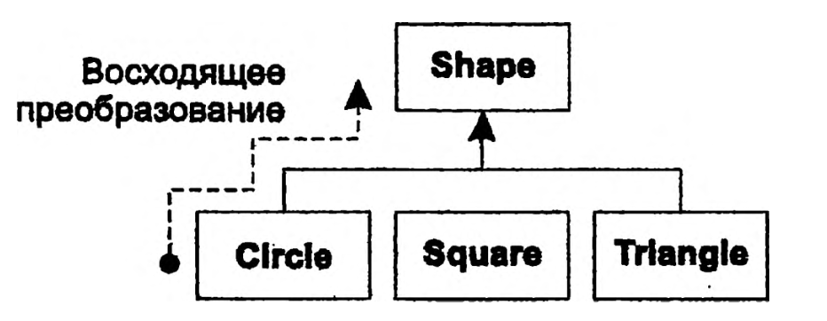

# Введение в объекты:
***
Данный модуль содержит общие представления об ООП. Если вы не воспринимаете общей картины до тех пор, пока не увидите
детально как все работает, можете сразу перейти к следующей главе.

Позже все равно придется вернуться к данной главе, чтобы понять, почему так важны объекты и какое место они занимают при
проектировании программ.

## Объектно ориентированный подход
***
Позволяет представить задачу в пространстве путем введения "объектов". Объект обладает

1. Состоянием - внутренние данные
2. Поведением - методы
3. Индивидуальностью - уникальным адресом в памяти.

## Объект обладает интерфейсом
***
Объекты, идентичные во всем, кроме внутреннего состояния во время работы программы, группируются в _классы
объектов_ `class`.

Абстрактные типы данных действуют почти так же, как и встроенные типы: вы можете создавать переменные типов
(называемые объектами) и манипулировать ими (что называется посылкой сообщений; вы производите запрос, и объект решает,
что с ним делать).

Каждый объект принадлежит к определенному АТД или `class`, который определяет его характеристики и поведение. Когда
видите слово _класс_, думайте _тип_, и наоборот.

Каждый объект умеет выполнять только определенный круг запросов. Запросы, которые вы можете посылать объекту,
определяются его интерфейсом, причем интерфейс объекта определяется его типом.


```java
Light lt = new Light();
lt.on();
```

Интерфейс определяет, с какими запросами можно обращаться к определенному объекту. Однако где-то должен существовать и 
код, выполняющий запросы. Этот код наряду со скрытыми данными составляет реализацию. 

В данном примере существует тип/класс с именем `Light` (лампа), конкретный объект типа `Light` с именем `lt`, и класс 
поддерживает различные запросы к объекту `Light`: выключить лампочку, включить, сделать ярче или притушить. 
Вы создаете объект `Light`, определяя «ссылку» на него `lt` и вызывая оператор new для создания нового экземпляра этого типа. 
Чтобы послать сообщение объекту, следует указать имя объекта и связать его с помощью точки с нужным запросом.

---

- [Абстра́ктный тип да́нных(АТД)](https://ru.wikipedia.org/wiki/Абстрактный_тип_данных) — это математическая модель для
  типов данных, где тип данных определяется поведением (семантикой)с точки зрения пользователя данных, а именно в
  терминах возможных значений, возможных операций над данными этого типа и поведения этих операций.

- Некоторые специалисты различают эти два понятия: они считают, что тип определяет интерфейс, а класс — конкретную
  реализацию этого интерфейса.

## Скрытая реализация
***
Программистов имеет смысл разделить на создателей классов и программистов-клиентов. Цель вторых — собрать как можно 
больше классов, чтобы заниматься быстрой разработкой программ. Цель создателя класса — построить класс, открывающий 
только то, что необходимо программисту-клиенту, и скрывающий все остальное. 

Есть две основные причины для ограничения доступа:
1. Необходимость уберечь «хрупкие» детали от программиста-клиента — части внутренней «кухни», не являющиеся составляющими 
интерфейса, при помощи которого пользователи решают свои задачи.
2. Стремление позволить разработчику библиотеки изменить внутренние механизмы класса, не беспокоясь о том, как это 
отразится на программисте-клиенте.

Java использует три явных ключевых слова, характеризующих уровень доступа: public, private и protected, также есть 
доступ по умолчанию: default - доступом в пределах пакета.

## Повторное использование реализации
***
Многократное использование кода — одно из самых впечатляющих преимуществ объектно-ориентированных языков. Есть
несколько способов для повторного использования кода:
1. Композиция - размещение объекта внутрь нового класса
2. Наследование - создание класса на основе другого класса

### Композиция
***
Новый класс может содержать любое количество объектов других типов. Композицию часто называют связью типа 
«содержит» (has-a), как, например, в предложении «машина содержит двигатель».

Композиция — очень гибкий инструмент. Объекты-члены вашего нового класса обычно объявляются закрытыми (private), что делает 
их недоступными для программистов-клиентов. Это позволяет вносить изменения в эти объекты-члены без модификации уже 
существующего клиентского кода. Вы можете также изменять эти члены во время исполнения программы, чтобы динамически 
управлять поведением вашей программы.

### Наследование
***
Не имеет такой гибкости, так как компилятор накладывает определенные ограничения на классы, созданные с применением наследования.
При создании новых классов прежде всего следует оценить возможность композиции, так как она проще и гибче.

Было бы неэффективно создавать какой-то класс, а потом проделывать всю работу заново для похожего класса. Гораздо 
рациональнее взять готовый класс, «клонировать» его, а затем внести добавления и обновления в полученном клоне. Если 
базовый (родительский) класс изменяется, то все изменения отражаются и на его производном (дочернем) классе.

Базовый тип содержит все характеристики и действия, общие для всех типов, производных от него. Вы создаете базовый тип, 
чтобы заложить основу своего представления о каких-то объектах в вашей системе. От базового типа порождаются другие типы, 
выражающие другие реализации этой сущности.

Используя наследование от существующего типа, вы создаете новый тип. Этот новый тип содержит не только все члены 
существующего типа (хотя члены со спецификатором `private` скрыты и недоступны), но, что еще важнее, повторяет интерфейс 
базового класса. Значит, все сообщения, которые вы могли посылать базовому классу, также можно посылать и производному 
классу. А так как мы различаем типы классов по совокупности сообщений, которые можем им посылать, это означает, что 
производный класс является частным случаем базового класса.

Эквивалентность типов, достигаемая при наследовании, является одним из основополагающих условии понимания смысла 
объектно-ориентированного программирования.

Существует два способа изменения нового класса по сравнению с базовым классом:
1. Расширение производного класса новыми методами.
2. Изменение поведения уже существующих методов базового класса (переопределение).

## Взаимозаменяемые объекты и полиморфизм
***
При использовании иерархий типов часто приходится обращаться с объектом определенного типа как с базовым типом. Это 
позволяет писать код, не зависящий от конкретных типов.

Когда посылается сообщение, программист и не хочет знать, какой код выполняется, объект сам выполнит верный код, 
зависящий от его характерного типа. Если компилятор не обладает информацией, какой именно код следует выполнить, что же он делает?

Для решения этой задачи языки объектно-ориентированного программирования используют концепцию _позднего связывания_. 
Когда вы посылаете сообщение объекту, вызываемый код неизвестен вплоть до времени исполнения. Компилятор лишь 
убеждается в том, что метод существует, проверяет типы для его параметров и возвращаемого значения, но не имеет 
представления, какой именно код будет исполняться.

Для осуществления _позднего связывания_ Java вместо абсолютного вызова использует специальные фрагменты кода. 
Этот код вычисляет адрес тела метода на основе информации, хранящейся в объекте. 

```java
void doSomething(Shape shape) {
    shape.erase(); // стереть
    // ...
    shape.draw(); // нарисовать
}

Circle circle = new Circle(); // окружность 
Triangle triangle = new Triangle(); // треугольник 
Line line = new Line(); // линия
doSomething(circle);
doSomething(triangle);
doSomething(line);
```

Вызовы метода `doSomething()` автоматически работают правильно, вне зависимости от фактического типа объекта. 
На самом деле это довольно важный факт. Рассмотрим строку: `doSomething(c)j`

Здесь происходит следующее: методу, ожидающему объект `Shape`, передается объект «окружность» `Circle`. Так как 
окружность `Circle` одновременно является фигурой `Shape`, то метод `doSomething()` и обращается с ней как с фигурой. 
Другими словами, любое сообщение, которое метод может послать `Shape`, также принимается и `Circle`. Это действие совершенно 
безопасно и настолько же логично.

Мы называем этот процесс обращения с производным типом как с базовым восходящим преобразованием типов. Слово 
преобразование означает, что объект трактуется как принадлежащий к другому типу, а восходящее оно потому, что на 
диаграммах наследования базовые классы обычно располагаются вверху, а производные классы располагаются внизу «веером». 
Значит, преобразование к базовому типу — это движение по диаграмме вверх, и поэтому оно «восходящее».




При вызовах функций, созданных не ООП-компилятором, используется _раннее связывание_. При раннем связывании
компилятор генерирует вызов функции с указанным именем, а компоновщик привязывает этот вызов к абсолютному адресу кода, 
который необходимо выполнить.


## Однокорневая иерархия
***
В основе всей иерархии типов лежит единый базовый класс Object. Оказалось, что однокорневая иерархия имеет множество преимуществ.
1. Все объекты имеют некий общий интерфейс
2. Все объекты гарантированно обладают некоторой общей функциональностью.
3. Позволяет гораздо проще реализовать уборку мусора

## Создание и время жизни объектов
***
B Java используется динамическое создание объектов в области памяти, называемой кучей _heap_. Это определяется во время 
работы программы. Если вам понадобится новый объект, вы просто создаете его в куче используется ключевое слово `new`. 
Так как управление кучей осуществляется динамически, во время исполнения программы на выделение памяти из кучи требуется 
гораздо больше времени, чем при выделении памяти в стеке.

Для контролирования жизни объекта в Java существует механизм, называемый _уборкой мусора_. Уборщик мусора «знает», когда 
объект перестает использоваться, и использует свои знания для автоматического освобождения памяти.

## Обработка исключений: борьба с ошибками
***

Исключение представляет собой объект, генерируемый на месте возникновении ошибки, который затем может быть «перехвачен» 
подходящим обработчиком исключений, предназначенным для ошибок определенного типа. Обработка исключений словно определяет 
параллельный путь выполнения программы, вступающий в силу, когда что-то идет не по плану.

Исключения дают возможность восстановить нормальную работу программы после неверной операции.

## Параллельное выполнение

Раздельно выполняемые части программы называются потоками, а весь принцип получил название _многозадачности_, или 
_параллельных вычислений_.

Часто встречающийся пример многозадачности — пользовательский интерфейс. В программе, разбитой на потоки, пользователь 
может нажать кнопку и получить быстрый ответ, не ожидая, пока программа завершит текущую операцию.

Обычно задачи всего лишь определяют схему распределения времени на однопроцессорном компьютере. Но если операционная 
система поддерживает многопроцессорную обработку, каждая задача может быть назначена на отдельный процессор; 
так достигается настоящий параллелизм.

Но тут кроется подвох: совместно используемые ресурсы. Если несколько потоков пытаются одновременно получить доступ к 
одному ресурсу, возникнут проблемы. Например, два процесса не могут одновременно посылать информацию на принтер. 
Для предотвращения конфликта совместные ресурсы (такие, как принтер) должны блокироваться во время использования. 
Поток блокирует ресурс, завершает свою операцию, а затем снимает блокировку для того, чтобы кто-то еще смог получить доступ к ресурсу.

## Java и Интернет

### Что такое Web?

#### Вычисления «клиент сервер»

Основная идея клиент — серверных систем состоит в том, что у вас существует централизованное хранилище информации — 
обычно в форме базы данных — и эта информация доставляется по запросам каких-либо групп людей или компьютеров. 
В системе «клиент-сервер» ключевая роль отводится централизованному хранилищу информации, которое обычно позволяет 
изменять данные так, что эти изменения будут быстро переданы пользователям информации. Все вместе: хранилище информации, 
программы, распределяющие информацию, и компьютер, на котором хранятся программы и данные, называется _сервером_. 
Программное обеспечение на машине пользователя, которое устанавливает связь с сервером, получает информацию, обрабатывает 
ее и затем отображает соответствующим образом, называется _клиентом_.

#### Web как гигантский сервер

### Программирование на стороне клиента

#### Языки сценариев

#### Java

#### Интернет и интрасети

### Программирование на стороне сервера

## Резюме